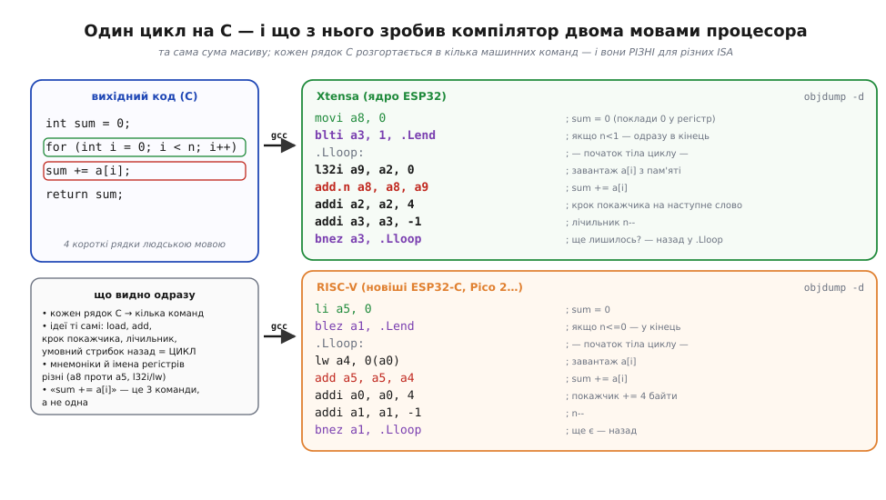
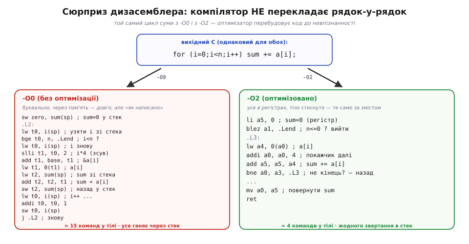

# ⚙️ Читаємо дизасемблер: що компілятор зробив із вашим циклом

> Алгоритмічна вставка до теми про [набір інструкцій (ISA)](book:programming/isa) — мову процесора. Команда там — це **число з полів**, а **асемблер** — той самий машинний код, лише записаний словами. Тут перевіримо це **на живому коді**: візьмемо звичайний цикл на C, попросимо інструмент `objdump` показати, на які саме команди ISA його переклав компілятор, — і навчимося ці рядки читати. Це і є місток від «мова процесора існує» до «ось вона, я її бачу».

### Задача

Ви написали кілька рядків на C — скажімо, цикл, що додає елементи масиву. Компілятор мовчки перетворив їх на машинний код під вашу ISA (Xtensa на класичному ESP32 чи RISC-V на новіших ESP32-C), і саме ці числа-команди лежать у прошивці й [виконуються процесором крок за кроком](book:programming/fetch-decode-execute). Питання просте й дуже практичне: **що там насправді опинилося?** Скільки команд вийшло з одного рядка? Чи зробив компілятор те, що ви думали, — чи переписав усе по-своєму? Без відповіді налагодження на низькому рівні лишається грою наосліп.

Дістати цю відповідь дає **дизасемблер** — програма, що робить зворотне до [асемблера](book:programming/isa): читає байти-команди з готового файлу й друкує їх людськими мнемоніками. Канонічний інструмент тут — `objdump` із пакета GNU binutils; виклик `objdump -d ваш_файл.elf` друкує **дизасембльований** код. Наша задача — не написати дизасемблер (він уже є), а **навчитися читати** його вивід.

### Ідея

Найкорисніше почати з того, що один рядок C — це **майже ніколи не одна команда**. Кожен рядок розгортається в кілька примітивів ISA з тих самих чотирьох [родин команд](book:programming/isa): завантажити з пам'яті, порахувати в АЛП, крокнути покажчик, перевірити умову, стрибнути. Ось той самий цикл суми, перекладений під дві ISA поряд.


*Зліва — чотири рядки C; справа — на що їх перетворив компілятор для Xtensa (ядро ESP32) і для RISC-V. Структура та сама й упізнавана: покласти 0 у регістр-суматор, у тілі — **завантажити** a[i] (`l32i`/`lw`), **додати** до суми (`add.n`/`add`), **зсунути** покажчик на наступне слово (`addi …, 4`), зменшити лічильник і **умовним стрибком** (`bnez`) повернутися на початок — це і є цикл. Мнемоніки й імена регістрів різняться (a8 проти a5, `l32i` проти `lw`), бо це різні мови, але ідеї спільні. Зверніть увагу: рядок `sum += a[i]` — це аж **три** команди, а не одна.*

Тепер навчимося читати **один** рядок дизасемблера. Кожен рядок `objdump` має кілька колонок, і коли знаєш, що в кожній, він перестає лякати.


*Чотири колонки одного рядка. **Адреса** — де команда лежить у пам'яті (саме сюди вказував [PC](book:programming/processor-parts)). **Байти команди** — те саме число, що в пам'яті; це його [декодер ріже на поля](book:programming/isa). **Мнемоніка** — opcode людськими словами (`add` = додати). **Операнди** — над чим (`a0, a0, a1` означає a0 = a0 + a1). Для RISC-V команда `add a0,a0,a1` — це рівно число **0x00b50533**: команда — число, а асемблер — його читабельний правопис, один-в-один.*

Є й важливий сюрприз. Компілятор перекладає не рядок-у-рядок, а **за змістом**: він вільний переставляти, викидати й зливати команди, аби лиш результат був той самий. Тому з рівнем оптимізації той самий код виглядає геть по-різному.


*Зліва — без оптимізації (-O0): компілятор перекладає буквально, ганяючи кожну змінну через стек, — тіло циклу пухне до півтора десятка команд. Справа — з -O2: усе живе в регістрах, тіло стиснуте до чотирьох команд, зайві походи в пам'ять зникли. Код **той самий за змістом**, але невпізнанний на вигляд. Звідси правило: дизасемблюючи, завжди знайте, з яким рівнем оптимізації зібрано, — інакше шукатимете в коді рядки, яких оптимізатор давно позбувся.*

### Псевдокод

Сам прохід «прочитати дизасемблер» — це не магія, а коротка послідовність дій. Ось вона як алгоритм, який ви щоразу проганяєте в голові, дивлячись на вивід `objdump`.

```
1. зібрати із символами (-g):          gcc -g -O2 prog.c -o prog.elf
2. вивести дизасемблер:                objdump -d prog.elf
   (часто корисно -S — перемежати з рядками C: objdump -d -S)
3. знайти потрібну функцію за іменем (мітка <main>:, <foo>: ...)
4. для кожного рядка прочитати 4 колонки:
       адреса : байти   мнемоніка   операнди
5. упізнати РОДИНУ команди:
       l32i/lw/movi/li ...  → пересилання / завантаження
       add/sub/and/or ...   → арифметика-логіка (АЛП)
       cmp/blt/beq/bnez ... → порівняння + керування плином
       call/ret/j/jal ...   → виклик/повернення/стрибок
6. знайти ТІЛО ЦИКЛУ: мітка (.Lloop:) + умовний стрибок НАЗАД на неї
7. звірити з наміром: стільки команд очікували? стек чи регістри?
```

### Складність і пастки на МК

- **Це читання, а не обчислення.** Сам `objdump` пробігає файл лінійно, тож «складність» тут — ваша: вправа на впізнавання чотирьох родин команд. Опанувавши їх на одній ISA, ви читаєте дизасемблер будь-якого процесора — змінюються мнемоніки, не ідеї.
- **Рівень оптимізації змінює все.** Дизасемблер -O0-збірки й -O2-збірки того самого коду — це різні тексти. Налагоджуєте те, що реально поїде у виріб, — дивіться на **той самий** рівень оптимізації, з яким його зібрано, а не на зручний -O0.
- **Не та ISA — суцільне сміття.** `objdump` має знати архітектуру файлу. Звичайний системний `objdump` нічого не втямить у прошивці для Xtensa чи RISC-V — потрібен дизасемблер із **тулчейну тієї цілі** (`xtensa-…-objdump`, `riscv32-…-objdump`). Інакше ті самі байти він прочитає за чужою домовленістю й видасть нісенітницю — пряма ілюстрація того, що [число-команда](book:programming/isa) має сенс лише в **своїй** ISA.
- **Стиснуті (16-бітні) команди.** І Xtensa (`add.n`, `l32i.n`), і RISC-V (розширення «C») мають **короткі** форми частих команд — 16 біт замість 32. Тому сусідні адреси можуть різнитися то на 2, то на 4 — не лякайтеся «нерівних» адрес: це економія місця, а не помилка.
- **Дані всередині коду виглядають абсурдно.** Якщо натрапити дизасемблером на ділянку, де насправді лежать **дані** (таблиця, рядок, константи), він усе одно спробує прочитати їх як команди — і видасть безглуздий потік. Причина та сама, що й [із самим двійковим записом](book:math/why-binary): байти не мають вродженого сенсу; дизасемблер **припускає**, що перед ним код, і там, де це не так, бреше.
- **Без міток — наосліп.** Збирайте з `-g`, щоб у виводі лишилися імена функцій (`<main>:`) і прив'язка до рядків C (`-S`). Голий дизасемблер без символів читається в рази важче — ви бачите адреси, але не знаєте, де чия функція.

---

## 📜 Звідки взявся objdump: GNU binutils, BFD і «правопис» машинного коду

> Маленька історична нота про `objdump`. Інструмент, яким читають машинний код, не впав з неба — у нього є цілком земне походження, пов'язане з рухом за вільне програмне забезпечення. І назва його найважливішої частини починалася як жарт.

### Дизасемблер як частина вільного тулчейну

`objdump` — не самостійна програмка, а один із **GNU binutils**, набору бінарних утиліт проєкту GNU (Фонд вільного програмного забезпечення, *Free Software Foundation*). Логіка тут та сама, що зробила GNU цілою екосистемою: щоб мати вільний компілятор (GCC), потрібні й вільні інструменти навколо нього — асемблер, лінкер, і утиліти, щоб **зазирати** в готові файли. `objdump`, що друкує дизасемблер, символи й заголовки, — саме така утиліта-«рентген». Тому коли ви ставите тулчейн для ESP32 чи будь-якого мікроконтролера, `objdump` приїжджає в комплекті як щось само собою зрозуміле — спадок того рішення зробити весь ланцюг збірки вільним і переносним.

### BFD: бібліотека, чия назва була жартом

Аби один `objdump` умів читати **різні** формати файлів і **різні** архітектури, усю чорну низькорівневу роботу винесли в окрему бібліотеку — **BFD** (*Binary File Descriptor*). Її запропонував і розвивав **Девід Генкель-Воллес** (*David Henkel-Wallace*) у компанії **Cygnus Support** на початку 1990-х — фірмі, що першою побудувала бізнес на підтримці вільного програмного забезпечення й вклала величезну працю саме в тулчейн (GCC, GDB, binutils). За документованою байкою, коли Річард Столмен засумнівався, що така універсальна бібліотека взагалі здійсненна — мовляв, надто складно, — Генкель-Воллес відмахнувся, що це «не така вже й велика проблема» (англійською — солоніше, *Big F\*\*\*ing Deal*), і саме звідти пішли літери **BFD**; пристойне розшифрування «Binary File Descriptor» придумали згодом, заднім числом. Жарт-жартом, а саме на BFD (та на парній із нею бібліотеці opcodes, що знає кодування команд кожної ISA) і стоїть здатність `objdump` дизасемблювати то Xtensa, то RISC-V, то x86 — кожну за її власною домовленістю.

### Чому це варто знати розробникові

Мораль не лише історична. По-перше, `objdump` дизасемблює стільки архітектур саме тому, що знання кожної ISA винесене в окремі модулі (opcodes/BFD): додати нову мову процесора — це дописати «бекенд», не чіпаючи самого `objdump`. По-друге, ось чому системний `objdump` не читає прошивку для МК: у нього просто не зібрано бекенд тієї цілі — і треба брати дизасемблер із крос-тулчейну. А по-третє, це жива ілюстрація головної думки про [машинний код](book:programming/isa): це числа за домовленістю, і ціла бібліотека існує лише для того, щоб ці домовленості зберігати й перекладати назад у читабельний «правопис».
