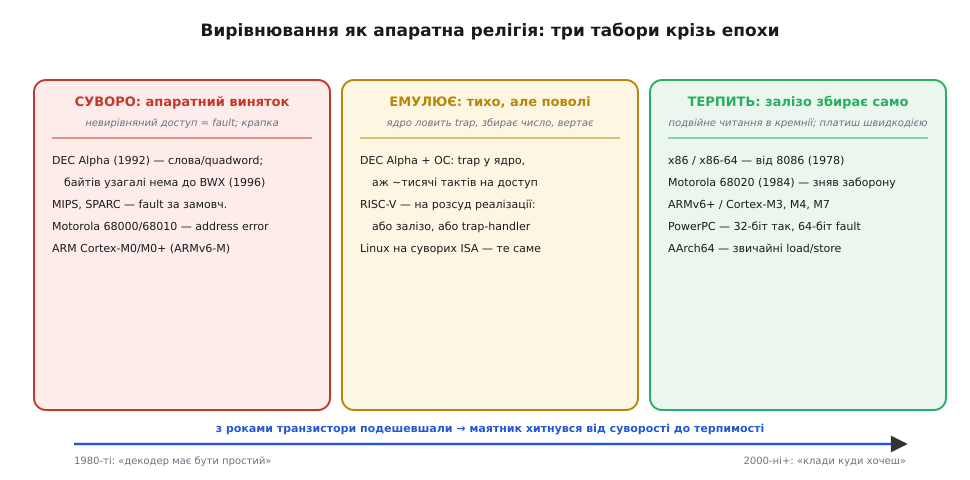

# 📜 Вирівнювання як апаратна релігія

Сьогодні програміст на ПК майже ніколи не думає про вирівнювання. Він пише `*(uint32_t*)p`, приводить один тип до іншого, кладе структуру в буфер як заманеться — і воно працює. З цього непомітно народжується глибоко хибне переконання: буцімто пам'ять — це рівне поле байтів, а «клади число куди завгодно» — універсальний закон обчислювальних машин, такий самий, як «двічі по два — чотири».

Це не закон. Це **історична випадковість** — риса кількох конкретних родин процесорів, яку решта заліза ніколи й не обіцяла. Був час, коли найшвидший процесор на планеті свідомо, з холодним інженерним розрахунком, **відмовлявся** читати число з невирівняної адреси — і той, хто про це забував, платив або миттєвим падінням, або сповільненням у тисячу разів. Історія цієї відмови — і того, як маятник за двадцять років хитнувся назад до терпимості, — добре показує, чому пласка пам'ять є розкішшю, а не даністю.

## Дешеві транзистори проти дорогих

Щоб зрозуміти суперечку, треба відчути, чим торгували інженери 1980-х. Транзистор на кристалі тоді був дорогим і рідкісним ресурсом. Кожен блок логіки, який ти вкладаєш у процесор, займає площу, гріється, подовжує критичний шлях сигналу — і тим самим **знижує максимальну тактову частоту всього чипа**. Не «уповільнює цю одну операцію», а тягне вниз усе: годинник у процесорі один на всіх.

Апаратура, що вміє читати невирівняне слово, — це саме такий блок. Механізм у ній такий: коли число «сидить верхи» на межі двох комірок шини, залізо мусить прочитати обидві комірки, з кожної викусити свою половину, зсунути їх і зшити. Щоб робити це прозоро, у кремнії потрібні додаткові мультиплексори, зсувачі-вирівнювачі (*alignment shifters*) на шляху даних і хитріший декодер, який розпізнає такий випадок і керує двома тактами шини замість одного. Усе це — транзистори й такти на шляху, яким проходить **кожне** звертання до пам'яті, навіть вирівняне й чесне.

Ось тут і постає розвилка, навколо якої зламалися списи. Одна школа каже: «покладемо цю логіку в залізо раз і назавжди, хай програмісту буде зручно». Друга — молодша, зухвала, з таборів RISC — відповідає: «а навіщо? Викиньмо цей блок геть. Хай кремній буде простий і швидкий, а рідкісний випадок невирівняного доступу розрулює той, кому він знадобився». Це і є та сама торгівля: **простота й швидкість заліза проти зручності програмного забезпечення**. І 1990-ті дали найчистіший, майже фанатичний приклад другого вибору.

## DEC Alpha: коли простота стала догмою

Наприкінці 1980-х корпорація Digital Equipment Corporation (DEC) — тоді другий за величиною виробник комп'ютерів у світі — проєктувала архітектуру, що мала прожити 25 років і витримати мільйонократне зростання швидкодії. Її назвали **Alpha** (спершу Alpha AXP). Головними архітекторами набору команд були **Ричард Сайтс (Richard L. Sites)** і **Ричард Вайтек (Richard T. Witek)**. Архітектуру офіційно представили в лютому-березні 1992 року, а перший чип — **Alpha 21064** — DEC показала на виставці COMDEX 20 листопада 1992-го. На той момент це був найшвидший мікропроцесор на Землі.

> Статус фактів: усталено. Дати анонсу (1992) і першого чипа 21064, а також імена архітекторів Сайтса й Вайтека підтверджені кількома незалежними джерелами (Wikipedia, Microprocessor Report, архіви DEC).

Alpha була RISC-архітектурою в найсуворішому, майже пуританському розумінні. Керівний принцип RISC до кінця 1980-х уже викристалізувався в гасло, яке проєктувальники MIPS-X сформулювали 1987 року з навмисною однотонністю: мета формату команд — «по-перше, простий декод; по-друге, простий декод; по-третє, простий декод». Alpha довела цей принцип до краю. Вона не мала слотів затримки переходу, не мала точних арифметичних винятків — і, найдивовижніше для новачка, **не мала команд читання-запису окремого байта й окремого 16-бітного слова взагалі**. Найменша одиниця, яку залізо вміло дістати з пам'яті, — це 32-бітне довге слово (*longword*), а то й 64-бітне (*quadword*).

Наслідок для вирівнювання був прямий і безкомпромісний: **усі звертання до пам'яті мусили бути природно вирівняні**. Адреса 4-байтного числа — кратна 4, адреса 8-байтного — кратна 8. Порушиш — і апаратура не «постарається», а просто збудить пастку (*trap*) у ядро операційної системи. Невирівняного доступу в кремнії Alpha не існувало як явища.

> 🔧 **Навіщо це.** Це найяскравіший в історії доказ, що вирівнювання — не універсальний закон, а вибір конкретного заліза. Коли ви бачите в даташиті мікроконтролера рядок «доступ мусить бути вирівняний, інакше HardFault», ви дивитеся на прямого спадкоємця філософії Alpha: викинути логіку невирівнювання з кремнію заради простоти й швидкості, а розбиратися з наслідками — програмі.

## Пастка й повільна емуляція: як ОС рятувала невирівняний код

Але старий код на C нікуди не подівся. Програми, писані з мовчазним припущенням «пам'ять пласка», треба було якось запускати й на Alpha. Тут у гру вступала операційна система — і платила за чужу зручність жорстоку ціну тактів.

Коли програма на Alpha намагалася прочитати невирівняне слово, процесор не міг цього зробити й **збуджував пастку вирівнювання** (*alignment trap*): передавав керування ядру. Ядро розбирало, яка саме команда впала й за якою адресою, потім робило **два** легітимні вирівняні читання, вихоплювало з них потрібні байти, склеювало число, клало його в потрібний регістр — і повертало керування програмі так, ніби нічого не сталося. Програма працювала **правильно**. Але одна невинна на вигляд команда `LDL` перетворювалася на повний цикл винятку: зберегти контекст, увійти в ядро, продекодувати, зробити кілька доступів, відновити контекст, вийти. Замість одного такту — **сотні, а то й тисячі**.

Різницю легко відчути на числах.

**Умова.** Цикл читає мільйон 32-бітних значень із буфера. Порівняймо вирівняний доступ (одна команда на такт) і невирівняний, що емулюється ядром (візьмімо помірні ~1000 тактів на пастку).

```text
вирівняно:    1 000 000 × 1 такт      =        1 000 000 тактів
невирівняно:  1 000 000 × ~1000 тактів = ~1 000 000 000 тактів
уповільнення: ~1000×
```

Тисячократна прірва — ось чому на Alpha «воно все одно працює» було слабкою втіхою. Ядро чесно логувало кожну таку пастку, щоб розробник бачив, де його код таємно повзе. Порада платформи звучала недвозначно: невирівняних доступів має бути **якнайменше**, бо кожен — це прихована вирва в продуктивності.

> Статус фактів: усталено (механізм) · орієнтовно (число тактів). Те, що ядро ловить пастку, робить вирівняне читання й прозоро повертає результат, — підтверджений факт (документація Linux/Alpha, посібники портування). Конкретна цифра «~1000 тактів» — розумний порядок величини для входу-виходу з винятку тих часів, наведений як ілюстрація масштабу, а не точний вимір.

Іронія долі: за кілька років сама DEC визнала, що чистота дорого коштує. У 1996-му в чипі **Alpha 21164A (кодове ім'я EV56)** з'явилося **розширення байтів і слів (Byte-Word Extensions, BWX)** — команди `LDBU`, `LDWU`, `STB`, `STW`, що нарешті дали залізу читати-писати окремий байт і 16-бітне слово. Пуризм першої Alpha на практиці породжував роздутий код і кульгаву роботу з драйверами та з емуляцією x86 — і компроміс довелося зсунути назад, до заліза. Догма поступилася інженерній реальності.


*Історична карта «релігії вирівнювання». Ліворуч — **суворий табір**: DEC Alpha (спершу навіть без байтів), MIPS, SPARC, ранні Motorola й ARM Cortex-M0 просто faultять на невирівняному доступі. Посередині — **емуляція**: ОС ловить пастку й поволі збирає число (класично — Alpha під керуванням ядра; так само RISC-V на розсуд реалізації). Праворуч — **терпимість**: x86 від 8086, Motorola від 68020, ARMv6+ збирають невирівняне число прямо в кремнії, платячи лише швидкодією. Стрілка внизу — головна думка: транзистори дешевшали, і маятник компромісу з роками хитнувся від суворості до зручності.*

## Інший берег: чому x86 завжди був поблажливий

Щоб оцінити суворість Alpha, поставмо поряд її повну протилежність — родину **x86**. Тут вирівнювання ніколи не було релігією. Ще Intel 8086, представлений 1978 року, дозволяв доступ до будь-якого байта пам'яті з будь-яким вирівнюванням. Наступні 80286, 80386, 80486, Pentium і вся сучасна лінія x86-64 успадкували цю поблажливість: пиши число за якою завгодно адресою — процесор сам зробить два внутрішні звертання й склеїть результат у кремнії, а програма нічого не помітить.

Чому такий протилежний вибір? Тому що x86 — спадкоємець зовсім іншої філософії, ніж RISC. Це архітектура CISC (складний набір команд), яка від початку цінувала **сумісність і зручність програміста** вище за чистоту декодера. У ній і так була складна логіка декодування різнодовгих команд, тож додати блок вирівнювання шини було відносно дешевим кроком на тлі решти складнощів. Плата за невирівняний доступ на x86 існує, але це лише **швидкодія**, і то помітна переважно тоді, коли число розколює межу рядка кешу; поки воно лишається всередині одного рядка, на сучасних ядрах втрати практично немає.

Ця історична розбіжність і породила пастку, у яку досі падають початківці: код, вигодуваний на поблажливому x86, вважає невирівняний доступ безкоштовним і дозволеним — і миттєво розсипається, щойно потрапляє на суворіше залізо, яке грає за правилами Alpha, а не Intel. «Воно ж працює в мене на ноуті» — це твердження не про правильність коду, а лише про те, що ваш ноутбук належить до поблажливого табору.

## Не лише Alpha: ціла родина суворих

Alpha була найяскравішою, але далеко не єдиною. Сувора вимога вирівнювання — родова риса RISC-таборів і ранніх процесорів узагалі.

**MIPS** — одна з класичних RISC-архітектур — заради швидкості теж не завдавала собі клопоту з невирівняним доступом у загальному випадку й покладалася на пастку та обхідні команди. **SPARC** вимагав, щоб звертання лежали на вирівняних межах, а невирівняне посилання збуджувало виняток; саме через це, до речі, у структурах SPARC вирівнювання диктується найсуворішим полем — та сама механіка падінгу, тільки вже як жорсткий припис заліза, а не оптимізація.

Ще раніше, у світі до RISC, суворою була навіть **Motorola 68000** — процесор перших Macintosh, Amiga й Atari ST. До моделі **68020** (1984 рік) 68000 і 68010 могли читати 16- та 32-бітні дані лише за парною (вирівняною) адресою; спроба звернутися до слова за непарною адресою збуджувала **помилку адреси** (*address error*) — власний різновид апаратного винятку. Лише 68020 зняв цю заборону й почав терпіти невирівняний доступ, збираючи його кількома тактами шини, — той самий шлях до поблажливості, яким пізніше пройде й ARM.

> Статус фактів: усталено. Суворість MIPS і SPARC, а також межа 68000/68010 (fault) → 68020 (1984, знято) підтверджені посібниками виробників і незалежними джерелами.

**PowerPC** обрав гібрид, і він повчальний сам собою: 32-бітний невирівняний доступ дозволено, а от 64-бітний (зокрема доступ до чисел із рухомою комою) валиться в помилку шини (*bus error*). Тобто навіть у межах однієї архітектури «дозволено» й «заборонено» можуть співіснувати залежно від розміру — ще один доказ, що ніякого універсального правила немає, є лише конкретні рішення конкретного кремнію.

Спільний слід цих архітектур у програмному світі — сигнал **SIGBUS** (bus error) на Unix-системах: класична смерть процесу, коли він на суворому залізі (SPARC, ARM, MIPS) намагається дереференсувати невирівняний вказівник. Для того, хто все життя писав під x86, перший SIGBUS на робочій станції SPARC чи на Raspberry Pi буває справжнім одкровенням.

## ARM: маятник хитнувся назад

ARM — найважливіша архітектура для того, хто пише прошивку, — прожила всередині себе всю цю історію в мініатюрі: від суворості до часткової терпимості й назад, залежно від ядра.

Ранні ARM належали до суворого табору: невирівняний доступ до слова просто faultив. Перелом настав із архітектурою **ARMv6**: вона вперше внесла апаратну підтримку невирівняного доступу — але **лише для одиночних команд читання-запису** (`LDR`, `LDRH`, `STR`, `STRH`). Ядро **Cortex-M3**, збудоване на профілі ARMv7-M, успадкувало цю здатність: його `LDR`/`STR` для 16- і 32-бітних значень терплять невирівняну адресу так само прозоро, як x86 (додаючи лише кілька штрафних тактів).

Але терпимість ця часткова й нерівна — і саме тут криється практична пастка. Найдешевші ядра **Cortex-M0 / M0+** побудовані на профілі **ARMv6-M**, де невирівняний доступ **вимкнено**: `LDR`/`STR` за невирівняною адресою підіймають fault, крапка. Той самий рядок C, що тихо працює на Cortex-M3, миттєво валить у `HardFault` прошивку на Cortex-M0. І навіть на «терплячих» ядрах є команди, які faultять **завжди**, незалежно від дозволу: множинний доступ `LDM`/`STM`, доступ до пари `LDRD`/`STRD`, ексклюзивні (атомарні) операції, будь-яке звертання до пам'яті, позначеної як «пристрій». А біт `UNALIGN_TRP` у регістрі `CCR` дозволяє навмисне ввімкнути fault на **будь-якому** невирівняному доступі — щоб виловлювати такі місця ще на етапі налагодження.

> Статус фактів: усталено. Те, що ARMv6 внесла невирівняну підтримку для одиночних `LDR`/`STR`, а ARMv6-M (Cortex-M0/M0+) її не має, тоді як ARMv7-M (Cortex-M3) має, підтверджено документацією ARM і технічними посібниками (TRM Cortex-M3, опис опцій GCC).

Сучасна 64-бітна **AArch64** (звичайні смартфони, сервери на ARM) остаточно перейшла в поблажливий табір для звичайних команд читання-запису — коло замкнулося. Але спадщина суворості лишилася вбудованою саме туди, де вона найдошкульніша: у крихітні дешеві мікроконтролери, на яких і тримається вся вбудована техніка.

## RISC-V: старий вибір, новий кремній

Наймолодша з великих архітектур, **RISC-V**, показує, що суперечка 1980-х не вирішена й досі — вона просто перенеслася у відкритий стандарт. Базовий набір RISC-V формально **дозволяє** невирівняні звертання, але з важливим застереженням: як саме вони поводяться, лишено **на розсуд реалізації** (*implementation-defined*). Одні чипи роблять невирівняний доступ прямо в залізі; інші faultять і покладаються на **обробник пастки** (trap handler), який доскладає число програмно, — і тоді доступ, як колись на Alpha, «працює», але може повзти жахливо поволі.

Це найчесніше формулювання головної думки всієї історії: **невирівняний доступ — не властивість, яку архітектура або має, або ні, а спектр компромісів**, який щоразу заново обирає той, хто проєктує конкретний кремній. Стандарт лише окреслює межі; де саме всередині них опиниться ваш чип — питання його ціни, площі й цільового ринку.

## Що з цієї історії винести

Головний урок не технічний, а світоглядний. Уявлення «пам'ять пласка, клади куди хочеш» — це не закон обчислень, а **зручна звичка**, вигодувана на кількох поблажливих архітектурах (насамперед x86), яку ці архітектури дозволяють коштом додаткової логіки в кремнії. Ціла плеяда іншого заліза — Alpha, MIPS, SPARC, ранні Motorola, дешеві ARM Cortex-M — цієї розкоші не дає й ніколи не обіцяла: там вирівнювання є жорстким приписом, порушення якого карається падінням або тисячократним сповільненням.

Маятник компромісу «простота заліза ↔ зручність ПЗ» за сорок років хитнувся: коли транзистори були дорогі, RISC-пуризм Alpha викидав логіку невирівнювання геть; коли вони подешевшали, навіть суворі архітектури почали повертати часткову терпимість у кремній. Але хитнувся він **не скрізь** — і саме там, де кремнію найменше (мікроконтролери), досі живе філософія Alpha в чистому вигляді.

Практичний висновок для того, хто пише під різне залізо, звідси випливає сам собою: не покладайтеся на терпимість, якої конкретна машина могла й не отримати. Читайте можливо-невирівняні дані переносно — через `memcpy` чи зсуви, а не приведенням вказівника; задавайте кратність явно там, де її вимагає залізо. Тоді ваш код житиме однаково спокійно і на поблажливому ноутбуку, і на суворому Cortex-M0 — бо ви говоритимете мовою машини, а не мовою зручної, але не всюди правдивої ілюзії про пласку пам'ять.
