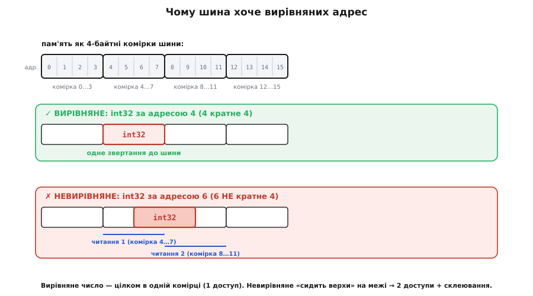
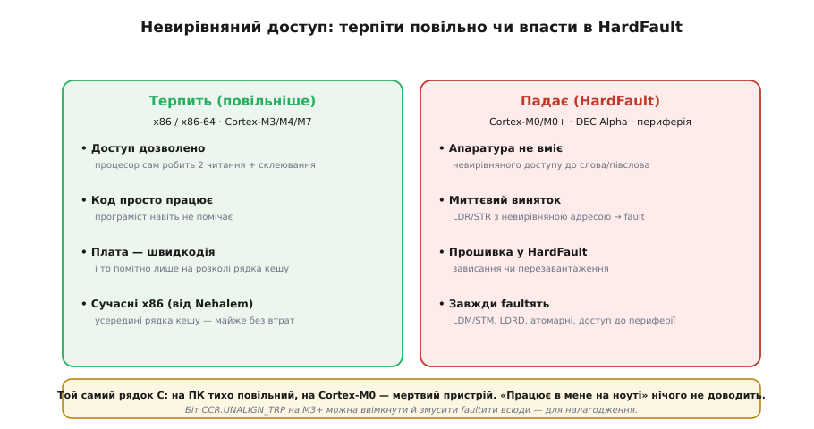
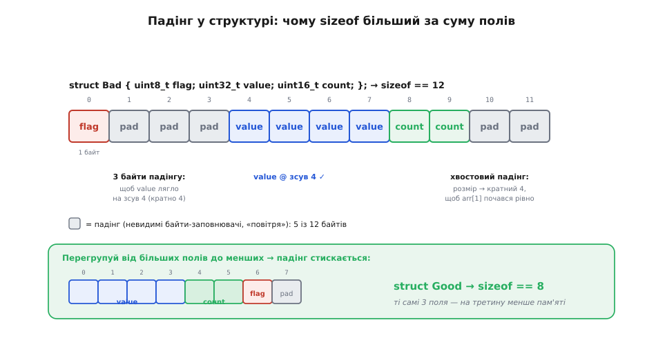
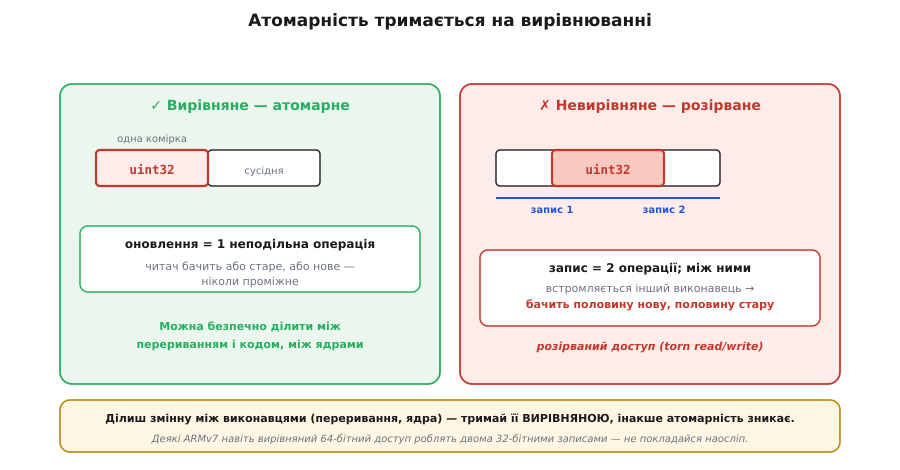

# Вирівнювання даних у пам'яті

<preknowlist>
- [Що таке процесор](book:programming/what-is-processor) — процесор виконує команди й звертається до пам'яті; базова картина «процесор тягне дані з пам'яті».
- [Біти й порядок байтів](book:programming/bits-bytes-endianness) — байт як комірка пам'яті і те, що ціле число займає кілька байтів (2, 4, 8).
</preknowlist>

Пам'ять здається читачеві рівним полем однакових комірок-байтів: клади число куди завгодно, аби вистачило місця. Машина ж дивиться на ту саму пам'ять інакше — і має щодо неї впертий, майже забобонний смак: вона хоче, щоб чотирибайтове число лежало за адресою, кратною чотирьом, восьмибайтове — за адресою, кратною восьми. Порушиш цей смак — і залежно від процесора дістанеш або тихе вповільнення, або миттєвий апаратний виняток, що вкладе всю прошивку. Це й називається **вирівнюванням** (англ. *alignment*, від *align* — «поставити в один ряд»): вимога, щоб адреса даних була кратна їхньому розміру. Смак цей не примха — він росте прямо з того, як [процесор](book:programming/what-is-processor) фізично тягне байти з пам'яті шиною.

### Чому машина хоче кратних адрес

Щоб зрозуміти вимогу, треба на хвилину відмовитися від картинки «процесор бере один байт». Він так майже ніколи не робить. Процесор і пам'ять з'єднані **шиною даних** певної ширини — 32 біти, 64 біти, — і за один такт нею проходить ціле **слово**, увесь пакет байтів одразу. Пам'ять теж адресується не побайтно, а рядками фіксованого розміру: контролер читає весь блок, що містить потрібну адресу, і віддає його цілим.

Уяви шину завширшки 4 байти. Пам'ять для неї — не суцільна стрічка байтів, а сітка **комірок по 4 байти**: комірка №0 — це байти за адресами 0…3, комірка №1 — байти 4…7, і так далі. Апаратура вміє за одну операцію вихопити рівно одну таку комірку, вирівняну по межі чотирьох.


*Пам'ять очима 4-байтної шини. Апаратура читає її вирівняними комірками по 4 байти (0…3, 4…7, 8…11…). **Вирівняне** 32-бітне число за адресою 4 лежить рівно в одній комірці — одне звертання до шини, і воно в регістрі. **Невирівняне** число за адресою 6 «сидить верхи» на межі: його байти розкидані по двох сусідніх комірках. Щоб зібрати таке число, треба **два** читання (комірку 4…7 і комірку 8…11), відкинути зайві байти з кожного й склеїти половинки — удвічі більше роботи для одного значення.*

Ось звідки вся вимога. Коли число лежить **вирівняно** — цілком усередині однієї апаратної комірки, — процесор бере його одним рухом. Коли воно лежить **верхи на межі** двох комірок, одного руху не досить: доводиться прочитати обидві комірки, з кожної викусити свою половину числа й зшити їх докупи. Одна логічна дія «прочитати int» перетворюється на дві фізичні операції плюс склеювання. Машина не любить цього не з упертості, а тому, що це буквально повільніше й складніше в кремнії.

Звідси — просте й точне правило, яке інженери називають **природним вирівнюванням** (*natural alignment*): дані розміру N байтів мають лежати за адресою, кратною N. Байт (1 байт) можна класти будь-де — він завжди в одній комірці. Дволанковий `int16_t` (2 байти) — за парною адресою. `int32_t` (4 байти) — за адресою, кратною 4. `double` чи 64-бітний вказівник (8 байтів) — за адресою, кратною 8. Кратність гарантує: значення ніколи не перетне межу комірки й читатиметься одним звертанням.

> 🔧 **Навіщо це.** Коли ви налаштовуєте [DMA-контролер](book:programming/dma-controller) на перекачку буфера, майже завжди в даташиті стоїть вимога «адреса буфера має бути вирівняна на розмір слова» (а часто — на розмір рядка кешу). Це не бюрократія: DMA ходить тією самою шиною, і невирівняний буфер він або відмовиться перекачувати, або зробить це неоптимально. Знаючи механізм, ви не гадаєте над цим рядком даташита — ви розумієте, звідки він.

### Що станеться, якщо порушити: тихо повільно чи гучний виняток

Найпідступніше — що наслідок невирівняного доступу **залежить від архітектури**, і ці два світи поводяться протилежно.

Перший світ каже: «недобре, але я стерплю». Уся родина **x86/x86-64** (звичайні ПК) дозволяє невирівняний доступ прозоро. Процесор сам робить два внутрішні звертання й склеювання, а програміст навіть не помічає — код просто працює. Ціна — швидкодія, і тільки коли значення перетинає межу **рядка кешу** (*cache line* — блок, яким [кеш](book:programming/cache) тягне дані з пам'яті, зазвичай 64 байти). Поки невирівняне число лишається всередині одного рядка кешу, на сучасних процесорах (від Intel Nehalem) втрати практично немає; щойно воно розколює рядок кешу на два — плата стрибає, а перетин межі сторінки пам'яті карається ще дужче. Тобто на ПК вирівнювання — питання продуктивності, і забути про нього можна дорого, але не смертельно.

Другий світ каже: «ні» — і кидає виняток. Багато вбудованих архітектур не мають (або мають лише частково) апаратуру для невирівняного доступу, тож натрапивши на нього, збуджують [апаратний виняток](book:programming/cpu-exception-handling), який зазвичай веде прошивку у `HardFault` — і пристрій зависає чи перезавантажується. Найважливіше для того, хто пише прошивку, — родина ARM Cortex-M, і всередині неї теж не одна відповідь:

- **Cortex-M0 / M0+** (найдешевші ядра): невирівняний доступ до слова чи півслова **завжди** заборонений — інструкція `LDR`/`STR` з невирівняною адресою підіймає fault. Крапка.
- **Cortex-M3 / M4 / M7**: звичайні `LDR`/`STR` для 16- і 32-бітних значень невирівняну адресу **терплять** (як x86). Але є винятки, які faultять **завжди**, незалежно від ядра: інструкції множинного доступу `LDM`/`STM`, доступ до пари `LDRD`/`STRD`, ексклюзивні (атомарні) операції, а ще будь-який доступ до пам'яті, позначеної як «пристрій» (регістри периферії). До того ж біт `UNALIGN_TRP` у регістрі `CCR` можна ввімкнути й змусити ядро faultити на **будь-якому** невирівняному доступі — цим часто користуються, щоб виловити такі місця ще на етапі налагодження.

Класичний історик цієї суворості — процесор **DEC Alpha**: заради максимальної швидкодії його архітектори взагалі не заклали в залізо невирівняне читання слів, тож будь-який такий доступ або falтив, або емулювався операційною системою поволі. [Ця історія «вирівнювання як апаратної релігії»](book:programming/memory-alignment/hist-alignment-hardware.md) добре показує, чому припущення «пам'ять пласка, клади куди хочеш» — розкіш, яку дозволяє далеко не кожна машина.

Практичний висновок різкий: **код, що спокійно працював на ПК, може миттєво падати на мікроконтролері** — саме через невирівняний доступ, який x86 тихо стерпів, а Cortex-M0 — ні. Тому «воно ж працює в мене на ноуті» для прошивки нічого не доводить.


*Одна й та сама невирівняна операція, дві долі. **x86 / Cortex-M3+** (ліворуч): доступ дозволено, процесор зсередини робить подвійне читання й склеювання — код працює, платиш лише швидкодією, і то помітно тільки на розколі рядка кешу. **Cortex-M0/M0+, DEC Alpha, доступ до периферії** (праворуч): апаратура не вміє невирівняного доступу — миттєвий виняток, `HardFault`, зависання чи перезавантаження. Той самий рядок C дає то тихе вповільнення, то мертвий пристрій — залежно від того, куди його завантажили.*

### Дірки в структурах: чому `sizeof` більший, ніж сума полів

Тепер найцікавіше — місце, де вирівнювання просочується у ваш код навіть тоді, коли ви про нього не думали. Компілятор **зобов'язаний** розкладати поля структури так, щоб кожне лежало за своєю природно вирівняною адресою. А оскільки поля різного розміру йдуть підряд, він домагається цього єдиним доступним способом — **вставляє між ними невидимі байти-заповнювачі** (англ. *padding* — «набивка»). Тому розмір структури часто більший за просту суму розмірів полів, і новачки щиро дивуються, чому.

Розберімо на живому прикладі. Візьмемо структуру, де байт, чотирибайтове число й дволанкове число стоять у «незручному» порядку:

```c
struct Bad {
    uint8_t  flag;   // 1 байт
    uint32_t value;  // 4 байти
    uint16_t count;  // 2 байти
};
// наївно очікуєш: 1 + 4 + 2 = 7 байтів
// насправді на 32-бітній машині: sizeof(struct Bad) == 12
```

Звідки 12, а не 7? Слідкуймо за адресами, які компілятор роздає полям від зсуву 0:

```text
зсув 0:  flag    (1 байт)          → зайняв байт 0
зсув 1:  ??? value хоче адресу, кратну 4 ...
         байти 1,2,3 — ПАДІНГ (3 байти-заповнювачі), щоб дотягти до зсуву 4
зсув 4:  value   (4 байти)         → зайняв байти 4,5,6,7   (4 кратне 4 ✓)
зсув 8:  count   (2 байти)         → зайняв байти 8,9       (8 кратне 2 ✓)
зсув 10: ??? хвостовий ПАДІНГ (2 байти) до кратного 4
```

Останній штрих часто дивує окремо: **хвостовий падінг** у кінці. Він потрібен, бо структури нерідко кладуть у масив, а кожен наступний елемент масиву мусить теж починатися з вирівняної адреси. Розмір усієї структури тому округлюється вгору до кратного її найсуворішому полю (тут `value` вимагає кратності 4), щоб `arr[1]`, `arr[2]`… лягали як слід. Звідси 12.


*Розкладка `struct Bad` у пам'яті. `flag` сідає на зсув 0. Далі `value` (4 байти) хоче адресу, кратну 4, тож компілятор вставляє **3 байти падінгу** (зсуви 1–3), і `value` лягає на зсув 4. `count` (2 байти) стає на зсув 8. Наприкінці — **2 байти хвостового падінгу**, щоб увесь розмір став кратним 4 і наступний елемент масиву теж почався вирівняно. Разом 12 байтів замість наївних 7: п'ять із них — «повітря», яке машина вимагає заради вирівнювання.*

І тут ховається дуже практичний важіль. Падінг залежить від **порядку полів**, тож просте перегрупування — від найбільших полів до найменших — часто стискає структуру задарма:

```c
struct Good {
    uint32_t value;  // 4 байти, зсув 0
    uint16_t count;  // 2 байти, зсув 4
    uint8_t  flag;   // 1 байт,  зсув 6
};                   // зсув 7 — 1 байт хвостового падінгу
// sizeof(struct Good) == 8  (замість 12 — на третину менше!)
```

Ті самі три поля, той самий сенс — але 8 байтів замість 12. Коли структура одна, різниця дрібна; коли їх масив на десять тисяч елементів у мікроконтролері з 64 КБ ОЗП, ці зайві 4 байти на елемент можуть вирішити, влізе програма в пам'ять чи ні. Тому в прошивці правило «клади поля від більших до менших» — не естетика, а економія.

> 🔧 **Навіщо це.** Коли ви описуєте структуру пакета для протоколу («один байт команди, потім двобайтна довжина, потім чотирибайтний ідентифікатор») і надсилаєте її по мережі чи пишете у флеш побайтно, падінг стає пасткою: приймач очікує щільні 7 байтів, а `sizeof` вашої структури — 12, і між полями сидять три невидимі байти, що зіпсують розбір. Саме тому пакети описують або з ручним контролем розкладки, або взагалі не покладаються на розкладку структури, а серіалізують поля по одному.

### Керувати вирівнюванням явно

Мова C від початку лишала розкладку на компілятор, але сучасний C (стандарт C11) дав інструменти питати про вирівнювання й задавати його прямо. `alignof(T)` (у C — з заголовка `<stdalign.h>`; у C++ це вбудоване ключове слово) повертає, якої кратності адреси вимагає тип `T`; `alignas(N)` змушує змінну чи поле лягти за адресою, кратною N.

```c
#include <stdalign.h>

alignof(uint32_t);        // 4  — int32 хоче адресу, кратну 4
alignof(double);          // 8  (на більшості платформ)

// вимагаємо буфер, вирівняний на межу рядка кешу (64 байти) — типово для DMA:
alignas(64) uint8_t dma_buf[256];
```

Протилежна потреба — **прибрати** падінг, коли розкладка мусить точно збігтися із зовнішнім форматом (регістри пристрою, пакет протоколу). Це роблять «упакованою» структурою: `__attribute__((packed))` у GCC/Clang або `#pragma pack` у ширшому вжитку. Компілятор тоді кладе поля впритул, без жодного заповнювача.

Але за це є ціна, і про неї треба знати чесно. Упакувавши структуру, ви прибрали падінг — а отже, її поля тепер можуть лежати **невирівняно**. І щойно ви візьмете адресу такого поля й спробуєте прочитати його як звичайне число на Cortex-M0, ви впіймаєте той самий `HardFault`, з якого починалася вся розмова. Компілятор для упакованих структур зазвичай сам генерує безпечний побайтний доступ до полів, поки ви звертаєтеся до них через ім'я поля; небезпека — коли ви берете **вказівник** на поле упакованої структури й передаєте його кудись, де про упакованість уже не знають. Тому упаковка — інструмент точковий: під конкретний зовнішній формат, з розумінням, що ви щойно зняли гарантію вирівнювання.

### Вирівнювання й атомарність: тихий зв'язок

Є ще один бік вирівнювання, менш очевидний, але критичний там, де кілька виконавців чіпають одну змінну (перерваня й головний цикл, два ядра). Читання чи запис **вирівняного** значення, що вміщається в одне слово, апаратура виконує **однією неподільною операцією**: воно або сталося цілком, або ще не сталося — проміжного стану ззовні не видно. Це фундамент [атомарності](book:programming/atomicity-races): вирівняний `uint32_t` можна безпечно оновити з одного місця й прочитати з іншого, не боячись побачити «півчисла».

Невирівняне значення цю гарантію втрачає. Якщо воно перетинає межу комірки (а тим паче межу рядка кешу), апаратура читає-пише його **двома** окремими операціями — і між ними інший виконавець може встромитися й побачити напівоновлене число: старша половина вже нова, молодша ще стара. Це так званий **розірваний доступ** (*torn read/write*). Тому будь-яка змінна, яку ви ділите між перериванням і кодом чи між ядрами, **мусить бути вирівняна** — інакше атомарність, на яку ви розраховуєте, тихо зникає саме тоді, коли найпотрібніша. (Деякі процесори ARMv7 навіть вирівняний 64-бітний доступ роблять двома 32-бітними записами — ще одна причина не покладатися на «воно ж одне число» без перевірки.)


*Чому вирівнювання тримає атомарність. **Вирівняне** 32-бітне число (ліворуч) лежить в одній комірці — оновлення це одна неподільна дія: читач бачить або старе, або нове значення, ніколи проміжне. **Невирівняне** число (праворуч) розкидане по двох комірках — запис іде двома операціями; якщо між ними встромиться інший виконавець (переривання, друге ядро), він побачить **розірване** значення: одна половина нова, друга стара. Ділиш змінну між виконавцями — тримай її вирівняною.*

### Як із цим жити

Звести все до кількох робочих звичок неважко. Найперше — не покладатися на розкладку структури, коли байти йдуть у зовнішній світ: серіалізуйте поля явно, як робите це й для [порядку байтів](book:programming/bits-bytes-endianness). Найнадійніший спосіб прочитати багатобайтове значення з можливо-невирівняного буфера (мережевий пакет, кадр із флеші) — не приводити вказівник, а зібрати число `memcpy` або зсувами:

```c
// buf може вказувати на НЕвирівняну адресу (напр. поле в пакеті)
uint32_t read_u32(const uint8_t *buf) {
    uint32_t v;
    memcpy(&v, buf, sizeof v);   // безпечно СКРІЗЬ: memcpy працює побайтно
    return v;
}

// НЕБЕЗПЕЧНО — так робити не можна:
uint32_t bad = *(const uint32_t *)buf;   // невирівняна адреса → HardFault на Cortex-M0
```

`memcpy` виглядає «повільним», та компілятор, бачачи сталий розмір, згортає його в найшвидший доступ, який дозволяє платформа: на x86 — в один невирівняний рух, на Cortex-M0 — у безпечні чотири побайтні читання. Ви пишете один переносний код, а компілятор сам добирає під залізо — саме так і треба. Приведення ж вказівника `*(uint32_t*)buf` крім невирівнювання наражає ще й на [суворе аліасування](book:programming/strict-aliasing) — окрему пастку C, через яку компілятор має право «оптимізувати» такий код у несподіванку.

Друге — коли залізо вимагає конкретної кратності (буфери DMA, вирівнювання на рядок кешу), не сподівайтеся на випадок, а задавайте її явно через `alignas`. Третє — у структурах, чутливих до розміру, кладіть поля від більших до менших і не дивуйтеся падінгу, а рахуйте його. І останнє, найголовніше за духом: пам'ятайте, що пласка модель пам'яті — зручна ілюзія читача, а машина бачить сітку комірок, і вирівнювання — це її мова. Говоріть із нею цією мовою, і цілий клас «незрозумілих» падінь та розірваних лічильників просто не виникне.
