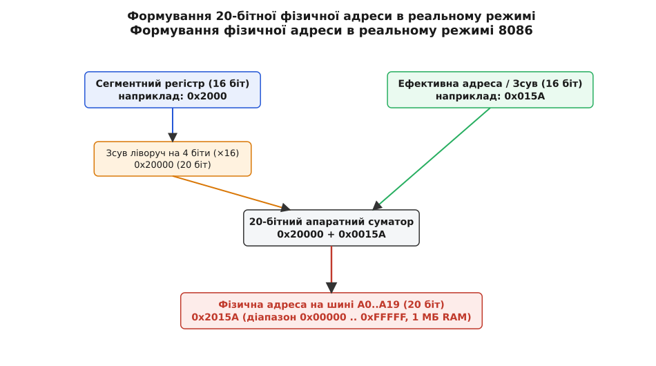
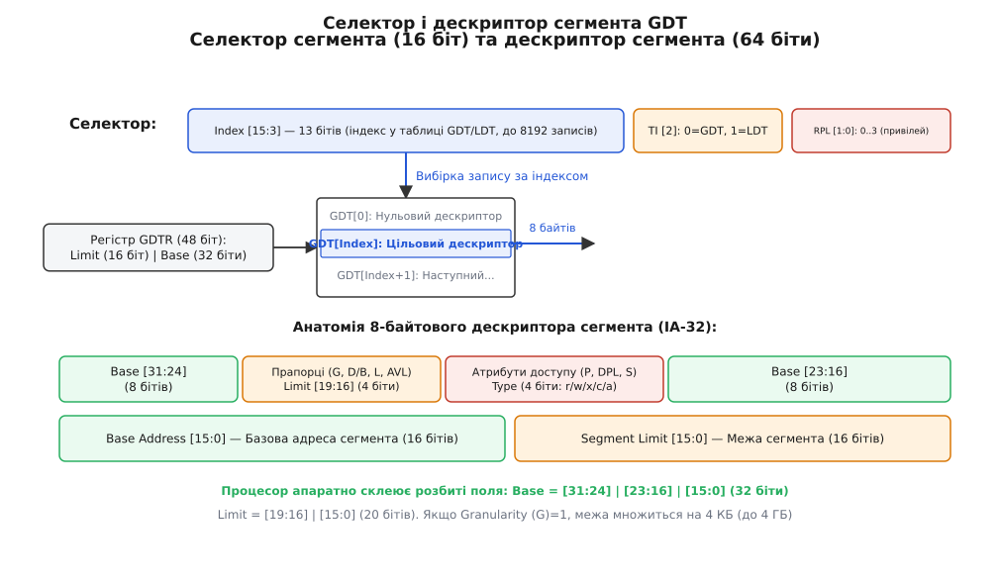
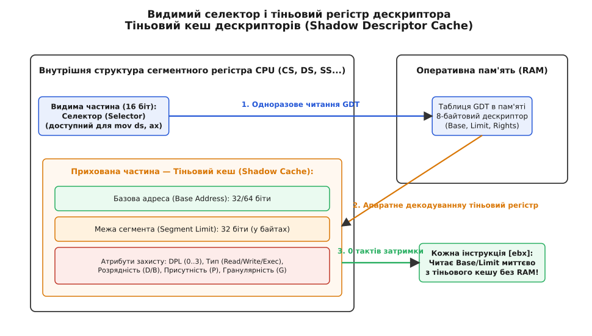
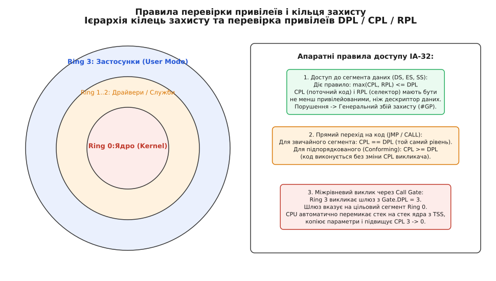
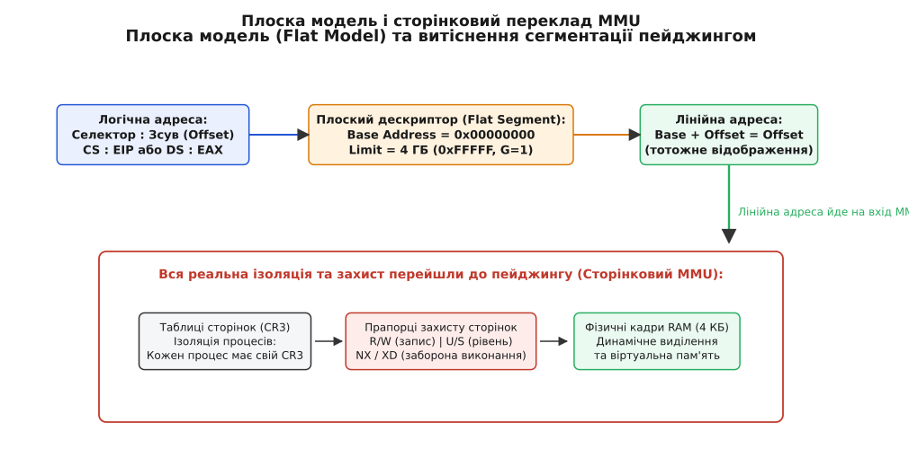
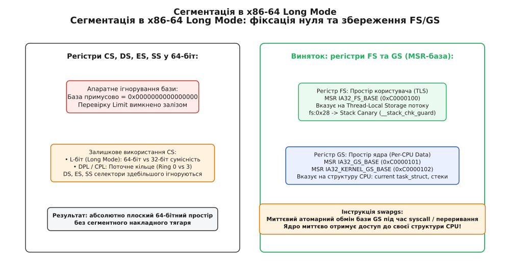

# Сегментація пам'яті

<preknowlist>
- [Віртуальна пам'ять](book:programming/virtual-memory) — відмінність між лінійними, віртуальними та фізичними адресами, організація сторінкового перекладу MMU.
- [Кільця захисту та рівні привілеїв](book:programming/protection-rings) — ієрархія кілець привілеїв процесора Ring 0..3 та базові засади апаратної ізоляції.
- [Системні виклики](book:programming/system-call) — механіка контрольованого переходу між непривілейованим кодом користувача та ядром ОС.
- [Карта пам'яті](book:programming/memory-map) — фізичне розташування оперативної пам'яті, системних буферів та діапазонів вводу/виводу на шині.
</preknowlist>

Коли розрядність внутрішніх регістрів процесора менша за фізичний обсяг пам'яті комп'ютера, пряма адресація стає фізично неможливою. Шістнадцятибітний регістр здатен зберегти лише 65 536 унікальних числових значень. Якщо під'єднати такий кристал до пам'яті розміром 1 Мегабайт, процесор просто не матиме де зберегти номер комірки, розташованої вище 64-го кілобайта. Аби вийти за ці межі без повної перебудови арифметичного ядра, адресу розбивають на дві частини: базову точку відліку та зміщення відносно неї. Цей принцип організації адресного простору називають **сегментацією пам'яті** (лат. *segmentum* — «відрізок, смуга», від *secare* — «різати, розділяти»).

### Проблема адресації та двовимірна координатна сітка

Уявімо географічну карту великої країни. Якщо позначати кожну будівлю єдиним наскрізним порядковим номером від одиниці до мільйона, для запису адреси знадобляться довгі семизначні числа. Натомість поштова служба ділить територію на райони та вулиці: адреса складається з назви вулиці та номера будинку на ній.

Сегментація переносить цю саму логіку в апаратне забезпечення процесора. Замість одновимірного лінійного масиву адрес пам'ять розглядається як набір незалежних блоків — **сегментів**. Щоб вказати на конкретний байт у пам'яті, програма повинна назвати дві координати:
1. **Сегмент** (*segment*) — який саме блок пам'яті нас цікавить;
2. **Зсув**, або **ефективну адресу** (*offset*, *displacement*) — номер байта всередині цього конкретного сегмента, починаючи від нуля.

> 🔧 **Навіщо це.** Сегментація розв'язала дві фундаментальні проблеми обчислювальної техніки: дозволила вузьким 16-бітним регістрам керувати великими фізичними масивами пам'яті та заклала основу для переміщення програм у пам'яті (*relocation*). Програма, скомпільована для роботи в межах власного сегмента від нульового зсуву, може бути завантажена в будь-яку ділянку фізичної RAM — операційній системі достатньо лише змінити базовий сегментний регістр, не модифікуючи жодної машинної інструкції коду.

Проте за простою ідеєю «база плюс зсув» криється півстолітня інженерна еволюція мікропроцесорів: від простої апаратної суми в реальному режимі до складних таблиць дескрипторів захищеного режиму та сучасного використання сегментів для локальної пам'яті потоків.

### Реальний режим 8086: Арифметика параграфів та перекриття

В оригінальному процесорі Intel 8086, випущеному в 1978 році, всі регістри загального призначення (AX, BX, CX, DX, SI, DI, BP, SP, IP) були 16-бітними. Максимальний зсув, який можна було вказати всередині інструкції, дорівнював `0xFFFF` (65 535 байтів, або 64 КБ). Водночас процесор мав 20 фізичних адресних виводів `A0`–`A19`, що дозволяло звертатися до 1 048 576 байтів (1 МБ) фізичної RAM.

Аби сформувати 20-бітну фізичну адресу з двох 16-бітних чисел, архітектор чипа Стівен Морс запропонував жорстку апаратну схему перекладу. Процесор отримав чотири спеціальні 16-бітні **сегментні регістри**:
- `CS` (*Code Segment*) — визначає сегмент з кодом поточних інструкцій програми (використовується в парі з лічильником інструкцій `IP`);
- `DS` (*Data Segment*) — визначає базовий сегмент для читання та запису глобальних змінних і масивів;
- `SS` (*Stack Segment*) — визначає сегмент стека програми (використовується в парі з регістрами покажчика стека `SP` та бази кадру `BP`);
- `ES` (*Extra Segment*) — додатковий сегмент даних, призначений для операцій пересилання рядків і блоків пам'яті (у парі з індексним регістром `DI`).


*Формування фізичної адреси в реальному режимі 8086. Процесор зсуває значення 16-бітного сегментного регістра на 4 біти ліворуч (множить на 16) і подає на апаратний суматор разом із 16-бітним зсувом, утворюючи 20-бітну фізичну адресу шини A0..A19.*

Алгоритм обчислення адреси в реальному режимі вбудований безпосередньо в логіку шинного інтерфейсу процесора:
1. Значення обраного сегментного регістра зсувається ліворуч на 4 двійкові розряди (що еквівалентно множенню на 16 у десятковій системі або дописуванню нуля `0` праворуч у шістнадцятковій);
2. До отриманого 20-бітного числа додається 16-бітне значення зсуву.

```
Фізична адреса = (Сегмент << 4) + Зсув
```

Множення сегмента на 16 означає, що сегмент не може починатися з довільного байта фізичної пам'яті: його початкова адреса обов'язково має бути кратною 16. Одиницю пам'яті розміром 16 байтів в архітектурі x86 назвали **параграфом** (*paragraph*).

Порахуймо конкретний приклад. Нехай регістр `DS` містить значення `0x2000`, а інструкція вимагає прочитати змінну за зсувом `0x015A`:

```
Сегмент DS        = 0x2000
Зсув на 4 біти    = 0x20000        [множення на 16: зсув базового параграфа]
Зсув (Offset)     = 0x0015A
Фізична адреса    = 0x20000 + 0x0015A
                  = 0x2015A        [20-бітна адреса на шині пам'яті]
```

Оскільки новий сегмент може починатися через кожні 16 байтів, а довжина будь-якого сегмента фіксована й становить 64 КБ, **сегменти в реальному режимі перекриваються**. Будь-який фізичний байт пам'яті можна адресувати багатьма різними комбінаціями сегмента й зсуву. Наприклад, фізична адреса `0x07C00` (стандартна адреса завантаження сектора MBR BIOS) може бути записана як `0x07C0:0x0000`, `0x0000:0x7C00`, `0x0700:0x0C00` або `0x07BE:0x0020`.

Ця особливість призвела до серйозних складнощів у мовах високого рівня (зокрема C для MS-DOS): не існувало єдиного числового представлення покажчика. Компіляторам довелося винаходити модифікатори `near` (16-бітний зсув), `far` (сегмент і зсув без нормалізації) та `huge` (сегмент і зсув, які компілятор примусово перераховував при кожній арифметичній операції, нормалізуючи зсув до діапазону 0..15).

Ще одним драматичним наслідком сегментної арифметики стала поведінка процесора на межі першого мегабайта. Якщо встановити сегмент `0xFFFF` і зсув `0xFFFF`, сегментний суматор дасть результат:

```
0xFFFF << 4 + 0xFFFF
= 0xFFFF0 + 0xFFFF    [сума зсунутого сегмента та максимального зсуву]
= 0x10FFEF            [значення, що перевищує 1 МБ на 65 520 байтів]
```

В оригінальному чипі 8086 не було 21-ї адресної лінії `A20`, тому старша одиниця відкидалася, і адреса поверталася на початок пам'яті (`0x00000`–`0x0FFEF`). Коли процесор 80286 отримав повноцінну 24-бітну шину, це загортання зникло, що зламало старі програми DOS і змусило інженерів IBM створити сумнозвісний апаратний вентиль Gate A20 на мікроконтролері клавіатури; про драматичні деталі цієї інженерної битви розповідає [історія подолання бар'єра 64 кілобайтів](book:programming/memory-segmentation/hist-8086-addressing.md).

### Захищений режим IA-32: Від чисел до дескрипторів

Реальний режим 8086 мав фатальні недоліки для багатозадачних операційних систем:
- **Повна відсутність ізоляції:** будь-яка програма могла завантажити довільне число в сегментний регістр і перезаписати пам'ять операційної системи або інших задач;
- **Відсутність контролю прав доступу:** пам'ять не можна було позначити як «лише для читання» або заборонити виконання даних як коду;
- **Фіксований розмір сегмента:** довжина сегмента завжди апаратно становила 64 КБ, не дозволяючи системі виділяти дрібніші або більші ділянки.

У 1982 році в процесорі 80286, а згодом у 1985 році в 32-бітному 80386 (архітектура IA-32) компанія Intel реалізувала **захищений режим** (*Protected Mode*). Відбулася концептуальна революція: **сегментні регістри перестали містити адреси пам'яті**.

У захищеному режимі значення в сегментному регістрі стало числовим ключем — **селектором сегмента** (*Segment Selector*). Програма більше не може самостійно вказати, де в пам'яті лежить її сегмент. Вона лише називає процесору номер запису в системній таблиці, яку контролює виключно ядро операційної системи.


*Селектор сегмента та дескриптор GDT. 16-бітний селектор містить індекс дескриптора в таблиці GDT/LDT та рівень привілеїв RPL. 8-байтовий дескриптор визначає 32-бітну базову адресу, 20-бітну межу сегмента та повний набір атрибутів захисту.*

Шістнадцятибітний селектор сегмента розпадається на три бітові поля:
- **Index** (біти 15..3, разом 13 бітів) — порядковий номер дескриптора в таблиці від 0 до 8191. Процесор множить індекс на 8 (розмір дескриптора), щоб отримати точне зміщення запису в байтах;
- **TI** (*Table Indicator*, біт 2) — індикатор таблиці: `0` вказує на глобальну таблицю дескрипторів GDT (*Global Descriptor Table*), спільну для всієї системи; `1` вказує на локальну таблицю LDT (*Local Descriptor Table*), індивідуальну для поточного процесу;
- **RPL** (*Requested Privilege Level*, біти 1..0) — запитаний рівень привілеїв селектора від 0 (найвищий, ядро) до 3 (найнижчий, користувач).

Самі таблиці дескрипторів розміщуються операційною системою в оперативній пам'яті. Щоб процесор знав, де саме розташована глобальна таблиця GDT, ядро завантажує її параметри в спеціальний системний регістр `GDTR` за допомогою привілейованої інструкції `lgdt`:

```
Регістр GDTR (48 бітів у 32-бітному режимі):
[ Базова адреса GDT (32 біти) | Розмір таблиці в байтах мінус 1 (16 бітів) ]
```

> ⚠️ **Нульовий дескриптор (*Null Descriptor*):** нульовий запис GDT (індекс `0`, селектори `0x0000`–`0x0003`) зарезервовано. Завантаження нульового селектора в регістри даних (DS, ES, FS, GS) дозволено — це стандартний спосіб позначити, що регістр тимчасово не використовується. Проте будь-яка спроба прочитати або записати дані через такий регістр негайно викликає апаратний виняток загального захисту `#GP(0)` (*General Protection Fault*). Завантаження нуля в CS або SS заборонено навіть на рівні інструкцій.

### Анатомія дескриптора сегмента

Кожен запис у таблиці GDT або LDT займає рівно 8 байтів (64 біти) і називається **дескриптором сегмента** (*Segment Descriptor*). Його бітова структура на перший погляд здається хаотично перемішаною — це наслідок того, що Intel розширювала формат дескриптора від 24 бітів бази в 80286 до 32 бітів у 80386, зберігаючи сумісність розташування полів.

Дескриптор містить три фундаментальні групи параметрів:
1. **Базова адреса (Base Address, 32 біти):** початкова лінійна адреса сегмента в пам'яті (розбита на три фрагменти: байти 2..3, байт 4 та байт 7);
2. **Межа сегмента (Segment Limit, 20 бітів):** максимальний розмір сегмента (розбита на байти 0..1 та молодші 4 біти байта 6);
3. **Прапорці та права доступу (24 біти):** правила захисту та інтерпретації пам'яті.

Розгляньмо ключові прапорці дескриптора:
- **G (*Granularity*, біт 55):** гранулярність межі. Якщо `G = 0`, значення межі вказується в байтах (сегмент розміром від 1 Б до 1 МБ). Якщо `G = 1`, значення межі автоматично множиться процесором на 4096 (розмір сторінки 4 КБ). При `G = 1` максимальне значення межі `0xFFFFF` перетворюється на 4 Гігабайти (`0xFFFFFFFF`), покриваючи весь 32-бітний адресний простір.
- **D/B (*Default/Big*, біт 54):** для сегментів коду прапорець `D` визначає розрядність за замовчуванням (`1` — 32-бітні адреси та операнди, `0` — 16-бітні). Для сегментів стека прапорець `B` визначає ширину покажчика стека (`1` — 32-бітний регістр `ESP`, `0` — 16-бітний `SP`).
- **P (*Present*, біт 47):** ознака присутності сегмента в пам'яті. Якщо `P = 1`, сегмент завантажений у RAM. Якщо `P = 0`, процесор зупиняє виконання інструкції та генерує апаратне переривання `#NP` (*Segment Not Present*). Це дозволяло операційним системам 1980-х років реалізовувати сегментну віртуальну пам'ять, скидаючи невикористовувані сегменти на жорсткий диск.
- **DPL (*Descriptor Privilege Level*, біти 46..45):** рівень привілеїв дескриптора від 0 (ядро) до 3 (застосунки).
- **S (*Descriptor Type*, біт 44):** тип дескриптора (`1` — сегмент коду або даних програми, `0` — системний дескриптор: шлюз, LDT або сегмент стану завдання TSS).
- **Type (біти 43..40, 4 біти):** для сегментів даних визначає можливість запису (`Writable`) та напрямок росту (`Expand-Down` для стеків); для сегментів коду — можливість читання констант (`Readable`) та підпорядкованість (`Conforming`).

Повні двійкові розкладки всіх різновидів дескрипторів, системних шлюзів і структур мовами C та C++ наведено в [довіднику структур дескрипторів та селекторів](book:programming/memory-segmentation/api-descriptor-structures.md).

### Сегментні регістри та прихований тіньовий кеш

Якби процесор звертався до оперативної пам'яті по 8-байтовий дескриптор з таблиці GDT на кожній машинній інструкції читання чи запису (`mov eax, [ebx]`), продуктивність системи впала б у кілька разів. Звернення до пам'яті роздвоювалося б: спершу читання дескриптора, а вже потім — читання самих даних.

Щоб уникнути цього накладного тягаря, інженери процесора розділили кожен сегментний регістр на дві частини:
1. **Видима частина (16 бітів):** звичайний селектор, доступний програмісту для читання та запису (`mov ds, ax`);
2. **Прихована частина (Тіньовий дескрипторний кеш / *Shadow Descriptor Cache*, 64–96 бітів):** внутрішні регістри процесора, які зберігають повністю розпаковану базову адресу, межу в байтах та всі прапорці прав доступу.


*Тіньовий кеш дескрипторів. При завантаженні селектора процесор одноразово читає GDT з пам'яті й кешує всі атрибути в тіньовому регістрі. Усі наступні звернення до пам'яті читають тіньовий регістр миттєво з нульовою затримкою.*

Механізм роботи тіньового кешу:
1. Коли програма виконує інструкцію завантаження селектора (наприклад, `mov ds, ax`), процесор виконує апаратну перевірку: звіряє індекс із межею `GDTR.Limit`, перевіряє права доступу та прапорець присутності `P`;
2. Якщо перевірка успішна, процесор зчитує 8 байтів дескриптора з GDT в оперативній пам'яті, декодує розрізнені біти бази та межі й записує їх у приховану частину регістра `DS`;
3. Всі наступні інструкції звернення до пам'яті (`mov eax, [ebx]`, `add [esi], ecx`) використовують базову адресу та межу **безпосередньо з тіньового кешу**. Перевірка межі та додавання бази виконуються апаратно за нуль додаткових тактів, взагалі не звертаючись до таблиці GDT у пам'яті.

### Кільця захисту, перевірка привілеїв та шлюзи виклику

Сегментація в IA-32 реалізує чотирирівневу модель апаратних привілеїв — [кільця захисту](book:programming/protection-rings) від Ring 0 (найвищі привілеї, ядро ОС) до Ring 3 (найнижчі, прикладні програми).


*Ієрархія кілець привілеїв та правила доступу. Процесор зіставляє поточний рівень CPL, селекторний RPL та дескрипторний DPL. Міжрівневі переходи вимагають використання спеціальних дескрипторів шлюзів виклику (Call Gates).*

Під час кожного звернення до пам'яті процесор порівнює три незалежні рівні привілеїв:
- **CPL (*Current Privilege Level*):** поточний рівень привілеїв процесора. Він завжди дорівнює двом молодшим бітам селектора в регістрі `CS`. Якщо `CS` містить селектор із `RPL = 0`, процесор перебуває в кільці 0; якщо `RPL = 3` — у кільці 3;
- **DPL (*Descriptor Privilege Level*):** рівень привілеїв цільового дескриптора сегмента в GDT/LDT (біти 46..45);
- **RPL (*Requested Privilege Level*):** рівень привілеїв, закодований у молодших двох бітах селектора, що завантажується.

#### Правило доступу до даних
Коли програма завантажує селектор у регістри `DS`, `ES`, `FS`, `GS`, процесор перевіряє умову:

```
Ефективний рівень = max(CPL, RPL) <= DPL
```

Числово значення рівня має бути меншим або рівним DPL (оскільки 0 позначає найвищий привілей, умова означає «не менш привілейований, ніж DPL»). Якщо програма з кільця 3 (CPL = 3) спробує завантажити селектор сегмента ядра (DPL = 0), процесор заблокує операцію та згенерує `#GP(selector)`.

Поле RPL створено для захисту від вразливості «обдуреного посередника» (*confused deputy*). Коли прикладний застосунок Ring 3 просить ядро Ring 0 прочитати дані з буфера користувача, він передає селектор. Ядро працює з `CPL = 0`, тому воно могло б випадково прочитати закриті дані ядра. Щоб цьому запобігти, ядро виставляє в селекторі `RPL = 3` (через інструкцію `arpl` або маскування). Тоді `max(0, 3) = 3`, і процесор перевірить права так, наче виклик робить сам користувач.

#### Переходи між кільцями та шлюзи виклику (Call Gates)
Прямий стрибок інструкцією `jmp` або `call` з кільця 3 на дескриптор коду кільця 0 суворо заборонений (вимагається точна рівність `CPL == DPL`). Єдиним штатним способом підвищення привілеїв у сегментній моделі IA-32 є **шлюзи виклику** (*Call Gates*).

Шлюз виклику — це спеціальний системний дескриптор у GDT (тип `0x4`), який містить селектор цільового сегмента коду ядра та фіксовану точку входу (зсув).

Коли програма виконує дальній виклик через селектор шлюзу (`call GateSelector:0`):
1. Процесор перевіряє право програми звернутися до самого шлюзу: `CPL <= Gate.DPL` (шлюз для користувачів має `DPL = 3`);
2. Процесор перевіряє право шлюзу передати керування в ядро: `TargetCode.DPL <= CPL` (цільовий код ядра має `DPL = 0`);
3. **Автоматичне перемикання стеків:** процесор не може використовувати непривілейований стек користувача для роботи коду ядра. Зі спеціальної структури TSS (*Task State Segment*) процесор зчитує безпечний покажчик стека ядра для кільця 0 (`ESP0:SS0`);
4. Старі значення `SS`, `ESP`, `CS`, `EIP` користувача автоматично зберігаються на новому стеку ядра;
5. Якщо в дескрипторі шлюзу вказано поле `Param Count`, процесор апаратно копіює вказану кількість 32-бітних аргументів зі стека користувача на стек ядра;
6. Процесор встановлює новий `CS` і `EIP`, змінює поточний рівень `CPL` з 3 на 0 і починає виконання функції ядра.

Повернення з ядра у простір користувача здійснюється інструкцією `retf` (*far return*). Процесор зчитує збережені зі стека значення `CS:EIP` та `SS:ESP`, бачить, що селектор `CS` має `RPL = 3`, і автоматично знижує рівень `CPL` назад до 3.

### Занепад апаратної сегментації: Плоска модель пам'яті (Flat Model)

Наприкінці 1980-х років розробники операційних систем опинилися перед вибором: будувати захист процесів на базі складної сегментації IA-32 (через індивідуальні таблиці LDT для кожного процесу та шлюзи виклику) чи перейти на [сторінкову організацію пам'яті](book:programming/virtual-memory).

Апаратна сегментація виявилася тупиковою гілкою розвитку з кількох причин:
1. **Зовнішня фрагментація пам'яті:** оскільки сегменти мають довільний розмір, виділення та звільнення пам'яті різного обсягу швидко перетворювало фізичну RAM на «решето» з дрібних несуміжних ділянок. Ущільнення пам'яті (*compaction*) вимагало постійного копіювання велетенських блоків даних;
2. **Неефективність віртуальної підкачки:** скидання на диск цілого сегмента розміром 10–50 МБ створювало неприпустимі затримки, тоді як сторінкова пам'ять оперує однаковими компактними блоками по 4 КБ;
3. **Невідповідність мовам програмування:** модель пам'яті мов C та C++ базується на припущенні, що покажчик — це просте лінійне ціле число. Арифметика складних покажчиків «сегмент:зсув» вимагала повільного спеціального коду компілятора та робила програми непридатними для перенесення на інші RISC-архітектури (MIPS, SPARC, ARM, Alpha), де сегментації не було взагалі.

Аби обійти апаратні обмеження x86 і водночас реалізувати переносиму архітектуру, творці Unix, Linux та Windows NT застосували інженерний компроміс — **плоску модель пам'яті** (*Flat Memory Model*).


*Плоска модель пам'яті. Базові адреси дескрипторів CS і DS встановлюються в 0, а межа — в 4 ГБ. Лінійна адреса тотожно дорівнює зсуву й передається на вхід сторінкового модуля MMU (Page Tables, CR3), який бере на себе всю роботу з ізоляції та захисту пам'яті.*

Суть плоскої моделі полягає в тому, що операційна система налаштовує в GDT мінімальний набір перекриваючихся дескрипторів, які покривають весь 32-бітний простір:
- **Kernel Code Segment:** Base = `0x00000000`, Limit = `0xFFFFF`, `G=1` (4 ГБ), `DPL=0`, Type = Execute/Read;
- **Kernel Data Segment:** Base = `0x00000000`, Limit = `0xFFFFF`, `G=1` (4 ГБ), `DPL=0`, Type = Read/Write;
- **User Code Segment:** Base = `0x00000000`, Limit = `0xFFFFF`, `G=1` (4 ГБ), `DPL=3`, Type = Execute/Read;
- **User Data Segment:** Base = `0x00000000`, Limit = `0xFFFFF`, `G=1` (4 ГБ), `DPL=3`, Type = Read/Write.

Оскільки `Base = 0`, сегментна арифметика перетворюється на тотожність:

```
Лінійна адреса = Base + Offset = 0 + Offset = Offset
```

Будь-який 32-бітний зсув (значення покажчика в C/C++) безпосередньо стає 32-бітною лінійною адресою. Сегментація перетворилася на прозору «заглушку», яка не виконує жодного адресного зміщення. Всю реальну роботу з захисту сторінок (Read/Write, User/Supervisor, No-Execute), ізоляції процесів (окремий кореневий регістр `CR3` для кожного процесу) та віртуальної пам'яті взяв на себе сторінковий апарат [MMU та таблиці сторінок](book:programming/virtual-memory). Сегментні дескриптори залишилися потрібними лише для однієї мети: визначати поточний рівень привілеїв CPL (0 або 3) через селектор `CS`.

### x86-64 Long Mode: Фіксація нуля та ренесанс FS/GS для TLS і ядра

Коли компанія AMD на початку 2000-х років розробляла 64-бітне розширення AMD64 (x86-64 Long Mode), інженери остаточно зафіксували смерть класичної сегментації на апаратному рівні:
- Для регістрів `CS`, `DS`, `ES`, `SS` апаратний блок перевірки меж повністю вимкнено. Будь-яке значення поля Limit у дескрипторі ігнорується, а базова адреса апаратно примусово фіксується рівною `0x0000000000000000`;
- Селектор `CS` зберігся виключно заради визначення 64-бітного режиму (прапорець `L = 1` у дескрипторі) та поточного кільця привілеїв CPL;
- Селектори `DS`, `ES`, `SS` у 64-бітному режимі здебільшого ігноруються залізом.

Проте повна відмова від сегментації створила б нову проблему: як ефективно адресувати локальні дані потоків та ядра?


*Сегментація в x86-64 Long Mode. Базові адреси CS/DS/ES/SS апаратно зафіксовані в 0. Регістри FS та GS зберегли повноцінну 64-бітну базову адресацію через MSR-регістри, обслуговуючи Thread-Local Storage та ядрові структури per-CPU.*

Для розв'язання цієї задачі розробники x86-64 зробили виняток рівно для двох регістрів: **`FS` та `GS`**.

Для них базова адреса не примушується до нуля. Оскільки 8-байтовий дескриптор GDT фізично не здатний вмістити 64-бітну базову адресу, базові адреси для `FS` та `GS` налаштовуються через спеціальні 64-бітні регістри керування процесора (MSR):
- `IA32_FS_BASE` (`0xC0000100`) — задає базову адресу для префікса `fs:`;
- `IA32_GS_BASE` (`0xC0000101`) — задає поточну базову адресу для префікса `gs:`;
- `IA32_KERNEL_GS_BASE` (`0xC0000102`) — тіньова базова адреса ядра для `GS`.

#### Використання FS для Thread-Local Storage (TLS)
У 64-бітних операційних системах (Linux, FreeBSD) регістр `FS` закріплено за простором користувача. Кожен потік виконання отримує власну унікальну 64-бітну адресу TCB (*Thread Control Block*), записану в `IA32_FS_BASE`.

Це дозволяє компіляторам адресувати локальні змінні потоку (`__thread` у C або `thread_local` у C++) однією надшвидкою інструкцією зі зсувом відносно `FS`:

```nasm
movq %fs:-8, %rax    ; Читання локальної змінної потоку без системних викликів
```

Крім того, за адресою `fs:0x28` середовище виконання розміщує еталон випадкового числа — системну канарку захисту стека (*Stack Canary* / `__stack_chk_guard`). Компілятор зчитує її з `fs:0x28` у пролозі кожної захищеної функції та звіряє перед поверненням, запобігаючи експлуатації атак переповнення буфера.

#### Використання GS у ядрі та інструкція swapgs
Регістр `GS` закріплено за простором ядра Linux. Він вказує на внутрішню структуру даних поточного процесорного ядра (`struct pcpu`), де зберігаються покажчик на дескриптор активного процесу `current`, окремий стек обробки переривань та змінні планувальника завдань.

Під час виконання системного виклику [system call](book:programming/system-call) процесор перемикає кільце з 3 на 0 інструкцією `syscall`. Проте регістри загального призначення все ще містять непривілейований стан користувача, а стек користувача ненадійний.

Першою інструкцією обробника ядра є `swapgs`. Вона за один такт атомарно міняє значення `IA32_GS_BASE` (яке належало користувачу) із захищеним значенням ядра `IA32_KERNEL_GS_BASE`. Ядро миттєво отримує доступ до власного надійного стека та структур процесора через префікс `gs:`, не торкаючись жодного універсального регістра. Перед поверненням до користувача інструкція `swapgs` викликається повторно, відновлюючи первинний стан.

Практичні приклади зчитування `FS_BASE`, інспекції Stack Canary та вимірювання швидкодії TLS наведено у [практиці роботи з сегментними регістрами](book:programming/memory-segmentation/proj-segment-registers-and-tls.md).

### Практичні висновки та інженерний спадок сегментації

Сегментація пам'яті пройшла дивовижний шлях розвитку тривалістю майже пів століття:
1. **1978 рік (8086, реальний режим):** сегментація народилася як засіб апаратного розширення адресації, давши 16-бітному кристалу доступ до 1 МБ пам'яті через зсув параграфів (`Segment * 16 + Offset`);
2. **1985 рік (80386, захищений режим):** перетворилася на складну систему безпеки на базі дескрипторів, селекторів та чотирьох кілець привілеїв, проте програла боротьбу простішій та гнучкішій сторінковій пам'яті;
3. **1990-ті роки (Плоска модель):** операційні системи звели сегментацію до фіктивного прошарку (`Base = 0`, `Limit = 4 ГБ`), передавши всі функції ізоляції та трансляції сторінковому блоку MMU;
4. **Сучасність (x86-64 Long Mode):** сегментацію апаратно скасовано для коду й даних, але точково збережено для регістрів `FS` та `GS`. Сьогодні вона слугує найшвидшим механізмом апаратного доступу до пам'яті потоків (TLS), захисту від переповнення стека та миттєвого перемикання контексту ядра.

Розуміння сегментації позбавляє магії поняття покажчиків, пояснює природу помилки `Segmentation fault` та розкриває, як апаратні компроміси сорокарічної давнини продовжують формувати архітектуру сучасних операційних систем і компіляторів.
