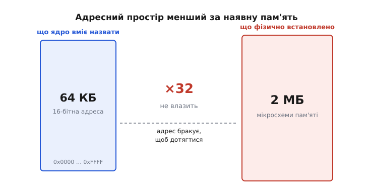
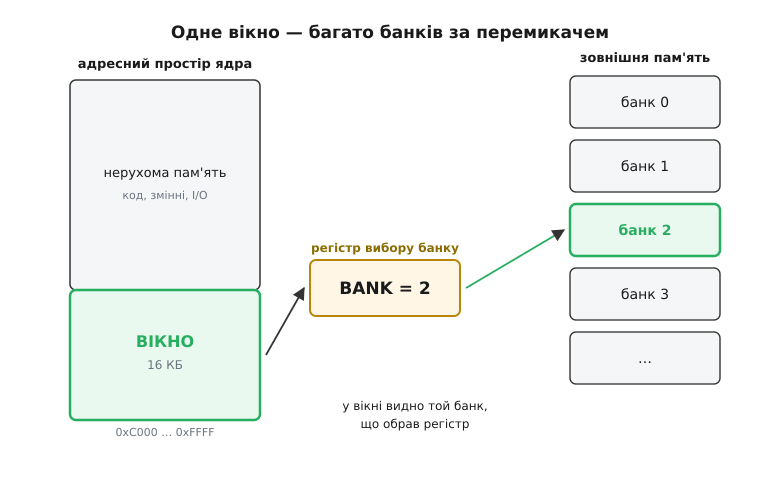

# MMU і вікна зовнішньої пам'яті

Процесор називає комірку пам'яті числом — адресою. І тут криється тиха, але залізна межа: скільки бітів у адресі, стільки й комірок можна назвати, ні на одну більше. Шістнадцятибітна адреса називає рівно 2¹⁶ = 65 536 байтів — 64 кілобайти, і край. А що, як пам'яті фізично **більше**, ніж вміщає адреса? Що, як зовнішня мікросхема несе два мегабайти, а ядро вміє вимовити лише 64 кілобайти? Числа, щоб дотягтися до решти, просто **немає** — воно за межею того, що адреса здатна виразити.

*Корінь усієї теми: адресний простір ядра — це стеля з кількості бітів адреси, і фізичної пам'яті буває більше, ніж під цю стелю влазить. До зайвої пам'яті немає числа, яким її назвати. Обидва підходи цієї статті — і апаратний MMU, і вікно банків — розв'язують саме цей розрив, тільки з різних боків.*

Ця стаття — про два дотепні способи обійти межу. Перший — **вікно** в адресному просторі: невелику ділянку адрес роблять «рухомою заслінкою», за якою по черзі показують різні шматки великої пам'яті. Другий, глибший — **MMU** (англ. *memory management unit* — «вузол керування пам'яттю»): окремий блок заліза, що **перекладає** кожну адресу від програми в справжню адресу мікросхеми, і завдяки цьому програма живе в одному просторі, а пам'ять розкладена зовсім інакше. Обидва б'ють в один розрив — брак адрес, — але роблять це так по-різному, що варто розібрати кожен від першопричини.

### Вікно: рухома заслінка в адресний простір

Почнімо з простішого й давнішого. Уявімо ядро з 64-кілобайтовим простором, до якого підключено 512 кілобайтів зовнішньої пам'яті. Уся вона одразу в простір не влазить — але ж програмі рідко потрібна **вся** пам'ять умить. Тоді напрошується хід: віддамо під зовнішню пам'ять не весь простір, а лише **шматочок** — скажімо, 16 кілобайтів адрес десь угорі, від 0xC000 до 0xFFFF. Цей шматочок і буде **вікном** (англ. *window*, також *aperture* — «отвір»). Решта простору лишається під код, змінні та ввід-вивід — вона нерухома.

Уся сіль у тому, що́ саме видно **крізь** вікно. Зовнішню пам'ять ріжуть на однакові скибки того ж розміру, що й вікно — по 16 кілобайтів; кожну таку скибку звуть **банком** (англ. *bank* — «сховище, ряд»). Банків тут 512/16 = 32. А поряд ставлять маленький **регістр вибору банку**: запишеш у нього число 2 — і крізь вікно видно банк 2; запишеш 5 — крізь те саме вікно видно вже банк 5. Адреси у вікні не змінюються (це завжди 0xC000…0xFFFF), змінюється лише те, **який фізичний банк** до цих адрес зараз під'єднано.

*Механізм вікна цілком. Ділянка адрес (вікно) нерухома; регістр вибору банку каже, яку скибку зовнішньої пам'яті до неї підключити. Один запис у регістр — і крізь те саме вікно видно інший банк. Ядро «бачить» за раз лише один банк, зате перебирати їх може скільки завгодно, дотягуючись так до пам'яті, куди прямої адреси немає.*

Як це працює на рівні дротів — красиво просто. Регістр вибору банку — це просто кілька додаткових **старших** бітів адреси, які ядро саме назвати не вміло, тож їх «домальовує» зовні латч (засувка), у який ядро й пише номер банку. Молодші 14 бітів адреси (16 КБ = 2¹⁴) приходять від ядра як завжди й обирають місце **всередині** банку; старші біти беруться з регістра й обирають, **який банк**. Разом вони складають ширшу фізичну адресу, ніж ядро здатне вимовити напряму. По суті, регістр — це руками керована «нарощена» частина адреси.

> 🔧 **Навіщо це.** Вікна банків — не музейна старовина. Той самий принцип живе в кожному сучасному мікроконтролері, коли зовнішню флеш-пам'ять чи псевдо-статичну RAM підключають через контролер зовнішньої пам'яті (у STM32 це FMC) або по швидкому послідовному каналу QSPI/OCTOSPI у **режимі відображення в пам'ять**. Тоді зовнішня мікросхема з'являється як **регіон** в адресному просторі ядра — наприклад, від 0x60000000 чи 0x90000000, — і читається зі звичайного покажчика, ніби вона внутрішня. Це те саме вікно, лише регіон широкий і банк часто один; але сама ідея «зовнішня пам'ять видна крізь ділянку адрес» — ось вона. Зрозумівши вікно на 8-бітній машині, ви впізнаєте його в конфігурації FMC на 32-бітній.

Історія цього прийому давня й повчальна: перші мікрокомп'ютери вперлися в межу адрес майже одразу, і вікна банків стали стандартною відповіддю — від восьмибітних машин до картриджів ігрових консолей і до знаменитої «розширеної пам'яті» на ранніх ПК. Хто, коли й навіщо це вигадав — у [зносці про народження вікон банків і MMU](topic:programming/mmu-address-window/hist-bank-switching-mmu.md): там і перша мікромашина з перемиканням банків, і чому мегабайти на ПК десятиліттями діставали крізь 64-кілобайтову шпарину.

### Ціна вікна: усе тримається на дисципліні коду

За простоту вікна платить **програміст**, і платить пильністю. Перша й головна вада — **видно лише один банк за раз**. Дані з банку 3 і дані з банку 7 не існують у просторі одночасно; щоб торкнутися других, треба спершу переписати регістр — і тоді перші **зникають** із вікна. Не можна просто взяти покажчик на щось у банку 3 і покажчик на щось у банку 7 та скласти їх: у мить, коли ви дивитеся на один, другий недосяжний. Звичайний плаский код, що вільно бігає покажчиками по всій пам'яті, тут ламається.

Звідси випливає підступна пастка, варта того, щоб назвати її прямо. Покажчик у мові C — це **лише адреса усередині простору**; він **не пам'ятає**, який банк був увімкнений, коли ви його взяли. Візьмете адресу 0xC100, поки активний банк 2, збережете покажчик, потім десь перемкнете регістр на банк 5 — і той самий покажчик 0xC100 тепер мовчки веде в **банк 5**, до зовсім інших даних. Жодної помилки компілятор не побачить: адреса ж чинна. Це один із найковарніших класів помилок у коді з банками — «покажчик пережив своє вікно». Тому працю з банками зазвичай ховають за акуратними обгортками: перемкни банк → зроби діло, поки він активний → і ніколи не тримай «голих» покажчиків у вікно між перемиканнями.

Друга ціна — **швидкодія й переривання**. Перемикання банку саме по собі дешеве (один запис у регістр), але навколо нього доводиться думати. Що, як [переривання](topic:programming/interrupt-vector) прилетить саме тоді, коли ви перемкнули банк заради своєї справи, а обробник теж полізе у вікно й перемкне його **під собою**? Повернетеся з переривання — а банк уже не той, який ви лишали. Тому в системах із банками обробник, що чіпає вікно, мусить **зберегти** старий номер банку на вході й **відновити** на виході — інакше основний код прокинеться в чужому банку. Ці два клопоти — живучість покажчиків і збереження банку в перериваннях — розібрано з робочим C-кодом у [зносці-проєкті про перемикання банків](topic:programming/mmu-address-window/proj-bank-window.md).

### MMU: перекладати, а не перемикати

Вікно чесне, але грубе: воно змінює карту пам'яті **вручну й для всіх одразу**, і код мусить постійно про це пам'ятати. Природно спитати: а чи не можна, щоб залізо саме, **непомітно** для програми, розкладало адреси куди треба? Саме це й робить **MMU** — і робить настільки прозоро, що програма взагалі не здогадується, де насправді лежать її дані.

Ідея одна, і вона змінює все. Між ядром і пам'яттю ставлять окремий блок — MMU, — крізь який проходить **кожна** адреса, яку називає програма. Адреса від програми — **віртуальна** (англ. *virtual* — «уявна»): це не адреса мікросхеми, а просто число в тому рівному просторі, який MMU показує програмі. MMU бере це число й **перекладає** його в **фізичну** адресу — справжнє місце в мікросхемі пам'яті. Програма каже «дай байт за адресою 0x4020», а MMU тихо перетворює це, скажімо, на 0x8A3020 — і байт приходить звідти, хоча програма про справжнє місце й не підозрює.

*Два підходи поряд. MMU (ліворуч) перекладає **кожну** адресу автоматично, залізом, на кожному доступі — програма не бачить і не керує цим. Вікно (праворуч) підміняє **одну** нерухому ділянку, і робить це **код**, вручну записуючи номер банку. MMU дає прозорий безмежний простір ціною складного заліза; вікно дає доступ до великої пам'яті ціною дисципліни коду.*

Щойно між програмою та пам'яттю стоїть перекладач, брак адрес розчиняється разом із купою інших проблем. Пам'ять ділять на однакові шматки — **сторінки** (англ. *page*, зазвичай 4 КБ), — і MMU веде **таблицю сторінок**: для кожної віртуальної сторінки записано, у якому фізичному кадрі вона зараз лежить. Тепер фізична пам'ять може бути розкидана, фрагментована, частина навіть виселена на диск — а програма все одно бачить свій суцільний рівний простір, бо MMU щоразу підставляє правильний кадр. Це і є [віртуальна пам'ять](topic:programming/virtual-memory) — та сама ідея, лише розгорнута повністю.

Порівняймо чесно, у чому MMU переважає вікно, а в чому програє. MMU **прозорий**: код пише звичайні покажчики й нічого не перемикає — уся підстановка на залізі. MMU дає **захист**: кожна сторінка має права (читати / писати / виконувати), і спроба залізти не туди ловиться апаратно — звідси [розділення адресних просторів](topic:programming/address-space-separation) між програмами, коли кожна замкнена у своєму й не дістане чужого. І MMU знімає стелю адрес по-справжньому, а не крізь шпарину. Ціна — **складність**: MMU це чималий блок заліза, таблиці сторінок займають пам'ять, а сам переклад коштує часу. Вікно ж копійчане в залізі (латч і регістр), зате перекладає весь тягар на плечі коду.

### Чому переклад дешевий: кеш перекладів

У MMU є вада, яка могла б усе занапастити, і варто побачити, як її обходять. Таблиця сторінок описує **весь** простір, тож вона велика й лежить у тій самій повільній головній пам'яті. Виходить прикре: щоб прочитати одне число, MMU мусить спершу сходити в пам'ять **по переклад** (у сучасних машин таблиця багаторівнева, тож це навіть кілька походів), а вже тоді — по саме число. Один логічний доступ обертається кількома фізичними; програма гальмує на рівному місці.

Рятує спостереження про природу цих перекладів. Програми не скачуть навмання по всьому простору — вони товчуться на жменьці сторінок: той самий код у циклі, той самий масив, той самий стек. А коли той самий переклад потрібен знову й знову, його треба **тримати під рукою**, а не діставати щоразу заново. Саме це й робить крихітний надшвидкий кеш перекладів — [TLB](topic:programming/tlb): він зберігає кілька останніх пар «віртуальна сторінка → фізичний кадр», і майже кожна адреса перекладається за один такт, без походу в таблицю. Це той самий принцип, що ховає повільність пам'яті взагалі, — [кеш гарячого під рукою](topic:programming/cache), лише прикладений до перекладу адрес. Завдяки TLB прозорість MMU дається майже задарма: складне залізо працює, а програма бачить лише швидкий рівний простір.

### Захисник без перекладу: MPU

Тут криється поширена плутанина, і її варто розвіяти прямо, бо вона коштує людям годин. Слово «MMU» часто чіпляють до будь-якого «керування пам'яттю» — а насправді в малих системах стоїть його простіший родич, і плутати їх шкідливо. Величезна більшість мікроконтролерів (усе сімейство ARM Cortex-M) MMU **не має** й віртуальної пам'яті **не знає**. Замість перекладу там працює **MPU** (англ. *memory protection unit* — «вузол захисту пам'яті»).

Різниця в одному, але засадничому: MPU **не перекладає** адрес. Адреса від програми йде в пам'ять як є — фізичною вона й лишається. MPU лише сторожить: ділить простір на кілька регіонів (типово до 16) і кожному призначає права — читати, писати, виконувати, доступ із привілейованого коду чи ні. Виліз за дозволене — апаратна пастка ([виняток процесора](topic:programming/cpu-exception-handling)). Тобто MPU бере від MMU половину роботи — **захист**, — але не бере другу половину — **переклад**. Через це він набагато простіший і майже не гальмує: не треба ані таблиць сторінок, ані TLB, ані походів у пам'ять по переклад; при зміні задачі досить перезарядити кілька регістрів.

Чому в мікроконтролерах вибрали саме MPU — випливає з їхньої природи. Їм не потрібен безмежний прозорий простір: пам'яті мало, вона вся вміщається в адреси, задачі відомі наперед. Зате дуже потрібен **захист** — щоб збійна задача не затерла чужі дані чи стек ядра. MPU дає рівно це, дешево й без затримок, і тому пасує реальному часу, де кожен такт лічений. А переклад адрес — коли пам'яті таки більше, ніж адрес, — у світі мікроконтролерів роблять не MMU, а тим самим **вікном**: контролером зовнішньої пам'яті чи QSPI у режимі відображення. Тож на малому залізі вживаються два різні інструменти: MPU береже, вікно розширює — а повноцінний MMU з віртуальною пам'яттю живе на «великих» ядрах (ARM Cortex-A, процесори ПК і серверів), де крутяться повноцінні операційні системи з багатьма програмами.

### Одна межа, дві відповіді

Тепер видно, як усе сходиться. Корінь один: адреса — це число обмеженої ширини, тож вона ставить стелю на те, скільки пам'яті можна назвати, і фізичної пам'яті буває більше. Проти цієї стелі є дві відповіді, і вони не суперники, а різні інструменти під різні задачі.

**Вікно** лишає адресний простір як є й підміняє в ньому одну ділянку, показуючи крізь неї по черзі різні банки великої пам'яті. Дешеве в залізі, старе як самі мікрокомп'ютери, живе донині в контролерах зовнішньої пам'яті мікроконтролерів. Ціна — дисципліна коду: видно один банк за раз, покажчики не переживають перемикання, переривання мусять берегти банк.

**MMU** ставить між програмою та пам'яттю апаратного перекладача, що прозоро й автоматично відображає віртуальні адреси у фізичні. Знімає стелю по-справжньому, дає захист і окремий простір кожній програмі, а повільність таблиці ховає за [TLB](topic:programming/tlb). Ціна — складне залізо; тому в малих системах його заміняє простіший **MPU**, що бере від MMU лише захист без перекладу.

Знати обидва варто саме тому, що трапляються вони на різних полюсах світу заліза: вікно й MPU — на кожному мікроконтролері, повний MMU — на всьому, що більше за нього. Але думка під ними одна: коли прямої адреси до пам'яті бракує, її або **перемикають** руками крізь вікно, або **перекладають** залізом крізь MMU.

---

**Коротко.** Ширина адреси ставить стелю на пам'ять, яку можна назвати; фізичної буває більше. **Вікно (перемикання банків)** лишає простір як є й віддає під зовнішню пам'ять одну нерухому ділянку-**вікно**, а **регістр вибору банку** каже, яку скибку-**банк** великої пам'яті до неї підключити зараз (регістр — це руками нарощені старші біти адреси). Дешево в залізі, живе й сьогодні у контролерах зовнішньої пам'яті (FMC, QSPI у режимі відображення, регіони на кшталт 0x60000000/0x90000000). Ціна — дисципліна коду: видно **один банк за раз**, покажчик **не пам'ятає** свого банку (класична пастка), [переривання](topic:programming/interrupt-vector) мусять зберігати й відновлювати банк. **MMU** натомість ставить між програмою й пам'яттю апаратного перекладача: кожну **віртуальну** адресу він переводить у **фізичну** через **таблицю сторінок**, даючи прозорий рівний простір ([віртуальну пам'ять](topic:programming/virtual-memory)), захист сторінок і [окремий простір кожній програмі](topic:programming/address-space-separation); повільність таблиці ховає кеш перекладів [TLB](topic:programming/tlb). Ціна MMU — складне залізо, тож у мікроконтролерах (ARM Cortex-M) його заміняє **MPU** — захист регіонів **без** перекладу, дешевий і швидкий; повний MMU живе на «великих» ядрах (Cortex-A, ПК). Одна межа — дві відповіді: **перемкнути** банк вручну або **перекласти** адресу залізом.
