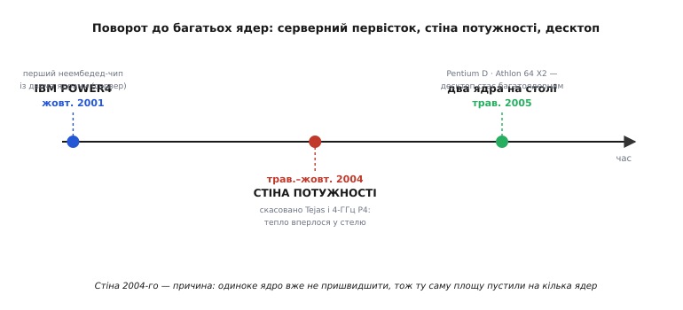

# 📜 Поворот індустрії до багатьох ядер

Десятиліттями розробники процесорів жили за однією звичкою: щоб машина стала швидшою, треба підняти частоту такту. 1 МГц, 100 МГц, 1 ГГц — крива йшла вгору так упевнено, що в галузевих прогнозах кінця 1990-х спокійно малювали 10 ГГц до початку 2010-х. А потім, десь між 2004 і 2005 роком, ця крива зламалася. Настільний процесор і сьогодні крутиться на тих самих ~4–5 ГГц, що й двадцять років тому. Натомість усередині чипа з'явилося те, чого раніше не було: не одна обчислювальна машина, а кілька — два ядра, чотири, вісім.

Це не був плавний технічний прогрес, який просто дійшов до наступного пункту. Це був **поворот** — різкий, вимушений, і всі три великі гравці зробили його майже одночасно, бо вперлися в одну й ту саму фізичну стіну. Історія цього повороту цікава тим, що показує рідкісну річ: як ціла індустрія за кілька років передумала, куди їй іти, — і як перший крок зробила не та компанія, від якої цього чекали, і не з тих причин, які потім стали хрестоматійними.

## Хто зробив це першим — і чому саме він

Коли згадують багатоядерні процесори, у голові спливають Intel та AMD і їхні настільні чипи. Але **перший** комерційний неембедед-процесор із двома ядрами на одному кристалі зробила не вони. Його зробила IBM, і називався він **POWER4**. Його оголосили 4–5 жовтня 2001 року разом із сервером eServer pSeries 690, що мав кодову назву «Regatta»; у грудні того ж року почалися об'ємні постачання. (Статус доказовості: усталено — дати збігаються в архіві The Register, прес-релізі IBM та енциклопедичних джерелах.)

Уточнимо межу, бо вона важлива. «Перший неембедед» — не означає «перший узагалі покласти два обчислювальні блоки на кремній»; у вбудованому світі багатоблокові рішення траплялися й раніше. POWER4 був першим **серед звичайних процесорів загального призначення** — тих, що стоять у серверах і робочих станціях, — хто розмістив два повноцінні ядра на одному кристалі. Це формулювання («the first non-embedded microprocessor to do so») переходить з джерела в джерело майже дослівно, і воно точне: саме тут проходить лінія, за якою починається сучасна багатоядерність.

Найцікавіше — **чому** IBM зробила це першою. Спокуса — сказати «бо були найрозумніші». Правда тонша й повчальніша. Роботу над POWER4 почали приблизно 1996 року — того ж, коли Intel випустила Pentium Pro. Головним архітектором був **Джим Кейл** (Jim Kahle) — американський інженер IBM. Його команда розглядала, як витиснути з процесора більше швидкодії, і на столі лежали найпередовіші на той час ідеї: усе складніші способи виконувати більше інструкцій одного потоку водночас — глибше занурення в **паралелізм на рівні інструкцій** (instruction-level parallelism). Це був магістральний шлях галузі: зробити одне ядро дедалі хитрішим, щоб воно саме знаходило, що можна порахувати паралельно всередині послідовного коду.

І тут команда Кейла зробила несподіване: вона **відмовилася** від кожної з цих модних ідей одну за одною й вибрала найконсервативніший варіант — просто покласти на кристал **два** ядра. Не одне надскладне, а два звичайні. Пізніше Кейл підсумував це коротко: «Turned out to be a good idea» — «виявилося, добра думка». (Статус доказовості: усталено — переповідання самого Кейла в матеріалі IEEE Spectrum про поширення багатоядерності.)

Варто відчути, наскільки це проти течії. Уся індустрія бігла в бік «розумнішого одинокого ядра», а IBM обрала «двох простіших» саме тому, що це було **надійніше** й простіше довести до робочого стану, а не тому, що хтось наперед бачив стіну потужності. Тобто перший крок до сучасної багатоядерності зробили не з великої стратегії, а з інженерної обережності. Стіна, яка згодом **змусить** усіх піти цим шляхом, тоді ще не постала на повний зріст — POWER4 забіг уперед з інших міркувань і випадково опинився там, куди решта прийде за кілька років під тиском фізики.

Кілька сухих цифр, щоб уявити цю машину (усталено, за Wikipedia й оглядом POWER4): два ядра на кристалі, 174 мільйони транзисторів на чип, техпроцес 180 нм (згодом 130 нм), частота 1.1–1.3 ГГц, кеш L2 близько 1.4 МБ на чип і великий L3 поза кристалом. Для 2001 року це був потужний серверний звір, і два ядра в ньому були природним продовженням його призначення — молотити багато незалежної роботи водночас.

## Стіна, у яку вперлися всі

Щоб зрозуміти, чому за POWER4 усі пішли — і чому пішли саме тоді, а не раніше, — треба глянути на те, що коїлося в Intel у 2004 році. Це найдраматичніша частина історії, бо тут добре видно, як фізика ламає плани найбільшого гравця.

Логіку гонитви за частотою тримала одна фізична формула. Потужність, яку динамічно споживає й розсіює в тепло цифрова схема, поводиться приблизно так:

```
P ≈ C · V² · f
```

де `C` — сумарна ємність, що перемикається, `V` — напруга живлення, а `f` — частота такту. Дивишся на неї — і видно два важелі, якими піднімали швидкодію: `f` (частота) і, щоб частота бралася, часто доводилося тримати вищою `V`. Пастка — у квадраті напруги. Поки вдавалося з кожним новим техпроцесом **знижувати** `V`, підняття `f` майже нічого не коштувало по теплу, і гонитва йшла вільно. Але зниження напруги вперлося у власну фізичну межу — нижче певного рівня транзистор перестає надійно перемикатися, — і тоді кожен наступний крок частоти почав оплачуватися теплом уже без знижки.

Intel це відчула на своїй лінійці Pentium 4 з ядром Prescott, а по-справжньому — на тому, що мало прийти за ним. Наступник мав кодову назву **Tejas** (і супутній серверний **Jayhawk**); неофіційно його називали навіть «Pentium V». Планка була зухвала навіть за мірками гонки: стартові частоти 7 ГГц і більше, з прицілом на 10 ГГц ближче до 2011 року. А тоді почала проступати реальність. Ранній зразок Tejas на 90 нм при **лише 2.8 ГГц** уже мав тепловий пакет близько **150 Вт** — тоді як Prescott на тій самій частоті сидів десь на 84 Вт. (Статус доказовості: усталено щодо факту й порядку цифр — Wikipedia про Tejas/Jayhawk із посиланнями на галузеві звіти того часу; конкретні ватти — оцінки за ранніми зразками, тож «близько».)

Порахуймо, що ця цифра означала, бо вона й є та сама стіна на дотик:

**Умова.** Зразок Tejas: ~150 Вт уже при 2.8 ГГц. Скільки він з'їв би, якби його справді розігнали до заявлених 7 ГГц — за наївного припущення, що тепло росте бодай лінійно з частотою?

```
співвідношення частот:  7.0 / 2.8  =  2.5
оцінка потужності:      150 Вт · 2.5  ≈  375 Вт      // і це БЕЗ підняття напруги
```

Майже 400 ват з крихітного кристала — і то за оптимістичного припущення, бо насправді на таких частотах довелося б піднімати ще й напругу, а вона входить у формулу **квадратом**. Відвести стільки тепла зі шматочка кремнію звичайним настільним охолодженням просто неможливо: чип швидше згорить, ніж дорахує. Саме цю межу — не «як швидко перемикаються транзистори», а «скільки тепла взагалі можна з чипа зняти» — називають [стіною потужності](book:programming/power-wall).

> 🔧 **Навіщо це.** Це не музейна історія про давні чипи. Той самий бар'єр і сьогодні стоїть у вашому ноутбуці й телефоні: частота одного ядра вперлася в тепло раз і назавжди, тож більше швидкодії дає тепер не «швидше», а «ширше» — кілька ядер, кожне холодне. Хто пише лише послідовний код, застряг на швидкості одного ядра ще з 2004-го; хто вміє ділити роботу на потоки — росте разом із залізом. Уся сучасна боротьба за продуктивність — це нащадок стіни, у яку Tejas вдарився першим.

Далі події пішли швидко. 7 травня 2004 року Intel **скасувала** Tejas і Jayhawk. А 14 жовтня того ж 2004-го — тихо поховала й плани на 4-ГГц Pentium 4, той самий, що спершу обіцяли до різдвяних свят, потім відсунули, а потім зняли зовсім. За цим стояв тодішній президент Intel **Пол Отелліні** (Paul Otellini), який відкрито вів компанію геть від мегагерців як головного мірила швидкодії. Того ж дня Intel сказала прямо: інженерів і ресурси перекидають на пришвидшення **двоядерних** чипів для настільних машин, серверів і ноутбуків, і перші такі чекайте наступного року. (Статус доказовості: усталено — дати й формулювання з The Register, Electronics Weekly та Tech Monitor за жовтень 2004.)

Один образ із того часу закарбувався найкраще. Інженери Intel показували: якщо й далі гнати частоту за старим трендом, то щільність потужності на кристалі до кінця десятиліття дійде до рівня, коли чип став би гарячим, як **поверхня Сонця**. Гіпербола, звісно, але вона точно передає суть тупика: далі гнати частоту — фізично нікуди. Отже, треба повертати.


*Три віхи повороту на одній осі. IBM забігла вперед 2001-го з інженерної обережності, коли стіни ще не було видно. У 2004-му стіна постала на повний зріст — Intel скасувала свої надчастотні проєкти. І вже 2005-го два ядра прийшли на звичайний настільний комп'ютер. Середня віха — причина третьої: одиноке ядро вже не пришвидшити, тож ту саму площу кремнію пустили на кілька ядер.*

## Два ядра приходять на настільний стіл

2005 рік став тим, коли багатоядерність зійшла з серверів на звичайний робочий стіл. І тут між Intel та AMD стався короткий, але промовистий забіг — різниця в кілька тижнів, за якою ховається різниця в інженерній чесності підходу.

Intel, кинувши ресурси на двоядерність після краху Tejas, поспішала. Першим вийшов флагманський **Pentium Extreme Edition 840** — 16 квітня 2005 року. А 26 травня 2005-го з'явилася масова лінійка **Pentium D** (кодова назва ядра — Smithfield) з моделями 820, 830, 840 на частотах 2.8, 3.0, 3.2 ГГц. (Статус доказовості: усталено — Wikipedia про Pentium D із зазначенням обох дат.)

Тут варто зупинитися на тому, **як** саме Intel зробила ці два ядра, бо це показова деталь. Smithfield був єдиним кристалом, але два його ядра були, по суті, двома окремими процесорами, вирізаними з однієї пластини й поставленими поряд, а спілкувалися вони між собою назовні — через ту саму системну шину (front-side bus), що дісталася в спадок ще з 1996 року. Це рішення виглядало похапцем зробленим — і таким воно й було: Intel треба було дати ринку двоядерний чип **швидко**, тож вона взяла те, що мала, і склала докупи.

AMD пішла іншим шляхом і встигла лише на кілька тижнів пізніше. **Athlon 64 X2** вийшов 31 травня 2005 року — на п'ять днів після масового Pentium D. І саме він, а не чип Intel, увійшов в історію як **перший нативний двоядерний настільний процесор**. (Статус доказовості: усталено — Wikipedia прямо називає Athlon 64 X2 «the first native dual-core desktop CPU».)

Що означає це «нативний» — і чому воно важливе? На відміну від зліпленого нашвидкуруч Smithfield, AMD ще проєктуючи свою архітектуру K8 заздалегідь заклала в неї вузол зв'язку між ядрами — так званий північний міст (northbridge) з контролером пам'яті прямо на кристалі, — розрахований на кілька ядер. Ця зріла логіка керування багатьма ядрами прийшла до десктопного X2 у спадок від серверного Opteron. Тому два ядра Athlon 64 X2 спілкувалися **всередині** чипа, коротким швидким шляхом, а не через зовнішню шину, як у Intel. Різниця була відчутна на практиці: огляди й спільнота того часу дійшли згоди, що реалізація багатоядерності в AMD **краща** за Pentium D.

Ось у чому мораль цього забігу. Виграти кілька тижнів у даті виходу — не те саме, що зробити краще. Intel формально випередила з масовим двоядерним чипом на п'ять днів, але зробила його способом «два процесори в одному корпусі», а AMD, хоч і пізніше, дала **справжній** двоядерний кристал, задуманий такими з самого початку. «Нативний» тут — не маркетингове слово, а точна технічна різниця між «склали докупи те, що було» і «спроєктували як одне ціле».

## Чому поворот стався саме так, а не інакше

Зведімо цю історію в один причинно-наслідковий ланцюг, бо він пояснює форму всіх сучасних процесорів.

Спершу була звичка гнати частоту, і трималася вона на тому, що напругу вдавалося знижувати разом із техпроцесом — тепло не встигало накопичуватися. Коли зниження напруги вперлося у фізичну межу, кожен наступний герц почав коштувати теплом уже без знижки, і десь коло 2004-го тепловий бюджет чипа переповнився. Intel це відчула найбільше, бо гналася за частотою найзавзятіше, — і саме її надчастотні проєкти першими розбилися об стіну.

Далі логіка проста. Якщо одне ядро вже не можна зробити швидшим, бо воно впреться в тепло, то ту саму площу кремнію й той самий бюджет тепла розумніше витратити **інакше** — на кілька скромніших ядер, кожне з яких лишається холодним, а їхня **сума** дає ту продуктивність, якої одиноке ядро вже не досягало. Саме сюди — до кількох ядер на кристалі — і повернула вся індустрія у 2004–2005 роках.

І ось де історія робить елегантне коло. Той самий устрій — кілька ядер на одному кристалі, — до якого стіна потужності **приперла** Intel та AMD у 2005-му, IBM спокійно збудувала ще 2001-го, до всякої стіни, просто з інженерної обережності. Джим Кейл вибрав два простих ядра замість одного надскладного не тому, що бачив майбутнє, а тому, що так було надійніше. Виявилося, що надійніше й було майбутнім. Стіна лише підтвердила його вибір і зробила його обов'язковим для всіх.

Тому коли ви сьогодні відкриваєте специфікацію будь-якого процесора й бачите там чотири, вісім чи шістнадцять ядер, ви дивитеся на прямий наслідок тих кількох років. Це форма, яку задала фізика: одиноке ядро вперлося у стіну близько 2004-го, і єдиний спосіб рости далі, який лишився галузі, — рости не вгору по частоті, а вшир по ядрах. POWER4 показав, що так можна, ще до того, як стало **треба**; стіна 2004-го зробила це «можна» — «мусимо»; а 2005-й привів багатоядерність на стіл до кожного.
