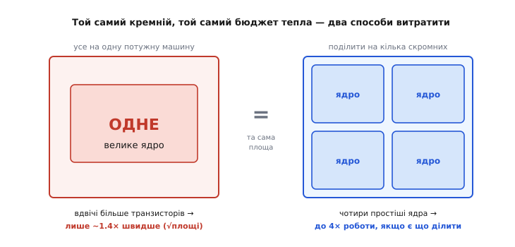

# Багатоядерні процесори

Відкрийте специфікацію майже будь-якого сучасного процесора — від того, що в ноутбуці, до крихітного чипа в розумній розетці, — і ви побачите там не одну обчислювальну машину, а кілька, зібраних на одному шматку кремнію. Чотири ядра, вісім, шістнадцять. Це стало таким звичним, що легко проґавити, наскільки це дивне рішення. Одне потужне ядро було б простішим для програміста в усьому: пиши собі послідовний код, і він виконується. Навіщо ж інженери свідомо порізали процесор на кілька менших машин, змусивши весь світ учитися писати паралельні програми? Відповідь не в тому, що так «краще» саме по собі. Багатоядерність — це **вимушений хід**, наслідок фізичної межі, у яку вперлася гонитва за швидшим одиноким ядром. Зрозумієш, об що вона вдарилася, — зрозумієш, чому весь сучасний процесор має саме таку форму.

**Ядро** (англ. *core*) тут — це одна повноцінна обчислювальна машина: свій пристрій керування, свої регістри, свій арифметико-логічний блок, свій [конвеєр](topic:programming/pipeline). Ядро вміє саме по собі виконувати послідовність інструкцій — фактично це цілий процесор. **Багатоядерний процесор** — це кілька таких машин на одному кристалі, що ділять спільні ресурси (пам'ять, кеші нижніх рівнів, шини) і можуть працювати **водночас**, кожне над своїм потоком команд.

### Чому не просто зробити одне ядро швидшим

Найприродніший спосіб пришвидшити процесор — підняти [частоту такту](topic:programming/clock-frequency): що більше тактів за секунду, то більше інструкцій устигається. Десятиліттями так і робили — 1 МГц, 100 МГц, 1 ГГц, — і темп був такий, що от-от чекали 10 ГГц. А тоді, десь у 2004-му, зростання частоти просто спинилося, і досі настільний процесор крутиться на тих самих ~4–5 ГГц. Причина фізична: потужність, яку споживає й розсіює в тепло чип, росте разом із частотою й **квадратом** напруги живлення, а підняти частоту без підняття напруги на якомусь етапі вже не виходить. Чип упирається в те, скільки тепла з нього взагалі можна відвести, — цю межу звуть [стіною потужності](topic:programming/power-wall).

> 🔧 **Навіщо це.** Стіна потужності — це не історична дрібниця, а причина, чому у вас на столі й у кишені саме багатоядерні чипи. Розробнику це задає спосіб мислення: більшу продуктивність тепер дає не «швидше», а «ширше» — паралельно. Якщо ваш код уміє тільки послідовне, він застряг на швидкодії одного ядра ще з часів, коли частота перестала рости; якщо вміє ділитися на кілька потоків — він масштабується разом із залізом. Уся боротьба за швидкодію в сучасному коді точиться навколо цього.

Але навіть якби тепло не заважало, є друга, тонша причина не робити одне гігантське ядро. Її вловив інженер Intel **Фред Поллак** (Fred Pollack) у спостереженні, що нині звуть **правилом Поллака** (*Pollack's rule*): продуктивність одного ядра росте приблизно як **корінь** із його складності. Тобто вкладете вдвічі більше транзисторів в одне ядро — воно стане швидшим лише десь у √2 ≈ 1.4 раза, а не вдвічі. А от **потужність** від того подвоєння транзисторів росте майже лінійно — тобто вдвічі. Складіть це докупи: одиноке ядро — це вкладення, що дає все менший приріст швидкості за все більшу ціну в транзисторах і теплі.

А тепер порівняйте з альтернативою. Ту саму площу кремнію й той самий бюджет тепла можна витратити не на одне роздуте ядро, а на **кілька скромніших**. Чотири простих ядра на місці одного великого дають, у найкращому разі, вчетверо більше виконаної роботи — за той самий кремній. Різниця разюча.


*Однаковий шматок кремнію й однаковий тепловий бюджет — два способи витратити. Ліворуч: усе в одне велике ядро; подвоєння транзисторів у ньому за правилом Поллака дає лише ~1.4× швидкодії, а тепло росте вдвічі. Праворуч: та сама площа, поділена на чотири простіші ядра — до 4× сумарної роботи. Ось чому індустрія повернула на багато ядер: за той самий кремній їх сукупно продуктивніше.*

Ось повна картина того, чому процесор порізали. Одне ядро вперлося у стіну потужності (швидше не виходить) і в правило Поллака (дорожче за все менший приріст). Кілька ядер обходять обидві межі: кожне лишається скромним і холодним, а їхня **сума** дає ту продуктивність, якої одиноке ядро вже не могло досягти. Історію самого повороту — від першого дводкового серверного чипа до дня, коли два ядра прийшли на настільний стіл, — я виніс у [окрему вставку про поворот до багатоядерності](topic:programming/multicore/hist-multicore-turn.md).

### Розплата: тепер програму треба вміти ділити

Тут криється головна незручність. Одне швидке ядро пришвидшувало **будь-яку** програму задарма: старий послідовний код на новому ядрі просто йшов швидше, від програміста нічого не вимагалося. Багато ядер такого дарунка не дають. Чотири ядра прискорять вашу програму вчетверо, **лише якщо є що виконувати вчетверо** — тобто якщо роботу вдалося розкласти на чотири незалежні шматки, які йдуть одночасно. Суто послідовна програма на восьмиядерному процесорі використає рівно одне ядро, а решта сім стоятимуть без діла.

Тобто багатоядерність перекладає тягар на програміста: щоб дістати швидкість, тепер треба **явно** розбити задачу на частини, які можна рахувати паралельно. Це роблять через **потоки** (англ. *threads*) — окремі нитки виконання в межах однієї програми, кожну з яких операційна система може поставити на своє ядро. Скільки незалежних потоків роботи ви створите й наскільки вони справді незалежні — рівно настільки й пришвидшитеся.

І тут виринає сувора межа, яку не обійти жодним залізом. Її 1967 року сформулював **Джин Амдал** (Gene Amdahl) — американський інженер, що тоді працював в IBM; відома вона як **закон Амдала** (*Amdahl's law*). Думка проста й безжальна: майже в кожній програмі є частина, яку **не можна** розпаралелити — вона мусить виконуватися послідовно (розбір вхідних даних, узгодження результатів, звернення до спільного ресурсу). І саме ця послідовна частина ставить стелю всьому прискоренню, хоч би скільки ядер ви додали.

Запишемо це. Нехай частка `p` роботи паралелиться, а решта `(1 − p)` — суто послідовна. На `N` ядрах паралельна частина йде в `N` разів швидше, послідовна — як була. Прискорення всієї програми:

```
S(N) = 1 / ( (1 − p) + p/N )
```

Найцікавіше — що буде, коли ядер дуже багато, `N → ∞`. Тоді `p/N` прямує до нуля, і лишається:

```
S(∞) = 1 / (1 − p)
```

Прискорення впирається в стелю, яку задає **сама лише послідовна частка**. Порахуймо на конкретиці, і стане видно, наскільки це жорстко.

**Умова.** Програма на 95% паралелиться (`p = 0.95`), тобто послідовних лише 5%. Скільки дадуть 16 ядер — і яка взагалі стеля?

:::tabs
```c
// S(N) = 1 / ((1 - p) + p/N)
// p = 0.95, послідовна частка (1 - p) = 0.05

// 16 ядер:
S(16)  = 1 / (0.05 + 0.95/16)
       = 1 / (0.05 + 0.059)
       = 1 / 0.109  ≈  9.2      // 16 ядер — а прискорення лише ~9×

// стеля (нескінченно ядер):
S(inf) = 1 / 0.05  =  20        // навіть тисяча ядер не дасть більше ×20
```
```py
# S(N) = 1 / ((1 - p) + p/N)
p = 0.95                       # послідовна частка (1 - p) = 0.05

# 16 ядер:
S_16  = 1 / (0.05 + 0.95/16)   # = 1 / (0.05 + 0.059)
                               # = 1 / 0.109  ≈  9.2   → 16 ядер, а прискорення лише ~9×

# стеля (нескінченно ядер, p/N → 0):
S_inf = 1 / 0.05               # = 20   → навіть тисяча ядер не дасть більше ×20
```
:::

Шістнадцять ядер дали не 16×, а лише ~9×, і скільки б ще ви не додавали — вище ×20 не підстрибнете **ніколи**, бо 5% послідовного коду тримають усю програму. А якщо паралелиться лише половина (`p = 0.5`) — стеля взагалі ×2, і восьме ядро майже нічого не додасть до четвертого.


*Прискорення від кількості ядер за законом Амдала. Пунктир — недосяжний ідеал, коли `N` ядер дають рівно `N`-кратне прискорення. Кольорові криві — реальність: навіть код, що паралелиться на 95%, швидко відстає від ідеалу, а код на 50% упирається у стелю ×2 вже на кількох ядрах. Що товща послідовна частка, то нижче й раніше крива виходить на плато. Ось чому «додати ще ядер» саме по собі майже ніколи не рятує.*

Практичний висновок гострий: додавати ядра варто рівно доти, доки послідовна частка не почала домінувати, а головна робота над швидкодією — не «взяти більше ядер», а **зменшити послідовну частку**, знайти в задачі більше незалежності. Часто вигідніше вкластися в те, щоб з 90% паралельного зробити 95%, ніж подвоїти кількість ядер.

### Як ядра пов'язані між собою: спільна пам'ять і два устрої

Кілька ядер треба якось з'єднати, щоб вони працювали над спільною задачею. Тут є два принципово різні устрої, і різниця між ними визначає весь стиль програмування.

Найпоширеніший у настільних і серверних процесорах — **симетрична багатоядерність** (*symmetric multiprocessing*, SMP). «Симетрична» означає: усі ядра **однакові** й **рівноправні**, усі бачать **ту саму пам'ять за тими самими адресами**, і над усіма стоїть **одна** операційна система, що розподіляє роботу. Задача — потік — може виконуватися на будь-якому вільному ядрі, і система вільно перекидає потоки між ядрами, вирівнюючи навантаження. Для програміста це зручно: пишеш потоки, а куди їх поставити — клопіт системи; спільні дані просто лежать у спільній пам'яті, до якої дотягуються всі.

Протилежний устрій — **асиметрична багатоядерність** (*asymmetric multiprocessing*, AMP). Тут ядра **різні за роллю**: кожне має свою задачу й часто свій шматок пам'яті, а спілкуються вони не спільною пам'яттю, а **повідомленнями** через визначені канали. Одне потужне ядро крутить головний застосунок, а мале — обслуговує щось окреме: радіо, обробку сигналів, реальний час, де важлива точність до мікросекунди й не можна дозволити, щоб важкий застосунок збив тайминг.


*Два устрої зв'язку ядер. Ліворуч — SMP: ядра однакові, пам'ять спільна й адресується однаково всіма, одна ОС вільно кидає задачі на будь-яке вільне ядро. Праворуч — AMP: ядра різні за призначенням, кожне живе у своєму світі (часто зі своєю пам'яттю) і спілкується з іншими повідомленнями. SMP простіший для загального коду, AMP дає жорсткий поділ ролей — одне ядро не заважає таймінгу іншого.*

Різницю варто відчути на живому прикладі, бо вона нікуди не зникає навіть у крихітних чипах. Візьмімо [ESP32](topic:programming/esp32-architecture) — популярний мікроконтролер із **двома** ядрами Xtensa LX6, що працюють на частоті до 240 МГц. Обидва ядра однакові й бачать спільну пам'ять за однаковими адресами — це апаратно **SMP**. Але типова прошивка користується ними асиметрично: одне ядро (його звуть PRO_CPU) віддають під стеки Wi-Fi і Bluetooth, а друге (APP_CPU) лишають під код застосунку. Так важкий застосунок не збиває тонкий тайминг радіо. Тобто залізо симетричне, а вжиток — по суті асиметричний. Це типова для вбудованих систем картина: SMP-чип, поділений на ролі вручну.

> 🔧 **Навіщо це.** Розрізняти SMP і AMP треба, коли розкладаєте роботу по ядрах у прошивці. На SMP-чипі можна віддати планувальнику вибір ядра — але тоді треба захищати спільні дані (про це нижче). Можна натомість **прив'язати** критичний до часу код до окремого ядра й лишити його в спокої — це і є AMP-стиль поверх SMP-заліза, саме так роблять на ESP32 з мережею. Правильний вибір залежить від того, що вам дорожче: рівномірне навантаження й гнучкість (SMP) чи передбачуваний тайминг ізольованого ядра (AMP).

### Ціна спільної пам'яті: коли ядра заважають одне одному

Спільна пам'ять — велика зручність SMP, але за неї є плата, і без розуміння цієї плати паралельний код або ламається, або гальмує. Плата двох сортів.

Перший сорт — **гонки за даними** (*data races*). Коли два ядра **одночасно** торкаються тієї самої змінної, а хоч одне — пише, результат стає непередбачуваним. Класичний приклад — двоє нарощують один лічильник. Здавалося б, `x++` — одна дія, та насправді вона розкладається на три кроки: прочитати `x`, додати одиницю, записати назад. Якщо два ядра прочитають однакове старе значення, кожне додасть свою одиницю й запише, — то з двох нарощень лишиться одне, друге просто зникне. Жодної помилки не буде, лічильник тихо збиватиметься. Проти цього потрібні **синхронізація** й **атомарні** операції — окрема велика тема про [атомарність і гонки](topic:programming/atomicity-races), без якої за спільну пам'ять братися небезпечно.

Другий сорт плати тонший і стосується самого заліза. Щоб кожне ядро не бігало по кожне число в повільну спільну пам'ять, у кожного ядра є **свій приватний [кеш](topic:programming/cache)** — швидка схованка з копіями гарячих даних. Але тоді одна комірка може існувати в кількох копіях — по одній у кеші кожного ядра. Щойно одне ядро змінює свою копію, копії в інших ядрах стають застарілими, і треба апаратно стежити, щоб усі бачили однакове значення. Ця машинерія — [когерентність кешів](topic:programming/cache-coherence) — працює постійно й непомітно, але вона **не безкоштовна**: коли ядра часто пишуть у сусідні дані, кеш-лінія починає «літати» від ядра до ядра, і код, який виглядає ідеально паралельним, раптом гальмує. Хто розкладає дані між ядрами, мусить цю ціну знати.

Обидва сорти плати ведуть до того самого правила: **найдешевша взаємодія між ядрами — це відсутність взаємодії**. Що менше ядра ділять даних, то менше і гонок, і когерентного трафіку, і то ближче реальне прискорення до ідеального. Найкращий паралельний код розрізає задачу так, щоб кожне ядро якомога довше працювало **у своєму кутку**, а зустрічалися ядра якомога рідше.

### Один чип, кілька машин — але ресурси спільні

Варто не переплутати: багато ядер на кристалі — це не просто кілька окремих процесорів, поставлених поряд. Ядра свої лише зверху — власний конвеєр, регістри, найближчий кеш. А **нижче** вони ділять спільне: кеш останнього рівня, контролер пам'яті, шини до периферії. Ця спільність — і сила, і межа. Сила — бо ядрам легко обмінюватися даними через спільний кеш, не бігаючи в повільну пам'ять. Межа — бо спільний ресурс один на всіх, і коли всі ядра разом навалюються на пам'ять, вони починають чекати одне одного в черзі до контролера. Тому вісім ядер майже ніколи не дають рівно 8× навіть на добре розпаралеленому коді: десь на шляху до спільної пам'яті вони стають у чергу.

Звідси й межа самого нарощування ядер. Спершу кожне додане ядро — це майже чистий виграш. Та що більше ядер, то щільніший потік звернень до спільної пам'яті й когерентного трафіку, і в якийсь момент нове ядро додає більше тисняви, ніж роботи. Тому реальні процесори балансують: досить ядер, щоб дати паралелізм, але не стільки, щоб вони задихнулися в черзі до спільних ресурсів. А щоб не гріти всі ядра одразу (стіна потужності нікуди не поділася), сучасні чипи ще й **на льоту** знижують частоту й напругу тим ядрам, що не завантажені, — цим керує [динамічне масштабування напруги й частоти](topic:programming/dvfs).

---

**Коротко.** **Ядро** — це повноцінна обчислювальна машина (свій конвеєр, регістри, АЛП); **багатоядерний процесор** — кілька таких машин на одному кристалі, що працюють водночас. Індустрія повернула на багато ядер **вимушено**: одиноке ядро вперлося у [стіну потужності](topic:programming/power-wall) (швидше не виходить, бо тепло росте з квадратом напруги) і в **правило Поллака** (складніше ядро дає лише √-приріст швидкості за лінійний приріст потужності). Та сама площа кремнію, поділена на кілька скромних ядер, дає більшу **сумарну** продуктивність. Але дарунок умовний: прискорення настає, **лише якщо задачу вдалося розкласти** на незалежні паралельні шматки (**потоки**), а **закон Амдала** ставить жорстку стелю — навіть 5% послідовного коду обмежують прискорення числом ×20, скільки б ядер не додати. Ядра з'єднують двома устроями: **SMP** (однакові ядра, спільна пам'ять, одна ОС розкидає задачі) і **AMP** (різні ролі, своя пам'ять, зв'язок повідомленнями); часто SMP-залізо, як у [ESP32](topic:programming/esp32-architecture), використовують по-асиметричному, прив'язуючи ролі до ядер. Спільна пам'ять коштує **гонок за даними** (потрібна [синхронізація](topic:programming/atomicity-races)) і трафіку [когерентності кешів](topic:programming/cache-coherence), тож найдешевша взаємодія ядер — її відсутність: різати задачу так, щоб ядра якнайдовше працювали у своєму кутку. І ядра ділять спільні кеш нижнього рівня, контролер пам'яті та шини — тому додавати їх без кінця марно: у якийсь момент вони починають чекати одне одного в черзі до спільних ресурсів.
