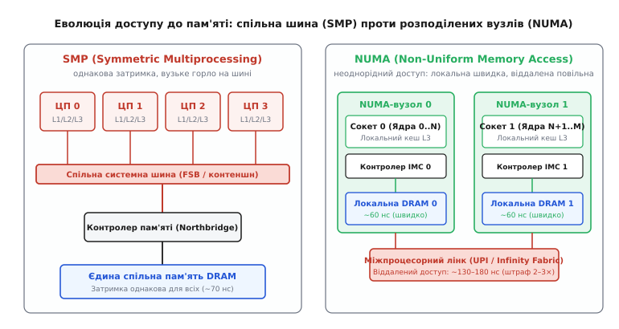
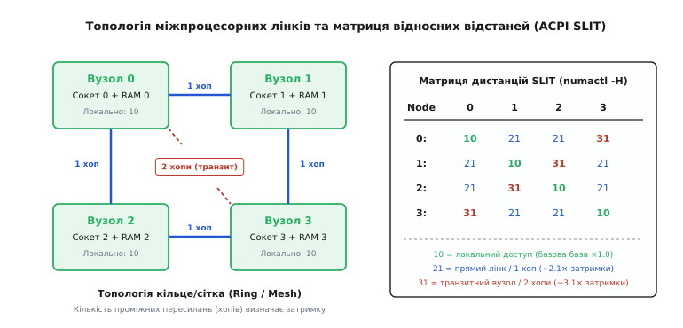
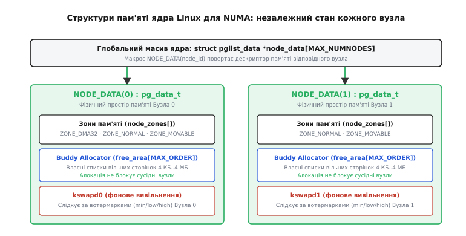
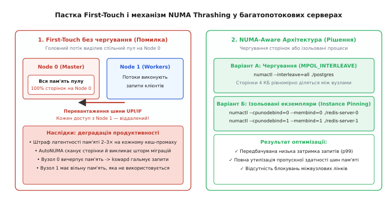

# Архітектура NUMA

<preknowlist>
- [Багатоядерні процесори](topic:programming/multicore) — паралельне виконання потоків на різних фізичних ядрах.
- [Кеш](topic:programming/cache) — ієрархія швидкої пам'яті (L1/L2/L3) та ціна кеш-промахів.
- [Когерентність кешів](topic:programming/cache-coherence) — протоколи узгодження стану спільних даних між різними ядрами.
- [Віртуальна пам'ять](topic:programming/virtual-memory) — сторінкова трансляція адрес, таблиці сторінок і page fault.
- [Системний виклик](topic:programming/system-call) — перехід у простір ядра для виділення сторінок і налаштування політик.
</preknowlist>

Команда інженерів переносить високонавантажену базу даних із односокетного сервера на потужну двопроцесорну машину: замість 16 ядер тепер доступно 64 ядра, а обсяг оперативної пам'яті зріс із 128 ГБ до 512 ГБ. Очікується кратне зростання пропускної здатності запитів. Проте після запуску спостерігається несподівана картина: середня швидкість виконання складних аналітичних запитів падає на 35%, а хвіст затримок (99-й процентиль) демонструє хаотичні сплески від 5 мілісекунд до 120 мілісекунд. Процесорні ядра завантажені лише на чверть, але більшу частину тактів вони просто стоять у черзі на очікування даних із пам'яті.

Причина цієї поведінки криється в тому, що на багатопроцесорному сервері пам'ять більше не є єдиним суцільним полем з однаковою швидкістю доступу. Кожне процесорне гніздо (сокет) має власні банки фізичної пам'яті. Коли потік на першому процесорі читає дані, виділені в пам'яті другого процесора, кожен промах повз локальний кеш змушений проходити через міжпроцесорну шину зв'язку, подвоюючи або потроюючи апаратну затримку. Цей фундаментальний принцип побудови апаратного забезпечення називається **архітектурою неоднорідного доступу до пам'яті** (англ. *Non-Uniform Memory Access*, NUMA, від лат. *non* — не, *uniformis* — однорідний).

### Чому симетрична пам'ять уперлася у фізичну стіну

Щоб зрозуміти, чому виробники процесорів розділили оперативну пам'ять на окремі домени, погляньмо на класичну схему симетричного багатопроцесорного обчислення (англ. *Symmetric Multiprocessing*, SMP).

У традиційній архітектурі SMP усі процесори під'єднувалися до єдиної системної шини (англ. *Front-Side Bus*, FSB), яка вела до північного мосту чипсета, де розташовувався спільний контролер оперативної пам'яті. Для програміста це був ідеальний світ: адреса `0x7fff0000` зчитувалася за однакові 70 наносекунд незалежно від того, яке саме ядро відправило запит.

Проте зі зростанням кількості ядер ця схема зазнала краху через три фізичні обмеження:

1. **Електричне навантаження та ємність шини**:
   Кожен новий процесорний роз'єм і кожен модуль DIMM, під'єднаний до спільних паралельних доріжок на материнській платі, збільшував паразитну ємність ліній. Щоб зберегти стабільність сигналів без перешкод, інженерам доводилося знижувати тактову частоту шини.
2. **Арбітраж і конкуренція (Bus Contention)**:
   Системна шина була спільним каналом із розділенням часу. Якщо Ядро 0 виконувало пакетне читання великого масиву, Ядро 15 було змушене чекати звільнення шини, навіть якщо зверталося до зовсім іншого банку мікросхем DRAM.
3. **Шторм повідомлень когерентності (Snooping Broadcast)**:
   Для підтримання єдиної картини даних кеші всіх процесорів безперервно прослуховували системну шину (механізм *Bus Snooping*). При 16 або 32 ядрах службовий трафік інвалідації кеш-ліній повністю забивав пропускну здатність магістралі.

Фізична межа масштабування спільної шини наставала вже при 4–8 процесорах. Єдиним способом нарощувати кількість ядер без падіння швидкодії пам'яті стала повна відмова від спільного чипсета та перенесення контролерів пам'яті безпосередньо на кристал кожного процесора.


*Зліва: класична архітектура SMP, де всі процесори конкурують за спільну шину FSB та єдиний контролер пам'яті. Справа: архітектура NUMA, де кожен сокет має власний інтегрований контролер і локальні модулі DRAM, а зв'язок між сокетами забезпечує точково-точкова шина.*

Детальну хронологію того, як індустрія переходила від ранніх суперкомп'ютерних експериментів до масових серверів, описано в [історичній вставці про перехід від SMP до NUMA](topic:programming/numa/hist-smp-to-numa.md).

### Анатомія NUMA-вузла та міжпроцесорні з'єднання

Базовою одиницею обчислювальної системи в архітектурі NUMA є **NUMA-вузол** (англ. *NUMA Node*).

У класичному двосокетному сервері один вузол відповідає одному фізичному сокету і включає:
- Групу процесорних ядер (наприклад, 32 фізичні ядра);
- Ієрархію кеш-пам'яті: індивідуальні кеші L1/L2 та великий спільний кеш третього рівня L3 (Last Level Cache, LLC);
- Інтегрований контролер пам'яті (англ. *Integrated Memory Controller*, IMC), що керує кількома прямими каналами DDR4/DDR5;
- Модулі оперативної пам'яті DRAM, під'єднані до цих каналів;
- Контролери міжпроцесорних інтерфейсів і кореневі комплекси шини PCIe (Root Complex).

Пам'ять, під'єднана до контролера власного вузла, називається **локальною** (англ. *Local Memory*). Пам'ять, під'єднана до контролерів інших сокетів, називається **віддаленою** (англ. *Remote Memory*).

#### Шлях локального доступу
Коли ядро виконує інструкцію читання `mov (%rax), %rbx`, запит спершу перевіряє локальні кеші L1, L2 і L3. Якщо виникає кеш-промах:
1. Запит надходить до локального контролера IMC на кристалі.
2. IMC адресує відповідний канал DRAM і зчитує 64-байтну кеш-лінію.
3. Дані повертаються в ядро.
Цей шлях займає приблизно **60–80 наносекунд** (або ~150–200 тактів сучасного процесора).

#### Шлях віддаленого доступу
Якщо адреса належить фізичному діапазону іншого сокета:
1. Локальний контролер вузла розуміє за старшими бітами адреси, що цільова пам'ять віддалена, і запаковує команду в службовий пакет.
2. Пакет передається через високошвидкісний диференційний лінк міжпроцесорного зв'язку.
3. Приймач на віддаленому сокеті розпаковує пакет і передає запит у свій віддалений контролер IMC.
4. Віддалений IMC зчитує 64 байти з локальної для нього DRAM.
5. Дані запаковуються у зворотний пакет і пересилаються назад через міжпроцесорний лінк.
6. Контролер початкового сокета отримує відповідь і завантажує її в конвеєр ядра.
Цей шлях займає вже **130–200 наносекунд**.

#### Сучасні міжпроцесорні шини: Intel UPI та AMD Infinity Fabric
Для зв'язку процесорів між собою замість паралельних шин використовуються високошвидкісні точково-точкові послідовні з'єднання:
- **Intel Ultra Path Interconnect (UPI)** (раніше *QuickPath Interconnect*, QPI): працює на швидкостях 10.4–16.0 ГТ/с (гігатранзакцій на секунду). Передає дані фіксованими блоками — флітами (англ. *Flits*, по 64 або 80 бітів), забезпечуючи повну апаратну підтримку когерентності кешів.
- **AMD Infinity Fabric (xGMI / Global Memory Interconnect)**: когерентна мережа комутації, що з'єднує чиплети (CCD) всередині процесора EPYC та пов'язує окремі сокети на швидкостях до 32 Гбіт/с на лінію.

#### Підтримка когерентності: ccNUMA
Хоча фізично пам'ять розділена, логічно вона утворює єдиний простір: будь-яке ядро може прочитати або змінити будь-яку адресу. Щоб кеші різних сокетів не містили суперечливих даних, використовується архітектура **ccNUMA** (*Cache-Coherent NUMA*).

Замість широкомовного прослуховування в ccNUMA застосовують **каталожні протоколи** (англ. *Directory-Based Coherence*). У кожному вузлі спеціальний модуль (Home Agent) веде бітовий каталог кеш-ліній: він точно знає, які саме сокети тримають у себе копію цієї адреси в спільному (Shared) чи модифікованому (Modified) стані. Запит на інвалідацію відправляється не всім підряд, а лише тим сокетам, які мають копію, що економить пропускну здатність міжвузлових лінків.

Коли процесор намагається записати нове значення в кеш-лінію, яка вже закешована на віддаленому вузлі, розгортається чотириетапна послідовність транзакцій:
1. Локальний сокет відправляє запит на ексклюзивне володіння (англ. *Read For Ownership*, RFO) до вузла-власника (Home Node).
2. Home Node перевіряє свій каталог і формує точкові повідомлення інвалідації для віддалених сокетів-читачів.
3. Віддалені сокети анулюють кеш-лінію у своїх кешах L1/L2/L3 і надсилають назад підтвердження (англ. *Invalidation Acknowledgment*).
4. Home Node передає право модифікації локальному сокету.

Усі ці кроки супроводжуються пересиланням пакетів через шину UPI/Infinity Fabric і створюють сумарну затримку в сотні наносекунд.

> 🔧 **Навіщо це.** Якщо ваш серверний застосунок активно змінює спільні змінні (наприклад, лічильники атоміків чи м'ютекси) з потоків на різних сокетах, протокол ccNUMA змушений пересилати кеш-лінію через UPI/Infinity Fabric при кожному записі. Це викликає «кеш-пінг-понг» і знецінює паралелізм: процесори витрачають 80% часу на синхронізацію кешів між сокетами.

### Апаратні таблиці та топологія: ACPI SRAT, SLIT та коефіцієнт NUMA Ratio

Операційна система дізнається про наявність вузлів, їхні межі пам'яті та взаємне розташування не шляхом здогадок, а через стандартні таблиці конфігурації ACPI, які формує прошивка UEFI/BIOS під час старту материнської плати.

#### Таблиця прив'язки ресурсів: ACPI SRAT
Таблиця **SRAT** (англ. *System Resource Affinity Table*) задає статичну карту системи:
- Які логічні процесори (Local APIC ID) належать до якого NUMA-домену (Proximity Domain);
- Які діапазони фізичних адрес пам'яті (Base + Length) під'єднані до кожного домену;
- До якого домену просторово прив'язані пристрої PCIe та кореневі мости введення-виведення.

#### Таблиця дистанцій: ACPI SLIT
Таблиця **SLIT** (англ. *System Locality Distance Information Table*) описує матрицю відносної вартості доступу між усіма вузлами системи.

Значення в таблиці є нормалізованими коефіцієнтами:
- **10**: базова відстань локального доступу (вузол звертається сам до себе, `Cost = 1.0×`).
- **21**: прямий зв'язок між двома сокетами через один лінк (1 хоп, `Cost ≈ 2.1×`).
- **31**: транзитний зв'язок у 4-сокетній системі, коли сокет 0 звертається до сокета 3 через проміжний сокет 1 (2 хопи, `Cost ≈ 3.1×`).


*Зліва: 4-сокетна система з прямими лінками (1 хоп) та транзитним маршрутом (2 хопи). Справа: нормалізована матриця затримок ACPI SLIT, яку операційна система використовує для вибору черговості виділення сторінок при дефіциті локальної пам'яті.*

Побачити реальну таблицю SLIT вашого сервера можна за допомогою утиліти `numactl`:

```bash
numactl --hardware
```

Типовий вивід 4-сокетного сервера:

```
node distances:
node   0   1   2   3 
  0:  10  21  21  31 
  1:  21  10  31  21 
  2:  21  31  10  21 
  3:  31  21  21  10 
```

#### Коефіцієнт NUMA Ratio
Метрикою неоднорідності апаратної платформи є **NUMA Ratio** — відношення затримки віддаленого доступу до локальної:

```
NUMA Ratio = Latency(Remote) / Latency(Local)
```

- Якщо `NUMA Ratio ≈ 1.0` — система однорідна (SMP або UMA).
- Якщо `NUMA Ratio = 1.3–1.5` — помірна неоднорідність (сучасні багаточиплетні сокети AMD EPYC / Intel Xeon з монолітним корпусом).
- Якщо `NUMA Ratio = 2.0–3.5` — висока неоднорідність (класичні 2- та 4-сокетні сервери).

Що вищий NUMA Ratio, то суворішими мають бути вимоги до програмної локалізації пам'яті.

#### Внутрішньосокетний поділ: Sub-NUMA Clustering (SNC) та NPS
На сучасних процесорах із великою кількістю ядер (64–128 ядер на сокет) фізична відстань між ядрами та каналами пам'яті на одному кристалі стає відчутною. Тому виробники впроваджують поділ одного фізичного сокета на кілька віртуальних NUMA-вузлів:
- **Intel SNC (Sub-NUMA Clustering)**: ділить сокет на 2 або 4 кластери (SNC2/SNC4). Кожен кластер отримує свій сегмент кешу L3 і найближчі канали DDR.
- **AMD NPS (NUMA Nodes Per Socket)**: режими `NPS1` (1 вузол на сокет), `NPS2` (2 вузли) або `NPS4` (4 вузли на сокет, де кожен чиплет прив'язаний до своєї пари каналів пам'яті).

У режимі NPS4 двосокетний сервер сприймається ядром операційної системи як 8 незалежних NUMA-вузлів.

### Організація пам'яті в ядрі Linux: від `NODE_DATA` до зон

Ядро Linux розглядає фізичну пам'ять комп'ютера не як один неперервний масив фреймів, а як ієрархічну трирівневу структуру: **Вузли (Nodes) → Зони (Zones) → Сторінки (Pages)**.

На найвищому рівні кожен NUMA-вузол описується структурою `struct pglist_data` (скорочено `pg_data_t`). Ядро зберігає глобальний масив покажчиків `node_data[MAX_NUMNODES]`, а швидкий доступ до дескриптора поточного вузла здійснюється через макрос `NODE_DATA(node_id)`.

:::tabs
```c
// Ядро Linux: linux/mmzone.h
typedef struct pglist_data {
    struct zone node_zones[MAX_NR_ZONES];
    struct zonelist node_zonelists[MAX_ZONELISTS];
    int nr_zones;
    
    unsigned long node_start_pfn;
    unsigned long node_present_pages;
    unsigned long node_spanned_pages;
    int node_id;
    
    wait_queue_head_t kswapd_wait;
    struct task_struct *kswapd;
    
    spinlock_t lru_lock;
    struct lruvec __lruvec;
} pg_data_t;
```
```cpp
// Простір користувача C++: об'єктна модель дескриптора NUMA-вузла
#include <string>
#include <vector>
#include <cstdint>

struct NumaNodeDescriptor {
    int node_id{0};
    std::uint64_t total_memory_bytes{0};
    std::uint64_t free_memory_bytes{0};
    std::vector<int> associated_cpu_ids;
    std::vector<int> relative_distances;
};
```
:::


*Організація пам'яті в ядрі Linux: кожен NUMA-вузол має власний дескриптор `pg_data_t`, незалежний бадді-алокатор `free_area` зі своїми блокуваннями, власні зони (`ZONE_DMA32`, `ZONE_NORMAL`, `ZONE_MOVABLE`) та окремий фоновий демон вивільнення `kswapd`.*

Ця архітектура дає три принципові переваги:
1. **Ізоляція блокувань алокатора**: коли процес на сокеті 0 виділяє пам'ять, він захоплює спінлок бадді-алокатора Вузла 0. Потоки на сокеті 1 у цей самий момент виділяють пам'ять на Вузлі 1 абсолютно паралельно, без взаємних затримок.
2. **Локальні кеші сторінок (PCP, Per-CPU Pagesets)**: кожне ядро має власний безблокувальний список вільних сторінок розміром 4 КБ (`struct per_cpu_pages`). Виділення однієї сторінки часто відбувається взагалі без системних блокувань.
3. **Незалежні демони очищення `kswapd`**: кожен вузол обслуговується власним потоком ядра (`kswapd0`, `kswapd1`), який відстежує вотермарки вільної пам'яті (`min`, `low`, `high`) суто у межах свого банку фізичної DRAM.

### Політики виділення та правило першого дотику (First-Touch Allocation Policy)

Найважливіший аспект, який зобов'язаний розуміти кожен системний розробник, — це те, **коли саме** операційна система виділяє фізичну пам'ять.

Коли програма викликає функцію `malloc(1024 * 1024 * 1024)` або системний виклик `mmap()`, ядро Linux **не виділяє жодного байта фізичної оперативної пам'яті**. Воно лише виділяє діапазон віртуальних адрес і реєструє запис VMA.

Фізичне виділення фрейму пам'яті 4 КБ відбувається за правилом **першого дотику** (англ. *First-Touch Policy*):
1. Коли процесор уперше звертається за віртуальною адресою (читання або запис), апаратний блок MMU виявляє відсутність запису в таблиці сторінок і генерує переривання **Page Fault**.
2. Обробник переривання в ядрі визначає: **на якому саме фізичному ядрі ЦП виник цей Page Fault?**
3. Ядро звертається до бадді-алокатора **того NUMA-вузла, якому належить це ядро**, виділяє з нього фізичну сторінку 4 КБ і прописує її адресу в таблицю сторінок.

#### Класична пастка ініціалізації
Уявіть типовий серверний застосунок на C/C++:

```cpp
// Головний потік стартує на Ядрі 0 (Вузол 0)
std::vector<DataRecord> shared_table(100'000'000);

// Ініціалізація даних одним циклом у головному потоці:
for (auto& record : shared_table) {
    record.init(); // <-- ТУТ ВІДБУВАЄТЬСЯ ПЕРШИЙ ДОТИК!
}

// Запуск 64 робочих потоків на всіх ядрах Вузла 0 та Вузла 1:
start_worker_threads(shared_table);
```

Оскільки ініціалізацію виконав один головний потік на Ядрі 0, **усі 100% фізичних сторінок таблиці виділилися на NUMA-вузлі 0**.

Коли 32 робочі потоки запустяться на ядрах Вузла 1, кожне їхнє звернення до `shared_table` буде йти через міжпроцесорну шину на Вузол 0. Пропускна здатність шини UPI буде миттєво перевантажена, а продуктивність обробки впаде в рази.

#### Політики виділення пам'яті (Memory Policies)
Ядро Linux дозволяє явно змінювати поведінку виділення за допомогою системних викликів `set_mempolicy()` та `mbind()`:

- **`MPOL_DEFAULT`**: локальне виділення на вузлі того ядра, де стався перший дотик (з можливістю fallback на сусідні вузли при вичерпанні пам'яті).
- **`MPOL_BIND`**: жорстке обмеження — пам'ять дозволено брати **тільки** з вказаного списку вузлів (якщо пам'ять там закінчиться, процес отримає помилку OOM).
- **`MPOL_INTERLEAVE`**: посторінкове чергування (Round-Robin). Сторінка 0 виділяється на Вузлі 0, сторінка 1 — на Вузлі 1, сторінка 2 — знову на Вузлі 0 тощо. Це ідеальна політика для великих спільних таблиць, доступ до яких здійснюють потоки з усіх сокетів.
- **`MPOL_PREFERRED`**: пріоритетне виділення на вказаному вузлі, але якщо пам'яті бракує — ядро м'яко бере сторінки з інших сокетів без збою.
- **`MPOL_LOCAL`**: виділення на вузлі поточного ядра незалежно від глобальних налаштувань процесу.

Детальні сигнатури, коди помилок та прийоми роботи з бібліотекою `libnuma` зібрано в [довіднику API libnuma та системних викликів](topic:programming/numa/api-libnuma.md).

### Планування потоків, процесорна прив'язка (Affinity) та AutoNUMA

Операційна система одночасно керує двома ресурсами: потоками виконання та сторінками пам'яті. Якщо ці дві підсистеми діють неузгоджено, система входить у стан деградації.

#### Процесорна прив'язка (CPU Affinity)
За замовчуванням планувальник Linux (CFS / EEVDF) намагається тримати потік на тому самому ядрі, щоб не втрачати гарячий кеш L1/L2. Проте якщо всі ядра сокета 0 завантажені на 100%, а сокет 1 пустує, планувальник перенесе потік на сокет 1.

У результаті потік опиняється на сокеті 1, але всі його структури даних залишаються на сокеті 0. Потік починає працювати значно повільніше.

Щоб запобігти випадковим міграціям, критичні потоки жорстко прив'язують до конкретних ядер за допомогою виклику `sched_setaffinity()` або запуск через утиліту `numactl`:

```bash
# Запуск процесу суворо на ядрах та пам'яті Вузла 0
numactl --cpunodebind=0 --membind=0 ./my_service
```

#### Автоматичне балансування: механізм AutoNUMA
Починаючи з версії Linux 3.8, у ядрі з'явився підсистема **AutoNUMA** (`kernel.numa_balancing = 1`), мета якої — автоматично виправляти помилки нелокального розміщення пам'яті без втручання програміста.

AutoNUMA працює за принципом зворотного зв'язку:
1. Фоновий сканер ядра (`task_numa_work`) періодично скидає біти присутності у таблицях сторінок процесу, помічаючи їх спеціальним прапорцем (NUMA hint fault через `PROT_NONE`).
2. Коли потік намагається прочитати таку сторінку, виникає легкий штучний збій (англ. *NUMA Hint Page Fault*).
3. Обробник переривання фіксує: «Цю сторінку з Вузла 0 щойно прочитав потік, що виконується на Вузлі 1».
4. Ядро веде статистику звернень. Якщо потік із Вузла 1 звертається до сторінки частіше, ніж потоки з Вузла 0, ядро автоматично мігрує фізичну сторінку на Вузол 1 через функцію `migrate_pages()`, або переносить сам потік на сокет 0.

#### Ціна автоматичного балансування
Хоча AutoNUMA допомагає неоптимізованим програмам, у важких базах даних зі спільною пам'яттю (PostgreSQL, Oracle, Redis) вона може викликати **шторм міграцій сторінок**:
- Ядро витрачає до 15–20% процесорного часу на постійне сканування таблиць сторінок, скидання TLB через міжпроцесорні переривання (IPI Shootdowns) та фізичне копіювання пам'яті туди й назад.
- Тому на виділених серверах баз даних з правильно налаштованою прив'язкою AutoNUMA часто вимикають:

```bash
sudo sysctl -w kernel.numa_balancing=0
```

Практичний бенчмарк вимірювання затримок пам'яті, демонстрацію правила першого дотику та реалізацію власного NUMA-алокатора на C та C++ наведено у [практичному проєкті бенчмаркінгу NUMA](topic:programming/numa/proj-numa-bench.md).

### Пастки в базах даних: NUMA Thrashing, Zone Reclaim та несиметричне вичерпання

Нерозуміння архітектури NUMA є причиною найвідоміших виробничих інцидентів у високонавантажених системах.


*Зліва: катастрофічний сценарій — пам'ять виділена на одному вузлі, міжвузловий лінк забитий, локальний реклейм блокує роботу сервера. Справа: правильна архітектура — посторінкове чергування (Interleave) або запуск ізольованих екземплярів (Instance Pinning).*

#### 1. Катастрофа `zone_reclaim_mode` у MySQL та PostgreSQL
Історично в ядрі Linux існував параметр `vm.zone_reclaim_mode`, який за замовчуванням був увімкнений у деяких дистрибутивах (зокрема RHEL 6).

Логіка параметра здавалася правильною: якщо процес на Вузлі 0 просить пам'ять, а вільні сторінки на Вузлі 0 закінчилися, ядро намагається **агресивно вичистити дисковий кеш (Page Cache) на Вузлі 0**, щоб виділити локальну пам'ять і зберегти швидкість 70 нс, замість того, щоб узяти вільну оперативну пам'ять із Вузла 1 (де вільно ще 200 ГБ!).

Наслідки для баз даних були катастрофічними:
- Сервер мав 256 ГБ вільної пам'яті на сусідньому сокеті, але база даних зависала: демон `kswapd0` блокував усі потоки і гарячково сканував списки сторінок та індекси, намагаючись знайти хоч кілька кілобайтів для вивільнення.
- Затримка запитів зростала з 1 мс до 30 секунд, а навантаження на систему (Load Average) підскакувало до сотень.

**Золоте правило системного адміністратора**: для будь-якої бази даних або високонавантаженого сервера `zone_reclaim_mode` має бути вимкнений:

```bash
sudo sysctl -w vm.zone_reclaim_mode=0
```

#### 2. Несиметричне вичерпання пам'яті та передчасний OOM
Якщо сервіс виділяє пам'ять через політику `MPOL_BIND` або прив'язаний до одного вузла через `numactl --membind=0`, він обмежений фізичним обсягом DRAM цього сокета (наприклад, 256 ГБ із 512 ГБ). Коли цей обсяг вичерпується, Linux активує OOM Killer і аварійно завершує процес, навіть якщо на іншому сокеті залишаються сотні гігабайтів абсолютно вільної пам'яті.

#### 3. Деградація однопотокових сховищ (Redis) на багатосокетних системах
Redis працює в одному головному потоці обробки команд. Якщо запустити один екземпляр Redis на двосокетному сервері на 512 ГБ і виділити під нього 400 ГБ:
- Половина ключів осяде на віддаленому вузлі.
- Потік Redis постійно читатиме дані через міжпроцесорний лінк, втрачаючи до 40% пропускної здатності в операціях вибірки.
- Фоновий процес збереження бази на диск (`BGSAVE` через `fork()`) викличе масове копіювання при записі (Copy-on-Write), що повністю заб'є шину між сокетами.

### Інженерні стратегії роботи з NUMA на практиці

Для досягнення максимальної продуктивності на багатосокетних системах застосовують чотири перевірені архітектурні шаблони:

#### Шаблон 1: Посторінкове чергування для монолітів (Interleaving)
Якщо у вас працює монолітний застосунок зі спільним пулом пам'яті, до якого паралельно звертаються десятки потоків з усіх сокетів (наприклад, `shared_buffers` у PostgreSQL або JVM Heap у Java), запуск із чергуванням утилізує контролери пам'яті всіх сокетів одночасно:

```bash
numactl --interleave=all /usr/lib/postgresql/bin/postgres -D /var/lib/postgresql/data
```

У цьому режимі навантаження на канали пам'яті та міжпроцесорні шини розподіляється абсолютно рівномірно.

#### Шаблон 2: Секціонування на незалежні екземпляри (Instance Pinning)
Найефективніший підхід для баз даних у пам'яті (Redis, KeyDB) та черг повідомлень:
- Замість одного великого процесу запускають **по одному незалежному процесу на кожен NUMA-вузол**.
- Кожен процес жорстко прив'язується до ядер і пам'яті свого вузла:

```bash
# Екземпляр 0: суворо на Вузлі 0 (порт 6379)
numactl --cpunodebind=0 --membind=0 redis-server --port 6379

# Екземпляр 1: суворо на Вузлі 1 (порт 6380)
numactl --cpunodebind=1 --membind=1 redis-server --port 6380
```

У такій конфігурації міжвузловий трафік дорівнює **абсолютному нулю**. Кожен процес працює з максимальною швидкістю локальної пам'яті (~70 нс), а сумарна пропускна здатність сервера подвоюється.

#### Шаблон 3: Адаптивні алокатори пам'яті (NUMA-Aware Allocators)
Сучасні високоефективні алокатори (зокрема `jemalloc` та `mimalloc`) підтримують поняття окремих арен пам'яті для кожного NUMA-вузла:
- При виділенні блоку пам'яті алокатор визначає ідентифікатор поточного сокета та бере сторінки з арени, попередньо прив'язаної через `mbind()` до цього самого сокета.
- Звільнення пам'яті повертає сторінки в локальний пул вузла без передачі володіння між сокетами.

#### Шаблон 4: Врахування топології PCIe (PCIe Locality)
Контролери мережевих адаптерів (100GbE/200GbE NIC) та накопичувачі NVMe апаратно під'єднані до ліній PCIe конкретного процесорного сокета.

Якщо мережева карта під'єднана до сокета 0, робочі потоки обробки мережевих черг (наприклад, у DPDK або NGINX) повинні виконуватися виключно на ядрах сокета 0. Інакше контролер карти записуватиме пакети через DMA в пам'ять сокета 0, а ядра сокета 1 будуть читати їх через шину UPI, перевантажуючи міжпроцесорний канал подвійним трафіком.

### Діагностика та моніторинг NUMA-систем

Для оцінки ефективності розміщення пам'яті використовують стандартний набір діагностичних інструментів:

1. **`lscpu`**: швидкий перегляд кількості NUMA-вузлів та відповідності ядер:
   ```bash
   lscpu | grep -i numa
   ```
2. **`numastat -c`**: компактний перегляд кількості локальних влучань (`numa_hit`) та віддалених промахів (`numa_miss` / `other_node`):
   ```bash
   numastat -c
   ```
   Якщо значення `other_node` або `numa_miss` зростає зі швидкістю понад 5–10% від загальної кількості алокацій, пам'ять виділяється неефективно.
3. **`perf c2c`**: детальний аналіз передачі кеш-ліній між сокетами для пошуку міжвузлового false sharing:
   ```bash
   perf c2c record -F 60000 -- ./my_app
   perf c2c report --stdio
   ```

### Підсумок

Архітектура NUMA — це не програмна оптимізація, а фундаментальний закон фізичної будови сучасних багатопроцесорних обчислювальних систем. Розбиття пам'яті на незалежні локальні домени дозволило індустрії обійти електричні та комутаційні обмеження спільних шин і масштабувати сервери до сотень ядер.

Для розробника програмного забезпечення розуміння NUMA вимагає зміни мислення: пам'ять перестає бути однорідною площиною. Врахування правила першого дотику, коректне використання посторінкового чергування для спільних ресурсів або секціонування на ізольовані локальні екземпляри дозволяє створювати системи, продуктивність яких масштабується лінійно зі зростанням кількості сокетів.
