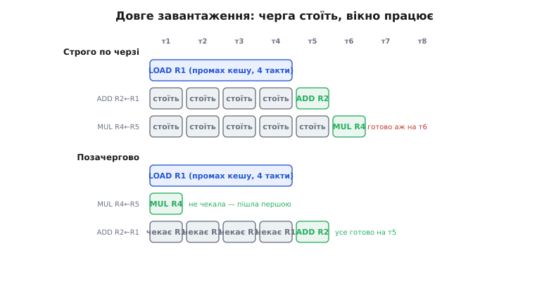
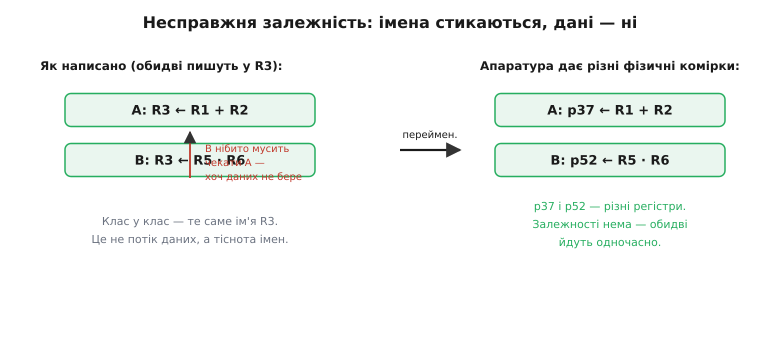

# Позачергове виконання: не стій, поки є що робити

Уяви, що ти готуєш вечерю за списком: постав тісто підходити, наріж овочі, звари бульйон. Список складено в один стовпчик, але це не значить, що ти маєш годину простояти біля миски з тістом, поки воно підходить, і лише тоді взятися за ніж. Розумний кухар запускає тісто — і, доки воно дійде, ріже овочі й ставить бульйон. Порядок у списку був підказкою послідовності, а не наказом нічого не робити, поки перший пункт не завершиться.

Процесор дістає ту саму спокусу — і піддається їй. Команди програми лежать у пам'яті одна за одною, і найпростіший процесор бере їх [строго по черзі](topic:programming/fetch-decode-execute): доки поточна не завершилася, наступна й не починається. Але команди рідко залежать усі одна від одної. Дуже часто наступна команда не має жодного стосунку до тієї, що застрягла. То навіщо їй чекати? **Позачергове виконання** (англ. *out-of-order execution*, часто OoO) — це коли процесор виконує команди не в тому порядку, в якому вони написані, а в тому, в якому **готові їхні дані**. Стоїть лише те, що справді мусить стояти; решта біжить уперед.

> 🔧 **Навіщо це.** Один-єдиний доступ до основної пам'яті коштує сотні тактів — за цей час процесор міг би виконати сотні інших команд. Строго послідовна машина всі ці такти простоює. Позачергове виконання перетворює простій на роботу: воно — головна причина, чому потужний застосунковий процесор (у телефоні, ноутбуці, дроні) робить у рази більше за такт, ніж простий мікроконтролер на тій самій частоті.

## Звідки біль: один затор гальмує все

[Конвеєр](topic:programming/pipeline) уже навчив процесор перекривати команди в часі: поки одна виконується, наступну декодують, ще одну вибирають. У ідеалі з лінії сходить одна завершена команда щотакту. Але конвеєр — строго впорядкований потік: команди входять по черзі й у тій самій черзі мали б виходити. І цього досить, щоб один-єдиний затор зупинив усіх позаду.

> 🔧 **Навіщо це.** Затор — не рідкісна аварія, а щоденна норма. Промах кешу, ділення, звернення до повільного давача — усе це довгі команди. У строгій черзі кожна така команда — «пробка», за якою вишиковується вервечка тих, кому чекати нема потреби.

Розберімо на трьох командах. Нехай перша читає число з пам'яті, а сталося найгірше — [промах кешу](topic:programming/cache), тож дані приїдуть не за такт, а, скажімо, за чотири. Друга команда використовує саме це число, тож вона справді змушена чекати. А от третя — множення двох зовсім інших чисел, які вже лежать у регістрах, — з першими двома не пов'язана ніяк.

```
LOAD  R1 ← [адреса]     // читаємо з пам'яті: промах кешу, ~4 такти
ADD   R2 ← R1 + 7       // ПОТРЕБУЄ R1 — мусить чекати
MUL   R4 ← R5 · R6      // незалежна: R5, R6 вже готові
```

У строго впорядкованій машині `MUL` стоятиме, аж поки перед нею пройдуть `LOAD` і `ADD` — хоча їй нема чого чекати. Чотири такти дороге залізо простоює. А варто було б: доки `LOAD` тягне дані з пам'яті, узяти `MUL` і виконати її просто зараз — вона ж готова. Ось і вся ідея позачергового виконання, побачена вперше: **не порядок команд визначає, коли їх виконувати, а готовність їхніх даних**.


*Угорі — строго по черзі: `LOAD` промахнувся й тягне дані чотири такти; `ADD` законно чекає на них, але й незалежна `MUL` мусить стояти за порядком і виконується аж на такті шостому. Унизу — позачергово: `MUL` не має причин чекати, тож іде першою, поки `LOAD` у польоті; `ADD` дочікується свого `R1` і виконується щойно дані приїхали. Той самий код, та сама швидкість кожної окремої команди — але корисної роботи виходить більше, бо порожні такти зайняті.*

## Що насправді зв'язує команди — потік даних

Щоб дозволити перестановку, процесор мусить точно знати, які команди справді залежать одна від одної, а які лише **здаються** залежними. Тут криється тонкість, від якої залежить уся конструкція.

Справжня залежність одна: команда читає те, що попередня записала. Її звуть **залежністю за даними** (англ. *read-after-write*, «читання після запису»). У прикладі вище `ADD R2 ← R1 + 7` читає `R1`, який щойно записав `LOAD`, — і оминути це неможливо: доки числа немає, додавати нема чого. Такий зв'язок непорушний, він і є справжнім потоком даних крізь програму.

Але є два зв'язки, які виглядають як залежність, а насправді нею не є, — вони виникають не через дані, а через **брак імен**. Регістрів у наборі команд небагато (скажімо, шістнадцять), і компілятор мимоволі використовує те саме ім'я знову й знову. Розглянь:

```
A:  R3 ← R1 + R2      // записує R3
B:  R3 ← R5 · R6      // теж записує R3 — але зовсім іншими даними
```

Обидві команди пишуть у `R3`, тож апаратура ніби мусить лишити їх у порядку: спершу `A`, потім `B` — інакше в `R3` залишиться не той результат. Це **залежність за іменем** (англ. *write-after-write*, «запис після запису»). Але придивись: `B` не читає нічого з `A`. Дані течуть двома незалежними струмками, і зіткнулися вони лише тому, що обом дали однакову табличку «`R3`». Такий самий несправжній зв'язок виникає, коли пізніша команда пише в регістр, який раніша ще має прочитати (англ. *write-after-read*, «запис після читання»): переставиш — і рання команда прочитає вже затерте значення.

Ключове спостереження, на якому тримається вся швидкість: **несправжні залежності — це не про дані, а про тісноту імен, і їх можна прибрати, роздавши більше імен**. Процесор має набагато більше фізичних комірок для чисел, ніж видно в наборі команд. Тож він тихо перейменовує регістри: кожен запис отримує **свіжу фізичну комірку**, а наступні читання цього імені перенаправляють на неї. Тоді `A` пише в одну комірку, `B` — в іншу, зіткнення імен зникає, і обидві команди вільно йдуть одночасно. Цей прийом — **перейменування регістрів** (англ. *register renaming*) — і є те, що перетворює позачергове виконання зі скромного трюку на потужний двигун.


*Ліворуч — як написано: обидві команди пишуть у `R3`, тож виглядає, ніби `B` мусить чекати на `A`. Але це не потік даних — це тіснота: на дві незалежні дії одне ім'я. Праворуч — після перейменування: апаратура дала кожному запису власну фізичну комірку (`p37` і `p52`), несправжня залежність випарувалася, і команди виконуються паралельно. Справжню залежність за даними (читання щойно записаного) перейменування не чіпає — її обійти не можна.*

Хто хоче побачити цю бухгалтерію імен зсередини — станції очікування, спільну шину для розсилання готових результатів і те, як усе це вперше злагодилося в залізі 1967 року, — тому в пригоді стане [окремий розбір механізму Томасуло](topic:programming/out-of-order-execution/detail): як апаратура тримає таблицю відповідності «архітектурне ім'я → фізична комірка», як команда чекає на свої дані просто в черзі й стартує тієї ж миті, щойно вони приїхали.

## Порядок усередині — воля; порядок назовні — закон

Тут виникає очевидне заперечення, і воно принципове. Якщо команди виконуються врозбій, як зберегти правильність? Адже програміст писав код у певному порядку й розраховує на нього. І ще гірше: що станеться, коли посеред цього хаосу трапиться [переривання](topic:programming/interrupt-vector) чи [виняток](topic:programming/cpu-exception-handling) — скажімо, ділення на нуль? Обробник має побачити стан машини **рівно таким**, ніби всі попередні команди вже виконалися, а жодна наступна ще ні. А в нас наступні вже виконалися.

Розв'язок елегантний і становить друге серце конструкції: **виконувати можна врозбій, а завершувати треба строго по черзі**. Процесор розділяє два різні моменти в житті команди. Перший — коли вона порахувала свій результат (це може статися рано, поза чергою, щойно готові дані). Другий — коли цей результат стає **офіційним**, видимим для всієї решти програми (англ. *retire* або *commit*, «списати в остаточний облік»). І от друге завжди відбувається строго в програмному порядку.

Тримає цей порядок спеціальна черга — **буфер упорядкування** (англ. *reorder buffer*, ROB). Коли команду вибрали, для неї резервують місце в кінці буфера — у програмному порядку. Виконуватися вона може будь-коли й будь-де, а от «оприлюднити» результат дозволено, лише коли вона дійшла до **голови** черги, тобто коли всі попередні за програмою вже оприлюднені. Готова команда, що прибігла раніше, чемно чекає своєї черги на виході, тримаючи результат при собі.

Це відразу дає дві безцінні речі. По-перше, **точні винятки**: якщо команда посеред буфера дасть помилку, процесор просто викине все, що стоїть за нею в черзі (воно ще не оприлюднене — отже, ніби й не виконувалося), і передасть обробникові чистий стан, ніби виконання спинилося рівно на винній команді. По-друге, той самий механізм дає змогу **сміливо виконувати наперед за здогадом**: після [передбачення переходу](topic:programming/branch-prediction) процесор мчить у ймовірну гілку й виконує звідти команди позачергово — але не оприлюднює їх, поки не з'ясується, чи вгадав. Угадав — вони спокійно списуються по черзі; схибив — усе спекулятивне викидається з буфера без сліду, як недороблена чернетка.


*Три ділянки. Вхід — строго по черзі: команди вибирають, декодують, перейменовують і ставлять у чергу в тому порядку, як написано. Вікно — позачергово: команда стартує, щойно готові її дані, байдуже, коли й у якому порядку. Вихід — знову строго по черзі: буфер упорядкування оприлюднює результати рівно за програмою. Ззовні порядок наче й не порушено; воля панує лише всередині вікна. У цьому й увесь фокус: назовні — послідовна машина, всередині — паралельна.*

Аналогія з кухнею тут точна майже до кінця, і корисно побачити, де вона ламається. Кухар справді запускає страви не по черзі, а за готовністю продуктів, — це наше вікно. Але на стіл він виносить їх у потрібному порядку подачі — це наш буфер упорядкування. Ламається аналогія на масштабі й на відкоті: процесор тримає у вікні десятки, а то й сотні команд «у польоті» водночас і вміє миттєво викинути всю спекулятивну роботу, якщо здогад про перехід не справдився, — кухар так стерти вже початі страви не може.

## Скільки це коштує — і за що

Пропускну здатність позачергове виконання піднімає добряче: воно живиться **паралелізмом на рівні команд** (англ. *instruction-level parallelism*, ILP) — тим, скільки незалежних команд удається знайти й запустити водночас. Прикинемо для нашого прикладу.

**Оцінка виграшу на промаху кешу.** Нехай завантаження з промахом коштує 4 такти, а поряд є 3 незалежні команди по 1 такту, яким нема чого чекати.

```
строго по черзі:   4 (LOAD) + 3 (по черзі за ним) = 7 тактів
позачергово:       3 незалежні йдуть під час LOAD → сховані в його 4 такти
                   разом ≈ 4 такти
виграш:            7 / 4 ≈ 1.75×
```

Робота нікуди не поділася — вона **сховалася** за очікуванням, яке однаково мусило статися. Що довші затримки й що більше незалежних команд поряд, то більший виграш; саме тому глибина вікна (скільки команд процесор бачить наперед) прямо визначає, скільки простою вдасться приховати.

Задарма це не дається. Перейменування вимагає таблиці відповідності та великого файлу фізичних регістрів; буфер упорядкування, черги очікування й логіка стеження за готовністю даних — усе це чималий кремній, що гріється й п'є струм щотакту. Тому позачергове виконання ставлять там, де потрібна сира швидкодія одного потоку, і **не** ставлять у крихітні [мікроконтролери](topic:programming/mcu-blocks): там цінують передбачуваність і копійчану енергію, тож ядро лишають строго послідовним. Дрон це відчуває буквально: застосунковий процесор автопілота позачерговий і швидкий, а поряд сидить простий детермінований мікроконтролер, якому важлива не пікова швидкість, а те, щоб кожна дія тривала **рівно стільки, скільки завжди**.

І є розплата, про яку до 2018 року майже не думали. Позачергове й спекулятивне виконання **лишає сліди** навіть від тієї роботи, яку потім викинули: викинута команда могла встигнути підтягнути дані в кеш, і хоч результат стерто, зміна в кеші лишилася. Ця, здавалося б, невинна тінь виявилася діркою в безпеці — на ній збудовано напади [Spectre і Meltdown](topic:programming/out-of-order-execution/hist-spectre-meltdown.md), що вразили майже всі процесори, випущені за попередні двадцять років. Мовчазний виконавець, який робить наперед більше, ніж визнає, зрештою прохопився зайвим.

Отже, вся ідея вкладається в один образ: команди програми — це не жорсткий графік «роби рівно в цьому порядку», а перелік робіт із залежностями. Процесор читає з нього справжній потік даних, тихо роздає більше імен, щоб прибрати уявні зіткнення, виконує все, що готове, тієї ж миті — і лише на виході знову шикує результати строго за програмою, щоб назовні лишитися чесною послідовною машиною. Воля всередині, порядок назовні — і простій перетворюється на роботу.
