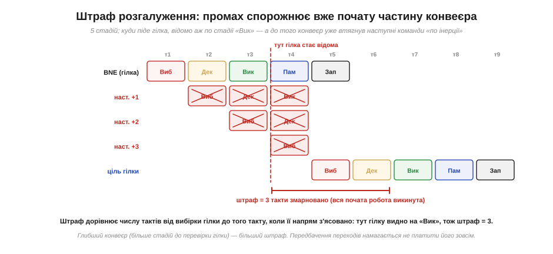
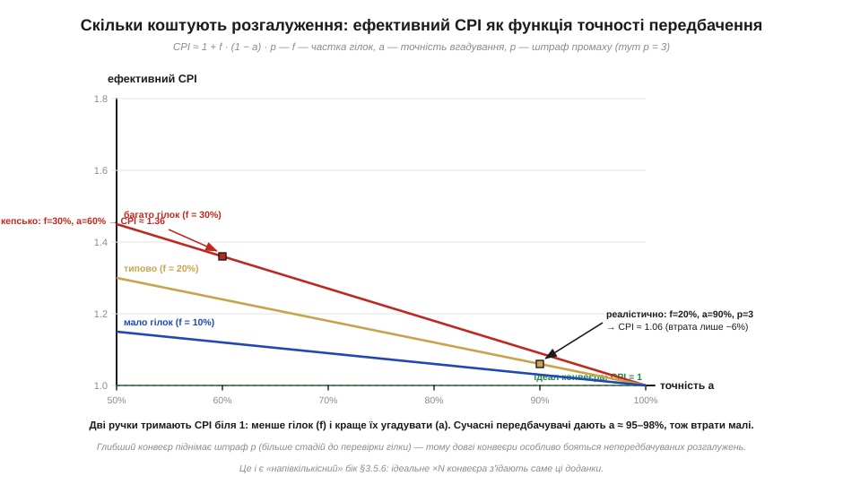

# 🧮 Чому розгалуження ламає потік: штраф і передбачення в числах

> Числова вставка до теми [«Конвеєр»](book:programming/pipeline). Конвеєр у ідеалі доводить **CPI до 1**, та **затори** крадуть частину виграшу, і найкапосніший із них — **розгалуження**. Тут ми переведемо це «крадуть частину» в число: порахуємо, **скільки** тактів коштує один промах, складемо з цього формулу ефективного CPI — і побачимо, чому [передбачення переходів](book:programming/pipeline) рятує конвеєр, а непередбачувані `if` його душать. Усе напівкількісно: круглі числа, щоб відчути масштаб, а не точна модель конкретного ядра.

### Означення: штраф розгалуження

Механіка проста. Конвеєр, щоб не простоювати, **завчасно вибирає** команди, що лежать у пам'яті **слідом** за гілкою, — ще не знаючи, чи стрибок справді відбудеться й куди. Та напрям гілки з'ясовується не одразу: команда `BNE`/`JMP` мусить пройти кілька стадій, перш ніж процесор довідається, виконувати стрибок чи ні. Усі команди, втягнуті в конвеєр за цей час «по інерції», виявляються не тими — і їх доводиться **викинути** (flush). Кількість тактів, змарнованих на цей викид, і є **штраф розгалуження** (*branch penalty*), позначимо його **p**. По суті, p — це число стадій від вибірки гілки до тієї стадії, де її напрям нарешті відомий.


*П'ятистадійний конвеєр (вибірка → декодування → виконання → пам'ять → запис). Гілка `BNE` розкриває свій напрям аж на стадії «Вик» (такт 3), а до того конвеєр устиг почати три наступні команди. Усі три — не ті (стрибок веде в інше місце), тож їхню роботу викидають, і правильна **ціль гілки** стартує лише з такту 6. Три порожні такти між ними — і є штраф p = 3.*

### Інтуїція: чому це боляче саме для конвеєра

Без конвеєра гілка нічого не коштувала б: процесор однаково доробив би одну команду до кінця, перш ніж брати наступну, тож «викидати» не було б чого. Саме перекриття фаз — джерело і виграшу, і цієї біди: конвеєр **робить ставку** на те, що наступна команда лежить одразу за поточною, і виграє щоразу, коли потік прямий. Розгалуження — це момент, коли ставка може не зіграти. Що **глибший** конвеєр (більше стадій до перевірки гілки), то більше команд устигає набитися «по інерції» — і то дорожчий промах. Ось чому коротенькі конвеєри мікроконтролерів (кілька стадій) втрачають на гілці мало, а довгі конвеєри настільних процесорів (десяток-два стадій) бояться непередбачуваних розгалужень найдужче: один промах вимітає десяток тактів.

### Апарат: ефективний CPI

Тепер складемо ціну гілок у формулу. Нехай **f** — частка команд, що є розгалуженнями (для типового коду це ≈ 0.15–0.25: приблизно кожна п'ята команда — гілка). Якби **кожна** гілка коштувала повний штраф p, середній CPI піднявся б так:

```
CPI  ≈  1  +  f · p          (без передбачення — платимо за кожну гілку)
```

Та платити за кожну — марнотратно, і тут на сцену виходить [передбачення переходів](book:programming/pipeline): процесор **угадує** напрям гілки наперед і вибирає команди звідти. Угадав — потік не рветься, штрафу **нуль**; схибив — платимо повні p тактів на викид. Нехай **a** — **точність** передбачення (частка вгаданих гілок). Тоді штраф платиться лише за **промахи**, яких частка (1 − a):

```
CPI  ≈  1  +  f · (1 − a) · p
```

Це і є шукана напівкількісна модель. Перший доданок — ідеал конвеєра (одна команда за такт); другий — надбавка від розгалужень, і вона тим менша, чим **рідші** гілки (мале f), чим **точніше** їх угадують (велике a) і чим **коротший** штраф (мале p).


*CPI = 1 + f·(1−a)·p при p = 3. Три криві — для різної частки гілок f. Видно обидві ручки: опускаючись по осі точності a праворуч (краще вгадування), CPI падає до ідеальної 1; піднімаючи f (більше гілок), піднімаємо всю криву. Реалістична точка (f = 20%, a = 90%) дає CPI ≈ 1.06 — втрата лише ~6%; а кепське вгадування (a = 60%) при рясних гілках (f = 30%) роздуває CPI до ≈ 1.36.*

**Приклад (скільки коштує погане вгадування).** Візьмемо f = 0.20, p = 3 і порівняймо два режими — наївний «завжди вибирати наступну» (фактично a ≈ 0.5 для непередбачуваної гілки) проти доброго передбачувача (a = 0.95):

```
без передбачення:  CPI ≈ 1 + 0.20 · 1.00 · 3  = 1.60
a = 0.50 (навмання): CPI ≈ 1 + 0.20 · 0.50 · 3  = 1.30
a = 0.95 (добрий):   CPI ≈ 1 + 0.20 · 0.05 · 3  ≈ 1.03
```

Різниця разюча. «Наївний» конвеєр віддає 60% свого ідеалу на гілки; навмання — 30%; а добрий передбачувач втрачає лише ~3%. Ось чому передбачення переходів — не дрібна оптимізація, а те, що взагалі **робить** глибокий конвеєр вартим заходу: без нього штраф з'їв би більшу частину виграшу.

### Що ці два рядки кажуть про реальні процесори

Ці два рядки кількісно завершують картину [конвеєра](book:programming/pipeline). Перший рядок (`CPI ≈ 1 + f·p`) пояснює, **чому** ідеального прискорення в N разів від N стадій не буває: кожна гілка тягне CPI вгору від одиниці. Другий (`1 + f·(1−a)·p`) показує, **як** із цим борються: множник (1 − a) і є числовий бік [передбачення переходів](book:programming/pipeline) — сучасні передбачувачі дають a ≈ 0.95–0.98, тож надбавка лишається малою. Звідси й практична порада: у гарячих циклах варто уникати **непередбачуваних** `if` (де a падає до ~0.5), бо саме на них формула й карає. А ще обидва доданки прямо живлять оцінку швидкодії «час = такти × період» з [тактової частоти](book:programming/clock-frequency): ця формула працює лише з **реальним** CPI, а реальний CPI — це одиниця плюс оці втрати на затори. Нарешті, мале p — ще один доказ на користь коротких, рівних конвеєрів простих ядер (і простих, однакових команд [RISC](book:programming/risc-cisc)): дрібний штраф прощає навіть нечасті промахи.
