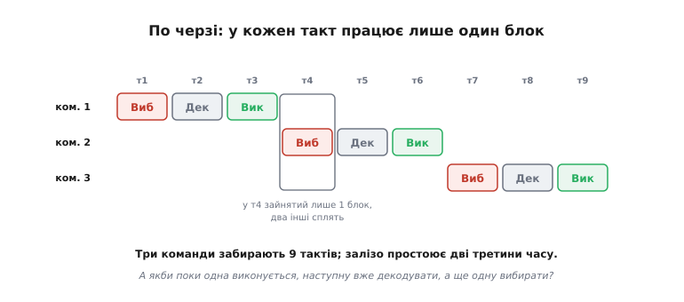
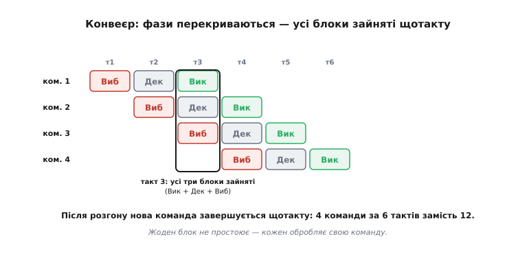
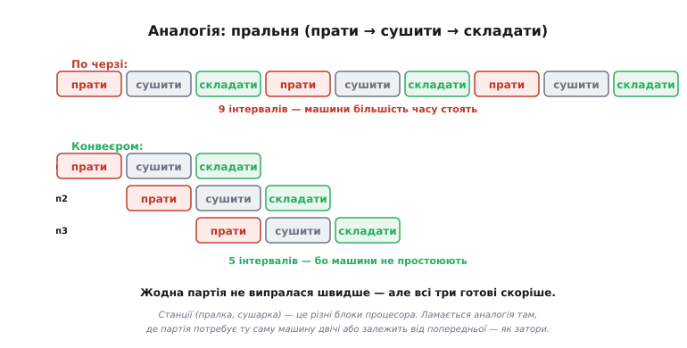
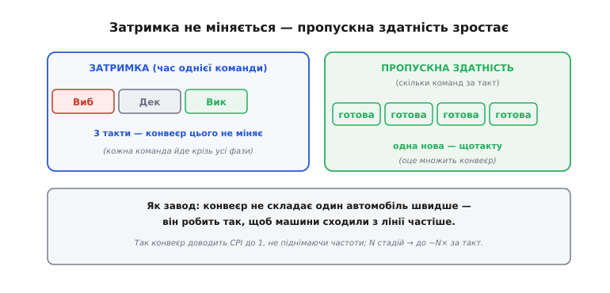
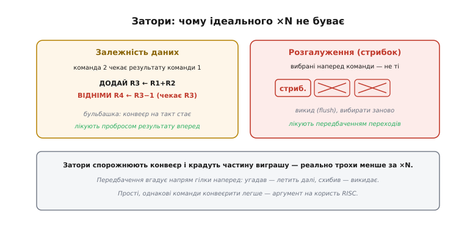
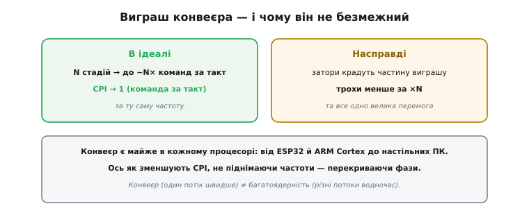

# Конвеєр: робити кілька кроків водночас

Є спосіб зменшити CPI — змусити процесор завершувати більше команд за такт, не піднімаючи [частоти](book:programming/clock-frequency). Цей спосіб — **конвеєр** (англ. *pipeline*, «трубопровід»: команди течуть крізь нього вервечкою, як рідина крізь трубу зі станціями). Він помічає просту марнотратність у [циклі вибірка-декодування-виконання](book:programming/fetch-decode-execute) і лікує її трюком зі складальних ліній: поки одна річ проходить одну станцію, наступна вже проходить попередню. Перенесений на процесор, цей трюк дає в рази більшу **пропускну здатність** майже задарма. Та, як усе в інженерії, він має й ціну — «затори», що крадуть частину виграшу. Розберімо і красу ідеї, і її підводні камені.

### Проблема: блоки процесора простоюють

Процесор виконує команду за три фази — [вибірка, декодування, виконання](book:programming/fetch-decode-execute), — і кожну робить **окремий** блок (вибіркою відає одне, АЛП — інше). У наївній схемі команди йдуть строго по черзі: доки одна не пройде всі три фази, наступна й не починається. І ось де марнотратство.


*Коли команди виконуються строго по черзі, у кожен такт працює лише один із трьох блоків, а два інші сплять: поки команда виконується (АЛП зайнята), блоки вибірки й декодування байдикують. Три команди забирають дев'ять тактів, а дороге залізо простоює дві третини часу. Напрошується думка: а що, як поки одна команда виконується, наступну вже декодувати, а ще одну — вибирати? Адже це різні блоки, вони вільні.*

Це чисте марнотратство. У процесорі є [три окремі блоки](book:programming/processor-parts), а працює лише один за раз. Уявіть кухню з трьома кухарями — різальником, смажильником і прикрашальником, — де різальник стоїть і дивиться, поки смажильник працює, а тоді обидва дивляться на прикрашальника. Безглуздо. Очевидне рішення — хай усі троє працюють водночас, кожен над своєю стравою.

### Ідея: перекрити фази

Саме це й робить конвеєр. Замість чекати, поки команда пройде всі три фази, процесор запускає наступну, щойно звільнився перший блок.


*Команди перекриваються в часі. На такті 3 одразу три блоки зайняті: команда 1 виконується, команду 2 в цей же час декодують, а команду 3 вже вибирають. Кожен блок щотакту обробляє свою команду — ніхто не простоює. Після «розгону» конвеєра нова команда завершується кожного такту, тож чотири команди займають лише шість тактів замість дванадцяти.*

Придивіться до діагонального візерунка — це класична картина конвеєра. Кожна команда так само проходить три фази по черзі (нічого не перескочила), але команди зсунуті в часі на один такт, тож у кожен момент усі блоки зайняті різними командами. Зручна картинка для цього — пральня.

### Точна аналогія: пральня

Найвживаніша аналогія конвеєра — **пральня** з трьох машин: пралка, сушарка, місце для складання.


*Треба випрати, висушити й скласти три партії білизни. По черзі (без конвеєра): повністю обробити першу партію (прати → сушити → складати), тоді другу, тоді третю — дев'ять інтервалів. Конвеєром: щойно перша партія пішла в сушарку, другу вже кидаємо в пралку; поки сушиться друга — пралка бере третю. Усі три готові за п'ять інтервалів замість дев'яти, бо машини не простоюють.*

Ця аналогія точна в головному: різні «станції» (пралка, сушарка) — це різні блоки процесора (вибірка, виконання), і весь виграш у тому, що вони працюють одночасно над різними партіями. Жодна окрема партія не випралася швидше — пралка крутить свої умовні 30 хвилин незалежно від конвеєра, — але всі разом готові значно скоріше. Аналогія й застерігає, де ламається: якщо якійсь партії знадобиться та сама машина двічі, або складання другої залежить від першої, виникне **затор** — як і в процесорі.

### Головна думка: затримка проти пропускної здатності

Найважливіша концепція цього підрозділу, без якої конвеєр легко зрозуміти хибно: конвеєр **не робить одну команду швидше**. Він робить так, щоб команди **виходили частіше**.


*Затримка (англ. *latency*, від лат. *latere* — «бути прихованим», тобто час, поки результат «ще не виринув») — час однієї команди від початку до кінця — лишається тією самою (три такти): конвеєр її не скорочує, кожна команда йде крізь усі фази так само довго. А от пропускна здатність (англ. *throughput*) — скільки команд завершується за такт — зростає: одна нова команда сходить «з лінії» щотакту. Як на заводі: конвеєр не складає один автомобіль швидше — він робить так, щоб машини сходили з лінії частіше.*

Ось ключ до правильного розуміння. Є дві різні величини: **затримка** (скільки чекати на одну команду) і **пропускна здатність** (скільки команд за секунду в потоці). Конвеєр множить другу, не чіпаючи першу. Саме так він і зменшує CPI замість того, щоб піднімати [частоту](book:programming/clock-frequency): у ідеалі він доводить **CPI до 1** — одна завершена команда за такт, — хоча кожна окрема команда так само триває кілька тактів. N-стадійний конвеєр у ідеалі дає до ~**N разів** більшу пропускну здатність за тієї самої частоти. Це і є пропускна здатність: не швидкість однієї команди, а **темп** їхнього виходу.

### Чому конвеєр не безкоштовний: затори

Якби все було так гладко, конвеєр давав би рівно ×N. Та в реальності команди не завжди течуть конвеєром безперешкодно — трапляються **затори** (англ. *hazard*, «небезпека, ризик»: момент, коли наступна команда ризикує піти не так).


*Два головні затори. Залежність даних: команда 2 потребує результату команди 1 (наприклад, `ВІДНІМИ R4←R3−1` одразу після `ДОДАЙ R3←R1+R2`), а той ще не готовий — доводиться зробити «бульбашку» (стати на такт). Розгалуження: конвеєр уже завчасно вибрав наступні команди, але стрибок веде в інше місце — і вже почату роботу над зайвими командами викидають (англ. *flush*, «промивання»). Затори спорожнюють конвеєр і крадуть частину виграшу.*

Тут криється важлива правда: ідеального ×N не буває. **Залежність даних** виникає, коли команда чекає на результат попередньої; з нею борються «пробросом» (англ. *forwarding*) — результат подають прямо в потрібний блок, не чекаючи запису в регістр. А **розгалуження** — підступніша біда: конвеєр, щоб не простоювати, завчасно вибирає команди, що йдуть далі за порядком, — але якщо трапився стрибок, ці команди виявляються не тими, і всю почату над ними роботу доводиться викинути. З цим борються **передбаченням переходів** (англ. *branch prediction*): процесор угадує, куди піде гілка, і вибирає звідти; угадав — летить далі без втрат, схибив — викидає й починає заново. Саме тому глибокі конвеєри так бояться непередбачуваних розгалужень: один промах — і десяток тактів змарновано. До речі, простіші, однакові за форматом команди конвеєрити легше — це сильний аргумент на користь [архітектури RISC](root:embedded/risc-cisc).

### Скільки це коштує: порахуймо

Слова «крадуть частину виграшу» легко перевести в числа. Візьмемо чотиристадійний конвеєр і програму на 1000 команд. У ідеалі (CPI = 1) це 1000 тактів плюс короткий розгін — назвемо круглим 1003. Тепер додамо реальні затори: нехай кожна п'ята команда — розгалуження (200 гілок), штраф промаху p = 3 такти, а передбачувач угадує 9 гілок із 10. Тоді промахів — 20, кожен коштує 3 такти:

```
ідеал (CPI=1):        ≈ 1000 тактів
гілок (1/5):            200
промахів (10%):          20
штраф за промах:          3 такти
зайві такти:        20 · 3 = 60
разом:             ≈ 1060 тактів  →  CPI ≈ 1.06
```

Шість відсотків надбавки — і це з пристойним передбаченням. Поставте кепське вгадування (вгадано лише половину гілок) — і промахів стане 100, зайвих тактів 300, а CPI підскочить до ~1.3. Звідси й практичний висновок для прошивки: рівний, передбачуваний потік виконується відчутно швидше за рваний.

Це видно й у коді. Ось два способи скласти масив байтів, з яких треба врахувати лише ті, що більші за поріг:

:::tabs
```cpp
// А) гілка всередині гарячого циклу — передбачувач часто хибить
uint32_t sum = 0;
for (int i = 0; i < n; i++)
    if (buf[i] > thr)        // непередбачуваний if на кожній ітерації
        sum += buf[i];

// Б) без розгалуження — те саме без стрибка в циклі
uint32_t sum = 0;
for (int i = 0; i < n; i++) {
    int32_t v = buf[i];
    int32_t m = -(v > thr);  // маска: 0xFFFFFFFF якщо так, інакше 0
    sum += v & m;            // додаємо v або 0 — гілки немає
}
```
```python
# А) гілка всередині гарячого циклу — передбачувач часто хибить
sum = 0
for i in range(n):
    if buf[i] > thr:         # непередбачуваний if на кожній ітерації
        sum += buf[i]

# Б) без розгалуження — те саме без стрибка в циклі
sum = 0
for i in range(n):
    v = buf[i]
    m = -(v > thr)           # маска: -1 (усі біти) якщо так, інакше 0
    sum += v & m             # додаємо v або 0 — гілки немає
```
:::

Обидва дають однакову суму, але варіант Б прибрав стрибок із циклу: процесору більше нема чого вгадувати, тож на випадкових даних він не платить штрафу за промахи. На рівному потоці така дрібниця в гарячому циклі давача чи керування дає помітний виграш.

> 🔧 **Навіщо це.** Розуміння конвеєра прямо стосується трьох речей у вашій роботі. Перше: він пояснює, чому сучасний процесор робить майже команду за такт (CPI ≈ 1), хоча кожна команда «фізично» триває кілька тактів — без цього оцінки швидкодії за [тактовою частотою](book:programming/clock-frequency) не сходяться. Друге, дуже практичне: **розгалуження дорогі** на конвеєрних процесорах, бо промах передбачення спорожнює конвеєр; тому в гарячих циклах коду (для давачів і керування) варто уникати непередбачуваних `if` усередині, де можна. Третє: розуміння «затримка проти пропускної здатності» — універсальне; воно знадобиться не лише з процесором, а й із пам'яттю, шинами, зв'язком — скрізь, де є потік.

### Виграш і реальність

Зведімо баланс.


*В ідеалі: N стадій → до ~N× більша пропускна здатність, CPI прямує до 1 — і все це за тієї самої частоти. Насправді: затори (залежності, стрибки) крадуть частину виграшу, тож виходить трохи менше за ×N — але все одно велика перемога. Конвеєр є майже в кожному сучасному процесорі: від ESP32 й ARM Cortex (кілька стадій) до настільних ПК (стадій багато).*

Конвеєр — це елегантна перемога над марнотратством [наївного циклу](book:programming/fetch-decode-execute): замість простоювати, кожен блок щотакту працює над своєю командою. Він дав процесорам велику частину їхньої швидкодії, не вимагаючи ні вищої [частоти](book:programming/clock-frequency) (зі стіною потужності), ні нового заліза — лише розумнішої організації наявного. Варто тільки чітко відрізняти його від **багатоядерності**: конвеєр пришвидшує один потік команд (перекриваючи його фази), а кілька ядер виконують різні потоки водночас — це різні види паралелізму, і сучасні чипи поєднують обидва. Два ядра [ESP32](book:programming/esp32-architecture) — це паралелізм іншого роду, ніж конвеєр усередині одного ядра. Разом вища тактова [частота](book:programming/clock-frequency), конвеєр і кілька ядер і дають ту швидкодію, до якої ми звикли, — кожне б'є по своєму обмеженню.

Числовий бік однієї з цих цін — розгалужень — розписано окремо: [скільки тактів коштує промах передбачення й звідки береться формула ефективного CPI](book:programming/pipeline/math-pipeline-hazards.md).
