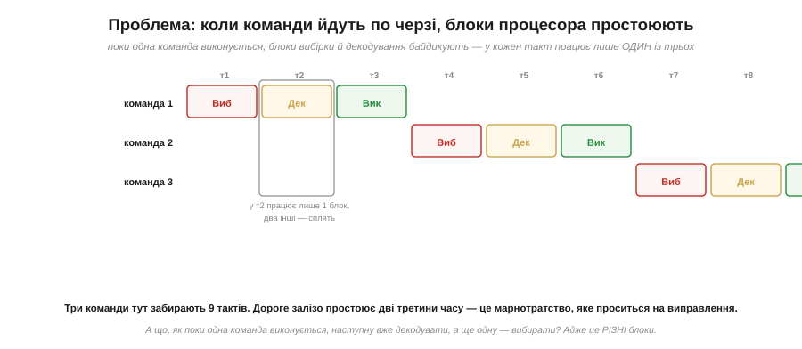
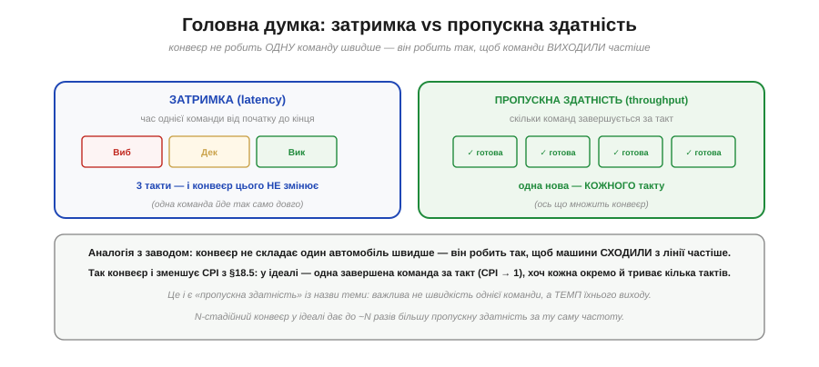

# Конвеєр: робити кілька кроків водночас

Є спосіб зменшити CPI — змусити процесор завершувати більше команд за такт, не піднімаючи [частоти](book:programming/clock-frequency). Цей спосіб — **конвеєр** (*pipeline*), і це одна з найгарніших ідей у будові процесорів. Він помічає просту марнотратність у [циклі вибірка-декодування-виконання](book:programming/fetch-decode-execute) і лікує її трюком, який людство знає з часів складальних ліній Форда: поки одна річ проходить одну станцію, наступна вже може проходити попередню. Перенесений на процесор, цей трюк дає в рази більшу **пропускну здатність** майже задарма. Та, як усе в інженерії, він має й ціну — «затори», що крадуть частину виграшу. Розберімо і красу ідеї, і її підводні камені.

### Проблема: блоки процесора простоюють

Процесор виконує команду за три фази — [вибірка, декодування, виконання](book:programming/fetch-decode-execute), — і кожну робить **окремий** блок (вибіркою відає одне, АЛП — інше). У наївній схемі команди йдуть строго по черзі: доки одна не пройде всі три фази, наступна й не починається. І ось де марнотратство.

*Рис. Коли команди виконуються строго по черзі, у кожен такт працює лише **один** із трьох блоків, а два інші **сплять**: поки команда виконується (АЛП зайнята), блоки вибірки й декодування байдикують. Три команди забирають 9 тактів, а дороге залізо простоює дві третини часу. Напрошується думка: а що, як поки одна команда **виконується**, наступну вже **декодувати**, а ще одну — **вибирати**? Адже це різні блоки, вони вільні!*

Це чисте марнотратство. У процесорі є [три окремі блоки](book:programming/processor-parts), а працює лише один за раз. Уявіть кухню з трьома кухарями — різальником, смажильником і прикрашальником, — де різальник стоїть і дивиться, поки смажильник працює, а тоді обидва дивляться на прикрашальника. Безглуздо. Очевидне рішення — хай **усі троє** працюють водночас, кожен над своєю стравою.

### Ідея: перекрити фази

Саме це й робить конвеєр. Замість чекати, поки команда пройде всі три фази, процесор **запускає наступну, щойно звільнився перший блок**.

*Рис. Команди **перекриваються** в часі. На такті 3 одразу три блоки зайняті: команда 1 **виконується**, команду 2 в цей же час **декодують**, а команду 3 вже **вибирають**. Кожен блок щотакту обробляє свою команду — ніхто не простоює. Після «розгону» конвеєра нова команда **завершується кожного такту**, тож чотири команди займають лише 6 тактів замість 12. Це і є конвеєр (*pipeline*).*

Придивіться до діагонального візерунка — це класична картина конвеєра. Кожна команда так само проходить три фази по черзі (нічого не перескочила), але команди **зсунуті** в часі на один такт, тож у кожен момент усі блоки зайняті різними командами. Це нагадує естафету, де щойно перший бігун передав паличку, він не йде відпочивати, а починає… ні, краща аналогія — пральня, до якої ми зараз і звернемося.

### Точна аналогія: пральня

Найкраща й найвживаніша аналогія конвеєра — **пральня** з трьох машин: пралка, сушарка, місце для складання.

*Рис. Треба випрати, висушити й скласти три партії білизни. **По черзі** (без конвеєра): повністю обробити першу партію (прати → сушити → складати), тоді другу, тоді третю — 9 інтервалів. **Конвеєром**: щойно перша партія пішла в сушарку, другу вже кидаємо в пралку; поки сушиться друга — пралка бере третю. Усі три готові за 5 інтервалів замість 9 — бо машини не простоюють.*

Ця аналогія точна в головному: різні «станції» (пралка, сушарка) — це різні блоки процесора (вибірка, виконання), і весь виграш у тому, що вони працюють **одночасно** над різними партіями. Жодна окрема партія не випралася швидше — пралка крутить свої умовні 30 хвилин незалежно від конвеєра, — але **всі разом** готові значно скоріше. І зверніть увагу, де аналогія застерігає: якщо якійсь партії знадобиться та сама машина двічі, або складання другої залежить від першої, виникне **затор** — як і в процесорі (про що далі). Ця паралель між пральнею й конвеєром команд настільки точна, що нею пояснюють процесори в кожному підручнику.

### Головна думка: затримка vs пропускна здатність

Тепер — найважливіша концепція цього підрозділу, без якої конвеєр легко зрозуміти хибно. Конвеєр **не робить одну команду швидше**. Він робить так, щоб команди **виходили частіше**.

*Рис. **Затримка** (*latency*) — час однієї команди від початку до кінця — лишається **тією самою** (три такти): конвеєр її не скорочує, кожна команда йде крізь усі фази так само довго. А от **пропускна здатність** (*throughput*) — скільки команд **завершується за такт** — зростає: одна нова команда сходить «з лінії» щотакту. Як на заводі: конвеєр не складає один автомобіль швидше — він робить так, щоб машини сходили з лінії частіше.*

Ось ключ до правильного розуміння. Є дві різні величини: **затримка** (скільки чекати на одну команду) і **пропускна здатність** (скільки команд за секунду в потоці). Конвеєр множить **другу**, не чіпаючи першу. Саме так конвеєр і зменшує CPI замість того, щоб піднімати [частоту](book:programming/clock-frequency): у ідеалі він доводить **CPI до 1** — одна завершена команда за такт, — хоча кожна окрема команда так само триває кілька тактів. N-стадійний конвеєр у ідеалі дає до ~**N разів** більшу пропускну здатність за тієї **самої** частоти. Оце і є **пропускна здатність**: не швидкість однієї команди, а **темп** їхнього виходу.

### Чому конвеєр не безкоштовний: затори

Якби все було так гладко, конвеєр давав би рівно ×N. Та в реальності команди не завжди течуть конвеєром безперешкодно — трапляються **затори** (*hazards*).

*Рис. Два головні затори. **Залежність даних**: команда 2 потребує результату команди 1 (наприклад, `ВІДНІМИ R4←R3−1` одразу після `ДОДАЙ R3←R1+R2`), а той ще не готовий — доводиться зробити «бульбашку» (стати на такт). **Розгалуження**: конвеєр уже завчасно вибрав **наступні** команди, але стрибок веде в інше місце — і вже почата робота над зайвими командами **викидається** (flush). Затори спорожнюють конвеєр і крадуть частину виграшу.*

Тут криється важлива правда: ідеального ×N не буває. **Залежність даних** виникає, коли команда чекає на результат попередньої (з нею борються «пробросом» — forwarding — результату прямо в потрібний блок, не чекаючи запису в регістр). А **розгалуження** — підступніша біда: конвеєр, щоб не простоювати, завчасно вибирає команди, що йдуть **далі за порядком**, — але якщо трапився стрибок, ці команди виявляються не тими, і всю почату над ними роботу доводиться викинути. З цим борються **передбаченням переходів** (*branch prediction*): процесор **угадує**, куди піде гілка, і вибирає звідти; угадав — летить далі без втрат, схибив — викидає й починає заново. Саме тому глибокі конвеєри так бояться непередбачуваних розгалужень: один промах — і десяток тактів змарновано. (І, до речі, простіші, однакові за форматом команди конвеєрити **легше** — це сильний аргумент на користь [архітектури RISC](book:programming/risc-cisc).)

### Виграш і реальність

Зведімо баланс.

*Рис. **В ідеалі**: N стадій → до ~N× більша пропускна здатність, CPI прямує до 1 — і все це за **тієї самої** частоти. **Насправді**: затори (залежності, стрибки) крадуть частину виграшу, тож виходить трохи менше за ×N — але все одно велика перемога. Конвеєр є майже в кожному сучасному процесорі: від ESP32 й ARM Cortex (кілька стадій) до настільних ПК (стадій багато). Ось **як** зменшують CPI, не піднімаючи частоти.*

Конвеєр — це елегантна перемога над марнотратством [наївного циклу](book:programming/fetch-decode-execute): замість простоювати, кожен блок щотакту працює над своєю командою. Він дав процесорам велику частину їхньої швидкодії, не вимагаючи ні вищої [частоти](book:programming/clock-frequency) (зі стіною потужності), ні нового заліза — лише розумнішої організації наявного. Варто тільки чітко відрізняти його від **багатоядерності**: конвеєр пришвидшує **один** потік команд (перекриваючи його фази), а кілька ядер виконують **різні** потоки водночас — це різні види паралелізму, і сучасні чипи поєднують обидва. Разом вища тактова [частота](book:programming/clock-frequency), конвеєр і кілька ядер і дають ту швидкодію, до якої ми звикли, — кожне б'є по своєму обмеженню.

> 🔧 **Навіщо це.** Конвеєр — це переважно турбота розробників процесорів, але його наслідки прямо стосуються й вас. Перше: він пояснює, **чому** сучасний процесор робить майже команду за такт (CPI≈1), хоча кожна команда «фізично» триває кілька тактів — без цього розуміння оцінки швидкодії за [тактовою частотою](book:programming/clock-frequency) не сходяться. Друге, дуже практичне: **розгалуження дорогі** на конвеєрних процесорах, бо промах передбачення спорожнює конвеєр; тому в гарячих циклах коду (для давачів і керування) варто уникати непередбачуваних `if` усередині, де можна, — рівний, передбачуваний потік виконується швидше за рваний. Третє: розуміння «затримка проти пропускної здатності» — універсальне; воно знадобиться не лише з процесором, а й із пам'яттю, шинами, зв'язком — скрізь, де є потік. Четверте: пам'ятайте, що конвеєр і ядра — **різні** речі; два ядра [ESP32](book:programming/esp32-architecture) — це паралелізм іншого роду, ніж конвеєр усередині одного ядра. Тримайте картину складальної лінії — і робота процесора «на повну» стане зрозумілою.

---

Коротко: **конвеєр** (*pipeline*) лікує марнотратство [наївного циклу](book:programming/fetch-decode-execute) — коли команди йдуть по черзі, у кожен такт працює лише один блок, а решта простоюють. Ідея конвеєра: **перекрити** фази — поки команда 1 виконується, команду 2 декодувати, а команду 3 вибирати (різні блоки вільні). Тоді після розгону **нова команда завершується кожного такту**. Класична аналогія — **пральня** (поки перша партія сушиться, другу вже перуть). Ключова думка: конвеєр не зменшує **затримку** однієї команди (вона так само йде крізь усі фази), а множить **пропускну здатність** (темп виходу команд) — у ідеалі до ~N× для N стадій, доводячи **CPI до 1** замість підняття [частоти](book:programming/clock-frequency). Ціна — **затори**: залежність даних (команда чекає результату попередньої → «бульбашка» чи проброс) і розгалуження (вибрані наперед команди стають зайві після стрибка → викид; рятує **передбачення переходів**). Тому реально трохи менше за ×N, але виграш великий; конвеєр є майже в кожному процесорі (ESP32, ARM, ПК). Конвеєр ≠ багатоядерність — різні види паралелізму.

---
