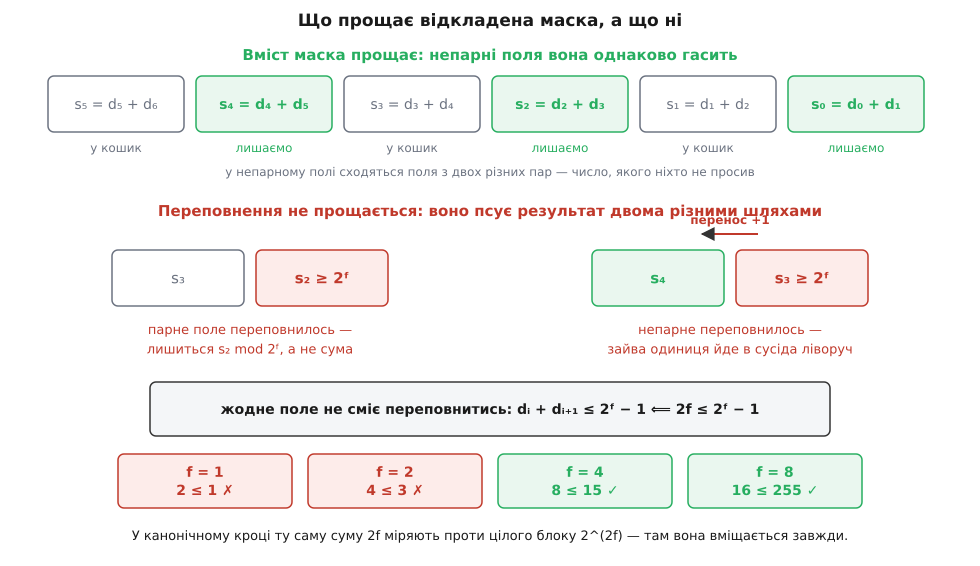
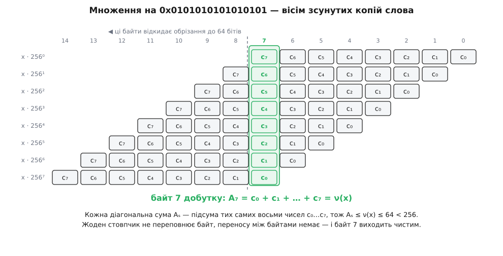

# 🧮 Доведення коректності SWAR-підрахунку

Кожна константа в SWAR-підрахунку стоїть на власній нерівності, і доки ці нерівності не виписані, код лишається набором заклинань — тут доведено, що дванадцять команд справді дають вагу слова, і показано, де саме проходить межа, за якою кожен із трьох прийомів (віднімання замість додавання, відкладена маска, множення на `0x0101010101010101`) ламається.

## Позначення

```
w = 2ᵏ            ширина слова в бітах
x                 беззнакове ціле, 0 ≤ x < 2ʷ
xᵢ                біт із номером i (i = 0 — молодший)
ν(x) = Σ xᵢ       вага слова: скільки в ньому одиниць
```

Нехай f ділить w. Тоді слово розпадається на n = w/f **полів** завширшки f, і все воно читається як число за основою B = 2ᶠ:

```
x = Σ dᵢ·Bⁱ ,   i = 0 … n−1 ,   0 ≤ dᵢ ≤ B − 1
B = 2ᶠ ,   n = w/f
```

Цифра dᵢ — це вміст i-го поля, прочитаний як звичайне число. Уся подальша робота спирається на одну властивість [позиційного запису](topic:math/positional-systems): при фіксованій основі й фіксованій кількості цифр запис числа **єдиний**, тож досить пред'явити законний рядок цифр із потрібною сумою — і це вже й буде запис результату.

Ще два позначення. **Відрізок** Sᵢ^f — це біти вихідного слова x з номерами від i·f до (i+1)·f − 1; ν(Sᵢ^f) — вага цього відрізка. **Маска** M_f лишає молодші f бітів у кожному блоці завширшки 2f:

```
M₁ = 0x5555…55    (двійкове 0101, повторене)
M₂ = 0x3333…33    (0011)
M₄ = 0x0F0F…0F    (00001111)
```

Прочитана за основою B = 2ᶠ, маска M_f робить рівно одне: лишає цифри з **парними** номерами й гасить цифри з непарними.

І два спостереження, які далі вживаються мовчки. Побітові операції ніколи не переносять інформацію між розрядами, тому будь-яке твердження про `&` перевіряється полем за полем. А логічний зсув `x >> f` — це перенумерація цифр: цифра з номером i у слові `x >> f` дорівнює dᵢ₊₁, де d_n вважаємо нулем.

## Лема про межу поля

Усе доведення тримається на одному твердженні, яке варто відокремити, бо його потім доводиться застосовувати п'ять разів поспіль.

**Лема (сепарація).** Нехай x = Σ dᵢBⁱ і y = Σ eᵢBⁱ — n-цифрові числа за основою B.

```
(а)  якщо dᵢ + eᵢ ≤ B − 1 для всіх i,  то  x + y = Σ (dᵢ + eᵢ)·Bⁱ
(б)  якщо dᵢ ≥ eᵢ        для всіх i,  то  x − y = Σ (dᵢ − eᵢ)·Bⁱ
```

**Доведення.** У випадку (а) кожне число dᵢ + eᵢ лежить у проміжку від 0 до B − 1, тобто є законною цифрою за основою B. Отже рядок (d_{n−1}+e_{n−1}, …, d₀+e₀) — законний B-цифровий запис, а число, яке він подає, дорівнює ΣdᵢBⁱ + ΣeᵢBⁱ = x + y. Запис єдиний, значить це і є запис суми: кожне поле результату містить рівно dᵢ + eᵢ, і нічого не перетекло до сусіда. Випадок (б) — те саме з різницями dᵢ − eᵢ, які за умовою невід'ємні й, поготів, менші за B. ∎

Лема — це формальний бік того, що відомо з [додавання стовпчиком](topic:math/binary-arithmetic): перенос виникає рівно тоді, коли сума в розряді не вміщається в основу, і тоді додає одиницю сусідові ліворуч; позика — дзеркальна річ, вона виникає, коли зменшуване в розряді менше за від'ємник. Ані переносу, ані позики не буде, якщо в кожному розряді нерівність тримається — а це саме те, що записано в умовах (а) і (б).

> 🔧 **Навіщо це.** Лема дає готовий рецепт перевірки будь-якого нового SWAR-кроку, свого чи чужого: розкласти обидва доданки на цифри за основою 2ᶠ, оцінити зверху кожну цифру — і перевірити одну нерівність. Якщо вона тримається, крок працює на **всіх** входах без винятку; якщо ні, контрприклад будується прямо з тієї цифри, на якій вона зламалася.

## Інваріант дерева половинних сум

Покладімо x⁽⁰⁾ = x і визначмо крок:

```
f = 2ʲ
x⁽ʲ⁺¹⁾ = (x⁽ʲ⁾ & M_f) + ((x⁽ʲ⁾ >> f) & M_f)
```

**Твердження (інваріант).** Для кожного j = 0 … k слово x⁽ʲ⁾, прочитане за основою 2^(2ʲ), має цифру з номером t, що дорівнює ν(S_t^(2ʲ)) — вазі t-го відрізка завширшки 2ʲ **вихідного** слова x. Зокрема кожна цифра не перевищує 2ʲ.

Доводимо [індукцією](topic:math/mathematical-induction) за j — тобто перевіряємо твердження для j = 0 і показуємо, що з нього для j випливає те саме для j + 1.

**База, j = 0.** Поле завширшки 1, цифра — сам біт, вага однобітного відрізка дорівнює цьому ж бітові. Твердження тривіальне.

**Крок.** Нехай інваріант тримається для j; позначмо f = 2ʲ, x = x⁽ʲ⁾, dᵢ — його цифри за основою B = 2ᶠ. За інваріантом dᵢ = ν(Sᵢ^f) ≤ f. Нові поля мають ширину 2f, тож читаємо все за основою B′ = 2^(2f):

```
x & M_f            цифра з номером t дорівнює d₂ₜ      (старша половина блоку згашена)
(x >> f) & M_f     цифра з номером t дорівнює d₂ₜ₊₁    (зсув підсунув її на місце, маска зрізала решту)
```

Обидва доданки мають у кожному полі число, не більше за f. Умова леми (а) в основі B′ вимагає d₂ₜ + d₂ₜ₊₁ ≤ B′ − 1, і для цього досить нерівності

```
2f ≤ 2^(2f) − 1
```

Вона тримається завжди, і з колосальним запасом: для будь-якого цілого m ≥ 0 маємо m < 2ᵐ (доводиться тією ж індукцією: 0 < 1, а подвоєння правої частини наздоганяє додавання одиниці до лівої), а підставивши m = 2f, дістаємо 2f < 2^(2f). Отже додавання йде полем за полем, і цифра t результату дорівнює

```
d₂ₜ + d₂ₜ₊₁ = ν(S₂ₜ^f) + ν(S₂ₜ₊₁^f) = ν(S_t^(2f))
```

Остання рівність — уся суть прийому: два сусідні відрізки завширшки f, поставлені поруч, і є відрізок завширшки 2f, а вага відрізка дорівнює сумі ваг його частин. Нова цифра не перевищує 2f, тож інваріант у повному обсязі перенесено на j + 1. ∎

**Наслідок.** Після k = log₂ w кроків поле має ширину 2ᵏ = w, тобто збігається з усім словом, і єдина цифра x⁽ᵏ⁾ дорівнює ν(S₀^w) = ν(x). Дерево половинних сум рахує вагу правильно, скільки б не було бітів, — аби лише ширина була степенем двійки.

## Крок нуль: чому там віднімання, а не додавання

Перший рядок коду записано інакше, ніж вимагає щойно доведена схема:

```
x = x − ((x >> 1) & M₁)
```

Візьмімо f = 1, B′ = 4 і випишімо цифри. Блок завширшки 2 з номером t містить біти x₂ₜ₊₁ (старший, позначмо b₁) і x₂ₜ (молодший, b₀), тобто його цифра за основою 4 дорівнює

```
Dₜ = 2b₁ + b₀
```

Слово `(x >> 1) & M₁` за тією ж основою 4 має цифру b₁: зсув поставив біт x₂ₜ₊₁ на позицію 2t, а маска зрізала все інше в блоці. Потрібне нам число — b₁ + b₀, різниця між тим, що є, і тим, що треба, — рівно b₁:

```
Dₜ − b₁ = 2b₁ + b₀ − b₁ = b₁ + b₀ = ν(Sₜ²)
```

Лишається довести, що віднімання цілих слів справді діє на кожне поле окремо, тобто **позика ніколи не перетинає межу поля**. Умова леми (б) вимагає Dₜ ≥ b₁, а це

```
2b₁ + b₀ ≥ b₁   ⟺   b₁ + b₀ ≥ 0
```

Нерівність виконується для будь-яких бітів, і не випадково: від'ємник b₁ — це буквально **частина** зменшуваного Dₜ, взята з тієї ж пари. Відняти від числа один із його власних доданків не можна так, щоб пішли в мінус, тож позики не виникає ніде й ніколи, а не «майже завжди». Запас тут навіть подвійний: різниця b₁ + b₀ ≤ 2, а поле вміщає 3.

## Чому віднімання вигідне лише на першому кроці

Той самий прийом узагальнюється на будь-яку ширину — і саме узагальнення показує, чому далі його не вживають. Нехай блок завширшки 2f містить старшу половину a і молодшу b, тобто його цифра дорівнює a·2ᶠ + b, а потрібна нам сума — a + b. Різниця між ними:

```
(a·2ᶠ + b) − (a + b) = a·(2ᶠ − 1)
```

Отже загальна форма кроку через віднімання така:

```
x = x − ((x >> f) & M_f) · (2ᶠ − 1)
```

Вона законна за будь-якого f, і перевірити треба дві речі. Перша: множення на 2ᶠ − 1 не виносить нічого за межу поля. Цифри слова `(x >> f) & M_f` не перевищують f, а f·(2ᶠ − 1) < 2ᶠ·2ᶠ = 2^(2f), тож кожна цифра, помножена на константу, лишається законною цифрою за основою 2^(2f) — і за єдиністю запису множення діє поле за полем. Друга: умова леми (б) вимагає a·2ᶠ + b ≥ a·(2ᶠ − 1), тобто a + b ≥ 0, — знову тотожно правда. Але множник 2ᶠ − 1 зникає рівно тоді, коли f = 1: 2¹ − 1 = 1. Тоді крок коштує зсув, AND і віднімання — три команди замість двох AND, зсуву й додавання, тобто чотирьох. Уже при f = 2 множник дорівнює 3, і замість зекономленої однієї команди доводиться платити принаймні двома (зсув і додавання, щоб помножити на 3). Асиметрія першого рядка SWAR — не примха стилю, а єдине значення f, за якого 2ᶠ − 1 = 1.

## Коли маску можна накласти після додавання

Третій крок канонічного коду записано ще інакше — з однією маскою **після** суми:

```
x = (x + (x >> 4)) & M₄
```

Відмінність від доведеної схеми одна, і в ній уся суть. У канонічному кроці обидва доданки спершу чистять маскою, тож у блоці завширшки 2f лежить одне-єдине число, і сума міряється проти основи B′ = 2^(2f) — місткості цілого блоку. Тут доданки не чистять: зайняте кожне f-бітне поле обох слів, і додавання йде стовпчиками завширшки f, тобто та сама сума міряється проти основи B = 2ᶠ — кореня з попередньої місткості. Ось звідки й береться межа.

Випишімо все точно. Нехай слово має цифри dᵢ за основою B = 2ᶠ, кожна не більша за f. Тоді `x >> f` має в полі i цифру dᵢ₊₁, і додавання стовпчиком за основою B дає

```
sᵢ = dᵢ + dᵢ₊₁ + cᵢ ,   цифра результату = sᵢ mod B ,   cᵢ₊₁ = 1, якщо sᵢ ≥ B
```

Маска M_f лишає цифри з парними номерами й гасить непарні. Тепер розділімо дві різні речі: **вміст** поля й **перенос** із нього.

Вміст непарних полів нікого не обходить. Там осідає d₂ₜ₊₁ + d₂ₜ₊₂ — сума полів із двох **різних** пар, число, якого ніхто не просив; маска його зітре. Саме це й купує відкладена маска: право не чистити доданки, бо половина результату однаково піде в кошик.

А переповнення не прощається ніде, і псує воно результат двома різними шляхами:


*Парне поле переповнилось — воно втратило старший біт власної суми, тобто зіпсовано рівно те число, яке ми збираємося лишити. Непарне переповнилось — його перенос пішов ліворуч, у парне поле, і додав туди зайву одиницю. Сміття в непарних полях нешкідливе; переповнення в них — ні.*

Звідси умова: жодне поле не сміє переповнитись.

```
dᵢ + dᵢ₊₁ ≤ B − 1     для всіх i
```

Вимога сама себе підтримує, і саме тому в ній не лишилося жодного cᵢ: нульовий стовпчик переносу не отримує (c₀ = 0), тож s₀ = d₀ + d₁ ≤ B − 1 і перенос із нього не виходить; далі те саме міркування піднімається на стовпчик вище, і так до кінця слова. Якщо жоден стовпчик не переповнюється без переносу, переносу не виникає ніде. Виражена через межу dᵢ ≤ f, умова стає такою:

```
2f ≤ 2ᶠ − 1
```

І це не оцінка з запасом, а точна межа: після попередніх кроків слово з самих одиниць має рівно f у **кожному** полі, тож dᵢ + dᵢ₊₁ = 2f досягається на найзвичайнішому з входів. Вирок:

```
f = 1:   2 ≤ 1     ✗        f = 4:    8 ≤ 15    ✓
f = 2:   4 ≤ 3     ✗        f = 8:   16 ≤ 255   ✓
```

Відкладена маска стає законною **починаючи з чотирибітних полів**. Причина проста: сума росте як 2f, місткість поля — як 2ᶠ, і до f = 4 показникова функція ще не встигає відірватися. У канонічному кроці ту саму суму 2f міряють проти 2^(2f), і нерівність тримається за будь-якої ширини; плата за відкладену маску якраз у тому, що місткість береться квадратним коренем.

Контрприклад для f = 2 будується не штучно, а з найзвичайнішого входу. Візьмімо байт 0xFF; після нульового кроку він перетворюється на 0xAA, тобто всі чотири двобітні поля містять 2 — законний стан, у якому опиниться будь-яке щільне слово:

```
x        = 1010 1010   (0xAA)   поля: 2, 2, 2, 2
x >> 2   = 0010 1010   (0x2A)   поля: 2, 2, 2, 0

правильно (маска до додавання):
(x & M₂) + ((x >> 2) & M₂) = 0x22 + 0x22 = 0x44   → півбайти 4 і 4 ✓

хибно (маска після додавання):
x + (x >> 2) = 0xD4 = 1101 0100                    → поля: 3, 1, 1, 0
0xD4 & M₂    = 0x10                                → півбайти 1 і 0 ✗
```

Правильна відповідь для 0xFF — по 4 одиниці в кожному півбайті; відкладена маска дає 1 і 0. Помилка не «дрібна», не «на одиницю» і не «рідкісна»: щойно нерівність не виконується, переноси йдуть каскадом і від результату не лишається нічого.

## Скільки лишається запасу на кожному кроці

Зведімо всі оцінки в одну таблицю. Сума двох полів — та сама 2f на кожному кроці; різняться лише місткості, проти яких її міряють: чистий крок міряє суму проти цілого блоку завширшки 2f, крок із відкладеною маскою — проти вузького поля завширшки f.

| крок j | поле f = 2ʲ | цифра ≤ f | сума двох ≤ 2f | блок вміщає 2^(2f) − 1 | поле вміщає 2ᶠ − 1 |
|---|---|---|---|---|---|
| 0 | 1 | 1 | 2 | 3 ✓ | 1 ✗ |
| 1 | 2 | 2 | 4 | 15 ✓ | 3 ✗ |
| 2 | 4 | 4 | 8 | 255 ✓ | 15 ✓ |
| 3 | 8 | 8 | 16 | 65 535 ✓ | 255 ✓ |
| 4 | 16 | 16 | 32 | 2³² − 1 ✓ | 65 535 ✓ |
| 5 | 32 | 32 | 64 | 2⁶⁴ − 1 ✓ | 2³² − 1 ✓ |

Передостанній стовпчик не порушується ніколи — саме тому дерево половинних сум працює за будь-якої ширини. Останній порушується двічі й більше ніколи: обидві тісні клітинки припадають на перші два кроки, і всі хитрощі коду зосереджені рівно там. Далі запас росте нестримно — сума подвоюється, місткість підноситься до квадрата, — і від третього кроку в байті сидить число, не більше за 8, при місткості 255. Цей запас у 247 одиниць нікуди не витрачається: його й забирає множення.

## Множення на 0x0101010101010101

Після третього кроку кожен байт слова тримає власну вагу:

```
x = Σ cᵢ·256ⁱ ,  i = 0 … 7 ,  cᵢ = ν(байта i вихідного слова) ,  0 ≤ cᵢ ≤ 8
Σ cᵢ = ν(x) ≤ 64
```

Множник `0x0101010101010101` — це вісім одиничних байтів, тобто [сума геометричної прогресії](topic:math/geometric-series) зі знаменником 256:

```
K = Σ 256ʲ , j = 0 … 7  =  (2⁶⁴ − 1) / (2⁸ − 1)  =  0x0101010101010101
```

Перемножмо в цілих числах, без жодного обрізання, і згрупуймо за степенем:

```
x·K = Σᵢ Σⱼ cᵢ·256^(i+j)  =  Σₛ Aₛ·256ˢ ,  s = 0 … 14

Aₛ = Σ cᵢ  за всіма i, для яких 0 ≤ i ≤ 7  і  0 ≤ s − i ≤ 7
```

Aₛ — це діагональна сума: скільки копій слова накрили байт із номером s, стільки доданків до неї й увійшло.


*Множення на константу з восьми одиничних байтів — це додавання восьми копій слова, зсунутих одна відносно одної на цілий байт. Кожен стовпчик добутку збирає свою діагональну суму Aₛ; стовпчик із номером 7 — єдиний, який накрили всі вісім копій одразу.*

Тепер два спостереження, і доведення завершено.

**Переносу між байтами немає.** Кожне Aₛ — це підсума тих самих восьми невід'ємних чисел c₀ … c₇, тому

```
0 ≤ Aₛ ≤ c₀ + c₁ + … + c₇ = ν(x) ≤ 64 < 256
```

Отже рядок (A₁₄, …, A₀) — законний запис за основою 256, а число, яке він подає, дорівнює добутку. За єдиністю позиційного запису це і **є** запис добутку: байт із номером s дорівнює Aₛ рівно, без жодних переносів. Зверніть увагу на природу цієї межі: справа не в тому, що «8 · 8 = 64», а в тому, що будь-яка діагональна сума не перевищує **повної** ваги слова, а повна вага w-бітного слова не перевищує w. Число 64 — це ширина слова, а не добуток восьми на вісім.

**Потрібний нам байт — сьомий.** Умова 0 ≤ s − i ≤ 7 при s = 7 не відсікає жодного i, тож

```
A₇ = c₀ + c₁ + … + c₇ = ν(x)
```

**Обрізання нешкідливе.** Машинне множення дає добуток [за модулем 2⁶⁴](topic:math/modular-arithmetic) — тобто відкидає байти з номерами 8 і вище, не чіпаючи молодші вісім. Байт 7 у молодшій вісімці лишається, а `>> 56` виносить його на дно слова, де він і читається як число:

```
(x · K  mod 2⁶⁴) >> 56  =  A₇  =  ν(x)
```

Маска після зсуву не потрібна: у 64-бітному слові вище байта 7 нічого немає, зсув на 56 лишає рівно вісім бітів.

## Межа застосовності для ширших слів

Виписана оцінка одразу дає загальне правило. Нехай слово має w бітів, поля — f бітів (f ділить w), а множник —

```
K = Σ 2^(f·j) , j = 0 … w/f − 1  =  (2ʷ − 1) / (2ᶠ − 1)
```

Ті самі викладки проходять без жодної зміни, якщо кожна діагональна сума вміщається в поле, а найбільша з них дорівнює ν(x) ≤ w. Умова:

```
w ≤ 2ᶠ − 1
```

Для байтових полів (f = 8) це w ≤ 255, і оскільки w кратне восьми — w ≤ 248. Слова на 8, 16, 32, 64 і 128 бітів проходять; вилучення робиться зсувом на w − 8.

А ось при w = 256 прийом ламається, і ламається двічі. По-перше, слово з усіх одиниць дає A₃₁ = 256, що вже не вміщається в байт, — виникає перенос, і сусідні байти псуються. По-друге, сама відповідь 256 не вміщається у восьмибітне вікно, тож жодний зсув її б не витяг. Це не «майже працює на випадкових даних»: випадкове 256-бітне слово має близько 128 одиниць і проходить, а слово з усіх одиниць повертає нуль — рівно той сорт помилки, який не ловиться тестами на випадкових входах.

Ліки очевидні з умови: розширити поле. Один зайвий крок дерева зводить слово до шістнадцятибітних полів (значення ≤ 16), і тоді множник дорівнює (2ʷ − 1)/(2¹⁶ − 1), для 64 бітів — `0x0001000100010001`, а умова стає w ≤ 65 535. Ціна — один додатковий крок; виграш — стеля, до якої не дотягнеться жодна реальна ширина регістра.

## Скільки слів можна скласти до одного множення

З тієї ж нерівності випливає наслідок, за який варто триматися, коли рахувати доводиться не одне слово, а буфер. Нехай m слів пройшли дерево до байтових полів, і ці проміжні результати просто **додано** одне до одного звичайним `+`:

```
y = Σ x_r(байтові поля) ,  r = 1 … m
байт i числа y  =  Σ_r c_i(x_r) ≤ 8m
повна вага      =  Σ_r ν(x_r)   ≤ 64m
```

Додавання самих слів безпечне, доки 8m ≤ 255, тобто до m = 31. Але множення накладає жорсткішу вимогу — діагональна сума не сміє перевищити 255, а найбільша з них дорівнює повній вазі:

```
64m ≤ 255   ⟹   m ≤ 3      (64·3 = 192 ✓ ,  64·4 = 256 ✗)
```

Отже одне множення обслуговує щонайбільше **три** 64-бітні слова, і межа гостра: чотири слова з усіх одиниць дають діагональну суму 256 і повертають нуль замість 256. Знову-таки, випадкові дані цього не покажуть — у випадковому слові близько 32 одиниць, і чотири такі слова дають 128, тобто вкладаються в байт із запасом.

Накопичувати довше можна лише в ширших полях. Зведімо кожне слово ще на крок далі, до шістнадцятибітних полів, і множмо на `0x0001000100010001`: тоді поле витримує 16m ≤ 65 535, тобто m до 4095, а множення вимагає 64m ≤ 65 535, тобто m до 1023, — і зв'язує саме друга умова. Обидві межі, і три, і 1023, — не емпіричні спостереження, а та сама нерівність «діагональна сума мусить уміститися в поле», записана з іншими числами.
