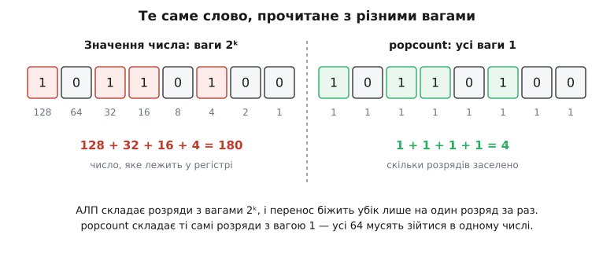
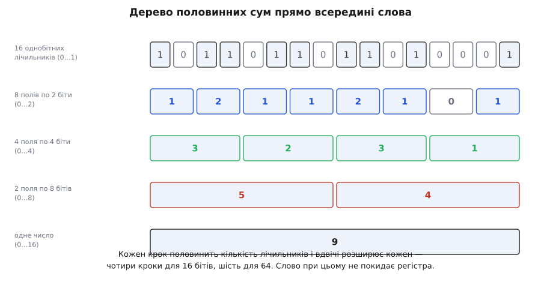
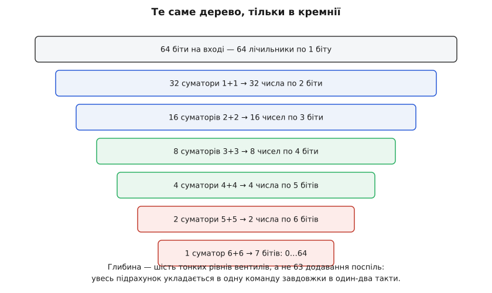
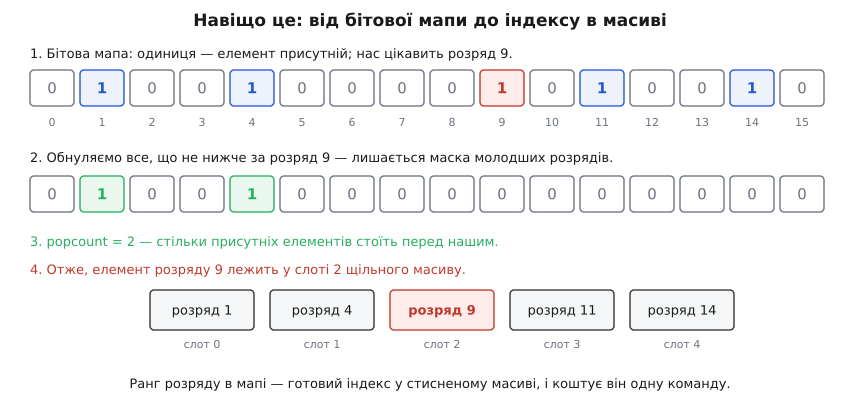

# Підрахунок одиничних бітів (popcount)

<preknowlist>
- [Біти, байти й порядок байтів](topic:programming/bits-bytes-endianness) — що таке біт, байт і машинне слово, який розряд старший, а який молодший.
- [Побітові операції та маски](topic:programming/bitwise-operations) — AND, OR, XOR, зсуви, і що робить із словом константа-маска.
- [Арифметика в двійковій системі](topic:math/binary-arithmetic) — додавання й віднімання стовпчиком, перенос і позика.
- [Доповняльний код](topic:programming/twos-complement) — як машина подає від'ємні числа й чому −x дорівнює ~x + 1.
- [Цілі типи в C/C++](topic:programming/integer-types-c) — беззнакові типи сталої ширини (`uint32_t`, `uint64_t`) і поведінка зсувів на них.
</preknowlist>

Візьміть 64-бітне слово й запитайте про нього найпростіше, що взагалі можна запитати: скільки в ньому одиниць? Не яке це число, не де саме стоять одиниці — просто скільки їх. Питання виглядає дитячим, а тим часом процесори мають під нього окрему команду, найперший суперкомп'ютер дістав таку команду на вимогу криптографічної служби, і за півстоліття навколо неї наросло кілька поколінь дедалі хитріших алгоритмів. Не тому, що задача складна. Тому, що вона **поперечна** до всього, що вміє арифметико-логічний пристрій.

Операція має власне ім'я: **population count** (англ. «підрахунок населення» — скільки розрядів слова «заселено» одиницями), скорочено **popcount**; у теорії кодування те саме число звуть **вагою Гемінга**.

### Питання, яке машина ставить собі щосекунди

Одиниці в слові рахують не задля цікавості. Рахують тому, що біт — найдешевший спосіб сказати «так» або «ні» про якийсь один об'єкт, а слово з 64 бітів — найдешевший спосіб сказати це одразу про 64 об'єкти. Коли ви оголошуєте [бітову множину](topic:programming/bitset) — 64 можливі елементи, кожен присутній або ні, — popcount відповідає на питання «скільки їх насправді»: це **потужність множини**, узята за один погляд.

Далі все розкручується само собою. Перетин двох множин — це AND двох слів; скільки елементів у перетині — це popcount результату. Дві пари команд на 64 елементи, без жодного циклу. [Відстань Гемінга](topic:math/hamming-bounds) між двома словами — тобто в скількох розрядах вони розійшлися — це popcount від їхнього XOR, бо XOR запалює одиницю рівно там, де біти різні; на цьому стоїть і декодування завадостійких кодів, і пошук схожих відбитків у величезних наборах даних. Шаховий рушій тримає позицію як набір 64-бітних масок (клітинок на дошці теж 64), і «скільки в мене пішаків» — це один popcount. Стиснуті вузли дерев і бітові індекси в базах даних ідуть ще далі: там popcount перетворює бітову мапу на **адресу** в масиві.

Спільне в усіх цих випадках одне: підрахунок сидить на гарячому шляху й виконується мільйони разів на секунду. Тому питання «як швидко порахувати одиниці» — не головоломка, а інженерна задача з ціною.

### Чому арифметика не дає цього задарма

Здавалося б, процесор уміє додавати — от нехай і додасть 64 біти. Але тут ховається підміна, яку варто побачити чітко.


*Те саме слово, прочитане з різними вагами. Ліворуч розряди мають ваги 128, 64, 32, … — їхня сума й дає число 180, те саме, що лежить у регістрі. Праворуч ті самі розряди беруться з вагою 1 — і сума дорівнює 4, кількості одиниць. Popcount не витягує з числа щось приховане: він **перезважує** його розряди.*

Арифметико-логічний пристрій побудований під ваги 2ᵏ. Коли він додає два числа, кожен розряд результату залежить від того самого розряду доданків і від переносу з сусіда праворуч — інформація тече вбік на один розряд за раз, і весь інженерний хист у суматорах витрачено на те, щоб ця хвиля переносу бігла швидше. Popcount такої структури не має зовсім: його результат однаково залежить від **усіх** 64 розрядів, і жоден із них не важливіший за інший. Це не арифметична операція над числом, а **згортка** — зведення цілого слова до одного підсумку.

Через одну лише арифметику згортку доводиться робити послідовно: маємо 64 однобітні числа, а суматор бере два за раз, отже потрібно 63 додавання поспіль. Саме звідси й ростуть усі наївні способи — і саме цю послідовність далі треба буде зламати.

> 🔧 **Навіщо це.** Розуміння «popcount — це згортка, а не арифметика» одразу підказує, де шукати виграш. Згортку не можна зробити дешевшою, зменшивши кількість роботи (одиниці все одно доведеться врахувати всі) — її роблять дешевшою, скорочуючи **глибину**: довжину найдовшого ланцюжка залежностей від входу до відповіді. Усе далі в цій статті — різні способи ту глибину скоротити.

### Найпростіше: перебрати всі розряди

Найпряміша реалізація дивиться на кожен розряд по черзі:

```c
int popcount_loop(uint64_t x) {
    int n = 0;
    for (int i = 0; i < 64; i++)
        n += (int)((x >> i) & 1u);
    return n;
}
```

Він правильний і чесний, і в нього є одна несподівано цінна властивість: час виконання **не залежить від даних** — 64 ітерації і для нуля, і для слова з усіх одиниць. Ціна цієї рівності — приблизно дві сотні машинних команд на одне 64-бітне слово. Для гарячого шляху це неприйнятно багато, тож перше, що спадає на думку, — зупинятися раніше.

### Гасити одиниці по одній: x & (x − 1)

Є коротка формула, яка виглядає як фокус, а насправді просто читає механіку віднімання: **вираз `x & (x − 1)` прибирає з x найнижчу одиницю, не чіпаючи все інше**. Розберімо, чому.

Нехай найнижча одиниця стоїть у розряді k; це означає, що всі розряди нижче за k — нулі. Віднімання одиниці мусить позичити, і позичати нема де, аж доки не дійде до розряду k: цей розряд гасне, а всі нулі під ним обертаються на одиниці. Розряди вище k віднімання не зачепило взагалі. Тепер накладаємо AND: вище k обидва слова однакові, тож там усе лишається як було; у розряді k маємо 1 & 0 = 0; нижче k маємо 0 & 1 = 0. Разом — те саме слово без найнижчої одиниці.

**Слово 0b1011_0100 (180), найнижча одиниця — у розряді 2:**

```
x        = 1011 0100      (180)
x − 1    = 1011 0011      (179)   ← позика з'їла розряд 2, під ним усе стало одиницями
x & (x−1)= 1011 0000      (176)   ← лишилося на одну одиницю менше
```

Звідси цикл, який робить рівно стільки кроків, скільки в слові одиниць:

```c
int popcount_wegner(uint64_t x) {
    int n = 0;
    while (x) { x &= x - 1; n++; }
    return n;
}
```

Для розрідженого слова — де одиниць три-чотири — це блискуче: три ітерації замість шістдесяти чотирьох. Для щільного — тридцять дві ітерації, майже те саме, що й перебір. Але справжня пастка інша: кількість ітерацій тепер **залежить від даних**, а отже, умова циклу непередбачувана. Кожне [хибне передбачення переходу](topic:programming/branch-prediction) коштує сучасному ядру десяток тактів на перезапуск конвеєра, і на випадкових даних цей штраф з'їдає всю економію. Крім того, змінний час виконання — це витік інформації: у криптографічному коді, де слово залежить від ключа, такий цикл сам розповідає стороннім, скільки в ключі одиниць.

Прийом опублікував Пітер Вегнер 1960 року в короткій замітці для *Communications of the ACM*; у побуті його часто звуть «трюком Кернігана», бо мільйони програмістів уперше побачили його вправою в підручнику Кернігана й Рітчі. [Хто, коли й навіщо винаходив підрахунок одиниць](topic:programming/popcount/hist-popcount-origins.md) — окрема історія, у якій є і криптоаналітики, і хакери MIT.

У цієї формули є рідний брат: `x & (−x)` лишає **саму лише** найнижчу одиницю й гасить решту (у [доповняльному коді](topic:programming/twos-complement) −x — це ~x + 1, тож збігається з x рівно в одному розряді — найнижчому одиничному). Це вже не підрахунок, а [пошук позиції крайнього одиничного біта](topic:programming/bit-scan-clz-ctz), окрема операція зі своїми командами в наборі.

### Пам'ять замість роботи: таблиця

Класична відповідь доконвеєрної епохи — обміняти пам'ять на час. Порахуймо наперед ваги всіх 256 можливих байтів у [таблицю замін](topic:programming/lookup-table), і тоді вага слова складається з ваг його вісьмох байтів: вісім звернень до масиву замість шістдесяти чотирьох перевірок розряду.

Прийом лишається розумним там, де немає ані апаратної команди, ані швидкого множення, — на дрібних мікроконтролерах, де таблиця цілком може лежати константою у флеші. Але на великому процесорі його давно перевершили, і причина повчальна: таблиця живе в [кеші](topic:programming/cache). У щільному циклі вона осяде в L1 і читатиметься за кілька тактів, але ці кілька тактів на кожен байт уже програють арифметиці, а сама таблиця витісняє з кеша корисні дані. Обмін «пам'ять за час» перестав бути вигідним тоді, коли звернення до пам'яті стало дорожчим за обчислення.

### Дерево половинних сум

Тепер повернімося до головного: 63 послідовні додавання. Послідовні вони лише тому, що ми чомусь вирішили складати біти по одному. А слово з 64 бітів — це вже готовий ряд із 64 однобітних лічильників, які лежать поруч у регістрі. Складімо їх **попарно і всі водночас**: вийде 32 двобітні поля, кожне зі значенням від 0 до 2. Тоді складімо попарно ці поля — 16 чотирибітних, зі значеннями 0…4. І так далі, доки не лишиться одне число.


*Дерево половинних сум усередині слова. На кожному кроці сусідні лічильники додаються попарно: кількість полів зменшується вдвічі, ширина кожного вдвічі зростає, а сума по всьому рядку лишається незмінною — 9. Для 16 бітів потрібно чотири кроки, для 64 — шість.*

Кількість кроків — log₂ 64 = 6, і кожен крок робиться **над усім словом одразу**, звичайними побітовими командами. Це і є прийом, який називають SWAR (*SIMD Within A Register* — «векторність усередині регістра»): один регістр удають за масив вузьких лічильників.

Найперший крок можна записати прямо за означенням — виділити маскою парні позиції, зсунути непарні до них і додати:

```c
x = (x & 0x5555555555555555ULL) + ((x >> 1) & 0x5555555555555555ULL);
```

Але тут ховається дрібна економія, варта того, щоб її побачити. Подивімося на будь-яке двобітне поле як на число: воно дорівнює 2·b₁ + b₀, де b₁ — старший біт пари, b₀ — молодший. А нам потрібне b₁ + b₀. Різниця між тим, що є, і тим, що треба, — рівно b₁. Отже, досить **відняти** з кожного поля його власний старший біт:

```c
x = x - ((x >> 1) & 0x5555555555555555ULL);
```

Вираз `(x >> 1) & 0x5555…` — це і є b₁ кожної пари, підсунутий на молодшу позицію свого ж поля. Віднімання при цьому безпечне: жодне поле не йде в мінус, бо 2·b₁ + b₀ ≥ b₁ завжди, а отже позика ніколи не перелізе через межу поля й не зіпсує сусіда. Одна команда AND зекономлена, і саме в такому вигляді цей крок живе в усіх реалізаціях.

Другий крок складає двобітні поля в чотирибітні, і його вже доводиться писати з двома масками — бо сума двох полів по 0…2 може дорівнювати 4, а це вже не влазить у два біти й полізло б у сусіда:

```c
x = (x & 0x3333333333333333ULL) + ((x >> 2) & 0x3333333333333333ULL);
```

Третій крок цікавіший. Тепер поля чотирибітні, значення в них 0…4, сума двох — щонайбільше 8, і вона спокійно вміщається в чотири біти. Тому маску можна накласти **після** додавання, а не двічі до нього: сміття, що набіжить у старших півбайтах, нікуди не перетече, бо переносу за межу поля просто не буде.

```c
x = (x + (x >> 4)) & 0x0F0F0F0F0F0F0F0FULL;
```

Після цього кроку кожен байт слова тримає власну вагу — число від 0 до 8. Лишилося скласти вісім байтів; можна ще трьома кроками того самого дерева, а можна одним множенням. Константа `0x0101010101010101` — це вісім одиничних байтів, тож множення на неї дає суму восьми копій слова, зсунутих одна відносно одної на цілий байт. У **найстаршому** байті добутку зійдуться всі вісім доданків одразу; сума їх щонайбільше 64, тобто в байт вона влазить і сусідів не чіпає. Лишається зсунути цей байт униз:

```c
int popcount_swar(uint64_t x) {
    x = x - ((x >> 1) & 0x5555555555555555ULL);
    x = (x & 0x3333333333333333ULL) + ((x >> 2) & 0x3333333333333333ULL);
    x = (x + (x >> 4)) & 0x0F0F0F0F0F0F0F0FULL;
    return (int)((x * 0x0101010101010101ULL) >> 56);
}
```

Дванадцять команд, жодної гілки, жодного звернення до пам'яті, час не залежить від даних. Це та реалізація, яку варто пам'ятати напам'ять: вона працює скрізь, від восьмибітного мікроконтролера до сервера, і в неї немає поганих випадків. Формальні підстави кожного кроку — чому поле ніколи не переповнюється, за якої точно умови маску можна відкласти на потім і чому множення додає саме те, що треба, — розписано в [покроковому доведенні SWAR-підрахунку](topic:programming/popcount/math-swar-proof.md).

### Те саме дерево, тільки в кремнії

Дванадцять команд — небагато, але процесор робить це однією. Погляньмо, чому йому це так дешево обходиться.

Дерево половинних сум лягає в апаратуру буквально. Перший рівень — 32 крихітні суматори, кожен додає два біти й видає двобітне число. Другий — 16 суматорів на два біти. Далі 8, 4, 2 і, нарешті, один суматор, що додає два шестибітні числа й дає сім бітів: рівно стільки треба, щоб записати відповідь від 0 до 64.


*Те саме дерево в кремнії. Кількість суматорів на кожному рівні половиниться, а ширина кожного зростає на один біт. Найдорожчий рівень — найперший і водночас найпростіший: тридцять два однобітні суматори, тобто пара вентилів на кожен.*

Ключове тут — не кількість вентилів, а **глибина**. Сигналові треба пройти шість рівнів дрібних [комбінаційних схем](topic:electronics/combinational-circuits), і кожен рівень тонкий. Шість тонких рівнів — це затримка, яка спокійно вміщається в один такт великого ядра або в два; тому popcount і став однією командою, а не мікропрограмою.

Реальні схеми йдуть ще далі й будують дерево не з суматорів, а з **компресорів 3:2** — це звичайний повний суматор, використаний нетрадиційно. Він бере три біти **однакової ваги** й видає два: біт суми (вага 1) і біт переносу (вага 2). Сума трьох при цьому зберігається — три доданки перетворилися на два, і жодного ланцюга переносу вбік не виникло. Такий вузол зменшує кількість доданків у відношенні 3:2 за один тонкий рівень, тобто швидше, ніж 2:1, і платити за це доводиться лише тим, що результат тимчасово живе у двох словах замість одного. Наприкінці, коли доданків лишилося два, їх додає єдиний звичайний суматор.

Історично першою машиною з такою командою став CDC 6600 Сеймура Крея (1964) — і команду там реалізували на апаратурі блока ділення, яка й так стояла в процесорі. Замовником, за загальновизнаною версією, було Агентство національної безпеки США: підрахунок одиниць — базова операція криптоаналізу, і саме під неї попросили окремий код операції.

### Команда в наборі — і як до неї дістатися з C

Після CDC 6600 команда надовго зникла з масових [наборів інструкцій](topic:programming/isa) і повернулася аж у 2000-х:

| Архітектура | Команда | Коли з'явилася |
|---|---|---|
| x86-64 (AMD) | `POPCNT` у розширенні ABM/SSE4a | K10 «Barcelona», 2007 |
| x86-64 (Intel) | `POPCNT` у складі SSE4.2 | Nehalem, 2008 |
| ARM (вектор) | `CNT` — рахує одиниці **в кожному байті** окремо | NEON, потім Armv8 |
| ARM (скаляр) | `CNT` над регістром загального призначення | FEAT_CSSC, обов'язкове з Armv8.9 |
| RISC-V | `CPOP` у розширенні Zbb | bitmanip, ратифіковано 2021 |

Рядок про ARM варто прочитати уважно: векторна `CNT` дає вагу кожного байта окремо, і щоб дістати вагу цілого слова, треба ще одне, горизонтальне додавання байтів (`ADDV`). Скалярної команди в ARM довго не було взагалі — вона з'явилася лише з розширенням FEAT_CSSC.

З мови до цієї команди ведуть три двері. Найпереносніші — `std::popcount` із заголовка `<bit>` у C++20; трохи старіші — вбудовані функції компілятора `__builtin_popcount` і `__builtin_popcountll` у GCC та Clang (у MSVC — `__popcnt64`); найнижчі — інтринсики на кшталт `_mm_popcnt_u64`, що прямо відповідають машинній команді.

І тут-таки чекає найпоширеніша пастка. **`__builtin_popcount` — це не команда `POPCNT`.** Компілятор мусить згенерувати код, який запуститься на будь-якому процесорі цільової архітектури, а `POPCNT` є не в кожному x86-64. Тому без прапорця `-mpopcnt` (або `-march=`, який його вмикає) GCC чесно підставить **виклик бібліотечної функції** `__popcountdi2` — а виклик на гарячому шляху коштує дорожче за дванадцять команд SWAR. Виходів три: увімкнути прапорець, якщо ви знаєте цільове залізо; перевіряти наявність розширення в рантаймі й перемикати реалізацію; або просто написати SWAR і не залежати ні від чого.

Друга пастка вужча, але дуже показова. На ядрах Intel від Sandy Bridge до Skylake `POPCNT` має **хибну залежність** від регістра-приймача: команда чекає, доки завершиться попередній запис у цей регістр, хоча її результат від нього не залежить узагалі. У циклі, де підсумок накопичується в одному регістрі, це зшиває незалежні команди в один ланцюг і ріже пропускну здатність утричі — при тому, що [позачергове ядро](topic:programming/out-of-order-execution) могло б виконувати їх паралельно. Компілятори навчилися це обходити (чистять приймач перед командою), Intel виправив апаратуру починаючи з Cannon Lake та Ice Lake, але писаний руками асемблер на цьому досі спотикається.

> 🔧 **Навіщо це.** Перш ніж радіти, що «поставив `__builtin_popcount` і все стало швидко», подивіться дизасемблер однією командою: `objdump -d` і пошук `popcnt`. Якщо замість команди там `call __popcountdi2` — ви не прискорили нічого, а сповільнили. Це п'ятихвилинна перевірка, яка регулярно рятує оптимізацію від того, щоб бути уявною.

### Коли слів не одне, а мільйон

Досі йшлося про одне слово. Але типове застосування — інше: пробігти буфер на кілька мегабайтів і порахувати в ньому всі одиниці (перетин бітових індексів у базі, порівняння двійкових відбитків, статистика каналу). Тут змінюється сама постановка: важить уже не затримка однієї команди, а **пропускна здатність**.

Скалярний `POPCNT` бере 64 біти за команду, і ядро запускає одну-дві такі команди за такт. [Векторні розширення](topic:programming/simd-vectorization) працюють з регістрами по 256 і 512 бітів — і питання в тому, як порахувати одиниці всередині такого регістра, якщо векторної команди popcount довго не існувало.

Відповідь виявилася напрочуд елегантною: у вектор кладуть **таблицю на півбайт** — шістнадцять маленьких чисел, ваги всіх можливих півбайтів, — і команда перестановки байтів `pshufb` робить шістнадцять пошуків у цій таблиці за один такт. Таблиця, яку ми щойно списали за повільність, повертається — але тепер вона живе не в пам'яті, а в регістрі.

Ще швидший підхід називають алгоритмом Гарлі — Сіла, і в ньому впізнається те саме кремнієве дерево. Компресор 3:2 будують **програмно**, з двох команд XOR і AND над векторами: три вектори згортаються у два, один із яких має вдвічі більшу вагу. Прогнавши так шістнадцять векторів, дістають кілька «розрядних площин», і повний підрахунок роблять лише над ними — на порядок рідше. Вимірювання Войцеха Мули, Нейтана Курца й Даніеля Леміра (робота 2016 року, друкована версія 2018-го в *The Computer Journal*) показали, що на AVX2 цей підхід приблизно **вдвічі швидший за скалярну апаратну команду** — тобто програма обігнала спеціалізоване залізо просто тим, що взяла ширші дані. Векторний popcount як команда (`VPOPCNTDQ` в AVX-512) з'явився в Intel лише з поколінням Ice Lake.

### Що з цього виходить на практиці

Вишикувані в один ряд, способи показують просте правило вибору: беріть найдешевший, який ваше залізо гарантує, а нижче нього тримайте SWAR як запасний.

| Спосіб | Робота на 64 біти | Залежність від даних | Де доречний |
|---|---|---|---|
| Перебір розрядів | ~200 команд | немає | ніде, крім навчального коду |
| `x & (x−1)` | ~4 команди на кожну одиницю | сильна, з непередбачуваною гілкою | дуже розріджені слова, обхід одиниць |
| Таблиця на байт | 8 звернень до пам'яті | помірна (кеш) | МК без апаратної команди |
| SWAR | 12 команд | немає | переносний за замовчуванням |
| `POPCNT` / `CPOP` | 1 команда | немає | коли залізо гарантоване |
| Вектор (Гарлі — Сіл) | ~0.3 команди на 64 біти | немає | великі масиви |

І ще одна річ, задля якої popcount тримають на гарячому шляху навіть тоді, коли множин ніхто не рахує. Уявіть розріджений масив: із шістнадцяти можливих позицій зайняті лише п'ять. Тримати масив на шістнадцять комірок шкода, тож тримають два об'єкти: бітову мапу, де одиниця означає «тут щось є», і щільний масив рівно з п'яти значень. Питання: як від номера позиції перейти до номера комірки?


*Від бітової мапи до індексу. Щоб знайти, де в щільному масиві лежить елемент розряду 9, обнуляємо всі розряди, не нижчі за нього, і рахуємо одиниці в тому, що лишилося: їх дві — отже, наш елемент третій за порядком, тобто у слоті з номером 2. Уся адресна арифметика — маска, AND і popcount.*

Ця операція зветься **ранг**: скільки одиниць стоїть у мапі перед заданою позицією. Записується вона в один рядок — `popcount(bitmap & ((1u << i) - 1))` — і саме вона тримає цілий клас структур даних: хеш-дерева з бітовими мапами у вузлах (та сама ідея, з якої 2001 року виріс HAMT Філа Беґвелла й незмінні колекції багатьох мов), стиснуті бітові індекси в базах даних, лаконічні структури, де ранг і вибір — базові примітиви. Без дешевого popcount усе це втрачає сенс: обхід мапи циклом коштував би дорожче за виграну пам'ять. Як зібрати таку бітову множину з потужністю, перетином і рангом на працездатному C++ — розібрано окремо, з вимірюваннями й пастками переносності, у [коді бітової множини з рангом](topic:programming/popcount/proj-bitset-rank.md).

Варто побачити, що весь цей шлях — від наївного циклу до однієї команди — це не колекція трюків, а той самий хід, повторений на трьох поверхах. У коді дерево половинних сум ховається всередині регістра. У кремнії воно розкладається в шість тонких рівнів вентилів. У векторній петлі воно ж повертається компресорами 3:2 над регістрами по 256 бітів. Дерево не зменшує обсягу роботи — усі 64 розряди однак треба врахувати. Воно зменшує глибину: замість ланцюжка з 63 залежних додавань лишається шість незалежних шарів. А глибина — це єдине, чого не рятує ані ширша шина, ані більше ядер, тож саме її й доводиться атакувати щоразу, коли операція виявляється поперечною до машини.
