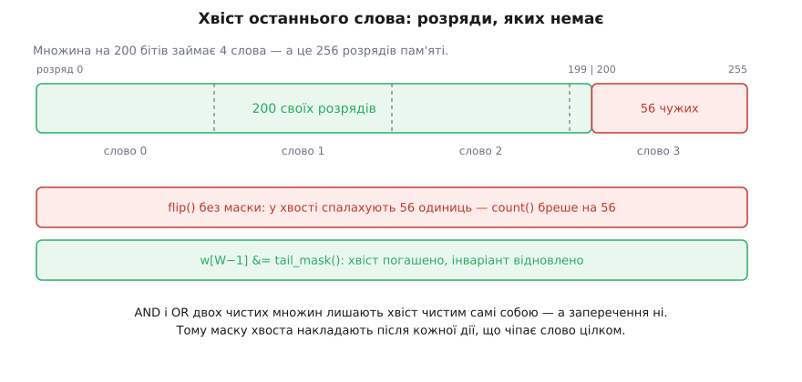
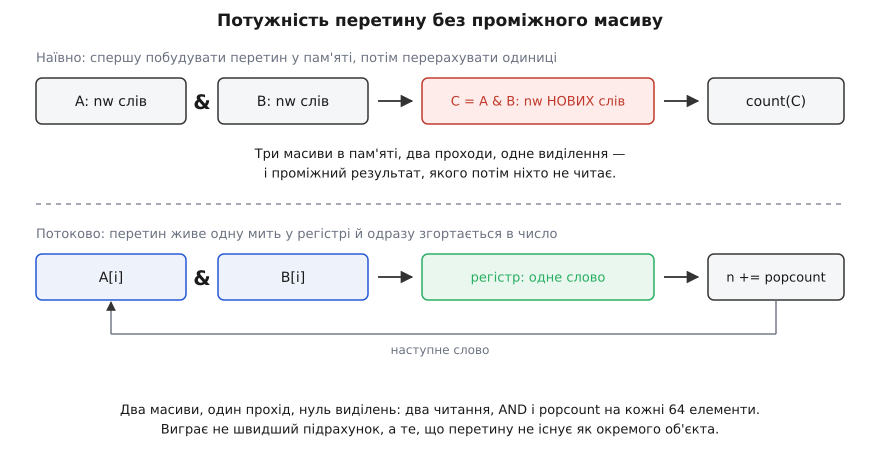

# ⚙️ Бітова множина з рангом: робочий код

Тут зібрано працездатну бітову множину сталого розміру — потужність, потужність перетину без проміжного масиву й **ранг**, що перетворює номер розряду на індекс у щільному масиві, — разом із переносною обгорткою підрахунку одиниць, перевіркою дизасемблером і вимірюванням. Цінність не в самому підрахунку: команда, що рахує одиниці, і так дешева. Цінність у тому, що навколо неї доводиться вибудувати, щоб дешевизна дійшла до програми, а не загубилася на виклику бібліотечної функції, на зайвому масиві в пам'яті чи на ланцюжку залежностей, який ріже темп утричі.

## Задача

Множина цілих із відомого наперед діапазону: від кількох сотень елементів (позиції на дошці, прапорці стану) до кількох мільйонів (стовпчиковий індекс у базі, множина ідентифікаторів у пошуку). [Бітова множина](book:programming/bitset) подає її як масив слів: елемент *i* присутній ⟺ у слові *i*/64 запалено розряд *i* mod 64.

Від реалізації потрібні чотири дії:

- `add`, `has` — покласти елемент, перевірити наявність;
- `count` — потужність множини;
- `intersection_count` — потужність перетину **без** побудови самого перетину;
- `rank(i)` — скільки елементів множини строго менші за *i*; саме це число править за адресу в щільному масиві.

Обмежень теж чотири: жодних виділень пам'яті на гарячому шляху; переносність між GCC, Clang і MSVC; працездатність на процесорі **без** апаратної команди підрахунку; і можливість виміряти, що з цього вийшло.

Мова тут визначена задачею однозначно: усе відбувається на рівні слів і розрядів, кожна операція — кілька машинних команд, і будь-яка обгортка, що коштує виклику, з'їдає весь сенс. Ядро пишемо на C, щоб його можна було включити й у драйвер, і в прошивку; тонкий шар типізації — на C++.

## Одна функція, четверо дверей

Усе спирається на одну примітивну операцію, і перше, що треба зробити, — заховати її переносність в одному місці:

```c
/* pc64.h — скільки одиниць у 64-бітному слові */
#ifndef PC64_H
#define PC64_H
#include <stdint.h>

static inline int pc64_swar(uint64_t x) {
    x = x - ((x >> 1) & 0x5555555555555555ULL);
    x = (x & 0x3333333333333333ULL) + ((x >> 2) & 0x3333333333333333ULL);
    x = (x + (x >> 4)) & 0x0F0F0F0F0F0F0F0FULL;
    return (int)((x * 0x0101010101010101ULL) >> 56);
}

#if defined(__cplusplus) && __cplusplus >= 202002L
#  include <version>          /* саме тут оголошено __cpp_lib_bitops */
#endif

#if defined(__cpp_lib_bitops)
#  include <bit>
   static inline int pc64(uint64_t x) { return std::popcount(x); }
#elif defined(__GNUC__)                       /* GCC і Clang */
   static inline int pc64(uint64_t x) { return __builtin_popcountll(x); }
#elif defined(_MSC_VER) && defined(_M_X64)
#  include <intrin.h>
   static inline int pc64(uint64_t x) { return (int)__popcnt64(x); }
#else
   static inline int pc64(uint64_t x) { return pc64_swar(x); }
#endif

#endif
```

У кожних із цих дверей своя підступність, і всі чотири варто знати наперед.

**`std::popcount`** живе в заголовку `<bit>` починаючи з C++20, і його наявність оголошує макрос `__cpp_lib_bitops` зі значенням `201907L`. Але сам цей макрос оголошено в `<version>` — перевіряти його, не підключивши `<version>` або `<bit>`, безглуздо: він завжди буде невизначений, і ви тихо провалитеся в наступну гілку. Друга особливість корисна: `std::popcount` приймає **лише беззнакові** типи. `std::popcount(-1)` не скомпілюється — і це добре, бо змушує вирішити питання знаку там, де воно виникло, а не отримати відповідь для розширеного знаком слова.

**`__builtin_popcountll`** — не команда процесора, а зобов'язання компілятора дати правильну відповідь. На x86-64 без прапорця `-mpopcnt` (або `-march=`, який його вмикає) GCC чесно згенерує **виклик** бібліотечної функції `__popcountdi2` з libgcc: команда `POPCNT` є не в кожному x86-64, а код мусить запуститися скрізь. Виклик на гарячому шляху коштує дорожче за дванадцять команд SWAR, тобто «оптимізація» обертається сповільненням.

**`__popcnt64`** у MSVC поводиться навпаки: він **завжди** розгортається в машинну команду, бо в MSVC немає прапорця цільового набору для неї. Це єдині двері, які можуть не відчинитися взагалі — на процесорі без відповідного розширення програма впаде на недійсній команді. Тому шлях MSVC або обмежують заздалегідь відомим залізом, або прикривають перевіркою в рантаймі (нижче).

**SWAR** унизу — підлога, нижче за яку впасти нема куди: дванадцять команд, жодної гілки, час не залежить від даних, працює на будь-якій машині з 64-бітним множенням.

Мовам, чия стандартна бібліотека складалася пізніше, тут пощастило більше: у Rust підрахунок — метод типу (`u64::count_ones()`), у Go — функція стандартної бібліотеки (`math/bits.OnesCount64`), і компілятор Go на amd64 підставляє машинну команду сам, за замовчуванням з перевіркою підтримки в рантаймі, а на рівні `GOAMD64=v2` і вище — уже без перевірки. У C++ цю роботу доводиться робити руками, і саме тому вона варта окремого заголовка.

## Каркас: слово, розряд і хвіст

```c
/* bitset64.h — множина сталого розміру поверх масиву слів */
#ifndef BITSET64_H
#define BITSET64_H
#include <stddef.h>
#include "pc64.h"

#define BS_WORDS(n)  (((n) + 63u) / 64u)

static inline void bs_add(uint64_t *w, size_t i) { w[i >> 6] |=  (uint64_t)1 << (i & 63); }
static inline void bs_del(uint64_t *w, size_t i) { w[i >> 6] &= ~((uint64_t)1 << (i & 63)); }
static inline int  bs_has(const uint64_t *w, size_t i) {
    return (int)((w[i >> 6] >> (i & 63)) & 1u);
}
```

`i >> 6` — номер слова, `i & 63` — номер розряду в ньому. Ділення й остача написалися б так само зрозуміло, і для беззнакового `i` компілятор згенерував би той самий зсув — але тільки для беззнакового. Варто `i` стати `int`, і компілятор мусить урахувати від'ємні значення (де `/` і `%` округлюють до нуля), а це вже дві-три зайві команди на кожен доступ. Тому індекс тут `size_t`, і не з педантизму.

Головне ж у виразі `i & 63` інше: він **за побудовою** тримає лічильник зсуву в межах 0…63. Зсув на всю ширину типу чи більше — [невизначена поведінка](book:programming/undefined-behavior) в C і C++: стандарт не обіцяє нічого, а конкретне залізо поводиться підступно. Команда зсуву x86 бере лічильник за модулем 64, тож `1ULL << 64` дасть **1**, а не 0 — програма не впаде, а тихо порахує не те. Такі помилки не ловляться тестом на випадкових даних; вони ловляться тим, що лічильник зсуву неможливо зробити завеликим.

Є ще одне, чого вимагає подання множини масивом слів, — **інваріант хвоста**. Множина на 200 бітів займає чотири слова, тобто 256 розрядів пам'яті; 56 із них не належать множині взагалі.


*Хвіст останнього слова. Доки хвостові розряди нульові, `count` рахує правильно. Перетин і об'єднання двох чистих множин лишають хвіст чистим самі собою — а заперечення ні: `~0` запалює всі 56 зайвих розрядів, і потужність підскакує на 56.*

Звідси правило: **кожна дія, що чіпає слово цілком і може запалити розряд, гасить хвіст одразу після себе**.

```c
static inline uint64_t bs_tail_mask(size_t n) {
    unsigned r = (unsigned)(n & 63);
    return r ? (((uint64_t)1 << r) - 1) : ~(uint64_t)0;
}

static inline void bs_flip(uint64_t *w, size_t n) {
    size_t nw = BS_WORDS(n), j;
    for (j = 0; j < nw; ++j) w[j] = ~w[j];
    if (nw) w[nw - 1] &= bs_tail_mask(n);
}
```

Тернарний оператор у `bs_tail_mask` — не перестраховка. Коли `n` кратне 64, хвоста немає, `r` дорівнює нулю, і «природний» запис `(1ULL << (n & 63)) - 1` дав би маску **0** замість повної: останнє слово було б стерте цілком. А в записаному вище вигляді значення для сталого `n` компілятор обчислить ще під час компіляції, тож жодної гілки в машинному коді не лишиться.

## Потужність: чотири акумулятори

Найпростіший цикл підрахунку виглядає бездоганно, а працює втричі повільніше, ніж міг би:

```c
size_t n = 0;
for (size_t j = 0; j < nw; ++j) n += pc64(w[j]);   /* так робити не варто */
```

Команда підрахунку виконується від однієї до чотирьох за такт залежно від ядра, а її **затримка** — від одного такту до трьох. Різниця між цими двома числами й вирішує все: поки додавання складаються в один ланцюг через змінну `n`, кожне наступне чекає на попереднє, і темп задає сума затримок підрахунку й додавання, а не пропускна здатність.


*Один акумулятор зшиває незалежні за суттю підрахунки в один ланцюг. Чотири акумулятори розривають його на чотири незалежні нитки, які [позачергове ядро](book:programming/out-of-order-execution) веде одночасно; фінальне додавання коштує один такт на весь масив.*

```c
static inline size_t bs_count(const uint64_t *w, size_t nw) {
    size_t n0 = 0, n1 = 0, n2 = 0, n3 = 0, i = 0;
    for (; i + 4 <= nw; i += 4) {
        n0 += (size_t)pc64(w[i]);
        n1 += (size_t)pc64(w[i + 1]);
        n2 += (size_t)pc64(w[i + 2]);
        n3 += (size_t)pc64(w[i + 3]);
    }
    for (; i < nw; ++i) n0 += (size_t)pc64(w[i]);
    return n0 + n1 + n2 + n3;
}
```

Чотири акумулятори тут працюють і другим боком. На ядрах Intel від Sandy Bridge і аж до сімейства Skylake включно команда `POPCNT` має **хибну залежність від регістра-приймача**: вона чекає на завершення попереднього запису в той регістр, хоча її результат від нього не залежить. Розкладення підсумку по чотирьох регістрах розводить і цю залежність теж. Виправили її для 32- та 64-бітних форм команди в поколіннях Cannon Lake та Ice Lake — але код, зібраний сьогодні, ще довго працюватиме на машинах, де вона є.

Складність — Θ(W) від кількості слів, тобто Θ(N/64) від кількості можливих елементів, з двома-трьома командами на слово. Жодних гілок, жодної залежності від того, скільки в множині елементів.

## Перетин, якого не існує

Наївна відповідь на питання «скільки спільних елементів у A і B» будує перетин, а тоді рахує в ньому одиниці. Це три масиви в пам'яті, два проходи й одне виділення заради проміжного результату, який більше ніхто не читатиме.


*Наївно й потоково. У другому варіанті перетин існує рівно одну мить — у регістрі, між AND і підрахунком, — і одразу згортається в число.*

```c
static inline size_t bs_and_count(const uint64_t *a, const uint64_t *b, size_t nw) {
    size_t n0 = 0, n1 = 0, n2 = 0, n3 = 0, i = 0;
    for (; i + 4 <= nw; i += 4) {
        n0 += (size_t)pc64(a[i]     & b[i]);
        n1 += (size_t)pc64(a[i + 1] & b[i + 1]);
        n2 += (size_t)pc64(a[i + 2] & b[i + 2]);
        n3 += (size_t)pc64(a[i + 3] & b[i + 3]);
    }
    for (; i < nw; ++i) n0 += (size_t)pc64(a[i] & b[i]);
    return n0 + n1 + n2 + n3;
}
```

Замініть `&` на `|` — дістанете потужність об'єднання, на `^` — [відстань Гемінга](book:math/hamming-bounds) між множинами, тобто розмір їхньої симетричної різниці. Форма циклу та сама, бо суть та сама: **предикат над парою слів згортається в число, не лишаючи по собі об'єкта**.

> 🔧 **Навіщо це.** Потокова форма виграє не швидшим підрахунком — підрахунок в обох варіантах однаковий. Вона виграє тим, що прибирає з картини цілий масив: зникає виділення пам'яті, зникає другий прохід, зникає витіснення корисних даних із [кеша](book:programming/cache) проміжним результатом. На великих множинах ця арифметика вирішує все: обидва варіанти впираються в пам'ять, але потоковий возить через неї два масиви, а наївний — щонайменше чотири (два прочитати, третій записати й перечитати). Питання «а чи потрібен мені проміжний результат як окремий об'єкт» варте того, щоб ставити його щоразу, коли в коді з'являється тимчасовий контейнер.

## Ранг: від розряду до слота

Ранг — це кількість елементів множини, строго менших за задане число. Одним рядком це `popcount(слово & маска нижчих розрядів)`, але щойно множина займає більше за одне слово, рядок обростає деталями, у яких і ховаються обидві помилки:

```c
static inline size_t bs_rank(const uint64_t *w, size_t i) {
    size_t k = i >> 6, r = 0, j;
    unsigned b = (unsigned)(i & 63);
    for (j = 0; j < k; ++j) r += (size_t)pc64(w[j]);
    if (b) r += (size_t)pc64(w[k] & (((uint64_t)1 << b) - 1));
    return r;
}
```

Перша помилка — написати маску від **глобального** індексу: `(1ULL << i) - 1`. Для `i` меншого за 64 це працює, тест на маленькій множині проходить, а далі починається та сама невизначена поведінка зі зсувом, що вище: на x86 лічильник візьметься за модулем 64, і ранг мовчки порахується від залишку. Тут зсув робиться лише на `b`, а `b` за побудовою менше за 64.

Друга помилка тонша: `if (b)` — не оптимізація, а перевірка меж. Ранг має сенс і для `i`, рівного розміру множини (тоді він дорівнює її потужності). Якщо розмір кратний 64, то `k` дорівнює кількості слів, і звернення до `w[k]` вилізе за масив. При `b == 0` доповнювати нема чого: усі потрібні слова вже пораховані циклом.

Складність тут Θ(i/64) — лінійна від індексу, і це прийнятно, доки множина вміщається в кілька десятків слів. Коли ранг потрібен на мільйонах бітів, поруч тримають масив часткових сум — по одному числу на блок слів: тоді ранг коштує читання суми плюс кілька підрахунків усередині блоку, а надбавка до пам'яті — кілька відсотків.

Найцікавіше застосування рангу — не запит до множини, а **адресація**. Вузол, у якому можливих позицій 64, а зайнято п'ять, тримають як бітову мапу плюс щільний масив рівно з п'яти значень; ранг перекладає номер позиції в номер комірки. Так влаштований вузол [геш-дерева з бітовими мапами](book:algorithms/hash-array-mapped-trie) і побудовані на ньому незмінні колекції багатьох мов:

```cpp
#include <cassert>
#include <cstdint>
#include <utility>
#include <vector>
#include "pc64.h"

template <class T>
class SparseNode {                     // до 64 логічних позицій
    std::uint64_t map_ = 0;
    std::vector<T> dense_;
public:
    bool has(unsigned i) const {
        assert(i < 64);
        return ((map_ >> i) & 1u) != 0;
    }
    unsigned slot(unsigned i) const {  // скільки зайнятих позицій перед i-ю
        assert(i < 64);
        return (unsigned)pc64(map_ & (((std::uint64_t)1 << i) - 1));
    }
    T *find(unsigned i) { return has(i) ? &dense_[slot(i)] : nullptr; }

    void set(unsigned i, T v) {
        unsigned s = slot(i);
        if (has(i)) { dense_[s] = std::move(v); return; }
        dense_.insert(dense_.begin() + s, std::move(v));
        map_ |= (std::uint64_t)1 << i;
    }
    std::size_t size() const { return dense_.size(); }
};
```

Щільний масив тут — `std::vector` заради стислості запису. У справжньому вузлі його кладуть у той самий блок пам'яті одразу за мапою: три вказівники самого вектора й окреме виділення купи з'їли б помітну частину виграшу, а виграш саме такий:

```
масив на 64 вказівники:        64 · 8 = 512 байтів завжди
мапа + щільний масив на k:      8 + k · 8 байтів

k = 5   →  48 байтів   (у десять разів менше)
k = 64  →  520 байтів  (на 8 байтів більше)
```

Розріджений вузол програє лише тоді, коли він майже повний, а в дереві таких вузлів мало. Ціна пошуку — один AND, один підрахунок, одне індексування, тобто одиниці тактів. Ціна вставки — зсув хвоста щільного масиву, до 63 елементів; на масиві, який гарантовано вміщається в кілька кеш-рядків, це дешевше за будь-яке перевиділення. Саме дешевизна підрахунку робить усю конструкцію осмисленою: якби ранг рахувався циклом по розрядах, виграна пам'ять оберталася б програшем у часі.

## Тонкий шар типів

Ядро навмисно лишилося масивом слів і функціями над ним — таке ядро включається і в прошивку, і в драйвер, де C++ немає. Але в програмі на C++ передавати парою «вказівник плюс кількість слів» незручно й небезпечно, тож зверху лягає обгортка, яка не додає жодної машинної команди:

```cpp
#include <cstddef>
#include <cstdint>
#include "bitset64.h"

template <std::size_t N>
class BitSet {
    static_assert(N > 0, "множина без жодного можливого елемента не має слів");
    static constexpr std::size_t W = BS_WORDS(N);
    std::uint64_t w_[W] = {};
public:
    void add(std::size_t i)               { bs_add(w_, i); }
    void del(std::size_t i)               { bs_del(w_, i); }
    bool has(std::size_t i) const         { return bs_has(w_, i) != 0; }
    void flip()                           { bs_flip(w_, N); }
    std::size_t count() const             { return bs_count(w_, W); }
    std::size_t rank(std::size_t i) const { return bs_rank(w_, i); }

    friend std::size_t intersection_count(const BitSet &a, const BitSet &b) {
        return bs_and_count(a.w_, b.w_, W);
    }
};
```

Кількість слів рахується під час компіляції, масив лежить прямо в об'єкті, тож виділень пам'яті немає взагалі: `BitSet<200>` — це 32 байти на стеку. `intersection_count` оголошено дружньою функцією не з примхи, а тому, що операція **симетрична**: у методі один із двох аргументів був би привілейованим без жодної на те причини. Перевірки меж тут теж немає — індекс за межами `N` зіпсує пам'ять поруч; `assert(i < N)` живе лише в налагоджувальному збиранні, у випущеному зникає безслідно й ловить рівно ті помилки, які інакше виявляться далеко від місця злочину.

## П'ять хвилин із дизасемблером

Усе написане вище спирається на припущення, що `pc64` — це одна команда. Припущення треба перевірити, і перевірка коштує кількох секунд:

```
g++ -O2 -std=c++20 -c bitset64.cpp -o bitset64.o
objdump -d bitset64.o | grep -c popcnt          # скільки команд підрахунку
objdump -d bitset64.o | grep 'call.*popcount'   # чи є виклик бібліотеки
```

Нуль у першому рядку й `call ... <__popcountdi2>` у другому означають, що жодного прискорення не сталося. Лікується прапорцем: `-mpopcnt` вмикає саму команду, `-march=x86-64-v2` вмикає цілий рівень набору (сюди входять POPCNT і SSE4.2 — приблизно те, що вміє процесор 2009 року), `-march=native` збирає під ту машину, на якій компілюєте. На ARM шукати треба інші мнемоніки: `cnt` для векторного підрахунку по байтах і `addv` для горизонтального додавання цих байтів у одне число.

## Коли залізо невідоме заздалегідь

Якщо збирається один двійковий файл на різні машини, вибір роблять у рантаймі. GCC і Clang уміють зробити це самі:

```c
__attribute__((target_clones("popcnt", "default")))
size_t bs_count_dispatch(const uint64_t *w, size_t nw) { return bs_count(w, nw); }
```

Компілятор породить дві версії функції й підставить потрібну під час завантаження програми — через механізм непрямих функцій динамічного завантажувача (GNU/Linux із glibc). Де такого механізму немає, лишається ручний варіант: `__builtin_cpu_supports("popcnt")` один раз на старті, результат — у вказівник на функцію. Ціна — один непрямий виклик на **весь масив**, а не на слово, тож перевірку варто робити на рівні циклу, а не всередині нього.

## Вимірювання

Тепер найцікавіше: наскільки апаратна команда справді швидша за SWAR. Питання має сенс лише разом із розміром масиву, і вимірювання це показує краще за будь-які міркування.

```cpp
#include <chrono>
#include <cstdint>
#include <cstdio>
#include <random>
#include <vector>

std::size_t count_hw(const std::uint64_t *w, std::size_t nw);    // окрема одиниця трансляції
std::size_t count_swar(const std::uint64_t *w, std::size_t nw);  // окрема одиниця трансляції

template <class F>
double ns_per_word(F f, const std::uint64_t *w, std::size_t nw, std::size_t &sink) {
    sink += f(w, nw);                                 // прогрів: сторінки й кеш
    std::size_t reps = (std::size_t{1} << 26) / nw;   // однаковий обсяг роботи на всіх розмірах
    if (reps == 0) reps = 1;
    auto t0 = std::chrono::steady_clock::now();
    for (std::size_t r = 0; r < reps; ++r) sink += f(w, nw);
    auto t1 = std::chrono::steady_clock::now();
    double sec = std::chrono::duration<double>(t1 - t0).count();
    return sec * 1e9 / (double)reps / (double)nw;
}

int main() {
    std::mt19937_64 rng(1);
    std::size_t sink = 0;
    std::printf("%8s %12s %12s %10s\n", "КіБ", "апарат", "SWAR", "ГБ/с");
    for (std::size_t kib = 4; kib <= (1u << 18); kib *= 4) {   // 4 КіБ … 256 МіБ
        std::vector<std::uint64_t> v(kib * 1024 / 8);
        for (auto &x : v) x = rng();
        double a = ns_per_word(count_hw,   v.data(), v.size(), sink);
        double b = ns_per_word(count_swar, v.data(), v.size(), sink);
        std::printf("%8zu %12.3f %12.3f %10.1f\n", kib, a, b, 8.0 / a);
    }
    std::printf("контрольна сума: %zu\n", sink);   // без цього рядка цикли зникнуть
}
```

Збирають це з **окремим** прапорцем для кожної одиниці трансляції, і другий рядок тут — найважливіший у всьому вимірюванні:

```
g++ -O2 -std=c++20 -march=x86-64-v2 -c count_hw.cpp   -o count_hw.o
g++ -O2 -std=c++20 -march=x86-64    -c count_swar.cpp -o count_swar.o
g++ -O2 -std=c++20 bench.cpp count_hw.o count_swar.o  -o bench

objdump -d count_hw.o   | grep -c popcnt      # має бути більше за нуль
objdump -d count_swar.o | grep -c popcnt      # має бути нуль
```

Пастка тут не в прапорцях, а в тому, що [компілятор оптимізує](book:programming/compiler-optimizations) розумніше, ніж очікує вимірювач. LLVM уміє **впізнати** дванадцятикомандну послідовність SWAR як підрахунок одиниць і замінити її на машинну команду; так само обидва компілятори впізнають цикл `while (x) { x &= x - 1; n++; }`. Зберіть «еталонний» SWAR із `-march=native` — і виміряєте ту саму апаратну команду двічі, отримавши втішний висновок, що SWAR не поступається залізу. Два рядки `objdump` вище — єдиний спосіб це помітити.

Друга пастка — сама програма вимірювання. Якщо результат нікуди не подіти, компілятор має повне право викинути цикл разом із роботою; накопичення в `sink` і друк наприкінці цьому запобігають. Час беруть із `steady_clock`, а не з системного годинника: [монотонний годинник](book:programming/monotonic-vs-wall-time) не стрибне посеред заміру від синхронізації часу. Масив заповнюють і читають один раз до заміру, інакше в перший прохід потраплять помилки сторінок. І порівнювати між розмірами можна лише нормовані числа — наносекунди на слово, а не на прохід.

Чого чекати від результату — варто прикинути **до** запуску, щоб побачити, чи вимірюєте ви те, що думаєте:

```
Оцінка для ядра 3 ГГц; слово — 8 байтів.

  апаратна команда:  ~1 такт/слово   → 0.33 нс/слово → 24 ГБ/с
  SWAR (12 команд):  ~3 такти/слово  → 1.00 нс/слово →  8 ГБ/с
  пам'ять, 1 потік:  ~12 ГБ/с        → 0.67 нс/слово

  масив у L1  (десятки КіБ):  0.33 проти 1.00 — різниця втричі
  масив у RAM (сотні МіБ):    0.67 проти 1.00 — різниця в півтора рази
```

Форма цієї таблиці стійка, конкретні числа — ні: вони залежать від частоти, ширини ядра й пропускної здатності пам'яті вашої машини. Але висновок із форми той самий скрізь. **Доки дані в кеші, ви вимірюєте арифметику; щойно масив переріс останній рівень кеша, ви вимірюєте пам'ять**, і різниця між реалізаціями підрахунку тане — не тому, що SWAR порозумнішав, а тому, що обидва чекають на дані. Тому й міряти треба на тому розмірі, який має ваше справжнє навантаження: результат, отриманий на масиві в 4 КіБ, нічого не скаже про індекс на 400 МіБ, і навпаки.

Там, де масиви справді великі, наступний крок лежить не в бік хитрішого скалярного коду, а в бік [векторних розширень](book:programming/simd-vectorization): ширші регістри забирають більше байтів за такт, і саме це, а не спосіб рахувати одиниці, впирається в стелю.

Через увесь цей файл проходить одна закономірність, варта того, щоб її назвати. Жодного разу виграш не прийшов від того, що одиниці порахувалися швидше. Він приходив від того, що зник проміжний масив; від того, що розірвався ланцюг залежностей; від того, що замість шістдесяти чотирьох комірок лишилося п'ять. Команда підрахунку дешева — і саме її дешевизна робить видимим усе інше.
