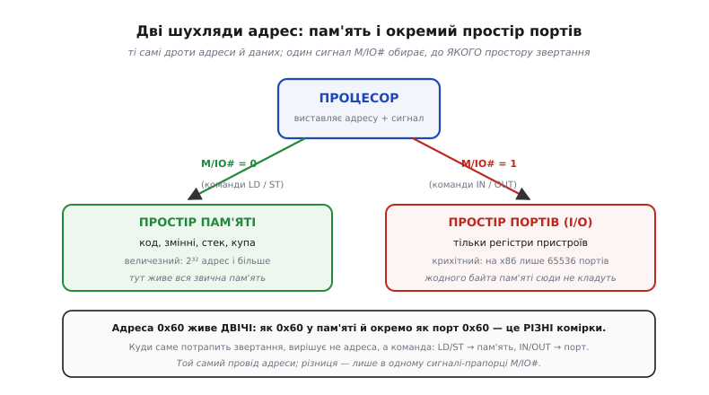
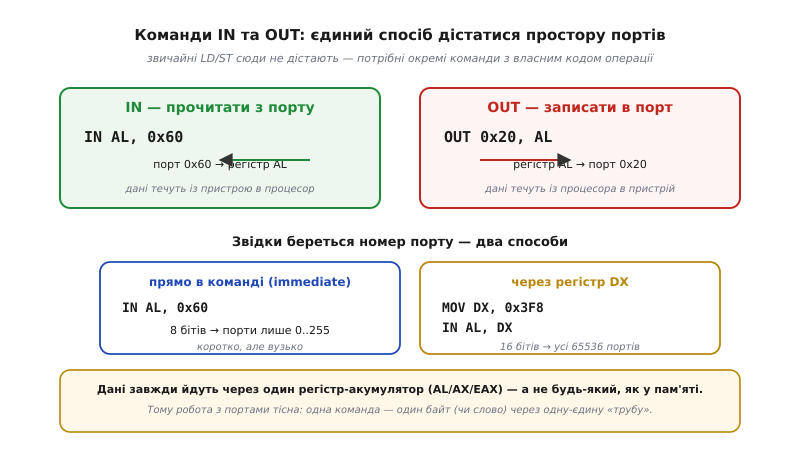
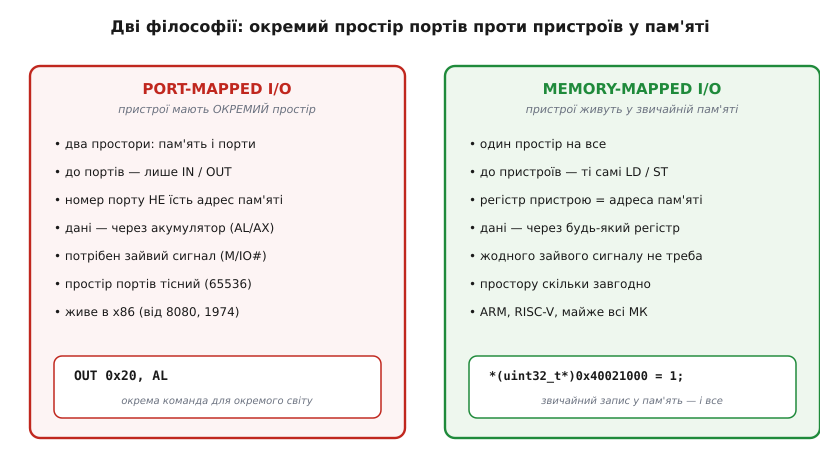

# Port-mapped IO (IN/OUT)

Процесор уміє напрочуд мало різних дій — і майже всі вони зводяться до одного: **прочитати число за адресою** й **записати число за адресою**. Команди `LD` (англ. *load* — «завантажити») та `ST` (*store* — «зберегти») возять числа між регістрами й пам'яттю, і цього, здавалося б, досить на все. Але є речі, яких у «пам'яті» немає: кнопка, що натиснута просто зараз; байт, який щойно прийшов дротом; ніжка, на якій треба виставити напругу. Це не числа, що спокійно лежать у комірках, — це **пристрої**, живий зовнішній світ. Питання, з якого починається ця стаття, просте й глибоке: **як процесор дотягується до пристроїв, якщо все, що він уміє, — це читати й писати за адресами?**

Одна відповідь — [покласти пристрої в ту саму пам'ять](topic:programming/memory-mapped-io): віддати кожному регістру пристрою адресу, і тоді той самий `ST` за «адресою» насправді смикає ніжку. Але історично першою й досі живою в одному великому сімействі процесорів була **інша** відповідь: дати процесору **другі двері** — окремий, зовсім не-пам'ятний простір адрес, у який ведуть **власні команди**. Ці команди звуться `IN` та `OUT`, а сам підхід — **port-mapped I/O** (англ. *port* — «порт, ворота»; *I/O*, від *input/output* — «ввід/вивід»), тобто «ввід-вивід через порти». Розберімо, що це за другий простір, чому він узагалі з'явився, як виглядають ті команди в коді — і чому більшість сучасних процесорів від нього тихо відмовилися.

### Друга адресна шухляда

Уявімо адресу як номер комірки в одній величезній шафі. Звична пам'ять — це і є та шафа: код, змінні, стек, купа — усе має свій номер, і `LD`/`ST` дістають потрібну шухлядку за номером. Port-mapped I/O додає **другу шафу**, поряд із першою. У неї теж є номери комірок — їх звуть **портами** — але це **інший** набір адрес, ніяк не пов'язаний із пам'яттю. Порт 0x60 і комірка пам'яті 0x60 — це **дві різні** речі, як квартира №5 на вулиці Такій і квартира №5 на вулиці Іншій: номер той самий, будинки різні.


*Процесор виставляє адресу тими самими дротами, але додає один сигнал — **M/IO#** (англ. *Memory / Input-Output*), прапорець «до пам'яті чи до портів». M/IO# = 0 — звертання йде в **простір пам'яті** (величезний: 2³² адрес і більше), і його породжують команди `LD`/`ST`. M/IO# = 1 — те саме звертання йде в **простір портів** (на x86 крихітний: усього 65536 адрес), і його породжують `IN`/`OUT`. Адреса 0x60 існує в обох просторах як дві незалежні комірки; куди потрапить звертання, вирішує не адреса, а сам сигнал.*

Ось найважливіша думка, і вона тонка: **процесор не має двох окремих наборів дротів** для двох шаф. Дроти адреси й даних — ті самі. Розрізняє шафи **один-єдиний додатковий сигнал** — на x86 його історично звуть M/IO# (риска в кінці означає «активний нулем», але суть проста: 0 — пам'ять, 1 — порти). Коли процесор виконує `ST`, він виставляє адресу й опускає M/IO# у стан «пам'ять»; коли виконує `OUT` — виставляє ту саму адресу, але піднімає M/IO# у стан «порти». Мікросхеми пам'яті слухають шину **лише** коли сигнал каже «пам'ять»; контролери пристроїв — **лише** коли він каже «порти». Так одна фізична шина обслуговує два цілком незалежні простори адрес.

> 🔧 **Навіщо це.** Коли ви побачите в документації до старого залізного контролера напис на кшталт «клавіатура — порт 0x60, таймер — порти 0x40–0x43», знайте: це адреси **не в пам'яті**. Спроба прочитати їх звичайним покажчиком у C (`*(char*)0x60`) дасть вам вміст **комірки пам'яті** 0x60 — зовсім не те, чого ви хотіли. До простору портів веде тільки `IN`/`OUT`, і в C це доступно лише через спеціальні функції-обгортки (наприклад, `inb`/`outb`) чи асемблерну вставку. Це перша практична пастка port-mapped I/O: два простори з однаковими номерами, і переплутати їх дуже легко.

### Команди IN та OUT

Якщо простір портів окремий, то й дістатися до нього звичайними командами не можна — потрібні **свої**. Їх рівно дві, і вони дзеркальні: `IN` читає з порту в процесор, `OUT` пише з процесора в порт.


*`IN AL, 0x60` — «прочитати байт із порту 0x60 в регістр AL»; дані течуть із пристрою в процесор. `OUT 0x20, AL` — «записати байт із AL у порт 0x20»; дані течуть у зворотний бік. Номер порту задають одним із двох способів: **прямо в команді** (тоді він 8-бітний — лише порти 0..255, зате команда коротка) або **через регістр DX** (тоді повні 16 бітів — усі 65536 портів). Дані завжди проходять через один регістр-акумулятор (AL для байта, AX для слова), а не через будь-який.*

Придивімося до цих двох особливостей — вони не примха, а прямий слід того, як ця схема народилася. По-перше, **номер порту може жити прямо в тілі команди**, і тоді на нього відведено лише 8 бітів. Це означає, що коротка форма `IN AL, 0x60` дістає лише перші 256 портів. Щоб дотягтися далі, номер спершу кладуть у регістр DX і пишуть `IN AL, DX` — DX 16-бітний, тож так адресуються всі 65536. По-друге, **дані завжди йдуть через акумулятор** — регістр AL/AX/EAX, і ніякий інший. У пам'яті ви можете завантажити число в будь-який регістр; у порт — тільки через цю одну «трубу».

Обидва обмеження — луна тісноти перших процесорів, де кожен біт кодування був на вагу золота. Порт як 8-бітне число вміщалося в компактну команду; єдиний акумулятор спрощував кремній декодера. Ця історія — від однокристального `IOT`-опкоду [PDP-8](topic:programming/port-mapped-io/hist-io-instructions.md) до 256 портів Intel 8080 і врешті до x86 — пояснює, чому команди `IN`/`OUT` саме такі вузькі й чому їх узагалі вигадали окремо від пам'яті.

Ось як реальна ініціалізація давнього послідовного порту (COM1, база 0x3F8) виглядає C-кодом із функціями-обгортками `outb`/`inb`, що під капотом виконують саме `OUT`/`IN`:

```c
// COM1 — класичний UART 16550 у просторі портів x86, база 0x3F8.
#define COM1 0x3F8

outb(COM1 + 1, 0x00);      // OUT: вимкнути переривання приймача
outb(COM1 + 3, 0x80);      // OUT: відкрити доступ до дільника швидкості (DLAB=1)
outb(COM1 + 0, 0x03);      // OUT: молодший байт дільника → 38400 бод
outb(COM1 + 1, 0x00);      // OUT: старший байт дільника
outb(COM1 + 3, 0x03);      // OUT: 8 біт даних, без парності, DLAB=0

uint8_t status = inb(COM1 + 5);  // IN: прочитати регістр стану лінії
```

Кожен рядок — це під капотом одна команда `OUT` чи `IN` до окремого простору портів. `outb(порт, значення)` кладе значення в акумулятор і виконує `OUT`; `inb(порт)` виконує `IN` і повертає прочитаний акумулятор. Зверніть увагу: `COM1 + 1`, `COM1 + 3` — це **номери сусідніх портів**, а не сусідніх байтів пам'яті. Ту саму логіку (набір регістрів пристрою з послідовними адресами) memory-mapped I/O виражає звичайними покажчиками; тут же для неї є окремий, паралельний до пам'яті світ адрес.

### Чому взагалі два простори

Найприродніше запитати: навіщо городити другий простір адрес і другий набір команд, якщо пристрої можна просто покласти в пам'ять? Відповідь має два боки — історичний і технічний, і обидва варто побачити чесно.

Технічний бік такий. У перших мікропроцесорів адрес було **мало** — Intel 8080 мав 16-бітну адресу, тобто лише 65536 комірок пам'яті всього. Якби пристрої довелося класти в цю саму пам'ять, кожен регістр пристрою **відкушував** би адресу від і так крихітного простору, доступного програмі. Окремий простір портів розв'язував це елегантно: пристрої отримували **власні** 256 адрес, і **жодної** комірки пам'яті на них не витрачалося. Був і бонус для схемотехніки: сигнал M/IO# заздалегідь казав, пам'ять це чи пристрій, тож дешифратори адрес пристроїв могли бути простішими — їм не треба було стерегти, щоб не перекрити діапазон пам'яті.

Історичний бік іще простіший: **так повелося**. Ідея окремих I/O-команд прийшла з мінікомп'ютерів (у [PDP-8](topic:programming/port-mapped-io/hist-io-instructions.md) був єдиний опкод `IOT`, що запускав ввід-вивід), Intel 8080 переніс її на мікросхему у вигляді `IN`/`OUT` із 256 портами, а x86, зобов'язаний зберігати сумісність зі своїми предками, тягне цей простір портів донині — уже маючи мільярди адрес пам'яті, де все це давно могло б жити. Це класичний приклад того, як [ISA — сталий контракт](topic:programming/isa): рішення, доречне 1974 року на 8-бітному кристалі, лишається в наборі команд десятиліттями після того, як його первісна причина зникла.

> 🔧 **Навіщо це.** Розуміння «чому два простори» рятує від хибного висновку, ніби port-mapped I/O — це щось передове чи швидше. Навпаки: це старе рішення під стару проблему (брак адрес). Коли адрес стало багато, потреба відпала — і саме тому нові архітектури його не повторюють. Якщо ви бачите окремий простір портів, це майже завжди означає одне: перед вами процесор із родоводом, що тягнеться до 1970-х. Знання цього контексту допомагає не шукати переваг там, де є лише історична інерція.

### Ціна другого простору

За окремий простір портів платять — і корисно побачити чим, бо саме ця ціна вирішила долю підходу. Проблема не в тому, що port-mapped I/O працює погано; він працює справно. Проблема в тому, що він **незручний і бідніший** за альтернативу, і ця бідність накопичується.

Найперше — **до портів застосовна лише жменя команд**. У пам'яті процесор уміє не тільки читати й писати: він може додати число прямо до комірки, порівняти комірку з константою, зсунути біти в ній — десятки команд працюють із пам'яттю напряму. До порту ж веде **тільки** `IN` та `OUT`. Хочете збільшити значення в регістрі пристрою на одиницю — не можна одною командою; доведеться: `IN` у акумулятор, додати, `OUT` назад. Три команди там, де для пам'яті вистачило б однієї. Дані течуть через **єдиний** акумулятор, вузьким горлечком.

Далі — **простір портів тісний і кострубатий**. На x86 це 65536 адрес — мізер поряд із мільярдами адрес пам'яті. Історично ці порти роздавали хаотично (клавіатура тут, таймер там, диск ще десь), простір **фрагментувався**, і навести в ньому лад важко. А ще окремі I/O-команди погано лягають на все, що процесор навчився робити з пам'яттю: [кеш](topic:programming/memory-mapped-io), захист доступу, віртуальні адреси — усе це побудовано навколо звертань до пам'яті, а порти лишаються осторонь цих механізмів, як окремий, менш доглянутий двір.

Підсумок цієї ціни: port-mapped I/O вимагає **зайвого сигналу** на шині, **окремих команд** у наборі, дає **бідніший** доступ (лише читати/писати, лише через акумулятор) і **тісний** простір адрес — і все це заради економії, яка давно втратила сенс.

### Чому сучасні процесори його не мають

Тут сходяться всі нитки. Щойно адрес у процесора стало **вдосталь** (32 біти — це вже понад 4 мільярди комірок), уся первісна вигода окремого простору портів **випарувалася**: місця під пристрої в звичайній пам'яті тепер скільки завгодно. А ціна — зайвий сигнал, окремі команди, бідний доступ — лишилася. Тож розробники нових наборів команд зробили очевидне: **викинули** другий простір узагалі.


*Ліворуч — port-mapped I/O: пристрої мають окремий простір, до якого веде лише `IN`/`OUT`, з усіма супутніми обмеженнями (акумулятор, тісні 65536 адрес, зайвий сигнал M/IO#). Праворуч — memory-mapped I/O: пристрої живуть у звичайній пам'яті, доступні тими самими `LD`/`ST` (у C — звичайним записом за адресою), без окремих команд і без стелі на кількість адрес. Перше — спадок x86 від Intel 8080 (1974); друге — вибір ARM, RISC-V і майже всіх мікроконтролерів.*

Тому **ARM, RISC-V, MIPS** та практично всі сучасні мікроконтролери (STM32, ESP32, AVR) **не мають** окремого простору портів **зовсім**. У них є **один** простір адрес на все, і кожен [регістр периферії — це просто адреса](topic:programming/memory-mapped-io) в ньому, до якої дістаються звичайними `LD`/`ST`. Ніяких `IN`/`OUT` у їхньому наборі команд немає — і не бракує: усе, що робив port-mapped I/O, memory-mapped I/O робить простіше й гнучкіше. Коли ви пишете прошивку під [мікроконтролер](topic:programming/mcu-blocks) і смикаєте ніжку записом у регістр за адресою — ви користуєтеся саме цим, єдиним простором.

Виходить чіткий поділ світу. **x86** (ПК, ноутбуки) тягне обидва механізми: і сучасний memory-mapped, і історичний простір портів із `IN`/`OUT` — заради сумісності з предками. **Усі решта** — від крихітного AVR в Arduino до серверного ARM — знають лише один простір і живуть без окремих I/O-команд. Port-mapped I/O — не помилка й не архаїзм, який «неправильно зробили»; це розумне рішення своєї епохи, яке чесно віджило своє й лишилося тільки там, де його тримає **сумісність**, а не потреба.

> 🔧 **Навіщо це.** Практичний висновок для розробника прямий. Якщо ви програмуєте мікроконтролер (а це основна маса вбудованих систем) — забудьте про `IN`/`OUT`: їх там просто немає, увесь ввід-вивід іде через звичайні адреси пам'яті. `IN`/`OUT` зустрінуться вам майже виключно на x86 — у драйверах під ПК, у коді операційної системи, у роботі з давнім залізом (старі таймери, клавіатурний контролер, деякі шини). Тримайте в голові головну відмінність: **на МК регістр пристрою — це адреса пам'яті; на x86 він може бути ще й портом в окремому просторі, куди дістає лише окрема команда.** Переплутати ці два світи — типова помилка, коли переносиш звички з ПК на мікроконтролер або навпаки.

---

Коротко про головне. Процесор дотягується до зовнішнього світу двома способами, і **port-mapped I/O** — перший із них історично: він дає процесору **другий, окремий від пам'яті простір адрес** — простір **портів**, — куди ведуть **власні команди** `IN` (прочитати з порту) та `OUT` (записати в порт). Розрізняє два простори **один сигнал на шині** (на x86 — M/IO#): та сама адреса за ним потрапляє або в пам'ять, або в порт. Номер порту буває 8-бітний (прямо в команді, порти 0..255) або 16-бітний (через регістр DX, усі 65536), а дані завжди йдуть через **акумулятор**. Народився цей підхід від тісноти адрес у ранніх процесорів (PDP-8, Intel 8080, 1974) і дожив у **x86** лише завдяки [сумісності ISA](topic:programming/isa). Ціна його — зайвий сигнал, окремі бідні команди (лише читати/писати, лише через один регістр) і тісний фрагментований простір. Щойно адрес стало вдосталь, вигода зникла, а ціна лишилася — тому **ARM, RISC-V і майже всі мікроконтролери** відмовилися від нього зовсім і мають **один** простір, де [пристрої живуть у пам'яті](topic:programming/memory-mapped-io) й доступні звичайними `LD`/`ST`.

---
