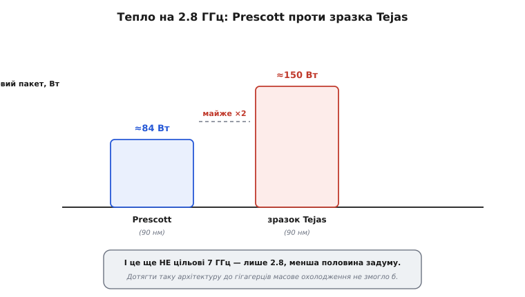

# 📜 Сьоме травня 2004-го: день, коли гонитву за гігагерцами скасували

Є дати, після яких галузь виглядає інакше, — і при цьому в жоден підручник вони не потрапляють як «переломні», бо назовні нічого не вибухнуло. Не було ні краху, ні гучного банкрутства. Просто одного дня одна компанія тихо викреслила зі своїх планів два процесори — і цим фактично оголосила, що двадцятирічна гонитва за тактовою частотою скінчилася. Це сталося **7 травня 2004 року**, коли Intel скасувала проєкти **Tejas** і **Jayhawk**.

Щоб зрозуміти, чому це був удар об стіну, а не звичайне перетасування планів, треба спершу побачити, у що саме врізалися, — і чому за цим врізанням стояла не помилка окремих інженерів, а фізика, яку до того тридцять років вдавалося не помічати.

## Ставка на глибокий конвеєр: у що вірила NetBurst

Наприкінці 1990-х Intel зробила велику стратегічну ставку. Архітектуру, що лягла в основу процесорів Pentium 4, назвали **NetBurst**, і побудована вона була довкола однієї сміливої ідеї: **гнати тактову частоту так високо, як тільки можна**.

Ідея спиралася на конвеєр (*pipeline*) — спосіб, у який процесор обробляє інструкції. Уявіть складання авто на конвеєрі: замість того, щоб одна бригада збирала машину цілком, роботу ділять на багато дрібних кроків, і на кожному кроці стоїть окремий робітник. Що дрібніший крок, то швидше кожен робітник його виконує — і то частіше можна пускати новий кузов у чергу. У процесорі роль «кроку конвеєра» грає одна стадія, а роль «частоти запуску нових кузовів» — тактова частота. Логіка проста й спокуслива: **поділи роботу на дрібніші стадії — і зможеш підняти частоту**, бо на кожній стадії треба встигнути менше.

NetBurst довела цю логіку до краю. Перші ядра Pentium 4 (кодова назва Willamette, а тоді Northwood) мали конвеєр на **20 стадій** — уже дуже багато на ті часи. А наступне ядро, Prescott, розтягнуло його до **31 стадії**. Це був майже неймовірно глибокий конвеєр, зроблений з єдиною метою: щоб частота могла дертися вгору.

І Intel не соромилася казати, куди вона цілиться. На запуску Pentium 4 компанія публічно заявляла, що архітектура NetBurst через кілька поколінь техпроцесу дійде до **10 ГГц**. Ця цифра тоді звучала не як фантастика, а як план — адже гонитва частот доти щороку справджувалася.

> 🔧 **Навіщо це.** Глибина конвеєра — не музейна дрібниця, а компроміс, який ви приймаєте щоразу, обираючи процесор чи ядро під прошивку. Глибокий конвеєр гарний, поки код тече рівним потоком; але щойно трапляється **розгалуження**, яке передбачили неправильно, увесь конвеєр треба спорожнити й наповнити знову — а що він глибший, то дорожча кожна така помилка. Ось чому пізніші економні ядра свідомо роблять конвеєр **коротшим**: не заради частоти, а заради того, щоб рідше платити за спорожнення. Розуміти цей компроміс — значить розуміти, чому «більше гігагерц» не завжди означає «швидше».

## Чому взагалі так гналися за частотою

Тут варто на мить спинитися й запитати: а навіщо було так одержимо задирати частоту, коли є й інші способи зробити процесор швидшим?

Причина була наполовину технічна, наполовину ринкова. Технічна половина спиралася на **масштабування Деннарда** — правило, яке тридцять років дарувало щось на позір неможливе: кожне нове покоління транзисторів давало вищу частоту й **те саме тепло**, задарма. Раз частота росте сама собою від зменшення транзисторів, то й будувати архітектуру логічно було так, щоб вона з цієї частоти вичавлювала максимум.

> Механіку цього подарунка — чому пропорційне зниження напруги тримало густину потужності сталою й що саме перестало скорочуватися наприкінці — розписано окремо. Коротко: коли транзистор роблять меншим у k разів і **пропорційно** зменшують напругу живлення, на тій самій площі вміщається у k² разів більше транзисторів, кожен швидший, а сумарне тепло на квадратний міліметр не міняється. Деталі — у [вставці про алгебру масштабування Деннарда](book:programming/power-wall/math-dennard-scaling.md).

Ринкова половина була ще прозаїчніша. Тактова частота — це **одне число**, яке легко надрукувати на коробці. Покупцеві не поясниш за секунду, що таке «інструкцій за такт» чи «глибина конвеєра», а «3 гігагерци проти 2» він розуміє відразу. Частота стала маркетинговою валютою, і гонитва за нею мала цілком комерційний двигун.

Наскільки це спотворювало картину, показує епізод із конкурентом. Процесори AMD працювали на **нижчій** частоті, але за такт встигали більше — тобто на рівних гігагерцах були часто швидші. Щоб покупець не міряв усе самими гігагерцами, AMD запустила кампанію під назвою **«міф про мегагерци»** (*megahertz myth*) і стала маркувати свої чипи не реальною частотою, а «рейтингом продуктивності» — числом, що показувало, якому Pentium 4 цей процесор дорівнює за швидкістю. Уже сам факт, що довелося вигадувати таке маркування, каже: індустрія загнала себе в кут, де **число на коробці відірвалося від реальної швидкості**. (Це усталений факт історії ринку процесорів початку 2000-х.)

## Перше попередження: «PresHot»

Стіна не постала за одну ніч — вона підступала, і перший чіткий сигнал прийшов ще до Tejas, від ядра **Prescott** (це вже згаданий 31-стадійний Pentium 4, що вийшов на початку 2004-го на техпроцесі 90 нанометрів).

Prescott мав стати тріумфом стратегії глибокого конвеєра: довший конвеєр, новий техпроцес — частота мала полетіти вгору. Натомість чип полетів у нагрів. Ентузіасти майже одразу перехрестили його з *Prescott* на **«PresHot»** — гру слів на англійському *hot*, «гарячий». І це не було просто кпином: за оцінками, Prescott виділяв близько **на 40% більше тепла на кожен такт**, ніж попереднє ядро, і став **найгарячішим і найпрожерливішим** одноядерним процесором Intel того часу.

Але найтривожнішою була не сама спека, а **чому** конвеєр не дав очікуваного. Ось цифри, які варто побачити поруч:

```
Willamette → Northwood:  частота зросла на ~70%
Northwood  → Prescott:   частота зросла лише на ~12%
```

Тобто попередній стрибок дав майже подвоєння, а Prescott, попри ще глибший конвеєр і новий техпроцес, видушив жалюгідних дванадцять відсотків — і то ціною нестерпного тепла. Це і є **спадна віддача** глибокого конвеєра в чистому вигляді: стадій додали, а частота майже не поворухнулася, зате тепло підскочило. Стіна вже була тут — просто її ще можна було списати на «невдале ядро».

І тут криється найважливіша частина діагнозу, яку сама Intel визнала пізніше. Компанія **не передбачила**, що на техпроцесі 90 нанометрів і дрібніше різко зросте **струм витоку** транзисторів. Доти витоками можна було нехтувати — динамічне тепло перемикань цілком їх перекривало. Але на 90 нм витік із дрібниці виріс до величини того самого порядку, що й корисне тепло, і додав до нагріву цілий новий доданок, якого стара стратегія просто не враховувала. Prescott був першою жертвою цього нового доданку. (Це усталено — і сама Intel, і незалежні аналітики сходяться, що злам масштабування на 90 нм застав галузь зненацька.)

## Tejas і Jayhawk: чип, названий на честь спеки

На цьому тлі й розроблявся наступник Prescott — процесор під кодовою назвою **Tejas**, зі своїм серверним двійником **Jayhawk** (той мав стати новим Xeon). У пресі Tejas іноді називали майбутнім «Pentium 5».

Кодові назви Intel любить брати від географії, і тут вони особливо промовисті. **Tejas** — це іспанське написання слова з мови народу каддо, *taysha*, що означає «друг» або «союзник»; від нього походить і назва штату **Техас**. А розробляла Tejas переважно інженерна команда Intel в **Остіні, столиці Техасу** (їй допомагала команда з Фолсома, що мала більший досвід у доведенні дизайну до виробництва). Тобто «техаський» процесор робили техаські інженери. **Jayhawk** («джейгок») — теж географія: так називали партизанів-аболіціоністів у Канзасі, а сьогодні це прізвисько й символ штату Канзас. (Походження назв усталене; іронію, що «техаський» чип виявився пекельно гарячим, як і сам штат влітку, любили відзначати оглядачі — це вже фольклор, не факт.)

Плани щодо Tejas були під стать усій стратегії NetBurst — на межі зухвалості. Конвеєр мав розтягнутися до **40–50 стадій** (проти 31 у Prescott). Стартова частота планувалася **7 ГГц і вище**, а на дальшому техпроцесі 65 нм марилися й ті самі **10 ГГц**, обіцяні ще на запуску Pentium 4. Ідея лишалася незмінною: ще глибший конвеєр → ще вища частота.

Реальність перших зразків розбила ці плани об цифру, від якої стигне кров. Ранній зразок Tejas на техпроцесі 90 нм у гнізді LGA 775 показував тепловий пакет близько **150 ват — і то на якихось 2.8 ГГц**. Порівняйте з тим, що вже й так вважали гарячим:

```
Prescott (90 нм) на 2.8 ГГц:   ≈ 84 Вт
Tejas    (90 нм) на 2.8 ГГц:   ≈ 150 Вт   ← майже вдвічі, і це ще НЕ повна частота
```

Вдумайтеся в абсурд ситуації. Це **не** цільові 7 ГГц — це лише 2.8, менша половина задуму, а чип уже їв **майже вдвічі** більше, ніж Prescott на тій самій частоті. Щоб дотягти таку архітектуру до обіцяних гігагерців, знадобилося б охолодження, якого в масовому настільному комп'ютері просто не буває. Стіна потужності перестала бути теоретичною — вона стояла на лабораторному столі у вигляді розжареного зразка.


*На тій самій частоті 2.8 ГГц Prescott укладався в ≈84 Вт, а ранній зразок Tejas видавав ≈150 Вт — і це ще навіть не половина цільових 7 ГГц. Щоб дотягти до задуманого, тепловий пакет полетів би далеко за будь-яке масове охолодження. Саме ця прірва, а не бажання інженерів, і поховала проєкт.*

## Сьоме травня: тихе рішення з гучними наслідками

І ось **7 травня 2004 року** Intel зробила те, що для компанії такого масштабу межувало з визнанням поразки: **скасувала і Tejas, і Jayhawk**. Не відклала, не перепроєктувала — закрила зовсім, коли Tejas уже дійшла до стадії тестових кристалів (*tapeout*), тобто в неї вклали чималі гроші й роки праці.

Офіційне формулювання було стриманим — мовляв, компанія **прискорює перехід на дводядерні (*dual-core*) процесори** й випустить їх у 2005 році для всіх сегментів: мобільного, настільного й серверного. Але за цим корпоративним спокоєм аналітики читали пряму причину, і Intel її по суті не заперечувала: **тепло й споживання**. Задача досягти дедалі вищих частот уперлася у фізичну неможливість відвести стільки тепла за прийнятних умов. Гонитва за гігагерцами, що двадцять років була двигуном індустрії, зайшла в глухий кут — і Intel першою публічно це визнала, розвернувши весь свій план.

Це і був **удар об стіну потужності** в найконкретнішому, найдокументованішому вигляді: не абстрактна межа з підручника, а конкретне рішення конкретної компанії конкретного дня, ухвалене тому, що альтернативи не лишалося.

## Розворот за рік: як увесь ринок змінив курс

Найдивовижніше в цій історії — **швидкість**, з якою галузь розвернулася. Не за десятиліття, а буквально за рік.

Логіка розвороту випливала прямо з фізики, з якою ми вже стикалися. Якщо одне ядро на умовних 6 ГГц спалило б чип, а на 3 ГГц — ні, то напрошується інше: поставити **два ядра по 3 ГГц** в один корпус. Сумарної роботи стільки ж (за умови, що її є на що поділити), а тепло розподілене й у стелю охолодження вкладається. Замість гнати одне ядро вгору — рости **вшир**. Формула динамічної потужності показує це прямо:

```
одне ядро:   P = C · V² · f          (одне гаряче ядро на високій f)
два ядра:    P = 2 · C · V² · (f/2)   (те саме сумарне тепло, дві половини роботи)
```

Тепло однакове — але робота тепер поділена на двох виконавців. І ця арифметика штовхнула на дводядерність не одну компанію, а обох головних гравців ринку майже одночасно.

Через рівно рік після скасування Tejas, у **квітні–травні 2005-го**, дводядерні настільні процесори вийшли — і майже наздогнали одне одного на фінішній прямій:

```
16 квітня 2005:  Intel Pentium Extreme Edition 840 (ядро Smithfield) — перший
26 травня 2005:  масова лінійка Intel Pentium D (820/830/840)
31 травня 2005:  AMD Athlon 64 X2
```

Різниця між двома дводядерними лініями конкурентів склалася **лічені тижні** — красномовний доказ, що це був не окремий хід Intel, а зсув усієї галузі. Стіна вдарила по всіх однаково, і всі однаково побачили в багатоядерності єдиний вихід.

Цікаво, що самі підходи різнилися, і різниця добре видно заднім числом. Перший дводядерник Intel, Smithfield, зібрали поспіхом — по суті, це були **два процесори, склеєні в одному корпусі**, кожен зі своїм довгим 31-стадійним конвеєром спадщини NetBurst. AMD ж мала зрілішу багатоядерну логіку, успадковану від серверних Opteron, коротший 12-стадійний конвеєр і вбудований контролер пам'яті. Тому, хоч Intel і встигла першою на прилавок, невдовзі склалася думка, що реалізація багатоядерності в AMD того року вийшла продуманішою. Але для нашої історії головне інше: **обидві компанії за один рік розвернулися від «швидше одне ядро» до «більше ядер»** — і цей розворот стався саме тому, що обидві вдарилися об ту саму стіну.

## Що по-справжньому скінчилося того дня

Скасування двох процесорів легко сприйняти як внутрішню невдачу однієї компанії — мовляв, не вийшла архітектура, буває. Але значення дати глибше, і воно у двох речах.

По-перше, того дня скінчилася сама **стратегія**, а не окремий продукт. NetBurst із її ставкою на глибокий конвеєр і нестримну частоту виявилася **тупиковою гілкою**: обіцяних 10 ГГц не досяг ніхто й ніколи — стеля частоти NetBurst застрягла на 3.8 ГГц, і на цих приблизно чотирьох гігагерцах настільні процесори, по суті, стоять і досі, через понад двадцять років. Не тому, що інженери здалися, а тому, що далі — стіна. Наступні архітектури Intel будуватимуть уже за іншим гаслом: не «більше гігагерц», а **«більше роботи на кожен ват»**.

По-друге, того дня в галузі **змінилося саме поняття «швидше»**. Доти «швидший процесор» майже дорівнювало «вища частота». Після 2004-го це рівняння розпалося назавжди: швидшим став той, хто вміє **розкласти роботу на кілька ядер, розумно керувати частотою й напругою та звалювати задачі на спеціалізовані блоки**. Сучасний процесор із його вісьмома різними ядрами, режимами «турбо» й купою прискорювачів — це не забаганка дизайнерів, а **пряма форма шраму** від удару, що стався 7 травня 2004 року. Кожне багатоядерне залізо у вашій кишені носить у собі пам'ять про два скасовані процесори, названі на честь Техасу й Канзасу.

І це, мабуть, найточніший спосіб запам'ятати ту дату. Не як «Intel закрила невдалий проєкт», а як **день, коли фізика перемогла маркетинг** — і індустрія, замість пробивати стіну лобом, уперше почала вчитися жити поруч із нею.
