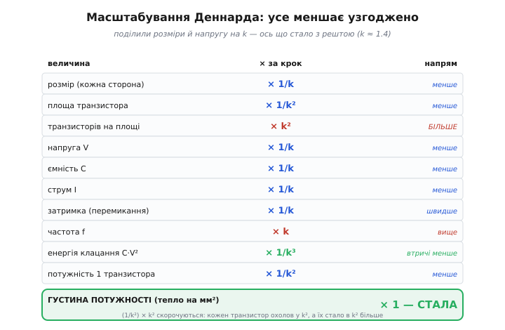
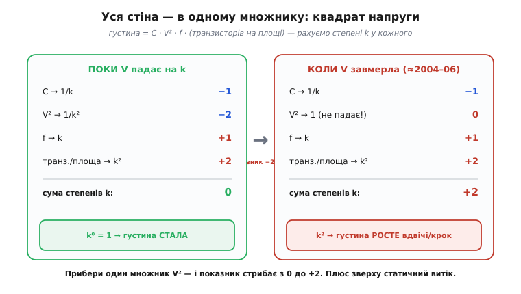

# 🧮 Алгебра масштабування Деннарда

Тридцять років кремнієва індустрія жила з дивовижного подарунка: транзистори щороку меншали, їх ставало більше, вони перемикалися швидше — а тепла на квадратний міліметр не додавалося ні на ват. Це звучить як безкоштовний обід, а безкоштовних обідів у фізиці не буває. Тож де в цьому балансі схований платіж? Чому саме пропорційне зменшення напруги дає сталу густину потужності — і що конкретно перестало зменшуватися, коли в 2004–2006 роках подарунок скінчився?

На словах відповідь звучить туманно: «зменшуй усе разом, і воно збалансується». Але «збалансується» — це не інтуїція, а рівняння. Уся магія масштабування Деннарда вкладається в кілька рядків шкільної алгебри, і коли ці рядки написати, стає видно річ, якої з тексту не вихопиш: баланс тримався не на щасливому збігу, а на **точному зчепленні квадрата напруги з площею транзистора**. Витягніть один множник — і рівновага завалюється. Саме це й сталося.

Розберімо цю алгебру покроково, від першопричини. Не заради формул — заради того, щоб побачити на власні очі, чому стіна потужності була **неминучою**, щойно один-єдиний параметр відмовився зменшуватися.

## Одне число, від якого все залежить: коефіцієнт зменшення

Кожне нове покоління техпроцесу робить транзистор меншим. Не «трохи меншим» абияк, а меншим у певну **сталу кількість разів** по кожному лінійному вимірі. Позначмо цей коефіцієнт літерою **k** (від англ. *scaling factor*, коефіцієнт масштабування). Історично k тримався близько **1.4** на крок — і це число не випадкове.

Чому саме 1.4? Бо інженерів цікавить не довжина сторони транзистора, а **площа**, яку він займає: що менша площа, то більше транзисторів улізе на пластину, то дешевший кожен. А площа — це добуток двох вимірів. Якщо зменшити кожну сторону в k разів, площа зменшиться в **k²** разів. Щоб на тій самій ділянці кремнію вмістилося рівно **вдвічі** більше транзисторів (а подвоєння — це і є ритм закону Мура), потрібно, щоб площа кожного впала вдвічі:

```
k² = 2   →   k = √2 ≈ 1.41
```

Ось звідки береться магічне «1.4»: це просто корінь із двійки. Зменшив сторону в 1.41 раза — площа впала вдвічі — транзисторів на тій самій площі стало вдвічі більше. Тримайте це число в голові: **усе масштабування Деннарда — це відповідь на питання «що станеться з рештою величин, якщо всі розміри поділити на k».**

> 🔧 **Навіщо це.** Коли ви читаєте, що чип «перейшов з 28 нм на 20 нм», перед вами не два випадкові числа. Відношення 28/20 = 1.4 — це той самий k. Один погляд на нього одразу каже інженерові, що площа транзистора впала приблизно вдвічі, а отже, за тих самих грошей на пластині вміститься приблизно вдвічі більше логіки. Уся економіка кремнію крутиться навколо цього коефіцієнта.

Тепер головне правило гри, яке й придумав Деннард: зменшуючи розміри в k разів, ми **в стільки ж разів зменшуємо і напругу живлення**. Не залишаємо напругу як була, а тягнемо її вниз пропорційно розмірам. Навіщо саме так — стане ясно за хвилину, коли ми порахуємо електричне поле всередині транзистора. Поки що просто приймімо це як умову задачі:

```
розміри:   L, W, товщина ізолятора t   →   поділити на k
напруга:   V                            →   поділити на k
```

Із цих двох рядків, як із двох аксіом, випливає геть усе інше. Проведімо ланцюжок до кінця.

## Чому напругу треба тягнути вниз разом із розмірами: поле мусить лишитися сталим

Перш ніж рахувати наслідки, розберімося з самою умовою — бо в ній схована вся фізична суть, а не сваволя. Чому не можна зменшити транзистор, а напругу лишити? Адже вища напруга — це вищий струм, швидше перемикання, начебто лише на краще.

Відповідь — у тому, що визначає долю транзистора зсередини: **напруженість електричного поля** (*electric field*). Поле — це напруга, поділена на відстань, крізь яку вона прикладена:

```
E = V / d
```

Уявіть, що ви зменшили відстань d у k разів (транзистор став тонший), а напругу V лишили колишньою. Тоді поле E = V / (d/k) = k·V/d підскочить у k разів. А сильне поле в крихітному об'ємі кремнію — це біда: електрони розганяються так, що вибивають інші (лавинний пробій), ізолятор затвора не витримує й прошивається, транзистор деградує й помирає. Кремній має межу поля, яку не можна переступати, — приблизно однакову для будь-якого розміру, бо це властивість самого матеріалу, а не геометрії.

Звідси — єдиний спосіб зменшити транзистор і не спалити його полем: зменшувати напругу **в стільки ж разів, що й відстань**. Тоді

```
E = (V/k) / (d/k) = V/d   →   поле лишається тим самим
```

Ось чому правило Деннарда — не «одне з можливих», а **вимушене**. Хочеш робити транзистори дрібнішими — мусиш опускати напругу пропорційно, інакше поле тебе вб'є. Саме тому цей режим і називають **масштабуванням зі сталим полем** (*constant-field scaling*): усе меншає так, щоб внутрішня електрична «погода» транзистора не мінялася. Транзистор просто стає зменшеною, але точною копією самого себе — з тими самими полями, тими самими фізичними режимами, лише в меншому масштабі.

Ця вимога — тримати поле сталим — і є та невидима вісь, довкола якої обертається все масштабування. Запам'ятаймо її: коли наприкінці історії поле знову почне зростати, це буде сигналом, що баланс завалився.

## Ланцюжок наслідків: як меншає кожна величина

Тепер механічно, крок за кроком, проженімо два наші правила (розміри /k, напруга /k) крізь фізику транзистора й подивімося, що станеться з кожною цікавою нам величиною. Це і є ядро масштабування Деннарда — виведення, а не заучування таблиці.

**Розмір → площа.** Тут усе просто, ми вже це зробили. Кожна сторона /k, отже площа одного транзистора падає в k² разів. На тій самій пластині вміщується в k² більше транзисторів:

```
площа одного транзистора:   A → A / k²
транзисторів на тій самій площі:   × k²
```

**Ємність затвора.** Транзистор перемикається, заряджаючи й розряджаючи свій затвор — крихітний конденсатор. Ємність плаского конденсатора — це

```
C = ε · (площа пластин) / (відстань між ними)
```

де ε — властивість ізолятора (діелектрична проникність), стала. Площа затвора впала в k² разів (обидві сторони /k). Відстань — товщина ізолятора — впала в k разів. Підставмо:

```
C = ε · (A/k²) / (t/k) = ε · A / (t·k) = C / k
```

Чисельник упав у k², знаменник — у k, у підсумку ємність падає в **k** разів. Менший транзистор — менший конденсатор, який треба перезаряджати. Це вже пахне економією.

```
ємність:   C → C / k
```

**Струм.** Скільки струму жене транзистор у відкритому стані? Спрощено струм насичення МОН-транзистора виглядає так:

```
I ~ (W / L) · (напруга понад поріг)²
```

Відношення ширини до довжини W/L при масштабуванні не міняється — ми ж ділимо обидві сторони на той самий k, форма транзистора зберігається. А «напруга понад поріг» — це наша напруга живлення, яку ми опустили в k разів; вона входить у квадраті, тобто дає (1/k)² = 1/k². Але є ще множник провідності, який росте з тоншим ізолятором приблизно в k разів (тонший ізолятор — сильніший вплив затвора на канал). Зводячи все докупи, ці залежності скорочуються так, що струм падає рівно в **k** разів:

```
струм:   I → I / k
```

Не будемо тонути в повному виведенні транзисторної фізики — важливий результат і його узгодженість з рештою: струм меншає в стільки ж разів, що й напруга. Це, до речі, можна перевірити з іншого боку, через опір: менший транзистор має пропорційний опір, і за законом Ома струм при вдвічі меншій напрузі й відповідному опорі падає саме так, як треба. Числа сходяться.

**Затримка (швидкодія).** Ось найприємніше. Наскільки швидко транзистор перемикається? Час перемикання — це час, за який струм I перезарядить ємність C до напруги V. Заряд конденсатора Q = C·V, а час його переливання за струму I:

```
t = Q / I = C · V / I
```

Підставмо, що з кожною величиною сталося: C стало C/k, V стало V/k, I стало I/k.

```
t = (C/k) · (V/k) / (I/k) = C·V / (I·k) = t / k
```

Затримка падає в **k** разів — транзистор перемикається в k разів швидше. А оскільки частота такту — це, грубо, одне ділене на затримку, частота може зрости в **k** разів. Ось де народжувалися гігагерци: не з чиєїсь хитрості, а прямо з геометрії. Зменшив розмір у 1.4 раза — і той самий транзистор сам собою перемикається в 1.4 раза швидше.

```
затримка:   t → t / k        частота:   f → f · k
```

**Енергія одного перемикання.** Скільки тепла виділяється за одне-єдине клацання вентиля? Це енергія, запасена в зарядженому конденсаторі:

```
E = C · V²
```

І тут уперше вступає в дію квадрат напруги — той самий, що зрештою вирішить долю всієї індустрії. Підставмо C → C/k і V → V/k:

```
E = (C/k) · (V/k)² = C · V² / k³ = E / k³
```

Енергія одного перемикання падає **в куб k**! Ось де захований головний виграш. Кожне клацання транзистора коштує в k³ ≈ 2.8 раза менше тепла. Це не лінійна економія — це кубічна, і саме вона робила всю схему такою щедрою. Затамуйте цей результат: **E → E/k³** — це серце масштабування Деннарда, і саме цей куб зникне наприкінці.

```
енергія перемикання:   E → E / k³
```

## Кульмінація: чому густина потужності лишалася сталою

Тепер зберімо все докупи й дійдемо до того, заради чого й затівалася вся алгебра, — до **густини потужності** (потужності на одиницю площі). Це і є число, яке визначає, наскільки гарячим буде квадратний міліметр кремнію. Якщо воно стале — чип не гріється дужче, хоч би скільки поколінь минуло. Якщо росте — рано чи пізно кремній розплавиться. Уся стіна потужності — це історія про те, як це число зірвалося зі сталого значення.

Порахуймо його з двох боків.

**Потужність одного транзистора.** Потужність — це енергія за секунду. Один транзистор виділяє енергію E за кожне перемикання й перемикається f разів на секунду:

```
P_один = E · f
```

Ми вже знаємо, як масштабуються обидва множники: E → E/k³, а f → f·k. Перемножмо:

```
P_один = (E/k³) · (f·k) = E·f / k² = P_один / k²
```

Потужність одного транзистора падає в **k²** разів. Кожен окремий транзистор став у k² разів холоднішим — попри те, що клацає частіше. (Цей самий результат можна дістати й прямо з формули динамічної потужності P = C·V²·f: C→C/k дає /k, V²→V²/k² дає /k², f→f·k дає ·k; разом /k · /k² · ·k = /k². Числа знову сходяться — ознака, що виведення правильне.)

```
потужність одного транзистора:   P → P / k²
```

**Тепер — головний фокус.** На тій самій площі чипа тепер сидить у **k²** разів **більше** транзисторів (площа кожного впала в k², пригадуєте?). Густина потужності — це сумарна потужність усіх транзисторів, поділена на площу. Помножмо потужність одного на їхню нову кількість:

```
густина = (потужність одного) × (кількість на площі)
        = (P / k²)            × (× k²)
        = P
```

**Множники k² скоротилися.** Ось воно — те саме зчеплення, про яке йшлося на початку. Кожен транзистор охолов рівно в k² разів; транзисторів на площі стало рівно в k² разів більше; одне точно погасило інше. Густина потужності лишилася **тією самою**.

```
ГУСТИНА ПОТУЖНОСТІ:   стала (× 1)
```

Ось де вся магія в одному рядку. Квадратний міліметр кремнію виділяв стільки ж тепла, скільки й покоління тому, — хоч на ньому тепер удвічі більше транзисторів, і кожен перемикається в 1.4 раза швидше. Інженерам не треба було вигадувати нове охолодження: та сама система відводу тепла годилася для чипа з удвічі більшою кількістю логіки. Продуктивність зростала **задарма**.


*Поділили розміри й напругу на k — і кожна величина посунулася на свій степінь k. Синє меншає, червоне росте. Головний рядок унизу: густина потужності стала (× 1), бо потужність одного транзистора впала в k², а самих транзисторів на площі стало в k² більше — множники точно погасили одне одного.*

Але тепер видно й тендітність цього балансу. Він тримається на тому, що **k² зверху точно скоротилося з k² знизу**. А k² згори — це k у першому степені від частоти (f·k) помножене на k у першому степені від… ні, придивімося ще уважніше, звідки взявся кожен степінь k. І тут вилазить головна крихкість.

## Де саме схований квадрат напруги — і чому він усе тримає

Розкладімо густину потужності на першоджерела, підставивши всі складники без скорочень. Візьмімо динамічну потужність одного транзистора P = C·V²·f, помножимо на кількість транзисторів на площі N, і подивімося, який множник дає кожна фізична величина:

```
густина = C · V² · f · N / площа
```

Тепер — що станеться з кожним множником за один крок масштабування:

```
C   → / k     (ємність, ми вивели)
V²  → / k²    (напруга в квадраті — ОСЬ ВОНО)
f   → × k     (частота, бо затримка впала)
N/площа → × k²  (густина транзисторів)
```

Перемножмо всі множники змін:

```
(1/k) · (1/k²) · k · k² = k^(−1−2+1+2) = k⁰ = 1
```

Показники степеня додаються до нуля — тому густина й стала. А тепер найважливіше спостереження всієї статті: подивіться, **хто саме дає від'ємні степені** (тобто хто *охолоджує*), а хто додатні (*гріє*).

```
ГРІЮТЬ (додатний степінь):    f (+1),  густина транзисторів (+2)    →   разом +3
ОХОЛОДЖУЮТЬ (від'ємний):      C (−1),  V² (−2)                       →   разом −3
```

Частота й напхом транзисторів **тягнуть тепло вгору на +3 степені k**. Що їх урівноважує? Ємність дає −1, а **квадрат напруги дає цілих −2**. Тобто з трьох степенів охолодження **два припадають на єдину величину — напругу**. Квадрат напруги — це не деталь, це **головна противага** всій схемі. Він сам-один компенсує густину транзисторів (обидва по 2 степені), а ємність гасить частоту.

Звідси випливає висновок, що передбачає всю подальшу катастрофу: **баланс тримається доти, доки напруга падає в k разів кожен крок**. Якщо напруга перестане падати — зникне множник 1/k², тобто випарується −2 з боку охолодження. Лишиться +3 гріючих проти всього −1 охолоджуючого (сама лише ємність). Показник стане +2, і густина потужності почне рости в **k²** разів за крок — вдвічі за покоління. Кремній почне гарячішати нестримно.

Уся стіна потужності — це один рядок алгебри: **щойно V перестає ділитися на k, показник степеня густини стрибає з нуля до +2.** Лишалося тільки одне питання: чи можна вічно ділити напругу на k? Виявилося — ні.


*Розкладімо густину на множники C·V²·f·(транзисторів на площі) і порахуймо степінь k у кожного. Ліворуч, поки напруга падає на k: степені додаються рівно до нуля, густина стала. Праворуч, коли напруга завмерла: множник V² дає вже не −2, а 0 — сума підскакує до +2, і густина щокроку росте вдвічі. Уся катастрофа — зникнення єдиного −2 від квадрата напруги.*

## Що саме перестало зменшуватися: порогова напруга і струм витоку

Отже, весь баланс висить на одній нитці — на можливості й далі опускати напругу живлення V. Здавалося б, чому ні? Ділили ж тридцять років. Але тут вступає в дію фізична межа, яку Деннард у 1974-му міг спокійно нехтувати, а до 2005-го знехтувати вже не вдавалося: **порогова напруга** (*threshold voltage*, V_th).

Порогова напруга — це та напруга на затворі, за якої транзистор нарешті **відмикається**, пускаючи струм. Нижче порога транзистор має бути закритий, вище — відкритий. Це і є суть транзистора як вентиля: він мусить чітко відрізняти «увімкнено» від «вимкнено». А щоб транзистор швидко й надійно вмикався, напруга живлення має бути **помітно вищою за поріг** — інакше струм у відкритому стані буде кволий, і перемикання сповільниться (пригадайте: струм у чисельнику швидкодії).

Тепер пастка. За правилами Деннарда V треба ділити на k. Щоб при цьому транзистор лишався швидким, разом із V довелося б ділити на k і поріг V_th. Але **поріг ділити на k не виходить**. І ось чому — це фізика, а не інженерна недбалість.

Навіть коли транзистор «закритий» (напруга нижча за поріг), крізь нього тече кволенький струм — **підпороговий струм витоку** (*subthreshold leakage*). Це не дефект, а квантово-теплова природа: електрони мають розподіл енергій, і завжди знайдеться хвіст найенергійніших, яким вистачає снаги перескочити бар'єр навіть закритого транзистора. Найгірше — цей витік залежить від порога **експоненційно**:

```
I_витоку ~ exp( −V_th / (щось пропорційне температурі) )
```

Експонента — ось де вся біда. Знизиш поріг V_th лінійно (скажімо, удвічі) — і показник експоненти зміниться так, що струм витоку зросте не вдвічі, а на **порядки**. Груба, але показова оцінка: за кімнатної температури зниження порога приблизно на кожні 60–100 мілівольт множить струм витоку **вдесятеро**. Опустити поріг у 1.4 раза з умовних 0.4 В — це прибрати десь 110 мВ, тобто збільшити витік більш ніж на порядок за один крок.

Ось де баланс і зламався. Витік — це струм, що тече **постійно**, незалежно від того, перемикається транзистор чи спить. А постійний струм за напруги живлення дає **статичну потужність витоку**: P_витоку = I_витоку · V, і вона гріє чип цілодобово, навіть коли той нічого не рахує. Поки поріг був високий, а транзисторів мало, цей струм був такий крихітний, що Деннард його просто відкинув — у 1974-му це була законна апроксимація. Але транзисторів на чипі більшало в k² за крок, кожен потроху підтікав, поріг тиснули вниз — і десь на техпроцесі близько **90–65 нанометрів (приблизно 2004–2006 роки)** сумарний витік доріс до того самого порядку, що й корисна динамічна потужність. Нехтувати ним стало неможливо.

І тоді інженери опинилися перед вилкою без виходу:

- **Тримати поріг високим** (щоб задавити витік) — але тоді не можна опускати й напругу живлення (бо вона мусить лишатися вищою за поріг). А не опускаючи V, ми втрачаємо той самий множник −2 у балансі — і густина динамічної потужності стрибає вгору.
- **Опустити поріг** (щоб і далі знижувати V за Деннардом) — але тоді витік росте експоненційно, і густина статичної потужності стрибає вгору.

Куди не кинь — густина потужності росте. **Обидві половини потужності — динамічна й статична — тягнуть в один бік.** Це вже не тендітний баланс, це його руїна. Масштабування зі сталим полем скінчилося: напруга завмерла близько 1 В і далі не пішла, а разом із нею й тактова частота — тому вона й досі тупцює на ~4–5 ГГц, а не сягнула обіцяних колись десятків.

Формально це видно так. Розберімо, у що перетворилася наша алгебра після зламу. Напруга більше не ділиться на k (V → V, не V/k). Перерахуймо густину динамічної потужності з цією однією зміною:

```
було:   (1/k) · (1/k²) · k · k²  =  1     (V падала, множник 1/k²)
стало:  (1/k) · (1)    · k · k²  =  k²    (V стоїть, множник зник)
```

Один-єдиний множник — квадрат напруги — випав із формули, і показник степеня стрибнув з 0 до +2. Плюс до цього зверху накладається статичний витік, якого раніше просто не існувало в рівняннях. Ось уся стіна потужності в двох рядках алгебри: **прибери 1/k² від напруги — і густина, що тридцять років стояла на місці, полетить угору як k² за кожен крок.**

## Числовий приклад одного кроку техпроцесу

Абстрактні k приємно бачать у степенях, але відчути силу масштабування допомагає одне конкретне число. Візьмімо реальний перехід — умовно з **90 нм на 65 нм**, десь середина 2000-х, саме той рубіж, де магія й почала здихати. Порахуймо все двічі: спершу так, ніби масштабування Деннарда ще працює ідеально (утопія), а тоді — як воно повелося насправді.

Спершу знайдімо k. Це відношення розмірів:

```
k = 90 / 65 ≈ 1.385 ≈ 1.4
```

Гарно лягає на наше √2 — тобто площа транзистора падає приблизно вдвічі, транзисторів на чипі стане приблизно вдвічі більше. Тепер прокрутімо весь ланцюжок для однієї гіпотетичної ділянки чипа. Хай на старому вузлі там був **1 умовний транзистор**, з напругою живлення V = 1.2 В, і хай він виділяв **1 умовну одиницю потужності**.

**Утопія — масштабування Деннарда працює ідеально:**

```
коефіцієнт:            k = 1.385
розмір сторони:        × 1/1.385  →  0.72 від старого
площа транзистора:     × 1/k²  = 1/1.92  →  0.52 (майже вдвічі менша)
транзисторів на ділянці: × k²  = 1.92     →  було 1, стало ~1.9
напруга:               1.2 В / 1.385  →  0.87 В
ємність одного:        × 1/k  = 0.72
затримка:              × 1/k  = 0.72      →  швидкодія × 1.385
частота:               × k     = 1.385     (+38%)
енергія перемикання:   × 1/k³ = 1/2.66  →  0.376 (майже втричі менша!)
потужність одного:     × 1/k² = 1/1.92  →  0.52
─────────────────────────────────────────────────────
густина потужності = (потужність одного) × (транзисторів)
                   = 0.52 × 1.92  =  1.0   ← ТА САМА
```

Ось він, подарунок, у числах: на ділянці тепер майже вдвічі більше транзисторів, кожен перемикається на 38% швидше — а сумарне тепло **те саме, 1.0**. Стільки ж ват, стільки ж охолодження, вдвічі більше роботи. Помножте це на десяток поколінь поспіль — і зрозумієте, звідки взялися гігагерци й мільярди транзисторів «задарма».

**Реальність — напруга завмерла.** А тепер повторімо той самий крок, але з однією зміною: напругу з 1.2 В опустити вже не можна (поріг не пускає), лишаємо 1.2 В. Дивимося, що стало з густиною:

```
напруга:               1.2 В  →  1.2 В   (НЕ падає!)
ємність одного:        × 1/k  = 0.72     (це від розмірів, воно лишається)
частота:               × k     = 1.385    (швидкодія від розмірів лишається)
енергія перемикання E = C·V²:  × 1/k · 1  = 0.72   (замість 0.376 — квадрат V не спрацював)
потужність одного P = E·f:     × 0.72 · 1.385 = 1.0  (замість 0.52 — не впала взагалі!)
транзисторів на ділянці:       × k² = 1.92
─────────────────────────────────────────────────────
густина = потужність одного × транзисторів
        = 1.0 × 1.92  =  1.92   ← майже ВДВІЧІ гарячіше
```

Різниця приголомшлива. Той самий крок техпроцесу, та сама геометрія — але без падіння напруги густина потужності підскочила з 1.0 до **1.92**: майже вдвічі більше тепла на тому самому квадратному міліметрі, за один крок. Це і є те k² ≈ 1.9, яке ми вивели алгебраїчно. А ми ще навіть **не додали статичний витік** — а він на цьому вузлі вже доростав до порядку динамічної потужності, тобто реальна картина була ще гіршою за ці 1.92.

Тепер ясно як день, чому Intel у 2004-му скасувала процесори на 4+ ГГц і розвернулася на кілька ядер. Гнати частоту далі означало не «трохи тепліше», а щокроку **подвоювати** густину потужності — і жодне охолодження за таким зростанням не встигає. Стіна потужності — не метафора, а оце число: **1.92 замість 1.0**, отримане з одного-єдиного зниклого множника V².

## Що ця алгебра каже розробникові

Виведення Деннарда — не музейний експонат. Той самий квадрат напруги, що тридцять років тримав баланс, а тоді його завалив, і досі лежить в основі кожного рішення про енергоспоживання.

Найпряміший наслідок: **напруга — найсильніша ручка економії, бо входить у квадраті**. Коли прошивка знижує частоту вдвічі, динамічна потужність падає вдвічі (лінійно). Коли ж контролер знижує разом із частотою ще й напругу — виграш іде по квадрату, і сумарна економія стає кубічною (пригадайте E → E/k³). Саме тому опустити чип у повільний режим економить **непропорційно** багато енергії. Механіку цього спільного зниження напруги й частоти детально розбирає окрема тема — [динамічне масштабування напруги й частоти](topic:programming/dvfs): це, по суті, масштабування Деннарда, яким керують не раз на покоління техпроцесу, а щомілісекунди програмно.

Другий урок — про **статичний витік**, який поховав Деннарда. На сучасних вузлах він нікуди не подівся: закритий транзистор усе одно підтікає, і мільярди таких транзисторів гріють чип, навіть коли той нічого не рахує. Ось чому справжня енергоощадність — це не лише «зменшити частоту», а **повністю знеструмити** те, що зараз не працює (power gating): не пригальмувати блок, а зовсім відрубати йому живлення, обірвавши й той струм витоку. Це той самий фізичний корінь, з якого росте необхідність тримати темною більшу частину чипа, а світити лише потрібне: якщо витік не дає ввімкнути весь кремній одночасно, доводиться живити його клаптями.

І останнє. Уся ця історія — наочний доказ, що в інженерії **немає безкоштовних множників**. Тридцять років квадрат напруги працював на нас, і легко було повірити, що продуктивність зростатиме сама вічно. Але кожен степінь k, що охолоджував, спирався на конкретну фізичну можливість — опускати напругу. Щойно фізика цю можливість забрала (поріг уперся, витік вибухнув), баланс, який здавався законом природи, розсипався за пару років. Формула P = C·V²·f нікуди не ділася — просто V у ній перестала падати, і давній друг обернувся ворогом. Розуміти цю алгебру — значить бачити не окремі числа техпроцесу, а **пружину, що ними рухає**, і знати наперед, яка ручка коли зламається.
