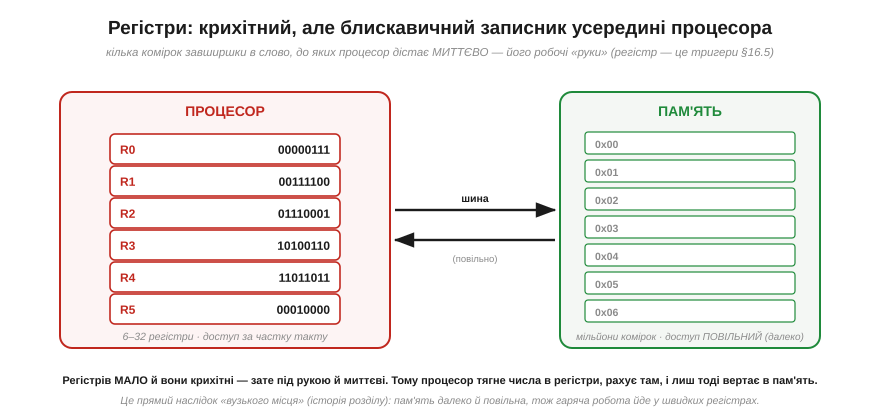
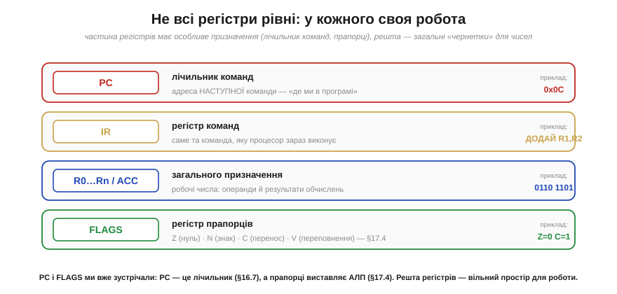
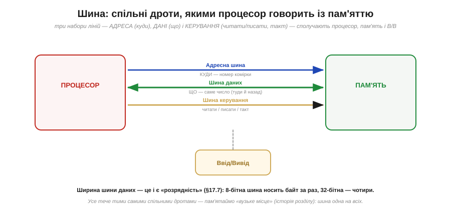
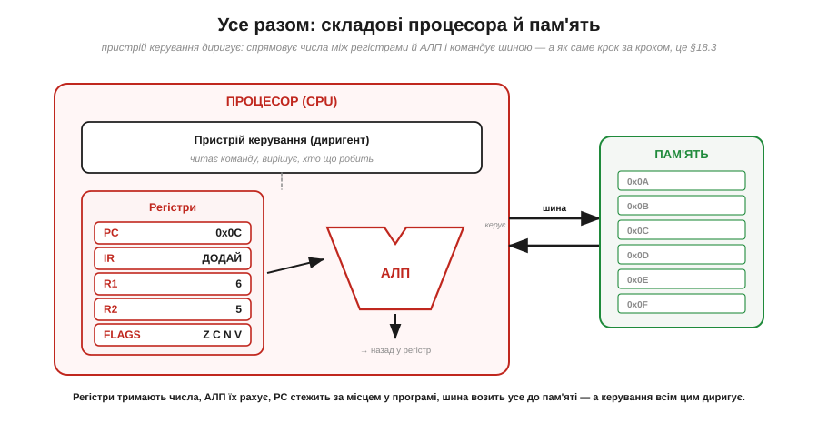

# Складові: регістри, АЛП, лічильник команд, шина

[Процесор виконує інструкції](book:programming/what-is-processor) — а тепер відкриймо корпус і подивімося, **з чого** він зроблений, щоб це могти. На щастя, усі цеглинки прості й знайомі: тут зійдуться [суматор](book:electronics/combinational-circuits), [регістри](book:electronics/register), [лічильники](book:electronics/counters) і [прапорці переповнення](book:programming/overflow-wraparound). Процесор — не якесь нове диво, а **розумна композиція** базових цифрових блоків. У ньому чотири головні органи: **регістри** (де тримати числа під рукою), **АЛП** (де їх рахувати), **лічильник команд** (де стежити за місцем у програмі) і **шина** (по чому спілкуватися з пам'яттю). Плюс п'ятий, диригент, — **пристрій керування**. Розберімо кожен — і побачимо, як з них складається машина, що виконує накази.

### Регістри: надшвидкий записник процесора

Першими — **регістри** (*registers*). Це крихітні комірки пам'яті **всередині** процесора, кожна завширшки в машинне слово, і їх **дуже мало** — від кількох до кількох десятків. [Регістр](book:electronics/register) — це група тригерів, що тримає слово. Питання — навіщо вони, якщо є велика пам'ять?

*Рис. Регістрів мало й вони крихітні, зате лежать **усередині** процесора, тож доступ до них — миттєвий, за частку такту. Пам'ять натомість величезна, але **далеко** й **повільна** (по неї треба йти через шину). Тому процесор працює так: тягне потрібні числа з пам'яті в регістри, виконує над ними обчислення **у регістрах** (швидко!), і лише тоді відправляє результат назад у пам'ять. Регістри — це робочі «руки» процесора, його чернетка під рукою.*

Це прямий наслідок **вузького місця**: пам'ять велика, але до неї довго йти спільною шиною. Якби процесор щоразу лазив у пам'ять по кожне число, він би вічно простоював. Тож конструктори дали йому жменьку **миттєвих** комірок просто всередині, де й кипить уся гаряча робота. Образно: пам'ять — це бібліотека (величезна, та йти далеко), а регістри — кілька аркушів на столі перед вами (мало місця, зате все під рукою й одразу). Розумний працівник тримає на столі рівно те, з чим зараз працює, — так робить і процесор.

### Не всі регістри рівні: спеціальні ролі

Частина регістрів — просто **чернетки** для будь-яких чисел (їх звуть *регістрами загального призначення*). Та кілька мають **особливу** роботу, без якої машина не крутилася б.

*Рис. **PC** (*program counter*, лічильник команд) тримає адресу **наступної** команди — «де ми в програмі». **IR** (*instruction register*, регістр команд) тримає **поточну** команду, яку процесор саме виконує. **Регістри загального призначення** (R0…Rn, акумулятор) — робочі числа: операнди й результати. **FLAGS** (регістр прапорців) зберігає стан останнього обчислення: Z (нуль), N (знак), C (перенос), V (переповнення) — точно ті [прапорці переповнення](book:programming/overflow-wraparound).*

Зверніть увагу, скільки простих блоків тут зібралося. **Прапорці** Z/N/C/V — це ті самі, що їх виставляє АЛП [при переповненні](book:programming/overflow-wraparound); тут вони живуть в окремому регістрі стану. А **PC** — це по суті [лічильник](book:electronics/counters). Процесор не вигадує нових сутностей — він **перевикористовує** базові цифрові блоки, лише дає кожному чітку роль.

### АЛП: рахівниця процесора

Тепер серце обчислень — **АЛП** (*ALU, Arithmetic Logic Unit*, арифметико-логічний пристрій). Це той орган, що власне **рахує**: додає, віднімає, порівнює, виконує логічні AND/OR/NOT, зсуває біти. Це і є «Млин» Беббіджа — частина, що меле числа.

*Рис. АЛП бере **два** числа (зазвичай із регістрів), пристрій керування каже їй, **яку** операцію зробити (+, −, AND, OR, порівняти, зсунути), і вона видає **результат** (назад у регістр) та **прапорці** Z/N/C/V (стан результату). На схемі: 6 + 5 = 11. Усередині АЛП — [суматор](book:electronics/combinational-circuits) і [логічні вентилі](book:electronics/basic-gates); вона **комбінаційна**, тобто лише рахує «тут і зараз», нічого не пам'ятаючи між операціями.*

Ключова думка про АЛП — вона **нічого не пам'ятає** й нічого не вирішує. Це чиста [комбінаційна схема](book:electronics/combinational-circuits): подав на входи числа й код операції — миттєво дістав на виході результат, прибрав входи — результат зник. Пам'ять — це робота **регістрів**, рішення — робота **пристрою керування**, а АЛП лише **рахує**. Саме тому її входи завжди беруть із регістрів, а вихід кладуть назад у регістр: АЛП і регістри працюють у нерозлучній парі — одна рахує, інші тримають. (До речі, **порівняти** два числа АЛП уміє тим самим відніманням: відніми B від A й глянь на прапорці — Z=1 означає рівність, знак результату каже, що більше.)

### Лічильник команд: закладка в програмі

Як процесор пам'ятає, **котру** інструкцію виконувати наступною? За це відповідає **лічильник команд** — **PC** (*program counter*). Це спеціальний регістр, що тримає **адресу** наступної команди в пам'яті.

*Рис. PC — це «закладка» в програмі: він указує на комірку з наступною командою. Після того як процесор узяв команду, PC **сам додає 1** і вже вказує на наступну — звідси й береться природне виконання «по порядку». А **стрибок** (jump) — це просто запис **іншої** адреси в PC: хочемо повторити цикл — кладемо в PC адресу його початку (тут 0x0C). PC — це буквально [лічильник](book:electronics/counters), лише лічить він не події, а кроки програми.*

Ось де стає конкретним те «місце в [списку команд процесора](book:programming/what-is-processor)». Програма — список команд за адресами; PC — палець, що по ньому веде. Звичайний хід: виконав команду — PC++ — наступна. Це й дає виконання згори вниз **само собою**, без жодних зусиль: лічильник просто рахує далі. А вся магія циклів і розгалужень зводиться до **одного** трюку — записати в PC не наступну адресу, а іншу. «Перейди на початок циклу» — це `PC ← адреса початку`. «Якщо рівно, пропусти команду» — це умовна зміна PC залежно від прапорця Z. Уся структура програм тримається на цьому скромному лічильнику.

### Шина: спільні дроти до пам'яті

Лишилося з'ясувати, **по чому** процесор спілкується з пам'яттю (і зі світом). По **шині** (*bus*) — наборах спільних дротів.

*Рис. Шина — це три набори ліній. **Адресна** (*address bus*) каже, **куди** звертаємось — номер комірки пам'яті (її ширина задає, скільки пам'яті машина взагалі може адресувати). **Шина даних** (*data bus*) несе **саме число** — туди (записати) й назад (прочитати). **Шина керування** (*control bus*) передає сигнали «читати»/«писати» й такт. Тими самими дротами користуються й пам'ять, і пристрої вводу/виводу.*

Дві практичні дрібниці про шину. Перша: **ширина шини даних** — це і є [«розрядність»](book:programming/bits-bytes-endianness). 8-бітна шина носить один байт за такт, 32-бітна — чотири; ось чому ширша шина (і слово) означає більшу пропускну здатність. Друга: шина **спільна** — і саме тому вона є тим **вузьким місцем**, про яке попереджав фон Нейман. І команди, і дані течуть тими самими дротами, тож процесор не може водночас брати інструкцію й возити дані — звідси затори, з якими інженери воюють кешами й хитрощами (а [архітектура з окремими шинами для коду й даних](book:programming/von-neumann-harvard) знімає саме цей затор).

### Як це збирається в машину

Тепер складімо все докупи. П'ятий орган, якого ми ще не називали, — **пристрій керування** (*control unit*) — і є той диригент, що змушує решту працювати злагоджено.

*Рис. Повна картина: **пристрій керування** читає поточну команду (з IR), розуміє, що вона означає, і **диригує** рештою — каже PC рушити далі, обирає, які регістри подати на АЛП, задає АЛП операцію, командує шиною читати чи писати. **Регістри** тримають числа, **АЛП** їх рахує, **PC** стежить за місцем у програмі, **шина** возить усе до пам'яті. Кожен орган простий; разом вони й утворюють машину, що виконує інструкції.*

Не переймайтеся поки **точним порядком** цих дій — важливо побачити саму **анатомію**: п'ять простих частин, кожну з яких легко зрозуміти окремо (регістр — тригери; АЛП — суматор і вентилі; PC — лічильник; шина — дроти; керування — логіка, що декодує команду), з'єднані так, що разом вони вибирають команди з пам'яті й виконують їх. Жодної окремої «магії» — лише прості цеглинки в розумній композиції.

> 🔧 **Навіщо це.** Ця анатомія — не абстракція, а те, з чим ви зіткнетесь упритул, тільки-но візьметеся за мікроконтролер на нижчому рівні. Перше: **регістри** — найшвидша пам'ять, і вся гаряча робота йде в них; асемблер та оптимізації компілятора — це саме про те, як ефективно «жонглювати» жменькою регістрів, не бігаючи зайвий раз у повільну пам'ять. Друге: **прапорці** [Z/N/C/V](book:programming/overflow-wraparound) — це те, на чому тримаються всі `if` і цикли: процесор порівнює числа АЛП, виставляє прапорці, а потім стрибає або ні залежно від них. Третє: **PC** — це «де виконується програма»; коли код «вилітає» в незрозуміле місце, це часто означає, що в PC потрапила хибна адреса. Четверте: **шина** та її ширина — це пряма межа швидкодії; розуміючи «вузьке місце», ви не дивуватиметеся, чому процесор із удвічі вищою частотою не завжди вдвічі швидший. Тримайте цю карту в голові — і робота мікроконтролера перестане бути чорною скринькою.

---

Отже, процесор складається з небагатьох простих органів — самих лише базових цифрових блоків. **Регістри** — крихітні надшвидкі комірки всередині CPU, робочий записник; серед них спеціальні: **PC** (адреса наступної команди), **IR** (поточна команда), регістри **загального призначення** (операнди/результати) і **FLAGS** ([прапорці Z/N/C/V](book:programming/overflow-wraparound)). **АЛП** — [комбінаційна](book:electronics/combinational-circuits) «рахівниця»: бере два числа й код операції, видає результат і прапорці, нічого не пам'ятаючи. **Лічильник команд PC** — це [лічильник](book:electronics/counters), що тримає адресу наступної команди, сам +1 (звідси порядок), а «стрибок» — це запис іншої адреси в PC. **Шина** (адресна + даних + керування) сполучає процесор із пам'яттю й В/В; ширина шини даних — це [розрядність](book:programming/bits-bytes-endianness), а її спільність — те саме «вузьке місце». Диригує всім **пристрій керування**. Ми розклали процесор на частини; як саме ці органи, такт за тактом, спільно виконують одну команду, показує [цикл «вибірка → декодування → виконання»](book:programming/fetch-decode-execute) — серцебиття процесора.

---
