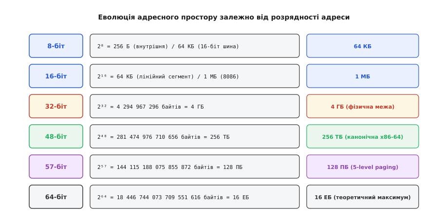

# 📜 Від калькуляторів до 64-бітних архітектур: боротьба за розрядність

Коли інженери компанії Intel у 1971 році розробляли перший комерційний мікропроцесор Intel 4004, ніхто не думав про операційні системи, комп'ютерну графіку чи багатопотокові сервери. Замовником була японська фірма Busicom, якій потрібен був набір мікросхем для настільного друкарського калькулятора. Числа в калькуляторі вводилися й відображалися в десятковій системі, де кожна десяткова цифра (від 0 до 9) кодується чотирма двійковими розрядами — двійково-десятковим кодом (англ. *binary-coded decimal*, BCD; від латин. *binarius* «подвійний» і *decimus* «десятий»). Чотири біти виявилися природною шириною для маніпуляцій з однією десятковою цифрою, тому АЛП і регістри 4004 отримали 4-бітну ширину.

Проте 4-бітна арифметика була непридатна для обробки тексту. Символ стандарту ASCII займає 8 бітів (один байт), і щоб прочитати одну літеру тексту на 4-бітному процесорі, доводилося виконувати дві окремі операції читання та склеювати половинки. Це породило першу хвилю розширення розрядності — перехід до 8-бітних процесорів: Intel 8008 (1972 рік), Intel 8080 (1974 рік), MOS Technology 6502 (1975 рік) та Zilog Z80 (1976 рік).


*Зростання розрядності процесора диктувалося не стільки розміром чисел в арифметиці, скільки фізичною потребою адресувати більші обсяги оперативної пам'яті.*

У 8-бітному світі внутрішні регістри даних мали ширину 8 бітів. Якщо процесор додавав два 8-бітних числа, він міг за один такт отримати результат у діапазоні від 0 до 255. Проте 256 комірок пам'яті було замало навіть для найпростіших програм. Тому творці 8080 та Z80 розширили адресну шину до 16 бітів. Щоб сформувати 16-бітну адресу, 8-бітний процесор змушений був об'єднувати два свої 8-бітні регістри в пару (наприклад, регістрову пару `HL` у Z80/8080). 16-бітна адресна шина дозволила адресувати 65 536 байтів (64 КБ) оперативної пам'яті, що стало стандартом для перших персональних комп'ютерів 1970-х років, таких як Altair 8800 або Apple II.

## Сегментний компроміс 16-бітної епохи

До кінця 1970-х років програми переросли межу 64 КБ. Потрібен був новий крок. У 1978 році компанія Intel випустила 16-бітний процесор 8086. У ньому регістри даних і АЛП стали чесними 16-бітними, тобто процесор міг за одну операцію маніпулювати числами від 0 до 65 535. Але зробити адресну шину теж 16-бітною означало б заблокувати комп'ютери на тій самій межі в 64 КБ.

Інженери Intel вирішили розширити фізичну адресну шину до 20 бітів, що давало можливість підключити 1 048 576 байтів (1 МБ) пам'яті. Проте виникла апаратна дилема: усі регістри процесора були 16-бітними. Як 16-бітним числом із регістра вказати на 20-бітну фізичну адресу?

Замість введення повноцінних 32-бітних регістрів адреси (що значно збільшило б кількість транзисторів і площу кристала), Intel застосувала схему сегментації пам'яті:
```
фізична адреса = (сегментний регістр << 4) + зміщення
```

Процесор брав значення із сегментного регістра (наприклад, `CS` або `DS`), зсував його ліворуч на 4 біти (множив на 16) і додавав 16-бітне зміщення (*offset*). Це дозволило адресувати 1 МБ пам'яті у вигляді перекривних сегментів по 64 КБ кожен.

Цей компроміс перетворився на важкий тягар для програмістів і авторів компіляторів на наступні двадцять років. Мови програмування C і Pascal були змушені запровадити поняття «близьких» і «далеких» покажчиків (`near`, `far`, `huge` pointers). Покажчик `near` складався лише з 16-бітного зміщення і міг працювати тільки всередині поточного сегмента. Покажчик `far` містив 32 біти (16 бітів сегмента + 16 бітів зміщення), вимагав складніших інструкцій і призводив до проблем порівняння: різні комбінації сегмента й зміщення могли вказувати на одну й ту саму фізичну адресу.

Конкурент Motorola пішов значно чистішим інженерним шляхом: у 1979 році процесор Motorola 68000 отримав внутрішню 32-бітну архітектуру регістрів із плоским (несегментованим) 24-бітним адресним простором (16 МБ). Саме плоска модель адресації зробила 68000 улюбленцем інженерів для комп'ютерів Apple Macintosh, Amiga та робочих станцій Sun Microsystems.

## 32-бітна плоска революція: Intel 80386

У 1985 році Intel зробила головний стрибок в історії архітектури x86, випустивши процесор 80386 (і386). Усі регістри загального призначення, АЛП та внутрішні шини були розширені до 32 бітів (`EAX`, `EBX`, `ECX`, `EDX`, `ESP`, `EBP`, `ESI`, `EDI`).

Головним досягненням 386 стала лінійна 32-бітна адресація в захищеному режимі (*protected mode*). Покажчик став звичайним 32-бітним числом без будь-яких сегментних множників. 32-бітна адреса давала прямий доступ до:
```
2³² = 4 294 967 296 байтів = 4 ГБ
```

У 1985 році, коли типовий персональний комп'ютер мав 512 КБ або 1 МБ оперативної пам'яті, 4 гігабайти здавалися практично невичерпним запасом. Комп'ютерна індустрія перейшла на 32-бітну модель даних ILP32, де типи `int`, `long` і покажчики мали однаковий розмір — 4 байти (32 біти). На цій плоскій архітектурі виросли сучасні операційні системи: Linux, Windows NT, FreeBSD та Mac OS X.

## 1990-ті роки: межа 4 ГБ і RISC-піонери 64-біт

До середини 1990-х років закон Мура та бурхливий розвиток реляційних баз даних (Oracle, IBM DB2, Sybase) підвели комп'ютери до межі 32-бітного адресного простору. Великі сервери обробки транзакцій вимагали тримати всю базу даних у гарячій пам'яті RAM, але жоден 32-бітний процес не міг адресувати понад 4 ГБ пам'яті, а в багатьох операційних системах (через поділ простору ядра та користувача) процес отримував лише 2 або 3 ГБ.

Першими розв'язали цю проблему творці 64-бітних RISC-процесорів:
1. **DEC Alpha 21064 (1992 рік):** перша комерційна чиста 64-бітна мікропроцесорна архітектура, де всі регістри, адреси та обчислення були 64-бітними без компромісів.
2. **MIPS R4000 (1991 рік):** перший масовий 64-бітний RISC-чіп (який згодом ліг в основу робочих станцій SGI та ігрової консолі Nintendo 64).
3. **Sun UltraSPARC (1995 рік) та IBM POWER3 (1998 рік):** закріпили 64-бітне домінування у сфері корпоративних серверів високого класу.

Проте на ринку масових персональних комп'ютерів і серверів стандартної архітектури x86 панувала 32-бітна монополія Intel.

## Битва титанів: Itanium (IA-64) проти AMD64 (x86-64)

Наприкінці 1990-х років компанія Intel вирішила, що архітектура x86 вичерпала свій потенціал через складне декодування змінної довжини команд і накопичений історичний баласт. Спільно з Hewlett-Packard Intel розпочала розробку абсолютно нової, радикальної 64-бітної архітектури під назвою **IA-64** (Intel Architecture 64), що втілилася в лінійці процесорів **Itanium** (випущених у 2001 році).

Архітектура IA-64 базувалася на концепції VLIW/EPIC (англ. *Explicitly Parallel Instruction Computing*). Вона повністю відмовилася від сумісності з інструкціями x86 на рівні заліза:
- Інструкції групувалися по три штуки у 128-бітні зв'язки (*bundles*).
- Компілятор, а не апаратний планувальник процесора, повинен був визначати залежності між інструкціями й планувати паралельне виконання.
- 32-бітні програми x86 виконувалися на Itanium через повільну програмну емуляцію або апаратний транслятор із гігантською втратою швидкодії (в рази повільніше за звичайні дешеві Pentium III).

Intel розраховувала, що весь світ перепише й перекомпілює своє програмне забезпечення під IA-64.

У цей момент компанія AMD здійснила один із найсміливіших інженерних і комерційних ходів в історії обчислювальної техніки. У 1999–2000 роках під керівництвом інженера Дірка Меєра (Dirk Meyer) та архітектора Фреда Вебера (Fred Weber) AMD розробила специфікацію **x86-64** (пізніше названу **AMD64**).

Ідея AMD64 була діаметрально протилежною ідеї Itanium — **еволюція замість революції**:
1. Повна зворотна апаратна сумісність: 32-бітний код x86 виконувався на чіпах AMD64 на рідній швидкості заліза без жодної емуляції.
2. Подвоєння кількості регістрів: кількість регістрів загального призначення зросла з 8 до 16 (`RAX`, `RBX`, `RCX`, `RDX`, `RSI`, `RDI`, `RBP`, `RSP` та нові `R8`..`R15`), а їхня розрядність досягла 64 бітів.
3. Новий режим роботи — *Long Mode*, який дозволяв операційній системі використовувати 64-бітну лінійну адресацію, залишаючи можливість одночасно запускати поруч старі 32-бітні додатки.

Коли у 2003 році AMD випустила серверні процесори Opteron та десктопні Athlon 64, ринок проголосував однозначно. Дата-центри та системні адміністратори масово обирали Opteron: вони могли купити нове залізо, встановити наявну 32-бітну ОС, а згодом плавно перейти на 64-бітний Linux чи Windows без викидання робочого софту на смітник.

Itanium зазнав нищівного фінансового й репутаційного краху, отримавши від преси глузливе прізвисько *Itanic* (за аналогією з «Титаніком»). Компанія Microsoft заявила, що наступні версії Windows підтримуватимуть архітектуру AMD64 як основний 64-бітний стандарт.

У 2004 році компанія Intel була змушена визнати поразку своєї стратегії IA-64 і ліцензувати архітектуру x86-64 у AMD, випустивши власну сумісну реалізацію під назвою EM64T (пізніше перейменовану в Intel 64).

## 64-бітний ARM: народження AArch64

Майже через десять років аналогічний шлях пройшов мобільний світ. Довгий час смартфони та вбудовані системи задовольнялися 32-бітною архітектурою ARMv7 (ARM32). Проте у 2011 році консорціум ARM представив архітектуру **ARMv8-A** з новим 64-бітним набором інструкцій **AArch64**.

ARM врахувала досвід війни x86-64 та Itanium: вона створила чистий, ортогональний 64-бітний набір інструкцій із 31 регістром загального призначення по 64 біти (`X0`..`X30`), але зберегла режим сумісності AArch32 для виконання старого коду. Коли у 2013 році Apple випустила смартфон iPhone 5s із першим у світі масовим 64-бітним мобільним процесором Apple A7, уся індустрія мобільних платформ і згодом настільних комп'ютерів (Apple Silicon M1/M2/M3, сервери AWS Graviton) остаточно закріпилася на 64-бітній основі.

Історія розрядності продемонструвала фундаментальний інженерний урок: апаратна розрядність перемагає лише тоді, коли вона зберігає міст спадкоємності з наявним програмним середовищем.
