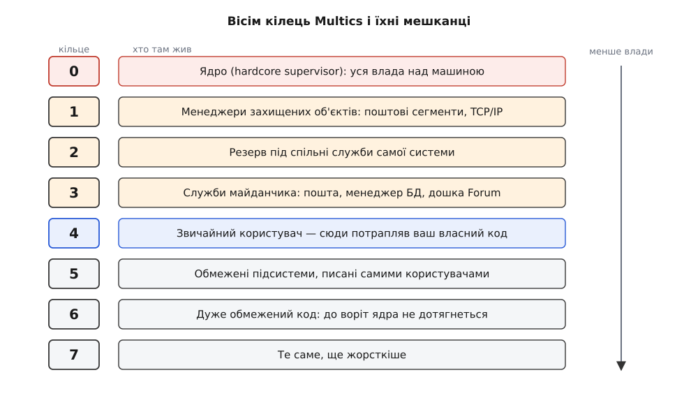
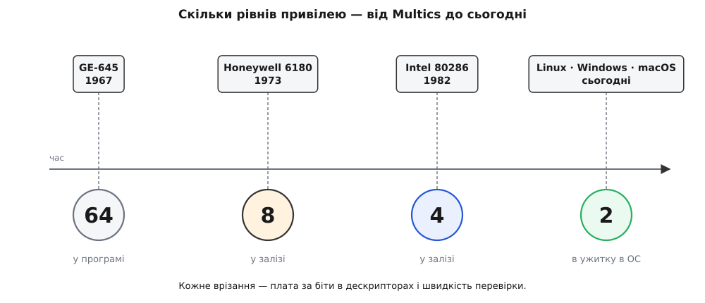

# 📜 Вісім кілець Multics: звідки взялася ієрархія привілеїв

Кільця захисту народилися не з бажання відгородити ядро від застосунків — для цього вистачало двох станів, які машини мали й до того. Їх породила тісніша задача: збудувати обчислювальну послугу для тисяч чужих одне одному людей, де й сам наглядач за машиною завеликий, щоб довіряти йому цілком. Із цієї задачі за вісім років виросли концентричні рівні довіри — спершу шістдесят чотири, вдавані програмою, а потім вісім, упаяні в кремній.

## Комп'ютер як комунальна послуга

1961 року Фернандо Корбато (Fernando J. Corbató) запустив у Массачусетському технологічному інституті CTSS — Compatible Time-Sharing System, одну з перших систем [розподілу часу](topic:programming/time-sharing-history), де машина по черзі приділяє кожному користувачеві кілька мілісекунд, і кожному здається, що комп'ютер його власний. CTSS довела, що це працює. Наступна думка була амбітніша: якщо машина може обслуговувати багатьох, хай вона стане послугою — як електрика чи телефон. Вмикаєш термінал, дістаєш обчислення, платиш за спожите.

Саме це записано в назві наступника: **Multics** — Multiplexed Information and Computing Service, «служба». Проєкт розпочали 1965 року спільно MIT Project MAC, Bell Telephone Laboratories й підрозділ великих машин General Electric; шість статей з описом задуму автори виклали на Fall Joint Computer Conference на зламі листопада й грудня 1965-го. Корбато очолював розробку в MIT і 1990 року дістав за CTSS і Multics премію Тюрінга.

Але задум послуги сам собою породив задачу захисту, та ще й гострішу, ніж у звичайного мейнфрейма. Комунальна послуга не має права питати клієнтів, чи довіряють вони одне одному: до неї приходять незнайомці, і їхні програми водночас лежать в одній пам'яті. Машина мусить розсудити їх сама.

## Чому двох станів забракло

Двоїстий поділ — привілейований наглядач і непривілейований користувач — на цю задачу відповідає лише наполовину, і винні дві різні речі.

Перша: наглядач розростається. У послузі, що працює цілодобово, він робить усе — тримає файлову систему, ганяє диски, обслуговує термінали, веде облік спожитого, робить резервні копії. Якщо кожен рядок цього коду має повну владу, то помилка в обліковій підпрограмі здатна затерти чужі файли. Обсяг цілком довіреного коду росте разом з обсягом послуги, а разом з ним росте й ціна кожної недбалості. Розробники Multics перевірили це просто: винесли кілька процедур наглядача, яким потрібен захист, але не потрібні всі привілеї, у проміжний рівень між користувачами й головним наглядачем — і, за їхнім же підсумком, дослід засвідчив, що таке розшарування справді зменшує кількість коду, якому доводиться давати всі права.

Друга: сама програма посеред роботи міняє те, що їй можна. Шредер і Солцер сформулювали це як внутрішню потребу багатьох обчислень — щоб права процесу змінювалися, коли точка виконання переходить із однієї програми в іншу. Уявіть, що ви купили чужу підсистему нарахування зарплатні: вона мусить читати таблиці ставок, яких вам бачити не можна, а працює вона над вашими даними, яких її авторові бачити не можна. Двома станами це не записується взагалі: потрібен рівень, сильніший за користувача й слабший за наглядача. Так задача перестала бути «як захистити ядро» і стала «як дати обчисленню кілька різних ступенів довіри».

## Троє, що запропонували сходи

Хто саме придумав кільця, у Multics зафіксовано без легенд. У праці, що описала їхню апаратну реалізацію, сказано просто: початкову думку узагальнити відношення «наглядач — користувач» до багатокільцевої структури подали Р. М. Ґрем, Е. Л. Ґлейзер і Ф. Х. Корбато.

Едвард Ґлейзер (Edward L. Glaser) народився 1929 року в Еванстоні, у вісім років цілком осліп і став головним проєктувальником апаратної частини Multics; разом із Джоном Кулером (John Couleur) із General Electric він доробив серійну GE-635 до GE-645, додавши сегментацію, сторінкову пам'ять і асоціативний кеш перекладу адрес. Роберт Ґрем (Robert M. Graham) виклав ідею друком — стаття «Protection in an information processing utility» у Communications of the ACM за травень 1968 року.

Чому саме лінійні сходи, а не довільна мережа доменів довіри? Причина суто інженерна. Перевірка прав спрацьовує на кожному зверненні до пам'яті, тобто мільйони разів на секунду, і мусить уміститися в розшифрувальник команд. Якщо рівні впорядковані числами, питання «чи можна?» — це одне порівняння двох маленьких цілих, кілька вентилів. Будь-яка багатша структура вимагає заглянути в таблицю, а таблиця — це пам'ять, затримка й новий стан, який теж треба захищати. Строгий порядок обрали не з любові до простоти, а тому, що лише він був по кишені залізу.

> 🔧 **Навіщо це.** Саме ця дешевизна й вирішила долю кілець. Механізм, що коштує одне порівняння, можна поставити в кожен процесор світу й нікому не пояснювати, чому машина стала повільніша. Виразніші моделі захисту, що вимагають пошуку в таблиці на кожен доступ, лишилися в дослідних машинах — не тому, що були гірші за задумом, а тому, що за них треба було платити на кожній команді.

## Шістдесят чотири кільця, яких не було в залізі

GE-645 приїхала в Project MAC у січні 1967-го; у грудні того ж року Multics уперше завантажилася на ній самостійно, а платним користувачам систему відкрили в жовтні 1969-го. Тільки от кілець у цьому залізі не було. Ґлейзер із Кулером дали машині сегментацію й сторінки — тобто [апарат перекладу адрес](topic:programming/virtual-memory), який відображає адреси програми на фізичну пам'ять через таблицю дескрипторів, — але привілей у 645-й лишався двійковим: господар або слуга.

Тож кільця зробили програмою. Ґрем і Роберт Дейлі (Robert C. Daley) вигадали схему з окремим сегментом дескрипторів на кожне кільце: перехід між кільцями означав підміну самої таблиці перекладу, а отже — підміну того, до чого код узагалі здатен дотягнутися. Кілець у цій схемі було шістдесят чотири, з номерами 0–63. Учасники проєкту фіксують це прямо: на GE-645 шістдесят чотири кільця були ілюзією, створеною програмою, тоді як вісім кілець Honeywell 6180 підтримувало залізо.

Ілюзія коштувала дорого. Кожен перехід між кільцями обертався пасткою в наглядача, який перевіряв права й переправляв виклик далі. Honeywell згодом описала це у власному патенті на кільцеву апаратуру так: оскільки в Multics і на 645-й кільцевий захист був утілений здебільшого програмно, він тягнув за собою чималі накладні витрати наглядача, надто коли виклики йшли до більшої або меншої влади через пастку в системну процедуру.

Тут і проступає розрив, який визначив усю подальшу історію кілець: шістдесят чотири рівні існували на папері, а роботу виконували одиниці з них — рівно стільки, скільки система могла собі дозволити оплатити переходами.

## Ворота, дужки й один-єдиний виклик

Ідея зробити кільця апаратними визрівала шість років, у три кроки. 1967-го Ґрем запропонував часткове залізо: три номери кільця просто в дескрипторі сегмента плюс регістр поточного кільця — але програмне втручання на кожному переході лишалося. Повну автоматизацію викликів усередину й повернень назовні запропонували в дисертації 1969 року. А закінчену конструкцію Майкл Шредер (Michael D. Schroeder) і Джером Солцер (Jerome H. Saltzer) виклали в березневому номері Communications of the ACM за 1972 рік — «A Hardware Architecture for Implementing Protection Rings».

Її серце — не заборона, а **дужки кілець**. Кожен сегмент носить у своєму дескрипторі три номери: найвище кільце, з якого в нього можна писати; найвище кільце, з якого його можна читати (не менше за попереднє); і найвище кільце, з якого його можна викликати як ворота. Тобто право — це не «так чи ні», а смуга кілець, у якій воно чинне. Одразу видно, чому потрібен саме порядок: смугу задають два числа, і належність до неї — знову ж таки пара порівнянь.

**Ворота** (gates) розв'язують іншу половину задачі. Пускати зовнішній код усередину можна лише в точки, які внутрішній код оголосив сам, — інакше зловмисник стрибнув би в середину привілейованої процедури, поминувши її перевірки. Ворота — це перелік дозволених входів, і саме вони роблять внутрішнє кільце господарем власного початку.

Найелегантніша риса цієї конструкції — те, що виклику крізь кільце не потрібна окрема команда: за словами самих авторів Multics, виклик процедури з одного кільця захисту в інше користується точно тими самими механізмами, що й виклик між процедурами всередині одного кільця. Програміст пише звичайний виклик; залізо саме помічає, що сегмент лежить в іншій смузі, і міняє рівень.

Дві речі ця конструкція вимагала окремо. Кожне кільце дістає власний сегмент стека — інакше внутрішній код лишав би свої дані там, куди зовнішній має доступ. І, найважче, викликана процедура мусить уміти перевірити посилання на аргументи, щоб її не обманули й не змусили прочитати чи переписати те, чого сам викликач торкнутися не міг. Це та сама пастка, яку пізніше назвали [заплутаним заступником](topic:programming/confused-deputy) — коли привілейований посередник виконує чуже прохання своєю владою, не спитавши, чи мав прохач на це право. Ворота захищають вхід, але не наміри того, хто в них постукав.

## Вісім у кремнії — і скільки з них справді жило

1970 року General Electric продала комп'ютерний бізнес Honeywell, тож наступник 645-ї вийшов уже під іншою маркою: модель Honeywell 6180 оголосили в січні 1973-го в бостонському Музеї науки. Кільця в ній були апаратні — і їх було вісім.

Чому саме вісім, а не обіцяні шістдесят чотири? Бо в залізі номер кільця перестає бути абстракцією й стає полем, яке треба вмістити в кожен дескриптор сегмента, у кожен покажчиковий регістр, у кожне непряме слово — і не по одному разу:

```
Ціна кільця в дескрипторі сегмента

  8 кілець   → log₂ 8  = 3 біти на номер
  64 кільця  → log₂ 64 = 6 бітів на номер

  дужок на сегмент — три (запис, читання, ворота):
  8 кілець   → 3 · 3 = 9 бітів у КОЖНОМУ дескрипторі
  64 кільця  → 3 · 6 = 18 бітів у КОЖНОМУ дескрипторі
```

Дев'ять бітів на дескриптор система витримувала; вісімнадцять — за рівні, якими ніхто не користувався, — уже ні. Число рівнів урізали не з міркувань стрункості, а тому, що кожен зайвий рівень треба оплачувати в кожному дескрипторі кожного сегмента.

У живій системі ці вісім розійшлися так. Кільце 0 — тверде осердя наглядача (hardcore supervisor), уся влада над машиною. Кільце 1 — менеджери об'єктів із розширеним доступом: поштові сегменти, а згодом і багаторівнево захищений стек TCP/IP. Кільце 2 лишили під спільні служби самої системи. Кільце 3 — під служби, що їх постачає не виробник, а сам майданчик: там жили поштова система, менеджер бази даних і дошка оголошень Forum. Кільце 4 — звичайний користувач: саме туди потрапляла програма, яку ви щойно скомпілювали. Кільце 5 часто правило за обмежене користувацьке кільце для підсистем, писаних самими користувачами. А в кільцях 6 і 7 жив код, якому довіряли найменше: з них не можна було покликати навіть ворота наглядача, тож будь-яку системну послугу для них мусило посередничити котресь внутрішнє кільце.



*Вісім апаратних кілець Honeywell 6180 і те, який код жив у кожному з них: звичайний користувач сидів посередині драбини, а половина рівнів існувала для коду, якому довіряли менше, ніж йому.*

Найважливіше в цій драбині — де на ній стоїть звичайний користувач. Не з краю, а посередині: чотири кільця над ним і три під ним. Multics будувала рівні не тільки вгору, до ядра, а й **униз** — щоб користувач міг запустити чуже приладдя з іще меншими правами, ніж має сам. Саме ця, нижня половина драбини й зникла в пізніших архітектурах повністю.

## Суперечка, яку кільця не виграли

У кільцях зашита одна сильна вимога: довіра цілком упорядкована. Про будь-яких два рівні можна сказати, який із них надійніший, і вужчий завжди вкладений у ширший.

Але задача, з якої все почалося, цій вимозі не підкоряється. Дві підсистеми, що підозрюють одна одну й мусять працювати в одному обчисленні, не впорядковуються ніяк: жодна не має бути всередині другої. І сказав це вголос той самий Шредер: у вересні 1972-го, того самого року, коли вийшла його стаття про апаратні кільця, він захистив у MIT дисертацію «Cooperation of Mutually Suspicious Subsystems in a Computer Utility» — про поділ обчислення на незалежні, не вкладені одна в одну області прав. Людина, що завела кільця в залізо, того ж року письмово пояснила, чого кільцями не досягти.

Альтернативу розробляв інший табір. Джек Денніс (Jack B. Dennis) і Ерл Ван Горн (Earl C. Van Horn) ще 1966 року описали [мандати доступу](topic:programming/capability-based-security) — непідробні квитки на конкретний об'єкт, які програма носить із собою; хто має квиток, той має право, і жодного порядку рівнів для цього не треба. Роберт Фейбрі (Robert S. Fabry) 1974-го показав, як зробити мандат самою адресою, а втілили модель у дослідних машинах: Hydra в Карнеґі-Меллон і CAP у Кембриджі.

Мандати виразніші за кільця — вони описують і взаємну підозру, і найменші привілеї без жодних припущень про ієрархію. Проте виграли кільця, і виграли не аргументом, а ціною: порівняння двох чисел коштує кілька вентилів у розшифрувальнику команд, а за перевірку мандата треба платити пошуком у таблиці й цілою окремою моделлю пам'яті. Це не легенда й не суперечка про смаки — це задокументоване розходження двох шкіл захисту, у якому дешевший механізм розійшовся по всіх процесорах, а виразніший лишився в лабораторіях.

## Що з Multics пішло далі

Квітень 1969-го: Bell Labs вийшли з проєкту — надто дорого, надто довго. Двоє їхніх учасників, Кен Томпсон і Денніс Рітчі, узялися складати щось значно менше на майже незайманій PDP-7. За спогадами самого Рітчі, назву Unics вигадав як каламбур на Multics Браян Керніган: там, де Multics був *multiplexed*, новий став *uniplexed* — згодом акронім стерся й лишилося Unix. Іронія в тому, що найвпливовіший нащадок Multics обійшовся розрізненням ядра й користувача, тобто рівно тим двоїстим поділом, який кільця й мали замінити.

Саме залізо кільцевого захисту пішло в промислову власність: Honeywell Information Systems подала заявку на патент «Ring checking hardware» 12 грудня 1973 року й дістала його 28 жовтня 1975-го — і саме звідти, з тексту патенту, походить чи не найчіткіше формулювання, що філософія Multics послуговується шістдесятьма чотирма кільцями захисту з номерами 0–63.



*Шлях числа рівнів: шістдесят чотири програмних кільця на GE-645, вісім апаратних на Honeywell 6180, чотири в захищеному режимі Intel 80286 — і два, якими послуговуються сьогоднішні операційні системи.*

Сама Multics прожила довго: останній її майданчик, у канадському Міністерстві національної оборони в Галіфаксі, вимкнули 30 жовтня 2000 року. Але кільця пережили її з великим запасом — історики самого проєкту зауважують це без зайвої скромності: концепцію винайдено на Multics, а стандартною частиною архітектури Intel і Windows вона стала згодом. Із шістдесяти чотирьох рівнів комунальної обчислювальної послуги до нас дійшов той самий кістяк — номер поточного рівня, смуга дозволених рівнів на кожен об'єкт і ворота як єдиний законний вхід усередину.
