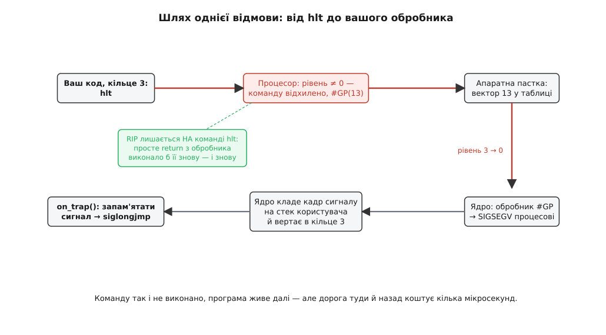
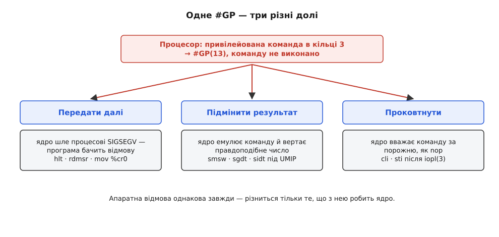

# ⚙️ Дослід: прочитати власний рівень привілею й вижити після відмови процесора

> Правило про привілейовані команди не конче брати на віру — його видно за п'ять хвилин. Невелика програма на C друкує номер кільця, у якому її запустили, а тоді по черзі підсовує процесорові вісім команд різної зухвалості й показує, чим саме він відповідає на кожну. Найцікавіше починається там, де відповідей виявляється не дві («можна» / «не можна»), а три.

## Задача

Хочеться дістати від машини два конкретні числа й одне спостереження.

Перше число — рівень, на якому просто зараз виконується наш код. Не «за книжкою має бути третє кільце», а те, що зараз стоїть у процесорі.

Друге — реакція заліза на заборонену команду. Не «буде помилка», а який саме сигнал прилітає процесові, з яким кодом, і чи встигла команда бодай частково подіяти.

Спостереження ж таке: програма мусить **пережити** відмову й піти далі. Це не косметика. Звичайний застосунок, що спробував привілейовану команду, просто вмирає — ядро вбиває його, і жодного протоколу досліду ми не побачимо. Щоб зібрати таблицю з восьми рядків, треба вісім разів упасти й вісім разів підвестися в тому самому процесі. Саме ця вимога перетворює десятирядковий трюк на невеличкий інженерний проєкт.

## Ідея

Задум розкладається на три незалежні частини, і кожна тримається на своїй властивості заліза.

**Спитати про рівень — дешево.** На x86-64 поточний рівень привілею живе не в окремому «регістрі кільця», а в двох молодших бітах селектора коду `CS`. Читати `CS` дозволено з будь-якого кільця: `mov %cs, %ax` — команда непривілейована. Логіка тут проста: знання власного рівня не дає жодної нової влади. Ви й так відчуваєте його на дотик — за тим, що вам дозволено. Дістати це число з C можна одним рядком запису `__asm__ volatile ("…" : "=r"(x))`: він вставляє в код конкретну машинну команду й каже компіляторові, у яку змінну покласти результат, а слово `volatile` забороняє оптимізаторові викидати команду, що з його погляду «нічого не робить». Цей спосіб уплести машинний код у C зветься [вбудованим асемблером](topic:programming/inline-assembly).

**Дізнатися про відмову — теж просто, бо ядро саме розкаже.** Коли непривілейований код чіпає привілейовану команду, процесор бере виключення загального захисту, `#GP` — той самий механізм, що й на всяку іншу помилку виконання: [керування вривається й стрибає на наперед задану адресу](topic:programming/cpu-exception-handling), тільки цього разу з підвищенням рівня. Далі керує ядро, і на Linux воно перетворює `#GP` користувацького коду на сигнал `SIGSEGV`. [Сигнал](topic:programming/posix-signals) — це асинхронне повідомлення процесові, на яке можна поставити власну функцію-обробник через `sigaction`; поки обробника нема, діє типова поведінка, а для `SIGSEGV` вона одна — смерть процесу. Отже, перехоплення відмови зводиться до одного виклику `sigaction`.

**Вижити після відмови — ось де вся складність.** Обробник викликано, ми знаємо, що прилетіло. Що далі? Здається, досить просто повернутися з обробника. Але після `#GP` збережений лічильник команд показує **на** ту саму команду, а не за неї: на той самий `hlt`, який щойно не пройшов. Повернувшись, процесор виконає його знову, знову дістане `#GP`, знову покличе обробник — і так до нескінченності. Тому вихід з обробника мусить бути **нелокальним**: `sigsetjmp` запам'ятовує точку в основному коді, `siglongjmp` з обробника стрибає туди назад, минаючи звичайне повернення. Стандартна пара для саме такої задачі.

## Код

Одна програма, вісім дослідів. Збирається без жодних бібліотек: `cc -O2 -o privtrap privtrap.c`.

```c
/* privtrap.c — питає процесор про власний рівень і ловить його відмови.
 * Linux, x86-64.  Збірка:  cc -O2 -o privtrap privtrap.c
 */
#define _GNU_SOURCE
#include <setjmp.h>
#include <signal.h>
#include <stdio.h>
#include <string.h>

static sigjmp_buf resume;                   /* куди вертатися після пастки */
static volatile sig_atomic_t got_signo;     /* що прилетіло */
static volatile sig_atomic_t got_code;
static volatile unsigned long produced;     /* що команда встигла повернути */

/* Обробник. Друкувати тут не можна: в обробнику дозволені лише
   async-signal-safe виклики, а printf до них не належить. */
static void on_trap(int signo, siginfo_t *si, void *uctx)
{
    (void)uctx;
    got_signo = signo;
    got_code  = si->si_code;
    siglongjmp(resume, 1);   /* просте return запустило б ту саму команду наново */
}

/* CPL — два молодші біти селектора CS. Читати CS дозволено з будь-якого кільця. */
static unsigned cpl(void)
{
    unsigned short cs;
    __asm__ volatile ("mov %%cs, %0" : "=r"(cs));
    return cs & 3u;
}

/* Піддослідні команди. volatile — щоб оптимізатор не викинув те,
   що з його погляду не має видимого наслідку. */
static void t_nop  (void) { __asm__ volatile ("nop"); }
static void t_hlt  (void) { __asm__ volatile ("hlt"); }
static void t_cli  (void) { __asm__ volatile ("cli"); }
static void t_cr0  (void) { unsigned long v;
                            __asm__ volatile ("mov %%cr0, %0" : "=r"(v));
                            produced = v; }
static void t_rdmsr(void) { unsigned int lo, hi;
                            __asm__ volatile ("rdmsr" : "=a"(lo), "=d"(hi)
                                                      : "c"(0xC0000080u));
                            produced = ((unsigned long)hi << 32) | lo; }
static void t_smsw (void) { unsigned short w;
                            __asm__ volatile ("smsw %0" : "=r"(w));
                            produced = w; }
static void t_sldt (void) { unsigned short s;
                            __asm__ volatile ("sldt %0" : "=r"(s));
                            produced = s; }
static void t_ud2  (void) { __asm__ volatile ("ud2"); }

struct probe { const char *mnem; void (*run)(void); const char *what; };

static void try_one(const struct probe *p)
{
    got_signo = 0;
    produced  = 0;
    if (sigsetjmp(resume, 1) == 0) {     /* 1 — зберегти й відновити маску сигналів */
        p->run();
        printf("  %-6s виконано, результат 0x%lx   (%s)\n",
               p->mnem, produced, p->what);
    } else {
        printf("  %-6s пастка: %s, si_code=%d   (%s)\n", p->mnem,
               strsignal((int)got_signo), (int)got_code, p->what);
    }
}

int main(void)
{
    static const struct probe probes[] = {
        { "nop",   t_nop,   "звичайна команда — контрольний дослід" },
        { "hlt",   t_hlt,   "спинити процесор" },
        { "cli",   t_cli,   "вимкнути переривання" },
        { "cr0",   t_cr0,   "прочитати керівний регістр CR0" },
        { "rdmsr", t_rdmsr, "прочитати машинний регістр EFER" },
        { "smsw",  t_smsw,  "прочитати молодші 16 бітів CR0 (спадок 80286)" },
        { "sldt",  t_sldt,  "прочитати селектор локальної таблиці дескрипторів" },
        { "ud2",   t_ud2,   "завжди невизначена команда — для порівняння" },
    };
    struct sigaction sa;
    size_t i;

    printf("рівень привілею цього процесу: CPL = %u\n\n", cpl());

    memset(&sa, 0, sizeof sa);
    sa.sa_sigaction = on_trap;
    sa.sa_flags     = SA_SIGINFO;
    sigemptyset(&sa.sa_mask);
    sigaction(SIGSEGV, &sa, NULL);   /* сюди Linux переводить #GP */
    sigaction(SIGILL,  &sa, NULL);   /* а сюди — #UD */

    for (i = 0; i < sizeof probes / sizeof probes[0]; i++)
        try_one(&probes[i]);
    return 0;
}
```

Вісім піддослідних команд підібрано не навмання. `nop` — контроль: якщо вже й вона впала, зламано саму оснастку. `hlt`, `cli`, `mov %cr0`, `rdmsr` — чотири різні способи вкласти руки в машину: спинити кристал, заглушити переривання, перепрограмувати режим процесора, залізти в машинний регістр. `smsw` і `sldt` — старі команди читання, що колись були дозволені всім. `ud2` — навпаки, команда, чия єдина робота полягає в тому, щоб бути невизначеною: процесор гарантовано відповідає на неї `#UD`. Вона потрібна, щоб відрізнити відмову «не маєш права» від відмови «такого слова взагалі не існує».

## Що воно друкує

На типовій машині з Linux і сучасним процесором Intel чи AMD вивід виглядає приблизно так:

```
рівень привілею цього процесу: CPL = 3

  nop    виконано, результат 0x0    (звичайна команда — контрольний дослід)
  hlt    пастка: Segmentation fault, si_code=128    (спинити процесор)
  cli    пастка: Segmentation fault, si_code=128    (вимкнути переривання)
  cr0    пастка: Segmentation fault, si_code=128    (прочитати керівний регістр CR0)
  rdmsr  пастка: Segmentation fault, si_code=128    (прочитати машинний регістр EFER)
  smsw   виконано, результат 0x33    (прочитати молодші 16 бітів CR0 …)
  sldt   пастка: Segmentation fault, si_code=128    (прочитати селектор LDT)
  ud2    пастка: Illegal instruction, si_code=2    (завжди невизначена команда …)
```

Перший рядок — головний. `CPL = 3`: код застосунку справді біжить у третьому кільці, і це не домовленість, а зчитаний із процесора стан.

Далі варто читати не назви сигналів, а числа в `si_code` — саме вони показують, звідки помилка взялася. `si_code = 128` — це `SI_KERNEL`, «сигнал породило ядро десь усередині себе», без адреси-винуватця. Так і має бути: `#GP` не має «поганої адреси», зіпсована тут сама команда. Через це `SIGSEGV` від привілейованої команди легко переплутати зі звичайним розіменуванням нульового вказівника — але в того `si_code` буде `SEGV_MAPERR` (1) і `si_addr` покаже адресу. Одне поле розводить два зовсім різні діагнози.

`ud2` дає `SIGILL` із `si_code = 2` — це `ILL_ILLOPN`. Ядро розрізняє два докори: «команди нема» (`#UD` → `SIGILL`) і «команда є, але не для тебе» (`#GP` → `SIGSEGV`). Різниця не косметична: перше означає, що ви зібрали код під інший процесор, друге — що ви полізли не в своє кільце.

І одна аномалія, повз яку не пройти: `smsw` **виконалася**. Команда читає молодші шістнадцять бітів `CR0` — того самого регістра, до якого `mov %cr0` щойно не пустив. Значення `0x33` розкладається на біти `PE` (захищений режим), `MP`, `ET` і `NE`. Тобто половина того самого регістра доступна непривілейованому коду через іншу команду. Це не помилка нашого досліду — це шов в архітектурі, і про нього окрема розмова нижче.

## Чому просте `return` з обробника — нескінченний цикл

Найтонше місце програми — `siglongjmp`, і варто побачити, чому без нього нічого не працює.

Процесорні виключення діляться за тим, куди показує збережений лічильник команд. У **пастки** (*trap*, як-от покрокова зупинка налагоджувача) він показує на **наступну** команду: та, що спричинила виключення, уже виконалася. У **помилки** (*fault*, як `#GP` чи промах сторінки) — на **ту саму** команду, бо вона не виконалася й машина стоїть рівно в тому стані, що був до неї. Задум прозорий: помилка на те й помилка, щоб її можна було полагодити й спробувати ще раз. Промах сторінки саме так і працює — ядро підвантажує сторінку, вертається на команду, і та проходить.

Для нас цей задум обертається пасткою в буквальному сенсі. Полагодити `#GP` від `hlt` неможливо: ядро не підніме нам рівень. Отже, повторна спроба дасть той самий `#GP`, і програма зациклиться в парі «команда — обробник», не з'ївши жодного байта пам'яті й не лишивши сліду в жодному журналі. `siglongjmp` розриває це коло, викидаючи керування в наперед збережену точку основного коду.



*Шлях однієї відмови туди й назад. Лічильник команд лишається на самій команді `hlt`, тому вийти з обробника звичайним поверненням не можна.*

Є й другий спосіб — не тікати, а **переступити**. Третій параметр обробника, `void *uctx`, вказує на структуру `ucontext_t` із копією регістрів на момент помилки; збільшивши в ній збережений `RIP` на довжину команди, ми змусимо процесор продовжити з наступної. Виглядає елегантно, але спирається на знання, якого в обробника нема: довжини команди. На x86 команди [різної довжини](topic:programming/isa) — від одного байта (`hlt` — це `F4`) до п'ятнадцяти, і щоб дізнатися довжину, обробник мусив би розшифрувати машинний код за адресою помилки. Саме тому цей шлях лишають тим, хто вже й так має декодер команд: ядрам, емуляторам, гіпервізорам. Для досліду `siglongjmp` чесніший.

> 🔧 **Навіщо це.** Гарантія «команда з помилкою не виконалася зовсім» — це не подробиця, а фундамент. На ній стоїть уся підміна поведінки заліза: гіпервізор ловить спробу гостьового ядра залізти в керівний регістр, підставляє своє значення й переступає команду — [гість не помічає, що машина під ним не справжня](topic:programming/hardware-virtualization). На ній же стоять точки зупинку в налагоджувачі та підвантаження сторінок з диска. Якби помилкова команда встигала подіяти наполовину, полагодити стан і повторити спробу було б неможливо, і жоден із цих механізмів не існував би.

## Три різні долі одного `#GP`

Дослід зі `smsw` показує головне непорозуміння цієї теми. Здається, що відповідей дві: команду виконано або відхилено. Насправді ядро, діставши `#GP`, має три виходи — і всі три трапляються.



*Апаратна відмова однакова завжди — різниться тільки те, що з нею робить ядро.*

**Передати далі.** Найпростіший шлях: перетворити `#GP` на `SIGSEGV` і віддати процесові. Так поводяться `hlt`, `cli` без спеціальних дозволів, `mov %cr0`, `rdmsr`.

**Підмінити результат.** Історія `smsw` тут показова. Команди `sgdt`, `sidt`, `sldt`, `smsw` і `str` дійшли з 80286 і читають системні дані: адреси таблиць дескрипторів, статус машини. У захищеному режимі вони лишилися **непривілейованими** — рішення, яке в 1982-му виглядало нешкідливим, а згодом стало каналом витоку: за адресами таблиць дескрипторів можна намацати, де в пам'яті лежить ядро, і тим полегшити злам. Дірку закрили в кремнії лише наприкінці 2010-х: біт `UMIP` (*User-Mode Instruction Prevention*) у регістрі `CR4` з'явився в Intel Goldmont Plus (грудень 2017-го) і Cannon Lake, згодом і в AMD Zen 2. Коли він піднятий, усі п'ять команд дають `#GP` при `CPL > 0`. Але ввімкнути це наосліп було не можна — на цих командах трималися Wine та DOSEMU. Тому Linux ловить таке `#GP` і **емулює** три з п'яти: `smsw` вертає значення `CR0` на час завантаження, `sgdt` і `sidt` — навмисне фіктивні адреси (`0xfffffffffffe0000` і `0xffffffffffff0000`) із нульовою межею. Команда `smsw` насправді не виконалася — вам просто відповіли правдоподібним числом. `sldt` і `str` ядро не емулює — звідси `SIGSEGV` у нашому виводі. На старішому процесорі без `UMIP` той самий рядок покаже `виконано, результат 0x0`: там `sldt` іде без жодної пастки.

**Проковтнути.** Найдивніший вихід. На x86 доступ до портів вводу-виводу історично регулювався полем `IOPL` у прапорцях, і виклик `iopl(3)` піднімав його до третього рівня, попутно дозволяючи процесові `cli` та `sti`. Застосунок, що вимкнув переривання, легко вішає всю машину, тож у Linux 5.5 це прибрали: тепер `iopl()` роздає порти через бітову мапу вводу-виводу, а `IOPL` не піднімає взагалі. Старий код на цьому б посипався, тому ядро пішло на компроміс — після `iopl(3)` обробник `#GP` вважає `cli` та `sti` за порожні команди й мовчки переступає їх. Тобто команда не виконалася, помилки нема, і програма впевнена, що перериванням кінець. Не запускайте наш дослід після `iopl(3)`: рядок із `cli` покаже `виконано`, і це буде найчеснішою брехнею в усій таблиці.

Спільний висновок один: апаратна перевірка рівня безумовна й однакова завжди. Уся різноманітність поводження — вище, у ядрі, яке вирішує, що сказати процесові про відмову.

## На ARM навіть питання привілейоване

Перенести дослід на AArch64 неможливо в найпершому рядку — і це саме по собі відповідь.

```c
/* AArch64: міняються лише тіла дослідів, решта програми та сама. */
static void t_currentel(void) { unsigned long v;
    __asm__ volatile ("mrs %0, CurrentEL" : "=r"(v)); produced = v >> 2; }
static void t_sctlr(void)     { unsigned long v;
    __asm__ volatile ("mrs %0, sctlr_el1" : "=r"(v)); produced = v; }
static void t_ctr(void)       { unsigned long v;
    __asm__ volatile ("mrs %0, ctr_el0"  : "=r"(v)); produced = v; }
static void t_isar0(void)     { unsigned long v;
    __asm__ volatile ("mrs %0, id_aa64isar0_el1" : "=r"(v)); produced = v; }
```

Регістр `CurrentEL` тримає номер поточного рівня виключень — рівно те, що ми питали на x86 через `CS`. Але доступ до нього означено лише з `EL1` і вище; на `EL0` така команда взагалі не означена — процесор бере виключення невизначеної команди, і Linux шле `SIGILL` із `si_code = 1` (`ILL_ILLOPC`). Спитати «на якому я рівні» з користувацького коду не можна. Відповідь доводиться діставати від протилежного: якщо `mrs CurrentEL` впала — ви на `EL0`.

Решта рядків дає ту саму тріаду, що й на x86. `sctlr_el1` — керівний регістр системи, `SIGILL`. `ctr_el0` — регістр із параметрами кешу, чесно дозволений `EL0`, бо потрібен бібліотекам для очищення кеша. А `id_aa64isar0_el1` формально належить `EL1` — і все ж прочитається: Linux ловить це виключення й **емулює** читання для невеликого списку регістрів-описів процесора, віддаючи причесане (*sanitised*) значення, однакове на всіх ядрах машини. Той самий прийом, що зі `smsw`, тільки тут ядро не приховує систему, а навпаки — навмисне ділиться інформацією про набір команд, бо без неї бібліотеки не можуть вибрати оптимізовану реалізацію.

Показово й те, як ARM називає речі. Тут нема «кілець» і «привілейованих команд» як окремої категорії — є **рівні виключень** `EL0`–`EL3`, і рівень міняється винятково тоді, коли процесор бере виключення або вертається з нього. Правило єдиних дверей не додано збоку, а зведено в саму назву механізму.

## Windows називає відмову на ім'я

На Windows той самий дослід збирається навколо структурної обробки виключень, і відмову там видно чіткіше, ніж на Linux:

```c
/* MSVC, x64: вбудованого __asm нема — hlt виносять в окремий .asm-файл
   і викликають як звичайну функцію void do_hlt(void); */
__try {
    do_hlt();
}
__except (GetExceptionCode() == EXCEPTION_PRIV_INSTRUCTION   /* 0xC0000096 */
              ? EXCEPTION_EXECUTE_HANDLER : EXCEPTION_CONTINUE_SEARCH) {
    puts("процесор відмовив: привілейована команда");
}
```

Код `0xC0000096`, `STATUS_PRIVILEGED_INSTRUCTION`, означає буквально «спроба виконати привілейовану команду» — окремий, ні з чим не змішаний діагноз. А Linux зливає всі `#GP` в один `SIGSEGV` разом зі зверненнями до чужої пам'яті, і розрізняти доводиться за `si_code`. Апаратура під обома системами однакова до біта; різна лише мова, якою ОС переказує процесові одну й ту саму відмову заліза.

## Скільки коштує одна відмова

Дослід дає нагоду зміряти те, про що зазвичай говорять на пальцях: ціну походу в ядро й назад через пастку.

```c
/* потребує #include <time.h> */
static void bench(unsigned n)
{
    struct timespec a, b;
    volatile unsigned i;      /* volatile — бо міняється між sigsetjmp і siglongjmp */

    clock_gettime(CLOCK_MONOTONIC, &a);
    for (i = 0; i < n; i++)
        if (sigsetjmp(resume, 1) == 0)
            __asm__ volatile ("hlt");
    clock_gettime(CLOCK_MONOTONIC, &b);

    printf("одна відмова ≈ %.0f нс\n",
           ((double)(b.tv_sec - a.tv_sec) * 1e9 + (b.tv_nsec - a.tv_nsec)) / n);
}
```

Порядок величини на сучасній машині — одиниці мікросекунд на одну відмову. Порівняння того варте:

```
однобайтова команда hlt          ≈ 0.3 нс  (один такт на 3 ГГц)
одна відмова: #GP → SIGSEGV → siglongjmp
                                 ≈ 1000…3000 нс
відношення                       ≈ 3000…10000 разів
```

За ці мікросекунди відбувається чимало: апаратний перехід у кільце 0 зі зміною стека, робота обробника ядра, побудова кадру сигналу на стеку користувача, повернення в кільце 3 на обробник, системний виклик `rt_sigreturn` на виході з нього і ще одна зміна рівня. Кожен крок сам по собі недорогий — їх просто багато.

Звідси прямий інженерний висновок. Пастка — чудовий механізм для **рідкісних** подій: помилки, підвантаження сторінки, звернення до пристрою. Але вбудовувати її в гарячий шлях згубно: гіпервізор, що ловив би кожне звернення гостя до таймера, з'їв би на цьому весь виграш віртуалізації. Саме тому апаратна віртуалізація роками зводилася до одного — прибрати з гарячого шляху якнайбільше пасток: тіньові копії керівних регістрів, апаратна трансляція сторінок, прямий доступ гостя до частини регістрів переривань. Ціна одного походу через ворота лишається тією самою; виграють на тому, що ходять рідше.

Є в цьому й дрібна іронія, помітна лише коли дивишся на протокол досліду. Рядок `printf`, яким програма звітує про спійману відмову, сам іде в ядро — через `write`, тобто через [системний виклик](topic:programming/system-call), законні двері між кільцями. Кожен рядок протоколу доводить обидві половини правила воднораз: самовільно в ядро не потрапиш, а по запрошенню — будь ласка.

## Тонкощі, на яких така програма ламається

Кілька місць, де правильний на вигляд код мовчки псується.

**`printf` в обробнику.** Обробник сигналу може перервати основний код будь-де, зокрема посеред самого `printf`, — і тоді повторний вхід зіпсує внутрішній стан потоку виводу. В обробнику дозволено лише async-signal-safe функції, а `printf` до них не належить. Тому наш `on_trap` не друкує, а лише кладе два числа в змінні типу `sig_atomic_t` — тип, запис у який гарантовано неподільний.

**Маска сигналів.** Поки обробник працює, свій сигнал заблоковано, щоб він не прилетів рекурсивно. Вискочивши з обробника через `siglongjmp`, ми обходимо звичайне повернення — а разом із ним і зняття блокування. Другий `hlt` дав би `SIGSEGV` при заблокованому `SIGSEGV`, і ядро вбило б процес, бо синхронну помилку ігнорувати не можна. Рятує другий аргумент: `sigsetjmp(resume, 1)` наказує зберегти маску, `siglongjmp` її відновлює. З нулем замість одиниці програма надрукувала б рівно два рядки й померла.

**Змінні навколо `sigsetjmp`.** Локальні змінні без `volatile`, що змінилися між `sigsetjmp` і `siglongjmp`, після стрибка мають невизначене значення: компілятор міг тримати їх у регістрах, які стрибок не відновлює. Це не теорія, а класичне джерело [невизначеної поведінки](topic:programming/undefined-behavior), що вилазить лише під оптимізацією. Тому лічильник у `bench` оголошено `volatile`, а результати досліду винесено в глобальні змінні.

**Помилка через стек.** Наш дослід безпечний, бо стек цілий. Але якщо ловити `SIGSEGV` від переповнення стека, обробникові просто ніде виконуватися — і замість сигналу процес одразу вмре. Для такого випадку є `sigaltstack`: окремий стек під обробники, який вмикають прапорцем `SA_ONSTACK`.

**Компілятор і оптимізація.** `__asm__ volatile` обов'язковий: без `volatile` компілятор має право прибрати вставку, з якої нічого не виходить назовні, і дослід тихо перетвориться на вісім успіхів поспіль.

**Емулятори й пісочниці.** Під `qemu-user` чи іншим перекладачем команд картина може бути геть інша: там `hlt` не доходить до справжнього процесора, а обробляється програмно. Дослід має сенс лише на живому залізі або в повноцінній віртуальній машині — і це, зрештою, ще одне нагадування, що перевірка рівня є властивістю саме кремнію, а не програмної домовленості.
