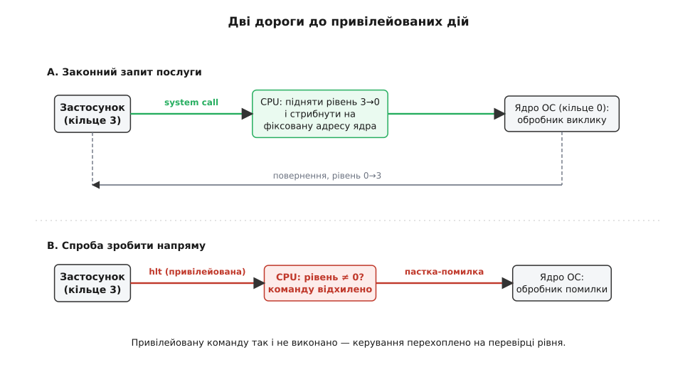
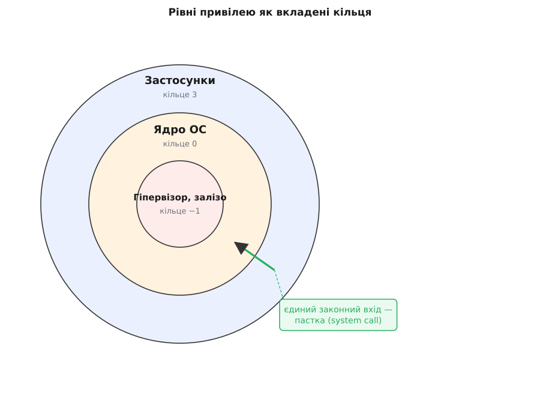

# Кільця захисту й рівні привілеїв

<preknowlist>
- [Набір інструкцій](topic:programming/isa) — команди процесора як його словник; серед них є такі, що напряму керують залізом.
- [Обробка виключень у процесорі](topic:programming/cpu-exception-handling) — пастка: як керування миттєво стрибає на наперед заданий обробник.
- [Віртуальна пам'ять](topic:programming/virtual-memory) — відображення адрес, що ізолює пам'ять кожної програми одну від одної.
</preknowlist>

Ваш текстовий редактор і операційна система живуть на одному процесорі, ділять ту саму оперативну пам'ять і той самий контролер диска. Процесор виконує ті байти, що потрапили йому на вхід, і геть не розрізняє, де довірене ядро, а де випадковий застосунок із мережі. Що ж тоді заважає зіпсованому редакторові виконати команду, яка знеструмлює кристал, або переписати таблицю відображення пам'яті й вичитати секрети вашого банківського застосунку? У самих лише «командах» — ніщо. Отже, апаратура мусить нести суддю всередині себе.

**Один біт стану.** Понад регістри й лічильник команд процесор тримає ще один клаптик стану — поточний рівень привілею (лат. *privilegium* — особливе право). Двох значень досить: привілейований (цілком довірений) і непривілейований (підозрюваний). Саме цей біт і визначає, на якому рівні процесор виконує кожну наступну команду.

**Небезпечні команди.** Жменя команд небезпечні не тим, що щось обчислюють, а тим, що чіпають машину як ціле: спиняють процесор, напряму говорять із портами пристроїв, вимикають переривання і — найголовніше — переписують таблиці, що відображають пам'ять. Такі команди позначають привілейованими: виконати їх дозволено лише на привілейованому рівні.

**Правило, вкарбоване в кремній.** Якщо рівень непривілейований, а наступна команда привілейована, процесор її не виконує. Замість цього він робить пастку — уриває команду й силоміць стрибає в наперед заданий обробник, [точно як на будь-яке інше виключення](topic:programming/cpu-exception-handling). Це не домовленість, від якої програма може відмовитися, а логіка розшифрування команд, впаяна в залізо. Тому застосунок фізично не здатен спинити машину чи перепрограмувати відображення пам'яті — спроба обертається помилкою, яку ловить ядро. Переконатися в цьому можна навіть із-під звичайної програми: [коротка програма читає власний рівень і, напоровшись на привілейовану команду, ловить від процесора відмову](topic:programming/protection-rings/proj-privileged-trap.md).

**Але застосункові потрібна ОС.** Програмі однаково треба відкривати файли, просити пам'ять, малювати на екрані — а це все привілейовані дії. Якщо вона не може підняти власний рівень, як вона взагалі отримає послугу? Ось вузол: підняти рівень на своїх умовах не можна — тільки крізь одні-єдині двері. Особлива команда-пастка (назвімо її [системним викликом](topic:programming/system-call)) робить дві речі воднораз, неподільно: піднімає рівень до привілейованого й стрибає на фіксовану адресу, яку ядро записало заздалегідь. Застосунок потрапляє у привілейований світ лише через парадні двері самої ОС і виконує там код ОС, а не свій власний код із піднятим привілеєм. Коли ядро завершує роботу, парна команда повернення опускає рівень назад. Застосунок просить — ядро вирішує.

> 🔧 **Навіщо це.** Ось чому застосунок, що впав, не валить за собою всю систему, а вкладка браузера крутить чужий JavaScript, не заволодівши машиною. Кільця — це апаратна підлога під усяким «пісочницьким» ізолюванням: якби рівня привілею не було в залізі, жодна програмна перевірка не встояла б, бо ворожий код просто обійшов би її й сам сів за кермо.

*Дві дороги застосунку до привілейованих дій: законна веде крізь пастку системного виклику, що воднораз піднімає рівень і стрибає в код ядра; спроба ж виконати привілейовану команду напряму впирається в перевірку рівня й обертається помилкою.*

**Пам'ять — напарник кілець.** Біт рівня стереже команди, але сам собою не заважає непривілейованому кодові прочитати адресу, де лежить ядро. Це діло [сторінкового відображення пам'яті](topic:programming/virtual-memory): кожну сторінку позначено — користувацька вона чи системна, і непривілейований код, що торкнувся системної сторінки, ловить пастку. Двоє замикаються разом: кільця вирішують, хто має право перепрограмувати відображення, а відображення вирішує, хто має право торкнутися яких байтів. Поодинці не ізолює ніхто; удвох — ізолюють.

**Чому саме кільця.** Намалюймо рівні концентричними колами: найпривілейованіше осердя в центрі, кожне зовнішнє коло строго слабше й може звертатися всередину лише крізь ворота. Назва й модель прийшли з [Multics](topic:programming/protection-rings/hist-rings-multics.md) середини 1960-х, де кілець було вісім. Intel вбудувала чотири (кільця 0–3) у захищений режим x86 разом із процесором 80286 у 1982-му. Та на практиці майже кожна ОС — Linux, Windows, macOS — вживає лише два: кільце 0 для ядра й кільце 3 для всього іншого. Причина конкретна: сучасний захист пам'яті стоїть на сторінковому відображенні, а сторінка несе тільки один біт — системна чи користувацька, тож апаратно на рівні сторінки видно лише два рівні. Кільцям 1 і 2 не лишилося сенсу, і вони тихо вийшли з ужитку.

*Рівні привілею як вкладені кільця: у центрі — найбільша влада над машиною, назовні — найменша; єдиний законний шлях усередину веде крізь ворота-пастку.*

**Нижче нуля й вище трьох.** Ієрархія не спинилася на ядрі. Гіпервізор, що воднораз тримає кілька операційних систем, мусить сидіти під кільцем 0 кожної гості — неформально це «кільце −1», окремий режим віртуалізації процесора, [куди залізо віддає машину гостю](topic:programming/hardware-virtualization). ARM зве свої рівні чесніше — рівнями виключень EL0–EL3: застосунки на EL0, ядро на EL1, гіпервізор на EL2, захищена прошивка на EL3; і показово, що рівень міняється лише тоді, коли процесор бере виключення або повертається з нього. Те саме правило одних дверей, зведене в означальну властивість.

Уся ця будова зводиться до одної впертої думки: недовірений код працює з фізично вимкненими небезпечними командами, а єдина дорога до влади веде крізь двері, які збудував довірений код. Усе, що стоїть вище — від [ізоляції процесів](topic:programming/process-vs-thread) до [принципу найменших привілеїв](topic:programming/least-privilege), — це вже програмна надбудова, що спирається на цю апаратну підлогу.
