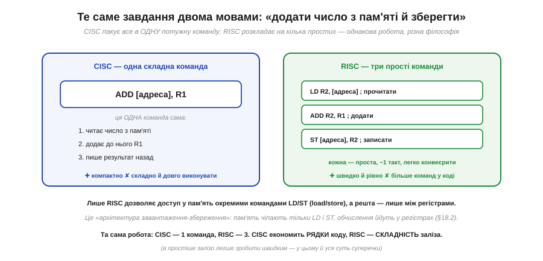
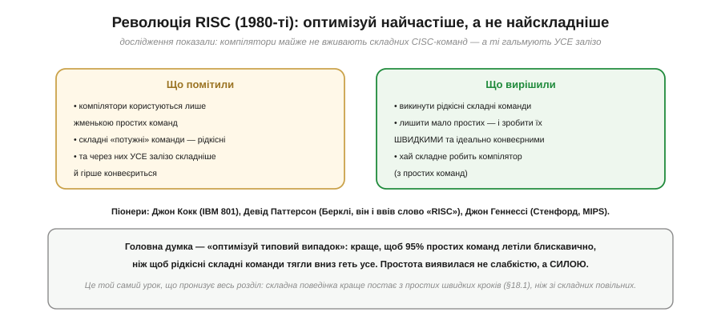

# RISC vs CISC

Одна з найбільших розвилок у будові процесора — про саму **філософію** його [мови (ISA)](book:programming/isa). Питання просте на вигляд, та з далекосяжними наслідками: чи краще, щоб процесор знав **мало простих** команд, чи **багато потужних**? Перша відповідь — **RISC** (*Reduced Instruction Set Computer*, скорочений набір команд), друга — **CISC** (*Complex Instruction Set Computer*, складний набір). Навколо цього вибору точилася ціла епоха суперечок, він визначив дві великі гілки процесорів — і, що цікаво, зрештою «переміг» не зовсім так, як очікувалося. Ця стаття — про обидві філософії, про революцію, що схилила терези, про те, чому сьогодні межа між ними розмита, і чому майже все, що ви програмуватимете, — RISC.

### Питання: мало простих чи багато складних?

*Рис. Проєктуючи [набір команд](book:programming/isa), інженер обирає філософію. **RISC**: мало команд, усі прості, кожна — один крихітний крок, однакової довжини, виконується приблизно за один такт (ARM, RISC-V, AVR, ESP32). **CISC**: багато команд, є дуже складні, одна може робити цілу низку дій, команди різної довжини й тривалості (x86 — процесори ПК). Дві протилежні відповіді на одне питання.*

Це не просто технічна дрібниця, а два світогляди. CISC каже: «дай програмісту (чи компілятору) **потужні** команди, щоб одна робила багато — тоді й програма буде коротша». RISC заперечує: «ні, дай **прості, однакові** команди, які залізо виконує блискавично, а складне нехай складеться з них». Щоб відчути різницю, найкраще побачити, як кожна філософія розв'язує одне й те саме завдання.

### Те саме завдання двома мовами

*Рис. Завдання: додати число з пам'яті до регістра R1 і записати результат назад. **CISC** робить це **однією** складною командою `ADD [адреса], R1`, яка сама читає з пам'яті, додає й пише назад. **RISC** розкладає це на **три** прості команди: завантажити (`LD`), додати (`ADD`), зберегти (`ST`) — кожна проста, ~1 такт, легко конвеєрна. Однакова робота: CISC економить рядки коду, RISC — складність заліза.*

Зверніть увагу на принципову рису RISC, видну тут: у ньому пам'ять чіпають **лише** спеціальні команди завантаження й збереження (`LD`/`ST`), а всі обчислення йдуть **між регістрами**. Це звуть **архітектурою завантаження-збереження** (*load/store*): хочеш порахувати над числом із пам'яті — спершу **завантаж** його в [регістр](book:programming/processor-parts), порахуй там, потім **збережи**. CISC же дозволяє командам прямо лізти в пам'ять посеред обчислення. Філософія RISC — тримати кожну команду простою й однаковою, навіть якщо їх через те більше; а простіше залізо легше зробити швидким.

### Компроміс

*Рис. CISC: команди потужні, але різної довжини й тривалості — код **компактніший** (менше команд), зате декодування **складне**, [конвеєр](book:programming/pipeline) дається важко, а залізо складніше й ненажерливіше. RISC: команди прості й однакові — код **довший** (більше команд), зате декодування тривіальне, конвеєр тече гладко, залізо **простіше й економніше**. Історично CISC родом з епохи, коли пам'ять була дорога, а код часто писали вручну.*

Щоб зрозуміти, **чому** взагалі з'явився CISC, треба придивитися до його епохи. У 1960–70-х пам'ять була **дорогою й мізерною**, тож компактний код (менше команд) був на вагу золота — а складні команди давали саме компактність. До того ж програми часто писали **вручну** в асемблері, і потужна команда «зроби все одразу» економила працю програміста. За тих умов CISC мав сенс. Та коли пам'ять подешевшала, а код почали генерувати **компілятори**, ці переваги зблякли.

### Революція RISC

*Рис. На зламі 1970–80-х дослідники помітили дивне: компілятори користуються лише **жменькою** простих команд, а складні «потужні» CISC-команди — **рідкісні**, проте через них **усе** залізо складніше й гірше конвеєриться. Висновок: викинути рідкісні складні команди, лишити мало простих — і зробити їх **блискавичними** та ідеально конвеєрними, а складне хай складає з них **компілятор**. Піонери: Джон Кокк (IBM 801), Девід Паттерсон (Берклі, він і ввів слово «RISC»), Джон Геннессі (Стенфорд, MIPS).*

Це і була **революція RISC** — одна з найважливіших ідей в історії процесорів. Її серце — принцип «**оптимізуй типовий випадок**»: краще, щоб 95% простих, найчастіших команд летіли якнайшвидше, ніж щоб рідкісні складні команди тягли вниз геть усе залізо. Простота виявилася не слабкістю, а **силою**: прості однакові команди легше декодувати, легше [конвеєрити](book:programming/pipeline) (рівні команди гладко течуть конвеєром), і вони доводять [CPI](book:programming/clock-frequency) до жаданої одиниці. Це той самий глибокий урок: складна поведінка краще постає з **простих швидких** кроків, ніж зі складних повільних. RISC просто застосував його до самої [мови процесора](book:programming/what-is-processor).

### Сьогодні межа розмита

Хто ж переміг? Відповідь несподівана: **обидва — і жоден**.

*Рис. Сучасний x86 (CISC) приймає складні команди ззовні, але всередині **декодер розкладає** кожну на кілька простих RISC-подібних **мікро-операцій** (µops) — і вже їх конвеєрить. Тобто навіть «CISC»-процесор усередині має RISC-подібне ядро. Видима [ISA](book:programming/isa) лишається CISC заради **сумісності** зі старим софтом, а реалізація під нею — RISC-стилю. По суті, перемогла **ідея** RISC (прості швидкі кроки), навіть там, де видима мова складна.*

Ось де знову зблиснула ідея [ISA як **контракту**](book:programming/isa). Видима ISA — це стабільна мова (зовнішній контракт), а **як** її виконано всередині — окрема свобода інженера. Саме тому Intel зміг лишити стару CISC-мову x86 зовні (щоб не ламати десятиліття софту), а всередині тихо перейти на швидке RISC-подібне ядро, що перетворює складні команди на потік простих мікро-операцій. Тож сьогодні «RISC проти CISC» — це вже не жорсткий поділ заліза, а радше питання **філософії видимої ISA**. А на рівні **реалізації** RISC-ідея простоти проникла всюди: проста, однакова операція — легша і для конвеєра, і для заліза.

### Хто де панує

*Рис. **RISC** панує там, де вирішальна **енергоефективність**: телефони й планшети (ARM), мікроконтролери (AVR, ARM Cortex), ESP32 (Xtensa, нові — RISC-V), дедалі більше серверів — бо простіше залізо означає менше кремнію й **менше енергії** (довша батарея). **CISC** (x86) тримається на ПК, ноутбуках і серверах головно завдяки **сумісності** — величезній спадщині готового софту. Сила x86 — не в архітектурі, а в екосистемі.*

Для нас практичний висновок прямий: ваш телефон, ваш мікроконтролер, ваш **ESP32** — усі **RISC**, бо для них енергоефективність вирішальна (немає ні розетки, ні вентилятора). x86 лишається на ПК передусім через інерцію сумісності — десятиліття програм, які ніхто не хоче переписувати. Та й ця межа тане: навіть ноутбуки й сервери дедалі частіше переходять на ARM, бо простота й економність зрештою беруть гору. Тож майже все, що ви програмуватимете в цьому курсі, — RISC-машини, і це не випадковість, а наслідок тієї самої революції простоти.

> 🔧 **Навіщо це.** Хоч RISC/CISC і звучить як суто академічна суперечка, для вас вона має цілком конкретний сенс. Перше: **ваші цільові чипи — RISC** (AVR, ARM, ESP32), тож їхній асемблер складається з простих, однакових команд, і одна дія часто потребує кількох команд (як `LD`/`ADD`/`ST`) — це нормально й швидко. Друге: **архітектура завантаження-збереження** пояснює, чому в коді для МК так багато «завантажити в регістр → порахувати → зберегти»: пам'ять чіпають лише окремі команди, решта йде [в регістрах](book:programming/processor-parts). Третє: **енергоефективність RISC** — пряма причина, чому МК і телефони на ньому; коли дбаєте про споживання (батарея!), сама простота архітектури вже працює на вас. Четверте, ширше: урок «оптимізуй типовий випадок, прості швидкі кроки б'ють складні повільні» — універсальний принцип проєктування, корисний далеко за межами процесорів (зокрема й у вашому власному коді). RISC переміг не випадково — він утілив найглибшу ідею цієї теми.
