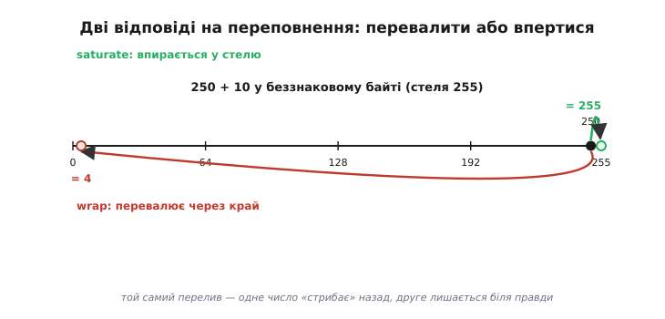
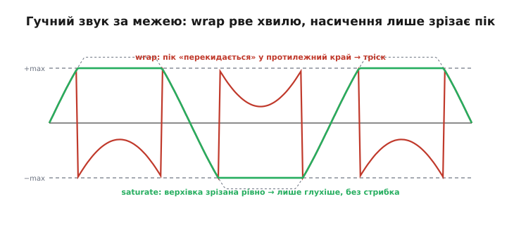
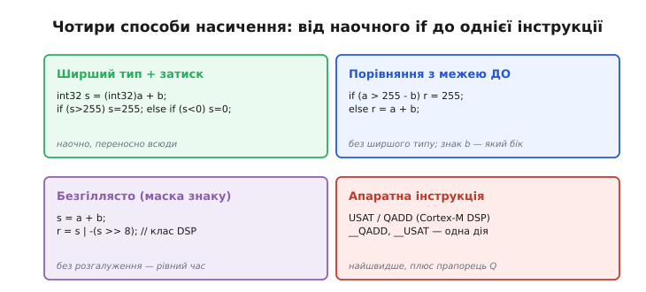

# Насичувальна арифметика

Уявіть звукового інженера за пультом. Хтось крутнув гучність надто сильно — сигнал уже гучніший за максимум, який техніка здатна передати. Що має статися? Здоровий глузд каже: звук стане **найгучнішим можливим** і на тому впреться. Найтихіше, чого ми чекаємо, — це щоб надгучний звук раптом перетворився на **найтихіший**, а гучний бас — на різкий тріск. Але саме так поводиться звичайна машинна арифметика: коли число вилазить за межу розрядної сітки, воно [перевалює по колу](book:programming/overflow-wraparound) — 255 плюс один дає нуль, а найбільший додатний плюс один дає найменший від'ємний. Для лічильника подій це інколи корисно. Для звуку, картинки чи керма двигуном — це катастрофа.

**Насичувальна арифметика** (англ. *saturating* — «таке, що насичується, впирається в межу»; від лат. *satur* — «ситий, повний») — це інший спосіб чинити з переповненням. Замість «перевалити через край» результат **упирається в межу** й там лишається: 250 + 10 у беззнаковому байті дає не 4, а 255. Число «наситилося» — далі рости не може, тож просто стоїть на стелі. Звідси й назва: як склянка, у яку більше не влити, — зайве не перекидається на дно, а просто не вливається.


*250 + 10 у беззнаковому байті. Звичайна («загортальна») арифметика перевалює за 255 і повертається в 4 — число стрибає на протилежний кінець діапазону. Насичувальна впирається в 255 і там зупиняється. Різниця в одному: перевалювання дає **далеке й неправдиве** число, насичення — **найближче можливе до правди**.*

## Чому «впертися» іноді чесніше, ніж «перевалити»

Корінь усього — у природі величини, яку ми рахуємо. Є числа, для яких діапазон — це просто **технічне обмеження запису**, а сама величина живе на **шкалі з фізичними кінцями**. Гучність звуку, яскравість пікселя, положення керма, сила на приводі — усе це має природний «найбільше» і «найменше». Коли обчислення перевищує максимум, найправдивіша відповідь — це **сам максимум**: «гучніше не буває». Перевалити тут означає збрехати найгіршим способом — видати значення з протилежного кінця, ніби гучний звук раптом став тихим.

Порівняймо два способи на слух — це найнаочніше.


*Синусоїда голосніша за повну шкалу. При загортанні кожен пік, що виліз за верхню межу, «перекидається» аж у низ діапазону — у хвилі з'являються стрімкі вертикальні розриви, і ми чуємо їх як різкий тріск. При насиченні верхівка просто зрізається рівно по межі: хвиля стає плоскішою на піках (звук глухішає, спотворюється), але **розривів немає** — жодних стрибків від максимуму до мінімуму. Те саме переповнення, а на слух — прірва між «зіпсовано, але терпимо» і «нестерпний хрускіт».*

Ось чому в обробці звуку, зображень і сигналів насичення — стандарт. Це не милиця, а **правильна модель величини**: якщо додавання двох гучних семплів дає щось за межею, фізично чесно віддати межу, а не випадкове число з іншого краю. Те саме з яскравістю: пікселю, що «пересвітився», місце — білий (255), а не раптовий чорний, який дав би wrap.

І навпаки — є числа, де насичення було б **прихованою брехнею**. Лічильник грошей чи подій, індекс у масиві, адреса, хеш — там немає «фізичної стелі»: значення мусить або чесно рости далі (ширшим типом), або свідомо [перевалювати за модулем](book:programming/overflow-wraparound) (кільцевий буфер, хеш-таблиця). Якщо лічильник «застрягне» на 255, він тихо перестане рахувати — і це така сама мовчазна втрата, як і несподіване перевалювання. Тому насичення — не «завжди безпечніше»; це **інструмент під конкретний тип величини**.


*Ліворуч — величини з фізичними кінцями: там «упертися в межу» і є найправдивіша відповідь. Праворуч — величини без стелі, де насичення тихо ковтає інформацію: там потрібне або ширше число, або свідомий wrap, або **виявлення** переповнення. Питання, яке ставлять до операції: «застрягти на межі — це правда про мою величину чи мовчазна втрата даних?»*

> 🔧 **Навіщо це.** Коли пишете обробку сигналу — мікшування звуку, корекцію яскравості, фільтр, вихід регулятора на двигун — питайте себе не «чи переповниться?», а «**що має статися на межі?**». Для таких величин відповідь майже завжди — насичення: додали два семпли, вийшло за повну шкалу — віддайте повну шкалу, і артефакт буде м'яким, а не тріском. А для лічби, індексів і сум, де важлива точність, насичення **заборонене** — там або ширший тип, або чесне виявлення переповнення. Плутати ці два світи — типова помилка: беззнакове насичення в лічильнику подій так само тихо бреше, як і звичайне перевалювання у звуці.

## Як це виглядає в коді: спершу наочно, потім швидко

Найпростіша реалізація — порахувати з **запасом** у ширшому типі, а тоді **затиснути** (англ. *clamp* — «затиснути в лещатах») результат у дозволені межі. Беремо мікроконтролерні типи з `<stdint.h>`, бо саме на вбудованих системах насичення трапляється щодня.

**Два звукові семплі складаємо в 8-бітному беззнаковому каналі; сума може вилізти за 255 — насичуємо.**

:::tabs
```c
#include <stdint.h>

uint8_t add_sat_u8(uint8_t a, uint8_t b) {
    uint16_t sum = (uint16_t)a + b;   // рахуємо в 16 бітах — вилізти нікуди
    if (sum > 255) sum = 255;         // затиск у стелю
    return (uint8_t)sum;              // 250 + 10 → 255, а не 4
}
```
```python
def add_sat_u8(a, b):
    sum_ = a + b                 # у Python ціле не переповнюється саме собою
    if sum_ > 255:
        sum_ = 255               # затиск у стелю
    return sum_                  # 250 + 10 → 255, а не 4
```
:::

Ключ тут — `(uint16_t)a + b`: **перш ніж** додавати, ми переводимо доданок у ширший тип, тож саме додавання фізично не може переповнитися, і `sum` завжди тримає правдиву суму. Аж потім ми свідомо зрізаємо її до 255. Порядок важливий: якби ми написали `uint8_t sum = a + b`, переповнення сталося б **до** перевірки, і затискати вже не було б чого — у `sum` лежало б 4.

Зі знаковими треба сторожити **обидва** кінці, бо вилізти можна і вгору (за +127), і вниз (за −128).

**Знаковий 8-бітний семпл після підсилення: затискаємо і в стелю, і в підлогу.**

:::tabs
```c
#include <stdint.h>

int8_t add_sat_s8(int8_t a, int8_t b) {
    int16_t sum = (int16_t)a + b;     // ширший тип рятує від UB
    if (sum >  127) sum =  127;       // стеля
    if (sum < -128) sum = -128;       // підлога
    return (int8_t)sum;
}
```
```python
def add_sat_s8(a, b):
    sum_ = a + b                 # ціле Python не переповнюється — рахуємо вільно
    if sum_ >  127:
        sum_ =  127              # стеля
    if sum_ < -128:
        sum_ = -128              # підлога
    return sum_
```
:::

Тут ширший тип рятує ще й від пастки самої мови: [знакове переповнення в C/C++ — невизначена поведінка](book:programming/overflow-wraparound), тож обчислювати `a + b` прямо у 8-бітному знаковому вже не можна — компілятор має право припустити, що переповнення «не буває», і викинути вашу ж перевірку. Рахуючи в `int16_t`, ми тримаємо суму в безпечних межах ширшого типу, а тоді чесно затискаємо. Той самий прийом працює для будь-якої ширини: рахуй на щабель ширше, тоді затисни.

А що, коли ширшого типу немає — наприклад, ми вже на найширшому цілому машини? Тоді межу звіряють **до** операції, переставивши нерівність так, щоб сама перевірка не переповнилася:

:::tabs
```c
#include <stdint.h>

uint32_t add_sat_u32(uint32_t a, uint32_t b) {
    if (a > UINT32_MAX - b) return UINT32_MAX;  // місця для a+b не лишилось
    return a + b;                                // тут точно влізе
}
```
```python
UINT32_MAX = 0xFFFFFFFF

def add_sat_u32(a, b):
    if a > UINT32_MAX - b:       # місця для a+b не лишилось
        return UINT32_MAX
    return a + b                 # тут точно влізе
```
:::

Вираз `UINT32_MAX - b` — це «скільки ще лишилося місця над `a`». Різниця безпечна (`b` завжди ≤ `UINT32_MAX`), тож перевірка сама не переповнюється — а це і є вся хитрість акуратного насичення на межі типу.

## Швидше: без розгалуження й одною інструкцією

У циклах обробки сигналу насичення роблять **мільйони разів на секунду**, і кожен `if` — це можливий [неправильно вгаданий перехід](book:programming/pipeline), що спорожнює конвеєр і краде такти. Тому інженери сигналу здавна пишуть насичення **безгіллясто** (англ. *branchless* — «без розгалужень»): результат обчислюють однією формулою без `if`, спираючись на біти знаку. Приклади таких прийомів — і чому вони працюють — зібрано окремо: [безгіллясте насичення й апаратні інтринсики](book:programming/saturating-arithmetic/proj-saturate-clamp.md).


*Від найнаочнішого до найшвидшого. Ширший тип із затиском — зрозуміло й переносно куди завгодно. Перевірка до операції — коли ширшого типу вже немає. Безгіллясто через маску знаку — рівний час без розгалужень, класика цифрової обробки сигналу. Апаратна інструкція — одна дія, найшвидше, ще й з окремим прапорцем, що каже, чи сталося насичення.*

Найкраще ж, коли насичення вміє **саме залізо**. Процесори, заточені під сигнали й медіа, мають окремі команди, що складають і **одразу насичують** результат — без жодного `if` і ширшого типу. На настільних x86 це прийшло з розширенням **MMX** (від *MultiMedia eXtensions*), яке Intel випустила 8 січня 1997 року саме заради відео, звуку й графіки: інструкції на кшталт `PADDSB` («packed add signed with saturation») складають одразу вісім байтів і кожен насичують у знакову межу. У світі мікроконтролерів те саме дає **DSP-розширення** ядер ARM Cortex-M (від рядка Cortex-M4 і вище): команди `QADD`, `SSAT`, `USAT` насичують результат апаратно. Історію того, як насичення переїхало зі спеціалізованих сигнальних процесорів у масові чипи, зібрано окремо: [від DSP-чипів до MMX](book:programming/saturating-arithmetic/hist-mmx-dsp.md).

Найцікавіша деталь ARM — окремий **прапорець насичення Q** у регістрі стану. На відміну від звичайних прапорців, що оновлюються після кожної операції, Q — **«липкий»** (англ. *sticky*): щойно будь-яка насичувальна команда впреться в межу, Q стає 1 і **лишається** таким, доки програма його явно не скине. Так можна прогнати цілий блок обробки, а тоді один раз спитати: «чи хоч десь ми вперлися в межу?» Це вирішує давню біду [звичайного переповнення](book:programming/overflow-wraparound) — тихість: там прапорці є, але їх майже ніхто не перевіряє після кожної дії. Липкий Q робить перевірку **дешевою й гуртовою**: не після кожного семпла, а раз на весь буфер.

**Насичуємо блок звуку на Cortex-M4 і після циклу дивимось, чи десь упирались у межу.**

```c
#include <stdint.h>
#include "cmsis_gcc.h"        // інтринсики ядра: __QADD, __get_APSR

// складаємо два блоки 16-бітних семплів із насиченням
void mix_saturating(int16_t *dst, const int16_t *a,
                    const int16_t *b, uint32_t n) {
    __set_APSR(__get_APSR() & ~(1u << 27));   // скинути липкий прапорець Q
    for (uint32_t i = 0; i < n; i++) {
        // __QADD насичує 32-бітно; для 16-бітних семплів досить, бо сума двох
        // int16 не виходить за int32 — важливий сам приклад насичувальної дії
        dst[i] = (int16_t)__QADD(a[i], b[i]);
    }
    if (__get_APSR() & (1u << 27))            // біт 27 APSR = прапорець Q
        ;  // хоч раз насичували → сигнал був гучніший за межу (кліпінг стався)
}
```

Тут `__QADD` — це та сама апаратна `QADD`, подана як [C-інтринсик](book:programming/isa) (вбудована функція, що компілюється в одну інструкцію). Цикл насичує кожен семпл без жодного розгалуження, а `if` наприкінці зчитує **один** липкий прапорець на весь блок — і каже, чи взагалі стався кліпінг. Це і є той стиль, заради якого насичення винесли в залізо: рівний час у циклі плюс дешеве гуртове виявлення.

## Насичення й фіксована кома — природна пара

Насичення майже завжди ходить у парі з [фіксованою комою](book:programming/fixed-point) — способом рахувати дроби на цілочисловому залізі. Причина проста: у фіксованій комі число тримають у **чітко заданому діапазоні** (скажімо, звуковий семпл у форматі, де −1.0 і +1.0 — це кінці шкали), і множення двох таких величин легко дає результат, що прагне вилізти за ці кінці. Перевалити тут — знову той самий тріск; єдина розумна відповідь — насичення в межу формату. Тому цифрова обробка сигналу — це майже завжди **фіксована кома плюс насичення**: одне дає дроби без дробового блока, друге стежить, щоб вони не «перекидались» на протилежний край шкали. Саме через цю пару насичувальні інструкції й опинилися в DSP-розширеннях поряд із командами множення-накопичення.

---

Насичувальна арифметика — це відповідь на переповнення для величин із **фізичними кінцями**: замість [перевалити по колу](book:programming/overflow-wraparound) (255 + 1 = 0) результат **упирається в межу** й лишається там (255 + 1 = 255). Для звуку, яскравості, керування це найправдивіша відповідь — «більше не буває»; перевалювання ж дало б стрибок на протилежний край (тріск у звуці, чорний замість білого). Але для лічби, індексів і адрес насичення — прихована втрата: там потрібен ширший тип, свідомий wrap або виявлення переповнення. У коді насичення роблять затиском у ширшому типі (`порахувати з запасом → зрізати в межу`), а на межі типу — перевіркою **до** операції; у гарячих циклах — безгіллясто або апаратною командою (`PADDSB` у x86 MMX від 1997-го; `QADD`/`SSAT`/`USAT` у DSP-розширенні Cortex-M з липким прапорцем **Q**, що дешево ловить кліпінг гуртом). Природний напарник насичення — [фіксована кома](book:programming/fixed-point): разом вони і є основа цифрової обробки сигналу.
