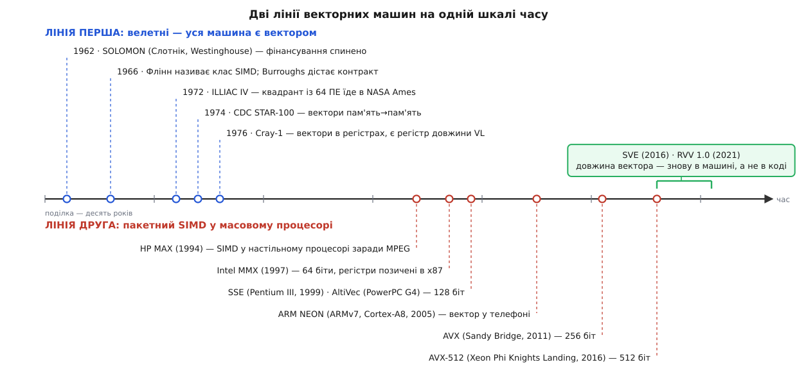
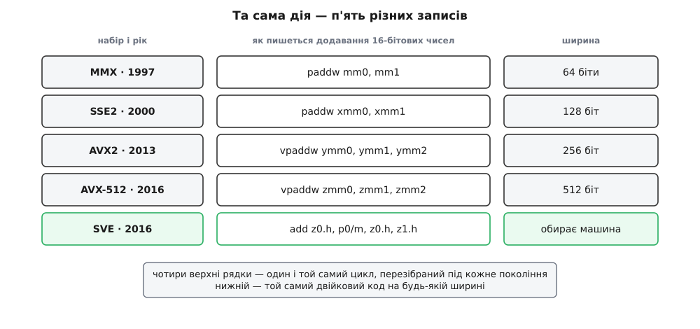

# 📜 Дві лінії векторних машин: від ILLIAC IV до кишенькового процесора

Ідея «одна команда — багато чисел» приходила в залізо двічі, з протилежних боків і заради протилежних цілей: спершу як спосіб зібрати найшвидшу машину світу для розрахунку вибухів і погоди, згодом — як дешевий спосіб програти відео на настільному комп'ютері. Дві лінії йшли майже незалежно понад тридцять років, дали різні відповіді на ту саму задачу й зійшлися аж у 2010-х. Ця історія пояснює, звідки в наборах команд узялися маски, чому ширина вектора роками була вписана просто в назву команди — і чому найновіші набори від цього нарешті відмовилися.


*Дві лінії на одній шкалі. Угорі — машини, у яких вектор був сенсом усієї конструкції; унизу — розширення, які припасовували до вже наявного процесора, не чіпаючи нічого зайвого. Права частина шкали — точка, де друга лінія повертається по рішення, знайдене першою ще 1976 року.*

### Керування дороге, арифметика дешева

Рахунок, з якого все почалося, зробили ще за часів лампових машин. Данієл Слотнік (Daniel Leonid Slotnick), американський математик, працював 1952 року програмістом на машині IAS у Прінстоні й помітив просту диспропорцію: блок керування — те, що вибирає команду, розшифровує її й розставляє мікрооперації в часі — займав істотну частину заліза, тоді як власне арифметичний блок був поруч із ним невеликим. Отже, якщо потрібно більше арифметики, дешевше додавати не цілі процесори, а самі лічильні блоки й вести їх усі одним потоком команд. 1958 року Слотнік і Джон Кок (John Cocke) виклали цю думку на папері.

1962 року вона отримала гроші. У підрозділі Westinghouse Air Arm, за контрактом дослідного центру ВПС США, Слотнік очолив проєкт SOLOMON — машину з 1024 послідовних (побітових) обчислювальних елементів під одним блоком керування; доповідь про неї прозвучала на осінній конференції FJCC у грудні 1962 року. До заліза дійшли лише невеликі прототипи. Проєкт спинився близько 1963 року: за усталеним переказом, головний замовник із боку Міноборони загинув у нещасному випадку, фінансування урвалося, а Ліверморська лабораторія підхопити роботу відмовилася. Ідея лишилася без машини, але з назвою й із опублікованою архітектурою.

### ILLIAC IV: ідея, доведена до заліза

1964 року Іллінойський університет підписав контракт з ARPA, і Слотнік узявся будувати ту саму машину вдруге — тепер під назвою ILLIAC IV. У серпні 1966-го контракт на виготовлення дістала Burroughs у парі з Texas Instruments.

Задум був такий: чотири квадранти по 64 обчислювальні елементи, разом 256 арифметичних блоків із плаваючою комою, кожен зі своєю пам'яттю на 2048 слів по 64 біти, тактова частота 25 МГц і мета — мільярд операцій за секунду. Саме це число зробило машину знаменитою ще до того, як її зібрали.

Побудували один квадрант. Частоту довелося опустити спершу до 16, потім до 13 МГц; реальний пік вийшов близько 50 мільйонів операцій за секунду замість обіцяного мільярда. Кошторис у 8 мільйонів доларів перетворився на 31 мільйон.

Але для нашої історії важать не ці числа, а дві конструктивні деталі, які пережили машину на півстоліття.

Перша — **режимний біт**. Усі 64 елементи отримували від блока керування один і той самий потік команд; власного лічильника команд у них не було. Розгалуження в такій машині неможливе за побудовою: елементи не можуть розійтися по різних гілках, бо гілка одна на всіх. Єдине, що елементові дозволили, — це **не виконувати** широкомовну команду: у його режимному регістрі був біт, який казав «я зараз участі не беру». Так у 1960-х виглядало те, що сьогодні називають предикацією й масками. Логіка не змінилася відтоді ні на йоту: якщо доріжки не можуть розійтися, лишається дозволити частині з них промовчати.

Друга — **пам'ять під ногами**. Кожен елемент бачив тільки свою пам'ять; щоб дістати чуже число, його треба було переслати мережею, у якій елемент `i` з'єднувався з `i±1` та `i±8` (вісімка на вісім із замиканням країв). Арифметика в цій машині була безкоштовна, а вся складність програмування зводилася до того, **як розкласти дані так, щоб потрібне число вже лежало в потрібному елементі**. Тридцять років по тому програміст, який перевертає масив структур на структуру масивів, розв'язує рівно ту саму задачу — тільки замість мережі пересилань у нього кеш-лінія.

Долю машини вирішила не інженерія. У січні 1970-го студентська газета написала, що комп'ютер проєктуватиме ядерну зброю; у травні сталися вбивства в Кентському університеті, і хвиля антивоєнних протестів дійшла до кампусу. У січні 1971-го ARPA й університет вирішили, що машині безпечніше поїхати, і у квітні 1972 року єдиний квадрант опинився в дослідному центрі NASA Ames у Каліфорнії. Перші програми пішли влітку 1973-го, і результатам не довіряли; у робочий стан машину привели лише 1975 року, замінивши близько 110 тисяч резисторів. У листопаді 1975-го її під'єднали до ARPANET — і вона стала першим суперкомп'ютером, доступним по мережі. Вимкнули ILLIAC IV 7 вересня 1981 року.

### 1966: класу дають ім'я

Поки машину будували, Майкл Флінн (Michael J. Flynn) опублікував у грудневому числі *Proceedings of the IEEE* за 1966 рік статтю «Very high-speed computing systems», у якій розсортував архітектури за двома незалежними ознаками: скільки потоків команд машина веде одночасно і скільки потоків даних. Вийшли чотири клітинки — SISD, SIMD, MISD, MIMD, — і назва SIMD (англ. *single instruction, multiple data*) прижилася саме звідти.

У класифікації є одна властивість, яка досі плутає розмови. В одну клітинку SIMD потрапляють дві машини, зроблені протилежно: масив із багатьох елементів, де числа обробляються **водночас у різних блоках** (ILLIAC IV), і конвеєрний векторний процесор, де числа проходять **одне за одним крізь один блок** (усе, що будував Сеймур Крей). Ззовні, з боку програми, вони й справді однакові: одна команда — багато чисел. Усередині — різні машини. Флінн класифікував те, що видно програмі, і саме тому слова «SIMD» і «вектор» досі вживають як синоніми, хоча залізо під ними буває різне.

### Cray-1 і деталь, що вирішила все

На початку 1970-х конвеєрну гілку зайняли дві комерційні машини — CDC STAR-100 (оголошена 1972-го, перша поставка 1974-го) і TI ASC. Обидві робили вектори **з пам'яті в пам'ять**: команда отримувала адреси масивів і довжину, дані текли з пам'яті крізь конвеєр і поверталися в пам'ять.

Виглядає бездоганно — і саме на цьому машини програли. Конвеєр від пам'яті до лічильного блока довгий, тож поки з нього вийде перший результат, минає багато тактів. У STAR-100 векторна команда починала випереджати звичайний скалярний CDC 7600 приблизно з п'ятдесятого елемента. А в справжніх програмах вектори короткі: цикл на десять ітерацій зустрічається набагато частіше за цикл на тисячу. Машина була швидка на тестах і повільна на роботі.

Cray-1, першу систему якої з серійним номером 001 поставили в Лос-Аламоську лабораторію в березні 1976 року на піврічне випробування, розв'язала це однією зміною: **вектор живе в регістрі, а не в пам'яті**. Вісім векторних регістрів, у кожному 64 елементи по 64 біти. Завантаження з пам'яті — окрема команда, після якої над регістрами можна робити скільки завгодно арифметики, не платячи щоразу за дорогу подорож. Точка беззбитковості впала приблизно до двох елементів. До цього додалося зчеплення (англ. *chaining*): результат додавання йшов прямо на вхід множення, не заходячи в пам'ять. При такті 12.5 нс (80 МГц) машина давала до 160 мільйонів операцій із плаваючою комою за секунду.

Разом із векторними регістрами Cray-1 отримала два службові, які й виявилися головним спадком першої лінії. Регістр маски VM — це режимний біт ILLIAC IV, зібраний в одне слово: по біту на елемент. І регістр довжини VL — скільки з 64 елементів команда має зачепити цього разу.

VL заслуговує окремої уваги, бо це відповідь на питання, якого пакетна лінія потім тридцять років не могла собі поставити. Довжина вектора в Cray-1 — не константа в коді, а **значення в регістрі**, яке цикл виставляє перед кожним проходом. Отже, хвіст масиву перестає бути окремим випадком: останній прохід просто виставляє менше число.

### Друга лінія: вектор приходить із відеодекодера

Середина 1990-х, зовсім інший світ. Настільний комп'ютер має декодувати MPEG-відео й програвати звук, а арифметика там — восьми- й шістнадцятибітова, над пікселями та відліками. І тут хтось помічає диспропорцію, дуже схожу на Слотнікову, тільки з іншого боку: **регістр і суматор уже широкі**, 32 або 64 біти, а числа в них лежать крихітні.

Звідси найдешевший можливий хід: розірвати ланцюжок переносів на межах байтів і оголосити, що в регістрі лежить не одне число, а вісім. Нових регістрів не треба, нових шляхів даних не треба — треба лише нові коди операцій. Це називають підслівним паралелізмом (англ. *subword parallelism*), і його ціна в кремнії була майже нульова.

Першою це зробила HP: розширення MAX-1 у процесорі PA-7100LC 1994 року, задумане саме заради декодування MPEG. Його загалом визнають першими SIMD-командами в універсальному мікропроцесорі — з поправкою на те, що «перший» тут залежить від того, що вважати SIMD-командою. Далі MAX-2 у PA-8000 (1996) і набір VIS у Sun UltraSPARC (1995).

Масовим це зробила Intel. MMX вийшов 8 січня 1997 року з процесором Pentium P55C: 57 команд, лише цілочислова арифметика, вісім регістрів mm0–mm7. Ці регістри були **не нові** — їх наклали на стек співпроцесора x87. Хід свідомий: якщо не з'являється нового архітектурного стану, то операційній системі не треба вчитися зберігати його при [перемиканні контексту](topic:programming/context-switch) — і MMX-код запускався на вже встановлених системах без жодних правок. Заплатили за це тим, що змішувати MMX і дробову арифметику стало неможливо, а перед поверненням до x87 доводилося виконувати команду `emms`. Сумісність вигадали купити один раз, а розплачувалися десятиліття.

Звідти ж, із мультимедійного походження, у наборі взялося [насичувальне додавання](topic:programming/saturating-arithmetic) — арифметика, у якій результат не переповнюється, а притискається до межі типу. Коли освітлюєш піксель, 250 + 10 має дати 255, а не 4; для звуку й зображення це очевидна вимога, для звичайного цілочислового коду — екзотика.

Далі лінія розганялася швидко. AMD 3DNow! (1998, K6-2) додала дробові числа в ті самі 64-бітові регістри. SSE (лютий 1999, Pentium III) приніс 70 команд і вісім **нових** 128-бітових регістрів XMM — цього разу Intel таки погодилася на новий архітектурний стан і на потрібні зміни в системах; підтримувалася поки що лише одинарна точність. SSE2 (Pentium 4, кінець 2000-го) додав float64 і цілі числа в XMM, після чого MMX перетворився на спадщину.

Паралельно альянс Apple, IBM і Motorola розробляв у 1996–1998 роках AltiVec, що вийшов 1999 року в процесорі PowerPC G4: тридцять два 128-бітові регістри й повноцінний блок перестановок від самого початку — набір, спроєктований як векторний, а не вирощений із хитрощів. Motorola називала його AltiVec, Apple продавала як Velocity Engine, IBM — як VMX.

А в телефон вектор потрапив із ARM: розширення Advanced SIMD архітектури ARMv7-A, відоме як NEON, уперше з'явилося в ядрі Cortex-A8, оголошеному 4 жовтня 2005 року.

### Бігова доріжка ширини

Тут і виліз недолік, якого перша лінія не мала. У Cray-1 довжина вектора була значенням у регістрі. У пакетному SIMD **ширина вписана в саму команду**: `paddw mm0, mm1` — це назавжди 64 біти, і жодна майбутня машина не зробить її ширшою.


*Одна й та сама дія — додати пари 16-бітових чисел — у п'яти наборах команд. Чотири верхні рядки відрізняються лише тим, скільки чисел уміщається в регістр, і кожен потребує окремого перезбирання програми. Нижній рядок ширини не називає взагалі: скільки елементів обробити, вирішує машина під час виконання.*

Кожне подвоєння ширини означало новий набір мнемонік і новий двійковий код: MMX (64) → SSE (128) → AVX (запропонований у березні 2008-го, у кремнії — Sandy Bridge, перший квартал 2011-го; 256 біт, кодування VEX і триоперандна форма, у якій результат нарешті перестав затирати один із доданків) → AVX2 (Haswell, 2013: цілі числа доросли до 256 біт, з'явилося збирання за індексами) → AVX-512 (запропонований у липні 2013-го, перше залізо — Xeon Phi Knights Landing, 2016).

Уся машинерія, якою досі користуються програмісти — збирати кілька версій гарячої функції й вибирати потрібну під час запуску, розпитавши процесор про його вміння, — існує рівно через це рішення 1997 року. Двійковий файл або не запуститься на старій машині, або змарнує половину нової.

AVX-512, до речі, повернув у x86 режимний біт ILLIAC IV у явному вигляді: вісім регістрів масок k0–k7, і майже кожна команда може взяти маску прямо в кодуванні. Предикація перестала бути трюком зі змішуванням і стала частиною набору.

Він же показав і зворотний бік ширини. Широкий блок — це велика площа, що перемикається одночасно, і великий стрибок струму, тож серверні ядра на важких 512-бітових командах знижували частоту (наслідок [стіни потужності](topic:programming/power-wall) — фізичної межі, за якою тепловиділення росте швидше за користь від частоти). А коли Intel перейшла до гібридних процесорів, у яких великі й малі ядра мають різні вміння, AVX-512 довелося просто вимкнути в масових моделях: малі ядра його не мали, а один процес не може мати різний набір команд залежно від того, куди його переставив планувальник. Відповіддю стало оголошене в липні 2023 року сімейство AVX10 — спроба відв'язати можливості набору від конкретної ширини регістрів.

### Змінна довжина повертається

У серпні 2016 року на конференції Hot Chips ARM разом із Fujitsu показали SVE (англ. *Scalable Vector Extension*). Головна теза: **ширина не зашита в код**. Реалізація може мати від 128 до 2048 біт із кроком 128, а той самий двійковий файл використовує всю наявну ширину. Цикл дізнається, скільки елементів лишилося обробити, окремою командою, яка одразу будує предикат, — і хвіст масиву зникає як окремий випадок коду. Fujitsu втілила SVE у процесорі A64FX із 512-бітовими векторами, на якому зібрано суперкомп'ютер Fugaku, що очолив список TOP500 у червні 2020 року.

П'ять років по тому, у листопаді 2021-го, RISC-V International ратифікувала версію 1.0 [векторного розширення RVV](topic:programming/risc-v-vector) — окремого набору команд, у якому кількість оброблених елементів задається під час виконання, а не в коді. Специфікація не приховує родоводу й прямо називає свою модель «у стилі Cray». Порівняння варте того, щоб побачити його поруч:

```
Cray-1, 1976 — схематично; довжина вектора живе в регістрі VL

    VL ← min(n − i, 64)     ; скільки елементів беремо цього разу
    V1 ← A(i)               ; завантажити VL чисел
    V2 ← B(i)
    V3 ← V1 + V2            ; додати VL пар
    C(i) ← V3               ; записати VL результатів

RISC-V RVV 1.0, 2021 — те саме питання, та сама відповідь

loop:
    vsetvli t0, a0, e32, m1 ; просимо a0 елементів, машина дає t0
    vle32.v v0, (a1)        ; завантажити t0 чисел
    vle32.v v1, (a2)
    vfadd.vv v2, v0, v1     ; додати t0 пар
    vse32.v v2, (a3)        ; записати t0 результатів
    sub  a0, a0, t0         ; лишилося на t0 менше
    bnez a0, loop
```

Сорок п'ять років між двома фрагментами — і той самий хід: програма не називає ширину, а **питає** машину, скільки та візьме.

Повернення сталося не з поваги до класики, а тому, що повернулася задача. Intel у 1990-х мала одну лінійку процесорів і могла дозволити собі перезбирати програми під кожне нове покоління. ARM і RISC-V мають зоопарк: від мікроконтролера до серверного ядра, від десятків виробників, з різними бюджетами площі, — і один двійковий файл мусить іти всюди. За таких умов зашита ширина стає нестерпною.

Видно й глибшу причину, чому лінії дійшли до різних відповідей. Перша починала з питання «як побудувати машину, що рахує масиви довільної довжини» — а це питання майже силоміць робить довжину величиною часу виконання. Друга починала з питання «як додати кілька кодів операцій до наявного набору, нічого в ньому не потривоживши» — і на нього чесно відповідала, доки могла. Обидві деталі, що зрештою перейшли з першої лінії в другу, — маска й змінна довжина — були вигадані до 1976 року. Друга лінія перевідкрила першу 2013-го, другу 2016-го, і обидва рази під тиском тієї самої обставини: код мусив пережити залізо, для якого його писали.
