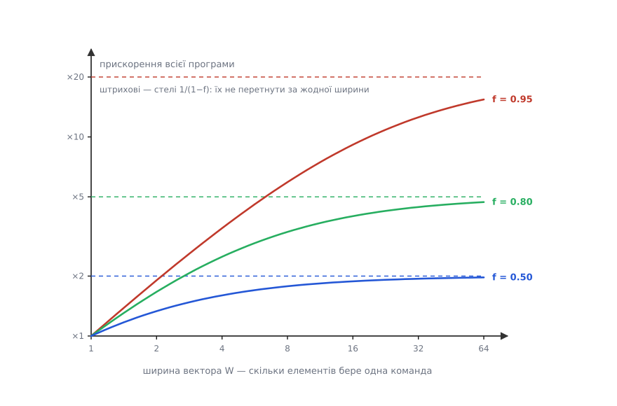
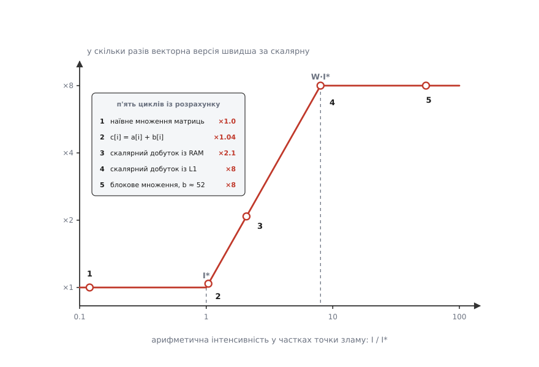

# 🧮 Розрахунок стелі векторизації: дві межі, що діють одночасно

Виграш від векторизації можна порахувати наперед — олівцем, ще до першого рядка векторного коду. Над будь-яким циклом висять дві незалежні стелі: скільки часу програми взагалі проходить крізь ділянку, яку векторизують, і скільки арифметичних дій припадає в ній на кожен принесений із пам'яті байт. Кожна дає власну формулу, обидві міряються заздалегідь, а фактичне прискорення дорівнює меншій із них. Нижче — виведення обох і числа для трьох типових циклів.

### Межа перша: частка векторизованого часу

Нехай `f` — частка **часу** програми, яку займає код, придатний до векторизації, а `W` — скільки елементів обробляє одна векторна команда. Решта часу, `1 − f`, лишається скалярною й від ширини регістрів не залежить узагалі.

```
Нормуємо повний час на одиницю:
  T = (1 − f)  +   f
      скаляр      те, що векторизуємо

Векторна частина стискається в W разів, скалярна не змінюється:
  T′ = (1 − f) + f/W

Прискорення — відношення часів:
  S = T / T′ = 1 / ((1 − f) + f/W)
```

Це [закон Амдала](topic:algorithms/amdahls-law), у якому місце кількості процесорів заступила ширина вектора. Підстановка не випадкова: обидва прискорення однакові за формою — щось одне робиться швидше, а решта лишається на місці, — тож і формула та сама.

Порахуймо для трьох часток і трьох ширин.

```
             W = 4    W = 8   W = 16   W → ∞
  f = 0.50    1.60     1.78     1.88     2.00
  f = 0.80    2.50     3.33     4.00     5.00
  f = 0.95    3.48     5.93     9.14    20.00

  перевірка одного рядка, f = 0.95, W = 8:
    (1 − 0.95) + 0.95/8 = 0.05 + 0.11875 = 0.16875
    S = 1 / 0.16875 = 5.93
```

Останній стовпчик — це вже не наближення, а точна межа: коли `W` росте, доданок `f/W` прямує до нуля, і лишається

```
  S_max = 1 / (1 − f)
```

Величина `S_max` не залежить від ширини **зовсім**. При `f = 0.8` жодні регістри — 512-бітові, 2048-бітові, які завгодно — не дадуть більше за ×5, бо п'ята частина часу просто не прискорюється.

Звідси випливає питання, заради якого все це й рахують: коли ширші регістри перестають окупатися? Порівняймо `S(2W)` із `S(W)`.

```
Позначимо s = 1 − f (скалярний час) і v = f/W (векторний час за ширини W).

  S(2W)      s + v
  ───── = ───────────  ≥  r        r — множник, заради якого варто подвоювати
  S(W)     s + v/2

  s + v ≥ r·s + r·v/2
  v·(1 − r/2) ≥ s·(r − 1)
  v/s ≥ 2(r − 1)/(2 − r)

Візьмімо r = 1.1 — подвоєння ширини має дати щонайменше 10 %:
  v/s ≥ 2·0.1/0.9 = 0.2222
  (f/W)/(1 − f) ≥ 0.2222
  f/(1 − f) ≥ 0.2222·W
  f ≥ W/(W + 4.5)
```

Формула `f ≥ W/(W + 4.5)` — це і є шукана точка. Ось її значення й фактичний приріст від подвоєння:

```
  перехід    потрібна частка f     приріст за f = 0.50 / 0.80 / 0.95
  4  →  8       f ≥ 0.47             +11 %   +33 %   +70 %
  8  → 16       f ≥ 0.64             + 6 %   +20 %   +54 %
 16  → 32       f ≥ 0.78             + 3 %   +11 %   +37 %

  перевірка порогу: f = 0.64, W = 8
    S(8)  = 1/(0.36 + 0.64/8)  = 1/0.44  = 2.273
    S(16) = 1/(0.36 + 0.64/16) = 1/0.40  = 2.500
    2.500/2.273 = 1.10 — рівно 10 %, як і обіцяв поріг
```

Читається це так: щоб перехід із 256-бітових регістрів на 512-бітові (`W` з 8 на 16) дав хоч десяту частину, векторизувати треба **щонайменше дві третини часу програми**. Типова частка в реальному коді — 0.5–0.8, тож подвоєння ширини там варте кількох відсотків, і це ще до того, як щось інше погіршиться.

Ту саму формулу зручно повернути навпаки — яка частка потрібна для заданого прискорення.

```
  1/S = (1 − f) + f/W
  f·(1/W − 1) = 1/S − 1
  f = (1 − 1/S) / (1 − 1/W)

  W = 8:   S = 2  →  f = 0.571
           S = 4  →  f = 0.857
           S = 8  →  f = 1.000
```

Останній рядок варто прочитати двічі: щоб дістати повні ×8 за восьми доріжок, векторизувати треба **весь час без залишку**. Не 99 %, а рівно все.


*Прискорення як функція ширини за трьох часток векторизованого часу. Криві ростуть тільки на початку, а далі притискаються до власних горизонталей 1/(1−f) — стель, які ширина вже не рухає. Що менша частка, то раніше настає це притискання: за f = 0.5 різниця між чотирма доріжками й шістдесятьма чотирма — лише ×1.6 проти ×1.97, тобто менш ніж чверть.*

Є ще один наслідок, дрібний на вигляд і важливий на практиці. Векторизація **змінює профіль**: скалярна частина не стала повільнішою, але її частка в новому часі підскочила.

```
  f = 0.8, W = 8
  було:  скаляр 0.20 з 1.000  →  20 % часу
  стало: скаляр 0.20 з 0.300  →  67 % часу
         вектор 0.10 з 0.300  →  33 % часу
```

Тобто після успішної векторизації головним споживачем часу стає саме той код, який ви щойно не чіпали. Другий захід оптимізації майже завжди має бити в нього, а не в ширші регістри.

### Межа друга: скільки дій припадає на байт

Друга стеля не має нічого спільного з першою й діє незалежно від неї. Векторна одиниця споживає дані у `W` разів швидше за скалярну; якщо пам'ять не встигає їх підвозити, зайві доріжки просто стоять.

Щоб це порахувати, потрібна одна величина — **арифметична інтенсивність**:

```
  I = кількість арифметичних дій / кількість байтів,
      перевезених між ядром і пам'яттю
```

Одиниця — дії на байт. Це властивість самого циклу, а не машини: вона не змінюється ні від частоти, ні від ширини регістрів.

Тепер запишімо обидві стелі в одних одиницях — діях за секунду. Позначимо `P_ядра` пікову швидкість **скалярної** версії саме цього циклу (її ставить той ресурс ядра, який упирається першим: порт запису, порти завантаження, блоки FMA), а `B` — пропускну здатність пам'яті в байтах за секунду.

```
  стеля ядра, скалярно:    P_ядра
  стеля ядра, векторно:  W·P_ядра
  стеля пам'яті:            I·B      (I дій на кожен із B байтів за секунду)

Фактична швидкість — менша з двох, окремо для кожної версії:
  P_скаляр = min(  P_ядра, I·B)
  P_вектор = min(W·P_ядра, I·B)
```

Це двостельова оцінка, знана як [roofline-модель](topic:algorithms/roofline-model). Розділімо одне на одне й подивімося, що лишиться від `W`. Відношення двох швидкостей позначимо `S_пам` — прискорення, яке лишає від векторизації сама пам'ять.

```
  S_пам = P_вектор / P_скаляр

Уведемо точку зламу — інтенсивність, за якої скалярна версія рівно вичерпує канал:
  I* = P_ядра / B

Тоді три випадки:
  I < I*         обидві версії лежать на межі пам'яті:  S_пам = I·B / (I·B) = 1
  I* ≤ I < W·I*  скаляр упирається в ядро, вектор — у пам'ять:
                                                        S_пам = I·B / P_ядра = I/I*
  I ≥ W·I*       обидві впираються в ядро:              S_пам = W

Одним рядком:
  S_пам = min(W, max(1, I / I*)),    I* = P_ядра / B
```

Ось повна відповідь другої межі, і вона напрочуд проста: **прискорення дорівнює тому, у скільки разів інтенсивність циклу перевищує точку зламу — обрізане згори шириною вектора.** Ліворуч від `I*` векторизація не дає нічого взагалі, і жодні прапорці цього не змінять. Праворуч від `W·I*` вона дає повну ширину. Між ними — похила ділянка, на якій кожне подвоєння інтенсивності подвоює виграш.


*Той самий векторний код дає різне прискорення залежно від того, скільки дій припадає в циклі на принесений байт. До зламу `I*` обидві версії однаково чекають на пам'ять, і виграш точно дорівнює одиниці. Далі виграш росте рівно як інтенсивність, аж поки не впреться в кількість доріжок. Ширші регістри піднімають лише праву горизонталь — і водночас відсувають правий злам туди ж, тобто вимагають від циклу ще більшої інтенсивності, щоб цю висоту дістати.*

### Три цикли на одній машині

Візьмімо одну машину й проженімо крізь формулу три різні цикли.

```
  частота                     3 ГГц
  регістри                    256 біт → W = 8 чисел float32
  порти завантаження          2 за такт, по 32 байти
  блоки FMA                   2 за такт
  пропускна здатність RAM   B = 50·10⁹ Б/с
  пропускна здатність L1        2 × 32 Б × 3·10⁹ = 192·10⁹ Б/с
```

**Цикл 1: поелементне додавання `c[i] = a[i] + b[i]`.**

```
  дій на елемент         1   (одне додавання)
  байтів на елемент     16   (читання a, читання b, підняття лінії c, запис c)
  I = 1/16 = 0.0625 дій/байт

  Скалярна стеля ядра: запис — один за такт, отже 1 елемент і 1 дія за такт
    P_ядра = 1 × 3·10⁹ = 3·10⁹ дій/с
    I* = 3·10⁹ / 50·10⁹ = 0.06 дій/байт

  I/I* = 0.0625 / 0.06 = 1.04
  S_пам = min(8, max(1, 1.04)) = 1.04
```

Чотири відсотки. Цикл стоїть майже точно **на** зламі — з правильного боку, але без запасу. (Якщо стелю пам'яті округлити до 3.1·10⁹ елементів за секунду, вийде 1.03; різниця тут суто в округленні, порядок величини той самий.) Щоб дістати повні ×8, знадобилося б `I ≥ W·I* = 0.48` дій/байт, тобто `0.48 × 16 = 7.7` арифметичних дій на елемент замість однієї — майже увосьмеро більше. Додати їх нема звідки: у задачі «скласти два масиви» рівно одне додавання на елемент, і більше там не з'явиться.

**Цикл 2: скалярний добуток.**

```
  дій на елемент          2   (множення й додавання, одна команда FMA)
  байтів на елемент       8   (два читання float32; записів немає)
  I = 2/8 = 0.25 дій/байт

  Скалярна стеля ядра: два читання за такт, а елемент потребує двох чисел,
  отже 1 елемент і 2 дії за такт
    P_ядра = 2 × 3·10⁹ = 6·10⁹ дій/с

  Дані приходять із RAM:
    I* = 6·10⁹ / 50·10⁹ = 0.12 дій/байт
    I/I* = 0.25 / 0.12 = 2.08          →  S_пам = ×2.08
    для повних ×8 треба I ≥ 8 × 0.12 = 0.96 — учетверо більше, ніж є

  Дані вміщаються в L1:
    I* = 6·10⁹ / 192·10⁹ = 0.03125 дій/байт
    W·I* = 8 × 0.03125 = 0.25          — рівно стільки цикл і має
    S_пам = ×8
```

Той самий код, та сама машина, різниця вчетверо — і вся вона в тому, [з якого рівня пам'яті](topic:programming/cache) приходять числа.

Збіг у нижньому блоці не випадковий, і він повчальний. Векторна версія читає два регістри по 32 байти за такт — це `64 × 3·10⁹ = 192·10⁹` Б/с, тобто **рівно** та сама пропускна здатність L1. Для циклу, який лише завантажує й рахує, векторна стеля ядра й стеля кеша першого рівня — це одне й те саме залізо: ті самі два порти завантаження. Тому векторна версія сідає точно на злам, ані байтом далі. Варто додати до циклу хоч один запис — і точка з'їде вліво, під злам.

**Цикл 3: множення матриць.** Тут стелю ядра ставлять уже блоки [множення з накопиченням](topic:programming/fused-multiply-add), бо арифметики багато, а завантажень мало.

```
  два блоки FMA за такт, кожна FMA — 2 дії
    скалярно:  2 × 2 × 3·10⁹ = 12·10⁹ дій/с  = P_ядра
    векторно:  ×8 доріжок      = 96·10⁹ дій/с
    I* = 12·10⁹ / 50·10⁹ = 0.24 дій/байт
    W·I* = 8 × 0.24 = 1.92 дій/байт
```

Спершу наївний потрійний цикл `C[i][j] += A[i][k] · B[k][j]` за великого `n`, коли рядки в кеш не влазять.

```
  внутрішній крок робить 2 дії, а привозить:
    A[i][k] — поспіль, по 4 байти на елемент          4 Б
    B[k][j] — крок n, тобто щоразу нова кеш-лінія    64 Б
    C[i][j] — лежить у регістрі весь внутрішній цикл   0 Б
  I = 2 / 68 ≈ 0.029 дій/байт

  0.029 проти I* = 0.24 — увосьмеро НИЖЧЕ за нижній злам
  S_пам = 1
```

Векторизація наївного множення матриць не дає рівно нічого. Тепер [розіб'ємо задачу на плитки](topic:algorithms/cache-oblivious): рахуємо `C_плитка += A_плитка · B_плитка` для плиток `b×b`, тримаючи плитку `C` у регістрах увесь час, поки крізь неї протягують `k`.

```
  на один блоковий добуток:
    дій                  2b³
    привезених елементів 2b²  (плитки A і B)  →  8b² байтів
    I = 2b³ / (8b²) = b/4 дій/байт

  Те саме для всієї задачі n×n. Кеш тримає M елементів,
  у ньому мають ужитися три плитки:  3b² ≤ M  →  b = √(M/3)
    блокових добутків      (n/b)³
    байтів на кожен         8b²
    усього байтів          8n³/b
    усього дій             2n³
    I = 2n³ / (8n³/b) = b/4 = √M/(4·√3) ≈ 0.144·√M
```

Числа для нашої машини (`W·I* = 1.92`):

```
  b =  8    →  I =  2.0   щойно перетнули злам    →  S_пам = ×8
  b = 16    →  I =  4.0   удвічі із запасом       →  S_пам = ×8
  b = 52.3  →  I = 13.1   плитка під L1 = 32 КіБ  →  S_пам = ×8
              (звідки 52.3: b = √(M/3) = √(8192/3), бо 32 КіБ — це 8192 числа float32)
```

Зверніть увагу, чого блокування **не** робить: воно не зменшує кількості арифметичних дій — їх було й лишилося `2n³`. Воно тільки зменшує кількість перевезених байтів, тобто пересуває задачу вправо по осі інтенсивності. Уся вигода від ширших регістрів у множенні матриць приходить не з регістрів, а з цього зсуву.

І тут виводиться найважливіший наслідок другої межі. Підставмо `I ≈ 0.144·√M` в умову «дістати повну ширину».

```
  √M/(4·√3) ≥ W·P_ядра/B
  √M ≥ 4·√3 · W·P_ядра/B
  M ≥ 48 · (W·P_ядра/B)²

  W =  8:  M ≥ 48 × 1.92² =  177 елементів (708 байтів)
  W = 16:  M ≥ 48 × 3.84² =  708 елементів (2832 байти)
```

Потрібна місткість кеша росте **як квадрат ширини вектора**. Причина видна прямо у формулах: потрібна інтенсивність росте лінійно з `W`, а досяжна інтенсивність — лише як `√M`. Тож щоразу, коли доріжок стає вдвічі більше, робоча плитка мусить вирости вчетверо, аби ширина далі окупалася.

Для множення матриць це дрібниця — 708 байтів проти 32 кілобайтів L1 — і саме тому добре написані бібліотеки лінійної алгебри тримаються близько до пікової швидкості на будь-яких регістрах. Але зверніть увагу на цикл 1: у поелементному додаванні `I = 1/16` не залежить від `M` узагалі. Там нема чого перевикористовувати, тож жоден кеш ніякого розміру не зсуне точку вправо. Такі цикли не векторизуються не через компілятор і не через код — вони не векторизуються за арифметикою.

### Дві межі разом

Обидві стелі діють одночасно й перемножуються природним чином: `S_пам` — це просто те, скільки ширини реально працює, тож його й треба підставляти в закон Амдала замість `W`.

```
  W_еф = min(W, max(1, I/I*))          скільки з W доріжок реально годують
  S    = 1 / ((1 − f) + f/W_еф)        скільки з цього бачить уся програма
```

Ось усі три цикли при `f = 0.9` (дев'ять десятих часу програми — у векторній ділянці) і `W = 8`:

```
  цикл                                  I/I*    W_еф     S
  наївне множення матриць               0.12    1.00    1.00
  c[i] = a[i] + b[i]                    1.04    1.04    1.04
  скалярний добуток із RAM              2.08    2.08    1.88
  скалярний добуток із L1               8.00    8.00    4.71
  блокове множення матриць (b = 52.3)  54.5     8.00    4.71

  перевірка одного рядка:
    W_еф = 2.08  →  S = 1/(0.1 + 0.9/2.08) = 1/0.5327 = 1.88
```

Нижній рядок показує граничну ситуацію: навіть коли з боку пам'яті все ідеально й працюють усі вісім доріжок, десята частина скалярного часу зрізає ×8 до ×4.7.

Тепер найкорисніша форма всього цього — обернена. Ви хочете прискорення `S_ціль`; яка інтенсивність для цього потрібна?

```
  (1 − f) + f/W_еф ≤ 1/S_ціль
  f/W_еф ≤ 1/S_ціль − 1 + f
  W_еф ≥ f / (1/S_ціль − 1 + f)

І, доки ми на похилій ділянці (W_еф = I/I*):
  I ≥ I* · f / (1/S_ціль − 1 + f)
```

Знаменник мусить бути додатний — а це вимога `f > 1 − 1/S_ціль`, тобто вже знайома підлога Амдала, тільки записана інакше. Числовий приклад для циклу форми скалярного добутку, який читає з RAM:

```
  f = 0.9, S_ціль = 4, I* = 0.12
    W_еф ≥ 0.9 / (0.25 − 1 + 0.9) = 0.9/0.15 = 6.0
    I ≥ 0.12 × 6.0 = 0.72 дій/байт

  у циклі є 0.25 — утричі менше
  при 8 байтах на елемент це означає 0.72 × 8 = 5.8 дій на елемент замість двох
```

Три числа, півсторінки арифметики — і відповідь відома до того, як написано перший інтрінсик: цим циклом ×4 не дістати, скільки його не переписуй; потрібен алгоритм, що витискає з кожного завантаженого числа втричі більше роботи.

Наостанок — яку з двох величин мацати першою. Візьмімо `D = (1 − f) + f/W_еф`, тобто `S = 1/D`, і порівняймо чутливість `S` до відносної зміни кожної.

```
  ∂D/∂f    = −1 + 1/W_еф = −(W_еф − 1)/W_еф
  ∂D/∂W_еф = −f/W_еф²

Відносна чутливість (на скільки відсотків зміниться S від зміни аргументу на відсоток):
  за f:     ε_f = f·(W_еф − 1) / (W_еф · D)
  за W_еф:  ε_W = f / (W_еф · D)

  ε_f / ε_W = W_еф − 1
```

Один відсоток частки векторизованого часу вартий стільки ж, скільки `W_еф − 1` відсотків ефективної ширини. За восьми робочих доріжок — усемеро більше. Ось чому в реальній роботі виграє не той, хто дістав ширші регістри, а той, хто розширив ділянку, до якої ці регістри взагалі дотягуються.
