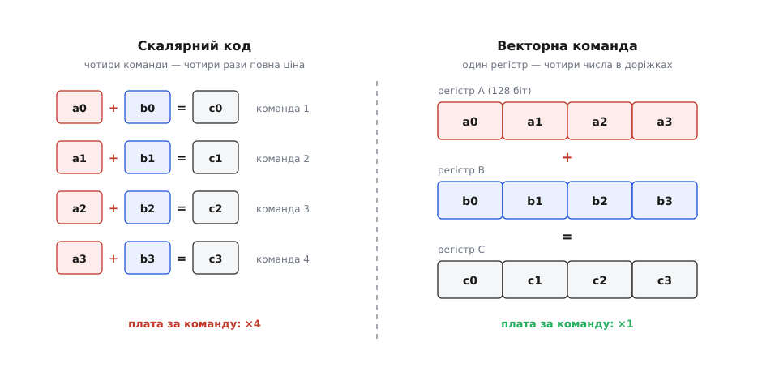
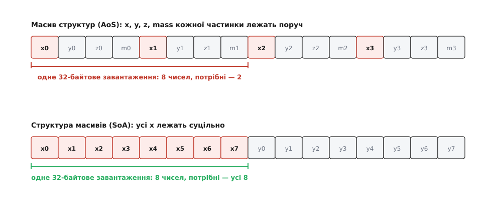
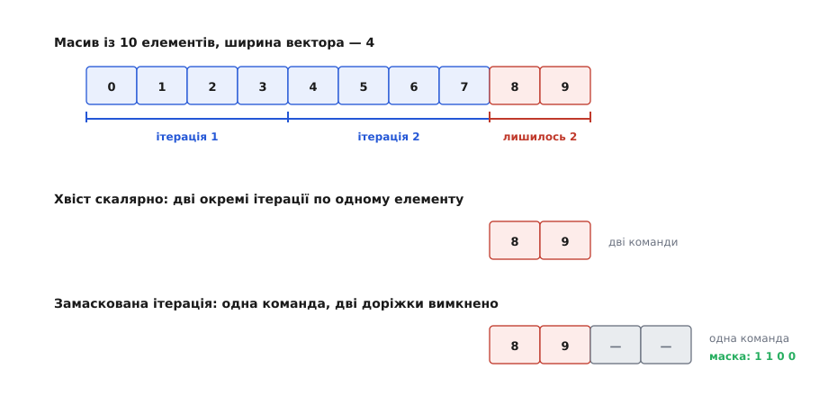
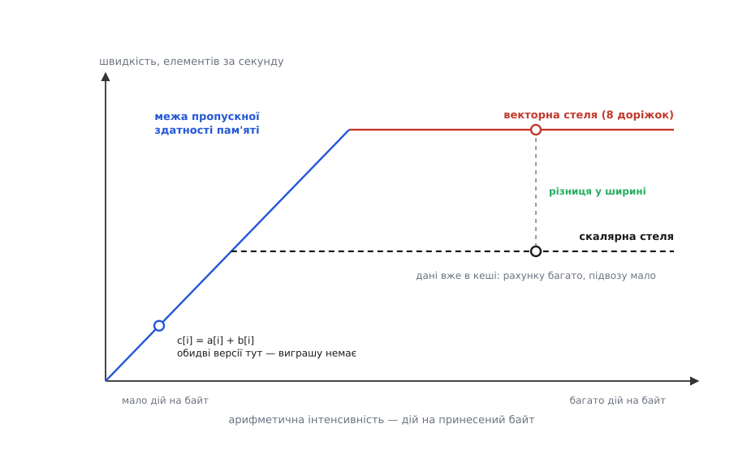

# SIMD і векторизація: одна команда на цілу пачку чисел

<preknowlist>
- [Набір інструкцій](book:programming/isa) — що таке машинна команда, її операнди й регістри; навіщо набір команд розширюють новими.
- [Складові процесора](book:programming/processor-parts) — регістри, АЛП і шлях даних усередині ядра.
- [Кеш](book:programming/cache) — кеш-лінія, промах, і чому послідовний обхід пам'яті швидший за стрибки.
- [Вирівнювання даних у пам'яті](book:programming/memory-alignment) — адреса, кратна розміру доступу, і чого залізо від неї хоче.
- [Плаваюча кома](book:programming/floating-point) — формати float32/float64 і те, що додавання таких чисел не асоціативне.
- [Конвеєр](book:programming/pipeline) — темп «одна команда за такт» і різниця між затримкою однієї команди та пропускною здатністю потоку.
</preknowlist>

Дамо процесорові найпростішу роботу, яку взагалі можна вигадати: додати два масиви по мільйону дробових чисел.

```c
void add_arrays(const float *a, const float *b, float *c, int n)
{
    for (int i = 0; i < n; i++)
        c[i] = a[i] + b[i];
}
```

Корисної арифметики тут рівно одне додавання на елемент. А процесор на кожній ітерації робить сім різних справ: завантажує `a[i]`, завантажує `b[i]`, додає, записує `c[i]`, збільшує лічильник, порівнює його з `n` і стрибає на початок. Одна корисна дія — і шість службових навколо неї.

Річ навіть не в самому числі сім, а в тому, що службові команди коштують не дешевше за корисну. Кожну команду треба вибрати з пам'яті, декодувати, дати їй місце в конвеєрі, дочекатися операндів, а потім акуратно зафіксувати результат у правильному порядку. Суматор для двох чисел float32 — це кілька тисяч вентилів; логіка, що проводить одну команду крізь сучасне ядро, важить десятки мільйонів транзисторів. Виходить дивна економіка: кремній і енергія йдуть переважно не на обчислення, а на **обслуговування потоку команд**.

Звідси й питання, з якого починається все подальше. Якщо команда дорога, а арифметика дешева, то чи не можна змусити одну команду зробити більше корисної роботи?

### Два способи вичавити з такту більше

Відповідей на це питання інженерія знайшла рівно дві, і вони протилежні за духом.

Перший — виконувати **кілька різних команд одночасно**. Так працює [суперскаляр](book:programming/superscalar): ядро дивиться на кілька наступних команд, з'ясовує, чи не залежать вони одна від одної, і розкидає незалежні по кількох виконавчих блоках. Спосіб універсальний — прискорює будь-який код, не питаючи в програміста дозволу. Але за універсальність платять: логіка перевірки залежностей росте квадратично від того, скільки команд оглядають одразу, а [позачергове виконання](book:programming/out-of-order-execution) додає до неї перейменування регістрів, вікно команд і буфер завершення. Це найдорожча частина сучасного ядра — і саме тому «ширше» ядро дає дедалі менший додаток на кожен вкладений транзистор.

Другий спосіб — лишити одну команду, але дати їй **більше даних**. Він працює не завжди, а лише тоді, коли програма робить **однакову дію над багатьма числами**: додає два масиви, множить пікселі на коефіцієнт, шукає байт у рядку, згортає сигнал із фільтром. У такому коді незалежність не треба виявляти — вона очевидна наперед: ітерації не заважають одна одній, бо кожна працює зі своїм елементом. А те, що очевидно наперед, залізу не треба доводити щотакту. Достатньо один раз записати це в набір команд.

Так з'являється команда, яка каже: «додай **чотири** пари чисел». Ціну за команду — вибірку, декодування, диспетчеризацію — платять один раз, а корисних додавань виходить чотири. Це і є SIMD (англ. *single instruction, multiple data* — одна команда, багато даних); назву взято з класифікації обчислювальних машин, яку Майкл Флінн опублікував 1966 року, розділивши архітектури за тим, скільки потоків команд і скільки потоків даних вони ведуть одночасно. Історія того, як ця ідея пройшла шлях від велетенських машин 1970-х до розширення в кожному телефоні, — окремий сюжет: [дві лінії розвитку векторних машин](book:programming/simd-vectorization/hist-simd-lineage.md), від ILLIAC IV і Cray-1 до MMX, AVX і SVE.


*Скалярний шлях і векторний шлях для тієї самої роботи. Ліворуч кожне з чотирьох додавань — окрема команда, і повну ціну проведення команди крізь ядро платять чотири рази. Праворуч чотири числа лежать в одному 128-бітовому регістрі, одна команда додає їх до чотирьох інших, і плата за команду — одна на всю четвірку. Арифметики стільки ж, накладних витрат — учетверо менше.*

Сусідні числа в такому регістрі нічого не знають одне про одне: перенос із молодшого не заходить у наступне, а результат кожної пари лягає точно на своє місце. Ці незалежні смужки апарата називають **доріжками** (англ. *lane*). Їхня незалежність — не деталь, а джерело всієї вигоди: щоб додати ще одну доріжку, треба лише ще один суматор і ширші дроти, тоді як декодер, планувальник і механізм завершення команд лишаються без змін. Тому ширина векторних регістрів росла десятиліттями майже без спротиву: 64 біти в MMX (1997), 128 у SSE (Pentium III, 1999) і в ARM NEON (ARMv7, 2005), 256 в AVX (Sandy Bridge, 2011), 512 в AVX-512 (уперше — Xeon Phi Knights Landing, 2016).

> 🔧 **Навіщо це.** Векторна одиниця — єдина частина процесора, де приріст швидкості ще дається дешево. Частота вперлася у [стіну потужності](book:programming/power-wall), ширина суперскаляра — у брак незалежних команд, а ось нові доріжки коштують майже самої арифметики. Тому кожен серйозний обчислювальний код — обробка зображень, аудіо, кодеки, лінійна алгебра, пошук у тексті, розбір JSON — сьогодні пишуть із розрахунку на векторні команди; різниця між векторною й невекторною версією того самого циклу в задачах з інтенсивною арифметикою легко сягає ×4–×8.

### Регістр — це мішок бітів, а тип задає команда

Розширення набору команд не додає процесорові нових типів чисел. Воно додає **широкі регістри** — 128, 256 чи 512 біт — і купу команд, кожна з яких по-своєму трактує вміст такого регістра.

Ті самі 128 біт — це водночас 16 байтів, 8 цілих по 16 біт, 4 числа float32 або 2 числа float64. Що саме там лежить, регістр не знає: розбиття на доріжки живе не в даних, а в команді. `_mm_add_epi16` порахує вісім 16-бітових цілих, `_mm_add_ps` — чотири float32, і обидві прочитають ті самі біти. Звідси перша практична пастка: помилка з типом команди не викликає жодного винятку — просто виходять інші числа. Компілятор ловить це через типи-обгортки, а ось у написаному вручну асемблері нема кому ловити.

Незалежність доріжок має ще один наслідок, який видно в самому наборі команд. Скалярне порівняння виставляє один прапорець, і на нього стрибає умовний перехід. А порівняння восьми пар чисел дає **вісім** відповідей — на один прапорець вони не влазять. Тому векторне порівняння пише результат туди ж, куди й арифметика: у регістр, ставлячи в кожній доріжці або всі одиниці, або всі нулі. Такий регістр — **маска**, і саме нею потім вибирають, що лишити, а що затерти.

Так само пояснюється й ще одна дивина векторних наборів: у них є окремі команди [насичувального додавання](book:programming/saturating-arithmetic), які замість переповнення притискають результат до межі типу. Для скалярного коду це рідкість — там переповнення перевіряють умовним переходом. Але у векторі переходу немає: доріжки не можуть розійтися по різних гілках, тож перевірку доводиться вбудовувати прямо в арифметику. Обробка звуку й зображень отримала насичення безкоштовно, і саме тому перші пакетні розширення виросли з мультимедійних задач.

### Годувати доріжки — задача про пам'ять, а не про арифметику

Векторна команда виконується за такт-два. Щоб вона мала що рахувати, у регістр треба **одним рухом покласти вісім сусідніх чисел**. Ось тут і починається справжня робота.

Векторне завантаження бере суцільний шматок пам'яті — 16, 32 або 64 байти поспіль — і кладе його в регістр як є. Це швидко рівно тому, що збігається з тим, як влаштована [пам'ять](book:programming/cache): дані все одно ходять кеш-лініями по 64 байти, тож одне 32-байтове читання забирає половину лінії, яку кеш і так змушений був би притягнути. Умова одна: числа мусять лежати **поруч і поспіль**.

Ця умова руйнується від найзвичайнішого рішення в дизайні програми — від того, як описано структуру даних. Хай ми моделюємо частинки:

```c
struct Particle { float x, y, z; float mass; };
struct Particle p[N];
```

Це «масив структур» (англ. *array of structures*, AoS) — так пишуть за замовчуванням, бо так думають про предметну область. Тепер спробуймо векторно посунути всі частинки по осі X. Векторне завантаження з адреси `&p[0].x` притягне вісім сусідніх чисел — але це буде `x, y, z, mass` першої частинки й `x, y, z, mass` другої. Шість із восьми доріжок займе непотріб; корисних значень — рівно два.

Достатньо перевернути розкладку — і та сама команда працює на повну:

```c
struct Particles { float x[N], y[N], z[N], mass[N]; };
```

Це «структура масивів» (англ. *structure of arrays*, SoA). Тепер `x[0..7]` лежать поспіль, одне завантаження заповнює всі вісім доріжок, і жодна не марнується. Код, що звертається до полів, стає незвичнішим на вигляд — зате векторним. Це рішення про [розкладку даних у пам'яті](book:programming/data-layout-aos-soa) ухвалюють на самому початку проєкту, і саме воно, а не прапорці компілятора, вирішує, чи буде гарячий цикл швидким.


*Та сама задача — узяти координату x восьми частинок — за двох розкладок пам'яті. У масиві структур (угорі) корисні числа розділені трьома чужими, тож суцільне 32-байтове читання дає лише два потрібні значення з восьми, а решту доводиться викидати. У структурі масивів (унизу) координати x лежать суцільно, і те саме читання заповнює регістр цілком. Арифметика в обох випадках однакова — різницю робить розкладка.*

Залізо пробує рятувати ситуацію: у AVX2 (2013) з'явилася команда **збирання** (англ. *gather*), яка бере вісім елементів за вісьмома різними адресами, а AVX-512 додала й зворотне **розсипання** (англ. *scatter*). Виглядає як розв'язок, але ним не є: усередині це все одно вісім окремих звертань до кеша, просто загорнутих в одну команду. Кеш обслуговує одну-дві лінії за такт, тож вісім адрес у восьми різних лініях коштують щонайменше кілька тактів — і тим більше, чим далі розкидані дані. Збирання рятує там, де розкидані дані **неминучі** (індексований доступ, розріджені матриці), але замінити нормальну розкладку не може.

Ще одна вимога до пам'яті — [вирівнювання](book:programming/memory-alignment). Історично невирівняне векторне завантаження було або забороненим, або в рази повільнішим; сучасні ядра виконують його майже так само швидко, як вирівняне, — крім випадку, коли читання перетинає межу кеш-лінії, і тоді доводиться зчитувати дві лінії замість однієї. Тому масиви під векторну обробку й досі варто вирівнювати на ширину регістра.

### Однакова дія — отже, одна гілка на всіх

Доріжки виконують ту саму команду. Це означає, що всередині векторної ітерації **немає розгалуження**: не буває так, щоб три доріжки пішли в гілку `if`, а п'ять — в `else`.

Що ж робити з циклом на кшталт такого?

```c
for (int i = 0; i < n; i++)
    if (a[i] > 0.0f)
        c[i] = a[i] * k;
```

Векторний код розв'язує це так: рахує **обидві** можливості для всіх доріжок, а тоді вибирає результат за маскою. Порівняння `a > 0` дає маску (одиниці там, де умова справдилася), множення рахується для всіх восьми чисел, а команда змішування бере з добутку ті доріжки, де маска одинична, і лишає старе значення там, де нульова. Умовний перехід зникає — його місце заступає арифметика над масками.

Наслідок цього фокуса треба усвідомити чітко: **вартість дорівнює сумі гілок, а не вибраній гілці**. Скалярний код із добре [передбачуваним переходом](book:programming/branch-prediction) виконує лише потрібну гілку й майже не платить за сам перехід. Векторний виконує обидві завжди. Тому векторизація виграє, коли гілки короткі й дешеві, і програє, коли одна з гілок — довгий рідкісний шлях: рахувати його для всіх елементів дорожче, ніж стрибнути в нього раз на тисячу ітерацій.

Із тієї ж заборони на розгалуження випливає, що вектор не вміє **вийти з циклу посеред пачки**. Пошук першого нуля в рядку не може зупинитися на четвертій доріжці — команда однаково відпрацює всі вісім. Тому такі задачі пишуть інакше: порівняти цілу пачку, зібрати маску в бітове число, і якщо воно ненульове — знайти позицію першого встановленого біта звичайною скалярною командою. Векторна частина шукає **пачку-кандидата**, скалярна — точне місце всередині неї. Так влаштовані швидкі реалізації `memchr`, `strlen` і пошуку підрядка.

Ідею масок можна довести до краю: якщо кожній доріжці дозволити мати власний лічильник команд і власну маску активності, вийде модель, у якій програміст пише код «для одного елемента», а залізо саме проводить крізь нього цілу пачку, вимикаючи доріжки на невзятих гілках. Саме так виконують код відеокарти — це [SIMT, модель виконання GPU](book:programming/simt-gpu-execution): вигляд у програміста скалярний, а виконання під ним залишається пакетним, з усіма наслідками для розбіжних гілок.

### Хвіст: масиви не бувають кратні ширині

Векторна команда обробляє рівно `W` елементів. Масив довжиною `n` майже ніколи не кратний `W` — і залишок доводиться якось доїдати.

Класичне рішення — розрізати цикл на дві частини: основний, що йде кроками по `W`, і хвостовий, що доробляє решту по одному.

```c
int i = 0;
for (; i + 8 <= n; i += 8)
    add8(a + i, b + i, c + i);   /* векторна ітерація: 8 елементів */
for (; i < n; i++)
    c[i] = a[i] + b[i];          /* хвіст: до семи елементів по одному */
```

Прийом називають нарізанням циклу на смуги (англ. *strip mining*). Він простий, але має неприємну властивість: для короткого масиву хвіст важить більше за основну частину. На масиві з десяти елементів векторно обробляться вісім, а два підуть скалярно — і виграш майже зникне.


*Десять елементів, ширина вектора чотири. Дві перші ітерації беруть по чотири елементи й заповнюють усі доріжки. Далі лишається два: старий підхід доробляє їх скалярно, по одному за ітерацію, а маскована ітерація робить те саме однією командою — дві активні доріжки рахують і записують результат, дві вимкнені не чіпають пам'яті поза масивом. Маска прибирає хвіст як окремий шматок коду й окреме джерело помилок.*

Друге рішення — **замаскована ітерація**: виконати останній прохід повною векторною командою, але з маскою, яка вимикає зайві доріжки. Вимкнена доріжка не пише результат і не звертається до пам'яті, тож вихід за межі масиву не стається. Саме для цього AVX-512, ARM SVE і векторне розширення RISC-V мають окремі регістри масок, у які пишуть предикат (лат. *praedicatum* — «сказане про предмет»; тут — умова, під якою доріжка вважається активною).

Із хвостом пов'язана й глибша проблема — **звідки програма взагалі знає `W`**. У наборах на кшталт SSE, AVX і NEON ширина вписана в саму команду: код, скомпільований під 256 біт, не запуститься там, де є лише 128, а на машині з 512-бітовими регістрами використає половину заліза. Практика відповідає на це збиранням кількох версій гарячої функції й вибором потрібної під час запуску — за відповіддю процесора про його можливості. Інший шлях обрали ARM SVE (2016) і векторне розширення RISC-V (RVV, стандарт 1.0 — 2021): у них ширина **не зашита в код**. Цикл на початку кожної ітерації питає машину: «скільки елементів із тих, що лишилися, ти візьмеш зараз?» — і отримує число, яке на 128-бітовому ядрі буде чотири, а на 512-бітовому шістнадцять. Той самий двійковий файл використовує повну ширину будь-якого ядра, а хвіст зникає як окремий випадок: остання ітерація просто отримує менше число.

### Редукція: коли доріжки мусять зустрітися

Доти вся вигода трималася на тому, що доріжки незалежні. Але маса корисних обчислень закінчується **згорткою всіх елементів в одне число**: сума масиву, скалярний добуток, максимум, норма. Тут доріжкам доводиться зустрітися — і саме тут з'являється найтонше місце векторизації.

Робиться це у два кроки. Спершу цикл веде **векторний акумулятор**: вісім часткових сум, кожна у своїй доріжці, кожна накопичує «свої» елементи (нульова доріжка бере елементи 0, 8, 16…, перша — 1, 9, 17… і так далі). Векторна арифметика тут працює на повну. І лише коли масив скінчився, вісім часткових сум складають в одну — горизонтальним додаванням, тобто зсувами й додаваннями всередині регістра. Ця операція повільна, бо порушує саму ідею незалежних доріжок, — але вона одна на весь цикл, тож її ціна розчиняється.

Придивімося до порядку доданків. Скалярний цикл додає числа зліва направо: `((a₀+a₁)+a₂)+a₃`. Векторний спершу назбирує окремі суми в доріжках, а потім складає їх: `(a₀+a₄)+(a₁+a₅)+…`. Для цілих чисел різниці немає. Для [чисел із плаваючою комою](book:programming/floating-point) — є: кожне додавання округлюється, тож інший порядок дає **інший результат**. Не «неправильний», а інший — часто навіть точніший, бо часткові суми ростуть повільніше й менше з'їдають молодші розряди.

Ось чому компілятор за замовчуванням **відмовляється** векторизувати суму дробових чисел: стандарт мови вимагає порядку, записаного в програмі, а векторизація його змінює. Це не надмірна обережність, а чесність — і саме тому дозвіл доводиться давати явно: прапорцем на кшталт `-ffast-math` (який дозволяє й багато чого іншого, тож у чисельному коді небезпечний) або точковою вказівкою `#pragma omp simd reduction(+:sum)`, що дозволяє переупорядкування лише для цього циклу.

Одного векторного акумулятора, до речі, замало — і причина цього вже суто конвеєрна. Команда множення з накопиченням [FMA](book:programming/fused-multiply-add) на типовому ядрі має затримку близько чотирьох тактів, а запускати такі команди можна дві за такт. Коли акумулятор один, кожна наступна FMA чекає результату попередньої: ядро видає одну команду на чотири такти замість двох за такт — увосьмеро менше. Щоб конвеєр був повний, потрібно вісім незалежних ланцюжків, тобто вісім векторних акумуляторів, які складають докупи вже наприкінці. Розгортання циклу тут не косметика, а різниця в кілька разів.

Як це виглядає в справжньому коді — від наївного циклу до версії на вбудованих функціях-інтрінсиках, із хвостом, кількома акумуляторами й вимірюванням, — розібрано окремо: [скалярний добуток, векторизований трьома способами](book:programming/simd-vectorization/proj-simd-dot-product.md).

### Три шляхи, якими код стає векторним

Тепер, коли видно, чого векторна команда вимагає від даних і від керування, стає зрозуміло, чому шляхів до неї три — і чому вони не рівноцінні.

**Автовекторизація.** Компілятор сам розпізнає цикл, який можна перекласти на векторні команди. Щоб це зробити, він мусить **довести**, що ітерації незалежні — а доводити доводиться в умовах, де він знає менше за програміста. Ось типові речі, які зупиняють доведення:

- **Аліасинг покажчиків.** У функції `add_arrays` компілятор не знає, чи не вказує `c` на ту саму пам'ять, що й `a`. Якщо вказує, ітерації залежні, і векторизувати не можна. Вихід — сказати правду ключовим словом `restrict` (у C) або дати компілятору змогу згенерувати перевірку перекриття під час виконання. Це найчастіша причина, чому «простий цикл чомусь не векторизувався»; глибше — у темі про [аліасинг покажчиків](book:programming/pointer-aliasing).
- **Залежність між ітераціями.** `a[i] = a[i-1] + b[i]` векторизувати неможливо в принципі: восьма сума потребує сьомої. Ніякий прапорець тут не допоможе — потрібен інший алгоритм.
- **Виклики, які не інлайняться.** Виклик функції всередині циклу зазвичай ставить хрест на векторизації: компілятор не бачить, що там усередині.
- **Складне керування й невідомий крок.** Кілька виходів із циклу, доступ із кроком, обчисленим під час виконання, індекси через інший масив — усе це або блокує векторизацію, або зводить її до повільного збирання.
- **Дробова редукція** — уже описаний випадок, коли компілятор має рацію й мовчки не порушує стандарт.

Найкорисніша звичка тут — не гадати, а **спитати компілятор**: `-fopt-info-vec-missed` у GCC чи `-Rpass-missed=loop-vectorize` у Clang друкують, який цикл не векторизувався й через що саме. Часто відповідь виявляється однорядковою правкою. Що ще компілятор робить із циклами й у якому порядку — у темі про [оптимізації компілятора](book:programming/compiler-optimizations).

**Вбудовані функції-інтрінсики.** Це функції, які компілятор перекладає одна в одну у векторні команди: `_mm256_loadu_ps` — завантаження, `_mm256_fmadd_ps` — множення з накопиченням. Ви фіксуєте самі команди й ширину, але розподіл регістрів, планування й розгортання лишаються за компілятором — тому інтрінсики майже завжди швидші за рукописний асемблер і незрівнянно легші в супроводі. Плата — прив'язка до набору команд: код на AVX не збереться під ARM. Її гасять або збиранням кількох варіантів під різні набори, або бібліотеками-обгортками (Highway, xsimd), які дають один переносний запис поверх різних наборів.

**Готові бібліотеки.** Найдешевший векторний код — той, якого ви не писали. Множення матриць у BLAS, `memcpy`, пошук у рядках стандартної бібліотеки, кодеки, стиснення, розбір JSON — усе це вже написано вручну на інтрінсиках і відлагоджено під конкретні набори команд. Перш ніж векторизувати самому, варто переконатися, що задача не зводиться до виклику такої бібліотеки.

Розумний порядок дій випливає сам: спершу поміряти й знайти справді гарячий цикл; потім подивитися, чи не бере його бібліотека; далі почитати звіт компілятора й прибрати те, що заважає автовекторизації; і лише коли цього мало — писати інтрінсики, обгородивши їх тестом, який порівнює результат зі скалярною версією.

> 🔧 **Навіщо це.** Вартість супроводу трьох шляхів різна на порядки. Скалярний цикл із `restrict` читає будь-хто, він переносний і сам користається з нової ширини регістрів, щойно ви переберете його новішим компілятором. Ділянка на інтрінсиках прив'язана до набору команд, потребує окремої скалярної версії про запас і власних тестів. Тому в реальному проєкті інтрінсики тримають у кількох відсотках коду — там, де вимірювання показало гаряче місце, — а решту лишають компіляторові.

### Куди дівається виграш

Наївне сподівання «вісім доріжок — увосьмеро швидше» майже ніколи не справджується. Причин три, і вони діють одночасно.

**Перша — частка векторного коду.** Прискорюється лише те, що векторизувалося. Якщо векторний цикл займав 60 % часу програми й пришвидшився увосьмеро, загальний виграш — лише трохи більший за подвійний (1 ÷ (0.4 + 0.6/8) ≈ 2.1): решта 40 % лишилися незмінними. Це звичайний [закон Амдала](book:algorithms/amdahls-law), і він однаково безжальний до всіх видів прискорення.

**Друга — пропускна здатність пам'яті**, і саме вона здебільшого й з'їдає обіцяне. Векторна одиниця споживає дані у вісім разів швидше, ніж скалярна; якщо їх не встигає підвозити пам'ять, зайві доріжки просто чекають. Порахуймо на нашому першому прикладі.

**Умова: ядро 3 ГГц з 256-бітовими регістрами (8 чисел float32 за раз), пропускна здатність пам'яті 50 ГБ/с, масиви по мільйону елементів — у кеш не влазять.**

```
Обмін з пам'яттю на один елемент c[i] = a[i] + b[i]:
  читання a[i]                        =  4 байти
  читання b[i]                        =  4 байти
  читання лінії c перед записом       =  4 байти   (кеш спершу тягне лінію,
  запис c[i]                          =  4 байти    у яку збирається писати)
  разом                               = 16 байтів

Стеля з боку пам'яті:
  50·10⁹ Б/с ÷ 16 Б  = 3.1·10⁹ елементів/с

Стеля з боку ядра (запис — один за такт: скалярно 1 елемент, векторно 8):
  скалярна:  3·10⁹ тактів/с × 1 елемент  =  3.0·10⁹ елементів/с
  векторна:  3·10⁹ тактів/с × 8 доріжок  = 24·10⁹ елементів/с

Фактична швидкість = менша з двох стель:
  скалярна:  min(3.0, 3.1) = 3.0·10⁹ елементів/с
  векторна:  min(24,  3.1) = 3.1·10⁹ елементів/с

Приріст від векторизації = 3.1 / 3.0 ≈ 1.03  →  близько 3 %
```

Три відсотки замість восьмиразового прискорення — і жодної помилки в коді. Цикл додавання двох великих масивів **обмежений пам'яттю**: на кожні 16 перевезених байтів припадає одна арифметична дія, тож ядро й у скалярному режимі вже майже вичерпало канал.

Тепер та сама машина на скалярному добутку: два читання (8 байтів) і дві дії — множення й додавання — на елемент, причому FMA робить їх однією командою. Записів немає взагалі, тож межу з боку ядра ставлять читання: ядро виконує їх два за такт незалежно від того, скалярні вони чи векторні.

```
Стеля з боку пам'яті:  8 Б на елемент  →  50·10⁹ ÷ 8 = 6.2·10⁹ елементів/с

Стеля з боку ядра (два читання з кеша за такт):
  скалярна:  3·10⁹ × 1 елемент  =  3.0·10⁹ елементів/с
  векторна:  3·10⁹ × 8 елементів = 24·10⁹ елементів/с

Масиви завеликі для кеша, дані йдуть із пам'яті:
  скалярно min(3.0, 6.2) = 3.0 ;  векторно min(24, 6.2) = 6.2  →  приріст ≈ 2.1×

Масиви вміщаються в кеш L1, стеля пам'яті відпадає:
  скалярно 3.0 ;  векторно 24                                  →  приріст ≈ ×8
```

Один і той самий векторний код дає то ×2, то ×8 — залежно виключно від того, **звідки приходять дані**. Звідси й головний практичний висновок: перш ніж векторизувати цикл, порахуйте, скільки арифметичних дій припадає в ньому на один перевезений байт. Це відношення називають арифметичною інтенсивністю, і саме воно вирішує, чи є що прискорювати; загальний спосіб прикинути стелю дає [roofline-модель](book:algorithms/roofline-model), а виведення обох стель разом із числами — у [розрахунку стелі векторизації](book:programming/simd-vectorization/math-simd-speedup.md).


*Дві стелі одночасно. Похила пряма — усе, що встигає підвезти пам'ять: чим менше дій на байт, тим нижче вона тисне. Горизонталі — межі самої арифметики, скалярна й векторна. Реальна швидкість — менше з двох. Ліворуч, у зоні низької інтенсивності, обидві версії лежать на похилій прямій і векторизація не дає нічого; праворуч, коли даних мало, а дій багато, працює повна різниця між доріжками. Зсунути задачу вправо можна лише одним способом — змусивши її робити більше дій над уже принесеними даними.*

**Третя причина — частота й енергія.** Широкі векторні блоки — це велика площа, що перемикається одночасно, і великий стрибок струму. Серверні процесори Intel покоління Skylake-SP на важких 512-бітових командах знижували частоту ядра приблизно на чверть, а коли такі команди виконували всі ядра, падіння сягало вдвічі. Виходило парадоксально: перехід із 256 на 512 біт міг **сповільнити** програму, у якій векторна частина невелика, бо весь інший код теж працював на зниженій частоті. У пізніших поколіннях (від Ice Lake) це послабили, але сам механізм нікуди не подівся — він прямо випливає зі [стіни потужності](book:programming/power-wall).

Ці три стелі й пояснюють, чому векторизація в реальних програмах дає частіше ×1.5–×3, ніж обіцяні ×8. Причому найчастіше винна друга — і жодним переписуванням циклу її не обійти: полагодити можна тільки алгоритм, який менше ходить у пам'ять.

### Що це змінює в тому, як писати програми

SIMD переносить вартість з одного місця в інше. Арифметика в гарячому циклі стає майже безкоштовною — а ось **форма даних** із деталі реалізації перетворюється на частину алгоритму. Розкладка масивів, вирівнювання, кількість дій на принесений байт, передбачуваність доступу — усе те, про що в скалярному коді можна було не думати, тепер прямо визначає, чи буде виграш.

Практичний висновок із цього незручний, але точний: векторизація — не прапорець компілятора й не набір інтрінсиків, а рішення, ухвалене задовго до гарячого циклу, коли ви обираєте, як лежатимуть дані. Цикл, написаний над правильно розкладеними даними, компілятор зазвичай векторизує сам. Цикл над зручними для читання, але розкиданими структурами не врятують ні інтрінсики, ні найширші регістри — вони лише швидше чекатимуть на пам'ять.
