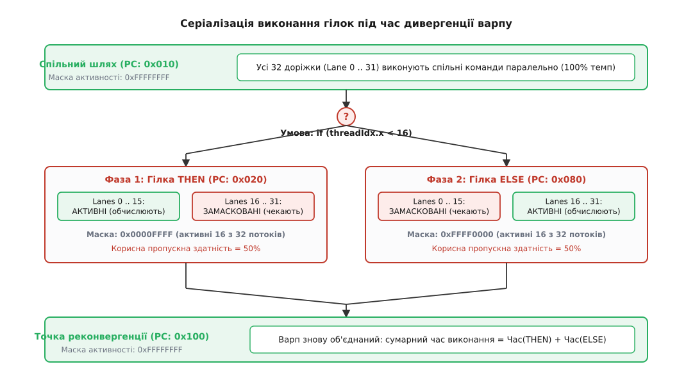
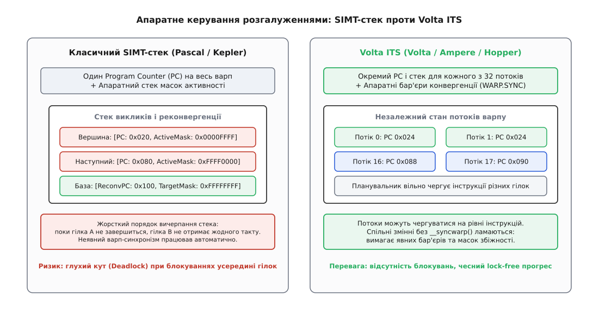
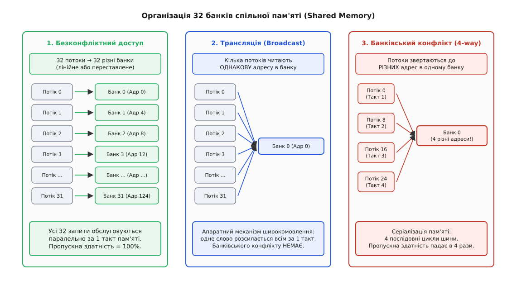
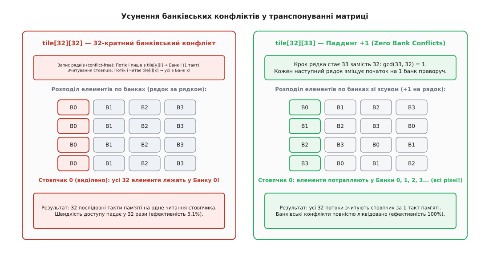

# Дивергенція варпів та банківські конфлікти GPU

<preknowlist>
- [SIMT: модель виконання потоків і варпів на GPU](topic:programming/simt-gpu-execution) — групування 32 скалярних потоків у варп зі спільним лічильником команд.
- [Конвеєр](topic:programming/pipeline) — стадії виконання інструкції, темп видачі та затримка операндів.
- [Кеш](topic:programming/cache) — кеш-лінії, просторова локальність і ціна промаху в пам'ять.
- [Передбачення переходів](topic:programming/branch-prediction) — спекулятивне виконання та ціна хибного передбачення на CPU.
- [Розкладка даних у пам'яті: масив структур і структура масивів](topic:programming/data-layout-aos-soa) — вплив AoS та SoA на упаковку векторів.
- [Вирівнювання даних у пам'яті](topic:programming/memory-alignment) — вимоги заліза до кратності адрес і транзакцій шини.
</preknowlist>

Уявімо ядро симуляції частинок або трасування променів на графічному процесорі з 16 384 паралельними АЛП: один варп із 32 потоків обробляє зіткнення променів із геометрією сцени. Якщо для одного-єдиного променя з 32 алгоритм вимагає обходу глибокого ієрархічного дерева просторового розбиття (50 ітерацій циклу), а для решти 31 променя перевірка завершується негайно (0 ітерацій), апаратний планувальник GPU не може відпустити 31 вільний потік на наступні завдання. Через спільний лічильник команд усі 31 потік змушені простояти у замаскованому стані всі 50 ітерацій, через що корисна обчислювальна потужність варпу падає на 96.875% — до швидкості одного скалярного ядра. Якщо ж після цього ці 32 потоки спробують зберегти координати зіткнень у спільну пам'ять із кроком у 32 слова, контролер пам'яті не зможе обслужити їх паралельно: замість 1 такту запити вишикуються у чергу на 32 послідовні цикли шини, уповільнюючи виконання в 32 рази.

Ці два явища — **дивергенція варпів** (англ. *warp divergence*, розходження шляхів виконання) та **банківські конфлікти** (англ. *bank conflicts*, колізії у локальній пам'яті SRAM) — є головними факторами втрати продуктивності на архітектурах SIMT (англ. *Single Instruction, Multiple Threads*).

### Природа дивергенції варпу: спільний Program Counter

У моделі SIMT програміст описує поведінку одного скалярного потоку. Проте на кристалі графічного процесора фізичний блок вибірки та декодування інструкцій (англ. *Instruction Fetch and Decode Unit*) є спільним для цілої групи з 32 потоків — **варпу** (англ. *warp* у термінології Nvidia) або **вейвфронту** (англ. *wavefront* у термінології AMD, де розмір може становити 32 або 64 потоки).

Усі 32 потоки варпу одночасно виконують одну й ту саму машинну інструкцію над 32 фізичними виконавчими доріжками (англ. *execution lanes*). Поки всі потоки йдуть лінійним кодом, апаратний конвеєр завантажений на 100%: за один такт видачі виконуються 32 арифметичні операції.

Проблема виникає, коли в програмі з'являється умовне розгалуження, умова якого залежить від номера потоку (`threadIdx.x`) або від оброблюваних даних:

:::tabs
```c
// Приклад дивергентного коду (C / CUDA C)
__global__ void process_elements(float *output, const float *input, int threshold)
{
    int tid = threadIdx.x;
    float value = input[tid];

    if (value > threshold) {
        // Гілка A: тривале математичне обчислення
        output[tid] = sqrtf(value) * logf(value) + expf(value * 0.1f);
    } else {
        // Гілка B: швидке обнулення
        output[tid] = 0.0f;
    }
}
```
```cpp
// Приклад дивергентного коду (Modern CUDA C++)
#include <cuda_runtime.h>
#include <cmath>
#include <span>

namespace gpu {

template <typename T>
__global__ void process_elements(T * __restrict__ output, const T * __restrict__ input, T threshold)
{
    const int tid = threadIdx.x;
    const T value = input[tid];

    if (value > threshold) {
        // Гілка A: тривале обчислення
        output[tid] = std::sqrt(value) * std::log(value) + std::exp(value * static_cast<T>(0.1));
    } else {
        // Гілка B: обнулення
        output[tid] = static_cast<T>(0);
    }
}

} // namespace gpu
```
:::

Якщо у вхідному масиві частина елементів більша за поріг, а частина менша, виникає розходження: потоки 0..15 мають піти у гілку `A`, а потоки 16..31 — у гілку `B`. Оскільки апаратний лічильник команд у варпі один, процесор фізично не здатний одночасно передати на виконавчі блоки інструкції квадратного кореня для першої половини варпу та команду збереження нуля для другої половини.

### Механізм апаратної серіалізації: маска активності

Щоб виконати обидві гілки, графічний процесор застосовує **серіалізацію** (послідовне виконання):
1. **Фаза 1 (Гілка THEN):** Лічильник команд встановлюється на адресу першої гілки. Апаратний регістр **маски активності** (англ. *Active Mask* або *Execution Mask*) вимикає доріжки 16..31. Потоки 0..15 обчислюють математичні функції, тоді як потоки 16..31 простоюють, а їхні результати блокуються від запису в регістровий файл.
2. **Фаза 2 (Гілка ELSE):** Лічильник команд переходить до другої гілки. Маска активності інвертується: доріжки 0..15 вимикаються, а доріжки 16..31 записують нулі.
3. **Фаза 3 (Реконвергенція):** Після завершення обох гілок варп досягає спільної точки злиття (вузол реконвергенції, англ. *reconvergence point*). Маска активності знову встановлюється у `0xFFFFFFFF`, і всі 32 потоки продовжують спільне паралельне виконання.


*Апаратна серіалізація виконання розгалуження на GPU. Коли потоки варпу обирають різні шляхи if-else, графічний процесор спочатку виконує гілку THEN з вимкненими доріжками 16..31, а потім гілку ELSE з вимкненими доріжками 0..15, подвоюючи сумарний час виконання.*

Сумарний час виконання розгалуженого блоку дорівнює сумі часів обох гілок:

```
Час_виконання = Час(Гілка_THEN) + Час(Гілка_ELSE)
```

Якщо розгалуження містить `N` різних шляхів (наприклад, оператор `switch` на 8 варіантів), і кожен варіант обирається хоча б одним потоком варпу, сумарний час виконання зростає у 8 разів, а середня корисна утилізація обчислювальних конвеєрів падає до `1/8 = 12.5%`.

> 🔧 **Навіщо це.** Дивергенція варпів виникає **лише всередині одного варпу**. Якщо всі 32 потоки варпу одностайно обирають гілку `THEN` (навіть якщо сусідній варп одностайно обирає гілку `ELSE`), дивергенції немає: кожен варп виконає лише свою гілку на повній швидкості. Тому оптимізація полягає не у відмові від розгалужень, а в забезпеченні однорідності умов у межах кожного 32-потокового варпу.

### Апаратні механізми обробки розгалужень: предикація проти стека

Графічні процесори використовують два принципово різні апаратні механізми для виконання умовного коду залежно від розміру гілок:

#### 1. Предикація інструкцій (Predication)
Для коротких умовних блоків (1–4 інструкції) генератор коду компілятора не створює інструкцій стрибка `BRA` (англ. *Branch*). Замість цього використовуються 1-бітні предикатні регістри (наприклад, `p0..p7` у системі команд Nvidia SASS).

Умова обчислюється однією командою порівняння, яка записує бітовий результат у предикат `p0`. Далі всі наступні інструкції маркуються цим предикатом:

```
ISETP.GT.AND p0, pt, R2, R3, pt;   // p0 = (R2 > R3)
@p0  FADD R4, R4, R5;              // R4 = R4 + R5 (лише для потоків з p0 == true)
@!p0 FMUL R4, R4, R6;              // R4 = R4 * R6 (лише для потоків з p0 == false)
```

При предикації конвеєр не скидається, лічильник команд просувається лінійно, а вимкнені доріжки просто відкидають результат запису в регістр.

#### 2. Стек реконвергенції проти Volta ITS
Для великих умовних блоків предикація стає надто дорогою, оскільки змушує всі доріжки проходити через тіло обох довгих гілок. Тут залізо задіює керування лічильником команд:
* **Класичний SIMT-стек (Kepler, Maxwell, Pascal):** варп має один спільний PC. Адреси гілок і маски збіжності зберігаються в апаратному стеку реконвергенції (інструкції `SSY` та `SYNC`). Потоки рухаються строго покроково (lockstep). Детальний аналіз кризи неявного синхронізму та еволюції цієї моделі наведено у нарисі: [еволюцію від апаратного SIMT-стека до Volta ITS](topic:programming/simt-warp-divergence/hist-stack-to-its.md).
* **Незалежне планування потоків (Independent Thread Scheduling, ITS):** починаючи з архітектури Volta, кожен потік отримав власний лічильник команд. Планувальник може переривати та чергувати інструкції різних потоків варпу, що ліквідувало апаратні глухі кути при синхронізації, але вимагає використання явних бар'єрів збіжності `__syncwarp()`.


*Еволюція планування потоків: класичний SIMT-стек з єдиним PC на варп (ліворуч) проти незалежного планування потоків ITS з індивідуальними PC та апаратними бар'єрами синхронізації (праворуч).*

### Методи усунення та пом'якшення дивергенції

Щоб повернути графічному процесору його пікову обчислювальну потужність, застосовують чотири фундаментальні підходи:

#### 1. Безрозгалужені обчислення (Branchless Programming)
Заміна розгалужень `if-else` на арифметичні еквіваленти за допомогою вбудованих апаратних функцій вибору `fminf()`, `fmaxf()` або умовного селектора `selp`:

```
// Розгалужений варіант:
float result;
if (x > 0.0f) result = x * weight; else result = 0.0f;

// Безрозгалужений варіант (1 інструкція FMNMX або FFMA):
float result = fmaxf(0.0f, x) * weight;
```

#### 2. Сортування та групування вхідних даних (Binning / Sorting)
Якщо завдання обробляє різнорідні елементи (наприклад, різні типи матеріалів у рендерингу або частинки з різною поведінкою), вхідні масиви попередньо сортують за типом роботи. У результаті кожен варп отримує пакети однакових завдань, і розгалуження всередині варпу зникають.

#### 3. Варпові інтринсики (Warp-Level Primitives)
Замість передачі проміжних прапорців через пам'ять або використання бар'єрів блоку, потоки варпу обмінюються станом безпосередньо через регістрові комутатори за 1 такт за допомогою функцій `__ballot_sync()`, `__shfl_sync()` та `__any_sync()`. Повний опис сигнатур, параметрів та правил маскування наведено у довіднику: [довідку з варпових інтринсиків](topic:programming/simt-warp-divergence/api-warp-intrinsics.md).

---

### Фізична організація спільної пам'яті (Shared Memory)

Другим критичним фактором продуктивності GPU є ефективність доступу до надшвидкої вбудованої пам'яті мультипроцесора — **спільної пам'яті** (англ. *Shared Memory* або Local Data Share, LDS).

Спільна пам'ять — це розміщений прямо на кристалі SM масив пам'яті SRAM обсягом від 48 КБ до 228 КБ на мультипроцесор. Вона має затримку доступу лише у 20–30 тактів (порівняно з 200–400 тактами для глобальної пам'яті DRAM) і пропускну здатність понад 15 ТБ/с на весь чип.

Щоб забезпечити одночасний паралельний доступ для 32 потоків варпу за один такт, спільна пам'ять фізично розбита на **32 незалежні банки пам'яті** (від банку 0 до банку 31).

```
Організація 4-байтних банків у пам'яті:

Байтова адреса:     0   4   8  12  16  20  ... 120 124 128 132 136 ...
Індекс слова:       0   1   2   3   4   5  ...  30  31  32  33  34 ...
Номер банку:        0   1   2   3   4   5  ...  30  31   0   1   2 ...
                    ▲                                    ▲
                    │                                    │
                Рядок 0                              Рядок 1
```

Кожен банк обслуговує 32-бітні слова (4 байти) і має власний порт адресації та читання. Номер банку для будь-якої 4-байтної адреси визначається формулою залишкового відображення:

```
Номер_банку = (Байтова_адреса / 4) mod 32
```

### Три сценарії звернення до спільної пам'яті

Коли варп виконує інструкцію завантаження зі спільної пам'яті (`LDS`) або запису в неї (`STS`), можливі три фундаментальні сценарії:

#### 1. Безконфліктний паралельний доступ (Conflict-Free)
Кожен із 32 потоків звертається до **різного банку** (потік 0 до банку 0, потік 1 до банку 1, ..., потік 31 до банку 31, або в будь-якому переставленому порядку). Контролер пам'яті транслює всі 32 адреси на відповідні банки одночасно. Усі 32 слова вибираються **за 1 такт пам'яті**, пропускна здатність становить 100%.

#### 2. Апаратне широкомовлення (Broadcast / Multicast)
Якщо кілька потоків у варпі звертаються до **однієї й тієї самої адреси в межах одного банку**, контролер пам'яті активує апаратну схему трансляції (Broadcast): одне прочитане 4-байтне слово одночасно копіюється на всі виконавчі доріжки, які його запросили. Такий доступ також виконується **за 1 такт** і не створює конфлікту.

#### 3. Банківський конфлікт (Bank Conflict)
Якщо 2 або більше потоків варпу звертаються до **РІЗНИХ адрес, що потрапляють в ОДИН І ТОЙ САМИЙ банк**, виникає апаратна колізія. Оскільки кожен фізичний банк має лише один адресний порт, він не здатний видати два різні слова одночасно.

Контролер пам'яті змушений **серіалізувати** запити:
* Якщо 2 потоки претендують на один банк (2-кратний конфлікт, англ. *2-way conflict*), пам'ять виконує 2 послідовні цикли.
* Якщо 4 потоки б'ють в один банк (4-кратний конфлікт), потрібно 4 цикли.
* Якщо всі 32 потоки намагаються прочитати різні адреси в одному банку (32-кратний конфлікт), транзакція розтягується на **32 послідовні такти**, а швидкість доступу до спільної пам'яті падає в 32 рази (до 3.125%).


*Структура спільної пам'яті: паралельний безконфліктний доступ (ліворуч), апаратне широкомовлення без конфліктів (посередині) та серіалізація при 4-кратному банківському конфлікті (праворуч).*

> ⚠️ **Конфлікти запису (Write Conflicts):** якщо кілька потоків намагаються одночасно записати різні значення за однією й тією самою адресою в банку, виникає невизначеність даних (стан гонитви): результат запису залежить від порядку обробки на шині. Для безпечного паралельного запису слід використовувати атомарні операції у спільній пам'яті (`atomicAdd` тощо).

### Шаблони доступу та усунення банківських конфліктів

Найчастіше банківські конфлікти виникають під час роботи з двовимірними масивами, матрицями або при зверненні до пам'яті з фіксованим кроком (англ. *stride*).

Якщо потік `i` звертається до елемента `A[i * S]`, де `S` — крок у 4-байтних словах, то ступінь банківського конфлікту строго описується теорією циклічних підгруп:

```
Ступінь_конфлікту = gcd(S, 32)
```

де `gcd` — найбільший спільний дільник. Повне алгебраїчне виведення цієї формули та таблиця кратностей наведені у теоретичному розділі: [математичне виведення банківських конфліктів при кроковому доступі](topic:programming/simt-warp-divergence/math-bank-stride.md).

#### Метод 1: Паддинг спільних масивів (Padding)
Класичним прикладом є матричне транспонування, де квадратний блок `tile[32][32]` записується за рядками (без конфліктів), але зчитується за стовпцями: потік `i` читає `tile[i][0]`. Оскільки крок між рядками дорівнює 32, усі 32 потоки звертаються до банку 0 (`gcd(32, 32) = 32`), що створює повний 32-кратний конфлікт.

Рішення полягає у додаванні одного фіктивного стовпця паддингу:

```
__shared__ float tile[32][33]; // Крок рядка стає 33 замість 32
```

Оскільки `gcd(33, 32) = 1`, кожен наступний рядок масиву зміщується у банках на 1 позицію праворуч. У результаті будь-який вертикальний стовпчик розподіляється за 32 різними банками, повністю ліквідуючи конфлікти.


*Розподіл елементів матриці за банками: масив 32×32 спричиняє 32-кратний конфлікт при читанні стовпчика (ліворуч), тоді як паддинг 32×33 зсуває кожен рядок на 1 банк і повністю усуває конфлікти (праворуч).*

#### Метод 2: Бітове перемішування адрес (XOR Swizzling)
Якщо пам'ять SRAM обмежена і виділяти додаткові байти на паддинг небажано, застосовують операцію побітового XOR над індексами:

```
int bank_swizzled = col ^ (row & 31);
tile[row][bank_swizzled] = value;
```

XOR-свізлінг створює бієктивне відображення координат, яке математично гарантує відсутність конфліктів як за рядками, так і за стовпцями, зберігаючи розмір масиву `32 × 32`.

Повний порівняльний аналіз наївного ядра, паддингу та свізлінгу з реальними вимірюваннями на Nvidia RTX 4090 розібрано в практичному посібнику: [проєкт оптимізації матричного транспонування у спільній пам'яті](topic:programming/simt-warp-divergence/proj-matrix-transpose-smem.md).

---

### Апаратні лічильники та профілювання у Nsight Compute

Для діагностики втрат від дивергенції варпів та банківських конфліктів у реальних додатках використовують апаратний профілювальник **NVIDIA Nsight Compute** (`ncu`):

```
# Запуск детального профілювання метрик варпів та пам'яті:
ncu --metrics sm__warp_execution_efficiency.pct,\
sm__branch_efficiency.pct,\
l1tex__data_bank_conflicts_pipe_lsu_mem_shared_op_ld.sum,\
l1tex__data_bank_conflicts_pipe_lsu_mem_shared_op_st.sum \
./my_cuda_app
```

```
Ключові метрики та їхні цільові значення:

1. sm__warp_execution_efficiency.pct (Ефективність виконання варпів)
   Формула:     (Активні_потоки / (Загальна_кількість_потоків_варпу * Такти)) * 100%
   Норма:       > 85%. Падіння нижче 50% свідчить про тяжку дивергенцію варпів.

2. sm__branch_efficiency.pct (Ефективність розгалужень)
   Формула:     (Недивергентні_розгалуження / Загальна_кількість_розгалужень) * 100%
   Норма:       > 95%.

3. l1tex__data_bank_conflicts_pipe_lsu_mem_shared_op_ld.sum (Конфлікти читання)
   Норма:       0 або мінімальні значення відносно загальної кількості LDS інструкцій.
   Діагностика: Ненульові значення вказують на необхідність застосування паддингу або свізлінгу.
```

Розуміння фізики виконання варпів та організації банків пам'яті дозволяє проектувати паралельні алгоритми, які досягають понад 80–90% від теоретичної пікової швидкості кремнію.
