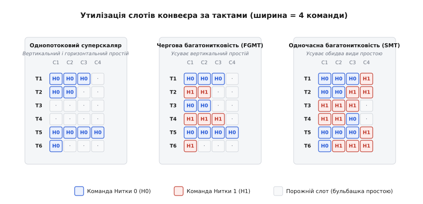
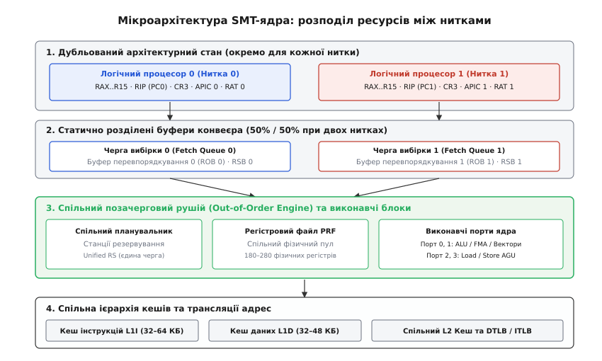
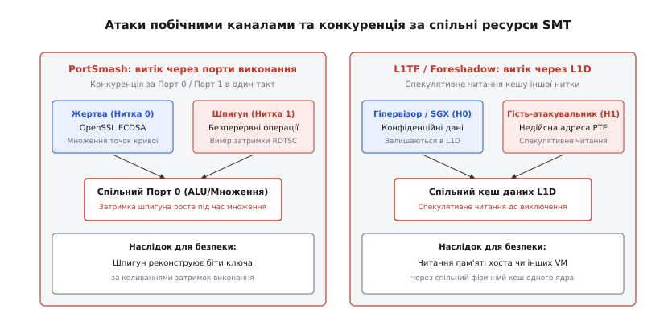
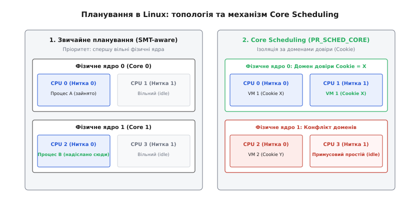

# SMT / Hyper-Threading: дві нитки на одне фізичне ядро

<preknowlist>
- [Конвеєр](topic:programming/pipeline) — стадії вибірки, декодування та виконання команд.
- [Суперскалярна архітектура](topic:programming/superscalar) — паралельна видача кількох незалежних команд за такт (IPC > 1).
- [Позачергове виконання](topic:programming/out-of-order-execution) — динамічне планування інструкцій через станції резервування та буфер перевпорядкування.
- [Передбачення переходів](topic:programming/branch-prediction) — спекулятивне виконання та штраф за скидання конвеєра.
- [Кеш](topic:programming/cache) — ієрархія швидкої пам'яті L1/L2/L3 та ціна промахів.
- [TLB](topic:programming/tlb) — буфер трансляції віртуальних адрес.
- [Багатоядерні процесори](topic:programming/multicore) — паралелізм на рівні фізично відокремлених ядер.
</preknowlist>

Сучасне процесорне ядро здатне вибирати й декодувати до 6–8 інструкцій щотакту, проте в реальних програмах його виконавчі блоки завантажені заледве на чверть. Середній темп виконання (IPC, англ. *instructions per cycle*) для звичайного однопотокового коду рідко перевищує 1.2–1.8 інструкції за такт. Решта обчислювальних портів — дорогі цілочислові АЛП, блоки множення, векторні прискорювачі та канали доступу до пам'яті — щотакту простоюють. Причина криється в самій природі послідовних програм: промах у кеші першого рівня (L1D) зупиняє ланцюжок обчислень на 4–15 тактів, промах у кеші останнього рівня (LLC) змушує ядро чекати оперативну пам'ять 150–250 тактів, а хибне передбачення переходу вимагає повного очищення конвеєра з втратою 15–20 тактів роботи.

У результаті конвеєр наповнюється порожнечею — бульбашками простою (англ. *pipeline bubbles*). Одночасна багатонитковість (англ. *Simultaneous Multithreading*, **SMT**, в інженерній термінології Intel — **Hyper-Threading Technology**) розв'язує цю проблему за рахунок паралельного живлення одного конвеєра інструкціями з двох або більше незалежних програмних ниток. Замість побудови другого повноцінного фізичного ядра виробник дублює лише мінімальний набір регістрів архітектурного стану (менш ніж 5% площі кристала), змушуючи одне широке ядро працювати для операційної системи як два повноцінні логічні процесори.

### Куди зникає ширина суперскаляра: два види конвеєрного простою

Щоб зрозуміти, чому звичайне розширення конвеєра перестає прискорювати програми, необхідно розглянути структуру втрачених тактів усередині [суперскалярного ядра](topic:programming/superscalar). Кожен такт роботи процесора надає фіксовану кількість «слотів видачі» (англ. *issue slots*). Наприклад, у 4-канальному ядрі за 100 тактів теоретично можна виконати 400 мікрооперацій.

Усі невикористані слоти конвеєра поділяються на два принципово різні класи:

```
+-------------------------------------------------------------+
|              СЛОТИ ВИДАЧІ КОНВЕЄРА (4 на такт)             |
+------------------------------+------------------------------+
|   Вертикальний простій       |   Горизонтальний простій     |
|   (Vertical Waste)           |   (Horizontal Waste)         |
|                              |                              |
|   Жоден слот у такті         |   Частина слотів у такті     |
|   не виконує корисної роботи |   зайнята, а частина стоїть  |
|   (повна зупинка конвеєра)   |   (брак внутрішнього ILP)    |
+------------------------------+------------------------------+
```

1. **Вертикальний простій (англ. *vertical waste*):** такт, у якому ядро не видає **жодної** інструкції на виконання. Це відбувається під час довгих подій: промаху в кеші другого чи третього рівня, коли залежні команди не можуть рушити далі, або після скидання конвеєра через помилку в [передбаченні переходів](topic:programming/branch-prediction), поки стадії вибірки підтягують код за правильною адресою. Конвеєр стоїть повністю.
2. **Горизонтальний простій (англ. *horizontal waste*):** такт, у якому ядро видає 1 або 2 інструкції замість можливих 4 чи 6. Причиною є обмежений внутрішній паралелізм рівня інструкцій (англ. *instruction-level parallelism*, ILP) однієї нитки. Навіть якщо [позачергове виконання](topic:programming/out-of-order-execution) знаходить кілька незалежних дій, сусідні команди часто зв'язані залежностями за регістрами (RAW, Read-After-Write), тому широкі паралельні порти лишаються незадіяними.

У класичному однопотоковому ядрі обидва види простою неминучі: хоч би скільки виконавчих блоків розмістив інженер на кристалі, вони живляться лише одним потоком команд, де команди регулярно очікують одна одну або пам'ять.

### Еволюція апаратної багатонитковості

Індустрія рухалася до одночасної багатонитковості крізь кілька проміжних архітектурних концепцій, кожна з яких намагалася подолати простій конвеєра у свій спосіб.


*Розподіл слотів видачі в чотириканальному конвеєрі впродовж шести тактів. В однопотоковому ядрі виникає як вертикальний простій (повна зупинка конвеєра на тактах 3 і 4 через очікування пам'яті), так і горизонтальний (недозавантаження слотів). Чергова багатонитковість (FGMT) усуває вертикальні зупинки почерговим перемиканням ниток щотакту, але не здатна заповнити вільні слоти в межах одного такту. Одночасна багатонитковість (SMT) видає інструкції двох ниток в один і той самий такт, ліквідуючи обидва види простою.*

Першою спробою стала **грубозерниста багатонитковість** (англ. *coarse-grained multithreading* або блокова багатопотоковість). Процесор підтримував два апаратні контексти, але конвеєр виконував код виключно першої нитки. Якщо траплялася тривала затримка (промах L2 кешу), спеціальна апаратна логіка за 3–5 тактів перемикала конвеєр на виконання другої нитки. Цей підхід ліквідував найважчий вертикальний простій, але був безсилий проти коротких затримок (промахів L1D на 4 такти) і ніяк не зменшував горизонтальний простій.

Другим кроком стала **дрібнозерниста багатонитковість** (англ. *fine-grained multithreading*, FGMT), втілена в архітектурах HEP та Sun UltraSPARC T1 Niagara. Конвеєр перемикав апаратні нитки жорстко щотакту за циклічною чергою (англ. *round-robin*). Якщо в системі крутилося 4 нитки, Нитка 0 отримувала такт 1, Нитка 1 — такт 2, і так далі. Це надійно ховало короткі затримки залежностей, але мало зворотний бік: однопотокова швидкодія кожної окремої нитки падала рівно вчетверо, а горизонтальний простій усередині кожного такту залишався незаповненим.

**Одночасна багатонитковість (SMT)** зробила якісний стрибок: вона дозволила планувальнику ядра в межах **одного й того ж тактового циклу** відправляти на виконання мікрооперації, що належать *різним* програмним ниткам. Якщо Нитка 0 готова виконати дві цілочислові операції, а Нитка 1 — дві операції з пам'яттю, 4-канальний диспетчер об'єднує їх і видає на виконавчі порти одночасно. Докладний шлях виникнення та комерціалізації цієї технології висвітлює [історія SMT](topic:programming/simultaneous-multithreading/hist-smt.md).

### Анатомія SMT-ядра: що дублюється, а що ділиться

З точки зору операційної системи фізичне ядро з підтримкою SMT виглядає як два повністю незалежні процесори. Проте на рівні кремнієвої мікроархітектури ядро чітко розмежовує компоненти на три категорії: дубльовані, статично розділені та динамічно спільні.


*Внутрішня організація SMT-ядра. Архітектурний стан (регістри, покажчики інструкцій, таблиці псевдонімів RAT, локальні контролери переривань APIC) повністю продубльовано для кожної нитки. Буфери вибірки та перевпорядкування (ROB) статично діляться навпіл при роботі обох ниток. Станції резервування, фізичний регістровий файл (PRF), виконавчі порти та вся підсистема кеш-пам'яті (L1I, L1D, L2, TLB) динамічно використовуються обома нитками спільно.*

#### 1. Дубльовані компоненти (Архітектурний стан)

Операційна система не може перемикати контекст чи виконувати два потоки, якщо процесор не має незалежного стану регістрів для кожної нитки. Тому в SMT-ядрі повністю продубльовано:

- **Архітектурні регістри загального призначення (GPR):** у x86-64 це набори регістрів `RAX`–`R15`, `RSP`, `RBP` окремо для Нитки 0 і Нитки 1; у ARM64 — набори `X0`–`X30`.
- **Лічильник команд (Instruction Pointer / Program Counter):** регістр `RIP` (`PC`), який вказує на поточну виконувану інструкцію кожної нитки в її власному віртуальному адресному просторі.
- **Керуючі та системні регістри:** регістри конфігурації `CR0`, `CR4`, прапорці процесора `RFLAGS`, а також регістр `CR3`, який містить фізичну адресу кореневої таблиці сторінок пам'яті (PML4/PML5). Завдяки окремим `CR3` дві нитки одного ядра можуть одночасно належати абсолютно різним процесам операційної системи з різними адресними просторами.
- **Локальний контролер переривань (Local APIC у x86):** кожен логічний процесор має власний унікальний APIC ID, власний таймер, власні регістри маскування переривань та черги обробки апаратних сигналів (IRR, ISR).
- **Таблиця перейменування регістрів (Register Alias Table, RAT):** логіка, що відображає архітектурні регістри (наприклад, `RAX`) на спільний фізичний регістровий файл. Кожна нитка веде власну таблицю перейменування, щоб не затирати залежності сусіднього потоку.

#### 2. Статично розділені ресурси (Partitioned Queues)

Деякі внутрішні структури конвеєра складно ділити повністю динамічно без ризику блокування ядра. Тому вони розбиваються навпіл (50% / 50%), щойно на ядрі активується друга нитка:

- **Черги вибірки інструкцій (Fetch & Decode Queues):** буфери, куди потрапляють витягнуті з кешу байти інструкцій до їхнього декодування.
- **Буфер перевпорядкування (Reorder Buffer, ROB):** черга, яка відповідає за відновлення послідовного стану програми та остаточну фіксацію результатів інструкцій (англ. *retirement*). Наприклад, якщо ядро має ROB на 256 записів, кожна нитка отримує рівно по 128 слотів. Якщо одна нитка засинає (переходить у стан `HLT`), апаратна логіка повертає всі 256 слотів активній нитці.
- **Буфер адрес повернення функцій (Return Stack Buffer, RSB):** апаратний стек для передбачення адрес інструкцій `RET`. Він мусить бути суворо розділений, інакше виклики функцій однієї нитки поламають стек повернень іншої.

#### 3. Динамічно спільні ресурси (Shared Execution Infrastructure)

Найважча й найдорожча частина ядра не дублюється і не розділяється жорстко — вона надається ниткам у спільне динамічне користування за принципом конкурентного доступу:

- **Фізичний регістровий файл (Physical Register File, PRF):** великий спільний пул кремнієвих регістрів (зазвичай 180–280 записів для цілих чисел і стільки ж для векторів), з якого динамічно виділяються фізичні комірки для перейменування регістрів обох ниток.
- **Станції резервування та планувальник (Unified Reservation Stations / Scheduler):** єдине вікно планування, де декодовані мікрооперації обох ниток чекають готовності своїх операндів. Планувальник щотакту оцінює всі готові операції незалежно від того, якій нитці вони належать, і відправляє їх на вільні порти.
- **Виконавчі блоки та порти:** усі арифметико-логічні пристрої (ALU), блоки векторних обчислень (AVX-512, NEON), блоки ділення та модулі генерації адрес пам'яті (AGU).
- **Підсистема пам'яті та кеші:** кеш інструкцій L1I, кеш даних L1D, об'єднаний кеш другого рівня L2, а також буфери трансляції адрес [TLB](topic:programming/tlb) (ITLB, DTLB). Записи в TLB тегуються спеціальними ідентифікаторами адресного простору (PCID у x86 або ASID у ARM), що дозволяє ниткам безпечно ділити один фізичний TLB без скидання його вмісту при перемиканні контексту.

Завдяки такій структурі додавання другого логічного процесора вимагає всього **3–5% додаткових транзисторів**, даючи при цьому в середньому **20–35% приросту сумарної пропускної здатності** ядра.

### Стратегії розподілу буферів і політики вибірки (Fetch Policies)

Головний мікроархітектурний ризик SMT полягає в тому, що одна «погана» нитка може монополізувати спільні ресурси й заблокувати роботу всього фізичного ядра.

Уявімо ситуацію: Нитка 0 зазнала промаху в кеші останнього рівня (LLC miss) і чекає на дані з повільної пам'яті DRAM 200 тактів. Якщо конвеєр продовжуватиме вибирати й декодувати наступні інструкції Нитки 0, усі вони швидко застрягнуть у станціях резервування в очікуванні недосяжного результату. Черги планувальника та буфер ROB переповняться мікроопераціями заблокованої нитки, і для активної Нитки 1 просто не залишиться вільних слотів. Ядро зупиниться.

Щоб запобігти цьому явищу, апаратна логіка керування вибіркою реалізує спеціальні алгоритми арбітражу:

```
                  +-------------------------------+
                  |  СТАНЦІЇ РЕЗЕРВУВАННЯ (RS)    |
                  |  (Спільне вікно на 128 слотів)|
                  +---------------+---------------+
                                  |
            +---------------------+---------------------+
            |                                           |
            v                                           v
   +-----------------+                         +-----------------+
   | Нитка 0 (швидка)|                         | Нитка 1 (повільна)|
   | 20 слотів у RS  |                         | 90 слотів у RS  |
   | (мало застряглих|                         | (застрягла на   |
   |  інструкцій)    |                         |  промаху DRAM)  |
   +--------+--------+                         +--------+--------+
            |                                           |
            |   Арбітраж I-Count надає пріоритет       |
            +==========================================+
            |   Декодер вибирає інструкції             |
            |   Нитки 0, поки Нитка 1 чекає на пам'ять |
            +------------------------------------------+
```

Найвідомішою й найефективнішою класичною евристикою стала політика **I-Count** (англ. *Instruction Count Priority*), розроблена вченими Вашингтонського університету:
1. Апаратний лічильник щотакту відстежує, скільки мікрооперацій кожної нитки наразі перебуває на стадіях між декодуванням та виконанням (у чергах вибірки та станціях резервування).
2. Блок вибірки інструкцій (Fetch Unit) надає безумовний пріоритет тій нитці, яка має **найменшу** кількість незавершених інструкцій у конвеєрі.

Логіка I-Count бездоганно саморегулюється: якщо нитка виконує швидкі команди без затримок, вона миттєво звільняє станції резервування, лічильник її інструкцій у конвеєрі падає, і декодер вибирає з неї нові порції коду. Якщо ж нитка застрягла на промаху пам'яті, її мікрооперації накопичуються, її лічильник I-Count зростає, і конвеєр автоматично «перекриває кран» вибірки для цієї нитки, віддаючи 100% пропускної здатності декодера сусідній активній нитці.

Додатково застосовується механізм **динамічного обмеження місткості** (англ. *watermarking*): жодна окрема нитка не має права зайняти понад, наприклад, 75% фізичного регістрового файлу або станцій резервування. Щойно цей поріг досягнуто, виділення ресурсів для цієї нитки блокується доти, доки частина її інструкцій не буде зафіксована й вилучена з черги.

### Практичні компроміси: деградація кешів та затримки реального часу

Хоча SMT майже завжди підвищує загальну сумарну пропускну здатність процесора (англ. *aggregate throughput*), воно може відчутно погіршити час виконання та передбачуваність кожної окремої нитки (англ. *single-thread latency*).

> 🔧 **Навіщо це.** Якщо програміст запускає дві задачі на окремих фізичних ядрах, кожна з них виконується за стабільний час, скажімо, 10 мс. Якщо ж операційна система поселить ці задачі на дві нитки одного SMT-ядра, час виконання кожної з них може зрости до 14–16 мс (хоча сумарно дві задачі завершаться за 15 мс замість 20 мс послідовного запуску). Розуміння цієї різниці є критичним при налаштуванні серверів баз даних, високонавантажених брокерів повідомлень та систем реального часу.

Існує три головні сценарії, за яких SMT призводить до деградації:

#### 1. Витіснення та деградація кешів (Cache Thrashing)

Кеш першого рівня L1D (32–48 КБ) оптимізований під швидкість: доступ до нього займає 4–5 тактів. Якщо один процес має робочий набір даних (англ. *working set*) розміром 24 КБ, він повністю живе в L1D.

Коли на сусіднє логічне ядро приходить другий процес із власним робочим набором у 24 КБ, їхня сумарна потреба (48 КБ) перевищує ємність фізичного кешу. Кеш-лінії починають постійно перезаписувати одна одну (конфліктні та ємнісні промахи). Кожне друге читання з пам'яті змушене звертатися до L2-кешу (затримка 14 тактів) або L3-кешу (затримка 40–60 тактів). Як наслідок, замість прискорення обидві програми сповільнюються на 30–60%. Практичний код для вимірювання цього явища наведено в розділі [дослідження впливу SMT на спільні ресурси](topic:programming/simultaneous-multithreading/proj-smt-bench.md).

#### 2. Конфлікти за вузькі виконавчі порти

Якщо обидва потоки одночасно виконують щільний матричний добуток з використанням інструкцій AVX-512 або FMA, вони на 100% завантажують специфічні порти виконання (наприклад, Port 0 та Port 1 у процесорах Intel). У ядрі фізично немає додаткових блоків векторного множення, тому друга нитка просто стоїть у черзі. Продуктивність не зростає, проте додаються накладні витрати на перемикання черг та поділ ліній зв'язку.

#### 3. Непередбачуваність затримок і «шумні сусіди» (Tail Latency Jitter)

У системах обробки запитів у реальному часі (високочастотний трейдинг HFT, телеком, промислова автоматика) найважливішим показником є не середній час відповіді, а 99-й та 99.9-й процентилі затримки (p99/p99.9 tail latency).

Якщо високопріоритетний потік виконується на ядрі самостійно, його затримка суворо детермінована. Проте якщо на сусідній SMT-нитці раптово прокидається фоновий потік (англ. *noisy neighbor*), який генерує потік запитів до пам'яті чи забиває черги станцій резервування, час відгуку критичної нитки може стрибнути в 5–10 разів. Саме тому в системах жорсткого реального часу (RTOS) та на торгових серверах SMT завжди примусово відключають на рівні BIOS або ядра ОС.

### Атаки побічними каналами через спільний стан ядра

Оскільки дві логічні нитки SMT ділять єдиний фізичний кристал, вони перебувають усередині одного мікроархітектурного домену безпеки. Це створило підґрунтя для небезпечного класу апаратних кібератак через побічні канали (англ. *microarchitectural side-channel attacks*).


*Два класи вразливостей спільного ядра SMT. Ліворуч: атака PortSmash — процес-шпигун вимірює затримки на спільних портах виконання за допомогою RDTSC, реконструюючи секретний ключ шифрування жертви (OpenSSL ECDSA). Праворуч: атака L1TF (Foreshadow) — гостьова віртуальна машина спекулятивно читає дані з фізично спільного кешу L1D до спрацьовування захисту сторінки пам'яті (Page Fault).*

#### Атака PortSmash (CVE-2018-5407): прослуховування через порти виконання

Атака PortSmash базується на вимірюванні конкуренції за виконавчі порти ядра.

Уявімо, що Нитка 0 виконує операцію криптографічного підпису за алгоритмом ECDSA у бібліотеці OpenSSL. У процесі множення точки на еліптичній кривій залежно від значення біта секретного ключа (0 чи 1) процесор виконує або операцію додавання, або операцію множення. Операція множення тривало навантажує Порт 0 ядра.

Зловмисник, що запускає процес-шпигун на сусідній Нитці 1 того самого ядра, безперервно відправляє на Порт 0 власні інструкції й вимірює час їхнього виконання з високою точністю за допомогою апаратної інструкції `RDTSC`. Щойно Нитка 0 починає множення, Порт 0 виявляється зайнятим, і затримка інструкцій шпигуна миттєво зростає. Аналізуючи графік коливань затримок, шпигун реконструює приватний криптографічний ключ біт за бітом, не маючи прямого доступу до віртуальної пам'яті жертви.

#### Атака Foreshadow-NG / L1TF (CVE-2018-3615, CVE-2018-3620, CVE-2018-3646)

Уразливість L1 Terminal Fault (L1TF) використовує спекулятивне виконання та спільний кеш даних L1D.

Якщо потік намагається прочитати пам'ять за віртуальною адресою, для якої біт присутності в таблиці сторінок скинутий (`Present = 0`), процесор повинен згенерувати виключення помилки сторінки (`#PF`, Page Fault). Проте в уразливих мікроархітектурах конвеєр через [спекулятивне виконання](topic:programming/speculative-execution-attacks) не чекав завершення перевірки прав, а негайно зчитував дані з кешу L1D за фізичним зміщенням, передаючи їх наступним спекулятивним інструкціям.

Оскільки кеш L1D є спільним для обох логічних ниток фізичного ядра, зловмисник на Нитці 1 міг спекулятивно витягувати з L1D секретні дані гіпервізора, безпечних анклавів Intel SGX або інших віртуальних машин, які виконувалися на Нитці 0 і залишили свої дані в кеші.

#### Атаки класу MDS (Microarchitectural Data Sampling)

Серія атак MDS — **ZombieLoad**, **RIDL** (Rogue In-Flight Data Load) та **Fallout** — виявила витоки даних через спільні мікроархітектурні буфери ядра: буфери ліній заповнення (Line Fill Buffers), буфери збереження (Store Buffers) та черги завантаження. Коли один потік вичитував конфіденційні дані з пам'яті, їхні байти проходили крізь спільні буфери, звідки потік-шпигун на сусідній нитці міг спекулятивно перехопити чужі байти.

Виявлення цих атак змусило багатьох операторів хмарних платформ тимчасово повністю вимикати SMT у своїх центрах обробки даних за допомогою параметра ядра Linux `nosmt`. Повноцінним системним рішенням цієї проблеми стало впровадження спеціального планування в операційній системі.

### Планування в операційній системі: топологія, балансування та Core Scheduling

Операційна система не може ставитися до логічних процесорів SMT як до звичайних незалежних ядер. Планувальник завдань ядра Linux (EEVDF / CFS) будує багаторівневу ієрархію доменів планування (англ. *scheduling domains*):

```
+-------------------------------------------------------------+
|   NUMA Domain (вузол пам'яті / окремий сокет процесора)    |
+-------------------------------------------------------------+
                              |
+-------------------------------------------------------------+
|   MC Domain (рівень фізичних ядер одного кристала)          |
+-------------------------------------------------------------+
                              |
+-------------------------------------------------------------+
|   SMT Domain (рівень логічних ниток одного фізичного ядра)  |
|   Логічний CPU 0             |   Логічний CPU 1             |
+------------------------------+------------------------------+
```


*Дві моделі поведінки планувальника Linux. Ліворуч: стандартне планування з урахуванням топології (SMT-aware). Процес A розміщується на Core 0 (CPU 0), а новий Процес B відправляється на вільне фізичне Core 1 (CPU 2), залишаючи CPU 1 вільним. Праворуч: механізм Core Scheduling (`sched_core`). Завдання з однаковим маркером (Cookie X) безпечно ділять Core 0. На Core 1 запущено задачу з Cookie Y; щоб уникнути витоку даних, сусіднє логічне ядро CPU 3 примусово переводиться в стан штучного простою (force-idle).*

#### 1. Стандартне топологічне балансування (SMT-aware Balancing)

Головне правило планувальника Linux: **ніколи не займати другу нитку SMT на вже зайнятому фізичному ядрі, якщо в системі є хоча б одне повністю вільне фізичне ядро**.

Якщо в 4-ядерній 8-потоковій системі запущено два процеси, планувальник призначить їх на CPU 0 (Core 0) та CPU 2 (Core 1). Обидва процеси отримають у своє розпорядження 100% ресурсів власних фізичних ядер та персональні кеші L1D/L2. Лише коли кількість готових до виконання завдань перевищує кількість фізичних ядер (наприклад, запускається 5-й процес), планувальник починає підселяти нові завдання на другі нитки (SMT siblings).

#### 2. Механізм Linux Core Scheduling (`sched_core`)

Для захисту від атак побічними каналами у версії ядра Linux 5.14 було впроваджено технологію **Core Scheduling**. Вона дозволяє процесам створювати спільні домени довіри через системний виклик `prctl(PR_SCHED_CORE, PR_SCHED_CORE_CREATE, 0, PR_SCHED_CORE_SCOPE_THREAD, 0)`.

Планувальник ядра Linux гарантує суворий інваріант: **на логічних процесорах одного фізичного ядра одночасно можуть виконуватися лише ті процеси, які мають однаковий маркер довіри (cookie)**.

Якщо віртуальна машина Клієнта 1 (Cookie X) працює на CPU 0, а планувальнику необхідно запустити завдання віртуальної машини Клієнта 2 (Cookie Y), він не має права віддати йому CPU 1. Якщо іншого вільного фізичного ядра немає, планувальник запускає Клієнта 2 на CPU 2, а логічний процесор CPU 1 примусово відправляє в режим штучного простою (**force-idle**).

У режимі `force-idle` ядро виконує на другому логічному процесорі порожній цикл або команду енергозбереження, не дозволяючи сторонньому коду виконуватися поруч. Це усунуло загрозу атак PortSmash та L1TF між орендарями хмарних сервісів, зберігши при цьому всі переваги SMT для внутрішніх багатопотокових обчислень одного користувача.

### Синтез: межі застосовності та майбутнє SMT

Одночасна багатонитковість залишається одним із найбільш елегантних та економічних рішень в історії комп'ютерної архітектури. Вона не подвоює апаратну потужність процесора, але витискає максимум продуктивності з уже побудованого складного конвеєра, перетворюючи втрачені такти простою на корисну обчислювальну роботу.

Сучасний стан технології демонструє диференціацію підходів залежно від сегмента:

- **Сервери баз даних та хмарні обчислення (AMD EPYC, IBM POWER):** SMT залишається безальтернативним лідером. IBM POWER10 масштабує SMT до 8 ниток на ядро (SMT8), а AMD Zen 4/5 забезпечує стабільний SMT2 для сотень паралельних хмарних контейнерів, де навантаження має виражений I/O-характер.
- **Гібридні клієнтські процесори (Intel Core Ultra, Apple Silicon):** Індустрія перейшла до концепції поєднання великих продуктивних ядер (P-cores) та компактних енергоефективних ядер (E-cores). У мікроархітектурі Lion Cove (процесори Lunar Lake / Arrow Lake) корпорація Intel вперше за 22 роки повністю відмовилася від Hyper-Threading у споживчому сегменті. Вивільнена площа кристала дозволила зробити однопотоковий конвеєр ще ширшим, підняти енергоефективність на ват і назавжди закрити апаратні вразливості побічних каналів, переклавши багатопотоковий throughput на плечі масиву енергоефективних ядер.
- **Мобільні пристрої (ARM Cortex-A):** Архітектура ARM майже ніколи не використовувала SMT у смартфонах, віддаючи перевагу кластерам простих однопотокових ядер (big.LITTLE) для мінімізації споживання батареї.

SMT — це не заміна фізичним ядрам, а інструмент утилізації залишків потужності суперскалярного конвеєра. Його ефективність завжди визначається балансом між дешевизною додаткових логічних обчислень та ціною безпеки, ізоляції кешів і передбачуваності затримок.
