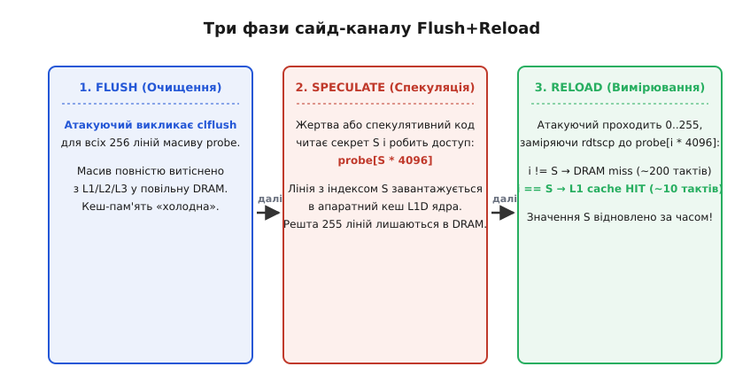
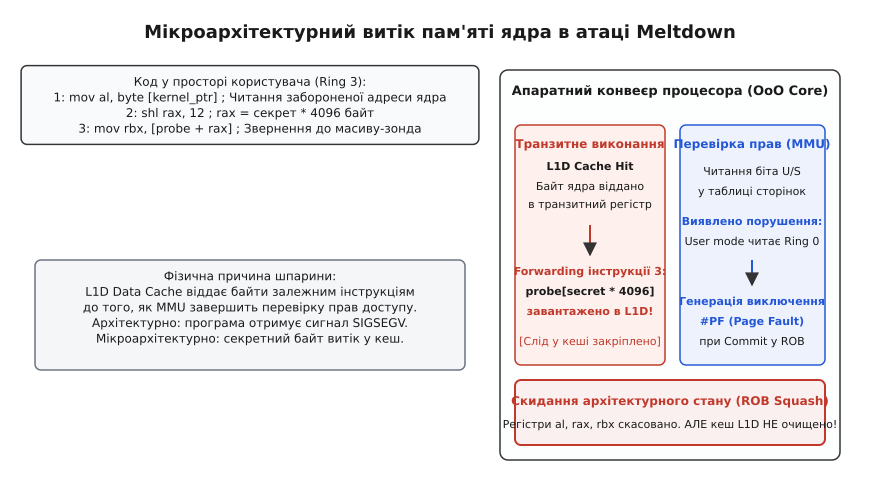
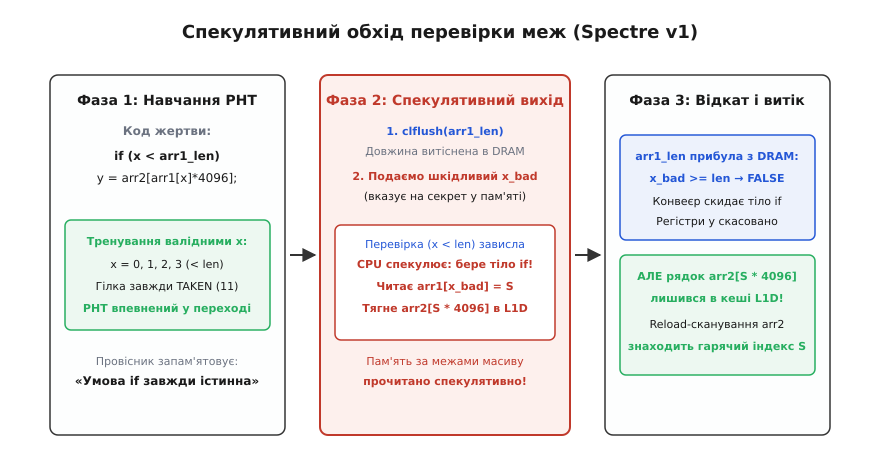
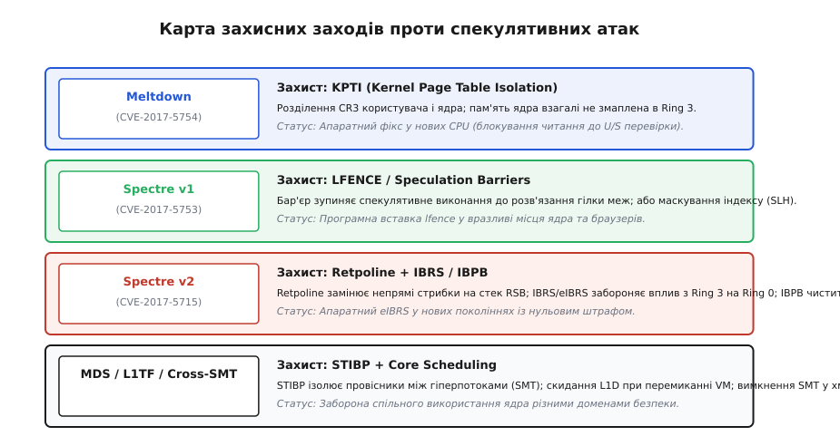

# Спекулятивне виконання та атаки Spectre/Meltdown

<preknowlist>
- [Позачергове виконання](topic:programming/out-of-order-execution) — буфер перевпорядкування (ROB), станції резервування та стадія фіксації (commit).
- [Передбачення переходів](topic:programming/branch-prediction) — динамічні лічильники переходів (PHT) і буфер цілей (BTB).
- [Кеш-пам'ять](topic:programming/cache) — ієрархія кешів, розмір лінії (64 байти) та затримки доступу (L1 hit vs DRAM miss).
- [Віртуальна пам'ять](topic:programming/virtual-memory) — дворівневий поділ пам'яті, таблиці сторінок і біт привілеїв User/Supervisor.
- [Кільця захисту](topic:programming/protection-rings) — ізоляція простору користувача (Ring 3) від простору ядра (Ring 0).
</preknowlist>

Сучасний процесор працює на частотах у кілька гігагерців, витрачаючи на виконання простої регістрової операції частки наносекунди (один такт — приблизно `0.2–0.3 нс`). Водночас електричний сигнал, що прямує материнською платою до мікросхем оперативної пам'яті DRAM і повертається назад, потребує від `50` до `100 нс`, тобто від `150` до `300` тактів ядра. Якщо центральний процесор зупинятиме конвеєр щоразу, коли програмі потрібні дані з оперативної пам'яті або коли результат умовного переходу ще не обчислено, кристал проводитиме понад 99% свого часу в бездіяльному очікуванні повільної шини пам'яті. Щоб не простоювати сотні тактів на кожному розгалуженні, кремнієві процесори стали обчислювати майбутнє наперед — вони роблять ставку, передбачають напрямок виконання і починають виконувати команди ще до того, як з'ясується, чи потрібні вони взагалі.

Цей фундаментальний інженерний механізм називають **спекулятивним виконанням** (англ. *speculative execution*, від лат. *speculari* — «наглядати, розвідувати»). Понад два десятиліття фундаментом безпеки мікропроцесорів слугувала аксіома: «Спекуляція є абсолютно ізольованою. Якщо процесор угадав хибно або натрапив на порушення прав, уся спекулятивна робота безслідно скасовується, а архітектурні регістри повертаються до попереднього стану». У січні 2018 року дослідники оприлюднили атаки Meltdown і Spectre, які довели: ця аксіома була хибною від самого початку. Скасовуючи роботу в регістрах, залізо не скасовує зміни в кеш-пам'яті, і крізь цей мікроархітектурний слід зловмисник може зчитати будь-який байт у системі — паролі, ключі шифрування та пам'ять ядра операційної системи.

### Анатомія позачергового конвеєра та буфер ROB

Щоб зрозуміти, звідки береться витік, необхідно простежити шлях інструкції крізь фізичні структури сучасного процесора з позачерговим виконанням (англ. *Out-of-Order execution*, OoO). Процесор давно перестав виконувати машинний код суворо команда за командою, як записано в пам'яті. Його внутрішня структура розділена на дві великі частини: впорядкований передній край (англ. *in-order frontend*) та асинхронний виконавчий рушій (англ. *out-of-order backend*).

Передній край зчитує команди з кешу інструкцій, розкодовує складні інструкції x86 у внутрішні прості мікрооперації (англ. *micro-ops*, `μops`) і передає їх на стадію перейменування регістрів. На цьому етапі архітектурні регістри (`RAX`, `RBX`, `RCX`) відображаються на великий фізичний регістровий файл (англ. *Physical Register File*, PRF), який містить сотні окремих комірок. Це знімає штучні залежності за іменами регістрів (хибні залежності типу Write-After-Read та Write-After-Write).

Далі мікрооперації потрапляють у **станції резервування** (англ. *reservation stations*, або планувальник черги виконання). Станція резервування — це апаратний буфер, який постійно відстежує готовність операндів. Як тільки операнди мікрооперації обчислені, планувальник негайно вистрілює її у вільний виконавчий блок (ALU, блок множення або блок завантаження з пам'яті), навіть якщо попередні за порядком команди все ще чекають на читання з DRAM.

```
Frontend (Fetch/Decode) → Rename/Allocate → Reservation Stations (OoO Execute)
                                                     ↓
Commit/Retire (In-Order) ← Reorder Buffer (ROB) ← ALU / Load / Store
```

Але як процесор зберігає видимість того, що програма виконується строго послідовно? За це відповідає **буфер перевпорядкування** (ROB, англ. *Reorder Buffer*). Кожна розкодована команда записується в кільцеву чергу ROB у початковому програмному порядку. Інструкція може виконатися в ALU за один такт, але вона залишається в ROB у стані «очікує на фіксацію». Команда переходить на фінальну стадію — **фіксацію** (англ. *commit* або *retire*) — виключно тоді, коли вона дісталася голови черги ROB, а всі попередні команди завершилися без виключень і помилок передбачення. Лише на стадії commit результат записується в постійний архітектурний стан або скидається в оперативну пам'ять крізь буфер запису (Store Buffer).

Якщо ж попередня гілка виявилася помилковою або інструкція викликала апаратне виключення (наприклад, спробу доступу до чужої сторінки), процесор виконує операцію **скидання конвеєра** (англ. *ROB squash / pipeline flush*). Усі записи в ROB, що слідували за помилковою командою, миттєво оголошуються недійсними, фізичні регістри звільняються, а покажчик інструкцій повертається на правильний шлях. З точки зору архітектури (тобто значень регістрів і RAM) спекулятивні команди ніби ніколи не існували.

### Архітектурний контракт проти мікроархітектурної реальності

Саме тут криється фундаментальний розрив між двома шарами абстракції комп'ютерної системи:

1. **Архітектурний стан (Architectural State):** те, що зафіксовано в стандарті ISA (Instruction Set Architecture) — вміст регістрів загального призначення, прапорці стану `RFLAGS`, регістри керування `CR0–CR4` та адреси в оперативній пам'яті. Цей стан повністю відновлюється при скиданні ROB.
2. **Мікроархітектурний стан (Microarchitectural State):** внутрішні допоміжні структури заліза, покликані пришвидшувати роботу — лінії кеш-пам'яті L1, L2 та L3, таблиці провісників переходів, буфери асоціативної трансляції TLB та черги внутрішніх шин.

Коли мікрооперація виконується спекулятивно, вона читає дані з пам'яті. Щоб надати ці дані процесору, блок завантаження (Load Unit) автоматично затягує відповідну 64-байтну лінію пам'яті з DRAM у найшвидший кеш першого рівня L1D.

Коли за кілька десятків тактів процесор дізнається, що спекуляція була помилковою, і скидає ROB, він обнуляє архітектурний регістр, куди прямувало значення. Але блок керування кешем **не повертає лінію назад у DRAM**. Вичищення кешу при кожному промаху передбачення було б катастрофічним для продуктивності: по-перше, кеш не знає, які саме лінії були підтягнуті «справжніми» командами, а які — спекулятивними; по-друге, повторне завантаження правильних даних коштувало б сотні тактів.

Таким чином, скасована інструкція, яка ніколи не завершилася архітектурно (її називають **транзитною інструкцією**, англ. *transient instruction*), назавжди залишає фізичний слід у стані кремнієвих кеш-ліній. Цей слід можна виміряти за допомогою **побічного каналу (сайд-каналу) за часом доступу**.

### Фізика таймінг-атак кешу: Flush+Reload та Prime+Probe

Щоб перетворити зміну стану кешу на вкрадені байти секретної інформації, зловмисникові потрібен канал зв'язку між транзитною інструкцією та звичайним користувацьким кодом. Таким каналом є протокол вимірювання затримки пам'яті.

Найчистішим і найшвидшим методом є техніка **Flush+Reload** (очищення та повторне завантаження), яка працює у три чіткі фази над спільним масивом пам'яті (наприклад, над спільною бібліотекою `libc.so` або спеціально виділеним масивом-зондом `probe`):


*Фаза 1: атакуючий примусово витісняє всі 256 елементів зонда з кешу в DRAM інструкцією `clflush`. Фаза 2: спекулятивний код жертви читає секретний байт `S` і звертається до комірки `probe[S * 4096]`, підтягуючи лише одну лінію в кеш L1D. Фаза 3: атакуючий вимірює час читання кожного елемента інструкцією `rdtscp` — елемент із найменшим часом розкриває значення `S`.*

Механізм кожної фази спирається на суворі апаратні властивості:

1. **Фаза Flush:** Атакуючий виконує інструкцію `clflush` (Cache Line Flush) для кожної з 256 контрольних адрес масиву `probe`. Ця команда примусово викидає задану лінію з усіх рівнів кешу CPU (L1, L2, L3) назад у DRAM. Тепер масив є «холодним»: будь-яке наступне читання потребуватиме тривалого звернення до оперативної пам'яті (~200 тактів).
2. **Фаза транзитного доступу:** Програма-жертва або спекулятивний блок виконує операцію доступу до пам'яті за адресою, зміщеною на значення секретного байта `S` (значення від 0 до 255):
   ```
   probe[S * 4096]
   ```
   Множник 4096 (розмір сторінки віртуальної пам'яті) обирається навмисно. Якщо використовувати крок у 1 байт, усі 256 значень потраплять у сусідні байти кількох кеш-ліній, а апаратний префетчер процесора (Stream Prefetcher) автоматично завантажить сусідні рядки, спотворивши сигнал. Крок у 4096 байтів гарантує, що кожне з 256 можливих значень секрету потрапляє у власну фізичну сторінку та власну лінію кешу. Процесор підтягує в кеш L1D рівно одну лінію — ту, індекс якої дорівнює секретному значенню `S`.
3. **Фаза Reload:** Атакуючий по черзі зчитує всі 256 сторінок зонда, фіксуючи точний час за допомогою лічильника тактів процесора `RDTSC` / `RDTSCP`:
   ```
   час_доступу = t_після - t_до
   ```
   Для 255 сторінок, які залишилися в DRAM, час завантаження становитиме `180–250 тактів` (кеш-промах, Cache Miss). Для однієї сторінки з індексом `S`, яку спекуляція затягла в кеш, час читання складе лише `4–12 тактів` (кеш-влучання, Cache Hit). Порівнюючи виміряні часи з фіксованим порогом (типово близько 80 тактів), атакуючий безпомилково визначає число `S`.

Повний алгоритмічний код вимірювального зонда, правила калібрування часових порогів та тонкощі роботи з бар'єрами серіалізації конвеєра розібрано в окремій статті [Сайд-канал атаки Flush+Reload](topic:programming/flush-reload).

Якщо атакуючий не має спільної пам'яті з жертвою (наприклад, у пісочниці браузера), застосовують техніку **Prime+Probe** (заповнення та зондування). Атакуючий спочатку заповнює обраний набір асоціативності кешу (Cache Set) власними даними (фаза Prime), чекає виконання коду жертви, а потім знову читає свій буфер (фаза Probe). Якщо жертва під час спекуляції витіснила бодай одну лінію атакуючого, час доступу до цієї лінії зростає, що дозволяє відновити набір адрес, до яких торкалася жертва.

### Meltdown (CVE-2017-5754): крах ізоляції пам'яті ядра

Атака **Meltdown** (апаратна назва: *Rogue Data Cache Load*) стала найруйнівнішим відкриттям 2018 року, оскільки дозволила будь-якому непривілейованому процесу користувача (Ring 3) зчитувати абсолютно всю фізичну пам'ять ядра, гіпервізора та сусідніх процесів зі швидкістю понад 500 кілобайтів на секунду.

Історично операційні системи (Linux, Windows, macOS) мапили весь адресний простір ядра у верхню половину віртуальної пам'яті кожного процесу користувача. Це робилося задля швидкодії: під час кожного системного виклику (`read`, `write`, `gettimeofday`) процесору не потрібно було перемикати таблиці сторінок і скидати дорогий кеш трансляції адрес (TLB). Захист гарантувався одним бітом: у записах таблиці сторінок ядра (Page Table Entries, PTE) біт `User/Supervisor` (`U/S`) був скинутий у `0`, що означало заборону доступу для програм із простору користувача. Спроба прочитати таку адресу з Ring 3 негайно викликала апаратне виключення Page Fault (`#PF`), а ядро надсилало процесу сигнал `SIGSEGV`.


*Мікроархітектурна шпарина Meltdown: блок L1D Data Cache віддає байти пам'яті ядра залежній інструкції через пересилання (forwarding) до того, як блок MMU завершить перевірку біта User/Supervisor. Коли на стадії Commit виникає помилка #PF, регістри скасовуються, але лінія масиву probe вже нагріта в кеші.*

#### Мікроархітектурна шпарина

Чому цей захист розвалився в кремнії? Розгляньмо три мікрооперації, запущені непривілейованим кодом:

:::tabs
```c
/* kernel_address — заборонений покажчик на пам'ять ядра */
uint8_t probe_array[256 * 4096];

void trigger_meltdown(const uint8_t *kernel_address) {
    /* 1. Спроба прямого читання пам'яті ядра */
    uint8_t secret = *kernel_address; 

    /* 2. Транзитне мапування секрету в зміщення масиву-зонда */
    uint8_t dummy = probe_array[secret * 4096];
    (void)dummy;
}
```
```cpp
#include <cstdint>
#include <array>
#include <span>

namespace meltdown {

constexpr size_t PageSize = 4096;
alignas(64) std::array<uint8_t, 256 * PageSize> probe_array{};

void trigger(const uint8_t* kernel_address) noexcept {
    // 1. Непривілейоване читання пам'яті Ring 0
    uint8_t secret = *kernel_address;

    // 2. Спекулятивне звернення до зонда
    volatile uint8_t dummy = probe_array[static_cast<size_t>(secret) * PageSize];
    static_cast<void>(dummy);
}

} // namespace meltdown
```
:::

На апаратному рівні процесорів Intel процеси завантаження даних із кешу L1D та перевірки прав доступу в блоці керування пам'яттю (MMU) відбувалися **паралельно**:

1. Блок завантаження звертається до кешу даних L1D за віртуальною адресою ядра. Оскільки сторінка ядра вже змаплена у віртуальний простір процесу й перебуває в L1D, кеш миттєво (за 4–5 тактів) віддає 8-бітне значення байта ядра в тимчасовий транзитний регістр.
2. Внутрішній механізм пересилання даних конвеєра (Bypassing/Forwarding) негайно передає це значення наступній інструкції в станції резервування, яка формує адресу `probe_array[secret * 4096]` і затягує відповідну лінію зонда в L1D.
3. Одночасно MMU зчитує біт `U/S` з таблиці сторінок, бачить спробу доступу до Ring 0 з Ring 3 і виставляє сигнал апаратного виключення `#PF`.
4. Але сигнал виключення не обробляється миттєво! Він прикріплюється до першої інструкції в черзі буфера перевпорядкування ROB. Доки перша інструкція повільно рухається до голови черги ROB для фіксації (commit), друга інструкція **встигає повністю виконатися в позачерговому режимі** й нагріти кеш.
5. Коли перша інструкція досягає стадії commit, процесор нарешті генерує переривання `#PF` і скидає всі наступні записи ROB. Архітектурно процес отримує `SIGSEGV`, але лінія `probe_array[secret * 4096]` уже сидить у кеші.

Атакуючому залишалося лише перехопити `SIGSEGV` (або використати транзакційну пам'ять Intel TSX `xbegin` / `xend`, яка гасить виключення без виклику обробника ядра) і запустити фазу Reload для зчитування байта.

> 🔧 **Чому процесори AMD не були вразливі до Meltdown.** Компанія AMD застосувала іншу логіку на рівні мікроархітектурних транзисторів: якщо MMU визначає невідповідність біта `U/S` поточному кільцю привілеїв, блок завантаження жорстко блокує видачу даних із L1D і повертає нулі в транзитний регістр ще до будь-якої передачі в станції резервування. Тому на процесорах AMD транзитна інструкція не отримувала секретний байт.

### Spectre Variant 1 (CVE-2017-5753): обхід перевірки меж (Bounds Check Bypass)

На відміну від Meltdown, атака **Spectre** не залежить від помилок перевірки прав доступу в конкретного виробника процесора — вона атакує сам принцип передбачення переходів і присутня в усіх сучасних суперскалярних процесорах (Intel, AMD, ARM, Apple Silicon, RISC-V).

Варіант 1 (Spectre-v1) експлуатує провісник умовних розгалужень (англ. *Pattern History Table*, PHT / *Branch Direction Predictor*). Розгляньмо класичний захисний шаблон перевірки меж масиву, присутній у будь-якому ядрі чи пісочниці:

:::tabs
```c
#include <stdint.h>
#include <stddef.h>

struct SafeArray {
    unsigned int length;
    uint8_t data[16];
};

uint8_t victim_function(const struct SafeArray *arr, size_t x, const uint8_t *probe) {
    if (x < arr->length) {
        return probe[arr->data[x] * 4096];
    }
    return 0;
}
```
```cpp
#include <cstdint>
#include <cstddef>
#include <span>
#include <vector>

namespace spectre_v1 {

struct SafeBuffer {
    size_t length;
    std::vector<uint8_t> data;
};

[[nodiscard]] uint8_t victim_function(const SafeBuffer& buffer, size_t x, std::span<const uint8_t> probe) noexcept {
    if (x < buffer.length) {
        return probe[buffer.data[x] * 4096];
    }
    return 0;
}

} // namespace spectre_v1
```
:::

Програміст очікує, що код усередині блоку `if` виконається *лише тоді*, коли індекс `x` гарантовано валідний. Проте на рівні машинних команд процесор бачить перехід `JAE` (jump if above or equal).


*Фаза 1: провісник тренується легітимними індексами `x < length`. Фаза 2: значення `arr->length` навмисно скидається з кешу (`clflush`), а у функцію подається шкідливий індекс `x_bad`. Поки CPU сотні тактів чекає довжину з DRAM, він спекулятивно виконує тіло `if`, читає секретний байт за межами масиву та кодує його в кеш `probe_array`. Фаза 3: відкат скидає регістри, але `probe_array` видає секрет.*

#### Механіка атаки

1. **Отруєння провісника (Mistraining):** Атакуючий викликає `victim_function` тисячу разів поспіль із правильними значеннями індексу (`x = 0, 1, 2...`). Двобітні насичувальні лічильники в таблиці PHT процесора переходять у стан «11» (впевнений перехід у тіло `if`).
2. **Створення затримки (Stall):** Атакуючий викликає команду `clflush(&arr->length)`, витісняючи довжину масиву з усіх кешів у повільну пам'ять DRAM.
3. **Шкідливий виклик:** Атакуючий викликає функцію зі значенням `x_bad`, яке виходить далеко за межі масиву й фактично вказує на секретний рядок пам'яті (наприклад, ключ шифрування або пароль).
4. **Спекулятивний прорив:** Процесор підходить до інструкції порівняння `x < arr->length`. Щоб перевірити умову, йому потрібне значення `arr->length`, але воно летить із DRAM довгі 200 тактів. Блок передбачення переходів не чекає: він бачить стан PHT «11» і каже: «Ми завжди заходили в `if`, пішли вперед!».
5. **Транзитне читання чужої пам'яті:** Процесор бере `x_bad`, додає до адреси `arr->data`, спекулятивно вичитує чужий байт пам'яті `secret` і звертається до `probe_array[secret * 4096]`.
6. **Розв'язання гілки та відкат:** Через 200 тактів значення `length` нарешті надходить із контролера пам'яті. ALU обчислює, що `x_bad >= length` (умова хибна), конвеєр оголошує спекулятивні команди недійсними й повертає 0. Але лінія в `probe_array` вже завантажена в L1D.

Оскільки перевірка меж обходиться апаратно на стадії спекуляції, мови програмування з безпекою пам'яті (Java, JavaScript, Rust, Go) виявилися однаково вразливими: байт-код V8 у браузері або JIT-компілятор JVM генерують перевірки меж, які процесор просто перестрибує спекулятивно.

### Spectre Variant 2 (CVE-2017-5715): захоплення цілей непрямих переходів (Branch Target Injection)

Якщо Spectre-v1 обманював провісник напрямку («стрибати чи ні»), то **Spectre Variant 2** атакує провісник цілей непрямих стрибків — буфер **BTB** (англ. *Branch Target Buffer*).

Непрямі розгалуження — це команди, адреса переходу яких не зашита в коді, а обчислюється динамічно:
- Виклики віртуальних методів у C++ (`vtable->method()`);
- Виклики через покажчики на функції в C (`fp()`);
- Таблиці переходів оператора `switch`;
- Інструкція повернення з функції `RET`.

На рівні асемблера це команди виду `CALL *%RAX` або `JMP *%RDX`. Щоб конвеєр не зупинявся в очікуванні обчислення значення регістру `%RAX`, процесор використовує таблицю BTB: вона кешує відповідність між адресою самої інструкції переходу та адресою, куди вона стрибала минулого разу.

```
Адреса команди (RIP) → Хеш-функція індексації BTB → Прогнозована ціль (Target Address)
```

#### Атака через отруєння BTB (Aliasing & Poisoning)

Ключова вразливість багатьох поколінь процесорів полягала в тому, що таблиця BTB була **спільною для всієї системи**:
- Процеси користувача та ядро операційної системи ділили одну таблицю BTB;
- Два гіперпотоки на одному фізичному ядрі (SMT / Intel Hyper-Threading) користувалися спільними масивами BTB;
- Для економії транзисторів індексація в BTB здійснювалася не за повною 64-бітною адресою `RIP`, а за її коротким хешем (типово молодші 12–16 бітів).

Це призводить до явища **колізії аліасингу** (англ. *aliasing*). Зловмисник у просторі користувача створює власний непрямий перехід за такою адресою, яка дає однаковий індекс у BTB із критичним непрямим викликом усередині ядра операційної системи.

Атакуючий багаторазово виконує свій перехід, навчаючи BTB стрибати на спеціально підібрану адресу — так званий **гаджет розкриття** (англ. *disclosure gadget*), знайдений у тілі коду ядра:

```
Гаджет у коді ядра:
mov al, [rdi]        ; Спекулятивно прочитати секретний байт за покажчиком
shl rax, 12          ; Помножити на 4096
mov rbx, [rsi + rax] ; Завантажити лінію з масиву-зонда в кеш
```

Коли ядро операційної системи виконує свій легітимний непрямий виклик, провісник BTB бере отруєну адресу зловмисника. Ядро спекулятивно перестрибує на гаджет розкриття, виконує його з привілеями Ring 0, зливає секретні дані в кеш і лише потім розпізнає помилку та повертається на правильний шлях.

### Комплекс захисту: KPTI, Retpoline та бар'єри спекуляції

Закриття атак спекулятивного виконання вимагало безпрецедентної перебудови як операційних систем, так і мікрокоду процесорів.


*Розподіл захисних механізмів: KPTI повністю ізолює адресний простір ядра; Retpoline та eIBRS блокують спекуляції непрямих викликів; бар'єри LFENCE та маскування індексів SLH унеможливлюють вихід за межі масивів.*

#### 1. KPTI (Kernel Page Table Isolation) проти Meltdown

Оскільки Meltdown читав сторінки ядра під час транзитного виконання, єдиним надійним програмним рішенням стало **повне вилучення пам'яті ядра з адресного простору користувача**.

Механізм KPTI (раніше відомий як KAISER) розділяє таблиці сторінок на дві незалежні структури:
1. **User Page Table (CR3 користувача):** містить сторінки процесу користувача та лише абсолютний мінімум коду ядра, необхідний для входу та виходу з переривань (трампліни обробників переривань і стек переривань). Жодних даних ядра або буферів драйверів тут немає.
2. **Kernel Page Table (CR3 ядра):** повна таблиця сторінок, яка підключається лише після переходу процесора в Ring 0.

Ціна KPTI — суттєве падіння швидкодії. Під час кожного системного виклику або апаратного переривання ядро змушене перезавантажувати регістр керування `CR3`. Якщо процесор не підтримує ідентифікатори контексту процесів (PCID, Process Context Identifiers), зміна `CR3` призводить до повного скидання буферів трансляції TLB, що сповільнювало інтенсивні дискові та мережеві операції на `5–30%`.

#### 2. Retpoline (Return Trampoline) проти Spectre v2

Створений інженерами Google механізм **Retpoline** дозволив захиститися від отруєння BTB без значного сповільнення процесора. Retpoline замінює кожен непрямий перехід `jmp *%rax` або `call *%rax` спеціальною асемблерною послідовністю, яка обманює спекулятивний рушій за допомогою стека повернень (RSB, Return Stack Buffer):

```
; Конструкція Retpoline для виклику функції через покажчик %r11:
    call set_up_target       ; 1. Кладемо адресу capture_spec на стек і стрибаємо
capture_spec:
    pause                    ; 3. Спекулятивний рушій потрапляє сюди
    lfence                   ; і застрягає в нескінченній безпечній пастці
    jmp capture_spec
set_up_target:
    mov [rsp], %r11          ; 2. Переписуємо адресу на стеку на справжню ціль %r11
    ret                      ; 4. Архітектурно стрибаємо на %r11 за новим значенням на стеку
```

Як це працює: команда `call` автоматично записує в апаратний стек RSB адресу `capture_spec`. Коли процесор доходить до інструкції `ret`, провісник RSB негайно скеровує спекуляцію в тіло `capture_spec`, де крутиться безпечний цикл `pause; lfence`. Тим часом команда `mov [rsp], %r11` уже змінила адресу повернення в пам'яті. Коли фактичне читання завершується, процесор коректно переходить на `%r11`, а спекулятивна пастка просто скасовується.

#### 3. Апаратні бар'єри та LFENCE проти Spectre v1

Для блокування спекулятивного виходу за межі масивів використовують інструкцію серіалізації конвеєра `LFENCE` (Load Fence):

:::tabs
```c
#include <stdint.h>
#include <stddef.h>
#include <x86intrin.h>

uint8_t secure_array_access(const uint8_t *arr, size_t len, size_t index) {
    if (index < len) {
        /* lfence блокує виконання наступних команд до розв'язання гілки */
        _mm_lfence();
        return arr[index];
    }
    return 0;
}
```
```cpp
#include <cstdint>
#include <cstddef>
#include <optional>
#include <span>
#include <x86intrin.h>

[[nodiscard]] std::optional<uint8_t> secure_read(std::span<const uint8_t> arr, size_t index) noexcept {
    if (index < arr.size()) {
        // Бар'єр запобігає випереджальному доступу до пам'яті
        _mm_lfence();
        return arr[index];
    }
    return std::nullopt;
}
```
:::

З моменту публікації Spectre компанії Intel та AMD оновили мікрокод процесорів: інструкція `LFENCE` стала суворо серіалізувальною (англ. *dispatch/execution barrier*). Вона забороняє процесору видавати будь-які наступні мікрооперації на виконання, доки всі попередні умовні переходи не завершаться архітектурно на стадії commit.

Альтернативою є техніка **Speculative Load Hardening (SLH)**: компілятор генерує код без розгалужень, де індекс масиву множиться на предикатну бітову маску, яка спекулятивно перетворюється на `0`, якщо умова виявилася хибною.

Детальний опис системних інтерфейсів Linux `prctl`, конфігураційних файлів `sysfs` та регістрів керування спекуляцією MSR наведено у [довідці інтерфейсів керування спекуляцією](topic:programming/speculative-execution-attacks/api-speculation-control.md).

### Апаратна еволюція та інтерфейси Speculation Control

Програмні латки були лише тимчасовим рішенням. Починаючи з 2019 року, виробники кремнію впровадили апаратні зміни безпосередньо в логіку транзисторів:

1. **eIBRS (Enhanced IBRS):** Апаратне обмеження непрямої спекуляції, зашите в кремній (Intel Cascade Lake, AMD Zen 3 і новіші). Процесор апаратно блокує використання історії переходів з менш привілейованих кілець (Ring 3 не може вплинути на Ring 0, а віртуальна машина не може отруїти гіпервізор). Працює постійно з практично нульовими накладними витратами, що дозволило відмовитися від складних трамплінів Retpoline.
2. **IBPB (Indirect Branch Prediction Barrier):** Спеціальна MSR-команда (`IA32_PRED_CMD`), яка повністю скидає всі таблиці BTB під час перемикання контексту задач (`switch_to()`), запобігаючи витокам між процесами.
3. **STIBP (Single Thread Indirect Branch Predictor):** Ізоляція таблиць провісників між сусідніми SMT-гіперпотоками на одному фізичному ядрі.
4. **Апаратне блокування Meltdown (RDCL_NO):** Нові покоління CPU містять жорстку перевірку прав у кеші L1D: якщо процесор перебуває в просторі користувача, кеш блокує транзитну видачу ліній ядра до завершення перевірки прав MMU.

### Нова парадигма: безпека за межами абстракції ISA

Відкриття атак спекулятивного виконання назавжди змінило комп'ютерну інженерію. Десятиліттями модель безпеки комп'ютерних систем трималася на концепції абстрактної машини: програміст та компілятор писали код за специфікацією набору інструкцій (ISA), вважаючи мікроархітектуру «невидимою чорною скринькою».

Spectre та Meltdown довели: **мікроархітектура не є невидимою**. Будь-яка апаратна оптимізація, що змінює фізичний стан кремнію (час, заряд, температуру чи колізії кешу), є потенційним каналом зв'язку. Сучасне системне програмування вимагає від інженера враховувати не лише те, *що* робить алгоритм згідно зі стандартом мови, а й те, *які фізичні сліди* залишають його транзитні мікрооперації у кремнієвих структурах процесора під час спроб передбачити майбутнє.
