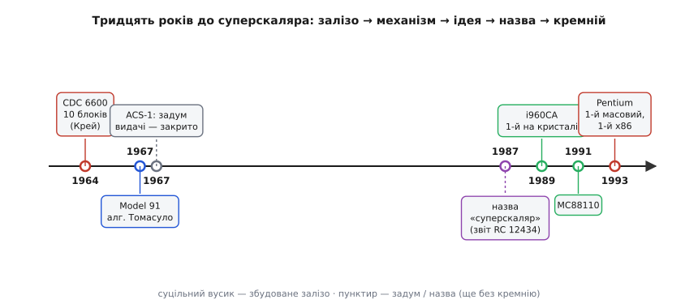

# 📜 Як народився суперскаляр: тридцять років від Крея до Pentium

Ідея «виконувати більше однієї команди за такт» здається такою очевидною, що дивно, чому вона визрівала три десятиліття. Насправді нічого дивного: між першою машиною, яка мала кілька виконавчих блоків, і першим процесором, що справді видавав кілька команд щотакту, лежить прірва інженерних проблем, кожну з яких доводилося розв'язувати наосліп. І сама назва — «суперскаляр» — з'явилася аж наприкінці, коли залізо вже майже вміло те, чого для нього ще не придумали слова. Ця історія — про те, як пороздавали кремнію по кілька додавачів раніше, ніж навчилися ними користатися, і як маркетинговий термін пережив машину, задля якої його вигадали.

## Загадка, з якої все почалося

Уявімо інженера початку 1960-х. Він щойно навчився розганяти процесор конвеєром — розбивати команду на стадії, щоб поки одна виконується, наступну вже декодували. Межа, до якої це доводить темп, — одна команда за такт. І тут в очі впадає прикра дрібниця: більшу частину часу арифметичний блок процесора **простоює**. Поки команда чекає число з пам'яті, поки готується адреса переходу, поки декодується наступна — дорогий суматор нічого не робить. Заліза багато, а користі з нього — на частку такту.

Звідси народжується підозра: а що, як поставити не один виконавчий блок, а кілька — і завантажити їх усі одразу? Тоді за той самий такт можна було б порахувати і додавання, і множення, і зсув. Підозра правильна. Але між нею та робочою машиною стоїть питання, від якого паморочиться в голові: **звідки процесор дізнається, що дві сусідні команди можна пускати разом?** Одна може читати те, що друга ще не записала. Тоді паралель зруйнує зміст програми — вийде не швидше, а просто неправильно. Уся подальша історія — це різні відповіді на це одне питання.

## CDC 6600: десять блоків, але команди по одній

Першою машиною, що всерйоз розсипала кремній на кілька виконавчих блоків, стала **CDC 6600** — її випустила Control Data Corporation у вересні 1964 року, а спроєктував **Сеймур Крей** (англ. Seymour Cray). Це усталений факт: 6600 віддали замовникам 1964-го, і вона на кілька років стала найшвидшою машиною світу — близько трьох мільйонів операцій за секунду, десь утричі прудкіша за IBM Stretch, попереднього чемпіона.

Секрет був у будові центрального процесора. Замість одного універсального арифметичного блока Крей поставив **десять окремих функційних блоків** (англ. functional units): два для множення, один для ділення, суматори, блоки логіки, зсуву, лічби. Кожен умів своє, і кілька могли працювати одночасно. Розкидав команди по цих блоках спеціальний механізм, який згодом назвуть **табло** (англ. scoreboard): він стежив, які регістри зайняті, які блоки вільні, і випускав команду на виконання, щойно ставало безпечно.

Тут — тонка, але вирішальна межа, яку варто засвоїти чітко, бо її часто перекручують. CDC 6600 **не була суперскаляром у строгому значенні**. Табло могло тримати кілька команд у польоті одночасно, могло навіть завершувати їх не в тому порядку, у якому вони йшли, — але **видавало на виконання одну команду за такт**. Тобто в машині був паралелізм виконання, та не було паралелізму видачі. Різниця не педантична: саме видача кількох команд за такт і є суть суперскаляра, і саме її 6600 не мала.

Тому правильне формулювання — те, яке дають фахові джерела: CDC 6600 не видавала кількох команд за такт, але її **називають раннім предком** сучасних суперскалярів за саму ідею кількох функційних блоків, що працюють водночас. Крей показав, що розсипати виконання по спеціалізованих блоках вигідно. Наступне питання — як годувати ці блоки кількома командами щотакту — він лишив нащадкам.

> 🔧 **Навіщо це знати.** Плутанина «6600 = перший суперскаляр» жива й досі, бо машина справді виконувала команди паралельно. Але інженерна суть суперскаляра — у **видачі**, не у виконанні: скільки команд ядро запускає за один такт. Тримаючи цю межу в голові, ви одразу відрізните маркетинговий опис процесора від того, що він робить насправді, — а це рівно те питання, яке ставлять на співбесідах з архітектури.

## Model 91 і алгоритм Томасуло: як розв'язати залежності на льоту

Наступний великий крок зробила IBM — і зробила його, розв'язуючи ту саму загадку залежностей, тільки гостріше. Машина називалася **System/360 Model 91**; IBM оголосила її 1966 року, а перші системи пішли 1967-го. Комерційно Model 91 провалилася — надто дорога, продали одиниці, — але в історію архітектури вона ввійшла назавжди завдяки одному вузлу: блоку дійсних чисел, що вмів **позачергове виконання** (англ. out-of-order execution).

Механізм для цього придумав інженер IBM **Роберт Томасуло** (англ. Robert Tomasulo), і його ім'я на цьому алгоритмі лишилося дотепер. За нього 1997 року Томасуло дали премію Еккерта — Моклі — «за винахідливий алгоритм Томасуло, що дав змогу будувати процесори з позачерговим виконанням». Це усталений факт із чіткою атрибуцією.

Що ж придумав Томасуло? Три речі, які досі стоять у кожному великому процесорі. Перша — **станції резервування** (англ. reservation stations): маленькі буфери перед кожним блоком, де команда чекає, поки з'являться її дані, замість того щоб тримати за собою всю чергу. Друга — **перейменування регістрів** (англ. register renaming) у залізі: якщо дві команди сваряться не за справжні дані, а лише за те, що випадково пишуть в один і той самий регістр, апаратура тихо дає їм різні внутрішні комірки — і сварка зникає. Третя — **спільна шина даних** (англ. common data bus): коли якийсь блок дорахував результат, він викрикує його одразу всім станціям, що на нього чекали, і ті прокидаються.

Разом це давало машині змогу **самій знаходити паралелізм** у звичайному послідовному коді — не покладаючись на те, що програміст розставить команди зручно. Це і є той самий рушій, який згодом дозволить суперскалярам не просто видавати кілька команд за такт, а видавати їх **у будь-якому вигідному порядку**. Механіку цього — станції, перейменування, шину — детально розбирає окрема тема про [позачергове виконання](topic:programming/out-of-order-execution); тут важливо інше: 1967 року IBM уже мала в залізі всі частини, з яких за двадцять років збудують справжній суперскаляр. Бракувало ще одного — щоб хтось видав **кілька команд за один такт**.

## ACS-1: перший справжній суперскаляр, якого ніхто не побачив

І тут історія робить свій найгіркіший поворот. Перша машина, що справді мала видавати кілька команд за такт, існувала — але її **закрили, не добудувавши**, і про неї десятиліттями майже не згадували.

Це був проєкт **ACS-1** (Advanced Computer Systems), який IBM вела в Каліфорнії з середини 1960-х. Керував архітектурою **Джон Кок** (англ. John Cocke) — людина, яку згодом назвуть «батьком RISC» і дадуть їй і премію Тюрінга, і Національну медаль науки. Задум ACS-1 був як на той час нечуваний: машина мала розглядати кілька команд одразу й видавати **до семи команд за такт** на функційні блоки. Це вже суперскаляр за будь-яким строгим означенням — не «кілька блоків», а саме **кілька видач за такт**, з апаратним пошуком незалежних команд.

Проєкт не дожив до заліза. IBM закрила ACS-1 наприкінці 1960-х — почасти через внутрішню політику, почасти тому, що машина не була сумісна з панівною архітектурою System/360. Кок і частина команди пішли, ідеї розсіялися по нотатках і головах. Тому доказовий статус тут треба назвати чесно: ACS-1 — **найраніший відомий задум суперскаляра**, підтверджений документами й спогадами учасників, але **не збудована машина**. У живому кремнії світ побачить видачу кількох команд за такт лише за двадцять із гаком років. Історія обчислень знає таких «передчасних» проєктів чимало, і ACS-1 — один із найяскравіших: правильна ідея, яка прийшла раніше, ніж світ був готовий її зробити.

## Звідки взялося саме слово «суперскаляр»

Ось цікаве: залізо, що виконує кілька команд за такт, задумали в 1960-х, а **слова** для нього не було ще двадцять років. З'явилося воно з несподіваного боку — не від тих, хто будував машини, а від тих, хто захищав нову ідею в суперечці.

На середину 1980-х точилася гаряча дискусія про **RISC** — процесори зі спрощеним набором команд. Скептики питали: гаразд, прості команди виконуються швидко, але як таку машину зробити по-справжньому потужною, коли поряд стоять векторні суперкомп'ютери, що перемелюють цілі масиви чисел однією командою? Відповідь дали двоє інженерів IBM — **Тілак Аджервала** (англ. Tilak Agerwala) та вже знайомий нам **Джон Кок**. Їхня теза: не треба ставати вектором; можна лишитися скалярним — брати звичайні команди по одній із потоку — але видавати їх **по кілька за такт**. Щоб відрізнити цей шлях і від старого скалярного процесора (одна команда за раз), і від векторного, вони й назвали його **суперскалярним** — «понад-скалярним».

Назва прижилася саме тому, що точно ловила суть. **Скалярний** процесор (від лат. scalaris, від scala — «драбина, шкала») бере величини по одній, як одне число зі шкали. **Векторний** обробляє цілий рядок чисел однією командою. А **суперскалярний** лишається скалярним за типом команд, та видає їх «понад одну» за такт — звідси super-. Не вектор, не старий скаляр, а щось поверх скаляра.

Найраніше вживання слова, за свідченням історика архітектури Марка Смозермана (англ. Mark Smotherman), звучало в **доповідях Аджервали та Кока в 1980-х**, а закріпив його їхній технічний звіт IBM 1987 року — **«High Performance Reduced Instruction Set Processors»**, дослідницький центр IBM імені Вотсона, номер **RC 12434** (березень 1987). Там суперскалярну машину означено прямо: така, що «видає кілька команд на виконавчі блоки щотакту», а дозволяючи позачергове виконання й особливу обробку переходів, дістає дуже високу продуктивність навіть на неструктурованому коді.

Статус цього факту — усталений, з однією чесною поправкою. Точну **мить** і **місце**, де слово прозвучало вперше, документально закріпити важко: усні доповіді рідко лишають слід. Тому обережне формулювання таке: термін «суперскаляр» **увів у обіг** саме круг Аджервали й Кока в IBM другої половини 1980-х, а перша **письмова** його фіксація — звіт RC 12434 (1987). Приписувати авторство слова комусь одному чи називати єдину «першу лекцію» було б домислом.

## Гонка перших однокристальних суперскалярів

Тепер зійшлися обидві половини — і ідея видачі кількох команд за такт, і слово для неї. Лишалося вкласти це в один кристал кремнію. Кінець 1980-х — початок 1990-х став добою, коли одразу кілька команд по світу зробили це майже одночасно; хто саме був «найперший», залежить від того, як лічити місяці.

Найчастіше першим однокристальним суперскаляром називають **Intel i960CA** — його оголосили в липні 1989 року. Це був RISC-процесор для вбудованих застосувань, і його ядро вміло за один такт відправити на виконання команду арифметики, команду доступу до пам'яті та команду переходу одночасно, стабільно витягуючи до **двох команд за такт**. Тут варто уточнити цифру, яку часто перебільшують: i960CA міг **розподілити** три різнотипні команди, але **втримати** темп він міг близько двох за такт — не трьох. Це усталено за його ж технічним описом.

Майже пліч-о-пліч ішла **AMD Am29050** — суперскалярна версія RISC-родини 29000, що з'явилася близько 1990 року, теж для високопродуктивних вбудованих задач: принтери, графічні контролери, обробка зображень. А 1991 року на конференції Microprocessor Forum у Сан-Франциско вперше показали **Motorola MC88110** (сам чип пішов у продаж 1992-го) — двоканальне ядро, що видавало **дві команди за такт** на цілий десяток виконавчих блоків і вміло вже й позачергове завершення, і спекулятивне виконання. Ці три — i960CA (1989), Am29050 (1990), MC88110 (1991) — фахові джерела й називають першими комерційними однокристальними суперскалярами. Порядок між ними — питання кількох місяців і того, що саме зараховувати, тож коректно тримати їх разом як хвилю, а не сперечатися про єдиного чемпіона.

Того ж часу IBM зробила крок з іншого боку — не одним кристалом, а потужною робочою станцією. **RS/6000** із процесором POWER1 вийшла на початку 1990 року й стала першим суперскалярним робочим комп'ютером: її процесор (розкиданий тоді ще по кількох мікросхемах) видавав до чотирьох команд за такт на блоки переходів, цілої та дійсної арифметики. Це та сама лінія, з якої згодом виросте PowerPC. Показово: ідеї Кока з нездійсненого ACS-1 повернулися в кремній саме в IBM — через двадцять із гаком років.

## Pentium: суперскаляр приходить до всіх

Усе описане досі жило або у вбудованих кутках, або у дорогих робочих станціях, або у світі RISC. Мільйони звичайних людей нічого про це не знали — їхні комп'ютери працювали на архітектурі x86, старій, з громіздким набором команд, яку теоретики RISC вважали безнадійною для такого паралелізму. І тут стався перелом, що зробив суперскаляр буденністю.

22 березня 1993 року Intel випустила **Pentium** (внутрішня назва — P5). Це був **перший суперскалярний процесор x86** — і, що важливіше, перший **масовий** суперскаляр узагалі. Ядро мало два цілочислові конвеєри: головний, названий **U**, брав будь-яку команду, а другий, **V**, — лише прості, найчастіші. Разом вони за вдалих умов видавали **дві команди за такт**. Літери U і V вибрали навмисне беззмістовними — це були перші дві букви поспіль, жодна з яких не була першою літерою назви якогось блока в схемі, тож інженери взяли їх, щоб не плутатися.

Значення Pentium — не в технічній сміливості (двоканальне in-order ядро на той час уже не було дивиною), а в **масштабі**. Суперскаляр довели до найпоширенішої у світі архітектури й поставили в кожен настільний комп'ютер. Те, що починав Крей десятьма блоками для найшвидшої машини планети, і те, що Кок задумував для нездійсненного ACS, тепер лежало на столі в мільйонів людей. Відтоді питання перестало бути «чи ядро суперскалярне» — суперскалярні стали всі, від процесора в телефоні до серверного. Питання стало інше: **наскільки воно широке** й наскільки розумно розкидає команди — тобто рівно те, над чим інженери б'ються й сьогодні.

## Що лишила ця історія

Якщо стягнути тридцять років в одну думку, вийде ось що. Спершу з'явилося **залізо** — кілька виконавчих блоків у Крея (1964). Потім — **механізм розв'язувати залежності на льоту**: алгоритм Томасуло в Model 91 (1967). Потім — **сама ідея видавати кілька команд за такт**, що визріла в нездійсненому ACS-1 Кока й аж за двадцять років дістала **ім'я** від Аджервали та Кока (звіт 1987-го). І лише тоді — **кремній**: перші однокристальні суперскаляри рубежу 1989–1991 і масовий Pentium 1993-го.

*Дорога до суперскаляра одним поглядом. Суцільні вусики — збудоване залізо; пунктирні — задум (ACS-1) і назва (звіт 1987-го), яких ще не було в кремнії. Видно розрив: ідея видачі кількох команд за такт з'явилася в 1960-х, а робочий однокристальний суперскаляр — аж за двадцять із гаком років.*

Порядок тут повчальний. Слово «суперскаляр» з'явилося **останнім**, коли залізо вже майже вміло те, що воно називає. Так буває в інженерії частіше, ніж здається: спершу навпомацки будують річ, і лише коли вона починає працювати, для неї знаходять назву — і назва раптом робить розмиту ідею чіткою, придатною сперечатися й проєктувати. А ще ця історія — тихе нагадування про **колективність** винаходу. Немає одного «винахідника суперскаляра»: є Крей із функційними блоками, Томасуло з динамічним плануванням, Кок із першим задумом видачі, Аджервала з ним удвох — із назвою, і безіменні команди Intel, AMD, Motorola та IBM, що втиснули все це в кристал. Кожен додав свою частину; жоден сам по собі суперскаляра не зробив.
