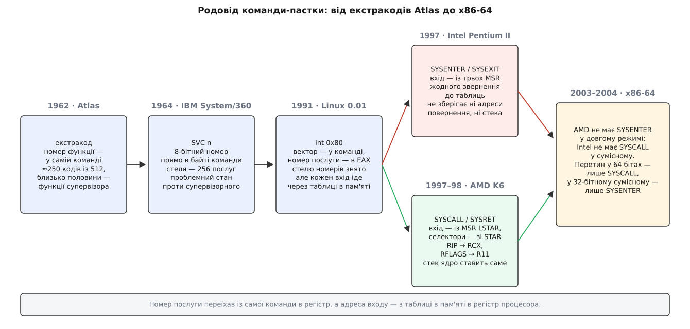
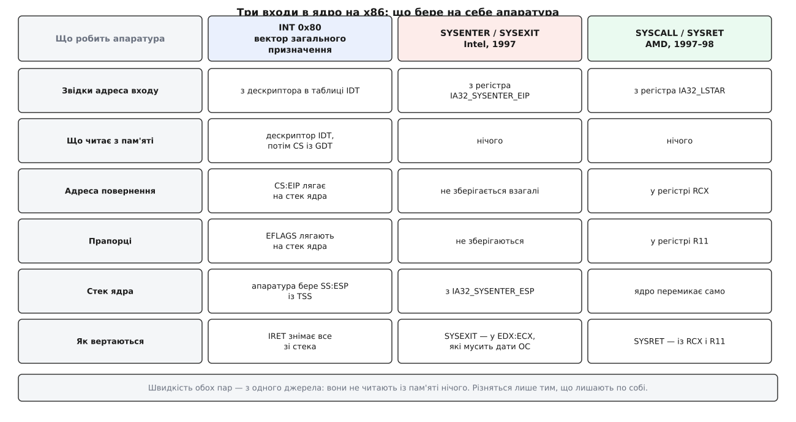

# 📜 Як народилася команда-пастка й чому на x86-64 виграв варіант AMD

<preknowlist>
- [Кільця захисту й рівні привілеїв](book:programming/protection-rings) — машина пам'ятає, на якому рівні працює зараз, і частину команд дозволяє лише на привілейованому.
- [Обробка виключень у процесорі](book:programming/cpu-exception-handling) — пастка: керування стрибає на наперед заданий обробник і потім вертається назад.
- [Вектор переривань](book:programming/interrupt-vector) — таблиця «номер → адреса обробника», з якої апаратура бере, куди стрибати.
</preknowlist>

Команду, якою програма гукає операційну систему, легко уявити як щось, що придумали разом із самими операційними системами: мовляв, з'явилася потреба — з'явилася й команда. Насправді все навпаки. Механізм спершу зробили заради зовсім іншого — щоб доточити процесорові команди, яких у ньому фізично немає, — і лише потім помітили, що та сама апаратура рівно так само годиться, щоб постукати в двері до системи. А далі, вже на x86, ту саму задачу розв'язали двічі й несумісно, причому виграв не той варіант, що з'явився першим. Ця вставка простежує обидва повороти й щоразу каже, що тут усталений факт, а що — приблизна атрибуція.

## Atlas: команда, якої в машині немає

Atlas — машина Манчестерського університету спільно з Ferranti та Plessey; команду університету вів Том Кілберн (Tom Kilburn). Офіційно її ввели в дію 7 грудня 1962 року. *Статус: усталений факт, дата фігурує в усіх довідкових описах машини.*

Задача, з якої все почалося, не має жодного стосунку до захисту. На початку 1960-х кожен вентиль коштував дорого, і вбудовувати в апаратуру синус, логарифм чи квадратний корінь було розкішшю. Але й лишати їх поза [набором команд](book:programming/isa) незручно: програміст мусив би щоразу вручну кликати підпрограму, знати її адресу й пам'ятати про неї.

Розв'язок був такий. Частину кодів операцій навмисно лишили без апаратної реалізації. Коли процесор натрапляв на такий код, він не виконував його, а стрибав у наперед відомий обробник, який робив ту саму роботу програмою. Для того, хто пише код, команда є — вона записується як усі інші й має свій мнемонік. Усередині машини її немає зовсім. Такі команди назвали **екстракодами** (англ. *extracode* — «додатковий код»).

> 🔧 **Навіщо це.** Екстракод розв'язує задачу, з якою архітектура стикається постійно: набір команд мусить бути стабільним для програміста, а апаратура — дешевою. Прийом лишився з нами назавжди, просто змінив бік: у сучасних процесорах складні команди розкладає на прості [мікрокод](book:programming/microcode) *усередині* машини, а екстракод робив те саме *ззовні*, звичайною підпрограмою в пам'яті.

Тепер найцікавіше. Екстракодів на Atlas було близько 250 із 512 можливих, і **приблизно половину з них віддали під функції супервізора** — тобто під звернення до операційної системи. *Статус: усталений факт за описами машини та її системи; конкретне число «250» подають як приблизне і в самих джерелах.* Поряд із екстракодом «обчислити корінь» жив екстракод «надрукувати заданий символ у заданий потік» і екстракод «прочитати блок із 512 слів з логічної стрічки N».

Варто зупинитися й побачити, наскільки ці дві половини різні за суттю. Перша просто доточує арифметику: результат можна було б порахувати й самому, просто довше. Друга — принципово інша: програма не могла б виконати цю роботу сама **ніяк**, бо стрічкою розпоряджається не вона. Але для апаратури різниці немає жодної: обидва випадки — це «команда, яку сама машина не виконує, тож іди туди, куди тобі сказали заздалегідь».

Ось у чому історичний поворот: **команду-пастку для звернення до системи ніхто не винаходив — її впізнали**. Хтось помітив, що механізм, зроблений заради дешевої арифметики, уже містить точно ту саму механіку, якої потребує звернення по послугу: зупинитися, стрибнути за адресою, яку обрав не той, хто просить, виконати чужий код і вернутися. Приписати це «впізнавання» одній людині я не можу: документи називають колектив розробників супервізора Atlas, а не автора ідеї. *Статус: недоведена атрибуція; надійного першоджерела з іменем немає.*

Систему Atlas — Atlas Supervisor — часто називають першою операційною системою, яку впізнало б сучасне око: у ній уже було [розділення часу між кількома програмами](book:programming/time-sharing-history) і керування пам'яттю. *Статус: оцінка, а не вимірюваний факт; вона поширена, але «перша ОС» залежить від того, що саме рахувати ОС.*



*Через усю лінію тягнуться два переїзди. Номер послуги йде з тіла самої команди в регістр — і стеля в 256 послуг зникає. Адреса входу йде з таблиці в пам'яті в регістр процесора — і зникає потреба щось читати перед стрибком. Розкол посередині — не суперечка про мету, а дві різні відповіді на питання, скільки апаратура має зберегти за програму.*

## System/360: номер, вбудований у саму команду

IBM оголосила System/360 7 квітня 1964 року. *Статус: усталений факт.* Стіна між програмою й системою тут уже цілком свідома: слово стану машини має біт **проблемного стану** (problem state), і спроба виконати привілейовану команду в цьому стані дає виняток привілейованої операції. Тобто задача «як програмі попросити систему» стоїть у чистому вигляді.

Відповіддю стала команда **SVC** — supervisor call, «виклик супервізора». Формально вона належить до формату «регістр-регістр», але другий байт у ній — не два номери регістрів, а одне 8-бітне безпосереднє значення. Коли SVC виконується, машина влаштовує переривання виклику супервізора й **зберігає біти 8–15 команди як код переривання** — тобто система отримує число, що було зашите в саму команду. *Статус: усталений факт, це прописано в описі архітектури System/360.*

Спорідненість із екстракодом видно неозброєним оком: там номер функції теж був самою командою. Але саме тут ця спадковість уперше показала свою ціну. Число всередині команди означає рівно 256 послуг — і не одною більше. А ще воно означає, що номер відомий у момент **компіляції**, а не в момент виконання: щоб викликати послугу, номер якої обчислюється на ходу, доводиться або тримати напоготові таблицю з 256 готових команд, або переписувати команду прямо в пам'яті. *Статус: це логічний наслідок формату, а не цитата з документа — але наслідок неминучий.*

На ARM команда, якою й досі звертаються до ядра, зветься `svc` — ті самі три літери, те саме розкриття «supervisor call». Чи це пряме запозичення в IBM, чи незалежний збіг очевидного скорочення, документально підтвердити не можу. *Статус: збіг назв зафіксований; запозичення — недоведена атрибуція.*

## int 0x80: пастка загального призначення

На x86 1980-х окремої команди для звернення до системи не було зовсім. Була `INT n` — програмне переривання загального призначення: 8-бітний номер вектора в команді, адреса обробника — з таблиці дескрипторів переривань у пам'яті. Механізм не для операційних систем, а для будь-кого, кому треба навмисно влаштувати переривання. MS-DOS повісила на нього свій інтерфейс за вектором `0x21`, а Linux, починаючи з версії 0.01 (вересень 1991), — за вектором `0x80`. *Статус: усталений факт; обидва вектори документовані десятиліттями.*

І ось тут зроблено крок, який визначив вигляд усіх сучасних команд-пасток. Linux **розділив число надвоє**. У команді лишився вектор `0x80` — один-єдиний, назавжди той самий, чиста точка входу. А номер послуги переїхав у регістр `EAX`. Стеля в 256 зникла тієї ж миті: скільки поміститься в регістр, стільки послуг і буде, а сьогодні їх у Linux кілька сотень. Форма «фіксований вхід у команді, змінний номер у регістрі» відтоді повторюється всюди — саме так влаштований і `syscall` на x86-64, і `svc #0` на ARM64. Спадковість тут не від SVC, а від цього поділу.

Заплатили за загальність. `INT` не знає, що її щоразу кличуть по те саме, тож чесно робить усю роботу спочатку: дістає з пам'яті дескриптор шлюзу, тоді завантажує сегмент коду з таблиці глобальних дескрипторів, перевіряє типи й рівні привілеїв обох, кладе на стек ядра старий стек, прапорці та адресу повернення. Кілька звернень до пам'яті плюс цілий стосик перевірок — і все це заради стрибка, який завжди однаковий і адреса якого відома ще з часу запуску системи.

Саме цей контраст — «щоразу заново обчислюємо те, що ніколи не міняється» — і породив наступний крок. Якщо вхід сталий, його можна порахувати **один раз** і покласти в регістр самого процесора, звідки читання нічого не коштує. Регістри такого призначення на x86 звуться регістрами, специфічними для моделі, — [MSR](book:programming/msr); операційна система пише в них при завантаженні й далі не чіпає.

## Дві швидкі пари на ту саму задачу

Ідея висіла в повітрі, і обидва виробники x86 узялися за неї майже водночас — незалежно один від одного й у різні боки.

**Intel** дала пару `SYSENTER` / `SYSEXIT` у Pentium II (1997). Вона спирається на три MSR: `IA32_SYSENTER_CS` (адреса 174h) — селектор сегмента коду нульового рівня, `IA32_SYSENTER_EIP` (176h) — точка входу, `IA32_SYSENTER_ESP` (175h) — вершина стека ядра. Виконуючи команду, процесор бере все звідти, а внутрішні описи сегментів **не завантажує з таблиць, а підставляє наперед відомі**. Жодного звернення до пам'яті. *Статус: усталений факт, це прямо описано в керівництві Intel.*

Ціна цієї економії — те, чого команда **не** робить: `SYSENTER` не зберігає нічого. Ні адреси повернення, ні прапорців, ні старого стека. `SYSEXIT` вертається за адресою в `EDX` і на стек із `ECX` — тобто «куди вертатися» мусить звідкись знати сама операційна система.

**AMD** дала пару `SYSCALL` / `SYSRET` у процесорах родини K6. Тут потрібне застереження: довідкові переліки команд відносять `SYSCALL` до «AMD K6» (сам K6 вийшов 2 квітня 1997 року), тоді як частина оглядів прив'язує її до K6-2 (28 травня 1998). *Статус: суперечлива атрибуція в межах одного покоління — родина й виробник безсумнівні, конкретна модель і рік (1997 чи 1998) у джерелах розходяться.* Що тут точно не варто робити — це називати автором людину: усі публічні документи говорять про архітектуру й керівництва, не про винахідника.

`SYSCALL` робить рівно ту саму економію на вході — адресу бере з `IA32_LSTAR`, селектори з `IA32_STAR`, прапорці маскує за `IA32_FMASK`, до пам'яті не звертається, — але, на відміну від суперниці, **зберігає найпотрібніше в регістрах**: адресу наступної команди кладе в `RCX`, а прапорці — в `R11`. Стек вона при цьому не перемикає: це ядро робить своїми руками. *Статус: усталений факт, задокументовано в керівництвах обох виробників.*



*Обидві швидкі пари виграють в одному й тому самому: вони не читають із пам'яті нічого. Розходяться в іншому — скільки апаратура зберігає за програму. Intel не зберігає нічого й перекладає повернення на систему; AMD віддає два регістри під адресу повернення й прапорці. Обидві ставки розумні, і кожна лишила свій слід у сьогоднішньому коді.*

Це не «краще проти гіршого», а дві протилежні ставки на тому самому компромісі. Intel поставила на те, що операційна система однаково знає, куди вертатися, тож витрачати на це регістри не варто. AMD поставила на те, що апаратура має віддати назад єдину річ, яку інакше не відновити, — і хай це коштує двох регістрів.

## Прапорець, що бреше

Дві несумісні команди означають, що програма мусить питати процесор, яку з них він уміє. Питають через `CPUID` — [механізм самоопису процесора](book:programming/cpuid). Intel відвела під `SYSENTER` біт 11 у регістрі `EDX` першого листка `CPUID`; прапорець назвали `SEP`.

І тут сталася історія, яку варто знати кожному, хто взагалі покладається на прапорці можливостей. Pentium Pro (Family 6, Model 1, 1995 рік) **виставляє біт `SEP`, хоча команд `SYSENTER` / `SYSEXIT` у нього немає**. *Статус: усталений факт; підтверджено і власним керівництвом Intel, і незалежними довідниками з CPUID.* Керівництво Intel відтоді друкує алгоритм визначення, у якому прапорець сам собою не є відповіддю:

```
IF CPUID SEP bit is set
   THEN IF (Family = 6) and (Model < 3) and (Stepping < 3)
           THEN SYSENTER/SYSEXIT_Not_Supported
        ELSE  SYSENTER/SYSEXIT_Supported
```

Наслідок ширший за один процесор. Прапорець можливості — це обіцянка апаратури програмі. Обіцянку порушили один раз, у 1995 році, — і відтоді жодна операційна система на x86 не може просто прочитати біт і повірити: у коді визначення назавжди оселився виняток за номером моделі й ступеня. Питання «чи вміє процесор оце?» перестало бути питанням до процесора й стало питанням до списку відомих брехунів.

До купи додався й безлад із самим номером біта. AMD повідомляє про свою `SYSCALL` не в першому листку, а в розширеному, `8000_0001h`, теж бітом 11 регістра `EDX`. *Статус: усталений факт за довідниками з CPUID.* Той самий номер біта в двох різних листках означає дві різні несумісні команди — і це рівно та ситуація, у якій одна неуважність у коді визначення дає програму, що впевнено виконує команду, якої в машині немає.

## Чому в 64 бітах лишився варіант AMD

Історію зазвичай переказують коротко: «AMD виграла». Точніше буде так: **ніхто не виграв — кожен виробник забрав собі один режим, а вирішив усе перетин цих двох виборів.**

Розклад фактів такий. AMD64 не має `SYSENTER` / `SYSEXIT` в обох підрежимах довгого режиму — ані в 64-бітному, ані в сумісному. Intel 64, навпаки, має `SYSENTER` в обох, зате дозволяє `SYSCALL` **лише** в 64-бітному режимі: у сумісному режимі спроба виконати `SYSCALL` дає виняток невизначеної команди. *Статус: усталений факт, зафіксовано і в порівняннях двох реалізацій x86-64, і в самому керівництві Intel.*

Тепер просто перетнімо ці множини.

```
64-бітний режим:   AMD  → SYSCALL          Intel → SYSCALL, SYSENTER
                   перетин = SYSCALL

32-бітний сумісний: AMD → SYSCALL, SYSENTER  Intel → SYSENTER
                   перетин = SYSENTER
```

Операційна система, яка хоче працювати на машинах обох виробників, не має вибору взагалі: у 64-бітному коді вона зобов'язана вживати `SYSCALL`, а в 32-бітному сумісному — `SYSENTER`. Не тому, що котрась команда краща, а тому, що іншої спільної немає. Обидві живі й сьогодні, просто в різних режимах однієї й тієї самої машини.

Лишається питання, чому перетин ліг саме так, — і відповідь тут не технічна, а та, що **хто описує новий режим, той і вирішує, що в ньому є**. AMD оголосила свою 64-бітну архітектуру 1999 року, повну специфікацію оприлюднила в серпні 2000-го, перший Opteron поставила у квітні 2003-го — і просто не понесла `SYSENTER` у довгий режим. Intel оголосила свою сумісну реалізацію на форумі в лютому 2004 року, першими були Xeon «Nocona» у червні 2004-го. *Статус: усталені факти, дати добре задокументовані.* Ухвалити чужу специфікацію заради сумісності означало ухвалити її разом із `SYSCALL`.

Показово, що в 32 бітах вийшло дзеркально й з тієї ж причини: там правила описувала Intel, і AMD свого часу реалізувала `SYSENTER` у Athlon (K7) — тобто виробники цілком уміли підхоплювати команди один одного. *Статус: усталений факт за переліками команд.* Хто задає режим — того й команда; `SYSENTER` з'явилася на рік раніше й це їй не допомогло рівно нітрохи.

## Слід, що лишився в сьогоднішньому коді

Історія цього розколу не лежить у музеї — вона щодня працює в кожній 64-бітній машині, і без неї кілька речей виглядають як чиста сваволя.

**Четвертий аргумент їде не там, де мав би.** Звичайна [угода про виклик](book:programming/calling-convention) на x86-64 везе четвертий аргумент у `RCX`. А от [системний виклик у Linux](book:unix-linux/syscall-mechanics) везе його в `R10`. Причина рівно одна: `SYSCALL` затирає `RCX` адресою повернення ще до того, як ядро отримає керування, тож аргумент, покладений туди, просто зникне. Ставка AMD «зберігати в регістрах» коштувала двох регістрів — і ця ціна назавжди вписана в перелік аргументів.

**Тридцятидвобітна програма не виконує команду сама.** Оскільки `SYSEXIT` вертається туди, куди їй скаже операційна система, повернення довелося обставити кодом, який знає і команду, і спосіб вернутися на цій конкретній машині. Тому ядро Linux підкладає кожному процесові невеличку сторінку власного коду, і бібліотека звертається до неї, а не виписує команду в себе. Ця сторінка розв'язує й інші задачі, тож зводити її існування лише до `SYSENTER` було б перебільшенням — але потреба в посереднику між програмою й вибором команди виросла саме звідси. *Статус: механізм задокументований; частка «через SYSENTER» — обґрунтована оцінка, не цитата.*

**Апаратуру перевіряють двічі.** Виняток для Pentium Pro у визначенні `SEP` пережив і сам процесор, і всі машини, на яких він стояв. Він досі лежить у коді операційних систем — як пам'ятка про те, що прапорець можливості вартий рівно стільки, скільки варта чесність того, хто його виставив.

## Що тут усталений факт, а що — приблизна атрибуція

- **Усталене.** Дата введення Atlas в дію (7 грудня 1962) і роль екстракодів як подвійного механізму — і для арифметики, і для функцій супервізора. Дата оголошення System/360 (7 квітня 1964), формат SVC із 8-бітним номером у самій команді, поділ на проблемний і супервізорний стан. Вектор `0x80` у Linux і `0x21` у MS-DOS. Пара `SYSENTER` / `SYSEXIT` від Intel у Pentium II (1997) та три її MSR. Пара `SYSCALL` / `SYSRET` від AMD із родини K6 та її регістри. Хибний прапорець `SEP` на Pentium Pro і офіційний алгоритм його обходу. Наявність і відсутність кожної пари в режимах AMD64 та Intel 64. Дати AMD64 (1999 — оголошення, серпень 2000 — специфікація, квітень 2003 — Opteron) і Intel 64 (лютий 2004 — оголошення, червень 2004 — Nocona).
- **Приблизне за числом.** Кількість екстракодів Atlas (≈250 із 512) і частка супервізорних серед них («приблизно половина») подані як оцінки вже в самих описах машини.
- **Суперечлива атрибуція.** Конкретна модель AMD, у якій уперше з'явилася `SYSCALL`: переліки команд називають K6 (1997), частина оглядів — K6-2 (1998).
- **Недоведене.** Хто саме першим побачив, що екстракод годиться для звернення до системи. Чи є мнемонік `svc` на ARM прямим запозиченням у IBM.
- **Оцінка, а не факт.** «Atlas Supervisor — перша сучасна операційна система»: судження поширене й небезпідставне, але цілком залежить від того, що рахувати операційною системою.

Жоден із двох поворотів цієї історії не належить одній людині чи одній фірмі. Перший — упізнавання того, що вже було збудовано заради іншого. Другий — два незалежні розв'язки, обидва розумні, які помирив не суд і не стандарт, а звичайний перетин двох множин.
