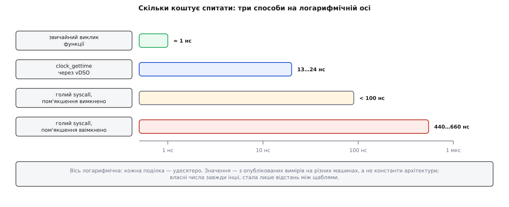

# ⚙️ Системний виклик своїми руками: без libc, під трасуванням і з секундоміром

<preknowlist>
- [Вбудований асемблер у C/C++](book:programming/inline-assembly) — як прив'язати змінну C до конкретного регістра й навіщо компіляторові список затертого.
- [Угода про виклик (ABI)](book:programming/calling-convention) — які регістри везуть аргументи й хто зобов'язаний зберігати їхній вміст.
- [C-рантайм](book:programming/c-runtime) — що виконується до `main` і хто взагалі його кличе.
- [errno та POSIX-коди помилок](book:programming/errno) — окрема змінна, у якій бібліотека лишає код помилки.
</preknowlist>

Зберемо програму, яка друкує рядок і завершується, не маючи в собі жодного байта бібліотеки C: усе, що вона робить зі світом, — дві команди-пастки. Мета не в мінімалізмі, а в тому, щоб побачити межу на дотик: скільки роботи ховає звичайний `printf`, звідки насправді береться `errno`, чому те саме на aarch64 виглядає інакше — і в скільки разів перетин межі дорожчий за виклик функції, коли міряти секундоміром, а не на віру.

## Задача

Три пункти, кожен перевіряється очима.

**Перше.** Програма пише рядок у стандартний вивід і завершується з кодом 0, не викликаючи жодної бібліотечної функції. Не «майже жодної»: у зібраному файлі не має бути ні бібліотеки C, ні її стартового коду.

**Друге.** Зібрати статичний двійковий файл і подивитися на нього ззовні — трасувальником, який показує кожен перетин межі. Ми маємо побачити рівно три рядки: запуск, запис, вихід.

**Третє.** Поміряти ціну одного перетину й покласти її поряд із ціною звичайного виклику функції та ціною читання часу, яке межу не перетинає взагалі.

## Що робить бібліотека, чого доведеться не робити

Перш ніж писати, корисно перелічити обов'язки, які бібліотека C виконує мовчки, — бо кожен із них тепер лягає на нас.

**Стартовий код.** Ядро не кличе `main` — воно стрибає на адресу, записану в заголовку файлу як точка входу, а за домовленістю там лежить символ `_start`. У звичайній програмі цей символ належить бібліотеці: він розбирає стек, на якому лежать `argc`, `argv` та оточення, налаштовує потоково-локальну пам'ять, запускає конструктори — і аж тоді кличе `main`. Немає бібліотеки — немає й `_start`, тож писати його доведеться самому.

**Складання регістрів і пастка.** Функція `write` у бібліотеці — це кілька команд: покласти номер послуги в один регістр, три аргументи в три інші, виконати команду-пастку. Це та частина, заради якої все й затіяно.

**Розкладання одного числа.** Ядро віддає рівно одне число, у якому змішані два різні смисли: скільки байтів записано або який код помилки. Бібліотека розкладає їх на «результат» і `errno`. Без бібліотеки розкладати доведеться нам, і саме тут найлегше помилитися.

**Завершення.** З `_start` нема куди вертатися: адреси повернення на стеку немає, там лежить `argc`. Програма зобов'язана завершитися сама, теж системним викликом.

## Код

Обидва варіанти — той самий файл, зібраний для двох архітектур. Різняться вони рівно в трьох місцях: як записана команда-пастка, які регістри везуть номер і аргументи, і які числа стоять за назвами послуг. Решта — той самий C.

:::tabs
```c-x86-64
/* raw.c — програма без бібліотеки C: пише рядок і завершується.
 * Збірка: gcc -O2 -static -no-pie -nostdlib -ffreestanding
 *             -fno-stack-protector -o raw raw.c
 */

/* ── Один перетин межі: номер у rax, аргументи в rdi, rsi, rdx ─────────── */
static inline long sys3(long n, long a1, long a2, long a3)
{
    long ret;
    __asm__ volatile ("syscall"
                      : "=a" (ret)                        /* назад — одне число в rax   */
                      : "a" (n), "D" (a1), "S" (a2), "d" (a3)
                      : "rcx", "r11", "memory");          /* rcx і r11 з'їдає сама команда */
    return ret;
}

#define SYS_write         1
#define SYS_exit_group  231
#define EINTR             4

/* ── Одне число → результат АБО код помилки ───────────────────────────── */
/* Помилці віддано рівно 4095 значень, тому перевірка — одне беззнакове
 * порівняння: усе, що більше за (unsigned)−4096, лежить у −4095…−1.       */
static long unpack(long r, int *err)
{
    if ((unsigned long) r > (unsigned long) -4096L) {
        *err = (int) -r;                  /* саме це число бібліотека кладе в errno */
        return -1;
    }
    *err = 0;
    return r;
}

/* ── Чесний запис: короткий запис і переривання сигналом ───────────────── */
static long write_all(int fd, const char *buf, unsigned long len)
{
    unsigned long done = 0;
    while (done < len) {
        int err;
        long n = unpack(sys3(SYS_write, fd, (long) (buf + done),
                             (long) (len - done)), &err);
        if (n < 0) {
            if (err == EINTR) continue;   /* сигнал устиг раніше за перший байт */
            return -(long) err;           /* решту помилок віддаємо нагору      */
        }
        done += (unsigned long) n;        /* ядро мало право записати менше     */
    }
    return (long) done;
}

/* ── Тіло програми ────────────────────────────────────────────────────── */
__attribute__((noreturn)) void nolibc_main(void)
{
    static const char msg[] = "Привіт із-за межі!\n";
    write_all(1, msg, sizeof msg - 1);
    sys3(SYS_exit_group, 0, 0, 0);        /* ця пастка не вертається ніколи */
    __builtin_unreachable();
}

/* ── Точка входу: сюди ядро стрибає одразу після запуску ──────────────── */
__asm__(
"   .globl _start           \n"
"   .type  _start, @function\n"
"_start:                    \n"
"   xor   %ebp, %ebp        \n"   /* обірвати ланцюг кадрів для налагоджувача */
"   and   $-16, %rsp        \n"   /* нижче буде call, а він додасть свої 8 —
                                     всередині функції ABI обіцяє rsp ≡ 8 (mod 16) */
"   call  nolibc_main       \n"
"   ud2                     \n"   /* сюди керування не доходить */
);
```
```c-aarch64
/* raw.c — те саме без бібліотеки C для aarch64.
 * Збірка: aarch64-linux-gnu-gcc -O2 -static -no-pie -nostdlib -ffreestanding
 *                               -fno-stack-protector -o raw raw.c
 */

/* ── Один перетин межі: номер у x8, аргументи в x0, x1, x2 ─────────────── */
static inline long sys3(long n, long a1, long a2, long a3)
{
    register long x8 __asm__("x8") = n;
    register long x0 __asm__("x0") = a1;
    register long x1 __asm__("x1") = a2;
    register long x2 __asm__("x2") = a3;
    __asm__ volatile ("svc #0"
                      : "+r" (x0)                /* назад — одне число в x0     */
                      : "r" (x8), "r" (x1), "r" (x2)
                      : "memory", "cc");         /* решту ядро вертає незмінною */
    return x0;
}

#define SYS_write        64
#define SYS_exit_group   94
#define EINTR             4

/* ── Одне число → результат АБО код помилки ───────────────────────────── */
/* Домовленість про діапазон помилок — спільна для всіх архітектур Linux.  */
static long unpack(long r, int *err)
{
    if ((unsigned long) r > (unsigned long) -4096L) {
        *err = (int) -r;
        return -1;
    }
    *err = 0;
    return r;
}

/* ── Чесний запис: короткий запис і переривання сигналом ───────────────── */
static long write_all(int fd, const char *buf, unsigned long len)
{
    unsigned long done = 0;
    while (done < len) {
        int err;
        long n = unpack(sys3(SYS_write, fd, (long) (buf + done),
                             (long) (len - done)), &err);
        if (n < 0) {
            if (err == EINTR) continue;
            return -(long) err;
        }
        done += (unsigned long) n;
    }
    return (long) done;
}

/* ── Тіло програми ────────────────────────────────────────────────────── */
__attribute__((noreturn)) void nolibc_main(void)
{
    static const char msg[] = "Привіт із-за межі!\n";
    write_all(1, msg, sizeof msg - 1);
    sys3(SYS_exit_group, 0, 0, 0);
    __builtin_unreachable();
}

/* ── Точка входу ──────────────────────────────────────────────────────── */
__asm__(
"   .globl _start            \n"
"   .type  _start, %function \n"
"_start:                     \n"
"   mov   x29, #0            \n"   /* обірвати ланцюг кадрів  */
"   mov   x30, #0            \n"   /* вертатися нікуди        */
"   b     nolibc_main        \n"   /* sp уже вирівняний: інакше апаратура не вміє */
);
```
:::

Три місця в цьому коді варті окремої розмови, бо саме вони відрізняють робочий варіант від такого, що «здається робочим».

**Список затертого — це не формальність.** Команда `syscall` на x86-64 кладе адресу повернення в `rcx`, а прапорці в `r11` — сама, без питань. Компілятор про це не здогадується: для нього `syscall` — темна пляма, і якщо в `rcx` у нього саме лежала жива змінна, він спокійно скористається нею після повернення й отримає адресу замість числа. Тому обидва регістри перелічено як затерті. Той самий рядок містить `"memory"`, і це навіть важливіше: у виклику `write` ядро **читає** нашу пам'ять, а у виклику `read` — **пише** в неї. Без позначки компілятор має право вважати, що пам'ять не змінилася, і віддати старе значення з регістра. На aarch64 список коротший: ядро Linux вертає всі регістри, крім `x0`, незмінними — так само вважають і glibc, і musl, у чиєму вбудованому асемблері жоден регістр у затертих не значиться взагалі.

**Розкладання одного числа коштує один рядок.** Помилці віддано рівно діапазон −4095…−1, тому не потрібні ні порівняння з переліком кодів, ні дві перевірки: одне беззнакове порівняння `(unsigned long) r > (unsigned long) -4096L` істинне саме для цього діапазону й ні для чого іншого. Додатне значення `-r` — це і є те число, яке бібліотека поклала б у `errno`.

**Цикл навколо `write` — не перестраховка.** Ядро має повне право записати менше, ніж просили: труба заповнена, сокет не встигає, сигнал прийшов посеред роботи. Хто пише `write(1, buf, len)` один раз і не дивиться на результат, той рано чи пізно втратить хвіст рядка. Обидві причини повернутися в цикл видно в коді: короткий запис збільшує лічильник, `EINTR` не збільшує нічого.

## Погляд ззовні

Збираємо й запускаємо:

```
$ gcc -O2 -static -no-pie -nostdlib -ffreestanding -fno-stack-protector -o raw raw.c
$ ./raw
Привіт із-за межі!
$ ldd raw
	not a dynamic executable
```

Файл виходить на кілька кілобайтів — майже все це заголовки ELF та вирівнювання сегментів на сторінку. Для порівняння: та сама програма з `printf`, зібрана статично з glibc, займає сотні кілобайтів. Не тому, що `printf` великий, а тому, що разом із ним приїжджає весь [стартовий і службовий шар бібліотеки](book:unix-linux/static-and-dynamic-linking).

Тепер найцікавіше — подивитися на програму [трасувальником системних викликів](book:unix-linux/syscall-tracing), який перехоплює кожен перетин межі:

```
$ strace ./raw
execve("./raw", ["./raw"], 0x7ffc… /* 47 vars */) = 0
write(1, "Привіт із-за межі!\n", 33)          = 33
exit_group(0)                                 = ?
+++ exited with 0 +++
```

Три рядки — і в них уся зовнішня біографія програми. Тридцять три байти на дев'ятнадцять знаків разом із переведенням рядка: українські літери в UTF-8 займають по два байти, решта — по одному.

А ось як виглядає початок звичайної програми з `printf`, зібраної динамічно, — до першого корисного байта вона встигає перетнути межу два-три десятки разів:

```
execve("./hello", ["./hello"], …)                       = 0
brk(NULL)                                               = 0x55d3…
access("/etc/ld.so.preload", R_OK)                      = -1 ENOENT (…)
openat(AT_FDCWD, "/etc/ld.so.cache", O_RDONLY|O_CLOEXEC) = 3
mmap(NULL, 179467, PROT_READ, MAP_PRIVATE, 3, 0)        = 0x7f…
openat(AT_FDCWD, "/lib/x86_64-linux-gnu/libc.so.6", …)  = 3
mmap(…, PROT_READ|PROT_EXEC, …)                         = 0x7f…
arch_prctl(ARCH_SET_FS, 0x7f…)                          = 0
…
write(1, "Привіт із-за межі!\n", 33)                    = 33
exit_group(0)                                           = ?
```

Кожен із цих рядків — робота, яку ми не робимо: знайти кеш бібліотек, відкрити `libc.so.6`, відобразити її в пам'ять, розв'язати символи. Окремо варто помітити `arch_prctl(ARCH_SET_FS, …)` — саме тут бібліотека ставить базу сегмента, у якому живе потоково-локальна пам'ять. У нашій програмі цього рядка немає, і згодом це аукнеться.

## Секундомір

Тепер порахуємо ціну. Міряти будемо три речі: звичайний виклик функції, читання часу (яке межі не перетинає) і голий системний виклик. Для найдешевшого з трьох потрібен виклик, який не робить нічого корисного, — `getpid` підходить ідеально: він лише читає число з ядерної структури, тож усе, що ми зміряємо, — це сам перетин.

```c
/* bench.c — три способи спитати й що вони коштують.  gcc -O2 -o bench bench.c */
#include <stdio.h>
#include <time.h>

#define SYS_getpid 39                          /* x86-64; на aarch64 — 172 */

static inline long raw_getpid(void)
{
    long ret;
    __asm__ volatile ("syscall"
                      : "=a" (ret)
                      : "a" ((long) SYS_getpid)
                      : "rcx", "r11", "memory");
    return ret;
}

__attribute__((noinline)) static long plain(long x) { return x + 1; }

static double now_ns(void)
{
    struct timespec ts;
    clock_gettime(CLOCK_MONOTONIC, &ts);       /* сам іде через vDSO, тому дешевий */
    return ts.tv_sec * 1e9 + ts.tv_nsec;
}

#define TIME(label, N, body) do {                                   \
        double t0 = now_ns();                                       \
        for (long i = 0; i < (N); i++) { body; }                    \
        printf("%s: %.1f нс на виклик\n", label, (now_ns() - t0) / (N)); \
    } while (0)

int main(void)
{
    volatile long sink = 0;
    struct timespec ts;

    TIME("виклик функції",       200000000L, sink = plain(i));
    TIME("clock_gettime (vDSO)",  20000000L, clock_gettime(CLOCK_MONOTONIC, &ts));
    TIME("getpid (голий syscall)", 5000000L, sink = raw_getpid());
    return 0;
}
```

Дві деталі роблять цей вимір чесним. `sink` оголошено `volatile`, інакше компілятор при `-O2` викине весь перший цикл разом із функцією — і ви поміряєте порожнечу. А `getpid` викликається **голим** асемблером, не бібліотечною обгорткою: старі версії glibc кешували ідентифікатор процесу після першого запиту, і на такій системі бібліотечний `getpid()` показує одну-дві наносекунди, тобто взагалі не міряє межу.

Порядки, які дають такі виміри на сучасних x86-64:

```
  звичайний виклик функції                     ≈ 1 нс
  clock_gettime через vDSO                     13…24 нс
  голий syscall, пом'якшення вимкнено          < 100 нс
  голий syscall, пом'якшення ввімкнено         440…660 нс
```

Числа для двох середніх рядків узято з опублікованих вимірювань Ґеорґа Заутгофа (Georg Sauthoff, «On the Costs of Syscalls»), де ту саму пачку викликів прогнали на десятку різних машин: `clock_gettime(CLOCK_REALTIME)` дав 13…24 нс на **всіх** хостах, а перемикання режиму — «кілька сотень наносекунд», причому на Xeon Gold 6256 із вимкненими пом'якшеннями апаратних вад менше за 100 нс, а на старших Xeon E5 із увімкненими — 440…660 нс. *Статус: опубліковані вимірювання конкретних машин, а не константа архітектури; ваші числа будуть інші, стала лише відстань між щаблями.*



*Кожна поділка осі — удесятеро. Між викликом функції й перетином межі лежить не «трохи дорожче», а два-три порядки, і половину останнього щабля додало не залізо, а лікування від апаратних вад.*

Звідки береться така прірва — видно по тому, чого кожен щабель **не** робить.

Виклик функції не міняє нічого, крім лічильника команд: передбачувач переходів давно вивчив цю адресу, конвеєр не спотикається, весь робочий набір лежить у кеші першого рівня. Кілька тактів — і ми на місці.

Читання часу через **vDSO** — теж звичайний виклик, тільки в бібліотеку, яку ядро само відобразило в адресний простір програми разом зі сторінкою своїх даних, доступною лише на читання. Функція бере звідти опорну мітку й коефіцієнти, читає лічильник тактів процесора й перераховує. Дорожче за `plain` разів у двадцять — але не через межу, а через сам лічильник тактів, читання якого впорядковують відносно решти команд. Межі тут не перетинають узагалі: [vDSO](book:unix-linux/vdso) для того й існує, щоб питання «котра година» лишалося по цей бік стіни.

Голий системний виклик робить усе те, чого не роблять перші два. Апаратура міняє рівень привілею, бере адресу входу з регістра, зберігає адресу повернення й гасить небезпечні прапорці. Далі вхідний код ядра перемикається на власний стек, зберігає регістри користувача, перевіряє номер за таблицею, кличе обробник — і робить усе те саме навспак на виході. А коли ввімкнено пом'якшення апаратних вад спекулятивного виконання, до цього додається зміна таблиць сторінок на кожному перетині в обидва боки — звідси й різниця між «менше ста» і «більше чотирьохсот» наносекунд на сусідніх рядках таблиці.

> 🔧 **Навіщо це.** Коли профіль показує, що програма проводить третину часу в ядрі, є рівно дві різні дії: зробити виклики дешевшими (не можна — ціну задає апаратура й політика безпеки) або зробити їх менше (можна майже завжди). Вимір із цього розділу відповідає, скільки ви виграєте: якщо перетин коштує 500 нс, то мільйон дрібних записів — це півсекунди чистого податку, і жодна оптимізація всередині циклу цього не поверне. Батчинг перестає бути смаком і стає арифметикою.

І остання поправка, без якої число легко переоцінити в інший бік. Цей цикл міряє **найкращий випадок**: робочий набір крихітний, кеші не витісняються, передбачувач вивчив усе напам'ять. У справжній програмі системний виклик додатково вимиває з кешів ваші гарячі дані, і платити за це доведеться промахами вже після повернення. Мікровимірювання показує нижню межу ціни, а не її повний розмір.

## Пастки

**Затерте, про яке не сказали компіляторові.** `rcx` і `r11` на x86-64 з'їдає сама команда; `"memory"` треба завжди, бо ядро читає й пише пам'ять програми. Найпідліше тут те, що без цих позначок код часто **працює** — доти, доки в наступній збірці розподільник регістрів не вирішить потримати щось живе саме в `rcx`.

**Четвертий аргумент — не в `rcx`.** Угода системних викликів на x86-64 везе його в `r10` саме тому, що `rcx` зайнято адресою повернення. Просто написати обмеження для `r10` не вийде — у GCC для нього немає літери, як `"D"` для `rdi`; потрібна змінна, прив'язана до регістра: `register long r10 __asm__("r10") = a4;`. Забути про це легко, бо помилка виникне лише у викликах із чотирма й більше аргументами: три перші поїдуть як слід, а четвертий тихо загубиться.

**Сигнал усередині виклику.** Якщо сигнал приходить, поки ядро чекає (на трубу, на сокет, на термінал), очікування уривається. Що буде далі, залежить від прапорця `SA_RESTART` в обробника. З ним ядро перезапускає виклик прозоро — на x86-64 воно відновлює номер послуги в `rax` і **відкочує лічильник команд на два байти назад**, рівно на довжину команди `syscall`, щоб та виконалася ще раз. Без нього ви отримуєте −4, тобто `EINTR`, — і зобов'язані повторити самі, як у `write_all`. Пам'ятайте, що прапорець не всесильний: частину викликів (зокрема очікування з таймаутом) не перезапускають ніколи, бо перезапуск подовжив би саме той час, який просили обмежити. Подробиці — у [темі про EINTR](book:unix-linux/eintr-and-restart).

**`errno` після ручного виклику — чужий.** Бібліотека не знає, що ви кудись ходили: `errno` ставлять її обгортки, і більш ніхто. Прочитавши цю змінну після голого виклику, ви побачите код помилки від якогось попереднього бібліотечного виклику, зробленого хвилину тому, — і повірите йому. Правило просте: розклали число самі — самі й носіть код помилки, як робить `unpack`. У програмі без бібліотеки ситуація ще гостріша: `errno` — потоково-локальна змінна, а базу сегмента для потоково-локальної пам'яті ставить стартовий код бібліотеки тим самим `arch_prctl`, якого в нашому трасуванні немає. Звернення до `__thread`-змінної в такій програмі не поверне сміття — воно впаде.

**Компілятор кличе те, чого у вас немає.** Побачивши копіювання структури, цикл обнулення чи обхід рядка до нуля, GCC має право замінити його викликом `memcpy`, `memset` або `strlen` — навіть якщо ви цих слів не писали. У програмі без бібліотеки це або помилка лінкування, або, якщо ви щойно реалізували `memcpy` циклом, нескінченна рекурсія: компілятор упізнає ідіому у вашій же реалізації й підставить виклик її самої. Ліки — `-ffreestanding`, а для впертих випадків `-fno-tree-loop-distribute-patterns`. З тієї ж родини `-fno-stack-protector`: дистрибутиви типово вмикають захист стека, а це посилання на `__stack_chk_fail`, якого без бібліотеки теж немає.

**Стек на вході й вихід без повернення.** Одразу після запуску `rsp` вказує на `argc` і вирівняний на 16 байтів. Але скомпільована функція очікує іншого: вона розраховує, що її **покликали**, тобто що адреса повернення вже з'їла 8 байтів. Якщо стрибнути в C-функцію прямо з `_start`, зсув поїде на ці 8 байтів, і перша ж команда SSE, що зберігає регістр у вирівняну комірку, покладе програму без жодного пояснення. Тому в стартовому шматку асемблера є `and $-16, %rsp` і `call`, а не `jmp`. На aarch64 цієї пастки немає: там апаратура вимагає, щоб `sp` завжди був кратний 16, і виклик нічого на стек не кладе — адреса повернення їде в регістрі. Друга половина правила: з `nolibc_main` не можна просто вийти. Вертатися нікуди, тому останній рядок — це `exit_group`, а не `return`. І саме `exit_group`, а не `exit`: `exit` завершує лише потік, який його покликав, і в багатопотоковій програмі решта житиме далі.

**Номери не портабельні, і пам'ять тут не помічниця.** `write` — це `1` на x86-64 і `64` на aarch64; `exit_group` — `231` і `94`. У 32-бітного x86 своя, третя таблиця. Номери в коді варто брати з `<sys/syscall.h>` (константи `SYS_write` і подібні) або з `asm/unistd.h`, а не з голови й не з чужої статті — правильне число тут виглядає так само переконливо, як і неправильне, а помилка проявиться викликом зовсім іншої послуги.

**Секундомір теж бреше.** Найпоширеніші три способи: поміряти бібліотечну обгортку замість самої межі (кешований `getpid`); поміряти `clock_gettime` на системі, де джерелом часу обрано не лічильник тактів процесора, — тоді vDSO чесно ходить у ядро, і замість двох десятків наносекунд ви побачите сотні (те саме буває з `CLOCK_MONOTONIC_RAW` на старших ядрах, де його ще не винесли у vDSO); і, нарешті, забути про плаваючу частоту процесора, через яку перші мільйони ітерацій виконуються повільніше за наступні. Перевіряти джерело часу варто прямо перед виміром — воно лежить у `/sys/devices/system/clocksource/clocksource0/current_clocksource`.

Якщо такий код потрібен не для вправи, а для роботи, переписувати його з нуля не обов'язково: у дереві ядра Linux живе готовий мінімальний замінник бібліотеки — `tools/include/nolibc`. Це ті самі обгортки над командою-пасткою, тільки одразу для всіх підтримуваних архітектур і з рештою дрібниць, на яких тут спотикаються; ядро використовує його у власних тестах, де тягнути повноцінну libc незручно.

## Джерела

- [syscall(2), Linux manual page](https://man7.org/linux/man-pages/man2/syscall.2.html) — таблиця архітектур: команда, регістр номера, регістри аргументів, регістри результату.
- [AMD64 Linux Kernel Conventions (System V ABI)](https://www.ucw.cz/~hubicka/papers/abi/node33.html) — «The kernel destroys registers %rcx and %r11».
- [Georg Sauthoff. On the Costs of Syscalls](https://gms.tf/on-the-costs-of-syscalls.html) — виміри на десятку машин: vDSO проти справжнього перетину, кешований `getpid` у старій glibc.
- [arch/x86/kernel/signal.c, torvalds/linux](https://github.com/torvalds/linux/blob/master/arch/x86/kernel/signal.c) — перезапуск перерваного виклику: відновлення номера й відкочування лічильника команд на два байти.
- [tools/include/nolibc, torvalds/linux](https://github.com/torvalds/linux/tree/master/tools/include/nolibc) — мінімальний замінник бібліотеки C у дереві ядра: окремий заголовок на кожну архітектуру (`arch-x86.h`, `arch-arm64.h`, `arch-riscv.h` та інші).
