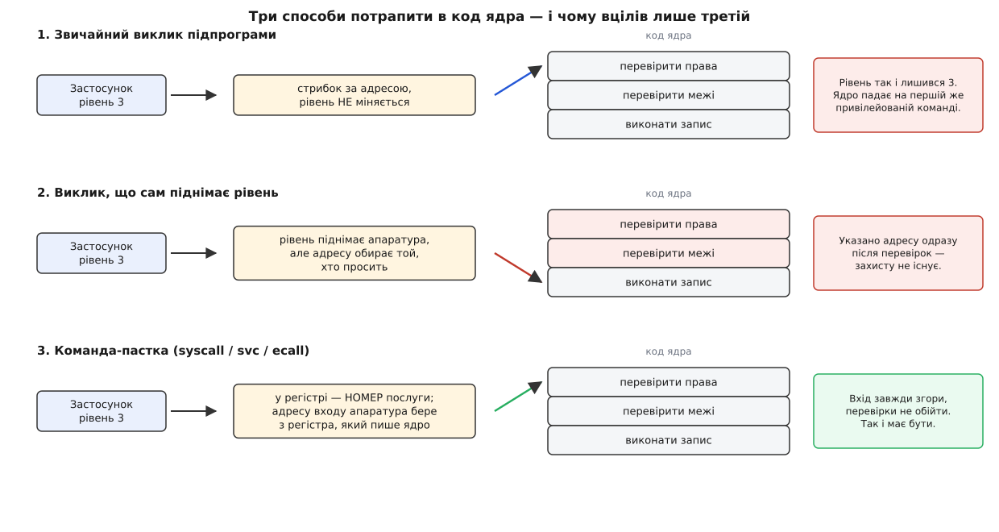
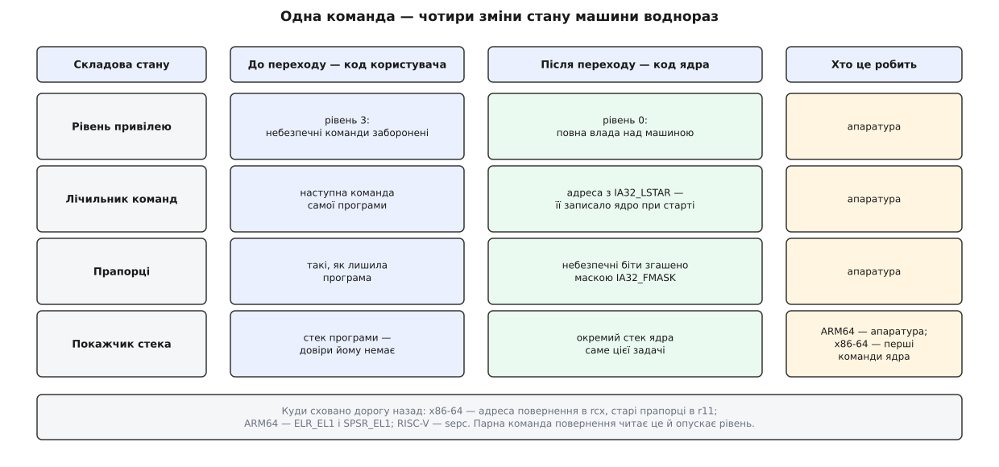
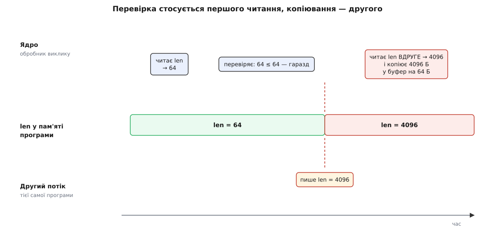
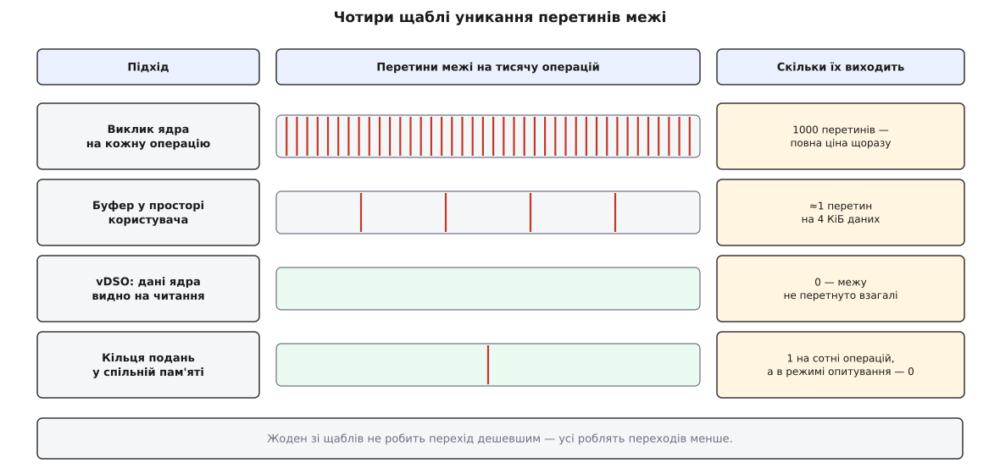

# Системний виклик

<preknowlist>
- [Кільця захисту й рівні привілеїв](book:programming/protection-rings) — процесор тримає біт поточного привілею, і частина команд виконується лише на привілейованому рівні.
- [Обробка виключень у процесорі](book:programming/cpu-exception-handling) — пастка: керування миттєво стрибає на наперед заданий обробник, а потім вертається на наступну команду.
- [Угода про виклик (ABI)](book:programming/calling-convention) — як аргументи розкладають по регістрах, хто які регістри зобов'язаний зберегти й куди лягає адреса повернення.
- [Віртуальна пам'ять](book:programming/virtual-memory) — адреса в програмі не є адресою в мікросхемі; кожну сторінку позначено, кому вона доступна.
</preknowlist>

Програма пише в файл один рядок. Здається, простіше нікуди: узяти байти й покласти їх на диск. Але спробуймо пройти цей шлях чесно. Байти лежать у пам'яті програми, а диск слухається лише свого контролера, до регістрів якого програма не має доступу. Файл — не суцільний шматок диска, а набір блоків, розкиданих по пластинах, і карта цих блоків лежить у пам'яті, куди програма теж не дістає. Ба більше: поряд працюють ще двадцять процесів, які теж пишуть, і хтось мусить розсудити, чий блок ляже першим. Кожен крок цієї роботи — привілейований, а програма привілею не має.

Отже, зробити самій — не можна. Лишається попросити. І ось тут виникає питання, з якого росте вся тема: **як недовірена програма просить довірене ядро, якщо між ними стоїть стіна, яку сама програма подолати не здатна?** Відповідь називають системним викликом (англ. *system call* — «звернення до системи»). Але сама назва нічого не пояснює. Пояснює те, що станеться, якщо спробувати збудувати цей перехід найпростішим способом і подивитися, де він розвалиться.

### Чому звичайний виклик не годиться

Найочевидніша спроба: адже ядро — теж код у пам'яті. Хай програма просто зробить звичайний виклик підпрограми за адресою потрібної функції ядра. Ніякої нової механіки, все як завжди.

Ця спроба вмирає на першій же команді. Виклик підпрограми не міняє рівень привілею — він лише кладе адресу повернення й стрибає. Код ядра почне виконуватися **на непривілейованому рівні**, тобто з тими самими правами, що й програма. Перша ж команда, яка звертається до контролера диска чи до таблиць відображення пам'яті, зловить пастку й нічого не зробить. Отже, самого стрибка мало: перехід **мусить піднімати рівень привілею**.

Друга спроба, розумніша: хай буде особлива команда виклику, яка воднораз стрибає **і** піднімає рівень. Адресу, як звичайно, вказує той, хто викликає.

Ця спроба смертельна, і саме розбір її смерті дає ключ до всієї конструкції. Функція ядра, яка пише в файл, починається з перевірок: чи відкрито цей файл цим процесом, чи є право запису, чи не виходить довжина за межі буфера. Аж потім іде власне запис. Якщо адресу стрибка обирає програма, вона просто вкаже адресу **на кілька команд нижче** — одразу після перевірок. Рівень підніметься, перевірки не виконаються, запис відбудеться. Захисту не існує: у ядрі є тисячі команд, і серед них знайдеться потрібна.

Звідси випливає жорстка вимога, яку ніяк не обійти. Перехід має робити дві речі **нерозривно**: піднімати рівень привілею **і** передавати керування за адресою, яку **обрало ядро, а не програма**. Якщо ці дві дії роз'єднати або віддати вибір адреси тому, хто просить, — стіни немає.



*Звичайний виклик стрибає, але не піднімає рівня — код ядра одразу впирається у власну ж перевірку привілею. Виклик із автоматичним підняттям рівня гірший: адресу обирає той, хто просить, і він указує точку одразу після перевірок. Лише команда-пастка розриває цей зв'язок: підняття рівня й адреса входу задані заздалегідь і не залежать від аргументів команди.*

Команда, яка це вміє, у процесора вже є — це [пастка](book:programming/cpu-exception-handling) (англ. *trap* — «капкан»), той самий механізм, яким процесор обробляє ділення на нуль чи звернення за неіснуючою адресою. Пастка за визначенням стрибає туди, куди їй заздалегідь сказали, і вертається на наступну команду. Лишалося додати команду, яка **навмисно** влаштовує пастку, — і перехід готовий. Ця команда не має операнда-адреси взагалі: `syscall` на x86-64, `svc #0` на ARM64, `ecall` на RISC-V. Дивитися нема на що — адреса не тут.

> 🔧 **Навіщо це.** Уся ізоляція процесів, увесь захист операційної системи від застосунків тримається на одному факті: недовірений код не може обрати, куди саме він потрапить у привілейованому світі. Це не програмна умовність, яку можна обійти хитрощами, — це властивість декодера команд. Тому «пісочниця», що не спирається на цю межу, ізолює лише від чесних програм.

### Номер замість адреси

Пастка веде в одну точку, а послуг, яких програма може попросити, — сотні: відкрити файл, створити процес, під'єднатися до мережі, спитати час. Треба якось сказати, **чого саме** ти хочеш, не називаючи адреси. Розв'язок очевидний, щойно сформульовано вимогу: замість адреси програма кладе в домовлений регістр **число** — номер послуги.

Різниця між номером і адресою тут не косметична, а принципова. Адреса — це вибір довільної точки в коді ядра. Номер — це вибір з наперед складеного списку, який ядро зробило само. Ядро тримає таблицю «номер → адреса обробника»; отримавши число, ядро спершу **перевіряє, чи не виходить воно за межі таблиці** (виходить — відмова, а не стрибок казна-куди), і лише тоді бере звідти адресу. Той, хто просить, не має жодного впливу на зміст таблиці. Це той самий прийом, що й у [векторі переривань](book:programming/interrupt-vector), тільки джерело номера — не пристрій, а програма.

Список номерів виходить довгий і, головне, **вічний**. Номер `1` на x86-64 у Linux означає `write`, `0` — `read`, `60` — `exit`; найбільші номери в поточних ядрах уже перевалили за чотири з половиною сотні. Змінити значення старого номера не можна ніколи: десь у світі лежить двійковий файл, скомпільований десять років тому, і він досі кладе в регістр `1`, коли хоче писати. Тому номери лише додають у хвіст, а застарілі послуги лишають на місці як пам'ятники. Показово, що ARM64 і RISC-V, з'явившись пізніше, взяли в Linux **одну на двох** таблицю номерів: історичного шлейфу x86 вони не тягнуть, тож змогли почати з чистої нумерації й не розходитися.

> 🔧 **Навіщо це.** Незмінність номерів — причина, чому статично зібраний двійковий файл для Linux працює на ядрі, старшому й новішому за нього на роки, без жодної перезбірки. Межа системних викликів — чи не єдиний по-справжньому стабільний інтерфейс у системі; усе, що вище (бібліотеки, формати, шляхи), змінюється значно охочіше.

### Що саме змінюється в мить переходу

Тепер варто розібрати сам перехід по частинах, бо «підняти рівень і стрибнути» — це коротке резюме, а не опис. Процесор мусить одним неподільним рухом перевести машину зі стану «виконуємо недовірений код» у стан «виконуємо ядро», і кожна складова цього стану має свою причину.

**Адреса входу лежить у регістрі, який пише лише ядро.** На x86-64 це особливий регістр `IA32_LSTAR` — ядро записує туди адресу свого вхідного обробника один раз під час завантаження. Команда `syscall` бере адресу звідти, і ніяк інакше. На ARM64 вхід шукають у таблиці векторів, на яку вказує регістр `VBAR_EL1`; на RISC-V — за адресою з регістра `stvec`. Скрізь ідея та сама: адреса зберігається там, куди непривілейований код записати не може.

**Адресу повернення треба десь зберегти.** Пастка перерве потік команд, а колись доведеться вернутися рівно на наступну. На x86-64 команда `syscall` кладе адресу повернення в регістр `rcx`, а колишні прапорці — в `r11`. На ARM64 адреса повернення лягає в `ELR_EL1`, стан — у `SPSR_EL1`; на RISC-V — у `sepc`. Парна команда повернення (`sysret`, `eret`, `sret`) читає це назад і воднораз опускає рівень.

**Прапорці треба знезброїти.** Регістр прапорців належав недовіреному кодові, і серед його бітів є небезпечні: біт дозволу переривань, біт покрокового трасування. Якби вони перейшли в ядро як є, програма могла б увійти в ядро з вимкненими перериваннями або з увімкненим трасуванням кожної команди й тим отруїти роботу обробника. Тому команда переходу накладає маску: на x86-64 значення з регістра `IA32_FMASK` гасить визначені біти прямо в момент входу.

**І найгостріше — стек.** Ядро не може працювати на стеку програми. Покажчик стека належить недовіреному кодові й може вказувати куди завгодно: у чужу пам'ять, у сторінку, якої немає, або взагалі в саме ядро. Якби обробник почав складати туди свої дані, програма читала б робочі значення ядра або підсовувала б йому свої. Тому кожна задача має **окремий стек ядра**, і перехід мусить перемкнутися на нього.

Ось де архітектури розходяться. ARM64 має окремий покажчик стека для рівня ядра (`SP_EL1`), і апаратура перемикає його сама при вході у виключення. А от x86-64 команда `syscall` покажчика стека **не чіпає взагалі** — це свідома жертва заради швидкості. Наслідок: перші команди ядра виконуються ще на стеку користувача, і найперше, що вони роблять, — це дістають адресу свого стека з місця, куди програма дотягтися не може (на x86-64 для цього є команда `swapgs`, що підмінює базу спеціального сегмента на приховану ядерну), і аж тоді перекидають покажчик. Це вузьке вікно в кілька команд — класичне місце для тонких помилок у ядрі, і саме цей відрізок пишуть з особливою обережністю.



*Одна команда-пастка перекидає чотири складові стану машини воднораз: рівень привілею, лічильник команд (з регістра, куди пише лише ядро), прапорці (крізь маску) і покажчик стека. На x86-64 останнє апаратура перекладає на плечі ядра, тому перші кілька команд обробника виконуються ще на стеку користувача — і саме вони перемикають стек, перш ніж торкнутися будь-чого іншого.*

Варто зауважити, чого перехід **не** робить. Він не перемикає задачу: після системного виклику виконується та сама задача, просто на іншому рівні привілею й на іншому стеку. Це не [перемикання контексту](book:programming/context-switch), де ядро повністю зберігає стан однієї задачі й відновлює стан іншої. Плутати їх — типова помилка, і вона дорого коштує в оцінках: перемикання контексту в рази важче за перетин межі. Системний виклик, звісно, **може** призвести до перемикання задачі — якщо, скажімо, програма попросила дані, яких ще немає, і ядро вирішило віддати процесор комусь іншому, — але це вже наслідок конкретної послуги, а не властивість переходу.

Історія цієї команди довша, ніж здається: пастка для звернення до операційної системи з'явилася на початку 1960-х, задовго до персональних комп'ютерів, а на x86 два виробники розв'язали ту саму задачу двома несумісними парами команд — і перемогла не та, що була перша. [Як народилася команда-пастка й чому на x86-64 виграв варіант AMD](book:programming/system-call/hist-trap-instruction.md) — окрема історія, у якій добре видно, що механізм не впав з неба, а виріс із досвіду реальних машин.

### Аргументи їдуть у регістрах

Послуга потребує подробиць: у який файл писати, звідки брати байти, скільки їх. Аргументи мусять якось перетнути межу разом із номером. І тут повторюється та сама логіка недовіри, що й зі стеком.

Звичайна [угода про виклик](book:programming/calling-convention) дозволяє передавати частину аргументів на стеку. Для системного виклику цей шлях закритий з тієї самої причини, з якої ядро не працює на стеку користувача: щоб прочитати аргумент зі стека, ядро мусило б звернутися за адресою, яку дала недовірена програма, — а це вже небезпечна дія, яку треба окремо обставляти перевірками. Простіше й дешевше домовитися, що **всі аргументи їдуть тільки в регістрах**. Регістрів обмежене число, звідси й межа: шість аргументів, не більше. Послузі треба більше — передають адресу структури, і ядро вже свідомо читає її з усіма пересторогами.

Ця угода схожа на звичайну, але не збігається з нею, і розбіжність має конкретну причину. На x86-64 звичайна угода System V кладе четвертий аргумент у `rcx`. Але команда `syscall` **сама** використовує `rcx` — вона зберігає туди адресу повернення. Аргумент, покладений у `rcx`, буде затертий тією ж командою, що його везе. Тому угода системних викликів зсуває четвертий аргумент у `r10`, а `rcx` і `r11` оголошує затертими. Дрібниця, але показова: інтерфейс переходу підганяли не під красу, а під те, що фізично робить команда.

Розкладка по архітектурах відрізняється в дрібницях і збігається в суті. На x86-64 номер їде в `rax`, аргументи — в `rdi`, `rsi`, `rdx`, `r10`, `r8`, `r9`. На ARM64 номер — у `x8`, аргументи — від `x0` до `x5`. На RISC-V номер — в `a7`, аргументи — від `a0` до `a5`. [Повна таблиця контрактів по архітектурах — які регістри, яка команда, що затирається, як кодуються помилки](book:programming/system-call/api-syscall-abi.md) зібрана окремо: тримати її в голові не треба, а зазирати доводиться щоразу, коли пишеш щось нижче за libc.

### Одне число назад

Назад ядро віддає **одне число** в тому самому регістрі, де приїхав номер. Це разюче бідний канал: жодних структур, жодних кількох значень, жодного окремого поля помилки. І це не недогляд, а наслідок дешевизни: усе, що не поміщається в регістр, довелося б класти в пам'ять, а запис у пам'ять програми — знову дія з перевірками.

Як же тоді розрізнити «записано нуль байтів» і «сталася помилка»? Домовленістю. У Linux ядро повертає **від'ємне значення коду помилки**: замість «не вдалося, бо немає такого файлу» приїжджає число −2. Коди помилок невеликі, тому весь діапазон від −4095 до −1 віддано під помилки, а все інше — законний результат. Обгортка в бібліотеці C робить останній крок: побачивши число з цього діапазону, вона кладе його з протилежним знаком у [`errno`](book:programming/errno) і повертає програмі −1. Саме тому в підручниках із C системні виклики «повертають −1 і ставлять `errno`» — насправді так поводиться обгортка, а не ядро.

Виглядає цей шар тонше, ніж здається:

```c
/* Один перетин межі на x86-64: номер у rax, три аргументи в rdi/rsi/rdx.
   Команда syscall затирає rcx і r11 — попереджаємо про це компілятор. */
static long raw_syscall3(long n, long a1, long a2, long a3) {
    long ret;
    __asm__ volatile ("syscall"
                      : "=a" (ret)
                      : "a" (n), "D" (a1), "S" (a2), "d" (a3)
                      : "rcx", "r11", "memory");
    return ret;
}

#define SYS_write 1

/* Те, що робить обгортка libc: розкласти одне число на результат і помилку. */
long my_write(int fd, const void *buf, unsigned long len, int *err) {
    long r = raw_syscall3(SYS_write, fd, (long)buf, (long)len);
    if (r < 0 && r >= -4095) {   /* увесь цей діапазон — коди помилок */
        *err = (int)(-r);        /* саме тут народжується errno */
        return -1;
    }
    *err = 0;
    return r;                    /* скільки байтів справді записано */
}
```

Показовий висновок: **бібліотека C не є частиною межі**. Вона стоїть по цей бік стіни й лише зручно вбирає перехід у функцію. Той самий `write` можна зробити без жодної бібліотеки, вручну розклавши регістри, — і ядро не помітить різниці. Це не теоретична вправа: саме так живуть мови, що не спираються на libc, і саме тому в статично зібраному двійковому файлі системний виклик видно як голу команду. Практичний бік — [як написати й прогнати системний виклик своїми руками, побачити його ззовні й поміряти, скільки він коштує](book:programming/system-call/proj-raw-syscall.md) — розібрано окремо, з робочим кодом.

### Ядро не вірить жодному байту

Перехід змінив рівень привілею. Він **не змінив** того, хто написав аргументи. У регістрах лежать числа, що їх поклала недовірена програма, і ядро тепер діє за ними з повною владою над машиною. Це найнебезпечніша мить у всій системі, і ставлення до неї єдине: усе, що приїхало ззовні, — підозрюване, поки не доведено протилежне.

Найгостріше це видно на покажчиках. Аргумент `buf` у `write` — просто число, і ніщо не заважає програмі покласти туди адресу з ядерної половини адресного простору. Якщо ядро просто розіменує цей покажчик, воно **саме, своїми привілейованими руками**, прочитає власну пам'ять і віддасть її вміст програмі. Стіна впаде не тому, що її пробили, а тому, що ядро винесло за неї вміст на прохання.

Тому ядро ніколи не звертається до пам'яті програми звичайним розіменуванням. Для цього є окремі функції — у Linux вони звуться `copy_from_user` і `copy_to_user`, — які спершу перевіряють, що вся ділянка лежить у користувацькій половині, а потім копіюють байти особливим способом, що коректно переживає збій сторінки (адже сторінка програми могла бути вивантажена або й не існувати зовсім). Результат такого копіювання — не «скопійовано», а «скопійовано стільки-то, решта не вдалася», і ядро мусить це перевірити.

Але просто скопіювати мало, і тут ховається пастка, на якій спіткнулося чимало коду. Уявімо послугу, що приймає структуру з полем довжини. Ядро читає довжину, перевіряє, що вона не більша за 64, і йде копіювати рівно стільки байтів у свій буфер на 64 байти. Виглядає бездоганно. А тепер згадаймо, що в програми є другий потік, який працює **одночасно**, і що структура лежить у пам'яті програми. Другий потік дочекався, поки ядро зробить перевірку, і записав у поле довжини 4096. Якщо ядро прочитає довжину **вдруге** — уже в момент копіювання, — воно скопіює 4096 байтів у 64-байтовий буфер і зруйнує власний стек.



*Ядро читає довжину, перевіряє її й читає ще раз, уже щоб копіювати. Проміжок між цими двома читаннями належить програмі: другий потік встигає підмінити число, і перевірка стосується вже не тих даних, з якими працює копіювання. Ліки одні — скопіювати аргумент до себе один раз і далі працювати лише з власною копією, якої ніхто ззовні дістати не може.*

Ліки прості й непорушні: **прочитати аргумент рівно один раз, у свою пам'ять, і далі мати справу тільки з копією**. Перевірка й використання мають стосуватися того самого байта, а це можливо лише тоді, коли байт лежить там, куди програма не дотягнеться. Ця вада зветься подвійним читанням (англ. *double fetch*) і є окремим випадком ширшої проблеми — [гонки між перевіркою й використанням](book:programming/toctou-race), коли між моментом перевірки й моментом дії світ устигає змінитися.

> 🔧 **Навіщо це.** Правило «одна перевірка на одне читання» діє далеко за межами ядра: там, де перевіряєш дані, які може змінити хтось інший, — перевіряй свою копію, а не оригінал. Веб-сервер, що перевірив розмір завантаження за заголовком і потім читає тіло, драйвер, що звірив довжину пакета в спільному буфері DMA, — та сама механіка й та сама вада. Межа довіри — це завжди місце, де дані треба **забрати до себе**, а не розглядати здалеку.

Перевірка покажчиків — лише перший шар. За ним іде решта: чи взагалі відкритий цей файловий дескриптор у цього процесу, чи має цей користувач право на цю дію, чи не переповниться лічильник. Уся ця робота — ціна того, що межа існує; вона ж і причина, чому додати новий системний виклик у ядро незрівнянно важче, ніж додати функцію в бібліотеку. Функція в бібліотеці помиляється в межах свого процесу; помилка в обробнику системного виклику віддає машину. [Межа довіри](book:programming/trust-boundaries) тут проходить рівно по цій команді-пастці, і це найважливіша межа в усій машині.

### Скільки коштує перетин

Перехід коштує помітно дорожче за звичайний виклик функції, і корисно розуміти, з чого складається ця ціна, — бо саме вона визначила будову половини системного програмного забезпечення.

Найдешевша частина — те, що робить сама команда: змінити рівень, підвантажити адресу з регістра, зберегти адресу повернення. Це десятки тактів. Далі ядро зберігає регістри користувача (їх багато, і всі мусять уціліти), перемикає стек, розбирає номер, перевіряє аргументи — ще сотні тактів, і все це до того, як почалася корисна робота.

Дорожче коштує те, що не видно в коді. Перехід — подія, що **зупиняє [конвеєр](book:programming/pipeline)**: усі команди, які процесор устиг набрати наперед, треба відкинути, бо далі виконується зовсім інший код на іншому рівні привілею. Разом із конвеєром збиваються передбачувач переходів і кеші: код ядра витісняє з кешу команд гарячий код програми, дані ядра — її дані. Програма вертається з виклику в машину, яка «забула» частину її робочого набору, і платить за це промахами ще довго після повернення. Саме тому виміряна вартість системного виклику завжди більша, ніж сума очевидних кроків.

Історія добре показує, наскільки ця ціна керована інженерією. Спочатку системний виклик на x86 робили звичайною командою програмного переривання — механізмом, що ходить крізь таблицю дескрипторів у пам'яті з усіма її перевірками. Коли з'явилися спеціалізовані команди, що беруть усе потрібне з регістрів процесора, різниця виявилася разючою: на Pentium 4 виклик `getppid` коштував близько 1761 такту старим шляхом і близько 641 такту новим — майже втричі дешевше на тій самій машині. Сьогодні простий системний виклик на настільному процесорі вкладається в десятки-сотні наносекунд, тимчасом як звичайний виклик функції — це одиниці наносекунд. Порядок різниці — сотні разів.

А потім ціна знову зросла. Коли у 2018 році з'ясувалося, що [спекулятивне виконання лишає сліди в кеші](book:programming/out-of-order-execution/hist-spectre-meltdown.md) і дозволяє непривілейованому кодові вичитувати ядерну пам'ять, лікування виявилося прямим ударом по межі: ядро прибрали з адресного простору програми зовсім, і тепер кожен перетин межі супроводжується **зміною таблиць сторінок** — а з нею скиданням частини [кеша адресного перекладу](book:programming/tlb). На реальних навантаженнях це коштувало відсотки — близько п'яти на типовій базі даних, — але мікровимірювання на голих системних викликах показували вповільнення у два-три рази. Захист від апаратної вади оплатили подорожчанням самої межі.

### Уся інженерія навколо того, щоб не перетинати

Якщо перехід коштує в сотні разів дорожче за виклик функції, з цього випливає ціла школа проєктування: **робити менше перетинів**. Три великі відповіді, які дала практика, — це три різні способи не платити податок.

**Накопичувати по цей бік межі.** Замість того щоб просити ядро записати кожні чотири байти, програма складає їх у власний буфер (англ. *buffer*, від *buff* — «пом'якшувати удар») і йде до ядра, лише коли буфер повний. Саме це робить стандартний ввід-вивід [бібліотеки C](book:programming/c-runtime) — і це найпоширеніша причина, чому «те саме» через `fwrite` виявляється в рази швидшим, ніж через голий системний виклик.

**Мільйон записів по чотири байти: скільки з'їдає сама межа.**

```
Кожен запис окремим викликом:
  перетинів        = 1 000 000
  податок на межу  = 1 000 000 × 150 нс ≈ 150 мс

Через буфер на 4 КіБ:
  усього байтів    = 1 000 000 × 4 = 4 000 000 Б
  перетинів        = 4 000 000 / 4096 ≈ 977
  податок на межу  = 977 × 150 нс     ≈ 0.15 мс
  копіювання в буфер (≈10 ГБ/с)       ≈ 0.4 мс

  разом            ≈ 0.55 мс проти 150 мс
```

Виграш у самому лише податку на межу — близько тисячі разів, і копіювання зайвих чотирьох мегабайтів цього не псує. На практиці ж міряють приріст у п'ять-десять разів, і це не суперечність, а важлива поправка: крім податку на перетин, кожен запис має ще й **справжню роботу всередині ядра** — знайти файл, узяти блокування, покласти дані в кеш сторінок. Буферизація знімає податок, але не роботу. Правило з цього таке: батчинг допомагає тим більше, чим дрібніші операції — саме тому запис по чотири байти є катастрофою, а запис по мегабайту накладних витрат майже не помічає.

**Винести дані по цей бік межі.** Деякі запити взагалі не потребують дії ядра — лише його даних. Питання «котра година» — саме таке: ядро тримає час у себе, але від програми потрібно лише прочитати число. Тому ядро відображає в адресний простір кожної програми маленьку бібліотеку разом зі сторінкою своїх даних, доступною на читання, — її звуть віртуальним динамічним об'єктом (англ. *virtual dynamic shared object*, скорочено vDSO). Виклик «дай час» перетворюється на звичайний виклик функції, що читає кілька чисел із цієї сторінки й перераховує їх за лічильником тактів процесора. Межу не перетнуто взагалі. Вимірювання дають десятикратну економію на сучасних процесорах і до двадцятип'ятикратної на старіших — і це найдешевший системний виклик з усіх, бо він перестав ним бути.

Ця хитрість працює рівно доти, доки потрібне лише **читання** ядерних даних: писати в ту сторінку програма не може, інакше стіни знову не було б. Тому в vDSO живуть години й номер процесорного ядра, на якому виконується програма, а не відкриття файлів.

**Складати роботу в спільну пам'ять.** Найрадикальніша відповідь: домовитися з ядром про дві кільцеві черги в пам'яті, доступній обом сторонам, — в одну програма кладе запити, з другої забирає результати. Тоді перетин межі потрібен не для кожної операції, а лише щоб сказати «там є робота», причому одним перетином можна подати сотні запитів воднораз. У Linux цей підхід утілено в [io_uring](book:unix-linux/io-uring) — механізм, що з'явився 2019 року (автор — данський інженер Єнс Аксбо, Jens Axboe) і швидко став основою високонавантаженого вводу-виводу. У крайньому режимі, коли ядро само опитує чергу подань, системних викликів не лишається зовсім: обидві сторони спілкуються самою лише пам'яттю.



*Чотири способи заплатити менше податку на межу, від найпростішого до найрадикальнішого. Виклик на кожну операцію платить повну ціну щоразу. Буфер зводить тисячі операцій до одного перетину. vDSO прибирає перетин зовсім там, де потрібні лише дані ядра. Кільця у спільній пам'яті переносять саме спілкування в пам'ять, лишаючи перетин хіба що як сигнал «є робота».*

Зверніть увагу на спільну рису всіх трьох відповідей: жодна не робить перехід дешевшим. Усі вони роблять переходів **менше**. Це типова доля дорогої межі — її не пришвидшують, її обходять.

### Одні двері — і тому одне місце для контролю

Дорожнеча — не єдиний наслідок того, що всі прохання йдуть крізь одну команду. Другий наслідок протилежний за знаком: якщо все проходить в одному місці, то в цьому місці можна поставити варту.

Програма не здатна ні прочитати файл, ні відкрити з'єднання, ні створити процес, не перетнувши межу. Отже, список системних викликів, які програма робить, і є **вичерпним описом того, що вона може зробити зі світом**. Звідси два практично важливі механізми. Перший — спостереження: перехопивши перетини, можна побачити всю зовнішню поведінку програми, не маючи її вихідного коду (саме на цьому стоять інструменти трасування). Другий — обмеження: ядро дозволяє процесу самому попросити «віднині забороняй мені все, крім оцього списку номерів», і назад цю заборону зняти вже не можна. Таке звуження дозволених викликів — пряме втілення [принципу найменших привілеїв](book:programming/least-privilege), і саме воно тримає ізоляцію вкладок у браузерах і пісочниці контейнерів. Механізм фільтрації системних викликів за програмованим правилом з'явився в Linux 2012 року і зробив дешевою ту ізоляцію, яка доти вимагала окремої віртуальної машини.

Тут добре видно, що вузьке горло — не лише витрата. Вузьке горло, крізь яке **зобов'язане** пройти все, є найкращим місцем для будь-якої політики: одна точка, повне покриття, неможливість обійти.

Один і той самий факт — що перехід відбувається рівно через одну команду з номером у регістрі — дає всі властивості теми воднораз. Адресу обирає ядро, тому недовірений код не стрибне повз перевірки. Аргументи їдуть у регістрах, тому що стек програми не заслуговує довіри. Назад приїжджає одне число, тому що ширший канал вимагав би торкатися пам'яті програми. Кожен покажчик копіюють до себе один раз, бо між перевіркою й використанням світ належить не ядру. Перехід дорогий, тому програми навчилися просити рідше й більшими порціями. І перехід один — тому в ньому ж стоїть фільтр, що вирішує, чого програмі не можна взагалі. Конкретне втілення цього механізму в Linux — з таблицею, обгортками й усіма подробицями — [описано окремо](book:unix-linux/syscall-mechanics); принцип же лишається той самий на будь-якій машині, де є два рівні довіри й потреба говорити через стіну.
