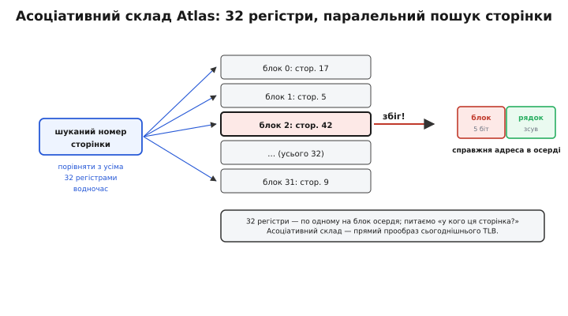

# 📜 Звідки взявся «буфер, у який зазирають убік»

Абревіатуру TLB сьогодні вимовляють, не задумуючись, — так само, як «лазер» чи «радар». Але кожна з трьох літер — це закам'янілий уламок чужої, давно забутої розмови. `T` — translation, «переклад»: зрозуміло, бо TLB кешує переклади адрес. А от `LB` — *lookaside buffer*, «буфер, у який зазирають убік», — словосполучення, якого сьогодні ніхто вже не вживає окремо. Воно вціліло **лише** всередині TLB, як комаха в бурштині. Щоб зрозуміти, чому кеш перекладів зветься саме так, доведеться повернутися в холодну манчестерську лабораторію на зламі 1950-х і 1960-х — до машини, яка вперше в світі змусила пам'ять **вдавати**, ніби її більше, ніж є насправді.

Ця історія варта того, щоб її розповісти повільно, бо в ній видно рідкісну річ: як народжується не просто пристрій, а ціле **поняття** — і як назва поняття переживає і машину, і людей, і навіть слова, з яких її склали.

## Що бентежило: пам'яті завжди або мало, або повільно

Уявіть інженера початку 1960-х. У нього є два види пам'яті, і вони — вороги. **Осердя** (англ. *core*, магнітні кільця, крізь які продіто дроти) — швидке, до нього процесор дотягується за мікросекунди, але його **мало** й воно **страшенно дороге**: кожен біт — окреме кільце, яке хтось прошив руками. І є **магнітний барабан** (*drum*) — величезний обертовий циліндр, на який влазять сотні тисяч слів, але дотягтися до потрібного слова можна, лише **дочекавшись**, поки барабан доверне його під головку. Швидка пам'ять крихітна; містка пам'ять млява. Між ними — прірва в тисячі разів.

Тодішня програма мусила жити з цією прірвою свідомо. Програміст **вручну** вирішував, який шматок даних зараз лежатиме в осерді, а який чекатиме на барабані, і **сам** писав команди, щоб у потрібну мить перекачати одне в інше. Це називалося *overlay* — «накладання»: ти ділив свою програму на клапті й сам диригував, який клапоть коли завантажити поверх іншого. Морока страшна, помилки підступні, і половина розумових сил ішла не на задачу, а на бухгалтерію пам'яті.

> 🔧 **Навіщо це.** Уся подальша історія — про те, як цю ручну бухгалтерію переклали на плечі машини. Кожен елемент майбутнього TLB (переклад адреси, асоціативний пошук, кеш недавніх відповідей) з'явився як частина одного великого задуму: **прибрати** прірву між швидкою і млявою пам'яттю з-перед очей програміста. Зрозумівши, від якого болю тікали, ви впізнаєте в TLB не абстрактну оптимізацію, а нащадка дуже конкретного страждання.

І ось у Манчестерському університеті команда під орудою **Тома Кілберна** (Tom Kilburn) — того самого, хто ще 1948-го запустив «Малюка» (*Baby*, Manchester SSEM), першу в світі машину, що виконала програму з пам'яті, — взялася за зухвалу думку: а що, коли **машина сама** робитиме те, що досі робив програміст руками? Що, коли зробити так, щоб програміст писав, ніби вся пам'ять — одна суцільна швидка стрічка від нуля й далі, а залізо потай саме перекладало ці «уявні» адреси в справжні та перекидало дані між осердям і барабаном?

## Хто і що зробив: Atlas і «однорівневий склад»

Машина називалася **Atlas**. Її будували в Манчестері разом із фірмою Ferranti; офіційно ввів її в дію **7 грудня 1962 року** сер Джон Кокрофт (John Cockcroft, Нобелівський лауреат з фізики), і на той момент Atlas вважали **найпотужнішою обчислювальною машиною світу**. (Статус доказовості: **усталено** — підтверджено музеєм історії обчислень, IEEE Milestone і спогадами самих учасників.)

Центральна ідея мала напрочуд влучну назву — **однорівневий склад** (*one-level store*). Замість двох рівнів пам'яті, між якими програміст стрибає руками, машина показувала **один** рівень: єдиний великий адресний простір, ніби вся пам'ять однакова. А під цією ілюзією залізо й операційна система (на Atlas її звали **Supervisor**) тихо жонглювали справжніми осердям і барабаном. Це і є те, що ми сьогодні звемо **віртуальною пам'яттю**, — і Atlas був першою машиною, де воно **працювало насправді**, а не лишалося кресленням.

Щоб ілюзія трималася, пам'ять поділили на однакові шматки — **сторінки** (*page*) по 512 слів (Atlas мав 48-бітові слова, тож сторінка — це 3072 байти). Це і є пряма прабатьківщина сучасної сторінкової пам'яті. Ось грубі мірки тієї машини — вони добре показують, чому прірва між рівнями була нестерпна:

```
Atlas, 1962 (округлено):
  осердя (швидке) :   16 384 слова  ≈  96 КБ   — дороге, мале
  барабан (містке):   96 000 слів   ≈ 576 КБ   — дешеве, мляве
  сторінка        :      512 слів   ≈   3 КБ
  адресний простір: до     1 000 000 слів      — «уявний», однорівневий
```

Придивіться до останнього рядка. Програма могла адресувати **мільйон** слів, хоча швидкого осердя було лише шістнадцять тисяч. Різниця в шістдесят разів — і вона схована від програміста цілком. Ось у чому фокус віртуальної пам'яті: обіцяти багато, тримати мало, а нестачу гасити перекачуванням із барабана — але так, щоб зовні це було **непомітно**.

## Серце фокуса: асоціативний склад адрес

Тепер — до того місця, заради якого вся ця історія й розповідається. Якщо адреси в програмі «уявні», то **на кожне** звернення до пам'яті хтось мусить перекласти уявний номер сторінки в справжнє місце в осерді. І цей переклад має бути **блискавичним** — інакше вся швидкодія осердя піде намарно, з'їдена перекладом.

Команда Кілберна розв'язала це так. Осердя вміщало 32 сторінки — отже, поставили **32 регістри адрес сторінок** (*page address registers*, PARs), по одному на кожен фізичний блок осердя. У кожному регістрі записано, **яка саме** уявна сторінка зараз лежить у цьому блоці. Коли процесор називає адресу, залізо бере номер шуканої сторінки й порівнює його **з усіма 32 регістрами одразу, за один такт** — не по черзі, а всіма компараторами воднораз. Це і є **асоціативний** (за вмістом, *content-addressable*) пошук: ти питаєш не «що лежить за адресою №5», а «у кого з вас лежить **оця** сторінка?» — і той, у кого вона є, відгукується сам.


*Асоціативний склад Atlas (1962): шуканий номер сторінки лягає воднораз на **всі 32 регістри**, кожен зі своїм компаратором. Той, у кого ця сторінка, відгукується збігом; його позиція дає номер блоку осердя, до якого дописують молодші «рядкові» біти зсуву — і виходить справжня адреса. Це той самий паралельний пошук за вмістом, на якому стоїть і сьогоднішній TLB.*

Зупиніться на цьому й порівняйте з тим, що всередині сучасного TLB: жменя записів, паралельне порівняння тега з усіма воднораз, миттєва відповідь «є / нема». **Це та сама схема.** Змінилися числа (32 → десятки-сотні записів), змінилася технологія (дискретні компаратори → кремній), але **ідея асоціативного складу перекладів народилася тут**, на цих тридцяти двох регістрах. TLB — прямий, впізнаваний нащадок манчестерського асоціативного складу.

А що, коли жоден із 32 не відгукнувся, — потрібної сторінки в осерді просто немає? Тоді Atlas ловив спеціальну перерву, і Supervisor **підкачував** сторінку з барабана в осердя, а щоб звільнити місце, витісняв якусь із наявних. Оце і є **промах** сторінки й підкачування — тільки на рівні всього осердя, а не крихітного кеша. Той самий поділ на «є під рукою — віддай миттєво» і «нема — піди дістань здалеку», що згодом ляже в основу і кешів, і TLB, тут уже стоїть цілком.

> 🔧 **Навіщо це.** Atlas показав річ, яку легко проспати: **асоціативний пошук — це і є те, що робить переклад дешевим**. Якби регістри доводилося перебирати по черзі, переклад був би повільним, і вся витівка з віртуальною пам'яттю не окупилася б. Саме паралельне «хто з вас — оця сторінка?» тримає переклад коротким. Тому й нинішній TLB роблять асоціативним, а не звичайною таблицею: інакше він не встигав би за процесором.

Була в Atlas і ще одна тонкість, надто вишукана, щоб її проминути. Коли Supervisor мусив когось витіснити, він намагався викинути ту сторінку, яка **найдовше не знадобиться**, — і для цього вів статистику звернень, свого роду «навчальну програму» (*learning program*), що вгадувала майбутнє за минулим. Це один із **найперших** в історії алгоритмів заміщення сторінок — прапрадід усіх сьогоднішніх «викинь найдавніше вживане». Але це вже інша гілка роду; нас тут веде **назва**.

## Звідки взялося «lookaside»: манчестерська звичка

Тепер, нарешті, до тих двох літер `LB`. Чому кеш узагалі назвали «буфером, у який зазирають убік»?

У манчестерській (а ширше — британській) інженерній традиції тих років **кеш** — будь-яку швидку пам'ять, що тримає під рукою копії з повільної, — звали **lookaside buffer**. Образ прямий і дуже фізичний. Перед тобою — довга дорога в повільну пам'ять. Але перш ніж рушати нею, ти кидаєш **швидкий погляд убік** (*look aside*) — у маленький буфер поряд: а раптом потрібне вже там, і тягтися далеко не доведеться? Оте «зиркнути вбік перед довгою дорогою» і є весь сенс слова. Кеш — це буфер, у який **зазирають убік**, щоб, як пощастить, не йти в далеку путь.

А тепер складіть два слова. Якщо кеш узагалі — це «lookaside buffer», то кеш **саме перекладів адрес** — це, природно, **translation lookaside buffer**: «буфер, у який зазирають убік, — для перекладу». Назва зібралася сама, майже механічно, зі звичного тоді слова «кеш» плюс уточнення «чого саме кеш». Ніхто не сідав вигадувати гучну абревіатуру — вона виросла з буденної лексики лабораторії.

Ось чому важливо **розрізняти три різні речі**, які легко злити в одну:

```
ІДЕЯ         : кешувати недавні переклади адрес у швидкій пам'яті
               → Atlas, асоціативний склад із 32 регістрів (робочий з 1962)

НАЗВА «LB»   : називати кеш «lookaside buffer» — «зиркнути вбік»
               → манчестерська/британська звичка тих років

НАЗВА «TLB»  : «translation lookaside buffer» — кеш саме перекладів
               → закріпилася пізніше, коли віртуальна пам'ять пішла у широкий вжиток
```

Плутати ці три рівні — типова помилка переказів. «Хто винайшов TLB» і «звідки взялася назва TLB» — **різні** питання з різними відповідями. Ідея асоціативного кеша перекладів — манчестерська, з Atlas. Назва зібралася зі старого слова «кеш» = «lookaside buffer». А сама трилітерна абревіатура розійшлася світом уже з іншою машиною.

## Коли «TLB» стало загальним словом: IBM System/370

Ідея Atlas не лишилася в Манчестері — вона розповзлася по всій індустрії, бо надто вже добре розв'язувала загальний біль. Але **саме слово** «TLB» увійшло в широкий обіг тоді, коли віртуальну пам'ять узяла на озброєння наймасовіша лінія машин свого часу — **IBM System/370**.

2 серпня 1972 року IBM оголосила моделі System/370 (зокрема 158 і 168) з апаратним **динамічним перекладом адрес** (*dynamic address translation*, DAT) — тобто з віртуальною пам'яттю. А щоб цей переклад не гальмував кожне звернення, у машину поставили невеликий асоціативний кеш недавніх перекладів — саме той вузол, який в описах архітектури System/370 називають **translation lookaside buffer**. Через масовість і докладну документацію IBM термін «TLB» із цих описів і розійшовся як загальноприйнятий. (У самій фаховій пресі формулювання остаточно закріпив огляд архітектури System/370 — Кейс і Падеґс (R. P. Case, A. Padegs), *Communications of the ACM*, січень 1978.)

> 🔧 **Навіщо це.** Ось чому в підручниках трапляється розбіжність: одні кажуть «TLB — з Atlas», інші — «з IBM/370». Обидва мають рацію, але про **різне**. Atlas дав **річ** (асоціативний кеш перекладів) і **половину назви** (lookaside buffer = кеш). IBM/370 зробила абревіатуру «TLB» **загальновживаною**. Тримаючи в голові цей поділ — ідея / назва / поширення, — ви не заплутаєтесь у суперечливих на позір твердженнях.

Варто чесно згадати й **паралельну гілку**, щоб не приписати Манчестеру зайвого. У середині 1960-х машина **GE 645**, на якій зростала система **Multics**, теж мала невеликий асоціативний склад недавніх перекладів (16 записів) — з окремим корінням (патент Кулера і Ґлейзера, John Couleur та Edward Glaser). Тобто думка «тримати недавні переклади в маленькій швидкій асоціативній пам'яті» визрівала **не в одному місці**: Atlas зробив її робочою першим і в контексті сторінкової віртуальної пам'яті, а інші приходили до спорідненого рішення своїми стежками. Винаходи такого штибу — **колективні**; чесно казати «перша практична реалізація — Atlas», а не «одна людина винайшла TLB». (Статус доказовості: **усталено** щодо Atlas як першої робочої сторінкової віртуальної пам'яті з асоціативним перекладом; **усталено** щодо походження назви від манчестерського «lookaside buffer»; поширення трилітерної абревіатури через System/370 — теж загальновизнане.)

## Що з цього лишилося в кремнії під вашими пальцями

Відступіть на крок і погляньте, що дійшло до нас крізь шістдесят років.

Тридцять два дискретні регістри осердя перетворилися на десятки-сотні комірок у кутку процесорного кристала. Магнітний барабан став SSD чи файлом підкачки. Слово «lookaside buffer» щезло з живої мови — його вже не почуєш окремо. А проте **все головне лишилося на місці**: адреси в програмі й досі «уявні»; переклад і досі йде через маленьку асоціативну пам'ять, яку питають «хто з вас — оця сторінка?» усіма компараторами воднораз; влучання й досі віддає відповідь миттю, а промах і досі веде довгою дорогою по таблиці й лишає результат про запас. Схема, яку Кілберн із колегами склали на осерді й барабані, працює в кожному вашому дотику до пам'яті.

І назва — та сама скам'яніла розмова. Коли наступного разу мовитимете «TLB», згадайте: `LB` — це манчестерський інженер, що перед довгою дорогою в повільну пам'ять кидає **швидкий погляд убік**, у буфер поряд, — чи не лежить потрібне вже там. Ціла філософія кешування, стиснута в дві літери, які пережили і машину, і слова, з яких їх склали.

---

**Коротко.** Atlas (Манчестер, робочий із 7 грудня 1962; команда Тома Кілберна) — перша **практична** віртуальна пам'ять зі сторінковою організацією («однорівневий склад»): програма адресувала до мільйона слів, маючи лише ~16 тис. слів швидкого осердя, а нестачу гасило підкачування з барабана. Переклад «уявної» адреси в справжню вели **32 регістри адрес сторінок** — асоціативний склад, який порівнював шукану сторінку з усіма записами воднораз; це прямий прообраз сучасного TLB. Назва зібралася з двох частин: у Манчестері кеш узагалі звали **lookaside buffer** («зиркнути вбік перед довгою дорогою»), тож кеш саме перекладів природно став **translation lookaside buffer**. Трилітерна абревіатура «TLB» розійшлася світом уже з віртуальною пам'яттю IBM System/370 (DAT, оголошено 2 серпня 1972; формулювання закріпив огляд Кейса і Падеґса, CACM, січень 1978). Розрізняйте три рівні: **ідея** (кеш перекладів — Atlas), **назва «LB»** (манчестерське слово для кеша), **поширення «TLB»** (через System/370). Винахід колективний: паралельно споріднене асоціативне рішення мала й GE 645 / Multics — тож чесно казати «перша робоча реалізація — Atlas», а не «TLB винайшла одна людина».
