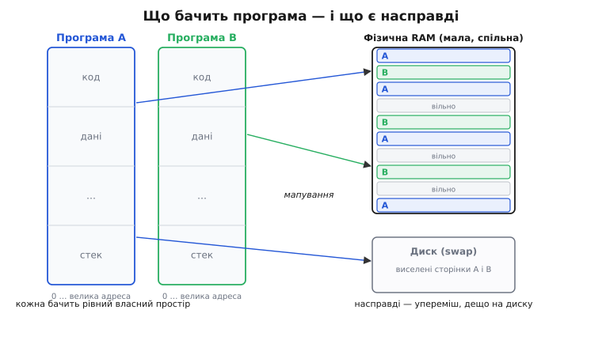
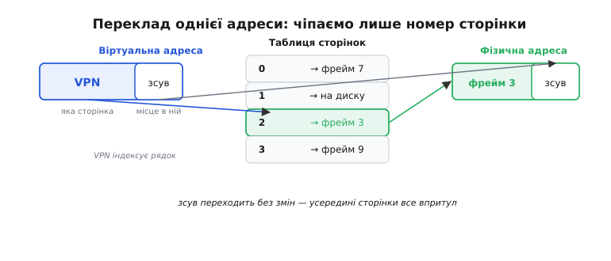
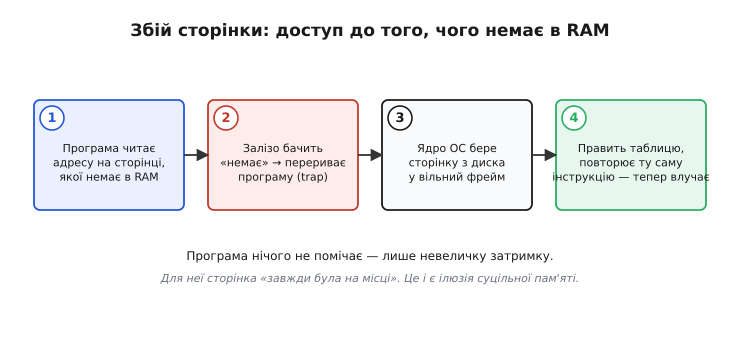

# Віртуальна пам'ять

Відкрийте на комп'ютері десяток вкладок браузера, редактор коду й музику — і кожна з цих програм переконана, що вся пам'ять машини належить лише їй. Кожна працює з адресами від нуля й далі, кожна впевнена, що між її змінними ніхто не втручається, кожна поводиться так, ніби пам'яті в неї стільки, скільки треба, — навіть коли фізичної планки в машині менше, ніж просять усі разом. Це не збіг і не везіння. Це ретельно збудована **ілюзія**, і зветься вона віртуальною пам'яттю (лат. *virtualis* — «уявний, той, що діє як справжній»). Розберімо, навіщо цю ілюзію взагалі створили, як залізо й операційна система тримають її щомиті — і чому без неї сучасний комп'ютер був би крихким, небезпечним і тісним.

### Навіщо взагалі щось приховувати

Уявіть машину без жодного шару між програмою й пам'яттю: адреса, яку називає програма, — це прямо номер комірки у мікросхемі RAM. Спершу здається, що це найпростіше й найчесніше. Але спробуйте запустити на такій машині дві програми водночас — і чесність обертається катастрофою.

Компілятор, що складав першу програму, поклав її змінну за адресою 0x2000. Компілятор другої програми нічого про це не знав і теж уподобав 0x2000 — адже це просто зручне кругле число. Тепер обидві програми пишуть у ту саму комірку. Одна псує дані іншій, і жодна навіть не здогадується чому. Щоб цього уникнути без шару-посередника, довелося б **наперед** розкидати всі програми світу по різних, наперед узгоджених адресах — а це неможливо, бо програми пишуть різні люди в різний час.

Друга біда — захист. Якщо будь-яка адреса веде прямо в фізичну пам'ять, то програма з помилкою (чи зі злим наміром) може прочитати або переписати пам'ять сусіда, а то й самого ядра. Один зіпсований покажчик валить усю машину.

Третя — розмір. Програма може хотіти масив на 4 ГБ, а планки в машині — 2 ГБ. У прямій моделі це просто неможливо: немає комірки — немає адреси.

Усі три біди мають один спільний корінь: програма звертається до фізичної пам'яті **напряму**. Приберемо цю прямоту — і всі три зникають разом. Саме це й робить віртуальна пам'ять: вставляє між адресою, яку називає програма, і справжньою коміркою в мікросхемі **шар перекладу**.

### Дві адреси замість однієї

Ключова ідея — розрізнити два сорти адрес. **Віртуальна адреса** (*virtual address*) — це те, що бачить і називає програма; для неї це «адреса» в чистому вигляді, від нуля й далі, суцільна й лише її власна. **Фізична адреса** (*physical address*) — це справжній номер комірки в мікросхемі RAM. Між ними стоїть перекладач, і програма про нього навіть не знає.

> 🔧 **Навіщо це.** Саме цей розрив дає всі три вигоди одразу. Дві програми можуть спокійно називати ту саму віртуальну адресу 0x2000 — перекладач відправить їх у **різні** фізичні комірки, і вони ніколи не зіштовхнуться. Ядро може заборонити перекладати певні адреси для певної програми — і та фізично не дотягнеться до чужого. А віртуальний простір може бути **більший** за фізичну RAM, бо це лише набір адрес, а не самі мікросхеми.

Перекладати кожну окрему адресу-байт було б безглуздо: таблиця «кожна віртуальна адреса → фізична» була б завбільшки з саму пам'ять. Тому пам'ять ділять на однакові шматки — **сторінки** (*page*, зазвичай 4 КБ), — і перекладають не байти, а сторінки цілком. Фізичну пам'ять так само ділять на шматки того самого розміру — **кадри**, або **фрейми** (*frame*). Правило перекладу просте: віртуальна сторінка номер такий-то лежить зараз у фізичному фреймі номер такий-то. А де саме **всередині** сторінки — те саме і там, і там, бо всередині сторінки все лежить упритул.


*Ілюзія й реальність. Кожна програма бачить суцільний власний простір (ліворуч). Насправді її сторінки розкидані по спільній фізичній RAM упереміш із чужими, а частина взагалі виселена на диск. Шар перекладу з'єднує одне з одним так, що жодна програма нічого не помічає.*

Через це ділення віртуальна адреса природно розпадається на дві частини. Старші біти — **номер сторінки** (*virtual page number*, VPN): він каже, **яка** сторінка. Молодші біти — **зсув** (*offset*) усередині сторінки: він каже, **яке місце** в ній. Переклад чіпає лише номер сторінки; зсув переходить у фізичну адресу без жодної зміни.

Порахуймо на звичному прикладі — 32-бітна адреса й сторінки по 4 КБ. Це усталена конфігурація класичних 32-бітних систем:

```
розмір сторінки = 4 КБ = 4096 байтів = 2¹² байтів
        →  зсув займає  12 молодших бітів (0 … 4095)
адреса = 32 біти  →  на номер сторінки лишається 32 − 12 = 20 бітів
        →  усього 2²⁰ = 1 048 576 віртуальних сторінок
```

Двадцять бітів на номер, дванадцять на зсув — і вся арифметика перекладу зводиться до заміни старших двадцяти бітів на номер потрібного фрейму.

### Хто виконує переклад

Складати нову адресу з двох частин на кожне звернення до пам'яті — тисячі разів за мілісекунду — надто дорого, щоб робити це кодом. Тому переклад вбудований у залізо: цим займається окремий вузол процесора — **пристрій керування пам'яттю** (*memory management unit*, MMU). Він стоїть просто на дорозі кожного звернення: програма подає віртуальну адресу, MMU миттю обертає її на фізичну, і вже фізична йде на шину до мікросхеми.

Аби знати, яка сторінка в якому фреймі, MMU звіряється з **таблицею сторінок** (*page table*) — довідником, який на кожну віртуальну сторінку тримає рядок: у якому фізичному фреймі вона зараз, чи взагалі присутня в RAM, і що з нею **дозволено** (читати, писати, виконувати як код). Ця таблиця для кожної програми **своя** — тому та сама віртуальна адреса в різних програм веде в різні фрейми. Перемикаючись із програми на програму, ядро просто підсовує MMU іншу таблицю.


*Механіка одного перекладу. Номер сторінки (VPN) індексує рядок таблиці й дає номер фрейму; зсув усередині сторінки переходить у фізичну адресу незмінним. Уся суть — «номер сторінки → номер фрейму», а місце всередині лишається тим самим.*

Тут ховається пастка, яку легко проґавити: сама таблиця сторінок велика (вона описує **весь** простір) і лежить у тій самій повільній RAM. Виходить, щоб перекласти одну адресу, треба спершу піти в пам'ять по рядок таблиці, і аж потім — по саме число: одне звернення роздвоюється. Обхід цієї пастки — окремий крихітний надшвидкий кеш перекладів у самому MMU. Це [TLB — кеш адресного перекладу](book:programming/tlb): він тримає під рукою кілька останніх пар «сторінка → фрейм» і завдяки локальності віддає фізичну адресу за один такт, майже ніколи не турбуючи таблицю. Без нього віртуальна пам'ять коштувала б подвоєння часу на кожному доступі.

### Коли сторінки немає в пам'яті

Найкрасивіше в цій системі — те, що рядок таблиці може чесно сказати: **цієї сторінки в RAM зараз немає**. Може, її ще жодного разу не чіпали. Може, її давно виселили на диск, бо RAM бракувало. У рядку тоді стоїть прапорець «відсутня» (*present* = 0) замість номера фрейму.

Що станеться, коли програма звернеться до такої сторінки? MMU бачить прапорець «відсутня» й не може завершити переклад. Замість того щоб віддати сміття, він **перериває** виконання програми особливим сигналом — це **збій сторінки** (*page fault*, «промах сторінки»). Керування миттю переходить до ядра ОС. Ядро дивиться, чого програма хотіла: якщо адреса законна, воно знаходить вільний фрейм, підвантажує туди потрібну сторінку (з диска чи просто обнуляє новеньку), вписує номер фрейму в таблицю — і **повторює ту саму інструкцію**, яка спіткнулася. Тепер переклад удається, і програма читає своє число так, наче нічого й не було.


*Збій сторінки крок за кроком. Програма нічого не помічає, крім невеличкої затримки, — для неї сторінка «завжди була на місці». Саме ця машинерія й дозволяє віртуальному простору бути більшим за фізичну RAM: рідковживані сторінки просто лежать на диску, поки їх не попросять.*

Ось звідки береться дозвіл програмі просити більше пам'яті, ніж є фізично. У RAM тримають лише те, що активно чіпають просто зараз, — **робочий набір** (*working set*); решта чекає на диску. Це працює тому, що програми не скачуть навмання по всій пам'яті, а товчуться на невеликому наборі сторінок — той самий код у циклі, той самий масив. Цю закономірність — **локальність** — і межу, за якою підкачка ламається, строго дослідили ще в перші десятиліття віртуальної пам'яті; про те, як ідея народилася на манчестерському «Атласі» й як Пітер Деннінг пояснив зрив у пробуксовування, — в [історії поняття](book:programming/virtual-memory/hist-atlas.md). Якщо активних сторінок більше, ніж фреймів, машина починає **пробуксовувати** (*thrashing*): щойно підвантажену сторінку доводиться зразу виселяти, щоб звільнити місце наступній, і процесор витрачає весь час на перекачування сторінок туди-сюди замість корисної роботи.

### Захист і спільна пам'ять — майже задарма

Та сама таблиця, що дає переклад, дає й **захист** — і це виходить майже безплатно, бо MMU однаково зазирає в рядок на кожному зверненні. У кожному рядку є біти дозволів: цю сторінку можна лише читати; ту — читати й писати; ту — виконувати як код, але не писати в неї. Спробує програма записати в сторінку, позначену «лише читання», — MMU це побачить і згенерує збій захисту, а ядро зупинить порушника, не давши зіпсувати нічого чужого.

> 🔧 **Навіщо це.** Той самий механізм ловить найпоширенішу помилку C — розіменування нульового покажчика. Ядро навмисне лишає сторінку за адресою 0 **непереведеною** (жодного фрейму, жодних прав). Тому `int *p = NULL; *p = 5;` не тихо псує комірку 0, а негайно спричиняє збій — програма падає одразу й голосно (`Segmentation fault`) замість того, щоб зіпсувати щось і впасти пізніше в незрозумілому місці. Апаратна пастка обертає підступну помилку на очевидну.

Спробуймо на коді. Ця програма навмисне пише туди, куди їй не дозволено:

```c
#include <stdio.h>

int main(void) {
    int *p = NULL;      // віртуальна адреса 0 — навмисне не переведена
    printf("зараз буде збій...\n");
    *p = 42;            // MMU: немає фрейму за адресою 0 → збій
    printf("цей рядок не виконається\n");
    return 0;
}
```

Другий `printf` не спрацює ніколи: на записі `*p = 42` MMU не знаходить перекладу для сторінки нуль, кидає збій, і ОС знімає програму. Без віртуальної пам'яті цей запис міг би тихо зіпсувати щось важливе, і збій виліз би десь зовсім інде через годину роботи.

І навпаки — якщо ядро **навмисне** вкаже в таблицях двох програм на **той самий** фрейм, обидві бачитимуть ту саму фізичну пам'ять під своїми (можливо, різними) віртуальними адресами. Це і є **спільна пам'ять**: найшвидший спосіб для програм обмінюватися даними — просто писати в спільний фрейм, без жодного копіювання. Той самий прийом дає економію на бібліотеках: код однієї бібліотеки лежить у пам'яті **один раз**, а всі програми відображають його до себе як «лише читання».

### Де віртуальної пам'яті немає — і чому

Уся ця розкіш має ціну: MMU — це додатковий кремній, таблиці займають пам'ять, а перший доступ до сторінки коштує збою. Для настільного комп'ютера чи телефона ця ціна нікчемна проти вигод. Але в дрібному **мікроконтролері** — тому, що керує пральною машиною чи дроном, — картина інша.

Малі мікроконтролери (як-от ядра ARM Cortex-M) MMU **не мають зовсім**: усі адреси там **фізичні**, програма звертається до RAM і периферії напряму. Причин кілька, і всі логічні. Такий чип виконує одну прошивку, а не десяток чужих програм, — конфлікт адрес просто не виникає. Йому потрібен **передбачуваний** час відгуку на подію (реальний час), а збій сторінки — це непрогнозована затримка, неприпустима, коли треба відреагувати за мікросекунди. І пам'яті в нього стільки, що вигадувати «більше, ніж є» немає сенсу.

Замість повноцінного перекладу такі чипи часто мають скромнішого родича MMU — **пристрій захисту пам'яті** ([MPU, memory protection unit](book:programming/stack-overflow/comp-mpu.md)). Він адрес **не перекладає**, але вміє друге вміння MMU — **стерегти** межі: розбити пам'ять на кілька ділянок і сказати, що в цю область коду писати не можна, а цю задачу не пускати в чужий стек. Виходить головна користь захисту без ціни перекладу — саме те, що треба вбудованій системі. Це чітко показує, що віртуальна пам'ять — насправді дві окремі здатності: **переклад** адрес і **захист** доступу. Великі процесори беруть обидві; малі часто беруть лише другу.

Тож віртуальна пам'ять — це не спосіб «мати багато пам'яті», як інколи думають. Це спосіб дати кожній програмі чистий, безпечний, власний світ адрес, за яким ховається спільне, тісне й розкидане фізичне залізо. Переклад робить цей світ **своїм**, захист робить його **безпечним**, а збої сторінок роблять його **на вигляд безмежним** — і все це так тихо, що програма проживає все життя, ні разу не здогадавшись, що жодна її адреса ніколи не була справжньою.
