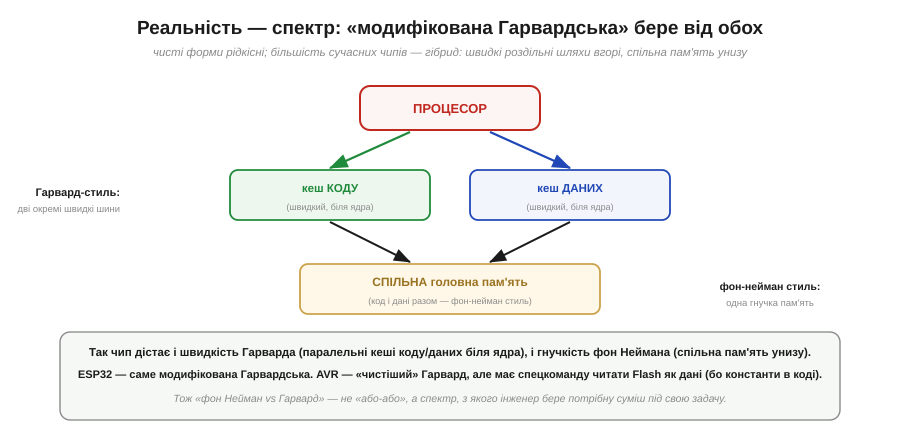

# Фон Нейман vs Гарвард

Класичний процесор тримає «вузьке місце фон Неймана»: код і дані живуть в **одній** пам'яті й ходять до процесора **однією** шиною, тож суперничають за неї. Поставмо пряме питання: а що, як дати коду й даним **окремі** пам'яті й окремі шини? Тоді процесор міг би брати команду й дані **водночас**, без суперництва. Це і є **Гарвардська** архітектура — альтернатива фон-нейманівській, — і вибір між ними є фундаментальною розвилкою в будові будь-якого процесора. Тут — про дві архітектури, про те, що кожна виграє й програє, де яку вживають (і чому Arduino — Гарвардська), і чому насправді більшість сучасних чипів — десь **посередині**.

### Дві архітектури поряд

Уся різниця між ними зводиться до однієї речі — скільки «доріг» між процесором і пам'яттю.

*Рис. **Фон Нейман**: одна пам'ять тримає код і дані разом, і до процесора веде **одна** спільна шина — просто й гнучко, та шина одна на все (вузьке місце). **Гарвард**: **окремі** пам'яті для коду й для даних, кожна зі своєю шиною, тож процесор має дві незалежні дороги. Назва — від машини Harvard Mark I (1944), що тримала програму й дані нарізно.*

Ось і весь поділ: **одна** дорога чи **дві**. Фон-нейманівська машина елегантно проста — все в одній пам'яті. Гарвардська ставить дві окремі пам'яті з двома шинами. Здавалося б, дрібниця в кількості дротів — та наслідки великі, бо саме ця кількість доріг визначає, чи можуть код і дані рухатися **одночасно**.

### Що дають дві шини

Подивімося, що конкретно купує друга шина.

*Рис. У **фон Неймана** одна шина, тож вибірка команди й читання даних **конфліктують**: спершу один доступ, потім другий — дані чекають на команду (це і є вузьке місце). У **Гарварда** дві шини, тож вибірку команди й читання даних роблять **за один такт паралельно** — ніхто нікого не чекає. Особливо це цінне для [конвеєра](book:programming/pipeline): вибірка наступної команди не стикається з доступом до даних поточної.*

Ось у чому виграш Гарварда. У [конвеєрі](book:programming/pipeline) одна команда **виконується** (читає/пише дані), поки наступну **вибирають** з пам'яті. На фон-нейманівській машині ці два звертання до пам'яті б'ються за єдину шину — і конвеєр спотикається. На Гарвардській вони йдуть по різних шинах паралельно — конвеєр тече гладко. Та сама перевага безцінна для **обробки сигналів** (DSP), де щотакту треба тягти і дані, і коефіцієнти фільтра одночасно — два потоки, дві шини. Розділивши дороги, Гарвард прибирає саму причину затору.

### Компроміс: гнучкість проти швидкості

Якщо Гарвард швидший, чому не всі машини такі? Бо за швидкість він платить **гнучкістю**.

*Рис. Порівняння. Фон Нейман: одна шина (вузьке місце), зате код і дані **вільно ділять** спільний простір пам'яті, легко «завантажити будь-яку програму як дані», і вся конструкція **простіша**. Гарвард: дві шини (паралельний, швидший доступ), зате **роздільні** простори (жорсткіше — розміри коду й даних фіксовані окремо), і «код як дані» дається важко (треба спецзасоби), а всього вдвічі більше (складніше).*

Це класичний інженерний обмін, без «переможця». Фон-нейманівська **гнучкість** — пряме породження ідеї збереженої програми: якщо код і дані — в одній пам'яті, машина може завантажити нову програму просто **як дані** в ту саму пам'ять і запустити її. Це те, що робить ваш ПК таким універсальним — він щодня вантажить і запускає тисячі різних програм. Гарвардська машина з її роздільними просторами це робить **важко**: пам'ять коду — то пам'ять коду, і запхати туди свіжозавантажену програму непросто. Тож фон Нейман міняє швидкість на простоту й гнучкість, а Гарвард — навпаки.

### Де яку вживають

З цього компромісу прямо випливає, хто яку обирає.

*Рис. **Фон Нейман** — у ПК, ноутбуках, серверах, телефонах: там треба запускати **будь-які** програми, завантажені на льоту, тож гнучкість єдиної пам'яті важливіша за останній відсоток швидкодії. **Гарвард** — у мікроконтролерах і DSP: там цінніші **швидкість і передбачуваність**. Зокрема, 8-бітний **AVR** в Arduino Uno — Гарвардська машина: програма лежить у Flash-пам'яті, дані — в SRAM, **окремо**, з окремими шинами.*

Звідси й відповідь: **AVR в Arduino — Гарвардська** машина. Чому саме так: мікроконтролеру важлива швидка, передбачувана робота в реальному часі (керувати мотором, читати давач точно вчасно), а не здатність вантажити довільні програми — він зазвичай виконує **одну** прошиту програму. Тож роздільні код і дані йому пасують. А ваш ПК — фон-нейманівський, бо його суть — запускати що завгодно. (Те, що програма МК лежить саме у **Flash**, а дані — в **SRAM**, — це питання [типів пам'яті](book:programming/flash-vs-ram); тут важливо лише, що вони **окремі**.) Різні цілі — різний вибір архітектури.

### Реальність: модифікована Гарвардська

Та не варто думати, що світ чітко поділений на дві архітектури. Насправді це **спектр**, і більшість сучасних чипів живуть посередині.

*Рис. Чисті форми рідкісні; типовий сучасний чип — **модифікована Гарвардська**: близько до ядра — **окремі** швидкі шляхи для коду й даних (Гарвард-стиль, паралельний доступ), а під ними — **спільна** головна пам'ять (фон-нейман-стиль, гнучкість). Так чип дістає і швидкість Гарварда, і гнучкість фон Неймана. ESP32 — саме модифікована Гарвардська; AVR — «чистіший» Гарвард, але має спецкоманду читати Flash як дані (бо константи програми лежать поруч із кодом).*

Це мудрий компроміс, що бере найкраще від обох. Там, де швидкість критична (близько до ядра), роблять роздільні шляхи для коду й даних — паралельний доступ; а глибше, де важить гнучкість і простота, лишають спільну пам'ять. ESP32 — саме такий гібрид. Навіть «чисто Гарвардський» AVR має шпарину: спеціальну команду читати пам'ять програм як дані (бо ж сталі константи зручно тримати поруч із кодом). Тож «фон Нейман проти Гарварда» — не жорстке «або-або», а **палітра**, з якої інженер змішує потрібну пропорцію під свою задачу. Розуміти крайні точки цієї палітри важливо — але реальні чипи майже завжди десь між ними.

> 🔧 **Навіщо це.** Ця відмінність впливає на цілком практичні речі в роботі з мікроконтролером. Перше: **AVR (Arduino) і багато МК — Гарвардські**, тож пам'ять програм і пам'ять даних у них **роздільні** й адресуються окремо; саме тому, наприклад, на AVR великі сталі рядки чи таблиці спеціально кладуть у Flash (програмну пам'ять), щоб не з'їдати дефіцитну SRAM, — і для доступу до них потрібні особливі засоби. Друге: розуміння, що код і дані можуть бути в **окремих** просторах, пояснює поведінку компілятора й карти пам'яті, яку видно на будь-якому МК. Третє: коли йдеться про швидкодію МК у реальному часі (керування, обробка сигналів), Гарвардський паралельний доступ — одна з причин, чому навіть скромний МК встигає робити багато за такт. Четверте, концептуально: пам'ятайте, що це **спектр**, а не двійковий вибір; реальні чипи (як ESP32) — гібриди. Знаючи, де на цій палітрі ваш процесор, ви краще розумітимете і його сильні сторони, і його обмеження.
