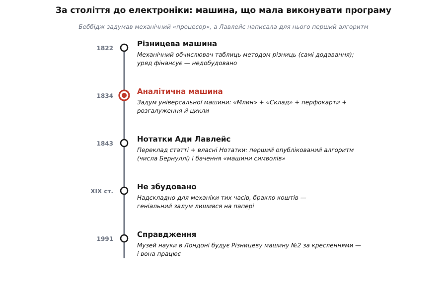
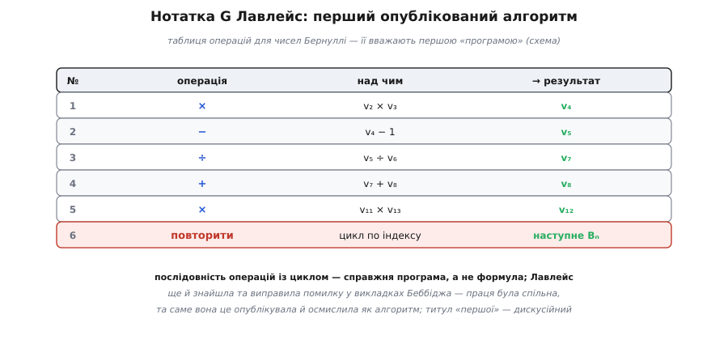
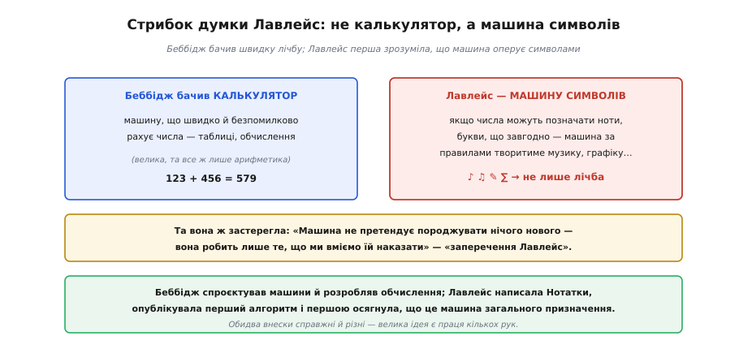

# 📜 Беббідж і Ада Лавлейс: перший задуманий комп'ютер і перша програма

Процесор — це **машина, що виконує список інструкцій**. І ось вражаюче: цю саму ідею втілив у кресленнях англієць **Чарльз Беббідж** ще в 1830-х роках, за **сто років** до електроніки, повністю **механічно** — на валах, шестернях і перфокартах. Його «Аналітична машина» мала окремий обчислювальний пристрій («Млин») і окрему пам'ять («Склад»), читала програму з карток і вміла розгалуження й цикли — тобто була [процесором](book:programming/what-is-processor) у всьому, крім назви. А молода математикиня **Ада Лавлейс** написала для цієї ще не збудованої машини перший у світі **алгоритм** — і першою побачила, що така машина здатна на куди більше, ніж лічба. Це історія про задум, що випередив свій час на століття, і про двох людей, чиї ролі досі плутають і недооцінюють.

Уявіть світ без калькуляторів, де кожне число для навігації, астрономії, інженерії рахують **вручну**, а тоді переписують у грубезні таблиці. Помилки неминучі — від утоми, недогляду, друкарської похибки, — і ці помилки топлять кораблі й валять мости. Саме така досада штовхнула Беббіджа до думки, що змінила все: а що, як доручити лічбу **машині**, яка ніколи не втомлюється й не помиляється? Пройдімо шлях від цієї досади до машини, яка вміла **виконувати програму**, — і до жінки, яка цю програму написала.

*Ланцюг подій: від Різницевої машини (1822, лічба таблиць) через візіонерську Аналітичну машину (1834, червоний вузол — універсальний механічний «процесор») до Нотаток Лавлейс (1843, перший алгоритм). Машину так і не збудували за життя Беббіджа — та 1991 року Музей науки в Лондоні зібрав за його кресленнями обчислювальну частину Різницевої машини №2, і вона **запрацювала**, довівши: задум був правильний, лишень випередив можливості епохи.*

---

## Беббідж і війна з помилками в таблицях

**Чарльз Беббідж** (*Charles Babbage*, 1791–1871) — англійський математик, винахідник і, як сказали б нині, інженер. Замолоду його дратувало те, що сьогодні здається дрібницею: математичні **таблиці** (логарифмів, тригонометрії, навігаційні) рясніли **помилками**. Кожне число в них колись порахувала людина-«обчислювач» (*computer* — так тоді звали саме людину, а не машину!), і людська втома лишала в таблицях хиби, що дорого коштували мореплавцям та інженерам. Легенда переказує, що якось, переглядаючи таблиці, повні похибок, Беббідж вигукнув: «Краще б це порахувала парова машина!»

Так народилася **Різницева машина** (*Difference Engine*) — його перший проєкт, розпочатий близько 1822 року. Вона мала рахувати значення многочленів **методом скінченних різниць** — хитрістю, що зводить обчислення складних функцій до самих **додавань** (а додавання механізувати найлегше). Британський уряд щедро фінансував проєкт — і зрештою це обернулося розчаруванням: машина виявилася на межі можливостей тодішньої точної механіки, Беббідж сварився з майстром, без кінця її вдосконалював — і так і **не добудував**. Та сама ідея була цілком слушна, що довів через півтора століття Музей науки: за збереженими кресленнями там зібрали Різницеву машину №2 — п'ять тонн, вісім тисяч деталей — і вона **бездоганно рахує**. Біда Беббіджа була не в задумі, а в епосі.

Але справжній стрибок генія стався, коли Беббідж покинув Різницеву машину заради чогось **незрівнянно** сміливішого.

---

## Аналітична машина: процесор за сто років до процесорів

Близько 1834 року Беббідж задумав **Аналітичну машину** (*Analytical Engine*) — і це вже був не вузький лічильник таблиць, а **універсальна** обчислювальна машина, здатна виконати **будь-яку** послідовність операцій, яку їй задаси. Вдумайтеся: за сто років до перших електронних комп'ютерів англієць спроєктував механічний апарат із тією самою логічною будовою, що ми вивчаємо в цьому розділі.

*Будова Аналітичної машини напрочуд сучасна. **«Склад»** (*Store*) — це **пам'ять**: близько тисячі чисел по п'ятдесят десяткових цифр кожне. **«Млин»** (*Mill*) — **обчислювальний пристрій**, де над числами виконуються +, −, ×, ÷ (як [суматор](book:electronics/combinational-circuits), тільки на шестернях). Числа курсують між Складом і Млином, як між пам'яттю й процесором. А **програма** подається на **перфокартах**. Зверніть увагу: програма лежить на картках **окремо** від чисел у Складі — тож це радше [Гарвардська ідея](root:embedded/von-neumann-harvard), а не фон-нейманівська збережена програма.*

Придивіться до цих назв, бо вони — прямі предки понять про те, [що таке процесор](book:programming/what-is-processor), і з історії про фон Неймана. **«Млин»** — це процесор (місце, де «мелеться» обчислення); **«Склад»** — це пам'ять (де **складаються** числа). Беббідж **розділив** обчислення й зберігання — те саме фундаментальне розщеплення, на якому стоїть кожна сучасна машина. Ба більше: Аналітична машина вміла **розгалуження** (робити те чи інше залежно від результату порівняння) і **цикли** (повторювати низку операцій) — рівно ті можливості, що дає машині список інструкцій. Машина навіть мала **друкований** вивід, щоб людська рука не вносила нових помилок під час переписування.

> 🔧 **Навіщо це.** Аналітична машина — це доказ, що **архітектура** комп'ютера не залежить від того, з чого його зроблено. Беббідж будував з латуні й шестерень, ваш ESP32 — з мільярдів транзисторів, але **логічна** будова та сама: окремий «млин»-процесор, окремий «склад»-пам'ять, програма як послідовність наказів, розгалуження й цикли. Усі [складові процесора](book:programming/processor-parts) — АЛП, регістри, шину — вже було задумано на валах і коліщатах 1834 року. Сама **ідея** машини, що виконує програму, старша за будь-яку технологію, якою її втілюють, — і саме тому вона пережила лампи, транзистори й переживе те, що прийде далі.

Чому ж її не збудували? Бо вона була **надто** складна для механіки XIX століття: на тисячі точних деталей, що мали працювати злагоджено, забракло б і грошей, і терпіння. Аналітична машина так і лишилася найграндіознішим **задумом** в історії обчислень, що не став залізом. Але задум був повний і докладний — настільки, що для нього вже можна було **писати програми**. І знайшлася людина, яка це зробила.

---

## Перфокартки з ткацького верстата

Спершу — звідки Беббідж узяв спосіб **задавати** машині програму. Ідея прийшла з геть іншого ремесла — **ткацтва**.

*Француз **Жозеф Марі Жаккар** близько 1804 року створив ткацький верстат, у якому візерунок тканини задавали **перфокарти** — картонки з дірочками: де дірка, там нитка піднімається. Зміни колоду карток — зміниш візерунок. Беббідж узяв цю саму ідею: колода перфокарт стала **програмою** для Аналітичної машини — послідовністю наказів, які вона виконує одну за одною. Це точнісінько [ідея процесора](book:programming/what-is-processor): програма — це впорядкований список інструкцій.*

Лавлейс уловила красу цієї паралелі краще за всіх і висловила її в одному з найзнаменитіших речень в історії техніки: «Аналітична машина **тче алгебраїчні візерунки** так само, як верстат Жаккара тче квіти й листя». Це не просто красива фраза — це глибоке прозріння: машина **обробляє символи за правилами**, як верстат обробляє нитки за візерунком. А колода карток — це і є **програма**: матеріальна, відчутна послідовність інструкцій. (До речі, перфокарти виявилися навдивовижу живучі: ними програмували електронні комп'ютери ще в 1960–70-х, через півтораста років після Жаккара.)

---

## Ада Лавлейс і перша програма

**Ада Лавлейс** (*Ada Lovelace*, 1815–1852) — повне ім'я Августа Ада Кінг, графиня Лавлейс — була донькою поета **лорда Байрона**, та батька майже не знала: мати, Аннабелла Мілбанк, навмисне скерувала доньку в **математику** й науку, побоюючись «небезпечної» поетичної натури Байрона. Так Ада здобула рідкісну для жінки тих часів математичну освіту (її наставниками були Мері Сомервіль і логік Огастес де Морган) — і поєднала в собі математичну строгість із поетичною уявою, що й виявилося безцінним. 1833 року вона познайомилася з Беббіджем і захопилася його машинами.

1842 року італійський інженер **Луїджі Менабреа** опублікував французькою статтю про Аналітичну машину (за лекціями Беббіджа в Турині). Лавлейс узялася **перекласти** її англійською — і за порадою Беббіджа додала до перекладу власні **Нотатки** (позначені літерами A–G). Ці Нотатки виявилися втричі **довшими** за саму статтю й куди значущішими. А в останній, **Нотатці G**, була перлина.

*У Нотатці G розписано **повну послідовність операцій**, якою Аналітична машина обчислила б **числа Бернуллі** (складну математичну послідовність). Це — таблиця наказів із циклом, тобто справжня **програма**, а не просто формула; її традиційно вважають **першим опублікованим алгоритмом**, призначеним для виконання машиною. Готуючи її, Лавлейс знайшла й **виправила помилку** у викладках Беббіджа. Сам Беббідж у пізніх спогадах писав, що накидав цю Нотатку він, — тож обчислення Бернуллі було радше спільною працею, але саме Лавлейс оформила його як алгоритм, опублікувала й осмислила глибше за всіх.*

Ось чому Аду Лавлейс часто звуть **«першою програмісткою»**. Її таблиця операцій для чисел Бернуллі — це не формула, а **програма**: послідовність кроків із циклом, рівно те, що й робить [процесор](book:programming/what-is-processor). Вона мислила в термінах змінних, операцій, повторень — за сто років до того, як з'явилося слово «програмування».

Та будьмо чесні, бо чесність тут важливіша за красиву легенду: титул «першої програмістки» **дискусійний** і трохи анахронічний. Частина істориків доводить, що базові програми для своєї машини накидав ще сам Беббідж у записниках, а внесок Лавлейс — у блискучому викладі й осмисленні. Інші наполягають, що Нотатки глибоко **оригінальні**, а сама ідея алгоритму як окремої сутності — її. Правда, найпевніше, **посередині**: обчислення Бернуллі було **спільним**, але Лавлейс його довела до пуття, виправила, опублікувала — і, головне, **зрозуміла його значення** глибше за всіх. Її Нотатки незаперечно вагомі й новаторські, хоч би хто написав кожен окремий рядок таблиці.

---

## Стрибок думки: машина символів

І ось найбільше прозріння Лавлейс — те, що ставить її осібно навіть від самого Беббіджа. Беббідж бачив у своїй машині передусім **надшвидкий і безпомилковий калькулятор** — пристрій для **чисел**. Лавлейс побачила **значно** більше.

*Лавлейс перша зрозуміла: якщо числа в машині можуть **позначати** не лише кількість, а будь-що — ноти, букви, відношення, — то машина за правилами оперуватиме **символами** взагалі, а не лише лічитиме. Вона припустила, що така машина могла б **складати музику** чи створювати графіку. Та вона ж тверезо застерегла: машина **не породжує** нічого нового — робить лише те, що ми вміємо їй наказати. Це «заперечення Лавлейс» — найперша думка про межі машинного «розуму».*

Це був стрибок через століття. Лавлейс, по суті, описала **універсальний комп'ютер** як машину для обробки **символів**, а не просто чисел, — інтуїцію, яку строго оформлять лише Тюрінг і фон Нейман у XX столітті. Вона писала, що машина могла б створювати музичні твори «будь-якої складності», якби музику звести до символів і правил. Для епохи парових машин це звучало майже як фантастика — а виявилося точним описом того, чим стане комп'ютер.

І та сама Лавлейс залишила нам найперше **застереження** про межі машин: «Аналітична машина не претендує **породжувати** будь-що. Вона здатна робити лише те, що ми вміємо їй наказати». Цю думку — що машина не «творить», а виконує наказане — назвали **«запереченням Лавлейс»**, і з нею досі сперечаються, коли заходить мова про штучний інтелект (сам Тюрінг 1950 року окремо її розбирав). Дивовижно: жінка, яка написала першу програму, водночас першою й замислилася, **чого машина не може**.

---

## Куди привів цей ланцюг

Озирнімося. Досада через помилки в таблицях привела Беббіджа до думки про машину, що лічить сама; ця думка виросла в **Аналітичну машину** — повноцінний механічний процесор із Млином, Складом, програмою на картках, розгалуженнями й циклами, — а Лавлейс дала їй **першу програму** й перше **бачення** того, чим комп'ютер може стати. Усе це — за сто років до того, як технологія дозволила це збудувати.

Головний слід цієї історії — **подвійний**. Перший: ідея [«машини, що виконує програму»](book:programming/what-is-processor) настільки фундаментальна, що визріла задовго до будь-якої придатної технології; Беббідж довів, що архітектура процесора не залежить від того, шестерні це чи транзистори. Другий, уже знайомий нам із історії про фон Неймана: за великим винаходом стоять **різні** внески різних людей. Беббідж **спроєктував** машини й розробляв для них обчислення; Лавлейс **написала й опублікувала** перший алгоритм, виправила в ньому помилку і — найважливіше — першою **осягнула**, що це машина загального призначення, а не лічильник. Хто з них «батько комп'ютера», а хто «перша програмістка» — суперечка радше про ярлики; правда в тому, що **обидва** внески справжні, різні й необхідні. Як і завжди в історії техніки, велике — це праця кількох рук, навіть коли пам'ять зручно чіпляється за одне ім'я.

І відчути, що сама ідея процесора старша за століття, — найкращий ґрунт, щоб далі розбирати конкретику: [з яких частин](book:programming/processor-parts) складається процесор, щоб виконувати інструкції.
