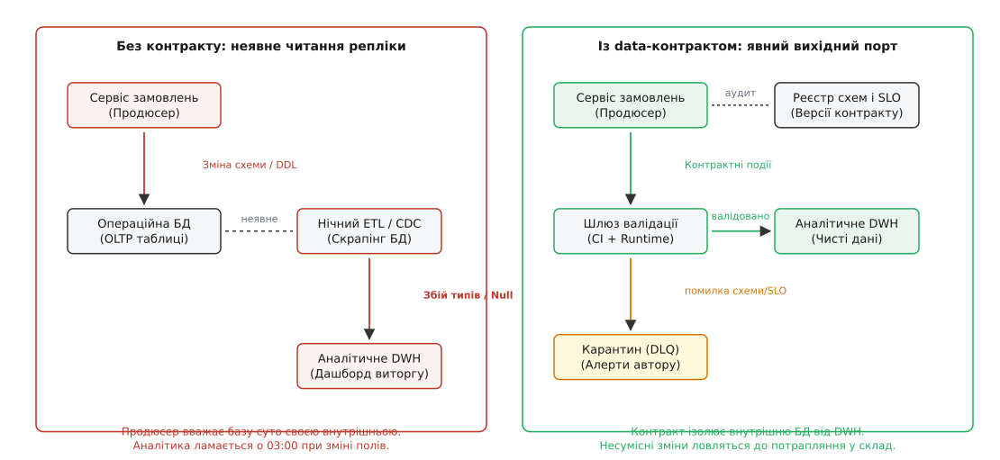
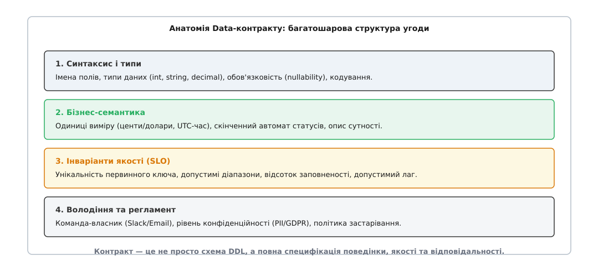
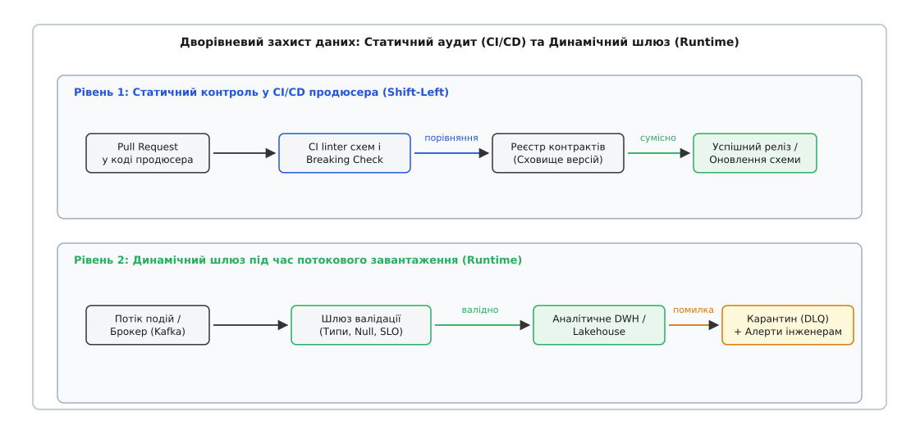

# Data-контракти між продюсером і сховищем даних

<preknowlist>
- [ETL/ELT](topic:programming/etl-elt) — передача даних між операційними базами та аналітичним сховищем батчами або потоками.
- [Захоплення змін даних (CDC)](topic:programming/change-data-capture) — вичитування журналу транзакцій (WAL) для реплікації подій у реальному часі.
- [Еволюція схем і schema-registry](topic:programming/schema-registry) — централізоване сховище версій схем для серіалізації (Avro, Protobuf, JSON Schema) та перевірки зворотної сумісності.
- [Schema-on-write vs schema-on-read](topic:programming/schema-on-read-write) — різниця між валідацією структури під час запису в базу та інтерпретацією сирих байтів під час виконання аналітичного запиту.
- [Проєктування за контрактом](topic:programming/design-by-contract) — формальна угода про перед- і післяумови та інваріанти між викликачем і виконавцем.
- [Ідемпотентні консюмери](topic:programming/idempotent-consumers-deep) — обробка дубльованих повідомлень без повторних побічних ефектів і спотворення стану.
</preknowlist>

О 03:15 під час планового нічного релізу бекенд-команда сервісу оформлення замовлень розгорнула нову версію мікросервісу. Розробники провели акуратний внутрішній рефакторинг: замінили стовпчик бази даних `order_status VARCHAR(32)` на числовий ідентифікатор переліку `order_state_code INT`, а поле грошової суми `amount NUMERIC(10,2)` у доларах перевели в цілочисельні центи `amount_cents BIGINT`, щоб позбутися помилок округлення з рухомою комою. Усі модульні та інтеграційні тести мікросервісу пройшли успішно, транзакційна база PostgreSQL працювала штатно, покупці оформлювали покупки без жодних помилок у мобільному застосунку.

Але о 06:00 ранку автоматизований аналітичний розрахунок у Snowflake впав із критичною помилкою несумісності типів. Гірше того: проміжний скрипт агрегації виторгу, налаштований на автоматичне приведення типів без перевірки семантики, прочитав нові цілочисельні центи як долари й порахував денний виторг компанії у стократному розмірі. Генеральний директор на ранковому дашборді побачив спотворені фінансові графіки, автоматичні системи закупівлі реклами зупинили кампанії через фальшиву аномалію, а чергова зміна інженерів даних витратила 14 годин на ручне відновлення історичних таблиць. При цьому бекенд-інженери щиро відповіли: «Ми нічого не ламали, наша база — це наша приватна справа, ми навіть не знали, що ви читаєте цю таблицю напряму».

Ця аварія — типовий прояв системного розриву між двома фундаментально різними архітектурними світами: операційним бекендом і аналітичним сховищем даних.

## Прірва між транзакційним світом і аналітикою

Операційні системи (мікросервіси, вебсервери, транзакційні СУБД класу OLTP) створюються для обслуговування щосекундної життєдіяльності бізнесу. Їхні пріоритети — мінімальна затримка відповіді на запит користувача, збереження ACID-транзакційності та сувора ізоляція внутрішньої логіки в межах свого обмеженого контексту (англ. *bounded context*). Для автора мікросервісу його реляційна база є приватною деталлю реалізації, яку він має повне право перекроїти в будь-якому коміті.

Аналітичні системи (корпоративні сховища даних DWH, аналітичні озера Data Lake, платформи Lakehouse) мають протилежне призначення. Вони агрегують інформацію від десятків різних сервісів за роки роботи, будують зведені фінансові звіти, навчають моделі машинного навчання та розраховують ключові метрики для ухвалення стратегічних рішень. Для аналітика зміна навіть одного імені стовпчика або зміна одиниць виміру без попередження — це катастрофа, що руйнує дерево залежностей із сотень вітрин даних.

Історично між цими двома світами не існувало формального інтерфейсу. Інженери даних отримували інформацію «через чорний хід»: підключалися до реплік операційних баз через щонічні вивантаження [ETL/ELT](topic:programming/etl-elt), збирали сирі логи застосунків або підписувалися на потік вичитування журналу транзакцій через [захоплення змін даних (CDC)](topic:programming/change-data-capture).

У результаті аналітика перетворювалася на заручника внутрішніх змін бекенду. Дані сприймалися не як навмисно створений публічний продукт, а як випадковий побічний ефект (англ. *byproduct*) роботи застосунків.


*Без контракту аналітика залежить від внутрішньої структури оперативної БД продюсера. Data-контракт створює явний вихідний порт, що захищає сховище від раптових змін.*

Як детально показано в [історії розвитку архітектур від сховищ Інмона до Data Mesh](topic:programming/data-contracts/hist-data-mesh-origins.md), спроба вирішити цю проблему простим зливанням сирих даних у безмежні озера призвела до утворення некерованих «боліт даних», що змусило індустрію виробити інженерний механізм явних меж.

## Що таке Data-контракт: зміщення парадигми

**Data-контракт** (англ. *Data Contract*, від лат. *contractus* — договір, угода) — це формальна, версіонована, людиночитана та машинозчитувана угода між сервісом-постачальником даних (продюсером) і системами-споживачами (DWH, аналітичними вітринами, ML-сервісами).

Data-контракт переносить принципи класичного [проєктування за контрактом](topic:programming/design-by-contract) на потік передачі аналітичних даних. Він перетворює емісію даних на офіційний публічний API сервісу. Замість неявного скрапінгу внутрішніх таблиць продюсер публікує дані через **явний вихідний порт** (англ. *explicit output port*), беручи на себе юридичну та технічну відповідальність за стабільність схеми, бізнес-семантику полів та якість переданих записів.

Головний зсув мислення, який запроваджує контракт: внутрішня база даних продюсера залишається приватною і може змінюватися як завгодно, але вихідний потік даних, зафіксований у контракті, є непорушним зовнішнім зобов'язанням.

> 🔧 **Навіщо це.** Без контракту інженер даних витрачає 80% робочого часу на розслідування причин падіння нічних конвеєрів («чому в колонці `price` з'явилися нулі?»). Із контрактом зміна вихідного формату стає неможливою без явного узгодження нової версії контракту ще на етапі створення Pull Request у репозиторії продюсера.

## Анатомія Data-контракту: чотири фундаментальні шари

Data-контракт часто помилково зводять до звичайного файлу опису схеми, такого як Protobuf, Avro або JSON Schema у [schema-registry](topic:programming/schema-registry). Схема типів — це лише базовий синтаксичний рівень. Повноцінний контракт набагато багатший і складається з чотирьох нерозривних шарів.


*Контракт містить синтаксис типів, семантику бізнес-правил, верифіковані інваріанти якості (SLO) та регламент володіння.*

### 1. Синтаксичний шар: схема та фізичні типи
Визначає точні назви полів, їхні фізичні та логічні типи даних (`integer`, `string`, `decimal`, `timestamp`), формат кодування (наприклад, обов'язковий UUID v4 або дата за стандартом ISO-8601 UTC) та правила обов'язковості (заборона `null`). Цей шар запобігає тривіальним збоям серіалізації та парсингу на рівні типів мов програмування.

### 2. Семантичний шар: бізнес-зміст і одиниці виміру
Пояснює, що кожне число означає в реальному житті. Саме на семантичному рівні фіксується, що поле `total_amount_cents` вимірюється в цілих центах, а не дробових доларах, що часова мітка `created_at` зафіксована у часовому поясі UTC, а поле `order_state` підпорядковується правилам скінченного автомата з дозволеним списком станів `['PENDING', 'PAID', 'SHIPPED', 'CANCELLED']`. Як описано в [повному довіднику специфікації Data-контракту](topic:programming/data-contracts/api-contract-spec.md), цей шар усуває неоднозначність інтерпретації показників різними аналітиками.

### 3. Шар інваріантів якості: SLO та перевірочні правила
Формулює строгі предикати якості (англ. *Quality Assertions*), які повинні виконуватися для кожного рядка або батчу даних:
- **Унікальність:** первинний ключ `event_id` не може повторюватися (захист від дублікатів).
- **Діапазони значень:** `items_count >= 1` та `items_count <= 500`.
- **Логічні зв'язки між полями:** `tax_amount_cents <= total_amount_cents` (податок не може перевищувати суму замовлення).
- **Свіжість (Freshness SLO):** час між виникненням події в операційній системі та її надходженням у брокер не повинен перевищувати 300 секунд.

### 4. Шар володіння, безпеки та регламенту (SLA / Governance)
Встановлює людську та організаційну відповідальність:
- **Власник (Owner):** конкретна інженерна команда (наприклад, `team-checkout`) із контактними каналами Slack та PagerDuty.
- **Класифікація безпеки:** маркування полів, що містять персональні дані (PII) згідно з GDPR (`user_id`, `email`), для автоматичного маскування в аналітиці.
- **Політика еволюції та застарівання:** гарантія підтримки старої версії протягом 90 днів після оголошення deprecation.

## Архітектурні патерни генерації контрактних даних у продюсері

Для того щоб сервіс-продюсер міг надійно генерувати дані згідно з контрактом, бекенд-інженерам необхідно вирішити фундаментальну інженерну дилему: як гарантувати узгодженість між записом у власну транзакційну базу даних та публікацією події в брокер повідомлень.

### Пастка подвійного запису (Dual-Write Hazard)
Наївна реалізація, коли бекенд спочатку виконує `db.save(order)`, а наступним рядком викликає `kafkaProducer.send(contractEvent)`, містить небезпечну архітектурну ваду. Якщо в проміжку між цими двома операціями впаде процес застосунку або виникне мережевий таймаут до брокера Kafka, транзакція в базі зафіксується, а подія в аналітику не надійде ніколи. Якщо ж спочатку відправити подію в Kafka, а транзакція в базі завершиться помилкою (rollback), аналітика отримає фальшиву подію-фантом про неіснуюче замовлення.

```
Транзакція БД (COMMIT) ──[успіх]──> База оновлена
                              │
                    Мережевий збій Kafka!
                              │
                              ▼
                       Подію втрачено!
                 (Розсинхронізація DWH та OLTP)
```

### Патерн «Транзакційна вихідна скринька» (Transactional Outbox)
Найнадійнішим способом емісії контрактних подій є патерн **Transactional Outbox**. Замість прямого виклику брокера, сервіс зберігає бізнес-сутність і контрактне повідомлення в одній локальній ACID-транзакції бази даних:

```sql
BEGIN TRANSACTION;
  -- 1. Збереження операційного стану в приватні таблиці
  INSERT INTO orders (id, customer_id, state_code, amount_cents)
  VALUES ('b2c3d4e5', 'c3d4e5f6', 1, 15000);

  -- 2. Запис сформованої контрактної події у вихідну чергу Outbox
  INSERT INTO outbox_events (event_id, contract_id, contract_version, payload, created_at)
  VALUES ('a1b2c3d4', 'urn:datacontract:checkout:orders', '2.3.0', '{"order_id":"b2c3d4e5", ...}', NOW());
COMMIT;
```

Окремий фоновий ретранслятор (Debezium CDC або легковик-пулер) вичитує записи з таблиці `outbox_events` через журнал транзакцій бази (WAL) і гарантовано публікує їх у цільовий топік Kafka. Це забезпечує 100% узгодженість між станом продюсера та вихідним контрактним потоком без блокування користувацьких запитів.

### Трансформація CDC проти публікації доменних подій
При підключенні контрактів існує два підходи до формування корисного навантаження:

1. **Трансформація сирого CDC (CDC-to-Contract Transformer):** якщо змінити код спадкового сервісу неможливо, до потоку Debezium підключається спеціальний потоковий процесор (наприклад, Apache Flink або Kafka Streams). Він фільтрує технічні поля бази, перейменовує колонки та конвертує типи відповідно до схеми контракту.
2. **Пряма емісія бізнес-подій (Explicit Domain Event Emission):** мікросервіс самостійно формує публічну модель контракту безпосередньо у своєму коді. Цей підхід є кращим, оскільки він повністю відокремлює внутрішню структуру таблиць від зовнішнього контракту.

### Локальне тестування контрактів у середовищі розробника
Щоб розробник міг перевірити сумісність коду ще до відкриття Pull Request, застосовується локальне контрактне тестування (Consumer-Driven Unit Testing):
- У модульних тестах мікросервісу запускається локальний емулятор шлюзу валідації.
- Тестові сценарії генерують зразки доменних подій і проганяють їх через валідатор схеми контракту.
- Якщо нова версія коду продюсера формує подію з відсутнім обов'язковим полем або порушеним типом, модульний тест падає безпосередньо на машині інженера, не доходячи до етапу збірки в CI/CD.

## Математичний контроль якості та вибірка для SLO

Коли потік подій сягає сотень тисяч записів на секунду, повна перевірка складних багатовимірних інваріантів для 100% рядків на шлюзі вводу може спричинити відчутне уповільнення обробки. Тому верифікація дотримання контрактного SLO часто спирається на вибірковий статистичний контроль.

Як детально виведено в [математичному обґрунтуванні вибірки для перевірки SLO](topic:programming/data-contracts/math-sla-contract-bounds.md), для оцінки частки бракованих записів `p` із довірчою ймовірністю `1 - alpha` мінімальний необхідний обсяг випадкової вибірки `n` розраховується через нерівність концентрації Гефдінга:

```
n >= ln(1 / alpha) / (2 · epsilon^2)
```

Де `epsilon` — максимально допустима похибка оцінки дрейфу якості. Це дозволяє гарантувати математичну надійність контролю якості потоку без надмірних обчислювальних витрат на інфраструктуру.

## Дворівневий захист: Shift-Left у CI/CD та динамічний шлюз

Контракт, який існує лише як документ на внутрішній вікі-сторінці, не працює. Щоб контракт гарантував стабільність, його виконання має забезпечуватися автоматизованими механізмами на двох рубежах оборони.


*Рівень 1 блокує несумісні релізи ще в репозиторії продюсера. Рівень 2 фільтрує некоректні повідомлення в рантаймі через карантин (DLQ).*

### Рівень 1. Статичний контроль: зсув перевірки ліворуч (Shift-Left)
Традиційно інженери даних дізнавалися про поломку постфактум, коли дані вже впали в сховище. Концепція **Shift-Left** переносить валідацію на найраніший етап — у пайплайн безперервної інтеграції (CI/CD) самого продюсера.

Коли бекенд-інженер створює Pull Request зі зміною структури подій або полів бази, лінтер контрактів у CI виконує три дії:
1. Завантажує поточну версію контракту з реєстру.
2. Порівнює запропоновані зміни схеми з правилами сумісності.
3. Якщо виявлено критичну зміну (наприклад, видалення поля, зміну типу або звуження списку `enum`), **збірка блокується**. PR неможливо злити в основну гілку, поки розробник не підвищить мажорну версію контракту та не погодить міграційний період зі споживачами.

### Рівень 2. Динамічний контроль: шлюз валідації та карантин (DLQ)
Статичний аналіз ловить зміни типів, але не захищає від помилок бізнес-логіки в рантаймі (наприклад, баг у коді розрахунку знижок призвів до запису від'ємної ціни `total_amount_cents = -500`).

Для захисту сховища на шляху потоку даних встановлюється шлюз валідації (англ. *Ingestion Gatekeeper*). Шлюз перевіряє кожне вхідне повідомлення:
- Валідні події пропускаються в основні таблиці сховища DWH.
- Браковані події не зупиняють потік і не скидаються безслідно: вони загортаються в спеціальний конверт помилки та маршрутизуються в **карантинну чергу** (англ. *Dead Letter Queue*, DLQ).

Конверт карантину містить повний сирий запис, ідентифікатор контракту, назву порушеного правила та мітку часу. Автоматизована система моніторингу миттєво відправляє сповіщення у Slack-канал команди-продюсера, дозволяючи розробникам виправити баг і повторно відправити виправлені події з карантину.

Повнофункціональний приклад реалізації такого шлюзу різними мовами програмування наведено в [практичній реалізації шлюзу валідації data-контрактів](topic:programming/data-contracts/proj-contract-enforcer.md).

### Адаптивне регулювання швидкості (Backpressure) та буферизація
Під час пікових навантажень (наприклад, розпродажі Black Friday) шлюз валідації може зіткнутися із затримками запису в аналітичне сховище (Lakehouse S3 / Snowflake). Щоб не втрачати події та не переповнювати оперативну пам'ять процесу, архітектура шлюзу включає механізми зворотного тиску (Backpressure):
- Якщо лаг споживача перевищує критичну межу, шлюз тимчасово зупиняє вичитування черги Kafka (Consumer Pause), дозволяючи брокеру утримувати потік на своєму реплікованому диску.
- Для критичних потоків шлюз скидає перевірені пакети на локальний високошвидкісний дисковий буфер (вбудована база RocksDB на NVMe SSD) перед асинхронною відправкою в DWH, гарантуючи нульову втрату даних навіть при повному відключенні аналітичної платформи.

## Еволюція схем і семантична сумісність

Будь-яка жива система розвивається. Data-контракт не фіксує систему навічно, а задає чіткі правила її еволюції через семантичне версіонування (SemVer: `MAJOR.MINOR.PATCH`):

```
PATCH (2.1.0 -> 2.1.1): виправлення опису поля, оновлення коментарів метаданих.
MINOR (2.1.0 -> 2.2.0): додавання нового опціонального (nullable) поля,
                        розширення некритичних SLO (зворотна сумісність збережена).
MAJOR (2.1.0 -> 3.0.0): видалення або перейменування поля, зміна типу даних,
                        додавання нового обов'язкового поля (breaking change).
```

### Режими сумісності схем
Під час перевірки сумісності в Schema Registry розрізняють чотири основні політики:

| Режим сумісності | Суть вимоги | Дозволені зміни | Заборонені зміни |
| :--- | :--- | :--- | :--- |
| **BACKWARD** | Новий споживач може читати старі дані з архіву. | Додавання опціональних полів зі значенням за замовчуванням. | Видалення наявних полів, перейменування. |
| **FORWARD** | Старий споживач може читати нові дані від продюсера. | Видалення полів, що мали значення за замовчуванням. | Додавання нових обов'язкових полів. |
| **FULL** | Одночасна підтримка прямої та зворотної сумісності. | Додавання та видалення лише опціональних полів. | Будь-які зміни обов'язкових полів. |
| **NONE** | Сумісність відключена (допустимо лише при зміні `MAJOR`). | Будь-які зміни. | — |

### Патерн паралельних змін (Expand–Contract)
Якщо виникає необхідність внести ламаючу зміну (наприклад, перейменувати `user_id` на `customer_uuid`), перехід виконується у три етапи без зупинки системи:
1. **Розширення (Expand):** продюсер випускає нову мінорну версію контракту і тимчасово генерує в подію обидва поля одночасно (`user_id` та `customer_uuid`).
2. **Міграція (Migrate):** споживачі поступово протягом міграційного вікна (наприклад, 90 днів) переналаштовують свої аналітичні SQL-моделі та дашборди на читання нового поля `customer_uuid`.
3. **Звуження (Contract):** після того, як усі споживачі відмовилися від старого поля, продюсер випускає мажорний реліз контракту `3.0.0` і видаляє застарілий стовпчик `user_id`.

### Еволюція історичних даних у колонкових сховищах (Schema Evolution у Iceberg/Parquet)
Коли за контрактом додається нове поле, у сховищі DWH вже лежать петабайти історичних файлів Parquet без цього стовпчика.
Сучасні табличні формати (Apache Iceberg, Delta Lake) підтримують **ідентифікаторну еволюцію схем** (Field ID Mapping). Замість позиційного читання колонок, кожне поле в Iceberg має унікальний незмінний числовий `field_id`. При читанні старих файлів рушій запитів автоматично підставляє `null` або дефолтне значення контракту для нових `field_id`, не вимагаючи дорогого повного перезапису (Rewrite/Backfill) терабайтів історичних даних на S3.

## Інтеграція в сучасний стек даних (Modern Data Stack)

Data-контракт є не просто статичним описом, а виконуваним генератором інфраструктурного коду. Маніфест контракту автоматично транслюється в цільові артефакти для різних інструментів екосистеми:

- **Генерація тестів dbt (Data Build Tool):** розділи `models` та `semantics` автоматично компілюються у файли `schema.yml` для dbt. Правила унікальності стають тестами `unique`, обмеження обов'язковості — тестами `not_null`, а списки `enum` — тестами `accepted_values`.
- **Контроль якості у сховищах (Soda / Great Expectations):** інваріанти якості `quality.specification` транслюються у перевірочні плани SodaCL або Great Expectations Checkpoints, що запускаються автоматично після завантаження кожного щоденного батчу.
- **Управління метаданими та походженням (DataHub / OpenLineage):** метадані контракту експортуються у відкриті формати OpenLineage. Каталоги даних автоматично відображають команду-власника, посилання на репозиторій продюсера та актуальну версію контракту.

## Організаційний протокол та Consumer-Driven контракти

У великих компаніях впровадження контрактів вимагає чіткого регламенту взаємодії між продуктовими розробниками та аналітиками. Замість одностороннього нав'язування схеми продюсером, найефективнішим є патерн **контрактів, керованих споживачем** (англ. *Consumer-Driven Contracts*):

1. **Ініціація потреби (Request Phase):** інженер даних або аналітик створює чернетку маніфесту контракту в репозиторії каталогів, описуючи необхідні для вітрини даних поля та бізнес-інваріанти.
2. **Технічне узгодження (Review Phase):** бекенд-інженери продюсера проводять рецензування чернетки, узгоджують реалістичність SLO затримки та гарантують, що операційна база може постачати ці показники без надмірного навантаження на продакшн.
3. **Офіційне затвердження (Signing):** лід команди продюсера затверджує Pull Request. Контракт переходить у статус `active`, автоматично генеруючи код шлюзу валідації та вітрин сховища.

## Порівняння бінарних і текстових протоколів серіалізації

Вибір фізичного формату передачі контрактних повідомлень визначає пропускну здатність шини даних та споживання пам'яті:

| Критерій | JSON Schema | Apache Avro | Protocol Buffers | Apache Iceberg |
| :--- | :--- | :--- | :--- | :--- |
| **Тип формату** | Текстовий (UTF-8) | Бінарний компактний | Бінарний типізований | Колонковий (Parquet) |
| **Оверхед кодування** | Високий (імена полів у кожному рядку) | Мінімальний (лише сирі байти даних) | Мінімальний (числові теги полів) | Відсутній у рядках (блокове стиснення) |
| **Швидкість парсингу** | Повільна (парсинг рядків у CPU) | Висока (пряме читання за схемою) | Екстремальна (скомпільований C++/Go код) | Пакетна векторизована (SIMD) |
| **Еволюція схем** | Ручна валідація JSON | Нативна через Schema Registry | Суворе версіонування за номерами полів | Вбудована еволюція колонок таблиць |

У високонавантажених брокерах (понад 50 000 req/s) стандартом є використання **Apache Avro** або **Protobuf**, де схема передається один раз у Schema Registry, а кожне повідомлення містить лише 5-байтний заголовок ідентифікатора схеми та сирі двійкові байти. Для аналітичних батчевих зрізів найкраще підходять відкриті формати таблиць **Apache Iceberg** або **Delta Lake**.

## Захист конфіденційності (PII), GDPR та криптографічна псевдонімізація

Data-контракти слугують першим рубежем кібербезпеки та дотримання регламентів захисту персональних даних (GDPR, CCPA, HIPAA). Завдяки явній декларації блоку `governance`, шлюз валідації автоматично виконує три рівні захисту:

1. **Автоматична класифікація колонок:** поля з міткою `containsPii: true` маркуються в каталозі даних як конфіденційні, що автоматично блокує прямий доступ до них для загального пулу аналітиків.
2. **Детерміністична псевдонімізація на шлюзі (HMAC Salting):** для збереження можливості з'єднання таблиць (JOIN) за ідентифікатором клієнта без розкриття реальних даних, шлюз на льоту замінює `user_id` на криптографічний хеш:
   ```
   masked_user_id = HMAC_SHA256(raw_user_id, salt = SECRET_SALT_2026)
   ```
3. **Динамічне маскування (Dynamic Data Masking):** у хмарних сховищах (Snowflake, BigQuery) маніфест контракту автоматично активує політики маскування, відображаючи звичайним аналітикам лише частково приховані рядки (наприклад, `user_email = "a***@example.com"`).

## Автоматичний аналіз впливу (Impact Analysis) через Data Lineage

Головна перевага машиннозчитуваного контракту — можливість попередити катастрофу ще до випуску релізу. Під час створення Pull Request у репозиторії продюсера лінтер контракту не просто перевіряє синтаксис, а виконує автоматичний **аналіз графа залежностей** (Impact Analysis):

```
Pull Request (продюсер checkout)
       │
       ▼
Запит до каталогу Data Lineage (OpenLineage)
       │
       ├──> Виявлено залежність: dbt модель `marts_finance_revenue`
       ├──> Виявлено залежність: Airflow DAG `daily_executive_kpi`
       └──> Виявлено залежність: Tableau дашборд `CEO_Realtime_Sales`
       │
       ▼
Блокування збірки: зміна поля `amount` зламає фінансовий звіт директора!
```

Автоматичний бот залишає коментар у PR бекенд-інженера з переліком усіх кінцевих звітів, які постраждають від зміни, та тегає відповідальних аналітиків у Slack.

## Бюджети помилок якості даних (Data Error Budgets)

Запозичена з практик SRE (Site Reliability Engineering) концепція **бюджетів помилок** переводить абстрактні розмови про якість даних у вимірювану бізнес-площину.

Для кожного data-контракту встановлюється квартальний ліміт браку: наприклад, контракт гарантує чистоту потоку `99.99%`, що дає бюджет помилок `0.01%` (не більше 100 бракованих записів на кожен 1 000 000 подій).

Якщо через часті збої в коді продюсера його бюджет помилок вичерпується до кінця кварталу:
- Автоматично блокується випуск некритичних фіч продуктової команди продюсера.
- Наступний спринт команди примусово присвячується закриттю технічного боргу та підвищенню надійності генерації даних.
- Це створює дієву організаційну мотивацію для продуктових інженерів дбати про якість аналітичних потоків нарівні з операційними базами.

## Межі застосовності, антипатерни та ціна впровадження

Data-контракти — це потужний архітектурний інструмент, але вони вимагають організаційної дисципліни та інженерних витрат на підтримку реєстрів схем, лінтерів у CI/CD та шлюзів валідації.

Контракти життєво необхідні, коли:
- В організації працює понад 5–10 незалежних продуктових команд, і неформальні усні домовленості перестають працювати.
- Аналітичні дані безпосередньо впливають на бізнес-рішення, фінансову звітність, білінг або роботу клієнтських ML-моделей.
- Падіння нічних ETL-конвеєрів призводить до відчутних прямих збитків або блокування роботи компанії.

Натомість data-контракти є передчасним ускладненням (оверхедом) для:
- Ранніх стартапів і прототипів з єдиною монолітною базою та однією командою з кількох розробників.
- Внутрішніх тимчасових скриптів і дослідницьких пісочниць Data Science, де схема змінюється щогодини.

### Економічний ефект (ROI) та скорочення простоїв даних (Data Downtime)
Впровадження контрактів змінює структуру витрат інженерних команд:
- **Зниження трудовитрат на гасіння пожеж:** час, який інженери даних витрачають на ручний розбір поламаних конвеєрів та написання тимчасових латок, скорочується з 70–80% до менш ніж 10%.
- **Радикальне скорочення MTTR (Mean Time to Resolution):** без контракту пошук причини зміни формату займає години або дні. Із контрактом та конвертом DLQ середній час локалізації та виправлення збою знижується до хвилин, оскільки точний винуватець, контракт і версія зафіксовані в метаданих карантину.
- **Передбачуваність витрат на хмарну інфраструктуру:** блокування некоректних або роздутих дублікатами даних на шлюзі запобігає зайвим обчислювальним витратам на марні щонічні перерахунки вітрин у Snowflake чи BigQuery.

### Політика виведення з експлуатації та завершення підтримки схем (Sunset & Deprecation Policy)
Будь-яка схема має скінченний термін життя. Процес виведення застарілої мажорної версії контракту з експлуатації підпорядковується суворому регламенту:
1. **Оголошення застарівання (Deprecation Notice):** у маніфесті контракту виставляється статус `status: deprecated` із фіксацією дати відключення (`sunsetDate: 2026-11-30`).
2. **Моніторинг активних споживачів:** за даними Data Lineage автоматично виявляються залишковий трафік та застосунки, які досі читають старий топік.
3. **Штучне внесення затримок (Brownout Phase):** за два тижні до дати вимкнення продюсер тимчасово вносить штучні затримки в старий топік на 1–2 години, щоб виявити забутих споживачів, які не відреагували на сповіщення.
4. **Повне відключення (Retired):** топік старої версії переводиться в статус `retired` та архівується в довгостроковому сховищі без ризику раптових збоїв бізнесу.

### Типові антипатерни впровадження

1. **«Паперовий контракт» (The Paper Contract):** створення гарних описів у документації Confluence без підключення автоматичних лінтерів у CI продюсера та без рантайм-шлюзу валідації. Такий контракт застаріває і перестає виконуватися вже через два тижні після написання.
2. **«Контракт на все підряд» (Over-Contracting):** спроба укласти жорсткі контракти на всі внутрішні проміжні таблиці сирого озера даних. Контракти повинні укладатися виключно на публічних межах доменів (Domain Output Ports).
3. **«Викидання сирої БД за паркан» (Raw Table Dump as Contract):** коли замість осмисленої розробки доменних подій команда продюсера просто надає прямий доступ до репліки своєї ненормалізованої внутрішньої СУБД, формально називаючи це «контрактом».

Чесна інженерна межа полягає в тому, що Data-контракт сам по собі не виправляє помилки всередині бізнес-коду продюсера. Проте він надійно захищає кордони систем: перетворює неявні та крихкі залежності на явні, прозорі та контрольовані інженерні інтерфейси взаємодії.
