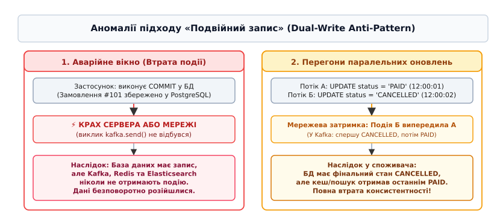
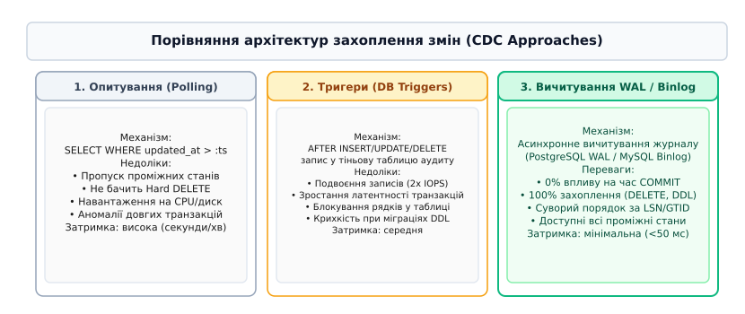
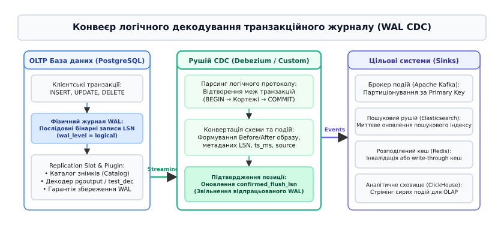
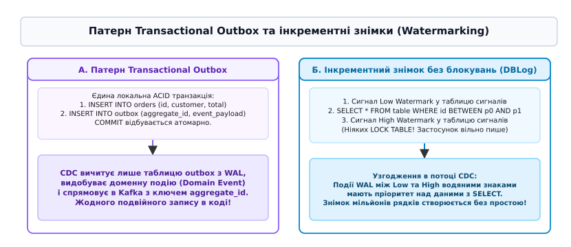

# 📜 Захоплення змінних даних (Change Data Capture, CDC)

<preknowlist>
- [Реляційна модель даних](topic:programming/relational-model) — реляційні таблиці, первинні ключі та нормалізація.
- [Транзакції та властивості ACID](topic:programming/transactions-acid) — атомарність, узгодженість, ізольованість і довговічність змін.
- [Рівні ізоляції транзакцій](topic:programming/isolation-levels) — аномалії конкурентного доступу та межі видимості даних.
- [Журнал попереднього запису (WAL)](topic:programming/write-ahead-log) — протокол випереджального запису, послідовна фіксація LSN та надійність на диску.
- [М'яке видалення та надгробки](topic:programming/soft-delete-tombstones) — збереження історії та надгробні маркери при видаленні рядків.
- [Поліглотне збереження даних](topic:programming/polyglot-persistence) — поєднання реляційних СУБД, пошукових рушіїв, кешів та аналітичних сховищ.
- [Розділення команд і запитів (CQRS)](topic:programming/design-patterns/cqrs) — розділення моделі запису та матеріалізованих моделей читання.
- [Event Sourcing](topic:programming/design-patterns/event-sourcing) — збереження стану системи як послідовності незмінних доменних подій.
</preknowlist>

Розгляньмо типову ситуацію у сервісі електронної комерції: користувач оплачує замовлення на суму 1 500 гривень. Сервіс обробки платежів повинен виконати дві дії: оновити статус замовлення в основній базі даних PostgreSQL з `PENDING` на `PAID`, а також надіслати подію `OrderPaid` у брокер повідомлень Apache Kafka, щоб ініціювати списання товару на складі, інвалідувати кеш у Redis та оновити пошуковий індекс в Elasticsearch.

Якщо бекенд виконує успішний `COMMIT` у транзакційній базі даних, але за мікросекунду до виклику методу відправки в Kafka сервер раптово втрачає живлення або перезавантажується через паніку операційної системи, платіж залишається зафіксованим у PostgreSQL, проте повідомлення в Kafka не надходить ніколи. Склад не резервує товар, пошуковий індекс показує застарілу інформацію, а клієнт не отримує сповіщення.

Якщо ж розробник спробує змінити порядок дій і відправить повідомлення в брокер до підтвердження транзакції в базі даних, виникає зворотна катастрофа: транзакція в PostgreSQL зазнає відкату (`ROLLBACK`) через порушення обмеження цілісності або дедлок, але зовнішні системи вже отримають подію про успішну оплату неіснуючого замовлення. 

Спроба розв'язати цю проблему за допомогою розподілених транзакцій за протоколом двофазної фіксації (Two-Phase Commit, 2PC / XA) призводить до важких синхронних блокувань ресурсів, створює єдину точку відмови в особі координатора транзакцій, катастрофічно знижує пропускну здатність системи на порядки та взагалі не підтримується більшістю сучасних хмарних черг і NoSQL сховищ.


*Аномалії підходу «Подвійний запис» (Dual-Write Anti-Pattern): втрата консистентності при аварії та перегони паралельних оновлень*

Фундаментальним інженерним розв'язанням цієї дилеми є технологія **захоплення змінних даних (Change Data Capture, CDC)**. Замість того, щоб змушувати бізнес-код координувати запис у кілька незалежних систем, застосунок здійснює модифікацію виключно у своїй локальній реляційній базі даних в межах єдиної ACID-транзакції. Спеціалізований асинхронний рушій CDC підключається безпосередньо до внутрішнього транзакційного журналу СУБД, видобуває всі підтверджені зміни рядків і транслює їх у надійний потік розподілених подій.

Детальний історичний шлях розвитку цієї технології від масивних пакетних процесів на мейнфреймах до сучасних хмарних потокових платформ розібрано у вставці [Еволюція захоплення змін: від тіньових журналів до потокових платформ](topic:programming/change-data-capture/hist-cdc-evolution.md).

---

### Порівняльний аналіз архітектурних підходів до захоплення змін

Протягом десятиліть інженери застосовували три принципово різні механізми виявлення та експорту змін із реляційних баз даних.

```
+------------------------+--------------------------+---------------------------+
| Підхід                 | Вплив на продуктивність  | Повнота та надійність     |
+------------------------+--------------------------+---------------------------+
| Опитування (Polling)   | Високе навантаження I/O  | Втрата DELETE та проміжків|
| Базові тригери (Triggers) Подвоєння записів (2x)  | Зростання затримки COMMIT |
| Транзакційний журнал   | Близько 0% оверхеду      | 100% точність і послідовність|
+------------------------+--------------------------+---------------------------+
```

#### 1. Опитування за міткою часу (Query-based Polling)
Найпростіший у реалізації, але найменш надійний метод. Застосунок або періодичний процес виконує SQL-запит до таблиці за розкладом:

```sql
SELECT * FROM orders 
WHERE updated_at > :last_poll_timestamp 
ORDER BY updated_at ASC 
LIMIT 1000;
```

Цей підхід має чотири непереборні вади:
* **Неможливість відстеження фізичних видалень (Hard DELETEs)**: Якщо рядок фізично видаляється оператором `DELETE`, він безслідно зникає з дискових сторінок. Пошуковий запит ніколи не побачить цей запис, і цільові системи (кеші, Elasticsearch) назавжди збережуть застарілий стан. Для обходу цього обмеження систему змушують переходити на патерн м'якого видалення з маркерами видалення, як описано в [М'яке видалення та надгробки](topic:programming/soft-delete-tombstones).
* **Втрата проміжних станів (Intermediate State Collapse)**: Якщо статус замовлення між двома циклами опитування змінився з `PENDING` на `PROCESSING`, а потім на `CANCELLED`, споживач вичитає лише фінальне значення `CANCELLED`. Уся історія проміжних переходів, необхідна для фінансового аудиту та аналітики, буде безповоротно втрачена.
* **Аномалія часу фіксації транзакції проти часу виконання оператора**: Транзакція `T1` починається о `12:00:00`, встановлює `updated_at = 12:00:00`, виконує тривалі розрахунки і фіксується о `12:00:10`. Опитувач запускається о `12:00:05` і читає всі зміни до `12:00:05`. Наступний цикл опитування почнеться з мітки `12:00:05`. Коли транзакція `T1` фіксується о `12:00:10`, її мітка часу `12:00:00` виявляється меншою за точку старту наступного опитування (`12:00:05`), і зміна рядка **назавжди пропускається**.
* **Деградація продуктивності**: Постійні періодичні сканування таблиць навантажують підсистему вводу-виводу (I/O) і призводять до деградації оперативних OLTP-запитів.

#### 2. Захоплення за допомогою тригерів (Trigger-based CDC)
На кожну цільову таблицю навішуються системні тригери рівня рядка (`AFTER INSERT OR UPDATE OR DELETE FOR EACH ROW`), які записують копію змінених даних у спеціальну тіньову таблицю аудиту (`audit_log`):

```sql
CREATE TRIGGER orders_audit_trigger
AFTER INSERT OR UPDATE OR DELETE ON orders
FOR EACH ROW EXECUTE FUNCTION log_order_change();
```

Головні недоліки тригерного підходу:
* **Подвоєння операцій запису (Write Amplification)**: Кожна модифікація бізнес-таблиці змушує рушій бази даних виконувати додатковий запис у таблицю аудиту та оновлювати відповідні індекси, що збільшує дисковий трафік у 2–3 рази.
* **Збільшення латентності транзакцій та ризик блокувань**: Виконання тригера відбувається синхронно всередині контексту основної транзакції клієнта. Будь-яка затримка при записі в аудит-таблицю безпосередньо сповільнює виконання бізнес-операцій і збільшує ймовірність взаємних блокувань (Deadlocks).
* **Крихкість при міграціях схеми (DDL)**: Будь-яка зміна структури основної таблиці вимагає синхронного оновлення функцій тригерів, інакше транзакції починають завершуватися аварійно.

#### 3. Захоплення на основі журналу транзакцій (Log-based / Log-Tailing CDC)
Найсучасніший та архітектурно досконалий підхід. Будь-яка реляційна СУБД для гарантії довговічності записує всі операції у послідовний журнал транзакцій: Write-Ahead Log (WAL) у PostgreSQL, Binary Log (Binlog) у MySQL, Redo Log в Oracle.

Рушій CDC підключається до СУБД як спеціалізований клієнт реплікації та асинхронно вичитує двійковий журнал безпосередньо з диска або оперативної пам'яті:
* **Нульовий вплив на транзакційний шлях**: Запис транзакції клієнтом завершується одразу після скидання WAL на диск, не очікуючи обробки подій зовнішніми системами.
* **100% повнота історії**: Журнал містить вичерпний запис про абсолютно всі операції, включаючи фізичні `DELETE`, проміжні оновлення кортежів та DDL-команди зміни структури таблиць.
* **Суворий глобальний порядок**: Події мають природне лінійне впорядкування за номерами журнальних послідовностей (Log Sequence Number, LSN у PostgreSQL або Global Transaction Identifier, GTID у MySQL).


*Порівняння архітектур захоплення змін: опитування за міткою часу, тригери та вичитування журналу транзакцій*

---

### Глибока анатомія логічного декодування в PostgreSQL

У реляційній системі PostgreSQL фізичний журнал WAL призначений для низькорівневого відновлення блоків диску: він містить побайтові диференційні зміни сторінок розміром 8 КБ (Page Deltas). Зовнішні споживачі не можуть безпосередньо інтерпретувати фізичні байти сторінок, оскільки вони не містять назв стовпців, реляційних типів та інформації про видалені рядки.

Для подолання цієї прірви в ядро PostgreSQL було вбудовано підсистему **логічного декодування (Logical Decoding)**.

```
Фізичні байти WAL 
  └──> Reorder Buffer (збирання транзакції за XID)
        └──> Каталог знімків (Catalog Snapshot — типи й стовпці)
              └──> Плагін виводу (pgoutput) 
                    └──> Логічний кортеж: BEFORE / AFTER
```

#### 1. Рівень журналювання wal_level = logical
При встановленні конфігураційного параметра `wal_level = logical` ядро СУБД починає зберігати у WAL додаткову інформацію, необхідну для відновлення реляційного контексту: старі значення первинних ключів, повні образи рядків при оновленні та метадані системних транзакцій каталогу.

#### 2. Буфер перевпорядкування (Reorder Buffer)
Оскільки в багатопотоковому середовищі операції різних транзакцій записуються у WAL у змішаному хронологічному порядку, процес логічного декодування підтримує в пам'яті структуру `ReorderBuffer`. 

Усі записи групуються за ідентифікатором транзакції `XID`. Якщо транзакція завершується командою `ABORT`, буфер перевпорядкування миттєво звільняє пам'ять і викидає всі накопичені записи. Якщо транзакція фіксується командою `COMMIT`, буфер передає повну послідовність операцій цієї транзакції плагіну виводу у строгому порядку їх первинного виконання.

#### 3. Слоти реплікації (Logical Replication Slots)
Слот реплікації — це стан у системному каталозі PostgreSQL, який гарантує, що ядро СУБД не видалить і не перезапише жоден сегмент WAL на диску, доки підключений клієнт CDC не підтвердить його успішне вичитування.

Кожен логічний слот відстежує дві ключові позиції:
* **`restart_lsn`**: Найстаріша позиція у WAL, починаючи з якої збережено всі дані незафіксованих на той момент транзакцій. Сервер PostgreSQL гарантує збереження на диску всіх WAL-файлів, починаючи від `restart_lsn`.
* **`confirmed_flush_lsn`**: Максимальна позиція LSN, яку клієнт CDC успішно вичитав, передав споживачам і явно підтвердив серверу через зворотний протокольний зв'язок.

#### 4. Плагін логічного виводу pgoutput
Плагін `pgoutput` є стандартним високоефективним компонентом ядра PostgreSQL. Він перетворює внутрішні структури кортежів у компактний бінарний потік повідомлень про зміну рядків. 

Повний опис бінарного протоколу, структури повідомлень `'B'` (Begin), `'R'` (Relation), `'I'` (Insert), `'U'` (Update), `'D'` (Delete), `'C'` (Commit) та конфігурації Debezium наведено у довіднику [Специфікація інтерфейсу pgoutput та конфігурація Debezium](topic:programming/change-data-capture/api-debezium-pgoutput.md).


*Конвеєр логічного декодування транзакційного журналу (WAL CDC): від транзакційного запису до брокерів та пошукових індексів*

---

### Обробка великих об'єктів (TOAST) та ідентифікаторів репліки

Особливої уваги при проєктуванні CDC у PostgreSQL вимагає взаємодія з підсистемою TOAST (The Oversized-Attribute Storage Technique). Якщо розмір кортежу перевищує чверть сторінки (близько 2 КБ), ядро СУБД виносить довгі текстові або двійкові поля (`JSONB`, `TEXT`, `BYTEA`) в окрему службову таблицю `pg_toast_*`, розбиваючи дані на компактні фрагменти.

Поведінка логічного декодування при модифікації таблиць із полями TOAST визначається параметром `REPLICA IDENTITY`:

1. **Режим `REPLICA IDENTITY DEFAULT`**:
   * При виконанні операції `UPDATE` ядро СУБД записує у WAL лише старі значення первинного ключа.
   * Якщо велике поле TOAST не змінювалося під час `UPDATE`, ядро взагалі не зчитує його зі службової таблиці та надсилає клієнту CDC маркер `'u'` (Unchanged TOAST Value).
   * Конектор Debezium не може вгадати попередній вміст цього поля і встановлює у JSON-структурі спеціальне сигнальне значення `__debezium_unavailable_value`.
   * *Перевага*: Мінімальний обсяг трафіку WAL та висока швидкодія.
   * *Недолік*: Споживач подій не отримує повного стану рядка і змушений виконувати додатковий запит до бази даних, якщо йому потрібне незмінене поле.

2. **Режим `REPLICA IDENTITY FULL`**:
   * Змушує ядро PostgreSQL записувати у WAL повний побайтовий стан абсолютно всіх стовпців кортежу до виконання операції `UPDATE`.
   * Поля TOAST вичитуються та повністю серіалізуються у транзакційний журнал.
   * *Перевага*: Споживач завжди отримує вичерпний перед-образ рядка (`before`).
   * *Недолік*: Катастрофічне зростання обсягу журналу WAL (Write Amplification). Оновлення одного числового прапорця в рядку з 10-мегабайтним JSON-документом призведе до запису 10 МБ у WAL на кожну транзакцію.

---

### Архітектура захоплення змін у MySQL (Binlog RBR)

У СУБД MySQL механізм CDC базується на бінарному журналі (Binary Log). На відміну від PostgreSQL, де WAL виконує одночасно функції відновлення після збоїв та реплікації, у MySQL бінарний журнал існує як окремий логічний рівень над фізичним рушієм зберігання InnoDB.

Для забезпечення надійного CDC у MySQL вимагаються такі налаштування:
1. **`binlog_format = ROW`**: Використання виключно рядкового формату (Row-Based Replication, RBR). У застарілому форматі `STATEMENT` у журнал записується текст SQL-команд (наприклад, `UPDATE orders SET updated_at = NOW()`), що призводить до недетермінізму та неможливості точного відновлення конкретних значень модифікованих полів. У форматі `ROW` фіксуються точні побайтові стани кожного зміненого рядка.
2. **`binlog_row_image = FULL`**: Змушує MySQL зберігати у журналі повний образ рядка як до модифікації (Before Image), так і після неї (After Image). Без цього параметра для операцій `UPDATE` зберігаються лише змінені стовпці, що ускладнює роботу споживачів, яким потрібен повний контекст сутності.
3. **Глобальні ідентифікатори транзакцій (GTID)**: Кожна транзакція отримує унікальний ідентифікатор вигляду `UUID:SequenceNumber`. Це дозволяє конектору CDC автоматично відновлювати вичитування змін з нової репліки у разі аварійного перемикання майстер-сервера без втрати та дублювання позиції в лозі.

Рушій CDC підключається до MySQL по стандартному мережевому протоколу клієнтської реплікації, відправляючи команду `COM_BINLOG_DUMP_GTID`, та емулює поведінку стандартної репліки-підписника.

---

### Захоплення змін у нереляційних СУБД: MongoDB Change Streams

У нереляційних документоорієнтованих базах даних (зокрема MongoDB) концепція CDC реалізується через механізм **Change Streams**, побудований поверх внутрішнього журналу операцій реплікації `oplog.rs` (Operations Log).

На відміну від реляційного табличного декодування, зміна документа у MongoDB є самодостатньою сутністю:
* **Токени відновлення (Resume Tokens)**: Кожна зміна в Change Stream містить криптографічно підписаний BSON-токен `_data`. Якщо конектор CDC втрачає з'єднання, він відновлює потік передачею параметра `resumeAfter: resumeToken`, що гарантує вичитування з точної мілісекунди обриву.
* **Рівні деталізації образу**: Споживач може налаштувати конфігурацію `fullDocument: "updateLookup"`, змушуючи СУБД автоматично підтягувати повний актуальний образ документа на додачу до списку модифікованих полів (`updatedFields`) та видалених атрибутів (`removedFields`).

---

### Практична реалізація: побудова власного CDC-парсера

Для глибинного розуміння механізмів обробки транзакційних журналів корисно розглянути роботу програмного рушія, який безпосередньо взаємодіє з бінарним потоком операцій. 

Такий парсер повинен підтримувати власну таблицю активних транзакцій у пам'яті, детерміністично накопичувати зміни до моменту фіксації, фільтрувати скасовані транзакції та формувати структуровані JSON-події зі збереженням LSN-метаданих.

Повноцінний вихідний код промислового парсера двійкового журналу та транзакційного буфера на мовах C та C++ наведено у практичній вставці [Парсер бінарного журналу транзакцій та генератор подій CDC](topic:programming/change-data-capture/proj-wal-cdc-parser.md).

---

### Патерн Transactional Outbox у поєднанні з CDC

Пряме транслювання сирих змін таблиць бази даних у чергу повідомлень має істотний недолік: воно розкриває внутрішню структуру реляційної схеми зовнішнім мікросервісам (виникає жорстке зв'язування за схемою даних). Крім того, бізнес-подія часто складається з модифікацій кількох різних таблиць (наприклад, створення запису в `orders` та додавання п'яти рядків у `order_items`).

Для розв'язання цієї проблеми використовується архітектурний патерн **Transactional Outbox**:

1. В основній базі даних створюється спеціальна таблиця вихідних повідомлень `outbox`:
```sql
CREATE TABLE outbox_events (
    id UUID PRIMARY KEY,
    aggregate_type VARCHAR(255) NOT NULL,
    aggregate_id VARCHAR(255) NOT NULL,
    event_type VARCHAR(255) NOT NULL,
    payload JSONB NOT NULL,
    created_at TIMESTAMP WITH TIME ZONE NOT NULL DEFAULT NOW()
);
```

2. Коли сервіс виконує бізнес-операцію, він у межах **однієї локальної ACID-транзакції** оновлює реляційні таблиці та записує готову доменну подію у таблицю `outbox_events`:

```sql
BEGIN;
INSERT INTO orders (id, customer_id, total, status) VALUES (101, 42, 1500, 'PAID');
INSERT INTO outbox_events (id, aggregate_type, aggregate_id, event_type, payload)
VALUES (
    gen_random_uuid(), 
    'Order', 
    '101', 
    'OrderPaid', 
    '{"order_id": 101, "customer_id": 42, "amount": 1500, "items": [501, 502]}'
);
COMMIT;
```

3. Конектор CDC налаштовується на вичитування **виключно таблиці `outbox_events`** через WAL.
4. Спеціалізований маршрутизатор подій (наприклад, Debezium Outbox Event Router) перехоплює подію, витягує `payload` і публікує його в топік Kafka з назвою `Order.events`, використовуючи `aggregate_id` як ключ повідомлення.

Завдяки цьому досягається абсолютна атомарність: доменна подія ніколи не з'явиться у брокері, якщо транзакція зазнала невдачі, і гарантовано потрапить у потік, якщо транзакція була зафіксована.


*Патерн Transactional Outbox та інкрементні знімки без блокувань (Watermark Snapshotting)*

---

### Ініціалізація та інкрементні знімки без блокувань (Incremental Snapshotting)

Коли CDC-конектор розгортається на базі даних, яка вже містить мільйони рядків історичних даних, виникає так звана проблема «холодного старту». Конектору необхідно не лише передавати нові зміни з журналу WAL, але й вивантажити весь первинний стан таблиць у брокер.

Класичний підхід вимагав встановлення глобального блокування читання (`FLUSH TABLES WITH READ LOCK` у MySQL або `LOCK TABLE IN ACCESS SHARE MODE` у PostgreSQL), створення узгодженого знімка та початку вичитування журналу з точки блокування. У високонавантажених системах з мільярдами рядків таке блокування триває годинами, що призводить до повного зупинення бізнесу та деградації сервісу.

Сучасний стандарт розв'язання цієї проблеми — алгоритм **інкрементного знімка на основі водяних знаків (Watermarking / DBLog Algorithm)**, розроблений інженерами компаній Netflix та Red Hat:

1. **Розбиття таблиці на чанки**: Таблиця ділиться на невеликі діапазони за первинним ключем (наприклад, по 10 000 рядків: `[0...10000]`, `[10001...20000]`).
2. **Встановлення нижнього водяного знака (Low Watermark)**: Конектор записує спеціальний рядок-сигнал у службову таблицю сигналів бази даних:
```sql
INSERT INTO cdc_signal (id, type, data) VALUES ('sig_1', 'LOG_LOW_WATERMARK', 'orders');
```
3. **Вибірка даних чанка**: Конектор виконує звичайний неблокуючий SQL-запит для читання рядків поточного чанка:
```sql
SELECT * FROM orders WHERE id BETWEEN 1 AND 10000;
```
4. **Встановлення верхнього водяного знака (High Watermark)**: Конектор записує другий сигнал у таблицю:
```sql
INSERT INTO cdc_signal (id, type, data) VALUES ('sig_2', 'LOG_HIGH_WATERMARK', 'orders');
```
5. **Узгодження у потоці CDC**:
   * Конектор асинхронно читає потік WAL.
   * Коли в потоці зустрічається сигнал `LOG_LOW_WATERMARK`, конектор починає буферизувати всі зміни WAL для таблиці `orders`.
   * Коли зустрічається сигнал `LOG_HIGH_WATERMARK`, конектор бере результат SQL-вибірки кроку 3 та оновлює його за допомогою буферизованих змін WAL між двома водяними знаками. Якщо рядок був модифікований або видалений у WAL під час виконання SQL-запиту, **зміна з WAL має безумовний пріоритет**.
   * Отриманий узгоджений набір даних вивантажується в Kafka як події початкового знімка (`op = "r"`).

Цей процес циклічно повторюється для всіх чанків у фоновому режимі. Застосунок продовжує безперешкодно виконувати будь-які операції запису, а знімок гігантської бази створюється без найменшого блокування таблиць.

---

### Гарантії доставки, впорядкованість та математичні моделі

При проєктуванні архітектури CDC інженери повинні враховувати три фундаментальні розподілені властивості:

#### 1. Семантика доставки «щонайменше один раз» (At-Least-Once Delivery)
Через мережеві збої, тайм-аути та аварійні перезапуски конекторів одна й та сама подія може бути надіслана у брокер повідомлень кілька разів. Споживачі потоку CDC зобов'язані бути **ідемпотентними**: повторне застосування тієї самої події не повинно змінювати стан цільової системи. Для цього кожен споживач перевіряє монотонність LSN або версію сутності перед оновленням.

#### 2. Лінеаризованість та збереження порядку (Causal Ordering)
Брокери повідомлень (Apache Kafka) гарантують строгий порядок повідомлень лише **в межах однієї партиції**. Щоб гарантувати, що всі події для конкретного замовлення чи користувача обробляються у строгому хронологічному порядку їх створення, ключ партиціонування обов'язково повинен відповідати первинному ключу сутності (наприклад, `order_id`).

Детальні математичні доведення лінеаризованості за ключем, алгебраїчної збіжності ідемпотентних згорток та формули розрахунку граничного часу простою наведено у вставці [Математична модель узгодженості, лінеаризованості та затримки потоків CDC](topic:programming/change-data-capture/math-cdc-stream-guarantees.md).

---

### Еволюція схеми даних (Schema Evolution) та реєстри схем

При промисловій розробці реляційна схема постійно змінюється під впливом міграцій: додаються нові стовпці, видаляються застарілі атрибути, модифікуються типи даних. Якщо споживач очікує старий формат події, неконтрольована зміна схеми призведе до збою десеріалізації у всіх споживачах одночасно (так званий ефект отруйного повідомлення, Poison Pill).

Для запобігання збоям конвеєр CDC інтегрується з централізованим реєстром схем (Schema Registry) з підтримкою форматів Apache Avro або JSON Schema:

1. **Режим зворотної сумісності (BACKWARD)**: Споживач з новою версією схеми може без помилок читати повідомлення, згенеровані старою версією схеми. Дозволяє безпечно видаляти стовпці або додавати опціональні поля.
2. **Режим прямої сумісності (FORWARD)**: Споживач зі старою версією схеми може читати повідомлення нової версії. Дозволяє безпечно додавати нові стовпці, які старий споживач просто ігнорує.
3. **Повна сумісність (FULL_TRANSITIVE)**: Гарантує, що будь-яка версія схеми може читатися будь-якою іншою версією споживача, що є золотим стандартом для розподілених мікросервісних екосистем.

---

### Експлуатаційні ризики та захист у промисловому середовищі

Експлуатація систем CDC у високонавантажених контурах пов'язана з критичними експлуатаційними ризиками:

#### 1. Переповнення дискового простору журналами WAL (Replication Slot Lag)
Якщо конектор CDC падає або сповільнює вичитування через затори у брокері повідомлень, слот реплікації PostgreSQL утримує всі новостворені сегменти WAL на диску. Якщо на хості закінчиться вільний дисковий простір (100% використання диска), ядро PostgreSQL впадає в аварійний стан Kernel Panic і зупиняє весь кластер СУБД для запобігання пошкодженню даних.
* *Захист*: Встановлення параметра `max_slot_wal_keep_size = 64GB` та налаштування Prometheus-алертів на метрику `pg_replication_slots.wal_status` та затримку відставання LSN (`pg_wal_lsn_diff`).

#### 2. Затримка реплікації під час масивних пакетних оновлень (Batch Update Lag)
Якщо аналітик виконує прямий запит `UPDATE users SET is_active = true WHERE country = 'UA'` над 5 000 000 рядків, ядро генерує гігабайти записів у журналі за кілька секунд. Однопотоковий процес логічного декодування починає відставати на десятки хвилин.
* *Захист*: Розбиття пакетних адміністративних оновлень на дрібні транзакції по 1 000 рядків із паузами, або виключення службових технічних колонок із конфігурації публікації (`column.exclude.list`).

#### 3. Накопичення надгробків та стиснення логів (Tombstones & Log Compaction)
При видаленні записів із бази даних споживачам необхідно повідомити про фізичне вилучення об'єкта. Debezium генерує подію з кодом `op = "d"`, а потім надсилає так званий надгробок (Tombstone Record) — повідомлення з ключем об'єкта та значенням `payload = null`. Механізм Kafka Log Compaction використовує цей надгробок для остаточного видалення старих версій запису з диска брокера.

---

> 🔧 **Навіщо це.**
>
> Захоплення змінних даних (CDC) є ключовим інструментом сучасної архітектури даних, що усуває катастрофічну проблему подвійного запису в розподілених системах. 
>
> Використовуючи транзакційний журнал СУБД як єдине джерело правди, CDC дозволяє в реальному часі синхронізувати кеші в Redis, підтримувати повнотекстові індекси в Elasticsearch, живити аналітичні вітрини в ClickHouse та реалізовувати надійну подієву комунікацію між мікросервісами через патерн Transactional Outbox з нульовим впливом на продуктивність основної бази даних.
