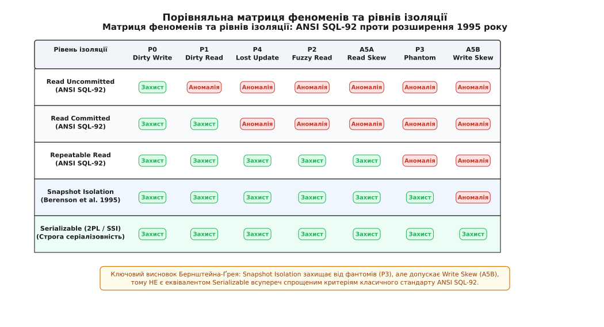
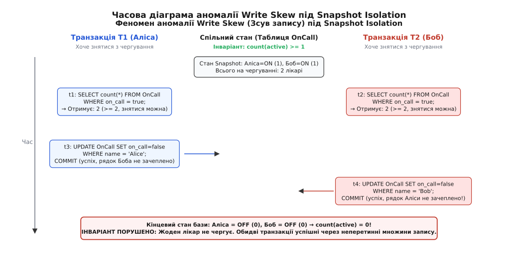
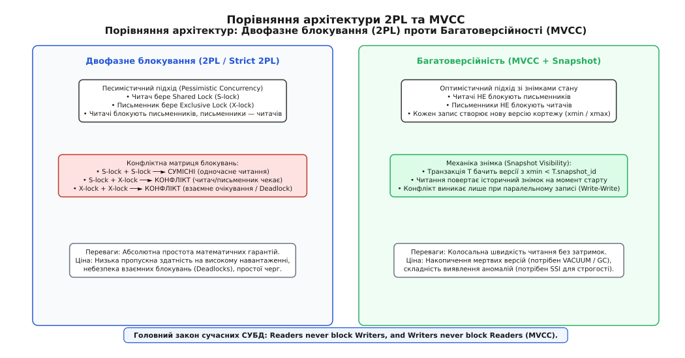
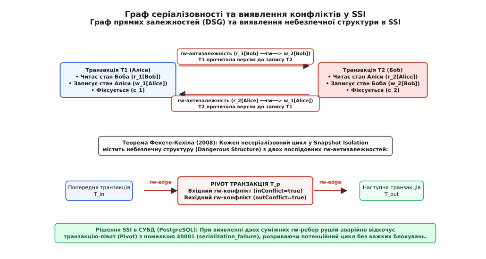

# Рівні ізоляції транзакцій та феномени аномалій

<preknowlist>
- [Транзакції та ACID](book:programming/transactions-acid) — атомарність, консистентність, ізоляція, довговічність та життєвий цикл транзакцій.
- [Песимістичне блокування](book:programming/pessimistic-locking) — блокування рядків та сторінок, ексклюзивні й спільні замки (X/S locks).
- [MVCC](book:programming/mvcc) — багатоверсійне керування паралельним доступом, знімки стану та видимість кортежів.
</preknowlist>

Коли інтернет-магазин оголошує святковий розпродаж і виставляє на вітрину останній ноутбук за акційною ціною, тисячі покупців одночасно тиснуть кнопку оплати. На рівні бази даних кожен запит запускає процедуру: зчитати поточну кількість товару на складі (`count = 1`), перевірити, що залишок більший за нуль, зменшити лічильник на одиницю (`count = 0`) і сформувати запис про замовлення. Якщо сервер бази даних виконує ці операції паралельно без належного розмежування, два незалежні потоки зчитають число 1 в ту саму мілісекунду, обидва визнають покупку валідною, обидва запишуть число 0 і підтвердять оформлення угоди двом різним клієнтам. Система продасть один фізичний предмет двічі, породивши збитки, судові позови та руйнування бізнес-репутації компанії.

Найпростіший спосіб уникнути такої катастрофи — виконувати всі транзакції строго по черзі, в один потік (*Serial Execution*). За послідовного виконання жодна транзакція не здатна побачити незавершений стан іншої або завадити її розрахункам. Але за це математично бездоганне рішення доводиться платити катастрофічним падінням продуктивності: сучасний 64-ядерний сервер з надшвидким NVMe-масивом перетворюється на вузьке горло, здатне обробляти лише одну транзакцію за раз, змушуючи решту 63 процесорних ядер простоювати, а чергу клієнтських з'єднань — зростати в геометричній прогресії.

Інженерна потреба досягти максимальної пропускної здатності паралельного заліза без втрати узгодженості даних породила одну з найглибших концепцій комп'ютерних наук — **спектр рівнів ізоляції транзакцій**.

## Походження понять та природа ізоляції

Слово «ізоляція» походить від латинського *insula* («острів»), через італійське *isolato* («відокремлений, перетворений на острів»). У теорії баз даних ізоляція вимагає, щоб кожна транзакція виконувалася так, ніби вона перебуває на безлюдному острові — повністю захищена від проміжних станів та побічних ефектів будь-яких інших паралельних процесів.

Слово «аномалія» походить від грецького *ἀνωμαλία* (*anomalia* — «нерівність, шорсткість, відхилення від правила або норми», утворене від заперечної частки *ἀν-* та *ὁμαλός* — «рівний, однаковий»). **Транзакційною аномалією (або феноменом, від грецького *φαινόμενον* — «явище, те, що з'являється»)** називають стан бази даних або результат читання, який принципово не міг би виникнути за строго послідовного виконання тих самих транзакцій одна за одною.

Ідеальним еталоном коректності є **серіалізовність (*Serializability*, від латинського *seriālis* — «послідовний, зв'язаний у ланцюг»)**. Розклад виконання множини конкурентних транзакцій називається серіалізовним, якщо його кінцевий результат для стану бази даних та спостережень клієнтів повністю еквівалентний результату деякого послідовного запуску цих самих транзакцій без жодного перекриття в часі.

Оскільки повна серіалізовність вимагає або важких блокувань, або частого відкату транзакцій при найменших конфліктах, інженери створили шкалу рівнів ізоляції. **Рівень ізоляції (*Isolation Level*)** — це формальний контракт між рушієм СУБД та прикладним кодом, який точно визначає, якими саме гарантіями узгодженості база даних готова пожертвувати заради підвищення швидкодії, та які конкретні типи аномалій дозволяється спостерігати клієнтським програмам.

## Класичний стандарт ANSI SQL-92 та його феномени

У 1992 році Американський національний інститут стандартів (ANSI) разом із Міжнародною організацією зі стандартизації (ISO) зафіксував у стандарті SQL-92 чотири класичні рівні ізоляції. Замість складного математичного апарату автори стандарту пішли шляхом від зворотного: вони сформулювали три дискретні феномени порушення ізоляції та визначили кожен рівень через перелік дозволених і заборонених явищ.

```
+──────────────────────────────────────────────────────────────────────────+
|                     СПЕКТР ІЗОЛЯЦІЇ ANSI SQL-92                          |
|                                                                          |
|   Read Uncommitted ──► Read Committed ──► Repeatable Read ──► Serializable|
|   (Найвища швидкість,   (Блокує брудне      (Блокує зміну     (Математична|
|    нуль гарантій)        читання)            рядків)          еквівалентність)
|                                                                          |
| ──► Зростання сили гарантій узгодженості та захисту від аномалій ──────► |
| ◄── Зростання пропускної здатності та ступеня паралелізму ────────────── |
+──────────────────────────────────────────────────────────────────────────+
```

Розглянемо механіку та наслідки кожного з трьох базових феноменів стандарту ANSI SQL-92.

### 1. Феномен P1: Брудне читання (Dirty Read)

**Брудне читання** виникає, коли транзакція `T1` змінює рядок у пам'яті, а паралельна транзакція `T2` зчитує цей модифікований рядок до того, як `T1` виконає команду фіксації (`COMMIT`) або відкату (`ROLLBACK`).

Уявімо бухгалтерську систему:
1. Початковий баланс рахунку клієнта становить 500 грн.
2. Транзакція `T1` починає операцію нарахування премії на 300 грн і оновлює рядок у буфері: `balance = 800`.
3. Паралельна транзакція `T2` починає генерацію виписки за запитом клієнта, зчитує `balance = 800` і відправляє документ клієнту на екран.
4. У транзакції `T1` стається збій валідації (наприклад, перевищено місячний фонд заробітної плати), і рушій виконує `ROLLBACK`. Баланс у базі повертається до 500 грн.

Наслідок: клієнт побачив гроші, яких юридично й фактично ніколи не існувало в базі даних. Транзакція `T2` ухвалила рішення на основі «брудного фантома», створеного і згодом знищеного транзакцією `T1`.

### 2. Феномен P2: Неповторюване або нечітке читання (Non-repeatable / Fuzzy Read)

**Неповторюване читання** виникає, коли транзакція `T1` зчитує значення рядка, після чого паралельна транзакція `T2` змінює або видаляє цей самий рядок і успішно фіксується (`COMMIT`). Коли транзакція `T1` повторно зчитує той самий рядок у межах свого початкового контексту, вона виявляє вже інше значення або бачить, що запис зник.

Сценарій у системі бронювання готелів:
1. Менеджер у транзакції `T1` відкриває картку номера і бачить вартість `price = 2000 грн`.
2. Клієнт у паралельній транзакції `T2` застосовує знижковий промокод, виконує `UPDATE rooms SET price = 1500 WHERE id = 42;` і фіксує транзакцію (`COMMIT`).
3. Менеджер у транзакції `T1` натискає кнопку оформлення договору, система перечитує рядок номера і виявляє суму `price = 1500 грн`.

Наслідок: один і той самий SQL-запит `SELECT price FROM rooms WHERE id = 42;`, виконаний двічі всередині однієї й тієї самої неподільної транзакції `T1`, повернув різні результати. Це ламає логіку прикладних алгоритмів, які розраховують на внутрішню стабільність прочитаного контексту.

### 3. Феномен P3: Фантомне читання (Phantom Read)

**Фантомне читання** виникає, коли транзакція `T1` зчитує набір рядків, що задовольняють певну предикатну умову пошуку (наприклад, `WHERE department = 'IT'`), після чого паралельна транзакція `T2` вставляє нові рядки або змінює наявні так, що вони починають відповідати цьому предикату, і виконує `COMMIT`. Коли транзакція `T1` повторює свій предикатний запит, вона отримує іншу кількість рядків — з'являються «рядки-привиди» (фантоми).

Приклад у системі обліку преміювання:
1. Транзакція `T1` виконує запит аудиту фонду зарплати:
   `SELECT sum(salary) FROM employees WHERE department = 'IT';`
   Запит знаходить 10 співробітників із сумарною зарплатою 500 000 грн.
2. Паралельна транзакція `T2` оформлює прийом нового системного адміністратора:
   `INSERT INTO employees (name, department, salary) VALUES ('Олег', 'IT', 60 000);`
   і викликає `COMMIT`.
3. Транзакція `T1` виконує перевірку середньої виплати:
   `SELECT count(*) FROM employees WHERE department = 'IT';`
   Запит повертає 11 осіб.
4. Транзакція `T1` ділить суму першого кроку (500 000 грн) на кількість другого кроку (11 осіб) і отримує хибне середнє значення 45 454 грн замість реальних 50 000 грн або 50 909 грн.

Різниця між неповторюваним читанням (P2) та фантомним читанням (P3) є принциповою:
- **P2 (Fuzzy Read)** стосується зміни значення **вже наявного рядка**, який транзакція вже зчитала.
- **P3 (Phantom Read)** стосується появи **нового рядка**, якого раніше взагалі не існувало у вибірці предиката.

### Матриця стандарту ANSI SQL-92

На основі заборони цих трьох явищ стандарт сформував класичну матрицю чотирьох рівнів ізоляції:

| Рівень ізоляції ANSI | Брудне читання (P1) | Неповторюване читання (P2) | Фантомне читання (P3) |
| :--- | :--- | :--- | :--- |
| **Read Uncommitted** | Дозволено | Дозволено | Дозволено |
| **Read Committed** | **Заборонено** | Дозволено | Дозволено |
| **Repeatable Read** | **Заборонено** | **Заборонено** | Дозволено |
| **Serializable** | **Заборонено** | **Заборонено** | **Заборонено** |

## Критика 1995 року: прогалини та приховані аномалії стандарту

Попри свою позірну стрункість, класичний стандарт ANSI SQL-92 виявився неповноцінним. У 1995 році дослідники баз даних на чолі з Джимом Ґреєм та Філіпом Бернштейном опублікували фундаментальну статтю *«A Critique of ANSI SQL Isolation Levels»*, де довели, що стандарт страждає на дві важкі вади:
1. Він описував явища вузько, орієнтуючись виключно на застарілу архітектуру замкових блокувань (2PL).
2. Він повністю пропустив критично важливі аномалії, які регулярно руйнують бази даних у реальному житті.

Докладно хроніку цієї наукової дискусії та її наслідки для індустрії викладено в [історії критики рівнів ізоляції стандарту ANSI SQL-92](book:programming/isolation-levels/hist-critique-ansi-sql.md).


*Порівняння матриці ANSI SQL-92 та розширеної моделі Бернштейна-Ґрея: феномени P0–P4, Read/Write Skew та місце Snapshot Isolation.*

Розглянемо небезпечні аномалії, відкриті та класифіковані дослідниками у 1995 році.

### 1. Аномалія P0: Брудний запис (Dirty Write)

**Брудний запис** виникає, коли транзакція `T1` змінює об'єкт `x`, а транзакція `T2` перезаписує цей самий об'єкт `x` до того, як `T1` зафіксувалася (`COMMIT`) або відкотилася (`ROLLBACK`).

```
Транзакція 1 (T1)              Транзакція 2 (T2)              Значення x в базі
─────────────────              ─────────────────              ─────────────────
w₁[x = 10]                                                    x = 10
                               w₂[x = 20]                     x = 20
a₁ (ROLLBACK)                                                 x = ??? (0 чи 20?)
                               c₂ (COMMIT)
```

Якщо транзакція `T1` скасовується (`ROLLBACK`), рушій відновлює старий образ з журналу відкату (наприклад, `x = 0`). При цьому зміна транзакції `T2` (`x = 20`), яка успішно зафіксувалася, безслідно знищується. Більше того, якщо `T1` та `T2` паралельно оновлювали два зв'язані об'єкти `x` та `y`, брудний запис може призвести до того, що в базі залишиться `x` від транзакції `T1` та `y` від транзакції `T2`, змішуючи непов'язані стани та назавжди ламаючи інваріанти цілісності.

Через катастрофічний характер руйнувань **жодна реляційна СУБД у світі не допускає брудного запису (P0)** навіть на найнижчому рівні `Read Uncommitted`.

### 2. Аномалія P4: Втрачене оновлення (Lost Update)

**Втрачене оновлення** відбувається, коли дві транзакції одночасно зчитують один і той самий стан рядка, обчислюють нове значення на основі прочитаного, а потім послідовно записують результат назад:

```
Транзакція T1 (Зняття 100 грн)  Транзакція T2 (Зняття 200 грн)  Баланс у базі (DRAM/Диск)
─────────────────────────────  ─────────────────────────────  ─────────────────────────
                                                              Баланс = 1000 грн
r₁[Баланс = 1000]
                               r₂[Баланс = 1000]
w₁[Баланс = 900] (1000 - 100)                                 Баланс = 900 грн
c₁ (COMMIT)
                               w₂[Баланс = 800] (1000 - 200)  Баланс = 800 грн (!)
                               c₂ (COMMIT)
```

Обидва клієнти успішно зняли гроші (разом 300 грн), але в базі баланс зменшився лише на 200 грн: транзакція `T2` перетерла запис транзакції `T1`. Рівень `Read Committed` не рятує від цієї аномалії, оскільки після завершення читання на першому кроці блокування читання негайно знімається.

### 3. Аномалія A5A: Зсув читання (Read Skew)

**Зсув читання** проявляється, коли між двома сутностями `x` та `y` існує спільний балансовий зв'язок (`x + y = 1000`), а транзакція зчитує їх окремими кроками, між якими інша транзакція переміщує баланс:

1. Рахунок `x = 500 грн`, рахунок `y = 500 грн`. Сума: 1000 грн.
2. Транзакція аудиту `T1` зчитує `x`: отримує 500 грн.
3. Транзакція переказу `T2` знімає 400 грн з `x` і додає 400 грн до `y`: тепер `x = 100`, `y = 900`. Транзакція `T2` фіксується (`COMMIT`).
4. Транзакція `T1` продовжує аудит і зчитує `y`: отримує 900 грн.
5. Транзакція `T1` підсумовує `500 + 900 = 1400 грн` і фіксує «появу» 400 неіснуючих гривень.

### 4. Аномалія A5B: Зсув запису (Write Skew)

**Зсув запису** — найтонша та найнебезпечніша аномалія багатоверсійних систем. Вона виникає, коли дві паралельні транзакції читають перетинні або однакові множини даних, перевіряють спільний інваріант узгодженості, але модифікують **різні, неперетинні рядки**.

Класична ілюстрація — проблема чергових лікарів у лікарні (*The On-Call Doctor Problem*).
Бізнес-правило клініки: **у відділенні завжди повинен залишатися на зв'язку щонайменше один черговий лікар** (`count(active_doctors) >= 1`).


*Часова послідовність виникнення аномалії зсуву запису (Write Skew): паралельні транзакції перевіряють спільний інваріант і змінюють неперетинні рядки.*

Хід подій під знімковою ізоляцією (Snapshot Isolation):
1. На чергуванні перебувають двоє лікарів: Аліса (`status = true`) та Боб (`status = true`). Кількість чергових: 2.
2. Аліса почувається зле і хоче піти додому. Її клієнт відкриває транзакцію `T1` і перевіряє:
   `SELECT count(*) FROM doctors WHERE on_call = true;` → Результат: 2.
   Оскільки `2 >= 2`, Аліса має законне право піти.
3. Одночасно Боб також хоче знятися з чергування. Його транзакція `T2` перевіряє той самий стан:
   `SELECT count(*) FROM doctors WHERE on_call = true;` → Результат: 2.
   Боб також отримує дозвіл.
4. Транзакція `T1` виконує: `UPDATE doctors SET on_call = false WHERE name = 'Alice'; COMMIT;`
5. Транзакція `T2` виконує: `UPDATE doctors SET on_call = false WHERE name = 'Bob'; COMMIT;`

Результат: обидві транзакції успішно зафіксовані. Але в таблиці `doctors` не залишилося жодного чергового лікаря (`count = 0`). Глобальний інваріант лікарні грубо порушено.

Чому знімкова ізоляція (Snapshot Isolation) пропустила цю катастрофу:
- Транзакція `T1` змінювала рядок Аліси.
- Транзакція `T2` змінювала рядок Боба.
- Правило захисту від конфліктів запису (*First-Committer-Wins / Write-Write Conflict Detection*) перевіряє лише фізичний збіг змінених рядків. Оскільки множини запису транзакцій не перетиналися (`{Alice} ∩ {Bob} = ∅`), рушій СУБД не зафіксував конфлікту і дозволив обидва коміти.

Цей приклад демонструє головний висновок статті 1995 року: **Snapshot Isolation захищає від брудного читання (P1), неповторюваного читання (P2), фантомів (P3), втраченого оновлення (P4) та зсуву читання (A5A), але ДОПУСКАЄ зсув запису (Write Skew)**. Тому Snapshot Isolation не є справжньою серіалізовністю, всупереч застарілим критеріям ANSI SQL-92.

## Внутрішні механізми реалізації ізоляції

Щоб реалізувати описані рівні ізоляції на практиці, архітектори сучасних баз даних використовують два фундаментальні сімейства механізмів: песимістичне замкове керування (2PL) та оптимістичну багатоверсійність (MVCC / SSI).


*Порівняння механізмів досягнення ізоляції: блокування читачів і письменників у 2PL проти неблокувальних знімків стану в MVCC.*

### 1. Двофазне блокування (Two-Phase Locking, 2PL)

Песимістичний підхід базується на виставленні блокувань у пам'яті:
- **Спільне блокування (Shared / S-lock)**: береться для операцій читання. Кілька транзакцій можуть одночасно читати один і той самий рядок.
- **Монопольне блокування (Exclusive / X-lock)**: береться для операцій модифікації (`INSERT`, `UPDATE`, `DELETE`). Лише одна транзакція може утримувати X-lock на рядку; будь-які інші читачі чи письменники блокуються й чекають.

Класичний протокол 2PL складається з двох фаз:
1. **Фаза зростання (*Growing Phase*)**: транзакція може захоплювати нові блокування, але не має права відпускати жодного з уже взятих.
2. **Фаза стискання (*Shrinking Phase*)**: транзакція починає відпускати замки, але більше не може отримати жодного нового блокування.

У промислових СУБД використовується суворіший варіант — **Строге двофазне блокування (Strict 2PL / SS2PL)**, де всі монопольні (а в SS2PL — і спільні) замки утримуються до самого моменту `COMMIT` або `ROLLBACK`. Це гарантує повну відсутність каскадних відкатів і виключає аномалії P0, P1, P2 та Lost Update.

Для боротьби з фантомами (P3) у блокувальних рушіях застосовують **предикатні блокування (*Predicate Locks*)** або **блокування наступного ключа (*Next-Key Locks*)** в B-деревах, які блокують не лише наявні записи, а й інтервали між ключами індексу, куди міг би вставитися новий фантомний рядок. Пряма перевірка предикатних умов у загальному випадку реляційної алгебри є обчислювально нерозв'язною або NP-повною задачею, тому рушії СУБД завжди апроксимують предикати через фізичні діапазони сторінок або вузлів індексу.

### 2. Багатоверсійне керування паралелізмом (MVCC)

Головний недолік 2PL — низька швидкість: читачі блокують письменників, а письменники блокують читачів. Сучасні рушії (PostgreSQL, MySQL InnoDB, Oracle) базуються на архітектурі MVCC, де кожна операція запису не перезаписує старий рядок, а створює його **нову версію** зі службовими мітками часу або ідентифікаторами транзакцій створення (`xmin`) та видалення (`xmax`).

Золоте правило MVCC звучить так: **читачі ніколи не блокують письменників, а письменники ніколи не блокують читачів**.

Коли транзакція виконує запит, СУБД надає їй **знімок стану (*Snapshot*)** — перелік зафіксованих на цей момент транзакцій:
- На рівні **`READ COMMITTED`**: новий знімок генерується **перед кожним окремим SQL-виразом** (*Statement Snapshot*). Якщо між двома запитами всередині транзакції інший процес зафіксує зміни, другий запит побачить новий знімок (звідси можливе неповторюване читання P2).
- На рівні **`REPEATABLE READ` (Snapshot Isolation)**: знімок фіксується **один раз на самому початку транзакції** (*Transaction Snapshot*) і залишається незмінним до кінця. Усі запити читають стан бази на момент старту, що повністю виключає P1, P2, P3 та Read Skew.

Усередині сторінок пам'яті PostgreSQL кожен кортеж містить бітові маски підказок (*Hint Bits*): `HEAP_XMIN_COMMITTED` та `HEAP_XMIN_INVALID`. Коли перший читач перевіряє статус транзакції `xmin` через глобальний журнал фіксацій (Commit Log / CLOG), він виставляє відповідний біт безпосередньо в заголовку кортежу. Усі наступні читачі дізнаються статус видимості рядка за одну інструкцію процесора, не звертаючись до CLOG і не генеруючи між'ядерного трафіку кеш-пам'яті.

### 3. Серіалізовна знімкова ізоляція (Serializable Snapshot Isolation, SSI)

Як забезпечити математично строгу серіалізовність без важких блокувань 2PL? Відповіддю став алгоритм SSI, розроблений у 2008 році Майклом Кехілом та впроваджений у PostgreSQL 9.1.

Математична основа SSI базується на аналізі графа прямої серіалізації (DSG). Докладно структуру цих графів та доведення розібрано у [математичній теорії графів серіалізовності та формалізації Адьї](book:programming/isolation-levels/math-serializability-and-adya.md).


*Граф прямих залежностей (DSG) та відстеження небезпечної структури з двох послідовних rw-антизалежностей у рушії Serializable Snapshot Isolation.*

SSI дозволяє транзакціям працювати паралельно за правилами швидкого Snapshot Isolation, але фоново відстежує виникнення конфліктів читання-запису (**rw-антизалежностей**, коли транзакція `T1` прочитала версію рядка, яку згодом перезаписала `T2`).

Теорема Фекете-Кехіла доводить: будь-який несеріалізовний розклад під Snapshot Isolation обов'язково утворює в графі залежностей **небезпечну структуру з двох суміжних rw-ребер (`T_in ──rw──> T_pivot ──rw──> T_out`)**.

Коли рушій SSI виявляє таку структуру, він не ставить блокування, а дозволяє транзакціям працювати далі. Лише в момент спроби фіксації (`COMMIT`) транзакції-півота рушій примусово скасовує її з кодом помилки `40001 (serialization_failure)`.

## Декларативні обмеження проти серіалізовності

Часто виникає питання: чи не можна замінити серіалізацію транзакцій звичайними декларативними обмеженнями схеми (`CHECK`, `FOREIGN KEY`, `UNIQUE`)?

Декларативні обмеження чудово працюють для локальних інваріантів окремого рядка (`age >= 18` або `balance >= 0`). Проте для багаторядкових або міжтабличних правил декларативні обмеження виявляються безсилими без відповідного рівня ізоляції:
- Обмеження `CHECK` у більшості СУБД не може містити підзапити до інших рядків чи таблиць.
- Навіть якщо обмеження реалізовано через користувацьку функцію в тригері `BEFORE INSERT OR UPDATE`, на рівні `Read Committed` паралельні транзакції виконають тригер одночасно, обидві побачать старий стан і обидві пропустять неприпустимі записи.
- Спеціальні конструкції, такі як `EXCLUDE USING gist` у PostgreSQL, здатні захистити від перетину часових інтервалів чи геопросторових зон, але вони вимагають побудови спеціальних індексів і не масштабуються на довільні бізнес-правила.

Тому серіалізовність залишається єдиним універсальним бар'єром, що гарантує виконання складних інваріантів доменної моделі.

## Розподілена ізоляція та лінеаризовність

У сучасних розподілених базах даних (Google Spanner, CockroachDB, YugabyteDB) поняття ізоляції набуває додаткового виміру через фізичну відстань між вузлами та відносність часу. 

Звичайна однонодова серіалізовність гарантує лише те, що транзакції можна вибудувати в *якийсь* послідовний порядок. Вона не гарантує, що цей порядок відповідатиме фізичному плину реального часу. Якщо користувач A у Лондоні виконав транзакцію `T1`, зателефонував користувачеві B у Токіо, і користувач B запустив транзакцію `T2`, звичайна серіалізовність формально дозволяє базі даних упорядкувати `T2` перед `T1` у внутрішньому графі розкладу.

Щоб унеможливити такі парадокси часу, розподілені системи вводять поняття **строгої серіалізовності (*Strict Serializability / Linearizable Serializability / External Consistency*)**:
- Якщо транзакція `T1` зафіксувалася в реальному часі до того, як транзакція `T2` стартувала на будь-якому вузлі планети (`commit_time(T1) < start_time(T2)`), то `T1` зобов'язана передувати `T2` в серіалізованому порядку.

Для досягнення цієї гарантії розподілені СУБД використовують або апаратні атомні годинники з GPS-синхронізацією (технологія *TrueTime* у Google Spanner з інтервалом невизначеності ε ≈ 7 мс), або гібридні логічні годинники (*Hybrid Logical Clocks, HLC*) у поєднанні з протоколами розподіленого консенсусу Raft чи Paxos.

## Практичний вибір рівня ізоляції та обробка конфліктів

У реальній архітектурі бекенд-систем вибір рівня ізоляції — це завжди інженерний компроміс між надійністю, простотою коду та навантаженням на процесор і пам'ять.

Детальний опис синтаксису конфігурації, діалектів PostgreSQL/MySQL/Oracle та модифікаторів вибірки наведено в [довіднику інтерфейсів SQL, матриці рушіїв та операторах блокувань](book:programming/isolation-levels/api-sql-isolation-matrix.md).

> 🔧 **Навіщо це.**
> У мікросервісній архітектурі використання дефолтного рівня `Read Committed` вимагає від програміста ручного захисту від втрачених оновлень через атомарні SQL-вирази (`UPDATE accounts SET balance = balance - 100 WHERE id = 42 AND balance >= 100;`) або явне песимістичне блокування `SELECT ... FOR UPDATE`.
> Якщо ж бізнес-логіка містить складні багаторядкові перевірки (як у задачі чергових лікарів), єдиним надійним захистом є використання справжнього рівня `SERIALIZABLE` з обов'язковим клієнтським циклом перезапуску транзакцій (*Retry Loop*).

### Обробка помилок серіалізації в прикладному коді

При переході на рівні `REPEATABLE READ` або `SERIALIZABLE` клієнтський додаток **зобов'язаний бути готовим до того, що будь-який запит або команда `COMMIT` може завершитися аварійним відкатом**.

Для безпечної роботи застосовується патерн автоматичного повторення з експоненційною затримкою та джитером (*Exponential Backoff with Full Jitter*). Практичну реалізацію такого виконавця мовами C++ та C наведено у [практичному стенді відтворення аномалій та стійкому транзакційному виконавці](book:programming/isolation-levels/proj-anomaly-reproducer.md).

Схематично логіка стійкого транзакційного циклу виглядає так:

```
                  ┌────────────────────────┐
                  │ Початок транзакції     │
                  │ BEGIN TRANSACTION      │
                  │ ISOLATION SERIALIZABLE │
                  └───────────┬────────────┘
                              │
                              ▼
                  ┌────────────────────────┐
                  │ Виконання бізнес-коду  │◄───────────────────┐
                  │ (Тільки ідемпотентні   │                    │
                  │  операції в пам'яті!)  │                    │
                  └───────────┬────────────┘                    │
                              │                                 │
                              ▼                                 │
                  ┌────────────────────────┐                    │
                  │ Спроба фіксації:       │                    │
                  │ COMMIT                 │                    │
                  └───────────┬────────────┘                    │
                              │                                 │
                 Успіх? ──────┴────── Збій серіалізації         │
                   │                  (SQLSTATE 40001 / 40P01)  │
                   │                             │              │
                   ▼                             ▼              │
        ┌────────────────────┐        ┌───────────────────────┐ │
        │ Транзакція успішна │        │ Вичерпано спроби?     │ │
        │ Завершення роботи  │        └──────────┬────────────┘ │
        └────────────────────┘             Ні    │    Так       │
                                           ┌─────┴─────┐        │
                                           │           │        │
                                           ▼           ▼        │
                     ┌──────────────────────────┐  ┌──────────┐ │
                     │ Пауза (Backoff + Jitter) │  │ Викид    │ │
                     │ Sleep(rand(0, 2^k * T0)) │  │ помилки  │ │
                     └─────────────┬────────────┘  │ нагору   │ │
                                   │               └──────────┘ │
                                   └────────────────────────────┘
```

## Інженерні підсумки та матриця рішень

Підсумуємо критерії вибору рівня ізоляції для типових бізнес-задач:

1. **`Read Committed` (За замовчуванням у PostgreSQL, Oracle, MS SQL)**:
   - *Коли обирати*: 90% стандартних CRUD-операцій, аналітичні запити, фонове читання, де поодинокі некритичні невідповідності не руйнують бізнес.
   - *Чого остерігатися*: Втраченого оновлення (P4). Обов'язково використовувати атомарні `UPDATE ... SET x = x + 1` або `SELECT ... FOR UPDATE`.

2. **`Repeatable Read / Snapshot Isolation` (За замовчуванням у MySQL InnoDB)**:
   - *Коли обирати*: Генерація складних фінансових звітів на великих обсягах даних, резервне копіювання, пакетна обробка документів, де звіт повинен бачити узгоджений зріз часу без блокування паралельних користувачів.
   - *Чого остерігатися*: Зсуву запису (Write Skew). Якщо транзакція перевіряє спільні інваріанти між різними рядками, цей рівень не гарантує цілісності.

3. **`Serializable` (SSI в PostgreSQL або 2PL в MS SQL Server)**:
   - *Коли обирати*: Фінансові транзакції з перехресними балансами, складні системи бронювання, медичні протоколи чергування, аукціонні ставки.
   - *Ціна рішення*: Необхідність проектування ідемпотентних транзакцій та написання циклів повтору (*Retry Loops*) для коректної обробки помилок серіалізації `40001`.
