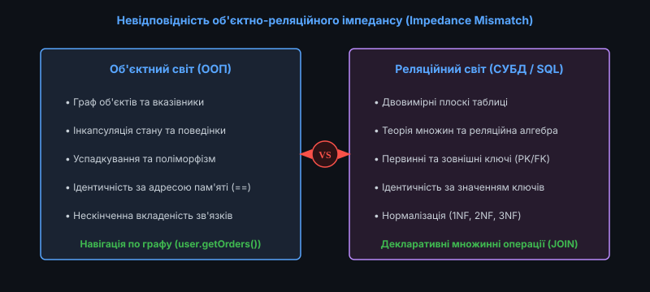
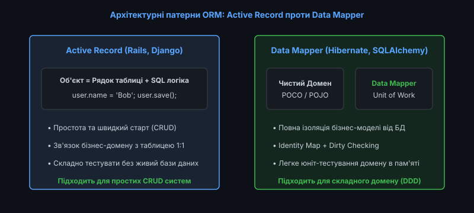
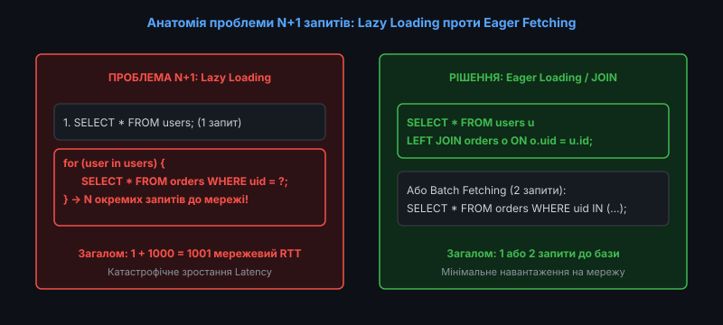
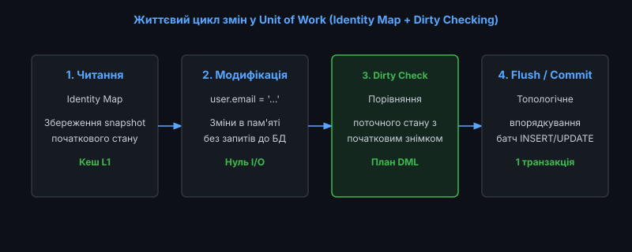

# 📜 Об'єктно-реляційне відображення (ORM) та проблема невідповідності імпедансів

<preknowlist>
- [Реляційна модель даних](topic:programming/relational-model)
- [Індекси баз даних: B-Tree та Hash](topic:programming/database-indexes)
- [Планувальник та оптимізатор запитів](topic:programming/query-planner)
- [Транзакції та властивості ACID](topic:programming/transactions-acid)
- [Рівні ізоляції транзакцій](topic:programming/isolation-levels)
</preknowlist>

У розробці корпоративних інформаційних систем більшість прикладного коду пишеться об'єктно-орієнтованими мовами програмування (Java, C#, Python, TypeScript, C++), тоді як основним сховищем бізнес-даних залишаються реляційні системи керування базами даних (PostgreSQL, MySQL, Oracle).

Для поєднання цих двох несумісних світів індустрія створила технологію **об'єктно-реляційного відображення (Object-Relational Mapping, ORM)**. ORM автоматизує трансляцію між об'єктами в оперативній пам'яті та рядками в таблицях СУБД, приховуючи низькорівневі деталі формування SQL-запитів і керування підключеннями.

Проте за зручність абстракції доводиться платити: нерозуміння внутрішніх механізмів ORM призводить до критичних проблем продуктивності, витоку пам'яті та генерації неоптимальних SQL-запитів.


*Конфлікт парадигм: граф об'єктів із вказівниками та поведінкою проти нормалізованих плоских реляційних таблиць*

---

### Невідповідність об'єктно-реляційного імпедансів (Impedance Mismatch)

Термін «невідповідність імпедансів» запозичено з електротехніки, де він позначає втрату енергії при з'єднанні двох кіл із різним внутрішнім опором. У програмній інженерії він описує фундаментальні розбіжності між об'єктною та реляційною парадигмами:

#### 1. Парадигма зв'язків та навігації
* **В об'єктному світі**: Зв'язки між сутностями реалізуються через прямі вказівники на адреси пам'яті (`user.orders`). Обхід графа є спрямованим та виконується природною навігацією за посиланнями.
* **У реляційному світі**: Зв'язки виражаються декларативно через збіг значень первинних та зовнішніх ключів (`orders.user_id = users.id`). Зв'язки є двоспрямованими та обчислюються під час виконання операції `JOIN`.

#### 2. Проблема успадкування та поліморфізму
* **Об'єктна модель**: Підтримує ієрархії успадкування (`class AdminUser extends User`), поліморфні виклики методів та абстрактні класи.
* **Реляційна модель**: Не має вбудованої концепції наслідування типів; існує лише поняття плоского відношення. Для відображення успадкування доводиться обирати між компромісними стратегіями: єдина таблиця на всю ієрархію (Single Table Inheritance), окрема таблиця для кожного конкретного класу (Table Per Class) або нормалізовані з'єднані таблиці (Joined Table Inheritance).

#### 3. Ідентичність та порівняння сутностей
* **В ООП**: Два об'єкти вважаються ідентичними, якщо вони вказують на одну адресу в пам'яті (`a == b`), або еквівалентними, якщо їхні поля збігаються (`a.equals(b)`).
* **У базах даних**: Рядки ідентифікуються за унікальним значенням первинного ключа (Primary Key), незалежно від того, де й скільки разів вони були завантажені у клієнтські процеси.

#### 4. Інкапсуляція стану проти відкритості даних
В ООП стан об'єкта захищений модифікаторами доступу (`private`), а взаємодія відбувається виключно через публічні методи бізнес-поведінки. У реляційній базі даних усі стовпці є принципово відкритими для запитів, фільтрацій та агрегацій будь-яким авторизованим клієнтом.

Історію боротьби інженерів із цим конфліктом від ранніх об'єктних баз до сучасних стандартів детально викладено у вставці [Еволюція ORM: від об'єктних СУБД до сучасних Data Mapper](topic:programming/orm/hist-evolution-orm.md).

---

### Архітектурні патерни ORM: Active Record проти Data Mapper

Усі сучасні ORM-бібліотеки базуються на одному з двох класичних архітектурних патернів, сформульованих Мартіном Фаулером:


*Порівняння патернів: пряме поєднання даних і SQL-методів в Active Record проти повної ізоляції домену в Data Mapper*

#### 1. Патерн Active Record
В Active Record один клас представляє один рядок реляційної таблиці та одночасно містить як бізнес-дані, так і методи прямої взаємодії з базою даних:

```ruby
# Приклад Active Record (Ruby on Rails)
user = User.find(42)
user.email = 'new_email@example.com'
user.save() # Прямий виклик DML-інструкції в базу
```

* **Переваги**: Надзвичайна простота використання, мінімальний поріг входу, висока швидкість створення типових CRUD-додатків.
* **Недоліки**: Жорстке зв'язування (Tight Coupling) бізнес-логіки зі схемою таблиці; неможливість ізольованого модульного тестування доменних моделей без підключення до реальної бази даних.

#### 2. Патерн Data Mapper
Data Mapper повністю відокремлює доменні класи (Plain Old Objects) від механізмів збереження. Сама сутність нічого не знає про існування SQL або таблиць, а всю роботу з трансформації виконує спеціальний проміжний шар:

```csharp
// Приклад Data Mapper (Entity Framework Core)
var user = repository.FindById(42); // Чистий POCO об'єкт
user.ChangeEmail("new_email@example.com"); // Чистий бізнес-метод без SQL
unitOfWork.Commit(); // Пакетне збереження змін через Data Mapper
```

* **Переваги**: Повна чистота доменної моделі (Domain-Driven Design), легкість тестування через імітаційні об'єкти (Mocks), гнучкість мапінгу складної бізнес-моделі на денормалізовані або нормалізовані таблиці.
* **Недоліки**: Більш висока архітектурна складність, необхідність керування життєвим циклом контексту сесії.

---

### Анатомія проблеми N+1 запитів та стратегії Fetching

Найпоширенішою помилкою при використанні ORM є проблема **N+1 запитів (N+1 Query Problem)**, що виникає при неконтрольованому ледачому завантаженні (Lazy Loading).


*Катастрофічне зростання затримок: N+1 окремих звернень до мережі проти одного ефективного реляційного JOIN*

#### Механізм виникнення проблеми
1. Додаток виконує 1 первинний запит: `SELECT * FROM users WHERE active = true;` (отримано 1000 користувачів).
2. Далі у коді розробник ітерується по списку для відображення кількості замовлень:
   ```python
   for user in users:
       print(len(user.orders)) # Кожне звернення неявно виконує окремий SQL!
   ```
3. ORM генерує **1000 додаткових запитів**: `SELECT * FROM orders WHERE user_id = ?;`.

Замість одного швидкого звернення система робить 1001 мережевий запит, що призводить до багаторазового збільшення затримок через передачу пакетів мережею (Round-Trip Time).

Математичне доведення обчислювальної складності та детальні розрахунки RTT наведено у вставці [Математичний аналіз обчислювальної складності та мережевих затримок проблеми N+1](topic:programming/orm/math-n-plus-one-complexity.md).

#### Стратегії розв'язання проблеми N+1:
* **Eager Loading (Жадібне завантаження через JOIN)**: Використання оператора `JOIN FETCH` для вибірки батьківських і дочірніх рядків за 1 запит.
* **Batch Fetching (Пакетна вибірка через IN)**: Виконання 2 запитів: перший завантажує користувачів, а другий завантажує всі замовлення пакетно через `WHERE user_id IN (1, 2, ..., 1000)`.

---

### Патерни Unit of Work, Identity Map та Dirty Checking

В основі промислових Data Mapper систем лежить тріада фундаментальних компонентів:


*Життєвий цикл змін: завантаження в Identity Map, мутація в пам'яті, Dirty Checking та пакетний комміт*

1. **Identity Map (Карта ідентичності / Кеш L1)**: Гарантує, що для кожного унікального рядка бази даних у межах поточної сесії існує рівно один екземпляр об'єкта в оперативній пам'яті. Повторні запити за тим самим `id` повертають посилання на існуючий об'єкт без повторного звернення до диска СУБД.
2. **Dirty Checking (Автоматичне відстеження змін)**: Під час завантаження сутності ORM зберігає внутрішній знімок (Snapshot) початкових значень її полів. Перед виконанням транзакції рушій попарно порівнює поточний стан сутності зі знімком і генерує `UPDATE` виключно для тих об'єктів, які реально зазнали модифікації.
3. **Unit of Work (Одиниця роботи)**: Накопичує всі операції вставки, оновлення та видалення за час бізнес-транзакції. Під час виклику методу `flush()` Unit of Work виконує топологічне сортування графа сутностей з урахуванням зовнішніх ключів і виконує пакетні DML-запити в єдиній транзакції.

---

### Реалізація базового мапера та перевірки змін

Для закріплення розуміння механізмів ORM розглянемо базову реалізацію відстеження стану на рівні структур мов C та C++:

:::tabs
@tab C
```c
#include <stdio.h>
#include <stdbool.h>
#include <string.h>

typedef struct {
    int id;
    char username[32];
    char email[64];
} user_record_t;

typedef struct {
    user_record_t current;
    user_record_t snapshot; // Початковий знімок для Dirty Checking
    bool is_dirty;
} persistence_context_entry_t;

void check_and_save(persistence_context_entry_t *entry) {
    if (strcmp(entry->current.username, entry->snapshot.username) != 0 ||
        strcmp(entry->current.email, entry->snapshot.email) != 0) {
        entry->is_dirty = true;
        printf("[SQL] UPDATE users SET username='%s', email='%s' WHERE id=%d;\n",
               entry->current.username, entry->current.email, entry->current.id);
        entry->snapshot = entry->current; // Синхронізація знімка
    } else {
        printf("[No-Op] Сутність id=%d не змінювалася. SQL запит пропущено.\n", entry->current.id);
    }
}
```
@tab C++
```cpp
#include <iostream>
#include <string>
#include <memory>

struct UserRecord {
    int id;
    std::string username;
    std::string email;
};

class PersistenceEntry {
public:
    UserRecord current;
    UserRecord snapshot;

    PersistenceEntry(UserRecord record) : current(record), snapshot(record) {}

    void flush() {
        if (current.username != snapshot.username || current.email != snapshot.email) {
            std::cout << "[SQL] UPDATE users SET username='" << current.username 
                      << "', email='" << current.email 
                      << "' WHERE id=" << current.id << ";\n";
            snapshot = current;
        } else {
            std::cout << "[No-Op] Змін для id=" << current.id << " не виявлено.\n";
        }
    }
};
```
:::

Повну робочу реалізацію рушія Data Mapper та Unit of Work мовами C та C++ наведено у практичному проєкті [Розробка міні-ORM: патерни Data Mapper та Unit of Work](topic:programming/orm/proj-mini-orm-data-mapper.md).

---

### Коли ORM шкодить: межі застосування та витік абстракцій

Відомий експерт Тед Ньюард (Ted Neward) назвав ORM «В'єтнамом комп'ютерних наук»: технологією, яка починається як легке розв'язання проблеми, але поступово перетворюється на нескінченне джерело складних побічних ефектів.

#### Головні недоліки та антипатерни використання ORM:
1. **Витік абстракцій (Leaky Abstraction)**: Розробник, який не знає внутрішнього устрою бази даних, пише наївний об'єктний код, що призводить до блокування таблиць, взаємних блокувань (Deadlocks) та проблеми N+1.
2. **Неефективність для масивної аналітики (OLAP / Reporting)**: Спроба завантажити мільйон рядків через ORM вимагає гігабайтів пам'яті для створення об'єктів та роботи Identity Map. Для складних звітів, агрегацій (`GROUP BY`) та пакетної обробки слід використовувати чистий SQL або легкі Query Builders (jOOQ, Dapper).
3. **Надлишковість колонок (Over-fetching)**: За замовчуванням ORM вибирає всі поля сутності (`SELECT *`), включно з важкими текстовими полями або бінарними блобами, що марно навантажує пропускну здатність мережі.
4. **Непрозорість каскадних транзакцій**: Неправильно налаштовані анотації каскадування (CascadeType.ALL) можуть призвести до ненавмисного видалення або перезапису великих пов'язаних таблиць при збереженні одного головного об'єкта.
5. **Небезпека втрати продуктивності на трансляції LINQ / HQL**: Складні вкладені вирази об'єктних запитів можуть транслюватися у вкрай неоптимальні SQL-конструкції з десятками корельованих підзапитів, які оптимізатор СУБД не здатен перетворити на ефективні плани виконання.
6. **Проблема відключеного стану (Detached Entities) у розподілених системах**: При передачі об'єктів через мережеві RPC або черги повідомлень сутності втрачають зв'язок із контекстом сесії, що викликає винятки `LazyInitializationException` при спробі звернутися до зв'язаних колекцій на іншому вузлі.
7. **Конкуренція за блокування рядків при автоматичному Flush**: Неявний виклик `flush()` перед виконанням будь-якого нового JPQL/HQL запиту може несподівано захоплювати блокування рядків задовго до завершення транзакції, створюючи умови для взаємних блокувань.

Повний довідник із тонкого налаштування продуктивності та оптимізації запитів доступний у вставці [Практичний довідник оптимізації продуктивності ORM](topic:programming/orm/api-orm-performance-guide.md).

---

### Підсумкові правила проєктування роботи з базами даних

1. **Контролюйте згенерований SQL**: Завжди перевіряйте фінальний текст запитів у логах розробки та аналізуйте плани виконання за допомогою `EXPLAIN ANALYZE`.
2. **Вимикайте Change Tracking для операцій читання**: Використовуйте режим `AsNoTracking()` або DTO-проекції для всіх сценаріїв, що не передбачають модифікації даних.
3. **Уникайте неявного Lazy Loading у веб-відповідях**: Завантажуйте всі необхідні зв'язки явно у сервісному шарі через `Eager Fetching`, щоб запобігти випадковим зверненням до бази під час серіалізації JSON.
4. **Використовуйте пакетну вставку (Batching)**: При додаванні великої кількості записів налаштовуйте JDBC Batch Size або використовуйте прямі інструкції `bulk_insert`.
5. **Обирайте правильний інструмент під задачу**: Використовуйте повноцінний ORM для складної транзакційної бізнес-логіки (OLTP), а для аналітики, звітів та високоінтенсивних конвеєрів обирайте SQL-first бібліотеки.
6. **Захищайтеся від декартового вибуху при множинних зв'язках**: При вибірці кількох колекцій застосовуйте Split Queries або Batch Fetching замість одного велетенського `JOIN`.
7. **Уникайте антипатерну Open-Session-In-View**: Закривайте з'єднання з базою даних одразу після завершення бізнес-логіки в сервісному шарі, не залишаючи контекст відкритим під час генерації відповідей користувачам.
8. **Враховуйте вартість об'єктного графа у пам'яті**: Для фонової обробки мільйонів записів обов'язково періодично очищайте Persistence Context за допомогою `clear()` або `detach()`.
9. **Контролюйте автоматичний Flush**: Налаштовуйте режим `FlushMode.COMMIT` для важких читаючих операцій, щоб уникнути передчасного виконання брудних перевірок у середині бізнес-транзакції.
