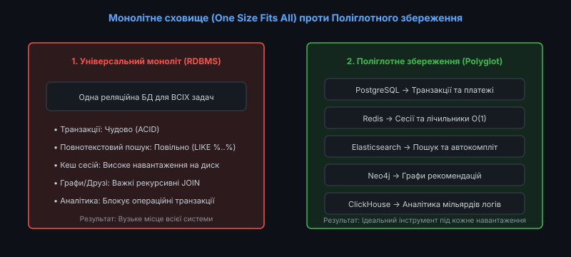
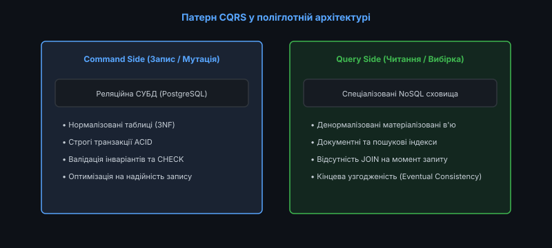
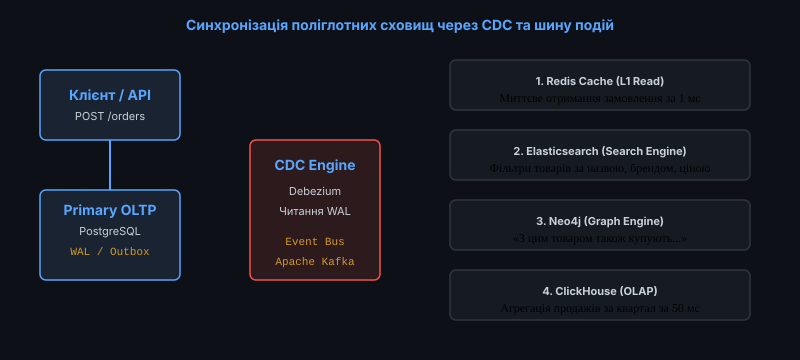

# 📜 Поліглотне збереження даних (Polyglot Persistence)

<preknowlist>
- [Реляційна модель даних](topic:programming/relational-model)
- [Ландшафт NoSQL: Key-Value, Document, Column-Family та Graph](topic:programming/nosql-landscape)
- [Моделювання даних під шаблони доступу (Access-Pattern-First)](topic:programming/access-pattern-first)
- [Транзакції та властивості ACID](topic:programming/transactions-acid)
- [Цикл подій (Event Loop) та асинхронні моделі](topic:programming/event-loop)
</preknowlist>

Протягом кількох десятиліть домінуючою практикою в індустрії програмного забезпечення була концепція єдиної універсальної бази даних (One Size Fits All): усі бізнес-процеси організації спиралися на централізовану реляційну СУБД. Реляційна модель пропонувала надійні гарантії ACID та гнучкість мови SQL, що вважалося достатнім для вирішення будь-яких прикладних задач.

Проте бурхливий розвиток високонавантажених веб-платформ (e-commerce гіганти, соціальні мережі, фінтех-системи) виявив фундаментальну проблему: різні функціональні модулі однієї системи мають діаметрально протилежні вимоги до збереження та обробки інформації.

Спроба задовольнити всі потреби за допомогою одного універсального рушія призводить до компромісів, де жоден компонент не працює оптимально.

Відповіддю на цей виклик стала архітектурна парадигма **поліглотного збереження даних (Polyglot Persistence)** — використання різних спеціалізованих сховищ даних усередині однієї загальної системи відповідно до специфіки кожного конкретного бізнес-навантаження.


*Контраст підходів: один компромісний моноліт проти ансамблю вузькоспеціалізованих баз даних*

---

### Криза парадигми «Один розмір для всього» (One Size Fits All)

Чому універсальна база даних перестала задовольняти вимоги сучасних розподілених систем? Розглянемо типовий інтернет-магазин та характер навантаження його підсистем:

#### 1. Фінансові транзакції та баланси користувачів
* **Вимоги**: Сувора атомарність, ізоляція рівнів Serializable / Repeatable Read, реляційні зв'язки (Foreign Keys).
* **СУБД**: PostgreSQL, MySQL, CockroachDB.
* **Причина вибору**: Будь-яка втрата грошових коштів або подвійне списання є неприпустимими; потрібна підтримка суворих ACID-транзакцій та блокувань рядків `SELECT FOR UPDATE`.

#### 2. Кошики покупців та сесії авторизації
* **Вимоги**: Мікросекундний доступ за ключем `O(1)`, автоматичний час життя записів (TTL), мільйони операцій читання/запису на секунду.
* **СУБД**: Redis, Memcached, KeyDB.
* **Причина вибору**: Спроба зберігати такі сесії в реляційній базі перевантажує диск транзакційними логами WAL та блокуваннями рядків, знижуючи швидкість відповіді сервісу.

#### 3. Пошук у каталозі з фільтрами та друкарськими помилками
* **Вимоги**: Повнотекстовий інвертований індекс, фасетний пошук (Faceted Search), нечітке зіставлення за відстанню Левенштейна.
* **СУБД**: Elasticsearch, OpenSearch, Meilisearch.
* **Причина вибору**: У SQL вираз `LIKE '%iphone%'` призводить до катастрофічного сканування всієї таблиці (Full Table Scan), тоді як інвертований індекс Lucene знаходить потрібні документи за кілька мілісекунд завдяки бінарним структурам FST (Finite State Transducers).

#### 4. Рекомендації та соціальні графи («З цим товаром купують...»)
* **Вимоги**: Обхід зв'язків довільної глибини за час `O(k)` без табличних `JOIN`.
* **СУБД**: Neo4j, Memgraph, Amazon Neptune.
* **Причина вибору**: У реляційній базі рекурсивний пошук друзів третього рівня перетворюється на важкий багатотабличний `JOIN`, що споживає гігабайти пам'яті, тоді як графові бази використовують покажчики на сусідні вершини в оперативній пам'яті (Index-Free Adjacency).

#### 5. Аналітичні звіти та агрегація продажів за рік
* **Вимоги**: Сканування мільярдів рядків за кілька секунд, колонкове стиснення, агрегація `SUM`, `AVG` на льоту.
* **СУБД**: ClickHouse, Snowflake, Google BigQuery.
* **Причина вибору**: Виконання важкого аналітичного звіту на робочій OLTP-базі вичерпує процесорний час та блокує оформлення замовлень реальними покупцями, тоді як векторний рушій ClickHouse зчитує з диска лише потрібні стовпці.

#### 6. Векторний пошук та штучний інтелект (RAG)
* **Вимоги**: Пошук найближчих сусідів у багатовимірних векторних просторах (Cosine Similarity, L2 Distance).
* **СУБД**: Qdrant, Milvus, pgvector.
* **Причина вибору**: Обчислення схожості між мільйонами ембедінгів вимагає спеціальних графів HNSW (Hierarchical Navigable Small World), непідтримуваних класичними B-Tree індексами.

Історію виникнення концепції та внесок Мартіна Фаулера викладено у вставці [Історія та еволюція концепції Polyglot Persistence](topic:programming/polyglot-persistence/hist-polyglot-persistence.md).

---

### Патерн CQRS як основа поліглотного розділення

Найбільш природним способом реалізації поліглотного збереження є використання патерну **Command Query Responsibility Segregation (CQRS)** — розділення відповідальності команд (мутацій) та запитів (читання):


*Розділення шляхів: Command Side пише в надійну RDBMS, Query Side читає з денормалізованих NoSQL-вибірок*

* **Командний бік (Command Side)**: Отримує запити на створення та модифікацію сутностей (наприклад, `CreateOrder`, `CancelPayment`). Обробка виконується в реляційній базі з перевіркою всіх інваріантів та фіксацією в транзакції ACID.
* **Запитовий бік (Query Side)**: Обслуговує запити вибірки даних (наприклад, `SearchProducts`, `GetOrderHistory`). Дані зберігаються у денормалізованому, готовому до відображення вигляді в Elasticsearch або Redis, гарантуючи миттєву відповідь без складних обчислень на момент читання.

Таке архітектурне розділення усуває боротьбу за ресурси CPU та дискового введення/виведення між транзакційними потоками та важкими пошуковими операціями.

---

### Проблема узгодженості та пастка подвійного запису (Dual-Write Anti-Pattern)

Головний інженерний виклик поліглотного підходу — як гарантувати, що зміни, внесені в первинну базу даних, надійно та швидко потраплять у всі вторинні сховища?

Найпоширенішою помилкою початківців є прямий подвійний запис із коду додатку:

```python
# КАТАСТРОФІЧНИЙ АНТИПАТЕРН
def create_order(order_data):
    db.orders.insert(order_data)       # Крок 1: Успіх
    elasticsearch.index(order_data)    # Крок 2: Мережевий збій або таймаут!
    redis.set(order_data.id, order_data) # Не виконано!
```

#### Наслідки прямого подвійного запису:
1. **Невідновна розбіжність (Data Inconsistency)**: Замовлення збереглося в базі, але відсутнє в пошуковому індексі. Клієнт не бачить створеного замовлення в пошуку, а повторна спроба створює дублікат.
2. **Стани гонитви (Race Conditions)**: При одночасному оновленні замовлення двома користувачами порядок оновлення в PostgreSQL та Elasticsearch може переплутатися, залишаючи в пошуку застарілий стан.

Математичне доведення неминучості розбіжностей при Dual-Write викладено у вставці [Математичний аналіз розбіжності даних при подвійному записі (Dual-Write)](topic:programming/polyglot-persistence/math-dual-write-consistency.md).

---

### Надійна синхронізація: Change Data Capture (CDC) та Transactional Outbox

Для безпечної синхронізації поліглотних сховищ без використання блокуючих розподілених транзакцій (2PC) застосовують два індустріальні патерни:


*Архітектура надійної синхронізації: Debezium вичитує журнал WAL та розсилає події у вторинні сховища через Apache Kafka*

#### 1. Change Data Capture (CDC) на основі журналу транзакцій
Спеціалізований агент (наприклад, **Debezium**) підключається до реплікаційного слота PostgreSQL і безперервно перехоплює бінарний журнал попереднього запису (WAL). Кожна зафіксована зміна публікується як подія в топік Apache Kafka. Споживачі (Consumers) вичитують події та ідемпотентно оновлюють Redis, Elasticsearch та ClickHouse.

#### 2. Патерн Transactional Outbox
Якщо доступ до журналу WAL обмежений, у реляційній базі створюється службова таблиця `Outbox`. Доменні дані та бізнес-подія записуються в єдиній локальній ACID-транзакції:

```sql
BEGIN;
INSERT INTO orders (id, customer, amount) VALUES (101, 'Alex', 250.0);
INSERT INTO outbox (event_type, payload) VALUES ('ORDER_CREATED', '{"id": 101, ...}');
COMMIT;
```

Фоновий процес (Outbox Relay) періодично вичитує невідправлені події та безпечно публікує їх у брокер повідомлень.

---

### Реалізація поліглотного координатора на C та C++

Розглянемо спрощену архітектуру поліглотного сервісу мовами C та C++, де координатор гарантує атомарність локального запису та синхронізацію з пам'яттєвим кешем:

:::tabs
@tab C
```c
#include <stdio.h>
#include <string.h>
#include <stdbool.h>

typedef struct {
    int id;
    char payload[128];
} db_row_t;

typedef struct {
    int id;
    char cached_val[128];
} cache_row_t;

// Імітація атомарної транзакції
bool save_with_outbox(db_row_t *db, size_t *db_sz, int id, const char *data) {
    db[*db_sz].id = id;
    strncpy(db[*db_sz].payload, data, 127);
    (*db_sz)++;
    return true;
}

// Фонова синхронізація кешу
void sync_cache(const db_row_t *db, size_t db_sz, cache_row_t *cache, size_t *c_sz) {
    for (size_t i = 0; i < db_sz; ++i) {
        cache[i].id = db[i].id;
        strncpy(cache[i].cached_val, db[i].payload, 127);
    }
    *c_sz = db_sz;
}
```
@tab C++
```cpp
#include <iostream>
#include <string>
#include <unordered_map>
#include <vector>

class PolyglotStore {
public:
    void commit_order(int id, const std::string& data) {
        // 1. Атомарний запис у primary store
        primary_store_[id] = data;
        outbox_queue_.push_back({id, data});
    }

    void process_sync() {
        for (const auto& [id, payload] : outbox_queue_) {
            // 2. Ідемпотентне оновлення кешу та пошукового індексу
            read_cache_[id] = payload;
        }
        outbox_queue_.clear();
    }

    std::string fast_read(int id) const {
        auto it = read_cache_.find(id);
        if (it != read_cache_.end()) return it->second;
        return "";
    }

private:
    std::unordered_map<int, std::string> primary_store_;
    std::vector<std::pair<int, std::string>> outbox_queue_;
    std::unordered_map<int, std::string> read_cache_;
};
```
:::

Повну виробничу реалізацію сервісу замовлень з інвертованим індексом та підтримкою версіонування наведено у практичному проєкті [Розробка поліглотного сервісу замовлень на C та C++](topic:programming/polyglot-persistence/proj-polyglot-order-service.md).

---

### Сукупна вартість володіння (TCO) та правила стримування

Поліглотне збереження дає колосальні архітектурні переваги, проте значно збільшує сукупну вартість володіння (Total Cost of Ownership):

#### 1. Операційний оверхед інфраструктури
Кожна додаткова СУБД у продакшені вимагає власного конвеєра CI/CD, процедур резервного копіювання (Backup & Disaster Recovery), моніторингу метрик, оновлення версій та управління кластерами реплікації.

#### 2. Розмивання експертизи команди
Замість глибокого володіння однією СУБД (наприклад, досконале знання індексів та конфігурації PostgreSQL) інженери змушені фрагментувати увагу на 4–5 різних технологій, що підвищує ризик помилок конфігурації.

#### 3. Необхідність координації версій схем
Якщо схема сутності змінюється (наприклад, перейменовано поле `customer_name`), розробники зобов'язані одночасно оновити DDL у реляційній базі, маппінг в Elasticsearch та структуру документів у ClickHouse, що вимагає впровадження суворого контракту схем (Schema Registry / Protobuf).

#### 4. Правило стримування «Порядок величини (> 10x)»
Досвідчені архітектори застосовують залізне правило:
> Додавання нової спеціалізованої СУБД є виправданим лише тоді, коли вона забезпечує прискорення критичного сценарію або скорочення витрат щонайменше **на порядок величини (> 10x)** порівняно з базовою реляційною базою.

Якщо різниця становить лише 20–30%, задачу слід вирішувати оптимізацією запитів, додаванням індексів або розширеннями поточної СУБД (наприклад, `pg_trgm` для повнотекстового пошуку в PostgreSQL або `UNLOGGED` таблиць для швидких тимчасових сесій).

Повну матрицю оцінки характеристик навантажень наведено у вставці [Довідник архітектури Polyglot Persistence: Матриця вибору сховищ](topic:programming/polyglot-persistence/api-polyglot-integration-matrix.md).

---

### Підсумкові правила архітектора поліглотних систем

1. **Єдине джерело правди (Single Source of Truth)**: Для кожної сутності бізнесу має бути чітко визначена одна головна первинна база даних (Primary OLTP); усі інші бази є вторинними проєкціями (Read Replicas / Views).
2. **Ніколи не використовуйте прямий Dual-Write**: Усі міжбазові синхронізації реалізуються виключно через асинхронні черги подій на основі CDC (Debezium) або Transactional Outbox.
3. **Забезпечуйте ідемпотентність споживачів**: Будь-яка вторинна база повинна коректно обробляти повторну доставку однакових подій без пошкодження даних.
4. **Контролюйте відставання реплікації (Replication Lag)**: Встановлюйте алерти на затримку між генерацією події в основній базі та її застосуванням у вторинних сховищах.
5. **Впроваджуйте механізми аудиту та звірення (Reconciliation)**: Регулярно запускайте фонові процеси для виявлення та усунення розбіжностей між первинною базою та пошуковими індексами.
6. **Оцінюйте можливості мультимодельних баз даних**: Перш ніж розгортати новий кластер СУБД, перевірте, чи не підтримує наявна база необхідні типи даних через офіційні модулі (наприклад, JSONB або pgvector).
7. **Формуйте чіткі межі володіння даними (Domain Boundaries)**: Кожен мікросервіс має виключне право на запис у свою базу даних; інші компоненти отримують доступ виключно через публічний API або шину подій.
8. **Автоматизуйте тестування кінцевої узгодженості**: Впроваджуйте хаос-інжиніринг (Chaos Engineering) для симуляції збоїв брокера Kafka та перевірки відновлення вторинних індексів.
9. **Захищайте транзакційне ядро від перевантаження**: Запити звітів та дашбордів ніколи не направляються на Primary OLTP сервер; для них розгортаються виділені аналітичні репліки або колоночні сховища.
10. **Документуйте матрицю потоків даних**: Складайте та підтримуйте діаграми руху даних (Data Flow Diagrams), що відображають усі шляхи реплікації між базами.
11. **Плануйте стратегію відновлення після збоїв (Disaster Recovery)**: Регулярно проводьте навчання з відновлення гетерогенного кластера баз із резервних копій із перевіркою часових міток узгодженості (Point-in-Time Recovery).
12. **Контролюйте вартість хмарної інфраструктури**: Використовуйте автоматичне масштабування (Auto-scaling) та сервіси за запитом (Serverless) для нерівномірних навантажень.
