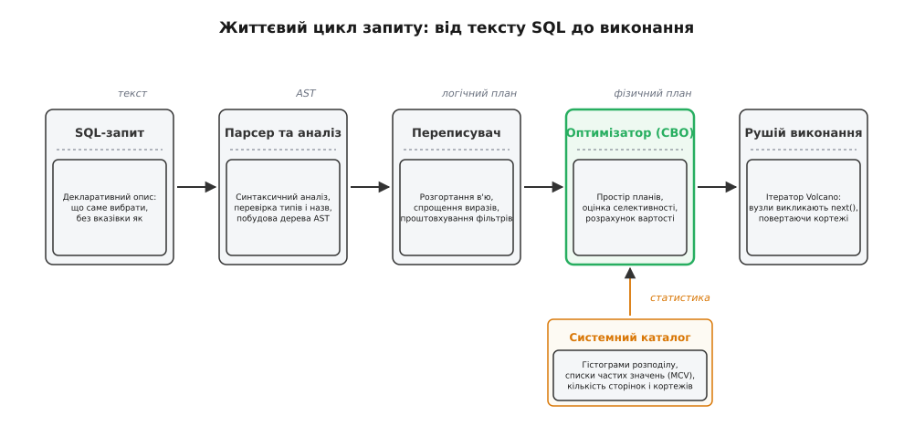
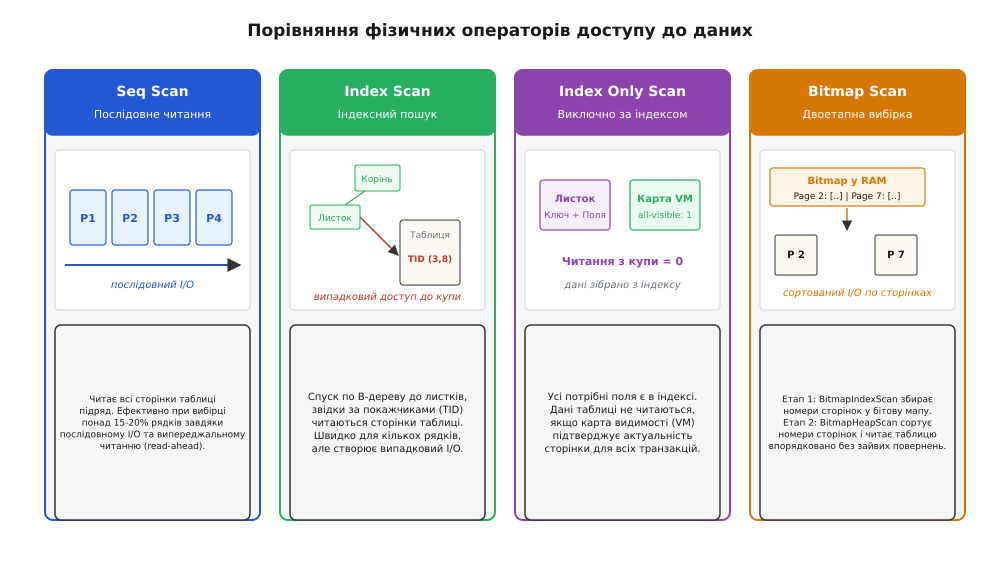
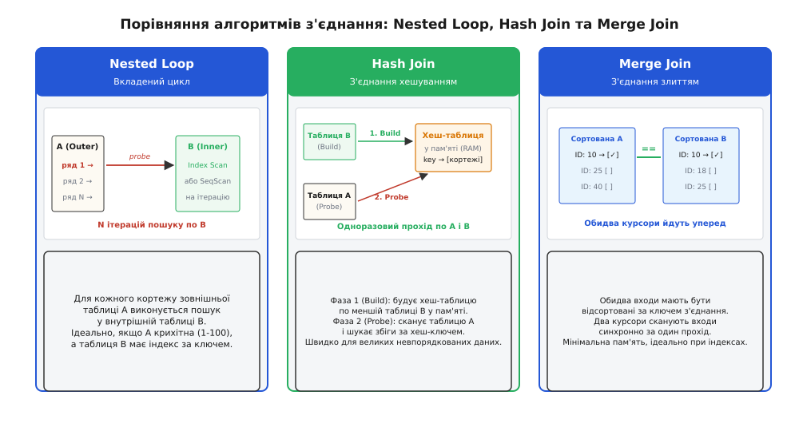
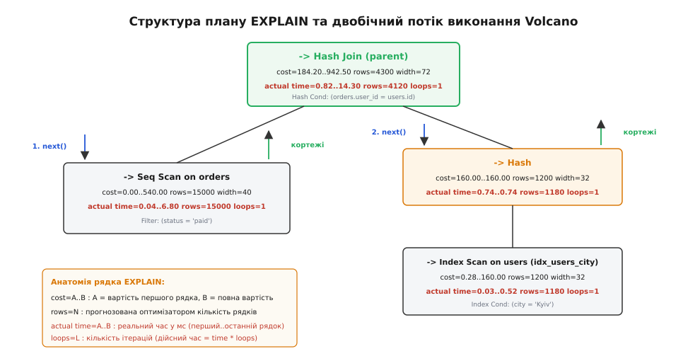

# Планувальник запитів та аналіз EXPLAIN

<preknowlist>
- [Реляційна модель і нормалізація](book:programming/relational-model) — реляційні таблиці, нормальні форми та первинні й зовнішні ключі.
- [Індекси в базах даних](book:programming/database-indexes) — навіщо потрібні індекси та як B-дерево прискорює пошук рядків.
- [B-дерево](book:algorithms/b-tree) — структура балансованого дерева для зберігання впорядкованих ключів на диску.
- [Хеш-таблиця](book:algorithms/hash-table) — мапінг ключів у кошики через хеш-функцію за константний час `O(1)`.
</preknowlist>

## Першопричина: чому декларативність вимагає планувальника

Розглянемо типовий запит до інтернет-магазину: знайти двадцять найдорожчих замовлень користувачів з України за поточний рік. Запит виглядає оманливо просто:

```sql
SELECT users.name, orders.total
FROM users
JOIN orders ON users.id = orders.user_id
WHERE orders.created_at >= '2026-01-01'
  AND users.country = 'UA'
ORDER BY orders.total DESC
LIMIT 20;
```

У базі даних збережено 1 000 000 користувачів (з них 40 000 з України) та 10 000 000 замовлень (з них 300 000 за 2026 рік). В імперативній мові програмування (наприклад, C++ або Go) розробник власноруч пише алгоритм: обирає порядок вкладеності циклів, вирішує, яку таблицю завантажити в оперативну пам'ять, і коли звертатися до індексу. У декларативній мові SQL автор запиту вказує лише **що** необхідно отримати, не повідомляючи жодної інструкції про те, **як** ці дані фізично видобути з носія.

Якби база даних наївно виконувала декларативний запит за порядком написання ключових слів — спершу обчислювала декартів добуток таблиць `users` та `orders` (`10^6 × 10^7 = 10^{13}` пар рядків), потім фільтрувала їх за країною та датою, сортувала 10 трильйонів проміжних записів на диску і брала перші 20 — сервер завис би на кілька діб, вичерпавши терабайти дискового простору під тимчасові файли. Навіть вибір між двома розумними стратегіями (відфільтрувати 40 000 українців і для кожного знайти замовлення в індексі чи навпаки — знайти 300 000 свіжих замовлень і для кожного перевірити країну покупця) дає різницю між 4 мілісекундами виконання та 45 хвилинами безперервного випадкового читання з диска.

Цю прірву між декларативним «що» та фізичним «як» долає **планувальник запитів** (англ. *query planner*, або оптимізатор запитів, *query optimizer*). Планувальник — це внутрішній компілятор СУБД, який перетворює абстрактне синтаксичне дерево запиту на фізичний план виконання: обирає оптимальні алгоритми сканування таблиць, визначає послідовність та методи з'єднання, розраховує використання оперативної пам'яті та будує дерево виконуваних операторів.

## Конвеєр обробки запиту: від тексту до виконання

Шлях від надходження текстового рядка SQL до повернення першого байта клієнту складається з п'яти послідовних етапів.



*Конвеєр обробки запиту: парсер будує AST, переписувач оптимізує правила, вартісний оптимізатор спирається на статистику каталогу, а рушій Volcano виконує фізичний план.*

1. **Синтаксичний аналіз (Parser):** рушій перевіряє граматичну коректність SQL-коду та розбиває його на лексеми, формуючи синтаксичне дерево (Abstract Syntax Tree, AST).
2. **Семантичний аналіз (Analyzer):** система звіряє імена таблиць і стовпців із системним каталогом, перевіряє типи даних, зіставляє псевдоніми (`aliases`) та перевіряє права доступу користувача, перетворюючи AST на дерево запиту (Query Tree).
3. **Переписувач запитів (Rewriter / Rule Engine):** застосовує детерміновані правила еквівалентних перетворень, які вигідні за будь-яких обсягів даних:
   - **Розгортання переглядів (View Expansion):** підставляє тіло представлень (`VIEW`) безпосередньо у головний запит.
   - **Спрощення константних виразів (Constant Folding):** вираз `WHERE age > 18 + 2` компілюється в `WHERE age > 20` до початку виконання.
   - **Проштовхування фільтрів (Predicate Pushdown):** переносить умови фільтрації якомога глибше в дерево — під оператори з'єднання (`JOIN`), щоб відсікти зайві рядки до початку злиття таблиць.
   - **Сплющення підзапитів (Subquery Flattening / Unnesting):** конструкції `WHERE id IN (SELECT user_id FROM ...)` перетворюються на реляційні напівз'єднання (`Semi-Join`), що усуває повторне виконання підзапиту для кожного рядка зовнішньої таблиці.
4. **Вартісний оптимізатор (Cost-Based Optimizer, CBO):** генерує простір можливих фізичних планів, оцінює очікувану кількість рядків на кожному кроці за допомогою системної статистики каталогу, розраховує вартість кожного варіанта і вибирає найдешевший фізичний план. Фундамент цього підходу заклала [робота над IBM System R та концепція динамічного програмування для вибору порядку з'єднань](book:programming/databases/query-planner/hist-system-r.md).
5. **Рушій виконання (Executor):** інтерпретує отриманий фізичний план як дерево ітераторів, зчитує сторінки з дискового кешу (`shared_buffers`) або накопичувача, обробляє кортежі та повертає результат клієнту.

## Модель вартості (CBO) та системна статистика

Вартісний оптимізатор порівнює конкуруючі фізичні плани за числовою оцінкою — **обчисленою вартістю** (англ. *estimated cost*). Вартість — це безрозмірна величина, де за базову одиницю `1.0` традиційно прийнято витрати на зчитування однієї 8-кілобайтної сторінки з накопичувача при послідовному доступі (`seq_page_cost = 1.0`).

Оптимізатор враховує як дисковий ввід-вивід (I/O), так і процесорний час (CPU) на обробку кожного кортежу. Якщо запит сканує таблицю з 10 000 сторінок і перевіряє предикат для 1 000 000 рядків, загальна вартість послідовного сканування складається з суми витрат на дискові читання (`10000 × 1.0 = 10000.0`), видобування кортежів рушієм (`1000000 × 0.01 = 10000.0`) та обчислення оператора порівняння (`1000000 × 0.0025 = 2500.0`), що дає загальну вартість `22500.0`. [Повні математичні формули моделі витрат, розрахунок селективності та виведення точки перетину вартостей для індексного й послідовного сканування](book:programming/databases/query-planner/math-cost-model.md) показують, як саме процесорні та дискові коефіцієнти взаємодіють між собою.

Щоб точно оцінити обсяг проміжних даних (кардинальність, *cardinality*), оптимізатор звертається до системного каталогу статистики (у PostgreSQL — представлення `pg_stats`), яку регулярно збирає фоновий процес `ANALYZE` / `autovacuum`:
- **Кількість сторінок і кортежів (`relpages`, `reltuples`):** загальний фізичний розмір таблиці в блоках по 8 КБ та приблизна кількість записів.
- **Кількість унікальних значень (`n_distinct`):** якщо число додатне — це абсолютна кількість унікальних значень; якщо від'ємне — частка від загальної кількості рядків (наприклад, `-1.0` означає унікальний первинний ключ).
- **Частка порожніх значень (`null_frac`):** відсоток рядків із `NULL`, які індексні дерева зазвичай ігнорують або обробляють окремо.
- **Список найчастіших значень (Most Common Values, MCV):** масив значень (`most_common_vals`) та відповідних їм точних частот появи (`most_common_freqs`) для нерівномірно розподілених даних.
- **Межі гістограми (Histogram Bounds):** значення, що ділять решту стовпця (поза списком MCV) на `K` кошиків із однаковою кількістю рядків. Це дозволяє методом лінійної інтерполяції точно оцінювати селективність діапазонних умов `WHERE price BETWEEN 100 AND 500`.

### Пастка незалежності стовпців та розширена статистика

За замовчуванням оптимізатор вважає всі стовпці статистично незалежними: `P(A ∧ B) = P(A) · P(B)`. На практиці реальні бізнес-дані мають сильну кореляцію.

Нехай у таблиці автомобілів є стовпці `make` (100 виробників, селективність `1/100 = 0.01`) та `model` (1000 моделей, селективність `1/1000 = 0.001`). Для умови `WHERE make = 'Audi' AND model = 'A4'` оптимізатор помножить ймовірності й спрогнозує селективність `0.01 × 0.001 = 0.00001` (10 рядків на мільйон). Проте в реальності майже всі автомобілі моделі A4 вироблені концерном Audi, тож фактична кількість рядків складе 1 000.

Помилка прогнозу в 100 разів змусить планувальник обрати небезпечний алгоритм з'єднання (наприклад, `Nested Loop` замість `Hash Join`). Для лікування цієї проблеми створюють **розширену статистику** (англ. *extended statistics*), яка інструктує СУБД збирати спільні розподіли для групи стовпців:

```sql
CREATE STATISTICS stats_cars_make_model (dependencies, mcv) 
ON make, model FROM cars;
ANALYZE cars;
```

## Фізичні оператори сканування: як діставати рядки

Оптимізатор має у своєму розпорядженні чотири принципово різні механізми вибірки рядків із базової таблиці.



*Чотири фізичні оператори доступу до даних: послідовний прохід усієї купи, точковий індексний спуск із випадковим I/O, прямий вибір із індексу без звернення до таблиці та двоетапне бітове сканування.*

### 1. Послідовне сканування (`Seq Scan`)

Зчитує всі блоки таблиці поспіль, від першої до останньої сторінки, і перевіряє умову `Filter` для кожного знайденого рядка.

**Коли виграє:**
- Таблиця невелика (поміщається в кілька десятків сторінок): вартість запуску індексного пошуку перевищує швидке читання всієї таблиці.
- Запит вибирає значну частку рядків (понад 15–20%): послідовне читання використовує механізм випереджального читання ОС (read-ahead) і блоковий кеш, що в рази швидше за мільйони хаотичних стрибків по диску.

### 2. Індексне сканування (`Index Scan`)

Складається з двох кроків: спершу за балансованим [B-деревом індексу](book:algorithms/b-tree) знаходиться листок, який містить фізичні покажчики на сторінки таблиці (Tuple Identifier, `TID = (page_number, offset)`), після чого СУБД виконує точкове звернення до відповідної сторінки купи (heap) для видобування решти полів рядка.

**Коли виграє:** високоселективні запити, що вибирають одиниці або сотні рядків (менше 1–3% таблиці).
**Слабке місце:** кожне отримання рядка з купи генерує випадкове читання (random I/O). Якщо однакових рядків багато, одну й ту саму сторінку таблиці доведеться читати багаторазово вроздріб.

### 3. Виключно індексне сканування (`Index Only Scan`)

Якщо всі поля, перелічені у секціях `SELECT`, `WHERE`, `ORDER BY`, входять до складу індексу (або додані в його листки через конструкцію `INCLUDE`), СУБД взагалі не звертається до основної таблиці (купи), читаючи дані прямо з листка B-дерева.

**Критичний нюанс (Карта видимості, Visibility Map):** в архітектурі з [багатоверсійним керуванням конкурентним доступом (MVCC)](book:programming/databases) індекс не містить інформації про транзакційні мітки рядків (`xmin`, `xmax`). Щоб переконатися, що знайдена версія рядка не була видалена іншою транзакцією, рушій повинен був би зазирнути в купу. Щоб уникнути цього звернення, PostgreSQL використовує **карту видимості (Visibility Map)**. Якщо сторінка позначена як «all-visible» (усі рядки на ній зафіксовані й видимі для всіх транзакцій), звернення до купи оминається (`Heap Fetches: 0`). Якщо таблиця активно оновлюється, а фоновий `VACUUM` не встигає оновлювати карту видимості, `Index Only Scan` вироджується у звичайний повільний `Index Scan` із масовими зверненнями до купи.

### 4. Бітове сканування (`Bitmap Index Scan` + `Bitmap Heap Scan`)

Двоетапний гібридний метод, що усуває недоліки звичайного індексного пошуку:
- **Етап 1 (`Bitmap Index Scan`):** сканує листки індексу за умовою і формує в оперативній пам'яті бітову карту сторінок (TID Bitmap), де відмічає бітами: «у сторінці №2 є потрібні рядки 3 і 7, у сторінці №15 — рядок 1».
- **Етап 2 (`Bitmap Heap Scan`):** впорядковує номери сторінок за зростанням і зчитує блоки таблиці строго послідовно. Це перетворює хаотичний випадковий I/O на плавний послідовний доступ і гарантує, що кожна сторінка таблиці зчитується з диска **рівно один раз**, скільки б потрібних рядків на ній не містилося.

**Огрублення бітової карти (Lossy Bitmap):** бітова карта живе в межах ліміту пам'яті `work_mem`. Якщо вибірка занадто велика і точні номери рядків не вміщаються в RAM, СУБД огрублює карту: замість окремих рядків помічає сторінку цілком («на сторінці №15 є хоча б один відповідний рядок»). У плані з'являється рядок `Rows Removed by Index Recheck`: на другому етапі СУБД змушена повторно перевірити предикат для всіх рядків огрубленої сторінки.

## Фізичні оператори з'єднання: три стратегії комбінування

Коли запит об'єднує дві або більше таблиць, оптимізатор перетворює операцію реляційного з'єднання на один із трьох фізичних алгоритмів.



*Порівняння фізичних алгоритмів з'єднання: покроковий пошук у внутрішній таблиці для кожного зовнішнього рядка, побудова хеш-таблиці в RAM для одноразового проходу та синхронний рух двох курсорів по відсортованих входах.*

### 1. Вкладений цикл (`Nested Loop Join`)

Найпростіший алгоритм: для кожного кортежу зовнішньої таблиці (Outer relation) запускається пошук відповідних записів у внутрішній таблиці (Inner relation).

```
Для кожного рядка r у Таблиці_A:
    Для кожного рядка s у Таблиці_B, де s.key == r.key:
        Видати об'єднаний кортеж (r, s)
```

- **З індексним доступом:** якщо внутрішня таблиця має індекс за ключем з'єднання, внутрішній цикл перетворюється на швидкий точковий спуск по B-дереву `O(log N)`. Загальна складність складає `O(M · log N)`, де `M` — кількість відібраних рядків зовнішньої таблиці.
- **Коли ідеальний:** коли зовнішня таблиця крихітна (1–100 рядків), а внутрішня має відповідний індекс. Початкова вартість дорівнює нулю (`startup cost = 0`), і перший рядок видається миттєво.
- **Коли катастрофічний:** якщо зовнішня таблиця містить 500 000 рядків, `Nested Loop` виконає 500 000 окремих індексних пошуків. Якщо внутрішня таблиця взагалі не має індексу, складність вироджується у `O(M · N)` (повний декартів прохід), що повністю паралізує сервер.

### 2. З'єднання хешуванням (`Hash Join`)

Двоетапний алгоритм на основі динамічної [хеш-таблиці](book:algorithms/hash-table) в оперативній пам'яті:
- **Фаза побудови (Build Phase):** СУБД повністю зчитує меншу за розміром таблицю (Inner relation) і будує в пам'яті хеш-таблицю, де ключем є стовпець з'єднання, а значенням — вміст кортежу.
- **Фаза зондування (Probe Phase):** СУБД послідовно сканує більшу таблицю (Outer relation), обчислює хеш для кожного рядка і миттєво знаходить відповідності в побудованій хеш-таблиці за час `O(1)`.

**Переваги:** не вимагає попереднього сортування даних, працює за лінійний час `O(M + N)`.
**Обмеження:** працює **лише для умов рівності** (`ON a.id = b.a_id`). Не може застосовуватися для нерівностей (`<`, `>`, `BETWEEN`).
**Скидання на диск (Multi-batch Hash Join):** якщо хеш-таблиця перевищує ліміт `work_mem`, вона розбивається на кілька батчів (`Batches: > 1`). Частина батчів скидається у тимчасові файли на диск, що різко сповільнює виконання через додатковий I/O.

### 3. З'єднання злиттям (`Merge Join`)

Алгоритм базується на ідеї сортування злиттям (Merge Sort). Обидва вхідні потоки даних мають бути **заздалегідь відсортовані** за ключем з'єднання.

СУБД відкриває два покажчики (курсори) на початку обох потоків і синхронно просуває їх уперед:
- Якщо `A.key < B.key` — рухаємо курсор таблиці `A` вперед.
- Якщо `A.key > B.key` — рухаємо курсор таблиці `B` вперед.
- Якщо `A.key == B.key` — видаємо результат з'єднання.

**Переваги:** читає обидва потоки строго послідовно за один прохід `O(M + N)`, практично не споживає оперативної пам'яті й миттєво повертає перший рядок.
**Коли виграє:** якщо обидва вхідні набори вже відсортовані (наприклад, отримані через `Index Scan`) або якщо запит усе одно вимагає `ORDER BY` за цим же ключем.
**Слабке місце:** якщо входи не відсортовані, СУБД змушена попередньо виконати дорогі оператори `Sort` для обох таблиць.

## Паралельне планування та оптимізація запитів

У сучасних багатоядерних системах планувальник здатний генерувати паралельні плани виконання (Parallel Plans), де важкі операції сканування, фільтрації, з'єднання та агрегації розподіляються між пулом фонових робочих процесів (Parallel Workers).

### Архітектура паралельного виконання

Паралельний план організовується навколо спеціальних вузлів збирання потоків:
- **`Gather`:** координуючий вузол, який запускає `K` фонових процесів, створює спільний сегмент динамічної пам'яті (Dynamic Shared Memory, DSM) і збирає кортежі від усіх воркерів у довільному порядку надходження.
- **`Gather Merge`:** використовується тоді, коли результат паралельної гілки має бути відсортованим. Кожен воркер повертає локально відсортований потік, а `Gather Merge` виконує k-стороннє злиття впорядкованих потоків без необхідності фінального повного сортування.

Паралельні оператори сканування (`Parallel Seq Scan`, `Parallel Bitmap Heap Scan`, `Parallel Index Scan`) використовують атомарні лічильники блоків у спільній пам'яті: кожен воркер самостійно захоплює наступну пачку сторінок таблиці, усуваючи дублювання роботи.

### Двоетапна агрегація (Partial vs Finalize Aggregate)

Агрегатні операції (`COUNT`, `SUM`, `AVG`, `GROUP BY`) паралелізуються у два етапи:
1. **`Partial Aggregate`:** кожен фоновий процес обчислює локальний підсумок для своєї порції прочитаних даних у межах власного процесу.
2. **`Finalize Aggregate`:** координуючий процес після вузла `Gather` об'єднує проміжні результати від усіх воркерів у фінальне значення. Наприклад, для функції `AVG()` воркери передають пари `(sum, count)`, а фінальний вузол ділить суму сум на суму кількостей.

### Бар'єри паралелізму (Parallel Unsafe)

Планувальник автоматично відмовляється від паралельного плану, якщо:
- Запит модифікує дані (`INSERT`, `UPDATE`, `DELETE`) у тілі вибірки.
- Запит викликає користувацькі функції, які позначені як `PARALLEL UNSAFE` (за замовчуванням усі створювані функції вважаються небезпечними для паралелізму, доки розробник явно не вкаже `PARALLEL SAFE`).
- Розмір таблиці менший за встановлений поріг `min_parallel_table_scan_size` (зазвичай 8 МБ), коли накладні витрати на запуск процесів та виділення DSM перевищують виграш від паралельного сканування.

## Відсікання секцій (Partition Pruning)

Для секціонованих (парциційованих) таблиць найважливішою функцією планувальника є **відсікання секцій** (англ. *partition pruning*) — виключення з плану виконання тих фізичних таблиць-секцій, які гарантовано не містять запитуваних даних згідно з умовами виразу `WHERE`.

Відсікання відбувається на двох різних фазах:

1. **Статичне відсікання під час планування (Plan-time Pruning):** якщо у виразі `WHERE` вказано константний предикат (наприклад, `WHERE log_date >= '2026-08-01' AND log_date < '2026-09-01'`), оптимізатор ще на етапі побудови дерева виключає всі секції за інші місяці. У плані залишаються лише оператори сканування однієї потрібної таблиці `logs_2026_08`.
2. **Динамічне відсікання під час виконання (Run-time Pruning):** якщо умова фільтрації містить параметри підготовленого виразу (`WHERE log_date = $1`) або підзапит (`WHERE log_date = (SELECT max(date) FROM ...)`), під час планування значення ще невідоме. Оптимізатор будує вузол `Append` з усіма секціями, але додає логіку рантайм-перевірки: під час фактичного старту рушій обчислює значення параметра і миттєво деактивує сканування невідповідних секцій (`Subplans Removed: N`).

## Генетичний оптимізатор запитів (GEQO)

Для запитів із великою кількістю з'єднань класичний алгоритм динамічного програмування Селінджер стикається з експоненційним вибухом обчислювальної складності. Для `N = 12` таблиць кількість підмножин складає `2^{12} = 4096`, але для `N = 20` це вже понад мільйон станів, що призводить до зависання процесу планування на хвилини.

Коли кількість з'єднуваних таблиць перевищує поріг `geqo_threshold` (у PostgreSQL за замовчуванням 12), планувальник автоматично перемикається на **генетичний оптимізатор запитів (Genetic Query Optimizer, GEQO)**.

GEQO розглядає порядок з'єднання таблиць як хромосому (наприклад, перестановку чисел `[3, 1, 5, 2, 4]`). Алгоритм працює за стохастичною евристикою:
1. Генерує випадкову початкову популяцію порядків з'єднання.
2. Оцінює вартість кожного варіанта через стандартну модель CBO (функція пристосованості, fitness).
3. Схрещує найдешевші плани (оператор кросовера злиття ребер, Edge Recombination Crossover) та застосовує випадкові мутації (перестановку сусідніх таблиць).
4. Повторює цикл протягом фіксованої кількості поколінь (`geqo_generations`).

**Ціна евристики:** GEQO працює за стабільний поліноміальний час, але не гарантує знаходження глобально оптимального плану. Для складних аналітичних запитів (OLAP) на 15–20 таблиць це може призводити до випадкової зміни плану виконання між однаковими запусками. Якщо критично знайти найкращий план, адміністратори збільшують `geqo_threshold = 18` або тимчасово вимикають евристику (`SET geqo = off;`).

## Анатомія плану EXPLAIN та EXPLAIN ANALYZE

Для діагностики та тюнінгу запитів використовують команду `EXPLAIN`. Існує фундаментальна різниця між її базовим режимом та режимом з опцією `ANALYZE`:
- `EXPLAIN`: показує **статичний прогноз** планувальника (оцінку вартості, кількість рядків). Запит **не виконується**.
- `EXPLAIN (ANALYZE, BUFFERS)`: **реально виконує запит на сервері**, фіксує точний час роботи кожного вузла, вимірює реальну кількість повернених рядків та збирає вичерпну статистику звернень до сторінок пам'яті й диска.

Усі параметри, прапорці конфігурації та [повний довідник фізичних вузлів і метрик блочного кешу команди EXPLAIN](book:programming/databases/query-planner/api-explain-syntax.md) структуровано в окремій специфікації.



*Ієрархія плану EXPLAIN: керування та виклики next() спускаються від кореня до листків, а потік кортежів піднімається знизу вгору.*

### Модель виконання Volcano (Iterator Model)

Дерево плану виконується за класичною моделлю ітераторів Ґрефе (Volcano Iterator Model). Кожен фізичний вузол реалізує інтерфейс із трьох методів:
- `open()`: ініціалізація внутрішніх структур (виділення буферів, відкриття дескрипторів).
- `next()`: повертає наступний кортеж або сигнал завершення потоку (`EOF`).
- `close()`: звільнення зайнятих ресурсів.

Потік керування рухається **згори донизу**: батьківський вузол (наприклад, `Hash Join`) викликає `next()` у своїх дочірніх вузлів (`Seq Scan` та `Hash`). Потік даних рухається **знизу вгору**: листки зчитують рядки з пам'яті й повертають їх батьківським операторам.

### Розшифровка числового рядка вузла

Розглянемо типовий вузол плану:

```text
->  Hash Join  (cost=184.20..942.50 rows=4300 width=72) (actual time=0.82..14.30 rows=4120 loops=1)
      Hash Cond: (orders.user_id = users.id)
      Buffers: shared hit=1200 read=450
```

1. `cost=184.20..942.50`:
   - `184.20` (**startup cost**): вартість отримання першого рядка. У цьому прикладі це час, необхідний дочірньому вузлу `Hash` для повного сканування таблиці `users` та побудови хеш-таблиці в пам'яті.
   - `942.50` (**total cost**): загальна оціночна вартість повернення всіх 4300 рядків.
2. `rows=4300`: прогнозована планувальником кількість вихідних рядків на основі селективності.
3. `width=72`: середня ширина результуючого рядка в байтах (важливо для розрахунку лімітів пам'яті).
4. `actual time=0.82..14.30`:
   - `0.82` мс: реальний час очікування першого рядка від цього вузла.
   - `14.30` мс: реальний сумарний час роботи вузла до повернення останнього рядка.
5. `rows=4120`: фактична кількість рядків, отримана **за одну ітерацію** циклу.
6. `loops=1`: кількість ітерацій виконання вузла.

> ⚠️ **Головна пастка EXPLAIN ANALYZE:** якщо вузол виконувався всередині циклу (наприклад, внутрішня гілка `Nested Loop` з `loops=1000`), значення `actual time` та `rows` показуються **в середньому за одну ітерацію!**
> 
> Щоб дізнатися сумарний час і повну кількість рядків, необхідно виконати множення:
> `Total Time = actual_time × loops`
> `Total Rows = actual_rows × loops`

### Буферний аналіз: `BUFFERS`

Рядок `Buffers: shared hit=1200 read=450` дає безцінну інформацію про роботу пам'яті:
- `shared hit`: 1200 блоків по 8 КБ (9.6 МБ) знайдено в оперативній пам'яті СУБД (`shared_buffers`). Доступ зайняв частки мікросекунди.
- `shared read`: 450 блоків (3.6 МБ) були відсутні в оперативній пам'яті й підняті з диска (або кешу ОС).
- **Коефіцієнт попадання в кеш (Cache Hit Ratio):**
  `Hit Ratio = hit / (hit + read) = 1200 / (1200 + 450) = 72.7%`. Якщо цей показник для гарячих OLTP-запитів опускається нижче 99%, системі критично бракує оперативної пам'яті або запит виконує зайві неіндексовані читання.

## Типові діагностичні патерни та аномалії в планах

Аналізуючи вивід `EXPLAIN ANALYZE`, досвідчений інженер шукає чотири класичні індикатори проблем.

### 1. Катастрофічна розбіжність кардинальності (Cardinality Misestimate)

```text
->  Index Scan on orders  (cost=0.42..8.45 rows=1 width=32) 
                          (actual time=0.04..1250.30 rows=450000 loops=1)
```

Оптимізатор розраховував отримати **1 рядок**, а отримав **450 000**. Спираючись на хибну оцінку в 1 рядок, планувальник обрав `Nested Loop`. В результаті замість швидкого хешування база почала крутити 450 000 індексних пошуків, збільшивши час запиту з 20 мілісекунд до кількох хвилин.

**Причини:**
- Застаріла статистика: таблиця зазнала масових змін без виклику `ANALYZE`.
- Занадто низький рівень деталізації гістограм: виправляється збільшенням ліміту цільової статистики `ALTER TABLE orders ALTER COLUMN status SET STATISTICS 500;`.
- Корельовані поля, що вимагають створення `CREATE STATISTICS`.

### 2. Масова фільтрація рядків (`Rows Removed by Filter`)

```text
->  Seq Scan on payments  (cost=0.00..18450.00 rows=50 width=40) 
                          (actual time=0.08..85.40 rows=12 loops=1)
      Filter: (account_id = 98421 AND created_at >= '2026-01-01')
      Rows Removed by Filter: 999988
```

Рушій прочитав 1 000 000 рядків із диска, але після обчислення виразу `Filter` відкинув 999 988 із них, залишивши всього 12. Це стовідсотковий сигнал про відсутність складеного індексу за полями `(account_id, created_at)`.

### 3. Скидання сортування або хешу на диск

```text
Sort Method: external merge  Disk: 45280kB
-- або:
Buckets: 16384  Batches: 8  Memory Usage: 4096kB
```

Пам'яті `work_mem` не вистачило для утримання масиву в RAM, і СУБД скинула 45 МБ даних у тимчасові файли на накопичувач. Збільшення виділеної пам'яті для поточної сесії (`SET work_mem = '64MB';`) переводить операцію в режим `Sort Method: quicksort Memory: ...kB`, прискорюючи виконання на порядок.

### 4. Накладні витрати JIT-компіляції (Just-In-Time)

У сучасних версіях СУБД (PostgreSQL 11+) увімкнено JIT-компіляцію складних виразів та агрегацій у машинний код через LLVM. Для важких аналітичних запитів (OLAP) на сотні мільйонів рядків JIT дає прискорення на 20–30%. Проте для коротких OLTP-запитів на 2 мілісекунди сама компіляція LLVM може займати 30–50 мілісекунд.

У звіті це виглядає як:
```text
JIT:
  Functions: 12
  Options: Inlining true, Optimization true, Expressions true, Deforming true
  Timing: Generation 2.105 ms, Inlining 14.210 ms, Optimization 25.430 ms, Emission 18.120 ms, Total 59.865 ms
Execution Time: 62.300 ms
```

Якщо `Total JIT Time` займає 95% усього часу запиту, JIT слід вимкнути для цього класу операцій: `SET jit = off;`.

Для автоматизації пошуку цих дефектів створено [програмний аналізатор дерев планів EXPLAIN у C та C++](book:programming/databases/query-planner/proj-plan-analyzer.md), який автоматично виявляє скидання на диск, низький hit ratio та розбіжності кардинальності в JSON-виводах.

## Як розробники випадково ламають оптимізатор

Навіть найдосконаліший вартісний планувальник стає безпорадним, якщо SQL-код складено так, що він блокує використання індексних структур.

### 1. Несаргабельні предикати (Non-SARGable)

Термін **SARGable** походить від англійського *Search Argument Able* — умова, за якою рушій здатний виконати прямий діапазонний пошук за B-деревом індексу.

Щойно розробник огортає стовпець викликом функції, математичною операцією або конкатенацією, індекс за цим стовпцем стає непридатним, оскільки листки B-дерева впорядковані за вихідними значеннями стовпця, а не за результатом функції:

```sql
-- ❌ НЕ-SARGable: функція date_part ламає індекс за created_at. Повний Seq Scan!
SELECT * FROM orders WHERE date_part('year', created_at) = 2026;

-- ✅ SARGable: пряме порівняння константного діапазону. Швидкий Index Scan!
SELECT * FROM orders 
WHERE created_at >= '2026-01-01' AND created_at < '2027-01-01';

-- ❌ НЕ-SARGable: функція lower() над стовпцем
SELECT * FROM users WHERE lower(email) = 'user@example.com';

-- ✅ Рішення: створення функціонального індексу за виразом
CREATE INDEX idx_users_lower_email ON users (lower(email));
```

### 2. Неявне приведення типів (Implicit Type Casting)

Якщо тип переданого параметра не збігається з типом стовпця в схемі таблиці, рушій бази даних неявно вставляє функцію приведення типу (`CAST`).

Нехай стовпець `phone_number` має тип `VARCHAR(32)` і покритий B-деревом. Якщо ORM або розробник передає запит із числовим літералом:

```sql
-- ❌ СУБД перетворює це на WHERE CAST(phone_number AS bigint) = 380501234567
-- Виклик CAST над кожним рядком вимикає індекс і вмикає Seq Scan!
SELECT * FROM users WHERE phone_number = 380501234567;

-- ✅ Передача коректного рядкового типу зберігає використання індексу:
SELECT * FROM users WHERE phone_number = '380501234567';
```

Подібна пастка виникає при несумісності кодувань символів (collations): якщо таблиця створена з кодуванням `utf8mb4_general_ci`, а з'єднання клієнта використовує `utf8mb4_unicode_ci`, індекси за рядковими полями блокуються.

### 3. Глибока пагінація: пастка `OFFSET / LIMIT`

Класична постранична навігація через зміщення `OFFSET` працює лінійно:

```sql
SELECT id, title FROM articles ORDER BY id LIMIT 20 OFFSET 500000;
```

Щоб повернути 20 рядків із 500 000-ї позиції, планувальник змушений за допомогою індексу зчитати всі **500 020 рядків**, відрахувати перші 500 000, викинути їх у смітник і віддати клієнту останні 20. Час відповіді на 1-й сторінці складає 0.1 мс, а на 25 000-й сторінці — 3 секунди.

**Рішення: курсорна пагінація за ключем (Keyset Pagination):**
Замість `OFFSET` клієнт передає ідентифікатор останнього побаченого запису:

```sql
-- ✅ СУБД миттєво знаходить точку старту за B-деревом за O(log N) і читає рівно 20 рядків:
SELECT id, title FROM articles 
WHERE id > 500000 
ORDER BY id 
LIMIT 20;
```

### 4. Оптимізаційні паркани (Optimization Fences)

В історичних версіях PostgreSQL (до версії 12) конструкція загального табличного виразу `WITH` (CTE) виступала жорстким оптимізаційним бар'єром: СУБД завжди повністю матеріалізувала підзапит у тимчасову структуру на диску або в RAM, не дозволяючи проштовхувати зовнішні предикати всередину CTE.

Починаючи з PostgreSQL 12, прості CTE автоматично вбудовуються (inline) у загальний запит. Проте якщо розробник явно вказує застарілий синтаксис `WITH data AS MATERIALIZED (...)`, оптимізатор втрачає здатність проштовхнути фільтр, що знову створює штучне вузьке місце.

Розуміння принципів роботи планувальника та вміння читати структуру `EXPLAIN` перетворює оптимізацію баз даних із магічного підбору індексів на точну інженерну дисципліну з передбачуваним результатом.
