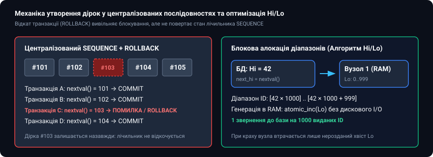
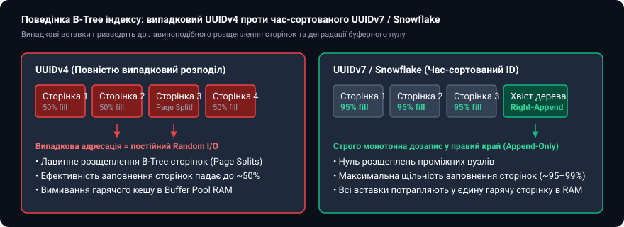
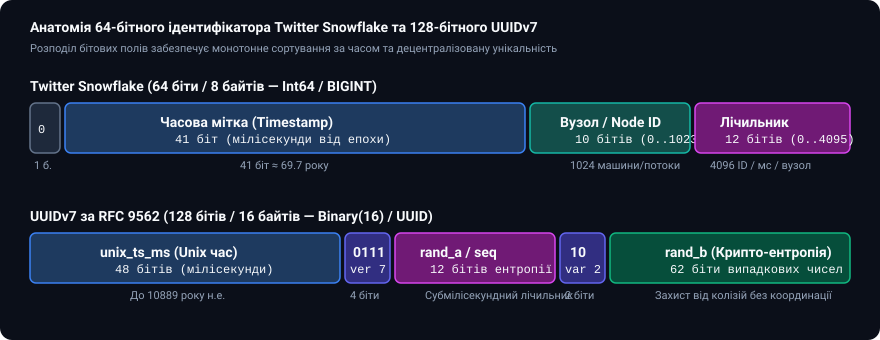
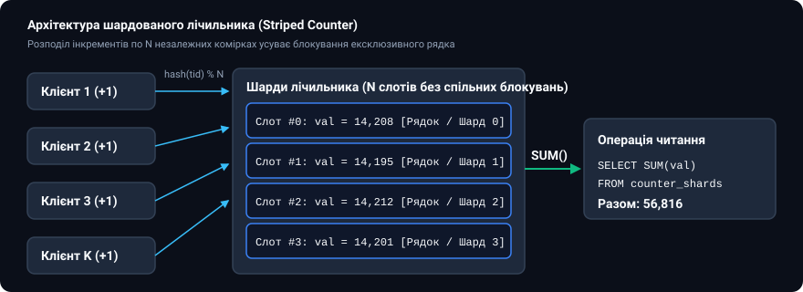

# 🔢 Генерація послідовностей, розподілені ID (Snowflake) та лічильники

<preknowlist>
- [Реляційна модель даних](topic:programming/relational-model) — первинні ключі, сутності та збереження стану.
- [Індекси баз даних: B-Tree та Hash](topic:programming/database-indexes) — B-Tree сторінки, балансування, локальність доступу та розщеплення вузлів.
- [Транзакції та властивості ACID](topic:programming/transactions-acid) — атомарність, рівні блокувань та відкат транзакцій (ROLLBACK).
- [Журнал попереднього запису (WAL)](topic:programming/write-ahead-log) — послідовні LSN та дисковий I/O.
</preknowlist>

Операція збільшення цілого числа на одиницю (`i++`) на рівні одного процесорного ядра займає частку наносекунди. Проте щойно ця сама операція переноситься в контекст багатокористувацької транзакційної бази даних або географічно розподіленого кластера, вона перетворюється на одну з найскладніших інженерних проблем розподілених систем. Потреба видати унікальний *ідентифікатор* (від лат. *identifico* — ототожнюю) або підрахувати кількість переглядів публікації стикається з фундаментальним протиріччям: глобальна монотонність вимагає абсолютної централізованої синхронізації, тоді як висока доступність і пропускна здатність вимагають повної автономності окремих вузлів.

Коли тисячі паралельних транзакцій одночасно вимагають наступний номер у *послідовності* (англ. *sequence*, від лат. *sequentia* — слідування), система змушена або встановлювати глобальне взаємне виключення (ексклюзивні блокування), перетворюючи багатоядерний сервер на повільний однопотоковий конвеєр, або жертвувати суворою неперервністю чисел, допускаючи пропуски (дірки) чи зміну хронологічного порядку.

---

### Централізовані послідовності СУБД та природа незворотних дірок

У класичних реляційних системах керування базами даних (PostgreSQL, Oracle, MySQL, SQL Server) основним інструментом генерації сурогатних первинних ключів є генератори послідовностей: типи `SERIAL` / `BIGSERIAL`, конструкції `IDENTITY`, об'єкти `SEQUENCE` або механізм `AUTO_INCREMENT`.

На рівні внутрішнього рушія генератор послідовностей є спеціалізованим 64-бітним лічильником, що зберігається в окремому дисковому заголовку та кешується в оперативній пам'яті сервера. Кожен виклик системної функції `nextval('seq_name')` виконує атомарну операцію:

```sql
SELECT nextval('orders_id_seq');
```

Головна архітектурна особливість генераторів послідовностей полягає в тому, що **вони функціонують поза межами звичайного транзакційного контексту MVCC**. Коли транзакція викликає `nextval()`, лічильник послідовності негайно інкрементується, запис фіксується у буфері WAL, а внутрішній м'ютекс послідовності негайно звільняється для обслуговування наступних запитів, не чекаючи виконання команди `COMMIT` чи `ROLLBACK` поточної транзакції.

Якби зміна послідовності блокувалася до кінця транзакції, жодна інша транзакція в усій системі не змогла б вставити запис у таблицю, доки попередня транзакція утримує з'єднання. Це спричинило б катастрофічний колапс паралелізму. Проте автономна фіксація лічильника породжує так звану **проблему незворотних дірок (Gap Phenomenon)**.


*Утворення незворотних дірок у послідовностях при відкаті транзакцій та блокова алокація Hi/Lo*

#### Причини виникнення дірок у нумерації:

1. **Транзакційний відкат (Transaction Rollback)**: Якщо транзакція отримала номер `103`, виконала операції запису, але зіткнулася з порушенням обмеження унікальності (Unique Constraint Violation) або явно викликала `ROLLBACK`, номер `103` назавжди зникає з ланцюжка. Послідовність продовжує рух із `104`.
2. **Кешування послідовностей на рівні з'єднань (Sequence Caching)**: Для мінімізації навантаження на дисковий журнал СУБД підтримують параметр `CACHE N` (наприклад, `CACHE 20` у PostgreSQL або `CACHE 50` в Oracle). При першому зверненні сервер резервує діапазон із 20 номерів у RAM процесу. Якщо сервер перезавантажується або аварійно зупиняється через збій живлення, невикористаний залишок із 20 номерів втрачається назавжди.
3. **Пакетні вставки (`INSERT ... SELECT`)**: Сервер наперед резервує блок ідентифікаторів під оціночний розмір вхідного набору даних. Якщо фактична кількість рядків виявилася меншою або вставка була частково відхилена правилом `ON CONFLICT DO NOTHING`, невикористані проміжні значення не повертаються до пулу.
4. **Конкурентні відхилення у тригерах та обмеженнях**: Якщо валідаційний тригер `BEFORE INSERT` генерує помилку бізнес-логіки після того, як значення за замовчуванням `DEFAULT nextval(...)` уже було викликане парсером запитів, лічильник залишається збільшеним, а вставлений рядок не створюється.

---

### Сувора неперервність («без дірок») як регуляторна пастка

У фінансових, податкових та бухгалтерських доменах діє сувора юридична вимога: нумерація видаткових накладних, касових чеків та податкових інвойсів повинна бути строго неперервною (Gapless Sequence). Будь-який пропуск номера (наприклад, після інвойсу № 102 йде № 104) трактується податковим аудитом як ознака приховування прибутку або несанкціонованого видалення фінансових документів.

Реалізація строго неперервної послідовності в реляційній базі даних вимагає повної відмови від високопродуктивного механізму `SEQUENCE`. Єдиний спосіб гарантувати відсутність дірок — це примусова серіалізація через блокування рядка-лічильника:

```sql
BEGIN;

-- Ексклюзивне блокування рядка лічильника поточної фіскальної серії
SELECT current_number 
FROM fiscal_number_counters 
WHERE series = 'INV-2026' 
FOR UPDATE;

-- Обчислення нового номера
UPDATE fiscal_number_counters 
SET current_number = current_number + 1 
WHERE series = 'INV-2026';

-- Вставка документа із гарантовано неперервним номером
INSERT INTO invoices (invoice_number, amount, created_at)
VALUES ('INV-2026-' || (current_number + 1), 1500.00, NOW());

COMMIT;
```

#### Ціна регуляторної неперервності

У такій схемі рядок у таблиці `fiscal_number_counters` утримується під ексклюзивним блокуванням `FOR UPDATE` протягом усього життєвого циклу транзакції (включно з перевіркою бізнес-правил, розрахунком податків, записом супутніх рядків та фіксацією на диск через `fsync`).

Якщо середній час виконання транзакції становить `10 мс`, система фізично неспроможна виписати більше ніж `100 інвойсів на секунду` для однієї серії, незалежно від потужності процесора та кількості серверів у кластері. Усі паралельні потоки блокуються в очікуванні звільнення замка, формуючи черги очікування блокувань (Lock Contention) та провокуючи взаємні блокування (Deadlocks).

> 🔧 **Навіщо це в реальній архітектурі:**
> Щоб розірвати це вузьке місце, високонавантажені платформи (наприклад, платіжні шлюзи та маркетплейси) розділяють внутрішній первинний ключ замовлення та його зовнішній фіскальний номер. Замовлення створюється асинхронно з використанням розподіленого Snowflake/UUIDv7 ідентифікатора, а фіскальний номер «без дірок» присвоюється окремим однопотоковим фоновим воркером у момент остаточного підтвердження транзакції банком.

---

### Оптимізація централізованої видачі: алгоритм Hi/Lo та блокова алокація

Коли додаток взаємодіє з класичною базою даних, кожен окремий мережевий запит на отримання `nextval()` створює затримку (Network Round-trip Time, RTT) та навантажує пул з'єднань СУБД. Для зменшення накладних витрат застосовується **алгоритм Hi/Lo (High/Low Pattern)**.

Алгоритм розділяє простір ідентифікаторів на дві частини:
1. **Старша частина (Hi)**: Зберігається в централізованій базі даних і збільшується на одиницю лише тоді, коли вичерпується поточний локальний діапазон.
2. **Молодша частина (Lo)**: Локальний лічильник в оперативній пам'яті окремого вузла додатку, що змінюється від `0` до фіксованого значення `max_lo - 1` (наприклад, від `0` до `999`).

#### Математична формула обчислення ідентифікатора:

```
ID = Hi · BlockSize + Lo
```

#### Робота алгоритму по кроках:
1. При старті вузол виконує запит до бази даних і атомарно отримує наступне значення `Hi` (наприклад, `Hi = 42`) при розмірі блоку `BlockSize = 1000`.
2. Вузол локально в пам'яті ініціалізує лічильник `Lo = 0`.
3. Наступні 1000 ідентифікаторів (`42000, 42001, ..., 42999`) генеруються локально в RAM за частки мікросекунди за допомогою процесорної інструкції `atomic_fetch_add`. Жодного звернення до бази даних чи мережі не відбувається.
4. Коли `Lo` досягає `1000`, вузол звертається до СУБД за наступним `Hi = 43` і скидає `Lo = 0`.

Якщо вузол додатку аварійно зупиняється або перезавантажується, невикористаний хвіст діапазону (наприклад, номери від `42150` до `42999`) втрачається, що знову створює контрольовану дірку в послідовності, проте зменшує кількість дискових звернень до бази даних рівно в 1000 разів.

---

### Масштабування за межі одного вузла та колапс B-Tree індексів через UUIDv4

При переході до розподілених баз даних (Cassandra, CockroachDB, ScyllaDB, Spanner) або шардованих кластерів PostgreSQL/MySQL централізований генератор послідовностей стає єдиною точкою відмови та мережевим вузьким місцем.

Першою спробою децентралізації став 128-бітний випадковий ідентифікатор **UUIDv4 (Universally Unique Identifier)**, який містить 122 біти чистої криптографічної *ентропії* (від грец. *ἐντροπία* — перетворення). UUIDv4 дозволяє будь-якому вузлу генерувати ключі автономно без ризику колізій.

Проте масове використання UUIDv4 як первинних ключів у реляційних таблицях призвело до катастрофічної деградації підсистеми збереження даних, пов'язаної з фізичною організацією індексів B-Tree.


*Деградація сторінок B-Tree індексу при випадкових вставках UUIDv4 проти монотонного додавання UUIDv7*

#### Механіка індексної катастрофи UUIDv4:

1. **Випадкова адресація у просторі дерева (Random Leaf Insertion)**: Значення UUIDv4 рівномірно розподілені по всьому 128-бітному простору. Кожен новий рядок потрапляє у випадкову дискову сторінку B-Tree індексу розміром 8 КБ (чи 16 КБ в InnoDB).
2. **Лавинне розщеплення сторінок (Page Splits)**: Коли дискова сторінка заповнюється, вставка нового випадкового значення змушує рушій бази даних розділити сторінку навпіл, перемістити 50% записів у новий дисковий блок та оновити посилання у батьківських вузлах дерева.
3. **Падіння коефіцієнта заповнення (Page Fill Factor ~50%)**: Постійні розщеплення призводять до того, що індексні сторінки залишаються заповненими лише наполовину. Фізичний розмір таблиці та індексів на диску подвоюється.
4. **Вимивання буферного пулу (Buffer Pool Thrashing)**: При послідовних числових ID нові записи додаються в самий правий край дерева (Right-most Page Append), тому в оперативній пам'яті утримується лише одна гаряча сторінка. При вставці випадкового UUIDv4 база даних змушена підіймати з SSD у RAM випадкові сторінки з усього обсягу гігабайтного індексу, що вичерпує ліміти операцій введення-виведення (IOPS) та паралізує кеш.
5. **Вплив на LSM-дерева (Log-Structured Merge-Trees)**: У сховищах на базі LSM-дерев (RocksDB, Cassandra, ScyllaDB) випадкові ключі розмивають діапазони SSTable-файлів на всіх рівнях. При злитті рівнів (Compaction) рушій змушений перечитувати та перезаписувати майже всі файли, що викликає катастрофічне зростання коефіцієнта підсилення запису (Write Amplification).

Історичні передумови та інженерні дискусії навколо переходу від монолітних SQL-лічильників до розподілених структур викладено у вставці [Історія виникнення Snowflake у Twitter](topic:programming/sequences-counters/hist-snowflake-twitter.md).

---

### Час-сортовані ідентифікатори: архітектура Twitter Snowflake

Для розв'язання дилеми «автономна генерація без центрального координатора проти збереження B-Tree локальності» інженери Twitter у 2010 році розробили концепцію **Snowflake ID** — 64-бітного ідентифікатора, в якому старші біти відведено під фізичний час.

Оскільки індексні структури B-Tree сортують ключі зліва направо (від старших бітів до молодших), наявність мілісекундного часу в старших розрядах гарантує, що нові записи завжди додаються в кінець індексу, зберігаючи максимальну щільність заповнення сторінок (~95–99%) та усуваючи випадковий дисковий I/O.


*Компонування бітових полів 64-бітного Snowflake та 128-бітного UUIDv7*

#### Анатомія 64-бітного Snowflake:

```text
+-----------------------------------------------------------------------+
| 1 біт |      41 біт      |   5 бітів   |   5 бітів   |    12 бітів    |
| Знаковий | Часова мітка (мс)| Datacenter  |  Worker ID  |  Послідовність |
+-----------------------------------------------------------------------+
```

1. **Знаковий біт (1 біт)**: Завжди дорівнює `0`. Забезпечує коректну роботу в мовах програмування без беззнакових типів (Java `long`, де 64-бітні числа є знаковими).
2. **Часова мітка (41 біт)**: Кількість мілісекунд, що минули з моменту власної епохи системи (Custom Epoch). 41 біт надає запас `2⁴¹ - 1 = 2 199 023 255 551` мс ≈ `69.73 року`.
3. **Ідентифікатор датацентру (5 бітів)**: Дозволяє масштабувати систему до 32 географічних локацій (`0..31`).
4. **Ідентифікатор воркера (5 бітів)**: Дозволяє запустити до 32 незалежних процесів-генераторів всередині кожного датацентру (`0..31`). Загалом кластер може містити `1024` генератори.
5. **Локальний лічильник (12 бітів)**: Монотонно зростає від `0` до `4095` у межах поточної мілісекунди. Забезпечує генерацію до `4 096 000` унікальних ID на секунду на один процес.

Повні бітові розкладки, шістнадцяткові маски та правила бітового маскування для сімейства Snowflake-подібних форматів зібрано у вставці [Специфікація та бітові структури розподілених ідентифікаторів](topic:programming/sequences-counters/api-id-formats.md).

---

### 128-бітна еволюція: ULID та стандарт UUIDv7

Незважаючи на компактність і швидкість 64-бітних Snowflake ID, вони мають суттєвий експлуатаційний недолік: **необхідність суворого обліку та координації Worker ID**. Якщо два хмарні контейнери випадково запустяться з однаковим ідентифікатором воркера, у системі неминуче виникнуть колізії первинних ключів.

Для подолання цієї проблеми індустрія стандартизувала 128-бітні час-сортовані ідентифікатори, що поєднують сортування за часом та криптографічну випадковість, яка повністю усуває потребу в конфігурації номерів машин.

#### 1. ULID (Universally Unique Lexicographically Sortable Identifier)
Складається з 48-бітної мілісекундної часової мітки Unix та 80 бітів криптографічної ентропії. Кодується 26 символами алфавіту Crockford Base32, що робить його зручним для використання в URL-адресах без екранування.

#### 2. UUIDv7 (Офіційний стандарт RFC 9562 / 2024 рік)
UUIDv7 став уніфікованим стандартом IETF, покликаним замінити як хаотичний UUIDv4, так і застарілий UUIDv1:
* **Байти 0..5 (48 бітів)**: Unix timestamp у мілісекундах (запас автономної роботи до 10889 року нашої ери).
* **Байт 6 (старші 4 біти)**: Номер версії `0111₂` (7).
* **Байти 6..7 (молодші 12 бітів)**: Субмілісекундний лічильник або додаткова ентропія `rand_a`.
* **Байт 8 (старші 2 біти)**: Варіант стандарту `10₂` (RFC 4122).
* **Байти 8..15 (62 біти)**: Криптографічна випадковість `rand_b`.

UUIDv7 ідеально лягає в рідний 16-байтний тип даних `UUID` реляційних СУБД (PostgreSQL, CockroachDB), забезпечуючи повну монотонність вставки в індекси без будь-якої міжсерверної координації.

Строгі математичні доведення ймовірності виникнення колізій для просторів ентропії UUIDv7 та Snowflake наведено у вставці [Математичний аналіз колізій імовірнісних ID та похибки наближених лічильників](topic:programming/sequences-counters/math-collision-drift.md).

---

### Годинниковий регрес (Clock Skew): фізичні збої та методи захисту

Оскільки генерація Snowflake та UUIDv7 спирається на фізичний годинник сервера, вона вразлива до явища **годинникового регресу (Clock Skew / Rollback)**. Системний час може стрибнути назад внаслідок:
1. Синхронізації демона NTP (Network Time Protocol) при виявленні розходження з еталонними серверами часу.
2. Введення високосної секунди (Leap Second).
3. Міграції віртуальної машини між фізичними хостами гіпервізора.

Якщо фізичний час зміщується назад, генератор повертається до мілісекунди, для якої ідентифікатори вже були видані, що створює пряму загрозу дублювання первинних ключів.

```
Фізичний час:      T=1000 мс ---> T=1001 мс ---> T=1002 мс (NTP стрибок назад)
                                                      |
                                                      v
Системний годинник бачить:                    T=999 мс (КОЛІЗІЯ!)
```

#### Стратегії захисту від годинникового регресу:

1. **Коротке очікування (Spin-wait)**: Якщо зміщення назад є мікроскопічним (`Δt < 5 мс`), генератор захоплює м'ютекс і входить у цикл активного очікування, опитуючи годинник, доки фізичний час не перевищить `last_timestamp`.
2. **Штучне просування логічного часу (Logical Clock Forwarding)**: Генератор продовжує видавати ID, використовуючи значення `last_timestamp` і нарощуючи лічильник `sequence`, доки фізичний час не наздожене логічний.
3. **Аварійна відмова (Fail-Fast Panic)**: Якщо стрибок назад перевищує порогове значення (наприклад, `Δt ≥ 5 мс`), генератор негайно перериває операцію та повертає критичну помилку, запобігаючи руйнуванню цілісності даних.
4. **Використання NTP у режимі плавної підгонки (Slew Mode)**: Налаштування системного демона часу (наприклад, `chrony` з опцією `makestep 0.1 3`) для виправлення розходжень шляхом мікроскопічного уповільнення ходу годинника, а не миттєвого стрибка назад.

Практичну реалізацію багатопотокового генератора Snowflake та UUIDv7 з повноцінним захистом від регресу годинника реалізовано у вставці [Реалізація стійкого до регресу годинника генератора Snowflake та UUIDv7](topic:programming/sequences-counters/proj-distributed-id.md).

---

### Високонавантажені розподілені лічильники та усунення блокувань

Окрім генерації унікальних ключів, другою фундаментальною задачею обліку є підтримка агрегованих лічильників високої інтенсивності: кількості лайків, переглядів медіафайлів, балансів бонусних рахунків або аналітичних кліків.

Прямий запис `UPDATE counters SET val = val + 1 WHERE entity_id = ?` накладає ексклюзивне блокування рядка (Exclusive Row Lock). Якщо публікація отримує 10 000 лайків на секунду, транзакції шикуються у чергу очікування блокування, що призводить до вичерпання пулу з'єднань СУБД та зростання затримок до десятків секунд.

Для масштабування лічильників застосовують три основні архітектурні патерни:

#### 1. Шардовані лічильники (Striped / Sharded Counters)
Замість одного рядка для сутності створюється `N` незалежних слотів (наприклад, `N = 16` або `N = 64`).


*Розподіл інтенсивних інкрементів по N незалежних шардах для усунення ексклюзивного блокування*

* **Шлях запису (Write Path)**: Клієнт обирає випадковий слот `shard_id = random() % N` і виконує атомарне оновлення:
  ```sql
  UPDATE entity_counter_shards 
  SET val = val + 1 
  WHERE entity_id = 42 AND shard_id = 7;
  ```
  Конкуренція за блокування рядка зменшується рівно в `N` разів.
* **Шлях читання (Read Path)**: Сумарне значення обчислюється шляхом агрегації всіх слотів:
  ```sql
  SELECT SUM(val) FROM entity_counter_shards WHERE entity_id = 42;
  ```

#### 2. Буферизація з відкладеним записом (Write-Behind / Buffered Counter)
Операції інкременту спрямовуються у швидку оперативну пам'ять (наприклад, Redis за допомогою атомарної команди `INCRBY` або локальний кільцевий буфер процесу додатка).

Фоновий процес (Flusher Worker) періодично (раз на 1–5 секунд) зчитує накопичену дельту `Δ` та скидає її в постійну базу даних одним пакетом:

```sql
UPDATE video_stats 
SET views_count = views_count + 14502 
WHERE video_id = 42;
```

Цей підхід забезпечує мільйони інкрементів на секунду, але несе ризик втрати частини статистики за останні кілька секунд у разі раптового збою живлення сервера кешу.

Готові реалізації шардованого лічильника з захистом від False Sharing для оперативної пам'яті та SQL-схеми для PostgreSQL наведено у вставці [Реалізація високопродуктивного шардованого лічильника](topic:programming/sequences-counters/proj-sharded-counter.md).

---

### Імовірнісні лічильники та CRDT-структури (G-Counter, PN-Counter)

У мульти-датацентрових системах з активною реплікацією (Active-Active Multi-Region) використання класичних блокувань для лічильників неможливе через затримки міжконтинентальних мережних каналів.

Для забезпечення узгодженості даних без блокувань застосовуються **CRDT (Conflict-free Replicated Data Types)**:

1. **G-Counter (Grow-Only Counter)**: Лічильник тільки на зростання. Кожен вузол кластера `i` підтримує вектор `V = [c₁, c₂, ..., c_n]`, де оновлює лише власний елемент `c_i`. Сумарне значення дорівнює `∑ c_k`. Злиття станів двох реплік виконується через взяття покомпонентного максимуму: `V_merged[k] = max(V_A[k], V_B[k])`.
2. **PN-Counter (Positive-Negative Counter)**: Підтримує як операції інкременту, так і декременту. Складається з пари незалежних G-лічильників `(P, N)`. Підсумкове значення обчислюється як різниця їхніх сум: `Value = SUM(P) - SUM(N)`.

#### Логарифмічні та ймовірнісні наближення

Коли точне значення лічильника не є критичним, але необхідно відстежувати мільярди подій в умовах жорсткого обмеження пам'яті:
* **Лічильник Морріса (Morris Counter)**: Дозволяє підраховувати до `n` подій за допомогою 8-бітного числа шляхом імовірнісного інкременту з імовірністю `p = 2^(-v)`.
* **HyperLogLog (HLL)**: Використовується для підрахунку унікальних подій (Cardinality Estimation, наприклад унікальних відвідувачів за добу) з фіксованим обсягом пам'яті (1.5 КБ на мільярди записів) з контрольованою похибкою ~1.04/√m.

---

### Архітектурна матриця вибору стратегії ідентифікації

| Критерій | SQL SEQUENCE | Hi/Lo Pattern | Twitter Snowflake | UUIDv4 | UUIDv7 | Шардований лічильник |
| :--- | :--- | :--- | :--- | :--- | :--- | :--- |
| **Розмір первинного ключа** | 8 байтів (`BIGINT`) | 8 байтів (`BIGINT`) | 8 байтів (`BIGINT`) | 16 байтів (`UUID`) | 16 байтів (`UUID`) | N рядків у таблиці |
| **Потреба в координації** | Централізована СУБД | Централізована СУБД | Worker ID у конфігу | Повна автономність | Повна автономність | Локальний шард |
| **Гарантія неперервності** | З дірками (Rollback) | З дірками (Crash) | З дірками | Не застосовно | Не застосовно | Не застосовно |
| **B-Tree дружність** | 100% (Right-append) | 100% (Right-append) | 100% (Right-append) | Катастрофічна | 100% (Right-append) | Залежить від схеми |
| **Чутливість до часу (NTP)**| Відсутня | Відсутня | Висока (Rollback) | Відсутня | Середня (Sub-ms) | Відсутня |
| **Максимальна швидкість** | ~10k–50k ops/sec | ~10M ops/sec (RAM) | ~4M ops/sec/нода | ~10M ops/sec (RAM) | ~10M ops/sec (RAM) | ~500k ops/sec (DB) |
| **Типовий домен застосування** | Монолітні реляційні БД | ORM-фреймворки (Hibernate) | Високонавантажені мікросервіси | Неіндексовані DTO / токени | Сучасні розподілені СУБД | Лічильники переглядів / лайків |
