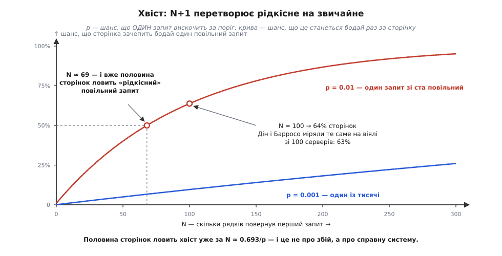

# 🧮 Ціна N+1 у числах

Коли в огляді коду кажуть «тут N+1», це звучить як зауваження про охайність: ну зайві запити, ну не найкраще. Насправді це зауваження про арифметику — і арифметика тут коротка та безжальна. Усе вирішують три числа: скільки рядків повернув перший запит, скільки коштує один похід у базу і скільки з'єднань у пулі. Порахуймо кожне чесно, від першопричини. Стане видно, чому пастка мовчить на машині розробника й валить сторінку на проді; чому з'єднання кінчаються раніше, ніж підказує здоровий глузд; і чому «та просто зроби JOIN» — не відповідь, а рівно половина відповіді.

## Що саме множиться

Означення сидить у назві й тому виглядає нецікавим. Перший запит дістає список і повертає N рядків. Далі код по кожному рядку торкається пов'язаного об'єкта — і кожен дотик коштує окремий запит. Разом:

```text
Q(N) = 1 + N

  1 — список
  N — по одному походу на кожен рядок списку
```

Ось і все слово: воно просто називає суму.

А тепер цікаве. **N не написано в коді.** Кількість запитів — функція не тексту програми, а даних, які в ній колись опиняться:

```text
Q = 1 + |рядки, що повернув перший запит|
```

Читаючи файл, ти бачиш цикл і всередині одне звертання до поля. Множника N у цьому файлі немає жодного разу — він лежить у таблиці на проді. Саме тому N+1 спокійно проходить огляд коду: **не існує способу побачити N, дивлячись на текст.** Його можна лише виміряти, і лише там, де є справжні дані. Механіка, що перетворює дотик до поля на запит, — це [ліниве завантаження](book:programming/lazy-loading); нижче нас цікавить не вона, а її цінник.

## Чому це сума, а не максимум

Ось питання, з якого росте вся біда: чому ці N походів **складаються**, а не накладаються один на одного?

Бо кожен блокує. Код доходить до звертання, відправляє запит і зупиняється — не почавши наступного, поки не повернеться відповідь на цей. Наступна ітерація циклу фізично не може стартувати раніше, бо вона в тому самому потоці, за тим самим лічильником команд. Якби сто запитів пішли в дріт одночасно, загальний час був би приблизно **максимумом** зі ста — вони чекали б паралельно, і сотий не платив би за першого. Але вони йдуть по черзі, тож час — **сума**. А сума ста однакових доданків — це сто разів по одному:

```text
T(N) = (N + 1) · c

  c — ціна одного походу «туди й назад»
```

Ось і вся обіцяна лінійність. Час росте прямою, нахил прямої — `c`.

Тут варто спинитися, бо «лінійно» звучить не страшно. O(N) — усюди: перебрати масив, підсумувати список, відрендерити рядки таблиці. Ми з лінійністю живемо щодня й не скаржимося. Тож де підступ?

Підступ у тому, що складність нічого не каже про **одиницю роботи всередині циклу**. Порівняймо два лінійні цикли:

```text
цикл по масиву в пам'яті:  одиниця роботи ≈ 1 нс
цикл по походах у базу:    одиниця роботи ≈ 1 250 000 нс
```

Однаковісінький клас складності. Шість порядків різниці в тому, що поклали всередину. N+1 — це не «поганий алгоритм»; це звичайний, чесний, нікого не ображаючий цикл O(N), у якому одиницею роботи випадково виявився похід у базу. Уся катастрофа сидить не в показнику степеня, а в константі — і зараз ми цю константу розберемо на гвинтики.

> 🔧 **Навіщо це.** Асимптотика — поганий порадник там, де одиниці роботи різняться на мільйон. Побачивши цикл, питай не «який тут клас складності», а «що саме я множу на N». Помножити наносекунду на тисячу — це мікросекунда, її ніхто не помітить. Помножити на тисячу міліметрову затримку дроту — це секунда, і її помітять усі. Той самий цикл, та сама формула, різні наслідки.

## Розтин одного походу: за що платять сто разів

Отже, `c`. Розкладімо його на доданки — і подивімося, скільки з них база справді витрачає на роботу.

```text
c = c_застосунку + RTT + c_бази

c_застосунку ≈ 0.35 мс   ORM будує SQL, драйвер серіалізує, syscall,
                          розбір відповіді, зліплення одного об'єкта
RTT          ≈ 0.80 мс   дріт: туди й назад між зонами доступності
c_бази       ≈ 0.10 мс   планування (0.05) + вибірка (0.05)
                          ────────────────────────────────
c            ≈ 1.25 мс
```

Числа заслуговують на пояснення, звідки вони. Вибірка одного рядка за первинним ключем із прогрітого кеша — це справді ≈0.05 мс: `EXPLAIN ANALYZE` на унікальному індексі показує 0.047 мс, і це не диво, а спуск по B-дереву на кілька рівнів по сторінках, які вже в пам'яті. Дріт усередині однієї зони доступності — десятки мікросекунд; але застосунок і база живуть у **різних** зонах частіше, ніж хочеться, а там заміри по 28 регіонах дають від 0.39 мс (Осака) до 2.42 мс (Сан-Паулу) — 0.80 взято серединою. Зліплення одного об'єкта ORM коштує одиниці мікросекунд і в цьому балансі майже не важить.


*Розтин каже все. Корисної роботи в поході — 0.05 мс, тобто 4%. Решта 96% — конверт: побудувати SQL, серіалізувати, розбудити ядро, перетнути дріт, розібрати, спланувати. І множиться на N саме конверт.*

Звідси головна структурна властивість, заради якої й затівався розтин: **`c` майже не залежить від того, скільки даних приїхало.** Запит за первинним ключем, що везе один рядок, коштує майже стільки ж, скільки запит, що везе двісті: конверт той самий, а лист усередині важить копійки. Запишімо це чесно:

```text
c(рядків) = a + b · рядків

a ≈ 1.25 мс    конверт — платиться за сам факт походу
b ≈ 3 мкс      лист    — платиться за кожен рядок у відповіді

a / b ≈ 400
```

**Один похід коштує стільки ж, скільки чотириста зайвих рядків у відповіді.** Ось курс обміну, який варто носити в голові; з нього далі виводиться геть усе, включно з несподіванками. І одразу перша: порахуймо, що саме економить JOIN.

```text
T_N+1  = (N+1)·a + b·(N + N)      перший везе N рядків, кожен наступний — по одному
T_JOIN = a + b′·N                 один похід, N рядків назад
─────────────────────────────
різниця ≈ N · a
```

Рядки перетинають дріт **ті самі** — і там, і там їх приблизно N. Різниця не в даних, а рівно в N конвертах. Ти сто разів платив пошті за доставку, щоб перевезти той самий пакунок, який поїхав би однією посилкою.

## Чому машина розробника мовчить

Тепер — чому цього не видно на розробці. Тут працює не одна похибка, а дві, і вони не додаються, а **множаться**.

Перша: на машині розробника у фікстурах десяток рядків, на проді — тисяча. Друга: на машині розробника база в тому самому ноутбуці, через unix-сокет, тож RTT падає з 0.80 мс до ≈0.02 мс, і `c` худне (робота застосунку нікуди не дівається — це той самий код).

```text
дев:   c ≈ 0.35 + 0.02 + 0.08 = 0.45 мс      N = 10
прод:  c ≈ 0.35 + 0.80 + 0.10 = 1.25 мс      N = 1000

T_дев  = (10 + 1)   · 0.45 мс =    5 мс
T_прод = (1000 + 1) · 1.25 мс = 1250 мс
```

Розрив утворює добуток двох множників, кожен з яких поодинці звучить пробачно:

```text
r = (N_прод / N_дев) · (c_прод / c_дев)
  =      100         ·       2.8         ≈ 280
```

«Та там усього в сто разів більше рядків» і «та воно всього втричі повільніше за похід» разом дають **майже трисоткратне** зростання. Множення — операція, до якої інтуїція не пристосована: люди складають ризики там, де їх треба перемножувати.

А головне — 5 мс не є слабким сигналом, який хтось прогледів. 5 мс — це **відсутність сигналу**. Немає порога, за яким п'ять мілісекунд викликали б питання; немає профайлера, налаштованого на такі числа; немає людини, яка на це подивиться. Пастка не ховається — її просто нічим побачити, поки немає прод-даних і прод-дроту одночасно.

## Пул: чому з'єднання кінчаються швидше, ніж здається

Досі ми рахували одну сторінку на самоті. Але сторінка не сама: вона бере з'єднання з пулу, а пул скінченний. І ось тут N+1 із «повільно» перетворюється на «лягло».

Знадобиться закон Літтла — місток між темпом, затримкою й заповненістю. [Виведення площею й розбір коліна черги](book:programming/back-of-envelope/math-queueing.md) — окрема розмова; звідти нам потрібен лише результат і, що важливо, **умови, за яких він тримається**:

```text
L = λ · W

L — скільки одиниць сидить усередині водночас
λ — темп надходження
W — скільки одиниця живе всередині
```

Джон Літтл довів це 1961-го (*A Proof for the Queuing Formula: L = λW*, Operations Research 9, с. 383–387) без жодного припущення про розподіли, кількість серверів чи порядок обслуговування. Тому закон однаково чинний для черги, конвеєра, складу — і для пулу з'єднань, де «одиниця всередині» — це орендоване з'єднання.

Пул має P з'єднань. Вичерпано його тоді, коли `L` дійшло до `P` — а звідси одразу стеля темпу:

```text
L = P   →   λₘₐₓ = P / W
```

Підставмо. Пул на п'ять з'єднань (звична типова величина на процес), сторінка з N+1 на сотню замовлень тримає з'єднання 131 мс:

```text
з N+1:   λₘₐₓ = 5 / 0.131 с =   38 запитів/с
пакетом: λₘₐₓ = 5 / 0.0046 с = 1087 запитів/с
```

Тепер найтонше місце — і найкрасивіше, бо тут закон Літтла показує зуби. Виникає природна надія: а якщо не тримати з'єднання всю сторінку, а брати його на кожен запит окремо й одразу віддавати? Це не вигадка — Rails до версії 7.2 тримав з'єднання до кінця запиту, а з 7.2 з'явився `with_connection`, що бере з'єднання на блок і повертає в пул одразу. Порахуймо обидві схеми:

```text
оренда на сторінку:  λ_оренд = λ,        W_оренд ≈ (N+1)·c   →  L = λ·(N+1)·c
оренда на похід:     λ_оренд = λ·(N+1),  W_оренд = c         →  L = λ·(N+1)·c
```

**Однаково.** І це не збіг, а неминучість: у сторінці з N+1 майже весь час — це і є час запитів, тож «тримати з'єднання всю сторінку» і «брати його сто один раз потрошку» коштують ті самі з'єднання-секунди. Дрібна оренда рятує сторінку, яка сходила в базу раз, а тоді двісті мілісекунд думала. Сторінці, що сто один раз поспіль ходить у базу, вона не дає **нічого**. Оптимізація, яка зазвичай знімає тиск із пулу, тут скасована рівно тим, проти чого її кликали.


*Дві вертикальні пунктирні лінії — це вся математика картинки: закон Літтла ставить їх точно й без жодних припущень. А от форма підходу до стелі — уже модель: щоб намалювати саме таку криву, довелося припустити про розподіли те, чого закон Літтла не вимагає. Тому вір лінії, а криву читай як силует.*

І ось «швидше, ніж здається». Стеля — не схил, а обрив: помножник `1/(1−ρ)`, де `ρ = λ/λₘₐₓ`, зростає не поступово, а вибухом.

```text
λ = 34 зап/с  →  ρ = 0.90  →  час відповіді ×10
λ = 36 зап/с  →  ρ = 0.95  →  час відповіді ×20
λ = 38 зап/с  →  ρ = 1.00  →  черга не має усталеного стану
```

Від «просто повільно» до «не працює» — приріст трафіку на **одинадцять відсотків**. Не подвоєння, не пік чорної п'ятниці, а один вдалий допис у соцмережі. Пул не деградує плавно, як здається з лінійності `T(N)`: лінійним є час сторінки, а стеля пулу — поріг, і біля порога поведінка не має нічого спільного з прямою.

> 🔧 **Навіщо це.** Закон Літтла — єдиний рядок, що перетворює «сторінка стала повільніша» на «сервіс тримає стільки-то запитів на секунду й жодним більше». Він не питає ні про мову, ні про фреймворк, ні про розподіл навантаження — тільки `P` і `W`. Виміряй, скільки мілісекунд запит тримає з'єднання, поділи розмір пулу на це число — і матимеш чесну стелю ще до першого навантажувального тесту.

## Хвіст: рідкісне стає звичайним

Дотепер ми рахували середні. Але користувач живе не в середньому, і саме тут N+1 робить найпідліший зі своїх фокусів.

Нехай кожен окремий запит із певною ймовірністю `p` вискакує за поріг — застряг на замку, не влучив у кеш, потрапив на контрольну точку. Ці події незалежні, тож ймовірність, що сторінка **не зачепить жодного** такого запиту, — це `(1−p)` у степені кількості запитів. Звідси:

```text
P(сторінка зачепить бодай один повільний запит) = 1 − (1 − p)^(N+1)
```

Підставмо «один запит зі ста повільний» і сотню замовлень:

```text
p = 0.01,  N = 100
1 − 0.99¹⁰¹ = 1 − 0.362 = 0.638   →   64% сторінок
```

Те, що для одного запиту було подією рівня «раз на сто», для сторінки стає подією рівня **«частіше, ніж ні»**. P99 одного запиту переїхав приблизно в медіану сторінки.

Число легко звірити із зовнішнім джерелом. Джефф Дін і Луїс Андре Барросо в *The Tail at Scale* (Communications of the ACM, лютий 2013) рахують те саме на віялі зі 100 серверів із P99 в одну секунду й дістають 63% запитів, довших за секунду. Формула одна, бо це просто об'єднання незалежних подій.

Але їхній випадок — **паралельний**: сто викликів ідуть водночас, тож загальний час — максимум, і один невдаха коштує тобі одну секунду. У N+1 сто викликів ідуть **по черзі**, тож загальний час — сума, і невдаха додає свою секунду **згори** до вже лінійно накопиченого часу. Послідовне віяло має ту саму ймовірність зачепити хвіст, що й паралельне, і жодної його переваги: чекання не перекривається. Це той самий розрахунок ризику з гіршою розплатою.

Порогове значення виводиться в один рядок і варте того, щоб його запам'ятати:

```text
(1 − p)^(N+1) = 1/2
(N+1) · ln(1 − p) = −ln 2
N + 1 = ln 2 / (−ln(1 − p)) ≈ 0.693 / p        (для малих p)

p = 0.01   →  N ≈ 68
p = 0.001  →  N ≈ 692
```



*Половина сторінок ловить хвіст уже за N ≈ 0.693/p. Ніщо в системі при цьому не зламалося: база справна, мережа справна, кожен окремий запит поводиться рівно так, як обіцяв. Просто подію «раз на сто» витягли зі ста бочок — і вона, звісно, трапилася.*

І тут ховається остання підступність, від якої N+1 стає не аварією, а способом життя. Сума багатьох дрібних доданків **концентрується**: середнє росте як `(N+1)·μ`, а стандартне відхилення — лише як `σ·√(N+1)`. Відносний розкид падає в `√(N+1)` разів — при сотні це вдесятеро.

```text
середнє     ∝ (N+1)      росте лінійно
відхилення  ∝ √(N+1)     росте корінно
розкид/середнє ∝ 1/√(N+1)   спадає
```

Отже сторінка з N+1 — **надійно** повільна. Вона не блимає, не смикається, не дає гострого піка, на який спрацював би алерт. Вона просто стабільно віддає свою секунду, день за днем. А поверх цього рівного дна лежить розжирілий хвіст із попередньої формули. **N+1 псує і середнє, і хвіст — і робить середнє достатньо нудним, щоб ним ніхто не зайнявся.**

## Скільки з тих ста запитів взагалі різні

Варто поставити ще одне арифметичне питання, бо відповідь несподівана. Сто замовлень ідуть по свого клієнта — але скільки серед тих клієнтів **різних**? Якщо у ста замовленнях бере участь усього M клієнтів, і замовлення розкидані між ними рівномірно, то очікувана кількість різних — це класика про купони:

```text
E[K] = M · (1 − (1 − 1/M)^N)

M = 30, N = 100:
E[K] = 30 · (1 − (29/30)¹⁰⁰) = 30 · (1 − 0.034) ≈ 29
```

Тобто зі ста запитів **різними** є двадцять дев'ять, а решта сімдесят один — це повторне питання про рядок, який уже приїхав кілька мілісекунд тому. Саме тут працює [карта тотожності](book:programming/identity-map): вона впізнає, що клієнта 19 вже питали, і не йде в базу вдруге.

Порахуймо, чого вона варта:

```text
без нічого:       1 + 100 = 101 похід
з картою:         1 +  29 =  30 походів     →  ×3.4
пакетом:          1 +   1 =   2 походи      →  ×50
```

Висновок чесний і трохи прикрий: **карта тотожності — інструмент утричі, пакет — інструмент у півсотні разів.** Виграш карти цілком залежить від відношення M до N: якщо клієнтів десяток на сотню замовлень, вона зріже дев'ятикратно; якщо кожне замовлення від свого клієнта — вона не зріже нічого. Пакетові ж байдуже: два походи є два походи.

## Два походи можуть бути дешевші за один

І наостанок — результат, який без цифр звучить як єресь.

Ліків від N+1 два, і вони різні. Можна витягнути пов'язані рядки **окремим** запитом за списком ключів — Rails зве це `preload`, Django — `prefetch_related`; виходить два походи, і зліплює дані вже сама програма в пам'яті. А можна витягнути все **одним** запитом із JOIN — це `eager_load` у Rails і `select_related` у Django. Один похід звучить очевидно краще за два: ми ж щойно рахували, що конверт коштує чотириста рядків.

Порахуймо, коли це правда. Для `belongs_to` — сто замовлень, у кожного один клієнт — JOIN лише дублює колонки клієнта в тих рядках, що ділять одного клієнта. Дублювання м'яке:

```text
JOIN:     1 похід  + 100 трохи ширших рядків  ≈ 1.25 + 0.45 = 1.7 мс
preload:  2 походи + (100 + 30) рядків        ≈ 2.50 + 0.39 = 2.9 мс
```

JOIN виграє, як і обіцяла інтуїція. А тепер два `has_many` на одній сторінці: у замовлення двадцять позицій **і** десяток платежів. Один JOIN через обидва зв'язки дає добуток — кожна позиція множиться на кожен платіж:

```text
JOIN:     100 · 20 · 10 = 20 000 рядків, з яких корисні одиниці відсотків
preload:  100 + 100·20 + 100·10 = 3 100 рядків, три походи

JOIN:     1.25 мс + 20 000 · 3 мкс = 61 мс
preload:  3.75 мс +  3 100 · 3 мкс = 13 мс     →  preload виграє ×4.7
```

Ось у чому суть, і її варто вимовити окремо, бо вона переживе будь-які конкретні числа:

```text
походи   ростуть СУМОЮ:    Σ по зв'язках, дорого за штуку
JOIN     росте ДОБУТКОМ:   ∏ по зв'язках, дешево за штуку
```

**Константа завжди програє добуткові.** Конверт дорогий, але його всього три; рядки дешеві, але їх двадцять тисяч, бо кожен зв'язок помножив попередній. Тому Rails і возить обидва інструменти, а не один: правильна відповідь залежить від числа, якого в коді не написано, — від фан-ауту (англ. *fan-out* — розгалуження), тобто від того, скільки нащадків в'яжеться на кожного предка.

:::tabs
```rb
# два походи: замовлення окремо, клієнти окремо — програма зліплює в пам'яті
Order.preload(:customer).where(status: "paid")

# один похід: LEFT OUTER JOIN, потрібен, коли за клієнтом фільтруємо чи сортуємо
Order.eager_load(:customer).where(status: "paid").order("customers.name")

# два зв'язки з фан-аутом — тільки окремими походами, інакше буде добуток
Order.preload(:line_items, :payments).where(status: "paid")
```
```py
# один похід: JOIN по зовнішньому ключу — для belongs_to це дешево
Order.objects.filter(status="paid").select_related("customer")

# окремі походи: обов'язково для зв'язків «один до багатьох»
Order.objects.filter(status="paid").prefetch_related("line_items", "payments")
```
:::

## Коли N+1 не варто чіпати

Симетрії заради — межа з іншого боку. Надлишок від N+1 ми вже порахували: це рівно `N · a`.

```text
N = 3    →  3 · 1.25 мс = 3.75 мс     нікого не турбує
N = 25   →  25 · 1.25 мс =  31 мс     помітно, але не смертельно
N = 1000 →  1000 · 1.25 мс = 1.25 с   сторінка втрачена
```

Тож питання не «чи є тут N+1», а «чим обмежене N». І відповідей рівно дві:

**N обмежене кодом** — сторінка пагінована по 25, у панелі завжди рівно п'ять останніх подій, у меню сім розділів. Тоді надлишок має стелю, її можна порахувати один раз і забути. Це не борг, це рішення.

**N обмежене даними** — і тоді стелі немає взагалі, а є тільки те число, яке сьогодні лежить у таблиці. Класика жанру: сторінка жила з пагінацією й трималася на своїх 31 мс; потім хтось додав вивантаження в CSV — а вивантаженню пагінація ні до чого, тож той самий код зустрівся з `N = 50 000`:

```text
50 001 · 1.25 мс ≈ 62 секунди
```

Код не змінився ані на символ. Змінилося число, якого в ньому не було.

І звідси найгірша властивість цієї пастки: **N росте разом з успіхом.** Що більше в тебе замовлень, клієнтів, подій — то дорожча сторінка. Пастка спрацьовує рівно тоді, коли справи пішли вгору, і ламає систему в той єдиний момент, коли її найменше можна собі дозволити зупинити.

## Що лишається в голові

Чотири числа й одне питання.

```text
a / b  ≈ 400        один похід ≈ чотириста зайвих рядків
λₘₐₓ   = P / W      стеля темпу; N+1 множить W, отже ділить стелю
ρ→1    → ×1/(1−ρ)   від «повільно» до «лягло» — 11% трафіку
0.693/p             за стільки рядків хвіст ловить половину сторінок
```

А питання одне: **чим обмежене N?** Якщо кодом — порахуй надлишок `N·a` і живи спокійно. Якщо даними — ти вже маєш аварію, просто вона ще не настала, бо таблиця поки що мала.
