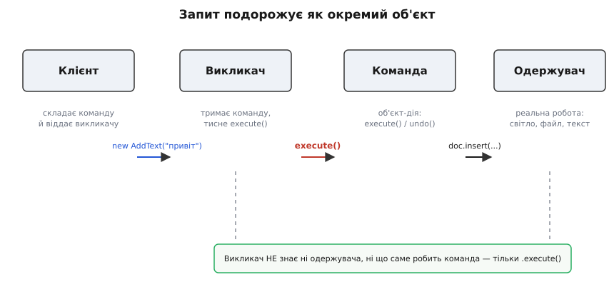
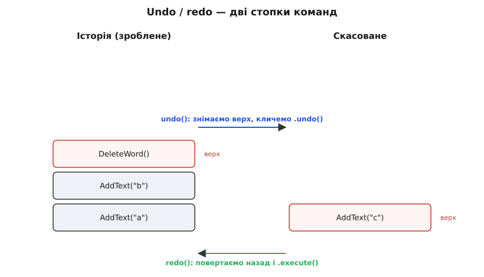

# Команда

<preknowlist>
- [Інтерфейс проти реалізації](book:programming/interface-vs-implementation) — різниця між тим, ЩО тип обіцяє назовні, і тим, ЯК він це робить; команда — це тип, у якого назовні лише обіцянка «мене можна виконати».
- [Поліморфізм і динамічне зв'язування](book:programming/polymorphism) — виклик через спільний тип, що в рантаймі йде в потрібну реалізацію; без нього викликач не міг би тиснути `execute()` на будь-якій команді однаково.
- [Принцип інверсії залежностей](book:programming/dependency-inversion) — код, що ініціює дію, має залежати від абстракції дії, а не від конкретного одержувача; команда саме ця абстракція.
- [Композиція над спадкуванням](book:programming/composition-inheritance) — поведінку тримають об'єктом-полем, а не зашивають у клас; команда — така поведінка, загорнута в об'єкт, який можна передати, зберегти, підмінити.
- [Функції як значення](book:programming/first-class-functions) — коли функцію можна покласти у змінну, передати в аргумент і викликати потім; команда — це той самий трюк, зроблений об'єктом там, де мова функцій-значень не має.
</preknowlist>

У кожній мові є речі, які можна лише **зробити**, але не можна **потримати в руках**. Число можна покласти у змінну. Рядок можна передати в аргумент. А ось дію — `document.insert("привіт")` — зазвичай тільки виконують на місці й одразу забувають. Її не покладеш у список «зробити потім», не передаси комусь, хто вирішить, коли її запустити, не запам'ятаєш, щоб згодом скасувати. Дія тут — не річ, а подія: сталася й розчинилася.

Патерн **Команда** (англ. *command* — наказ, розпорядження) робить рівно одне, але глибоке: **перетворює дію на річ**. Був дієслово — стало іменник. Замість «зараз виконати `insert`» ми створюємо об'єкт `AddText("привіт")`, у якого всередині захована та сама дія, і в якого назовні є один ґудзик — `execute()`. Тепер цю дію можна тримати у змінній, скласти в чергу, записати в лог, віддати іншому об'єктові, який натисне ґудзик коли захоче, і — якщо команда вміє — попросити її **відкотити зроблене назад**.

Класичне формулювання «банди чотирьох» (автори канонічної книги 1994 року — Ерік Ґамма, Річард Гелм, Ральф Джонсон, Джон Вліссідес) звучить так: [«загорнути запит в об'єкт»](book:programming/command/hist-command-birth.md) — щоб можна було параметризувати клієнтів різними запитами, ставити запити в чергу чи логувати їх і підтримувати скасовувані операції. Розберімо, навіщо це насправді потрібно, бо за сухою фразою стоїть дуже конкретний біль.

## Хвороба: той, хто натискає, знає забагато

Уяви найпростіше меню редактора. Є кнопка «Вставити текст». Пишемо в лоб:

:::tabs
```ts
class ToolbarButton {
  constructor(private label: string, private document: Document) {}

  onClick() {
    this.document.insert("привіт");   // кнопка сама робить роботу
  }
}
```
```py
class ToolbarButton:
    def __init__(self, label: str, document: Document) -> None:
        self.label = label
        self.document = document

    def on_click(self) -> None:
        self.document.insert("привіт")   # кнопка сама робить роботу
```
:::

Виглядає безневинно, але кнопка щойно взяла на себе те, що її не стосується. Кнопка — це віджет: прямокутник, який реагує на клік. А тепер вона **знає про документ** і знає **що саме з ним робити**. Додай другу кнопку — «Видалити» — і доведеться писати новий клас чи громадити `if` за назвою кнопки. Захочеш ту саму дію повісити ще й на пункт меню й на гарячу клавішу — тепер троє різних місць знають про `document.insert`, і кожне треба правити, коли дія зміниться.

Корінь болю — у напрямі знання. Кнопка (той, хто **ініціює**) намертво зчеплена з документом (тим, хто **виконує**) і з конкретним ділом. За [принципом інверсії залежностей](book:programming/dependency-inversion) виходить точно навпаки бажаному: дрібний елемент інтерфейсу тримає в собі знання про доменну операцію. Стрілка залежності дивиться не туди.

> 🔧 **Навіщо це.** Найгостріше це відчувається, коли одну й ту саму дію треба викликати з п'яти місць — кнопка, меню, гаряча клавіша, контекстне меню, скрипт автоматизації. Поки дія зашита в кнопці, решта чотирьох мусять або дублювати код, або лізти в кнопку. Винесеш дію в окремий об'єкт — усі п'ятеро тримають один і той самий об'єкт-команду й тиснуть на нього однаково. Одна дія — одне місце правди.

Ми хочемо, щоб кнопка знала рівно одне: «у мене є щось, що можна виконати». Не *що* виконати, не *над чим* — просто «виконати». А все конкретне нехай переїде в окремий об'єкт. Цей окремий об'єкт і є команда.

## Ліки: три ролі й один ґудзик

Розділімо колишню кашу на три чіткі ролі. Кожна знає рівно свою частину й нічого зайвого.

**Одержувач** (*receiver*) — той, хто вміє реально робити роботу: документ, що вставляє й видаляє текст; світло, що вмикається; файл, що зберігається. Він уже існує й нічого не знає про команди.

**Команда** — тоненький об'єкт, у якого назовні один метод `execute()`. Усередині він тримає посилання на одержувача й пам'ятає, що саме з ним зробити. Це і є «дія, загорнута в річ».

**Викликач** (*invoker*) — той, хто тисне ґудзик: кнопка, меню, черга задач, кнопка «повторити». Він тримає команду й у потрібну мить кличе `execute()` — **не знаючи ні хто одержувач, ні що станеться**.


*Запит перестає бути миттєвою подією й стає об'єктом, який мандрує між ролями: його можна зберегти, передати, відкласти.*

Ось ті самі кнопка й документ, але вже розчеплені. Спершу — спільний тип команди (сама лише обіцянка «мене можна виконати»):

:::tabs
```ts
interface Command {
  execute(): void;
}

class AddText implements Command {
  constructor(private doc: Document, private text: string) {}
  execute() { this.doc.insert(this.text); }   // знання «що робити» живе ТУТ
}

class DeleteLast implements Command {
  constructor(private doc: Document) {}
  execute() { this.doc.deleteLast(); }
}
```
```py
from typing import Protocol

class Command(Protocol):
    def execute(self) -> None: ...

class AddText:
    def __init__(self, doc: Document, text: str) -> None:
        self.doc, self.text = doc, text
    def execute(self) -> None:
        self.doc.insert(self.text)          # знання «що робити» живе ТУТ

class DeleteLast:
    def __init__(self, doc: Document) -> None:
        self.doc = doc
    def execute(self) -> None:
        self.doc.delete_last()
```
:::

Тепер кнопка худне до непристойності. Вона більше не знає ні документа, ні дії — тільки команду:

:::tabs
```ts
class ToolbarButton {
  constructor(private command: Command) {}   // тримає абстрактну команду
  onClick() { this.command.execute(); }       // тисне ґудзик, і все
}

// збірка: тут — і тільки тут — вирішуємо, ЩО робить кнопка
const doc = new Document();
const addBtn = new ToolbarButton(new AddText(doc, "привіт"));
const delBtn = new ToolbarButton(new DeleteLast(doc));
```
```py
class ToolbarButton:
    def __init__(self, command: Command) -> None:
        self.command = command               # тримає абстрактну команду
    def on_click(self) -> None:
        self.command.execute()               # тисне ґудзик, і все

# збірка: тут — і тільки тут — вирішуємо, ЩО робить кнопка
doc = Document()
add_btn = ToolbarButton(AddText(doc, "привіт"))
del_btn = ToolbarButton(DeleteLast(doc))
```
:::

Придивись, що сталося зі знанням. Раніше кнопка знала три речі (є документ; у нього є `insert`; вставляти треба «привіт»). Тепер вона не знає жодної — усі три переїхали в об'єкт `AddText`, а зібралися докупи в одному місці, де ми будуємо застосунок. Кнопку тепер можна повісити на **будь-яку** команду, не торкаючись її коду. Той самий `ToolbarButton` завтра запускатиме збереження файлу, післязавтра — надсилання листа. Кнопка стала по-справжньому універсальним віджетом, бо перестала знати про домен.

І це вже пояснює, чому меню, гаряча клавіша й кнопка більше не дублюють код: усі троє — просто різні викликачі, які тримають **один і той самий об'єкт-команду**. Дія існує в одному екземплярі; способів її натиснути може бути скільки завгодно.

## Що відмикає перетворення дії на річ

Сам по собі розподіл на ролі — лише охайність. Справжня сила приходить від того, що команда — **звичайний об'єкт**, який тепер живе стільки, скільки нам треба. З ним можна робити все, що з будь-яким об'єктом.

**Відкласти в чергу.** Команду не обов'язково виконувати одразу. Її можна покласти у список і виконати потім — в іншому потоці, за розкладом, після підтвердження. Так працюють черги задач: `queue.push(new SendEmail(user))`, а окремий робітник згодом дістає команди й тисне `execute()`. Викликач і виконання розчепилися в часі.

**Записати в журнал.** Раз кожна зміна системи — це об'єкт-команда, можна **записувати самі команди**, а не їхні наслідки. Маючи журнал команд від старту, стан системи відтворюється простим повторним програванням: візьми початковий стан і виконай усі записані команди по черзі. На цій ідеї стоять цілі архітектури — [подієве джерело (event sourcing) і розділення читання й запису](book:programming/cqrs), де правда системи — це не поточний знімок, а послідовність команд, що до нього привели.

**Скласти велику команду з малих.** Об'єкт-команду можна покласти всередину іншої команди. «Форматувати абзац» = виконати по черзі «зробити жирним», «вирівняти», «поставити відступ». Загортаємо список команд у ще одну команду з тим самим `execute()`, яка всередині проходить список — і зовні макрос нічим не відрізняється від елементарної дії. Викликачеві байдуже, чи за ґудзиком одна операція, чи сотня.

**І головне — скасувати.** Це найцінніше, і воно заслуговує окремого погляду.

## Скасування: команда, що пам'ятає, як відкотитися

Досі команда вміла тільки `execute()`. Додаймо їй другий метод — `undo()`, який повертає світ у стан «як було до». Ключова умова: щоб відкотитися, команда мусить **запам'ятати достатньо** в момент виконання. «Видалити останнє слово» перед видаленням запам'ятовує, яке саме слово видаляє, — інакше не поверне його на місце.

:::tabs
```ts
interface Command {
  execute(): void;
  undo(): void;
}

class DeleteLastWord implements Command {
  private removed = "";                 // сюди запам'ятаємо, що знесли
  constructor(private doc: Document) {}

  execute() {
    this.removed = this.doc.lastWord(); // запам'ятали ПЕРЕД руйнуванням
    this.doc.deleteLastWord();
  }
  undo() {
    this.doc.append(this.removed);      // повернули як було
  }
}
```
```py
class DeleteLastWord:
    def __init__(self, doc: Document) -> None:
        self.doc = doc
        self.removed = ""                # сюди запам'ятаємо, що знесли

    def execute(self) -> None:
        self.removed = self.doc.last_word()  # запам'ятали ПЕРЕД руйнуванням
        self.doc.delete_last_word()

    def undo(self) -> None:
        self.doc.append(self.removed)        # повернули як було
```
:::

Тепер зроби так само для решти команд — і в тебе є **загальний, доменно-незалежний механізм undo/redo для всієї програми**. Викликач-історія тримає дві стопки. Виконав команду — поклав її на стопку «зроблене». Натиснули «скасувати» — зняв верхню, покликав її `undo()`, переклав на стопку «скасоване». Натиснули «повторити» — зняв зі «скасованого», знову `execute()`, повернув на «зроблене».


*Уся логіка «назад/вперед» зводиться до двох стопок і не знає нічого про конкретні дії — вона працює з абстрактним `Command`.*

Найважче тут — не код стопок, а те, що механізму **байдуже, які саме команди** на ньому лежать. Історія працює з інтерфейсом `Command`, тож додавши нову дію в редактор, ти безкоштовно отримуєш для неї скасування — треба лише реалізувати її `undo()`. Повний робочий редактор із цими двома стопками, обробкою краю (порожні стопки, очищення «повтору» після нової дії) і аналізом складності зібрано окремо: [редактор з undo/redo — від інтерфейсу до історії команд](book:programming/command/proj-undo-redo-editor.md).

Є одна пастка, про яку варто знати одразу: **після скасування нова дія стирає «повтор»**. Якщо ти відкотив три кроки, а потім набрав новий символ, повернути ті три вже не можна — історія розгалузилася б, а лінійне undo цього не тримає. Тому кожен `execute` нової команди очищає стопку скасованого. Це не баг, а свідоме спрощення, яке очікують від звичайного «Ctrl+Z».

## Команда — це об'єктний спосіб потримати функцію

Тепер придивимось, що ж таке команда по суті. Об'єкт із єдиним методом `execute()`, який тримає всередині трохи запам'ятаного стану (одержувача, аргументи) і робить одну дію… Це ж просто **функція, яку відклали на потім разом із її оточенням**. У мовах, де [функції — повноцінні значення](book:programming/first-class-functions), той самий ефект дає замикання (*closure*): функцію кладуть у змінну, передають, викликають згодом — і вона тягне за собою захоплені змінні.

І справді, найпростішу команду без скасування в такій мові пишуть замиканням, без жодного класу:

:::tabs
```ts
type Command = () => void;

const doc = new Document();
const addBtn = new ToolbarButton(() => doc.insert("привіт"));  // замикання = команда
const delBtn = new ToolbarButton(() => doc.deleteLast());
```
```py
from typing import Callable
Command = Callable[[], None]

doc = Document()
add_btn = ToolbarButton(lambda: doc.insert("привіт"))   # замикання = команда
del_btn = ToolbarButton(lambda: doc.delete_last())
```
:::

Це не збіг. Патерн Команда народився в об'єктному світі 1980-х саме тому, що ранні об'єктні мови не вміли передавати функцію як значення — і роль «дії-значення» доводилося грати повноцінному об'єктові. Коли дія проста й одноразова, замикання коротше й чесніше; клас-команда тут був би зайвою церемонією.

Але щойно команді треба **більше, ніж просто виконатися**, об'єкт вертає перевагу. `undo()` — це другий метод; макрокоманді потрібен доступ до списку підкоманд; команду в черзі хочеться серіалізувати, залогувати, показати в списку «останні дії» з людською назвою. Гола функція має лише «виклич мене»; об'єкт може нести стільки методів і полів, скільки треба. Тому правило просте: **одна дія без пам'яті — бери замикання; дія, якій потрібні скасування, назва, серіалізація чи родина споріднених операцій — бери повноцінну команду-об'єкт**.

## Коли команда доречна, а коли зайва

Патерн окупається там, де дію треба **відірвати від моменту й місця виклику**: undo/redo в редакторах і графічних застосунках; черги й планувальники задач; журнали операцій та їх повторне програвання; макроси й запис дій користувача; меню й гарячі клавіші, що ділять одну дію; транзакції, які треба вміти відкотити. Спільне в усіх цих випадках — дія мусить **пережити** мить, коли її задумали.

І навпаки — не тягни команду туди, де дію виконують негайно й забувають. Якщо кнопка просто викликає метод і жодного відкладання, скасування чи журналу не передбачається, обгортка в об'єкт-команду лише додасть класів без користі — простий прямий виклик (чи замикання) чесніший. Патерн виправдовує свою вагу рівно тоді, коли ти справді користуєшся тим, що дія стала річчю: кладеш її в чергу, у стопку undo, у лог. Немає жодного з цих ужитків — немає й потреби в команді.
