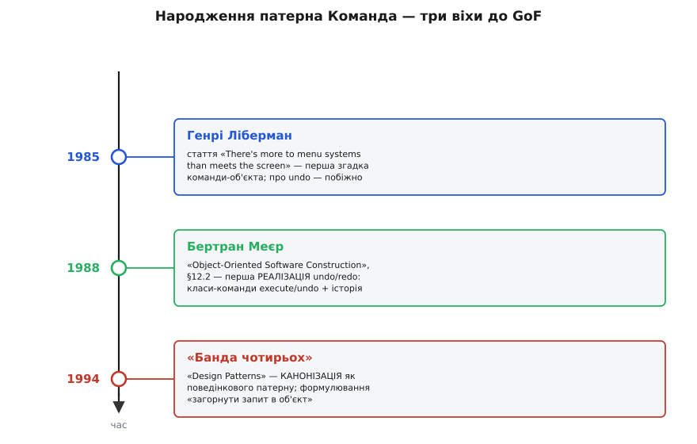

# 📜 Як дію навчилися тримати в руках

Патерн, який сьогодні здається очевидним, — «загорни дію в об'єкт, щоб її можна було виконати потім, скласти в чергу, відкотити» — не впав з неба готовим 1994 року разом із книгою «банди чотирьох». Він визрівав майже десятиліття, і що цікаво: народжувався він не як розумна ідея заради краси, а **як латка на дірці в самих мовах програмування**. Тодішні об'єктні мови мали ваду, яку ми зараз ледь помічаємо, бо звикли до її відсутності. Команда — це те, що виросло навколо цієї вади, щоб її обійти. Зрозуміти історію патерна означає зрозуміти, чого мовам не вистачало — і чому те, що для одних поколінь було винаходом, для наступних стало майже непотрібним.

## Дірка, навколо якої усе виросло

Спершу треба чітко побачити ваду, бо без неї вся історія розсипається на випадкові дати. У мовах на кшталт Java до восьмої версії, C++ до сучасних лямбд, Smalltalk у певному сенсі — **функцію не можна було взяти й покласти у змінну**. Число — можна. Рядок — можна. Об'єкт — звісно. А ось саму дію, «викликати `insert` над цим документом із цим текстом», — ні. Дія існувала лише як подія: рядок коду, який виконується на місці й одразу зникає. Її не передаси в аргумент, не збережеш у полі, не відкладеш на потім.

А потреба відкласти дію на потім — гостра й повсюдна. Меню редактора мусить пам'ятати, що робить кожен його пункт, ще до того, як користувач натисне. Кнопка «скасувати» мусить знати, як відмотати назад те, що вже сталося. Черга задач мусить тримати роботу, яку виконає згодом інший потік. У всіх цих випадках дію треба **зберегти як річ** — а мова цього не дозволяла.

Розв'язок, до якого дійшли незалежно кілька людей, той самий: якщо мова не вміє тримати функцію як значення, а об'єкт тримати вміє — **загорни функцію в об'єкт**. Зроби клас, у якого один метод `execute()`, а всередині захована та сама дія разом з усім потрібним контекстом. Тепер дія — повноцінна річ: живе у змінній, передається, зберігається. Це і є ядро патерна Команда. Уся подальша історія — про те, як цю просту думку по черзі відкрили, реалізували й нарешті назвали.


*Дев'ять років від першої згадки до канону: спершу ідея з'явилась побіжно, потім її втілили в робочий механізм, і лише наприкінці їй дали ім'я та місце в системі патернів.*

## 1985: Генрі Ліберман бачить команду краєм ока

Найраніша задокументована згадка ідеї команди-об'єкта веде до статті з навмисне грайливою назвою — **«There's More to Menu Systems Than Meets the Screen»** («У системах меню більше, ніж видно на екрані»). Написав її **Генрі Ліберман** (Henry Lieberman), американський дослідник, що з 1972 по 1987 рік працював у Лабораторії штучного інтелекту Массачусетського технологічного інституту (MIT AI Lab) — тій самій колисці Lisp-машин, де народилося чимало ідей, які згодом розтеклися всім програмуванням. Стаття вийшла в липні 1985 року в збірнику **ACM SIGGRAPH Computer Graphics** (том 19, число 3, сторінки 181–189) — тобто на конференції з комп'ютерної графіки, а не з архітектури програм, що вже характерно: патерн визрівав там, де будували інтерфейси, а не там, де теоретизували про дизайн.

> 🔧 **Навіщо це знати.** Місце народження пояснює саму форму патерна. Команда — дитя графічних інтерфейсів 1980-х, а не абстрактних роздумів. Меню, кнопки, миша — ось де боляче припекло, що дію треба зберегти до натискання. Тому команда з самого початку прив'язана до сценаріїв «користувач тисне ґудзик»: викликач, одержувач, undo — усе це словник людей, які будували редактори й малювалки, а не проєктували абстракції на дошці.

Що саме зробив Ліберман? Тут важлива чесність, бо легенда любить роздувати першовідкривачів. Ліберман **не описав патерн повністю**. У його статті вперше в друці з'являється сама думка — представити команду інтерфейсу як об'єкт, згадується поняття командного об'єкта, і навіть скасування зачіпається — але **побіжно**, мимохідь, без того повного набору ролей і механізмів, який ми сьогодні звемо патерном Команда. Це радше перший проблиск: людина, будуючи систему меню, помітила, що команду зручно уявляти річчю, і сказала про це вголос. Статус цього факту — **усталений**: історики патернів (зокрема стаття про Command pattern у Вікіпедії з посиланням на першоджерело) сходяться, що це найраніша відома згадка, але одностайно застерігають, що повного патерна там ще немає.

Ця обережність принципова. Історія техніки повна фальшивих «перших», де одну побіжну згадку роздувають до повного винаходу. Чесно сказати так: Ліберман **першим побачив** команду-об'єкт, але не він її розробив. Побачити край ідеї й збудувати з неї працюючий механізм — різні справи, і належне слід віддати обом.

## 1988: Бертран Меєр робить із ідеї механізм

Наступний крок — від проблиску до працюючого коду — зробив **Бертран Меєр** (Bertrand Meyer), французький інформатик, творець мови Eiffel і людина, чиє ім'я міцно зрослося з ідеєю проєктування за контрактом (design by contract). Його книга **«Object-Oriented Software Construction»** (перше видання, 1988) стала одним із наріжних текстів об'єктного програмування — тим, що не переказує чужі ідеї, а закладає власні.

І саме там, у **§12.2** першого видання, з'являється те, чого не було в Лібермана: **перша опублікована реалізація багаторівневого механізму скасування-повернення (undo/redo) через клас-команду з методами `execute` та `undo` і списком історії**. Це вже не проблиск — це повний робочий механізм, розписаний як інженерне рішення. Меєр показав, що коли кожну дію оформити класом-командою, який уміє і виконати себе, і відкотити, то поверх них будується загальний, доменно-незалежний механізм: тримай історію виконаних команд списком, і скасування зводиться до того, щоб зняти верхню й покликати її `undo`.

Придивімось, чому це якісний стрибок, а не просто «те саме детальніше». У Лібермана команда була ідеєю про представлення. У Меєра команда стала **носієм оберненості**: у ній тепер живуть два методи-близнюки — зробити й розробити, — і саме їхня пара відмикає те, заради чого патерн найчастіше й беруть. Меєр першим записав у друці думку, яку сьогодні вважають самоочевидною:

```
Щоб дію можна було відкотити, вона мусить сама пам'ятати,
як це зробити. Отже, кожна дія — окремий об'єкт із парою
методів: execute (зробити) та undo (повернути як було),
а їхня послідовність — список-історія.
```

Це формулювання — серце того, що згодом назвуть патерном. Меєр не мав ще слова «Command pattern» (сам рух патернів як спільна мова прийде трохи згодом), але механізм уже стояв цілий. Статус факту — **усталений**: та сама історична довідка про патерн прямо називає §12.2 книги Меєра першою публікацією багаторівневого undo/redo на класах-командах.

Тут варто на мить спинитись на тонкій, але важливій межі між тим, що зробили Ліберман і Меєр. Це різниця, яку історія техніки повсякчас змазує, а даремно: **«мати ідею», «описати підхід» і «дати працюючу реалізацію» — три різні внески**. Ліберман зробив перше — кинув думку. Меєр зробив третє — збудував механізм, який працює. Приписати весь патерн комусь одному з них означало б стерти цю межу й повторити типову помилку одноосібного авторства. Насправді патерн — плід рук кількох людей, і кожен доклав свій, відмінний від інших, шматок.

## 1994: «банда чотирьох» дає ім'я і місце

Третя віха — та, за якою патерн знають масово. 1994 року вийшла книга **«Design Patterns: Elements of Reusable Object-Oriented Software»** («Патерни проєктування: елементи багаторазового об'єктно-орієнтованого програмного забезпечення») чотирьох авторів: **Ерік Ґамма** (Erich Gamma), **Річард Гелм** (Richard Helm), **Ральф Джонсон** (Ralph Johnson) і **Джон Вліссідес** (John Vlissides). Їх прозвали «бандою чотирьох» (Gang of Four), і це прізвисько прилипло міцніше за назви багатьох патернів у самій книзі.

Що зробила ця книга з командою? Вона не винайшла її — механізм уже існував шість років у Меєра, а ідея — дев'ять у Лібермана. Вона зробила інше, не менш важливе: **канонізувала**. Ґамма з колегами зібрали розсипані по галузі вдалі рішення, дали кожному стале ім'я, стале місце в системі та однакову форму опису — намір, мотивація, структура, наслідки. Команду вони внесли до групи **поведінкових патернів** (behavioral patterns) — тих, що описують, як об'єкти розподіляють між собою обов'язки й спілкуються, — і дали їй формулювання наміру, яке відтоді цитують дослівно:

```
Encapsulate a request as an object, thereby letting you
parameterize clients with different requests, queue or log
requests, and support undoable operations.

Загорнути запит в об'єкт — і завдяки цьому параметризувати
клієнтів різними запитами, ставити запити в чергу чи
записувати їх у журнал і підтримувати скасовувані операції.
```

У цьому одному реченні складено все, що доти лежало нарізно. «Загорнути запит в об'єкт» — це ідея Лібермана. «Підтримувати скасовувані операції» — це механізм Меєра. А «параметризувати клієнтів різними запитами» та «ставити в чергу чи логувати» — узагальнення, яке побачили самі Ґамма й колеги, помітивши, що коли дія стала об'єктом, з нею можна робити геть усе, що з будь-яким об'єктом. Статус — **усталений факт**: формулювання наміру взяте з самої книги й відтоді є канонічним означенням патерна.

Варто чесно назвати, у чому саме внесок «банди чотирьох», бо його часто або переоцінюють, або применшують. Вони **не автори** ідеї команди — і самі це знали, посилаючись на попередників. Їхня заслуга — **стандартизація мови**. До 1994 року команду хтось знав як «командний об'єкт», хтось як «дію», хтось узагалі не мав для неї слова й щоразу винаходив наново. Після 1994-го з'явилося спільне ім'я, спільна форма й спільне місце в каталозі, і двоє інженерів на різних континентах уперше могли сказати «зробімо це командою» — і зрозуміти одне одного без пояснень. Це не менша робота, ніж винахід: перетворити розсип вдалих здогадів на **мову**, якою можна говорити.

## Друге ім'я тієї самої речі: «Action»

Є ще одна деталь, що добре показує, як патерн жив у практиці ще до того, як усі домовилися про назву. У кількох поширених інструментаріях для інтерфейсів той самий патерн Команда носить інше ім'я — **«Action»** (дія). У бібліотеці Swing для Java є тип `Action`; у Borland Delphi є `TAction`. І там, і там це — командний об'єкт: річ, що загортає дію, яку можна повісити на кнопку, пункт меню й гарячу клавішу водночас, аби всі троє тиснули той самий об'єкт.

Чому так вийшло, і що це нам каже? Назва «Action» природно виросла саме в світі графічних інтерфейсів — там, де дію справді треба розділити між кнопкою, меню й клавішею, і де слово «дія» лягає інтуїтивніше за абстрактне «команда». Це не окремий патерн, а те саме поняття під місцевою вивіскою. Той факт, що патерн має два усталені імені в різних екосистемах, — добрий доказ, що народився він не з чиєїсь голови, а **з реальної спільної потреби**, до якої різні спільноти дійшли своїми шляхами й назвали своїми словами. Коли одну річ незалежно винаходять і називають кілька разів, це надійна ознака, що річ справжня, а не вигадана. Статус — **усталено**: обидві назви задокументовані, і те, що `Action` у Swing та Delphi є командним об'єктом, прямо зафіксовано в довідці про патерн.

## Чому патерн поступово тане

І тут — найцікавіший поворот усієї історії, той, що робить її не музейною, а живою. Патерн Команда народився як **обхід вади мов** — невміння тримати функцію як значення. А що стається з обходом, коли ваду в самій мові виправляють?

Він потроху стає непотрібним. У 2004 році C# отримав лямбди; у 2008-му ту саму рису дістала Java у восьмій версії; сучасний C++ від стандарту 2011 року має повноцінні лямбди й `std::function`; а мови, що виросли пізніше — Python, JavaScript/TypeScript, Go, Rust, — від початку вміють класти функцію у змінну. І в усіх цих мовах найпростіша команда без скасування пишеться **одним замиканням** (closure), без жодного класу:

```ts
type Command = () => void;
const save: Command = () => document.save();   // дія-значення, без класу
queue.push(() => sendEmail(user));             // кладемо в чергу просто функцію
```

Те, заради чого 1985 року доводилося вигадувати об'єкт із методом `execute()`, тепер вбудовано в мову: функція **сама** стала першокласним значенням. Обхід зрісся з дорогою — і потреба в ньому в найпростіших випадках зникла.

Але — і це рятує патерн від повного забуття — команда-об'єкт зникає **не всюди**, а лише там, де дія проста й одноразова. Щойно команді треба **більше, ніж просто виконатися**, гола функція пасує, а об'єкт вертає перевагу. Скасування — це другий метод `undo` поряд з `execute`, а функція методів не має. Макрокоманді потрібен доступ до списку підкоманд. Команду в черзі часто хочеться серіалізувати, залогувати, показати в списку «останні дії» з людською назвою. Усе це — стан і поведінка понад «виклич мене», а їх несе тільки повноцінний об'єкт. Тому там, де патерн уперше й народився — undo/redo, макроси, журнали операцій, — команда-об'єкт живе далі, а замикання перебрало на себе лише дрібну, безпам'ятну частину роботи.

Отут і ховається найглибший урок цієї історії, вартий того, щоб його винести окремо. **Патерн — це часто злі́пок того, чого бракує мові.** Коли риса, якої не вистачало, переїжджає в саму мову, патерн навколо неї тане — цілком або частково. Команда показує обидва результати водночас: у простому вжитку її з'їло замикання, у складному вона вціліла, бо там ідеться вже не про «функцію як значення», а про «дію з пам'яттю, ім'ям і ріднею». Дивитися на патерни цим оком корисно: питай не лише «як цей патерн влаштований», а й «яку дірку в мові він латає — і чи не залатала її вже сама мова». Для команди відповідь виявилась половинчастою, і саме тому вона й досі з нами — але вже не скрізь, а точно там, де об'єкт справді потрібніший за функцію.

## Що з усього цього твердо, а що — обережно

Складімо докупи й чесно розставимо статуси, бо історія техніки повниться роздутими легендами, і плутати доведене з переказаним шкідливо.

**Усталені факти.** Найраніша відома згадка команди-об'єкта — стаття Генрі Лібермана «There's more to menu systems than meets the screen», ACM SIGGRAPH Computer Graphics, липень 1985, з чіткою обмовкою: там **проблиск ідеї**, а не повний патерн. Перша опублікована реалізація багаторівневого undo/redo через клас-команду з `execute`/`undo` та історією — Бертран Меєр, «Object-Oriented Software Construction», перше видання 1988, §12.2. Канонізація патерна як поведінкового з формулюванням «загорнути запит в об'єкт» — «банда чотирьох» (Ґамма, Гелм, Джонсон, Вліссідес), «Design Patterns», 1994; наведене формулювання наміру — дослівно з книги. Альтернативна назва «Action» у Swing та Borland Delphi (`TAction`) — задокументована.

**Обережні твердження — не факти, а тлумачення.** Наскрізна думка, що патерн виник саме як обхід невміння ранніх об'єктних мов передавати функцію як значення, — це **усталене пояснення** причини, з яким сходяться і практики, і сама книга «банди чотирьох» (вони прямо кажуть, що в мовах із першокласними функціями простіші випадки роблять інакше). А от твердження, що патерн «тане» з приходом лямбд, — це чесний, але **інтерпретаційний** висновок про напрям розвитку, а не зафіксований у першоджерелі факт; він правдивий для простих випадків і хибний для складних, і саме тому поданий тут із застереженням, а не як вирок.

Ось чому цю історію варто знати не заради дат. Вона показує патерн живим: як він народжувався по шматочку в руках різних людей, як здобув ім'я, і як сама мова згодом почала його з-під нього вибивати — забравши просте й лишивши складне. Патерн — не вічна істина, висічена в камені 1994 року, а відповідь свого часу на брак свого часу. Змінюється мова — зсувається й межа, де ця відповідь ще потрібна.
