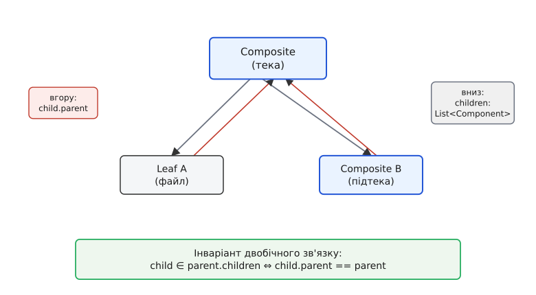
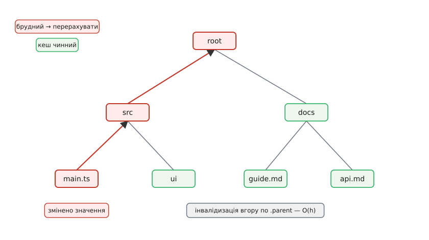
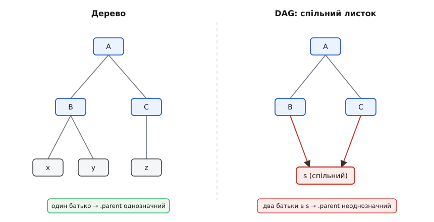

# Компонувальник

<preknowlist>
- [Інтерфейс проти реалізації](book:programming/interface-vs-implementation) — різниця між тим, ЩО тип обіцяє назовні, і тим, ЯК він це робить; увесь патерн стоїть на тому, що лист і контейнер обіцяють клієнтові однакове «що».
- [Поліморфізм і динамічне зв'язування](book:programming/polymorphism) — виклик через абстрактний тип, що в рантаймі йде в потрібну реалізацію; без нього контейнер не зміг би однаково звертатися до листа й до вузла.
- [Композиція над спадкуванням](book:programming/composition-inheritance) — чому об'єкт краще тримати всередині полем, ніж успадковувати; компонувальник саме тримає своїх дітей полем-списком.
- [Рекурсія](book:algorithms/recursion) — коли розв'язок для цілого зводиться до тієї самої задачі для частин; будь-яка операція по дереву рекурсивна за самою будовою.
- [Інваріант програми](book:programming/invariants) — умова, що мусить лишатися істинною завжди між операціями; тут таких дві — двобічний зв'язок батько-дитина й ациклічність, — і від їхнього дотримання залежить, чи взагалі працює обхід.
</preknowlist>

Компонувальник (лат. *componere* — складати докупи) тримається на одній-єдиній петлі: контейнер зберігає список того самого типу, яким є він сам. Тека — це складова, що всередині містить список складових; серед них бувають інші теки, тож будова замикається сама на себе й дає дерево довільної глибини. Один спільний тип `Component`, дві його форми — лист (кінцевий, без дітей) і композит (тримає дітей і сам є `Component`), — і клієнт звертається до обох через один інтерфейс, ні про що не питаючи.

Ця петля елегантна на дошці. Але щойно ти будуєш нею справжнє дерево — редактор із групами фігур, файлову систему, дерево віджетів, конфіг, — з неї проростає низка питань, які схема на дошці обходить мовчанням. Як вузол дізнається, де він у дереві, щоб піднятися до кореня чи прибрати себе? Якщо тепер зв'язок веде і вниз (батько знає дітей), і вгору (дитина знає батька), як утримати ці два напрями в злагоді, щоб вони не почали брехати один про одного? Що заважає дереву з'їсти саме себе, якщо хтось випадково зробить пращура власною дитиною? Чому наївний `size()` на глибокому дереві платить наново за кожен запит — і як за нього не переплачувати? Що станеться зі всім цим, коли той самий листок захочеться підвісити в двох місцях, щоб не тримати дві копії? І найглибше: чому саме ця форма робить **новий вид вузла** майже безкоштовним, а **нову операцію** — дорогою, і що з цим роблять.

Ці питання — не дрібні деталі реалізації. Кожне з них колись поставало перед тим, хто будував компонувальником щось більше за приклад, і саме на них розкладається вся справжня механіка патерна. Розберімо їх по черзі, від будови вгору до найглибшої властивості.

## Чотири учасники й точний контракт

Спершу назвімо ролі точно, бо далі кожна відповідатиме за свою частину злагоди. Учасників рівно чотири, і межа обов'язків між ними — не формальність, а те, що робить патерн патерном.

**`Component`** — спільний тип, обіцянка. Він оголошує ту операцію (чи операції), заради якої все затівалося: `size()`, `draw()`, `render()`. Оголошує **абстрактно** — не як щось робити, а лише що це можна. Уся сила в тому, що клієнт бачить тільки цей тип і нічого під ним.

**`Leaf`** (англ. *leaf* — листок) — кінцевий об'єкт, у якого дітей немає. Він реалізує операцію **сам із себе**: файл повертає власний розмір, символ малює власний гліф. Лист — це **база** будь-якої рекурсії по дереву: місце, де занурення обривається, бо спускатися нема куди.

**`Composite`** (лат. *compositus* — складений) — вузол, що тримає список `Component`-ів і сам є `Component`-ом. Його реалізація операції має особливу форму, і на неї варто подивитися пильно: він **не рахує нічого власного**, він **звертає докупи відповіді дітей**. Розмір теки — сума розмірів дітей; межі групи фігур — об'єднання меж дітей; висота рядка — максимум висот дітей. Це завжди одна й та сама фігура думки: узяти відповіді частин і скласти з них відповідь цілого. Мовою функціонального програмування така операція зветься **згорткою** (англ. *fold*) — і компонувальник, по суті, є деревом, готовим до згортки. Розпізнати це корисно, бо звідси видно, що всі операції по дереву — родичі: різняться вони лише тим, **що повертає лист** і **яким дією вузол зводить дитяче** (сумою, максимумом, об'єднанням, конкатенацією).

**`Client`** (клієнт) — той код, що користується деревом. Його роль — **не знати різниці**. Він тримає `Component`, кличе операцію й отримує відповідь, байдуже, чи то самотній лист, чи дерево на мільйон вузлів. Щойно клієнт починає питати «а це в мене лист чи композит?» — патерн зламано, бо саме це питання він мав прибрати.

Ось контракт у трьох рядках: `Component` обіцяє операцію; `Leaf` виконує її з себе; `Composite` виконує її, згортаючи дітей; `Client` кличе, не розрізняючи. Усе подальше — це наслідки того, що композит тримає дітей, а отже, десь мусить зберігати зв'язки між вузлами. І перше, що з цього випливає, — питання, у **скільки** боків ці зв'язки ведуть.

## Погляд угору: батьківське посилання

Петля компонувальника природно веде **вниз**: батько тримає список дітей. Цього досить, щоб порахувати розмір чи намалювати дерево — операція спускається від кореня, і кожен вузол знає, до кого спуститися далі. Але справжнє дерево майже завжди хоче дивитися й **угору**.

Уяви редактор, де ти виділив фігуру й тиснеш «видалити». Фігура — це вузол дерева. Щоб її прибрати, треба знайти її батька й вилучити її з його списку дітей. Але вузол знає лише своїх дітей — про батька він мовчить. Доведеться шукати батька, обходячи все дерево від кореня, аж поки не натрапиш на вузол, серед чиїх дітей є наш. Це O(n) роботи щоразу, коли треба піднятися на **один** крок угору. Те саме питання постає всюди: яка глибина цього вузла? до якого документа він належить? який його повний шлях від кореня? Усі вони — про рух угору, а вниз-орієнтоване дерево на них відповісти дешево не може.

Розв'язок прямий: нехай кожен вузол тримає посилання на свого батька. Додаємо поле `parent`.

:::tabs
```ts
abstract class Component {
  parent: Composite | null = null;      // зворотне посилання вгору; у кореня — null
  abstract size(): number;
}

class Leaf extends Component {
  constructor(private bytes: number) { super(); }
  size(): number { return this.bytes; }
}

class Composite extends Component {
  readonly children: Component[] = [];

  add(child: Component): void {
    child.parent?.remove(child);        // спершу від'єднати від старого батька
    this.children.push(child);          // 1) додали в список (зв'язок униз)
    child.parent = this;                // 2) той самий крок ставить .parent (зв'язок угору)
  }

  remove(child: Component): void {
    const i = this.children.indexOf(child);
    if (i >= 0) {
      this.children.splice(i, 1);       // прибрали зі списку
      child.parent = null;              // і одразу обнулили батька
    }
  }

  size(): number {
    return this.children.reduce((sum, c) => sum + c.size(), 0);
  }
}
```
```py
from abc import ABC, abstractmethod

class Component(ABC):
    def __init__(self):
        self.parent: "Composite | None" = None   # зворотне посилання вгору

    @abstractmethod
    def size(self) -> int: ...

class Leaf(Component):
    def __init__(self, num_bytes: int):
        super().__init__()
        self._bytes = num_bytes
    def size(self) -> int:
        return self._bytes

class Composite(Component):
    def __init__(self):
        super().__init__()
        self.children: list[Component] = []

    def add(self, child: Component) -> None:
        if child.parent is not None:
            child.parent.remove(child)            # від'єднати від старого батька
        self.children.append(child)               # 1) зв'язок униз
        child.parent = self                        # 2) зв'язок угору

    def remove(self, child: Component) -> None:
        self.children.remove(child)
        child.parent = None

    def size(self) -> int:
        return sum(c.size() for c in self.children)
```
:::

Тепер піднятися до кореня чи виміряти глибину — це прогулянка вгору за посиланнями `parent`, і коштує вона рівно стільки, яка висота вузла над дном, а не розміру всього дерева:

:::tabs
```ts
function depth(node: Component): number {
  let d = 0;
  for (let p = node.parent; p !== null; p = p.parent) d++;
  return d;                              // кроків угору = глибина вузла = O(h)
}
```
```py
def depth(node: Component) -> int:
    d = 0
    p = node.parent
    while p is not None:                 # ідемо вгору, доки не впремося в корінь
        d += 1
        p = p.parent
    return d
```
:::

Але за цю зручність доведеться платити пильністю, і саме тут ховається найтонше місце. Між батьком і дитиною тепер **два** зв'язки, що ведуть у протилежні боки: униз — батько тримає дитину у своєму списку `children`; угору — дитина тримає батька в полі `parent`. Ці два записи говорять про одне й те саме відношення, тож вони мусять **завжди узгоджуватися**. Якщо дитина в списку батька, то її `parent` має вказувати саме на нього — і навпаки. Порушиш це — і дерево почне брехати: `depth` порахує одне, обхід від кореня побачить інше, видалення прибере вузол зі списку, а той усе ще вважатиме себе дитиною.



*Два записи про одне відношення: список дітей веде вниз, посилання parent — угору. Вони мусять завжди узгоджуватися; цю узгодженість і стереже інваріант двобічного зв'язку.*

> 🔧 **Навіщо це.** Ключ до безпеки — **не давати нікому міняти лише один бік зв'язку**. Погляну на код `add`: він робить обидва кроки разом — і додає в список, і ставить `parent`, — і робить це в одному місці, у методі композита. Ніде більше `children` руками не чіпають і `parent` руками не присвоюють. Тому обидва боки завжди міняються **атомарно**, разом, і розійтися не можуть. Це загальне правило проєктування API дерева: коли одну істину зберігають у двох місцях, доступ до неї має йти через **одну** операцію, що оновлює обидва, — інакше рано чи пізно хтось оновить один бік і забуде другий.

Зверни увагу ще на один рядок у `add`: `child.parent?.remove(child)`. Він не випадковий. Перш ніж узяти дитину собі, ми **від'єднуємо** її від попереднього батька — бо в справжньому дереві вузол має рівно одного батька, і «перенести гілку в інше місце» означає спершу вийняти її звідти, де вона була. Без цього рядка вузол опинився б у списках **двох** батьків одночасно, а його `parent` вказував би лише на одного — інваріант зламано з першого ж переміщення. Ця дрібна деталь — перевтілення тієї самої дисципліни: один бік не рухається без другого.

Точне формулювання цього інваріанту, доведення, що `add` і `remove` його зберігають, і аналіз того, чому висота `h` у найгіршому разі дорівнює числу вузлів `n`, винесені в [окрему математичну нотатку](book:programming/composite/math-composite-invariants.md) — там це виписано як умову-біумову й доведено покроково, разом із доведенням, що обхід дерева гарантовано завершується. Тут же перейдімо до другого інваріанта, без якого перший ще нічого не рятує.

## Коли дерево перестає бути деревом: цикли

Двобічний зв'язок узгоджений — і все одно дерево можна зруйнувати одним необережним викликом. Дерево — це не будь-який граф вузлів; це граф із двома жорсткими умовами: у кожного вузла **рівно один батько** (крім кореня, у якого жодного) і немає **циклів** — жодна гілка не веде назад до свого пращура. Друга умова тонша за першу, і саме її найлегше проґавити.

Уяви, що дерево має вузли `a` і `b`, причому `a` вже містить `b` (тобто `a` — пращур `b`). І тут хтось пише `b.add(a)` — додає `a` всередину `b`. Тепер `a` містить `b`, а `b` містить `a`: гілка замкнулася в кільце. Що станеться, коли на такому «дереві» покликати `size()`? Тека `a` спитає розмір у `b`, `b` спитає в `a`, `a` знову в `b`… — рекурсія падає в нескінченний спуск, бо в кільці немає дна, до якого можна дійти. А підйом угору за `parent` ніколи не досягне кореня, бо `parent`-ланцюг теж закільцьований. Обидва інваріанти — і двобічний зв'язок, і сам сенс слова «дерево» — вимагають, щоб такого не сталося.

Захист простий і коштує рівно стільки ж, скільки підйом до кореня. Перш ніж узяти `child` собі, композит перевіряє: чи не є `child` часом моїм **пращуром** (або мною самим)? Бо якщо `child` уже наді мною в дереві, то, поклавши його **під** себе, я замкну кільце.

:::tabs
```ts
class Composite extends Component {
  add(child: Component): void {
    if (child === this || this.hasAncestor(child)) {
      throw new Error("додавання створило б цикл");   // гучна відмова, не тихе псування
    }
    child.parent?.remove(child);
    this.children.push(child);
    child.parent = this;
  }

  // чи є `candidate` десь на шляху від мене до кореня?
  private hasAncestor(candidate: Component): boolean {
    for (let p = this.parent; p !== null; p = p.parent) {
      if (p === candidate) return true;              // так — він мій пращур
    }
    return false;
  }
}
```
```py
class Composite(Component):
    def add(self, child: Component) -> None:
        if child is self or self._has_ancestor(child):
            raise ValueError("додавання створило б цикл")   # гучна відмова
        if child.parent is not None:
            child.parent.remove(child)
        self.children.append(child)
        child.parent = self

    def _has_ancestor(self, candidate: Component) -> bool:
        p = self.parent
        while p is not None:                 # ідемо від себе вгору до кореня
            if p is candidate:
                return True
            p = p.parent
        return p is not None                 # (недосяжно: цикл вище вже неможливий)
```
:::

Перевірка `hasAncestor` іде вгору за тими самими `parent`-посиланнями, що ведуть від вузла до кореня, — ще одне застосування зв'язку вгору. Коштує вона O(h): один прохід від вузла до кореня. Це та ціна, яку варто платити на кожне `add`, коли дерево збирається з ненадійного джерела (введення користувача, десеріалізація, автоматична побудова), — бо вартість пропущеного циклу не O(h), а зависання процесу.

Тут же ховається глибша причина, чому дерево взагалі можна обходити рекурсією й бути певним, що вона скінчиться. Рекурсія завершується не «якось сама», а тому, що кожен спуск строго зменшує щось, чого не можна зменшувати безкінечно, — тут це залишок висоти під вузлом. Спускаючись, ми щоразу ближче до листа; глибина скінченна; отже, дно неминуче. Формально це називають **добре впорядкованим** спуском, і він працює **лише** на ациклічному скінченному графі. Кільце ламає саме цю гарантію: у ньому спуск не наближається до дна, бо дна немає. Тому ациклічність — не педантизм, а та сама умова, що робить усю рекурсивну механіку компонувальника скінченною й безпечною; повне доведення завершення — у [математичній нотатці](book:programming/composite/math-composite-invariants.md).

## Кеш агрегату: як зміна брижами йде вгору

Тепер про швидкість. `size()` теки чесно спускається деревом і підсумовує все листя щоразу, коли його кличуть. Якщо дерево велике, а розмір питають часто, це марнотратство: між двома запитами дерево здебільшого не змінилося, а ми рахуємо все наново. Той самий біль у графічному редакторі з межами групи (англ. *bounding box*): перемалювати екран — це запитати межі кожної групи, і якщо щоразу об'єднувати межі всіх нащадків, кадр тоне в перерахунках.

Природний хід — **закешувати** агрегат. Нехай кожен композит тримає збережене значення (розмір, межі) і прапорець «брудний» (англ. *dirty* — той, що потребує перерахунку). Запит розміру: якщо не брудний — віддай збережене миттєво; якщо брудний — перерахуй із дітей, збережи, познач чистим. Одна тонкість вирішує все: **коли ставити прапорець брудним?**

Ось де посилання `parent` окупається сповна. Коли змінюється листок глибоко в дереві — файл виріс, фігуру пересунули, — змінюється не лише його власний агрегат. Змінюється розмір **його теки**, і теки **над нею**, і так аж до кореня: кожен пращур тепер має неправильний кеш, бо в його піддереві щось зрушило. А от **сусідні** піддерева — ті, що не лежать на шляху від зміни до кореня, — незаймані, їхній кеш чинний. Отже, зміна має позначити брудними рівно вузли **на шляху вгору до кореня** — і жодного більше. А пройти цей шлях угору дозволяє саме посилання `parent`.

:::tabs
```ts
class Composite extends Component {
  private cached: number | null = null;   // збережений агрегат; null = брудний

  size(): number {
    if (this.cached === null) {            // брудний — рахуємо й запам'ятовуємо
      this.cached = this.children.reduce((s, c) => s + c.size(), 0);
    }
    return this.cached;                    // чистий — віддаємо миттєво, O(1)
  }

  invalidate(): void {                     // зробити брудним себе й усіх пращурів
    for (let p: Composite | null = this; p !== null; p = p.parent) {
      if (p.cached === null) break;        // уже брудний → вище теж брудні, спиняємось
      p.cached = null;
    }
  }

  add(child: Component): void {
    /* ...перевірки, вставка, parent... */
    this.children.push(child);
    child.parent = this;
    this.invalidate();                     // структура змінилась → шлях до кореня брудний
  }
}
```
```py
class Composite(Component):
    def __init__(self):
        super().__init__()
        self.children: list[Component] = []
        self._cached: int | None = None      # None = брудний

    def size(self) -> int:
        if self._cached is None:             # брудний — рахуємо й кешуємо
            self._cached = sum(c.size() for c in self.children)
        return self._cached                  # чистий — миттєво

    def invalidate(self) -> None:            # себе й усіх пращурів — у брудні
        p: "Composite | None" = self
        while p is not None:
            if p._cached is None:            # уже брудний вище → далі не йдемо
                break
            p._cached = None
            p = p.parent

    def add(self, child: Component) -> None:
        self.children.append(child)
        child.parent = self
        self.invalidate()                    # шлях до кореня тепер брудний
```
:::

Придивись до `invalidate`: він іде вгору за `parent` і зупиняється, щойно натрапить на вже брудний вузол, — бо якщо цей вузол брудний, то й усі над ним уже брудні (їх позначила попередня зміна), і ходити далі марно. Ця дрібна зупинка робить повторні зміни в тій самій гілці майже безкоштовними.



*Зміна в одному листку робить брудними лише вузли на шляху до кореня — це O(h). Сусідні піддерева не чіпаються: їхній кеш лишається чинним, тож наступний запит їхнього розміру безкоштовний.*

Порахуймо, скільки це справді економить.

**Умова:** збалансоване дерево з n = 10⁶ вузлів (глибина h ≈ 20), між побудовою й показом роблять q = 10⁴ запитів розміру й m = 10² змін.

```
без кешу:  кожен запит спускається деревом → O(n) за запит
           q · n = 10⁴ · 10⁶ = 10¹⁰ елементарних додавань

з кешем:   чистий запит — O(1); брудними стають лише шляхи змін
           інвалідизація:      m · h = 10² · 20 = 2·10³
           перерахунок:        кожен брудний вузол раз між запитами
                               ≪ 10¹⁰ (переважна більшість піддерев чисті)
```

Різниця — на порядки, і вона тим більша, чим сильніше запити переважають зміни. Ось коли кеш окупається: **багато читань, мало записів**. Якщо ж дерево міняється так само часто, як його питають, кеш майже завжди брудний, і його утримання (прапорці, інвалідизація) стає чистим накладом — тоді простіше рахувати щоразу. Це загальна межа будь-якого кешування: воно продає пам'ять і складність за час і виграє лише там, де читань помітно більше за зміни.

Повний робочий приклад із межами групи в редакторі, з обома напрямами — інвалідизацією вгору й лінивим перерахунком униз, — разом із розбором крайніх випадків (що робити на видаленні, як не забути інвалідизувати при зміні самого листка) винесено в [окремий код-розбір](book:programming/composite/proj-composite-cache.md). А тут варто зупинитися на пастці, яка тихо ламає весь цей кеш, — і водночас на цілком легальному прийомі, що її породжує.

## Поділ листків і мить, коли дерево стає DAG-ом

Дотепер ми мовчки припускали, що кожен вузол — у дереві сам собі, з єдиним батьком. Але буває сильна спокуса це припущення порушити — і не з недбалості, а заради економії.

Уяви документ, де тисячу разів трапляється той самий значок, або схему, де сотні однакових логічних вентилів, або конфіг, у якому та сама піддерево-заготовка повторюється в багатьох місцях. Тримати тисячу однакових об'єктів-листків — марнувати пам'ять на тисячу копій того, що байт-у-байт однакове. Напрошується **поділ** (англ. *sharing*): завести значок **один раз** і підвісити той самий об'єкт-листок у тисячу місць дерева. Пам'ять падає в тисячу разів. Саме це радить банда чотирьох окремим пунктом реалізації — ділити листки, коли їх багато й вони однакові, і цей прийом має власне ім'я, [легковаговик](book:programming/flyweight) (англ. *Flyweight* — «легка вага»): спільний незмінний об'єкт, яким користуються багато власників замість того, щоб плодити копії.

Але тут відбувається щось глибше, ніж просто економія, і це варто побачити ясно. Щойно один листок висить у **двох** батьків, у нього стає **два** посилання «згори вниз» — і на нього тепер вказують дві теки. А що з полем `parent`? Воно одне, а батьків двоє — то якого з них туди записати? Однозначної відповіді немає. Будова перестала бути деревом. Те, що вийшло, називають **DAG** (англ. *directed acyclic graph* — спрямований ациклічний граф): вузли й спрямовані зв'язки без циклів, але вже **без** правила «один батько на вузол».



*Поділ листка економить пам'ять, але виводить будову з класу дерев у клас DAG-ів: у спільного вузла більше одного батька, тож єдиного parent для нього не існує — а з ним ламається і підйом до кореня, і кеш усього, що залежить від місця вузла в дереві.*

Наслідки розходяться ланцюжком, і кожен б'є по тому, що ми щойно збудували. Немає єдиного `parent` — немає й дешевого підйому до кореня, немає єдиного «повного шляху» вузла (їх тепер стільки, скільки батьків), немає й тієї інвалідизації кешу вгору, бо йти вгору треба **всіма** гілками одразу, а не однією. І глибше: усе, що в кеші **залежить від місця** вузла в дереві — його абсолютна позиція на екрані, його глибина, його шлях, — для спільного листка просто **не визначене**, бо він у різних місцях **різний**. Значок, підвішений у заголовку й у підвалі, стоїть на екрані у двох різних точках; питати «яка твоя позиція?» в самого значка безглуздо — відповідь залежить від того, **через кого** ти до нього прийшов.

Звідси й вихід, той самий, що його дає легковаговик. Спільний вузол мусить лишатися **позаконтекстним**: тримати в собі тільки те, що однакове скрізь (внутрішній, незмінний стан — форма значка, його піксели), і **не тримати** нічого, що залежить від місця (зовнішній стан — позиція, шлях, глибина). А все залежне від місця передають вузлу **ззовні**, під час обходу, як параметр: «намалюйся ось у цій точці», «твій шлях сюди — ось такий». Поділ купує пам'ять — але ціною відмови від власного `parent` і від будь-якого кешу, прив'язаного до положення. Тому ділять зазвичай саме **листки** (вони найчастіші й найдрібніші) і саме ті, що позаконтекстні за природою; ділити композит із власним кешем позиції — напрошуватися на біду. Коли бачиш у чужому дереві спільні вузли, перше питання завжди те саме: що тут внутрішній стан, а що — зовнішній, і чи не тече десь зовнішній усередину спільного об'єкта.

## Три чесні розв'язки дилеми add/remove

Повернімося до питання, яке в компонувальнику не має ідеального розв'язку й тому варте окремого погляду: **де оголосити `add` і `remove`** — операції керування дітьми. Лист дітей не має, тож `add` для листка беззмістовний. Але клієнт тримає `Component` — і від того, у якому типі живуть ці операції, залежить, чи побачить він знову ту різницю, яку патерн обіцяв стерти. Розв'язків три, і кожен чесний по-своєму.

**Перший — прозорий.** Оголосити `add`/`remove` прямо в `Component`, з поведінкою за замовчуванням, що відмовляє. Тоді вони є в кожного, і клієнт справді поводиться з усіма однаково, ні про що не питаючи, — це **прозорість** (усі мають рівно один інтерфейс). Ціна: у листка тепер є `add`, якому там не місце; викликаний, він чесно кидає виняток. Помилку «додав дитину до листка» видно лише в рантаймі — зате гучно, з точною вказівкою місця. Це той компроміс, що його зазвичай і обирають, бо однаковість інтерфейсу є метою патерна.

**Другий — безпечний.** Оголосити `add`/`remove` **лише** в `Composite`. Тоді в листка їх фізично немає, і додати дитину до файла неможливо — **компілятор** не дасть навіть спробувати. Це **безпека**, гарантована статично. Ціна: клієнт, тримаючи `Component`, не може просто покликати `add` — спершу він мусить з'ясувати, чи це композит, і звузити тип (`instanceof` + приведення). А це вертає розгалуження «лист чи вузол?» у клієнтський код — рівно те, що патерн виганяв. У мовах зі строгою типізацією, де ціна помилки висока, дехто свідомо обирає цей бік і живе з приведеннями.

**Третій — проміжний, `getComposite()`.** Банда чотирьох запропонувала третій шлях, що бере потроху від обох. У `Component` оголошують метод, який **сам-про-себе** каже, композит це чи ні: `getComposite()` повертає за замовчуванням `null`, а `Composite` перевизначає його, повертаючи себе. Клієнт питає **один раз** — і дістає або типізований дескриптор композита, або `null`, чесно й статично перевірено, без розсипаних усюди `instanceof`.

```ts
abstract class Component {
  abstract size(): number;
  getComposite(): Composite | null { return null; }   // лист за замовчуванням — не композит
}

class Leaf extends Component {
  constructor(private bytes: number) { super(); }
  size(): number { return this.bytes; }
  // getComposite() успадкований → null: лист чесно зізнається, що дітей не має
}

class Composite extends Component {
  readonly children: Component[] = [];
  size(): number { return this.children.reduce((s, c) => s + c.size(), 0); }
  getComposite(): Composite { return this; }           // лише композит віддає себе
  add(child: Component): void { /* ... */ }
}

// клієнт: одне питання замість розсипу instanceof
function tryAdd(node: Component, child: Component): void {
  const box = node.getComposite();
  if (box !== null) {
    box.add(child);          // тип звужено до Composite статично — add доступний і безпечний
  }
  // якщо null — це лист, додавати нема куди, і ми це знаємо чесно
}
```

Різниця з голим `instanceof` тонка, але важлива: `getComposite()` робить «чи ти композит?» **частиною контракту** `Component`, а не здогадкою клієнта про конкретні класи. Клієнт не називає жодного конкретного типу листка — він питає інтерфейс, і той відповідає. Дехто робить простіший варіант — `isComposite(): boolean`, — але тоді після перевірки все одно доводиться приводити тип руками; `getComposite()` повертає вже звужений дескриптор і тим економить приведення.

І ось де відкривається дно всієї цієї дилеми. Вона існує **тільки** тому, що ми ліпимо лист і композит в один тип із спільним набором методів — і мусимо якось пояснити, що частина методів одному з них не пасує. А що, якби сама мова дозволяла сказати «лист і композит — це дві різні форми одного типу, і в листа просто **немає** списку дітей»? Тоді питання «куди подіти `add`» зникає разом із приводом: немає списку — нема чого до нього додавати, і жодного зайвого методу нізвідки не стирчить. Саме так дивляться на компонувальник мови із **сумарними типами** — і цей погляд веде до найглибшої властивості патерна.

## Найглибша вісь: чому нові вузли дешеві, а нові операції дорогі

Дотепер компонувальник виглядав майже безкоштовною перемогою: додай новий вид листка — і жоден наявний код не змінюється. Це правда, і це справжня сила. Але в неї є точна ціна, і побачити її — означає зрозуміти патерн до дна.

Розкладімо будь-яку таку систему на **дві осі розширення**. Одна вісь — **нові типи вузлів**: був файл і тека, додаємо символьне посилання, потім архів, потім хмарний ярлик. Друга вісь — **нові операції**: був `size()`, додаємо `draw()`, потім `permissions()`, потім `checksum()`. Питання, що ділить усі підходи навпіл: розширення по якій із осей дешеве, а по якій — дороге?

**Об'єктний компонувальник дешевий по осі типів і дорогий по осі операцій.** Додати новий вид вузла — це написати один новий клас, що реалізує `Component`: він приносить із собою всі операції одразу (свій `size`, свій `draw`), і **жоден наявний клас не чіпається**. Оце і є та відкритість, яку патерн святкує, — прямий вияв [принципу відкритості-закритості](book:programming/open-closed). Але додати нову **операцію** — це дописати метод у `Component` і реалізувати його в **кожному** класі: у листку, у композиті, у кожному виді листка. Одна операція — правка в усіх типах. Дорого, і тим дорожче, чим більше видів вузлів устигло накопичитися.

**Сумарний тип дешевий рівно навпаки.** Замість ієрархії класів опиши вузол як тип, що є **однією з** кількох форм (лист **або** композит), а операції — як вільні функції, що розбирають ці форми зіставленням зі зразком (англ. *pattern matching*):

:::tabs
```rust
// вузол — це ОДНА З форм; композит тримає список того самого типу
enum Node {
    Leaf(u64),               // розмір у байтах
    Composite(Vec<Node>),    // діти того самого типу Node
}

// операція — вільна функція з ВИЧЕРПНИМ зіставленням
fn size(node: &Node) -> u64 {
    match node {
        Node::Leaf(bytes)        => *bytes,
        Node::Composite(kids)    => kids.iter().map(size).sum(),
    }
}

// ДОДАТИ ОПЕРАЦІЮ — це нова функція; НАЯВНЕ не чіпаємо:
fn count(node: &Node) -> u64 {
    match node {
        Node::Leaf(_)            => 1,
        Node::Composite(kids)    => 1 + kids.iter().map(count).sum::<u64>(),
    }
}
```
```ts
// вузол — розрізнюване об'єднання: рівно одна з форм
type Node =
  | { kind: "leaf"; bytes: number }
  | { kind: "composite"; children: Node[] };

// операція — вільна функція; switch розбирає форми
function size(node: Node): number {
  switch (node.kind) {
    case "leaf":      return node.bytes;
    case "composite": return node.children.reduce((s, c) => s + size(c), 0);
  }
}

// ДОДАТИ ОПЕРАЦІЮ — нова функція, наявне незаймане:
function count(node: Node): number {
  switch (node.kind) {
    case "leaf":      return 1;
    case "composite": return 1 + node.children.reduce((s, c) => s + count(c), 0);
  }
}
```
:::

Тут додати операцію — це написати одну нову функцію з `match`, і жодна наявна функція не змінюється. Зате додати новий **вид** вузла — скажімо, `Symlink` — означає дописати варіант у тип, після чого **кожна** функція з `match` мусить обробити новий випадок. І ось найкрасивіше: у Rust компілятор **змусить** тебе це зробити — `match` має бути вичерпним, і поки не додаси гілку `Symlink` у кожній функції, код не збереться. У листка ж тут ніколи не постає питання «куди подіти `add`»: лист — це форма `Leaf(u64)`, у якій просто немає списку дітей, тож зайвому методу нізвідки взятися. Дилема прозорість-проти-безпеки зникла разом зі спільним набором методів.

Порівняй дві таблиці подумки — і побачиш, що це дзеркала. У сітці «типи × операції» об'єктний підхід **заповнює рядок** (новий тип — один клас на всі операції) дешево, а **стовпець** (нова операція на всі типи) дорого; сумарний підхід — навпаки: **стовпець** (нова функція на всі типи) дешево, а **рядок** (новий тип у кожен `match`) дорого. Кожне кодування робить одну вісь безкоштовною, а другу — дорогою, і **не буває** кодування, що зробило б дешевими обидві одразу без додаткових зусиль.


*Дві осі розширення дзеркальні: об'єктне кодування дешеве по рядках (нові типи) й дороге по стовпцях (нові операції), сумарне — навпаки. Обрати кодування — значить обрати, яка вісь у твоїй задачі росте частіше.*

Цю дзеркальність помітили давно, а чітке ім'я їй дав Філіп Вадлер (Philip Wadler) 12 листопада 1998 року в листі до розсилки про параметричні типи в Java, назвавши її **проблемою вираження** (англ. *the Expression Problem*) — і сам зазначив, що це «нове ім'я для старої проблеми»: її обговорювали й раніше (Джон Рейнольдс 1975-го, Вільям Кук 1990-го, група Крішнамурті-Фелляйзена-Фрідмана 1998-го, що назвала її «проблемою виразності»). Сама назва — гра слів: *expression* як «наскільки виразна твоя мова» і *expression* як «вирази, що ти їх моделюєш деревом». Мета, як її сформулював Вадлер, — уміти додавати і нові типи, і нові операції, **не переписуючи наявний код** і **не втрачаючи статичної типобезпеки**; більшість мов дають дешевою лише одну з двох осей. Ширший розбір цієї проблеми та відомих обхідних шляхів у різних парадигмах — в [окремій статті](book:programming/expression-problem).

Що ж робити, коли ти на об'єктному боці (обрав компонувальник), а рости почала **не** та вісь — множаться операції, а не типи вузлів? Тут і з'являється [відвідувач](book:programming/visitor) (англ. *Visitor*) — прийом, що дає додавати операції, не чіпаючи класи вузлів. Ідея його рівно в тому, щоб винести логіку кожної операції з класів у окремий об'єкт-відвідувач: дерево лишається деревом, а нова операція — це новий відвідувач, а не метод у кожному класі. Але — і це показово — відвідувач **не скасовує** проблему вираження, він лише **перемикає бік**: тепер дешево додавати операції (новий відвідувач), зате дорого додавати типи вузлів (кожен наявний відвідувач мусить навчитися обробляти новий тип). Тобто відвідувач переносить об'єктне дерево на сумарний бік трейдофу. Обрати компонувальник голим чи компонувальник із відвідувачем — це і є свідомий вибір, яку вісь ти лишаєш дешевою.

> 🔧 **Навіщо це.** Це не теорія заради теорії — це те, що визначає, чи буде твій код гнутися в потрібний бік роками. Постав собі одне питання про свою систему: що зростатиме частіше — **види вузлів** чи **операції над ними**? Якщо в тебе плагінна екосистема, де сторонні автори весь час додають нові види віджетів, а набір операцій сталий, — тримайся голого компонувальника: новий віджет має коштувати один клас, і об'єктне кодування дає саме це. Якщо ж модель вузлів усталена (форма документа зафіксована), а над нею весь час народжуються нові операції — рендер, експорт, перевірка, статистика, — то або сумарний тип із зіставленням, або компонувальник із відвідувачем, бо тоді дешевою має бути вісь операцій. Обрати не той бік — прирікати себе роками правити кожен клас на кожну зміну, яку кодування навпроти зробило б однорядковою.

## Де межа доречності: чесна ціна патерна

Компонувальник спокусливий, і саме тому його інколи ставлять туди, де він лише важчає. Тепер, коли видно всю його механіку — двобічний зв'язок, інваріанти, кеш, поділ, вісь розширення, — легше назвати точну межу, за якою він перестає окупатися.

Він платить за себе цілком відчутну ціну. Кожен вузол — окремий об'єкт із поліморфним викликом на кожну операцію; кожне `add`/`remove` тягне за собою утримання двобічного зв'язку, а часом і перевірку циклу, і інвалідизацію кешу. Ця машинерія окупається, коли є **справжня ієрархія частина-ціле**, коли дерево буває **глибоке**, коли по ньому ганяють **багато однакових операцій** і коли воно **росте новими видами вузлів**. Прибери ці умови — і кожна з них перетворює патерн на тягар по-своєму.

Якщо ієрархії немає — дані плоскі, це просто список, — компонувальник нав'язує дерево там, де його нема, і платня за поліморфізм іде намарно. Якщо операції над листком і вузлом **принципово різні** й клієнт **усе одно** мусить їх розрізняти, спільний інтерфейс стає фікцією: ти оголосиш метод, що в половині класів чесно кидає виняток, і замість однаковості дістанеш її ілюзію, крізь яку клієнт однаково перевіряє типи. Тоді чесніше не вдавати спільний тип, а тримати два різні. І остання пастка — коли заради «красивого дерева» будову ускладнюють там, де вистачило б звичайного вкладеного списку чи мапи: дрібне двоярусне вкладення на три елементи не варте ні класів, ні поліморфізму, і винесення його в компонувальник було б [передчасним ускладненням](book:programming/premature-optimization) — складністю, за яку заплатили наперед, так і не діставши за неї віддачі.

Показово, що всі три межі — це відмова однієї з передумов патерна. Компонувальник не «добрий» чи «поганий» сам собою; він точний інструмент під точну форму задачі — вкладення однорідних речей, з якими хочеться поводитися однаково. Там, де ця форма справді є, він знімає з клієнта весь тягар розрізнення; там, де її нема, він той тягар лише перевдягає в класи.

## Що взяти з собою

Уся глибина компонувальника проростає з однієї петлі — контейнер тримає список того типу, яким є сам, — і варто тримати в голові, як саме вона розгортається.

Петля природно веде вниз, але справжнє дерево хоче дивитися й **угору**, тож поряд із списком дітей заводять посилання `parent`. Щойно зв'язок став двобічним, з'являється **інваріант**: список униз і посилання вгору мусять завжди узгоджуватися, а тому оновлює їх лише одна операція, атомарно, обидва боки разом. Другий інваріант — **ациклічність**: без нього рекурсія не має дна, тож `add` вартий перевірки на цикл, коли дерево збирається з ненадійного джерела. Обидва інваріанти — не педантизм, а сама умова, що робить обхід скінченним.

Посилання вгору окупається двічі. Воно дає дешевий підйом до кореня — і воно ж несе **інвалідизацію кешу**: зміна в листку робить брудними рівно вузли на шляху до кореня, O(h), а сусідні піддерева лишаються чистими; так агрегат стає майже безкоштовним там, де читань більше за зміни. Але щойно один листок захочеться **поділити** заради пам'яті, у нього стає більше одного батька — дерево тихо перетворюється на **DAG**, єдиного `parent` уже не існує, і все, що в кеші залежало від місця вузла, ламається; вихід — тримати спільний вузол позаконтекстним, а місце передавати ззовні.

Дилема, **де оголосити `add`/`remove`**, має три чесні відповіді — прозорість (усе в `Component`, лист відмовляє в рантаймі), безпека (усе лише в `Composite`, клієнт приводить тип) і проміжний `getComposite()`, — і всі три існують лише тому, що лист і композит зліплено в один тип; сумарний тип цю дилему розчиняє. А під усім цим лежить **проблема вираження**: об'єктне кодування робить нові види вузлів дешевими, а нові операції — дорогими; сумарне — навпаки; і жодне з двох не дає дешевими обидві осі задарма. Відвідувач не скасовує цього закону, а лише перемикає, яка вісь дешева.

Тому будувати компонувальником — це не просто «зробити дерево». Це низка свідомих виборів: скільки боків у зв'язку, хто стереже інваріант, чи є кеш і куди він тече, чи ділити вузли ціною виходу в DAG, де жити операціям керування дітьми — і, найголовніше, яку вісь розширення ти лишаєш дешевою на роки вперед. Народився цей патерн не з теорії, а з практики тих, хто будував віконні системи й редактори й раз за разом натикався на ту саму задачу, поки її не назвали, — а як саме розсіяне ремесло стало названою річчю, розказано в [нотатці про його народження](book:programming/composite/hist-composite-birth.md).
